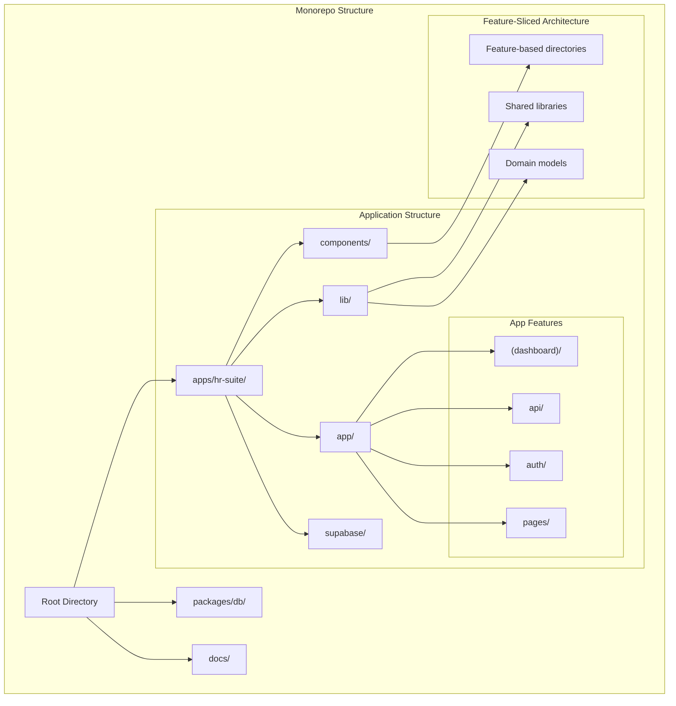
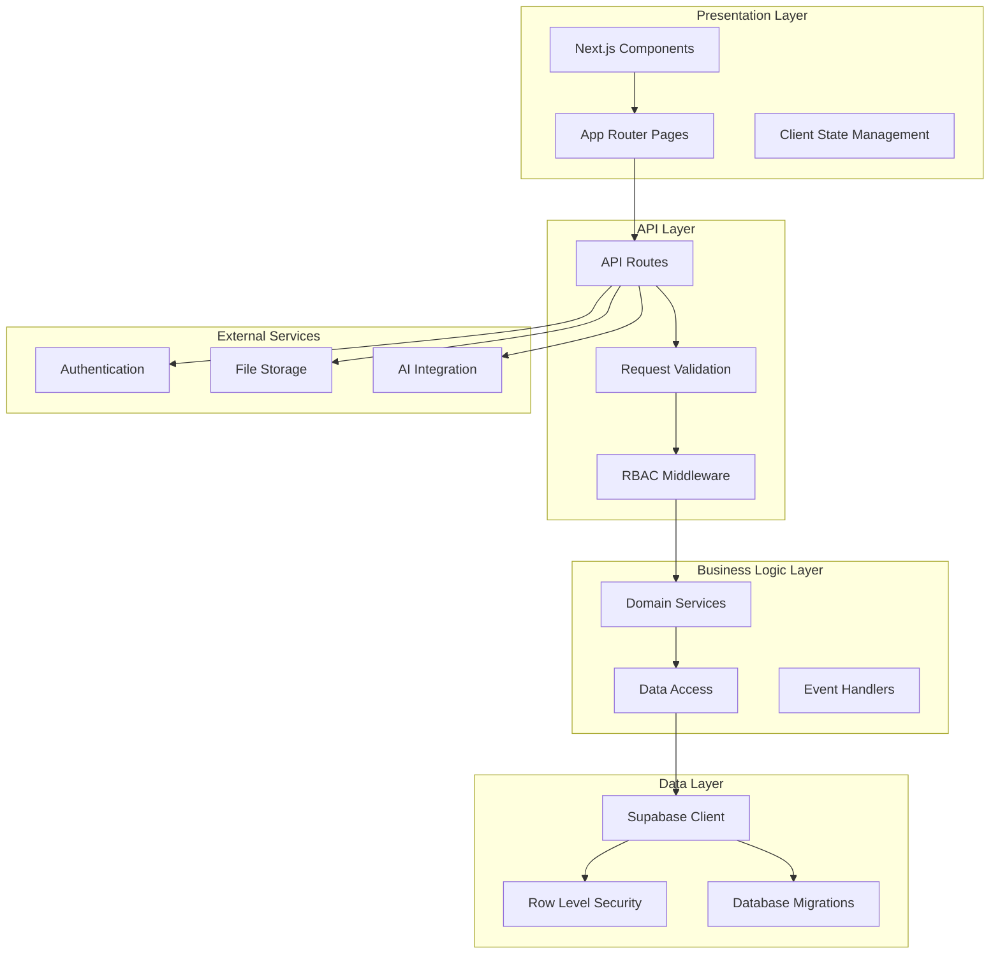
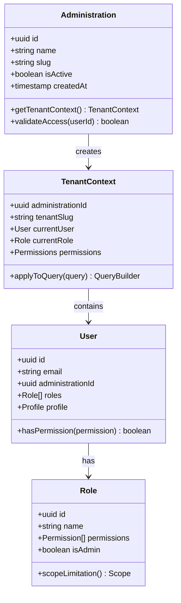
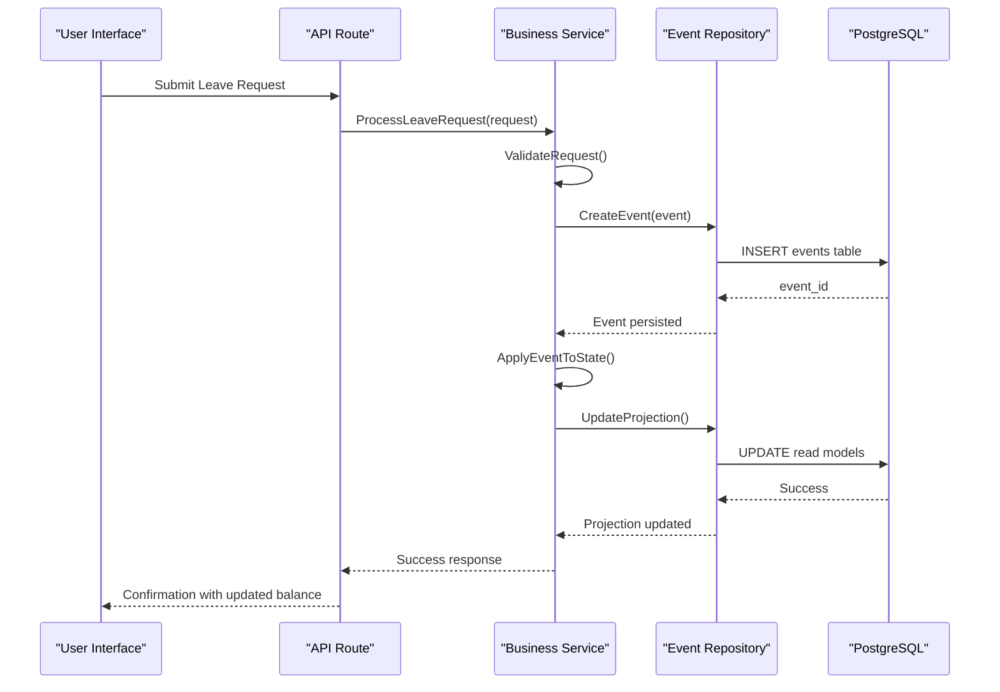
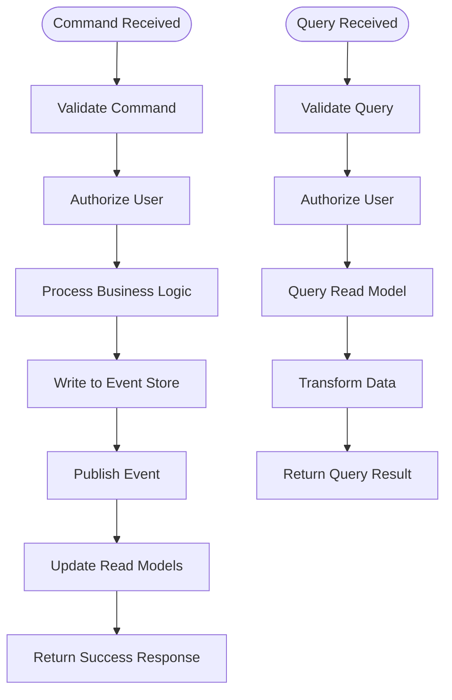
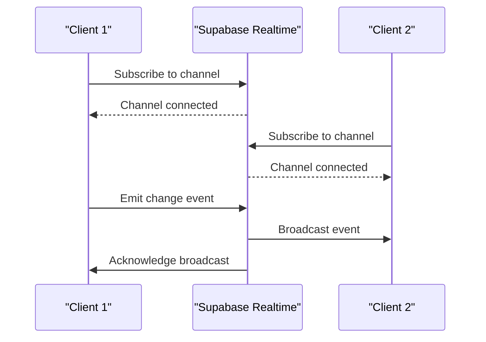
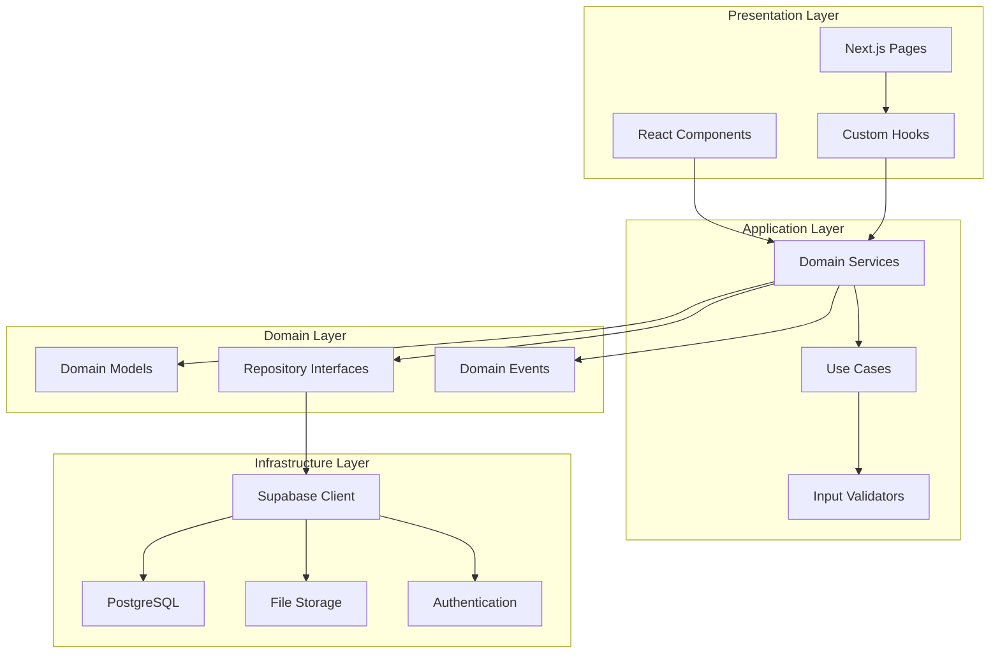

# Architecture Overview

<cite>
**Referenced Files in This Document**
- [apps/hr-suite/app/layout.tsx](file://apps/hr-suite/app/layout.tsx)
- [apps/hr-suite/next.config.ts](file://apps/hr-suite/next.config.ts)
- [apps/hr-suite/package.json](file://apps/hr-suite/package.json)
- [apps/hr-suite/supabase/config.toml](file://apps/hr-suite/supabase/config.toml)
- [apps/hr-suite/supabase/migrations/20260712124911_add_tenant_rbac_and_organization.sql](file://apps/hr-suite/supabase/migrations/20260712124911_add_tenant_rbac_and_organization.sql)
- [apps/hr-suite/supabase/migrations/20260714174305_add_multitenancy_administrations.sql](file://apps/hr-suite/supabase/migrations/20260714174305_add_multitenancy_administrations.sql)
- [apps/hr-suite/supabase/migrations/20260718120000_add_hr_change_event_projection.sql](file://apps/hr-suite/supabase/migrations/20260718120000_add_hr_change_event_projection.sql)
- [apps/hr-suite/lib/supabase/client.ts](file://apps/hr-suite/lib/supabase/client.ts)
- [apps/hr-suite/lib/auth/context.tsx](file://apps/hr-suite/lib/auth/context.tsx)
- [apps/hr-suite/app/api/employees/route.ts](file://apps/hr-suite/app/api/employees/route.ts)
- [apps/hr-suite/components/dashboard/dashboard-workspace.tsx](file://apps/hr-suite/components/dashboard/dashboard-workspace.tsx)
- [apps/hr-suite/components/employees/employee-list.tsx](file://apps/hr-suite/components/employees/employee-list.tsx)
- [apps/hr-suite/lib/employees/repository.ts](file://apps/hr-suite/lib/employees/repository.ts)
- [apps/hr-suite/lib/leave/engine.ts](file://apps/hr-suite/lib/leave/engine.ts)
- [apps/hr-suite/supabase/migrations/20260722142551_add_leave_engine_foundation.sql](file://apps/hr-suite/supabase/migrations/20260722142551_add_leave_engine_foundation.sql)
</cite>

## Table of Contents
1. [Introduction](#introduction)
2. [Project Structure](#project-structure)
3. [Core Components](#core-components)
4. [Architecture Overview](#architecture-overview)
5. [Detailed Component Analysis](#detailed-component-analysis)
6. [Dependency Analysis](#dependency-analysis)
7. [Performance Considerations](#performance-considerations)
8. [Troubleshooting Guide](#troubleshooting-guide)
9. [Conclusion](#conclusion)

## Introduction

LiquidHR is a comprehensive Human Resources management system built with modern web technologies, featuring a sophisticated multitenancy architecture that supports multiple organizations within a single deployment. The system employs a feature-sliced architecture pattern that promotes code organization by business domains rather than technical layers, enabling better maintainability and scalability.

The platform serves as a complete HR solution with core employee management, employment lifecycle tracking, leave management, organizational structure visualization, and advanced analytics capabilities. It leverages Next.js for the frontend framework, Supabase for backend services and database management, and PostgreSQL for data persistence with Row Level Security (RLS) policies ensuring tenant isolation.

## Project Structure

The LiquidHR application follows a monorepo structure with clear separation between the main application and supporting packages:

**Diagram sources**
- [apps/hr-suite/app/layout.tsx:1-50](file://apps/hr-suite/app/layout.tsx#L1-L50)
- [apps/hr-suite/components/dashboard/dashboard-workspace.tsx:1-100](file://apps/hr-suite/components/dashboard/dashboard-workspace.tsx#L1-L100)

**Section sources**
- [apps/hr-suite/app/layout.tsx:1-50](file://apps/hr-suite/app/layout.tsx#L1-L50)
- [apps/hr-suite/next.config.ts:1-100](file://apps/hr-suite/next.config.ts#L1-L100)

## Core Components

### Frontend Architecture

The frontend is built with Next.js 14+ using the App Router, implementing a feature-sliced architecture where components are organized by business domain rather than technical layer. Key frontend components include:

- **Dashboard System**: Dynamic dashboard workspace with widget composition and real-time updates
- **Employee Management**: Comprehensive employee CRUD operations with activity tracking
- **Leave Engine**: Sophisticated leave request processing with accrual calculations
- **Organization Chart**: Interactive organizational structure visualization
- **Settings Management**: Tenant-specific configuration and module toggles

### Backend Architecture

The backend leverages Supabase's serverless functions and PostgreSQL with Row Level Security for multi-tenant isolation. API routes follow RESTful conventions with TypeScript validation and error handling.

### Database Schema

The PostgreSQL database implements a sophisticated multitenancy model with administration boundaries, role-based access control (RBAC), and comprehensive audit trails through event sourcing patterns.

**Section sources**
- [apps/hr-suite/components/dashboard/dashboard-workspace.tsx:1-100](file://apps/hr-suite/components/dashboard/dashboard-workspace.tsx#L1-L100)
- [apps/hr-suite/components/employees/employee-list.tsx:1-150](file://apps/hr-suite/components/employees/employee-list.tsx#L1-L150)
- [apps/hr-suite/lib/employees/repository.ts:1-200](file://apps/hr-suite/lib/employees/repository.ts#L1-L200)

## Architecture Overview

LiquidHR implements a layered architecture with clear separation of concerns:

**Diagram sources**
- [apps/hr-suite/app/api/employees/route.ts:1-100](file://apps/hr-suite/app/api/employees/route.ts#L1-L100)
- [apps/hr-suite/lib/supabase/client.ts:1-100](file://apps/hr-suite/lib/supabase/client.ts#L1-L100)

### Technology Stack Decisions

**Frontend Framework**: Next.js was chosen for its server-side rendering capabilities, API route support, and excellent developer experience. The App Router provides better performance and streaming capabilities compared to the traditional Pages Router.

**Backend Platform**: Supabase offers a comprehensive backend-as-a-service solution with built-in authentication, real-time subscriptions, and PostgreSQL database management. This reduces infrastructure complexity while maintaining full control over the database schema and security policies.

**Database Strategy**: PostgreSQL with Row Level Security (RLS) enables robust multitenancy at the database level, ensuring data isolation between tenants without complex application-level filtering.

**State Management**: The application uses React Context and custom hooks for state management, avoiding heavy state management libraries in favor of simpler, more maintainable solutions.

**Section sources**
- [apps/hr-suite/next.config.ts:1-100](file://apps/hr-suite/next.config.ts#L1-L100)
- [apps/hr-suite/supabase/config.toml:1-50](file://apps/hr-suite/supabase/config.toml#L1-L50)

## Detailed Component Analysis

### Multitenancy Implementation

The multitenancy system is built around the concept of "administrations" - isolated organizational units that share the same application instance but maintain complete data isolation:

**Diagram sources**
- [apps/hr-suite/supabase/migrations/20260714174305_add_multitenancy_administrations.sql:1-100](file://apps/hr-suite/supabase/migrations/20260714174305_add_multitenancy_administrations.sql#L1-L100)
- [apps/hr-suite/supabase/migrations/20260712124911_add_tenant_rbac_and_organization.sql:1-150](file://apps/hr-suite/supabase/migrations/20260712124911_add_tenant_rbac_and_organization.sql#L1-L150)

### Event Sourcing Pattern

The system implements event sourcing for critical business processes, particularly in leave management and employment lifecycle changes:

**Diagram sources**
- [apps/hr-suite/supabase/migrations/20260718120000_add_hr_change_event_projection.sql:1-100](file://apps/hr-suite/supabase/migrations/20260718120000_add_hr_change_event_projection.sql#L1-L100)
- [apps/hr-suite/lib/leave/engine.ts:1-200](file://apps/hr-suite/lib/leave/engine.ts#L1-L200)

### CQRS Implementation

Command Query Responsibility Segregation (CQRS) is implemented to separate read and write operations, improving performance and scalability:

**Diagram sources**
- [apps/hr-suite/app/api/employees/route.ts:1-100](file://apps/hr-suite/app/api/employees/route.ts#L1-L100)
- [apps/hr-suite/lib/employees/repository.ts:1-200](file://apps/hr-suite/lib/employees/repository.ts#L1-L200)

### Real-time Features

Real-time functionality is implemented using Supabase's real-time subscriptions for live updates across the application:

**Section sources**
- [apps/hr-suite/components/dashboard/dashboard-widget-stream.tsx:1-100](file://apps/hr-suite/components/dashboard/dashboard-widget-stream.tsx#L1-L100)
- [apps/hr-suite/lib/hr-events/event-bus.ts:1-150](file://apps/hr-suite/lib/hr-events/event-bus.ts#L1-L150)

## Dependency Analysis

The application follows clean architecture principles with clear dependency boundaries:

**Diagram sources**
- [apps/hr-suite/lib/supabase/client.ts:1-100](file://apps/hr-suite/lib/supabase/client.ts#L1-L100)
- [apps/hr-suite/lib/auth/context.tsx:1-100](file://apps/hr-suite/lib/auth/context.tsx#L1-L100)

### Cross-Cutting Concerns

**Security**: Row Level Security (RLS) policies ensure data isolation at the database level, while JWT-based authentication provides secure user sessions.

**Authentication**: Supabase Auth handles user authentication with support for various providers and custom authentication flows.

**Authorization**: Role-Based Access Control (RBAC) with granular permissions ensures users can only access resources they're authorized to view or modify.

**Audit Trail**: Event sourcing provides comprehensive audit trails for all critical business operations.

**Section sources**
- [apps/hr-suite/supabase/migrations/20260712124911_add_tenant_rbac_and_organization.sql:1-150](file://apps/hr-suite/supabase/migrations/20260712124911_add_tenant_rbac_and_organization.sql#L1-L150)
- [apps/hr-suite/lib/security/policies.ts:1-200](file://apps/hr-suite/lib/security/policies.ts#L1-L200)

## Performance Considerations

### Database Optimization

The database schema includes strategic indexing for common query patterns, partitioning for large tables, and materialized views for complex aggregations. Row Level Security policies are optimized with appropriate indexes to minimize performance impact.

### Caching Strategy

Multi-level caching is implemented including:
- Client-side caching with React Query for API responses
- Server-side caching for expensive computations
- Database query result caching for frequently accessed data

### Scalability Patterns

The application is designed for horizontal scaling with:
- Stateless API routes that can be deployed across multiple instances
- Database connection pooling for efficient resource utilization
- CDN integration for static asset delivery
- Real-time features scaled through Supabase's distributed infrastructure

**Section sources**
- [apps/hr-suite/supabase/migrations/20260715121304_optimize_employee_core_indexes.sql:1-100](file://apps/hr-suite/supabase/migrations/20260715121304_optimize_employee_core_indexes.sql#L1-L100)
- [apps/hr-suite/next.config.ts:1-100](file://apps/hr-suite/next.config.ts#L1-L100)

## Troubleshooting Guide

### Common Issues and Solutions

**Multitenancy Data Isolation**: When experiencing data leakage between tenants, verify RLS policies are correctly configured and that the tenant context is properly established in each request.

**Authentication Problems**: Check Supabase session management and ensure proper JWT token handling in API routes.

**Performance Issues**: Monitor database query performance using EXPLAIN ANALYZE and identify slow queries that may need optimization.

**Real-time Connection Issues**: Verify WebSocket connections are maintained and handle reconnection logic appropriately.

### Debugging Tools

The application includes comprehensive logging throughout the request lifecycle, error boundary components for client-side error handling, and development tools for monitoring API performance.

**Section sources**
- [apps/hr-suite/lib/debug/logging.ts:1-100](file://apps/hr-suite/lib/debug/logging.ts#L1-L100)
- [apps/hr-suite/components/shared/error-boundary.tsx:1-100](file://apps/hr-suite/components/shared/error-boundary.tsx#L1-L100)

## Conclusion

LiquidHR demonstrates a well-architected enterprise HR system that successfully balances complexity with maintainability. The implementation of feature-sliced architecture, combined with modern cloud-native technologies like Supabase and Next.js, provides a solid foundation for scalable HR management.

The multitenancy implementation ensures data isolation while sharing infrastructure costs, and the event sourcing pattern provides auditability and flexibility for future enhancements. The system's design choices reflect careful consideration of both current requirements and future scalability needs.

Key architectural strengths include:
- Clear separation of concerns through feature-sliced architecture
- Robust multitenancy with database-level isolation
- Comprehensive audit trails through event sourcing
- Real-time capabilities for collaborative workflows
- Scalable infrastructure leveraging cloud-native services

This architecture provides a strong foundation for continued evolution of the HR management platform while maintaining high standards for security, performance, and maintainability.