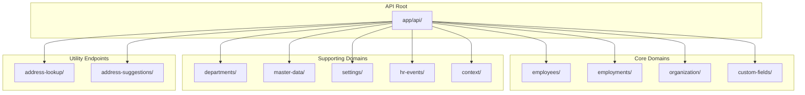
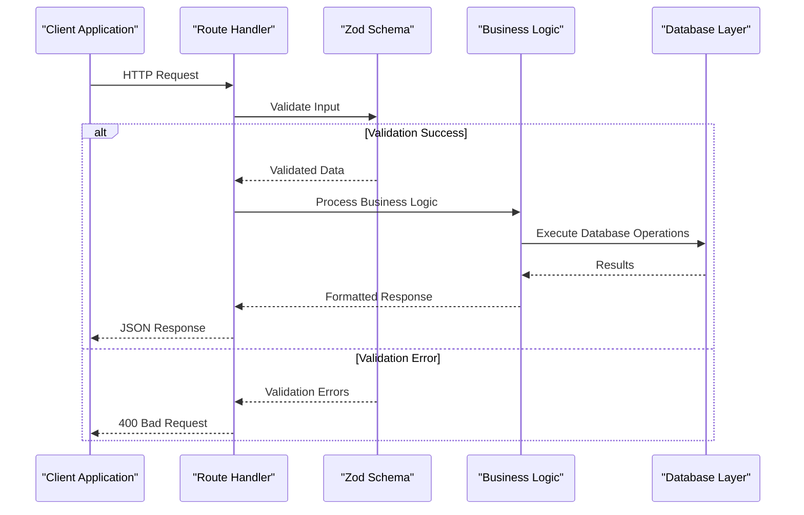
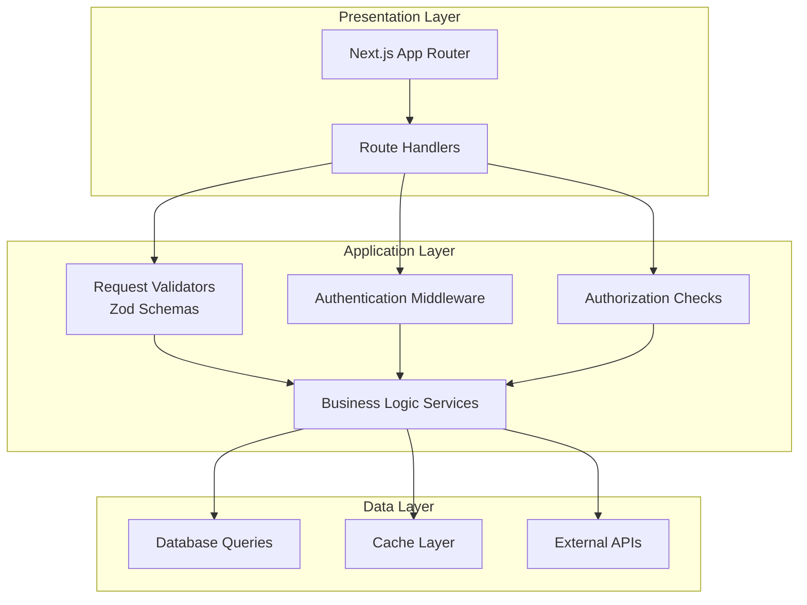
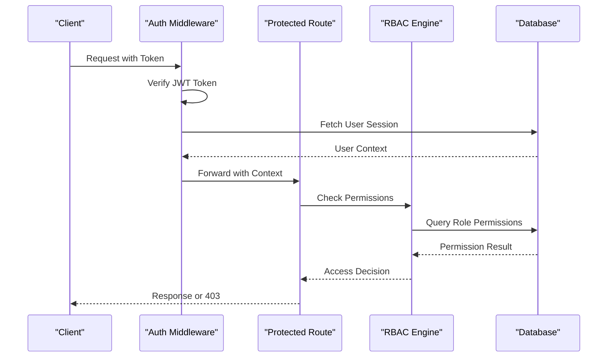
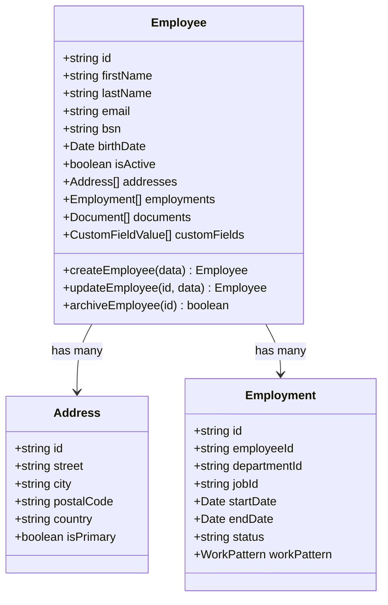
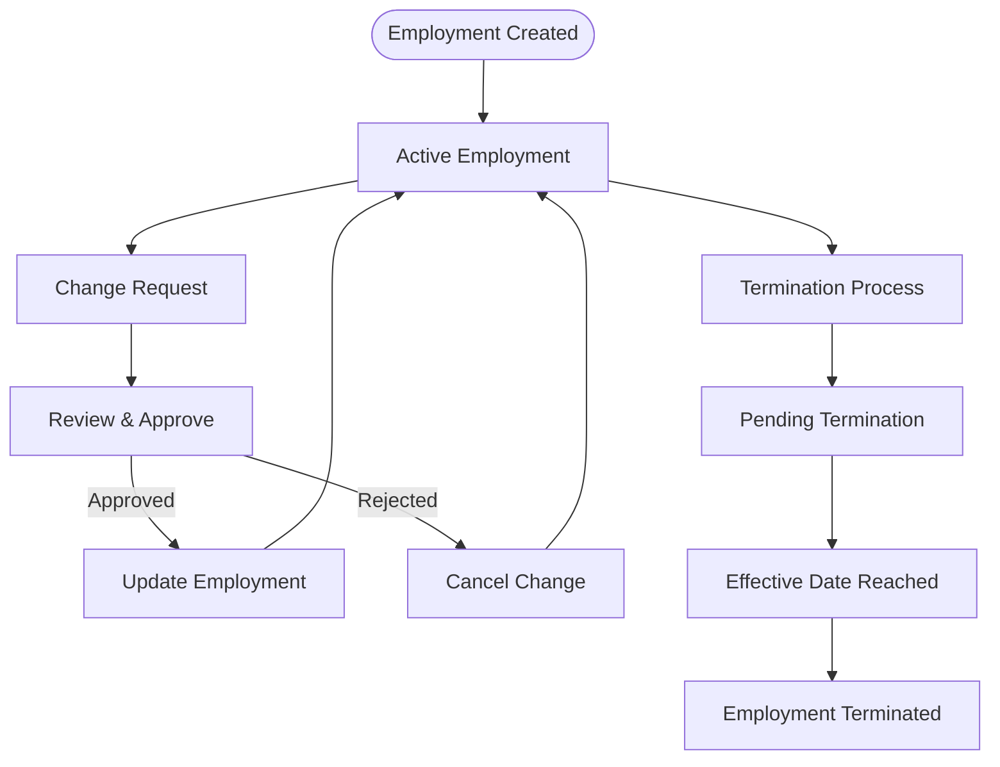
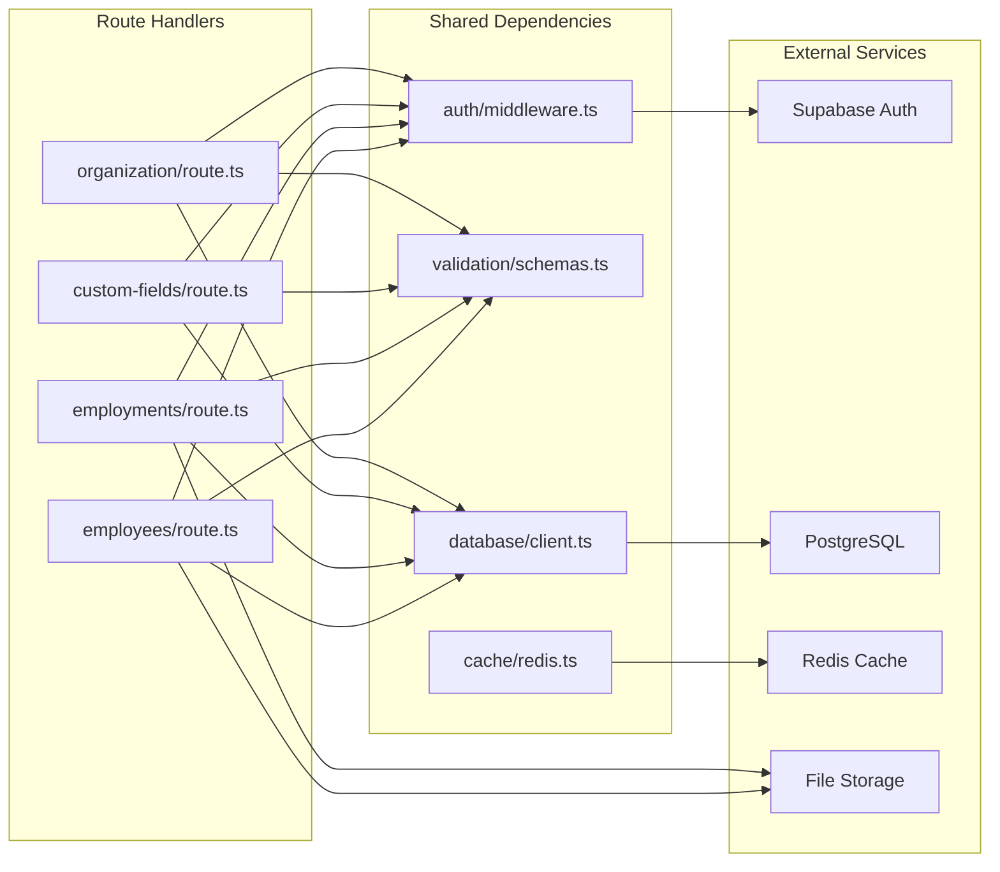
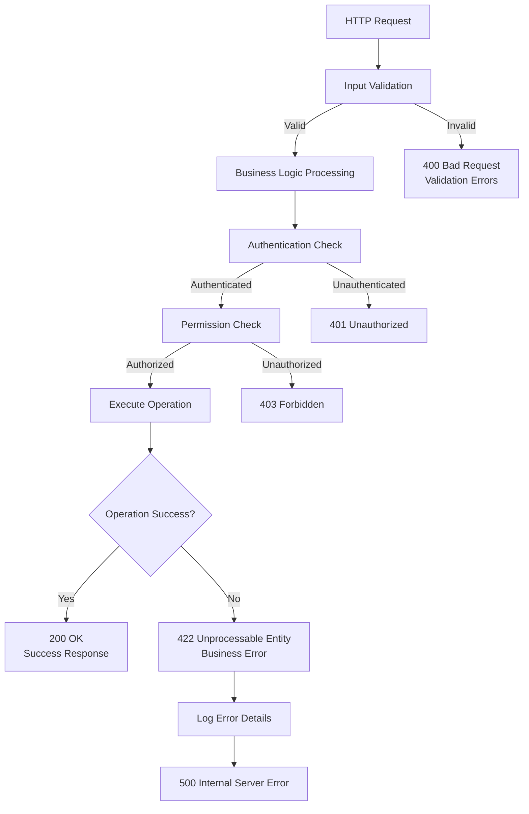

# API Routes Architecture

<cite>
**Referenced Files in This Document**
- [apps/hr-suite/app/api/employees/route.ts](file://apps/hr-suite/app/api/employees/route.ts)
- [apps/hr-suite/app/api/employees/[employeeId]/route.ts](file://apps/hr-suite/app/api/employees/[employeeId]/route.ts)
- [apps/hr-suite/app/api/employments/[employmentId]/route.ts](file://apps/hr-suite/app/api/employments/[employmentId]/route.ts)
- [apps/hr-suite/app/api/custom-fields/route.ts](file://apps/hr-suite/app/api/custom-fields/route.ts)
- [apps/hr-suite/app/api/custom-fields/[definitionId]/route.ts](file://apps/hr-suite/app/api/custom-fields/[definitionId]/route.ts)
- [apps/hr-suite/app/api/departments/route.ts](file://apps/hr-suite/app/api/departments/route.ts)
- [apps/hr-suite/app/api/departments/[departmentId]/route.ts](file://apps/hr-suite/app/api/departments/[departmentId]/route.ts)
- [apps/hr-suite/app/api/master-data/jobs/route.ts](file://apps/hr-suite/app/api/master-data/jobs/route.ts)
- [apps/hr-suite/app/api/settings/holidays/route.ts](file://apps/hr-suite/app/api/settings/holidays/route.ts)
- [apps/hr-suite/app/api/hr-events/route.ts](file://apps/hr-suite/app/api/hr-events/route.ts)
- [apps/hr-suite/app/api/context/route.ts](file://apps/hr-suite/app/api/context/route.ts)
- [apps/hr-suite/app/api/address-lookup/route.ts](file://apps/hr-suite/app/api/address-lookup/route.ts)
- [apps/hr-suite/app/auth/callback/route.ts](file://apps/hr-suite/app/auth/callback/route.ts)
- [apps/hr-suite/app/layout.tsx](file://apps/hr-suite/app/layout.tsx)
</cite>

## Table of Contents
1. [Introduction](#introduction)
2. [Project Structure](#project-structure)
3. [Core Components](#core-components)
4. [Architecture Overview](#architecture-overview)
5. [Detailed Component Analysis](#detailed-component-analysis)
6. [Dependency Analysis](#dependency-analysis)
7. [Performance Considerations](#performance-considerations)
8. [Troubleshooting Guide](#troubleshooting-guide)
9. [Conclusion](#conclusion)

## Introduction

LiquidHR is a comprehensive Human Resource Management System built with Next.js App Router that implements a domain-driven API architecture. The application follows modern RESTful design patterns with feature-based organization, providing a robust foundation for HR operations including employee management, employment lifecycle, organizational structures, custom fields, and various HR workflows.

The API routes are organized by business domains rather than technical layers, promoting clear separation of concerns and maintainable code structure. Each domain encapsulates its own CRUD operations, validation logic, and business rules while maintaining consistency across the entire application.

## Project Structure

The API routes follow a feature-based organization pattern where each major business domain has its own directory containing route handlers:

**Diagram sources**
- [apps/hr-suite/app/api/employees/route.ts](file://apps/hr-suite/app/api/employees/route.ts)
- [apps/hr-suite/app/api/employments/[employmentId]/route.ts](file://apps/hr-suite/app/api/employments/[employmentId]/route.ts)
- [apps/hr-suite/app/api/custom-fields/route.ts](file://apps/hr-suite/app/api/custom-fields/route.ts)

**Section sources**
- [apps/hr-suite/app/api/employees/route.ts](file://apps/hr-suite/app/api/employees/route.ts)
- [apps/hr-suite/app/api/employments/[employmentId]/route.ts](file://apps/hr-suite/app/api/employments/[employmentId]/route.ts)

## Core Components

### Domain-Based Route Organization

Each business domain implements a consistent pattern for handling HTTP requests:

#### Employee Management Domain
The employees domain provides comprehensive CRUD operations for employee records with nested resources for employments, documents, addresses, and custom fields.

#### Employment Lifecycle Domain  
The employments domain manages the complete employment lifecycle including changes, terminations, work patterns, and timeline tracking.

#### Custom Fields Domain
The custom-fields domain enables dynamic field configuration and value management for flexible data modeling.

#### Organization Domain
The organization domain handles hierarchical structures including departments, roles, assignments, and management relationships.

### Request/Response Handling Patterns

All API endpoints follow standardized patterns for request processing and response formatting:

**Diagram sources**
- [apps/hr-suite/app/api/employees/route.ts](file://apps/hr-suite/app/api/employees/route.ts)
- [apps/hr-suite/app/api/custom-fields/route.ts](file://apps/hr-suite/app/api/custom-fields/route.ts)

**Section sources**
- [apps/hr-suite/app/api/employees/route.ts](file://apps/hr-suite/app/api/employees/route.ts)
- [apps/hr-suite/app/api/custom-fields/route.ts](file://apps/hr-suite/app/api/custom-fields/route.ts)

## Architecture Overview

The LiquidHR API architecture implements a layered approach with clear separation between routing, validation, business logic, and data access:

**Diagram sources**
- [apps/hr-suite/app/layout.tsx](file://apps/hr-suite/app/layout.tsx)
- [apps/hr-suite/app/auth/callback/route.ts](file://apps/hr-suite/app/auth/callback/route.ts)
- [apps/hr-suite/app/api/context/route.ts](file://apps/hr-suite/app/api/context/route.ts)

### Authentication and Authorization Flow

The authentication middleware integrates with Supabase Auth to provide secure access control:

**Diagram sources**
- [apps/hr-suite/app/auth/callback/route.ts](file://apps/hr-suite/app/auth/callback/route.ts)
- [apps/hr-suite/app/api/context/route.ts](file://apps/hr-suite/app/api/context/route.ts)

## Detailed Component Analysis

### Employee Management API

The employee management system provides comprehensive CRUD operations with advanced filtering, pagination, and nested resource management:

#### Core Employee Operations
- **GET /api/employees**: List employees with filtering and pagination
- **POST /api/employees**: Create new employee records
- **GET /api/employees/[employeeId]**: Retrieve specific employee details
- **PUT /api/employees/[employeeId]**: Update employee information
- **DELETE /api/employees/[employeeId]**: Archive or delete employee records

#### Nested Resources
- **Employments**: Employment history and current status
- **Documents**: Employee document management
- **Addresses**: Multiple address support with validation
- **Custom Fields**: Dynamic field values
- **Bank Accounts**: Financial information management
- **Relations**: Family and emergency contact relationships

**Diagram sources**
- [apps/hr-suite/app/api/employees/route.ts](file://apps/hr-suite/app/api/employees/route.ts)
- [apps/hr-suite/app/api/employees/[employeeId]/route.ts](file://apps/hr-suite/app/api/employees/[employeeId]/route.ts)

### Employment Lifecycle Management

The employment domain manages the complete employment lifecycle with change tracking and audit trails:

#### Employment Operations
- **GET /api/employments/[employmentId]**: Retrieve employment details
- **PUT /api/employments/[employmentId]**: Update employment terms
- **POST /api/employments/[employmentId]/changes**: Record employment changes
- **POST /api/employments/[employmentId]/termination**: Process termination
- **GET /api/employments/[employmentId]/timeline**: View employment timeline

#### Change Management
The system tracks all employment changes with detailed audit trails, supporting compliance requirements and historical analysis.

**Diagram sources**
- [apps/hr-suite/app/api/employments/[employmentId]/route.ts](file://apps/hr-suite/app/api/employments/[employmentId]/route.ts)

### Custom Fields System

The custom fields implementation provides flexible data modeling capabilities:

#### Field Definition Management
- **GET /api/custom-fields**: List all field definitions
- **POST /api/custom-fields**: Create new field definitions
- **GET /api/custom-fields/[definitionId]**: Get field definition details
- **PUT /api/custom-fields/[definitionId]**: Update field configuration

#### Value Management
Dynamic field values are stored separately from core entity data, allowing for schema evolution without database migrations.

### Master Data Management

Master data endpoints provide reference data management for jobs, departments, salary scales, and other organizational entities:

#### Job Catalog Management
- **GET /api/master-data/jobs**: List all job positions
- **POST /api/master-data/jobs**: Create new job positions
- **PUT /api/master-data/jobs/[jobId]**: Update job information

#### Department Management
- **GET /api/departments**: List organizational departments
- **POST /api/departments**: Create new departments
- **PUT /api/departments/[departmentId]**: Update department details

### Settings and Configuration

Settings endpoints manage application configuration including holidays, dashboard widgets, and module toggles:

#### Holiday Management
- **GET /api/settings/holidays**: List holiday configurations
- **POST /api/settings/holidays**: Add new holidays
- **PUT /api/settings/holidays/[holidayId]**: Update holiday settings

#### Module Configuration
- **GET /api/settings/modules**: Get module status
- **PUT /api/settings/modules**: Toggle module availability

## Dependency Analysis

The API routes demonstrate clear dependency patterns with well-defined boundaries between components:

**Diagram sources**
- [apps/hr-suite/app/api/employees/route.ts](file://apps/hr-suite/app/api/employees/route.ts)
- [apps/hr-suite/app/api/custom-fields/route.ts](file://apps/hr-suite/app/api/custom-fields/route.ts)
- [apps/hr-suite/app/api/context/route.ts](file://apps/hr-suite/app/api/context/route.ts)

### Authentication Integration

Authentication is handled through Supabase Auth with middleware integration:

- **JWT Token Validation**: All protected routes validate authentication tokens
- **Session Management**: User sessions are maintained across requests
- **Role-Based Access Control**: Fine-grained permissions based on user roles
- **Multi-tenancy Support**: Tenant isolation for data security

### Error Handling Strategy

The API implements comprehensive error handling with standardized response formats:

**Diagram sources**
- [apps/hr-suite/app/api/employees/route.ts](file://apps/hr-suite/app/api/employees/route.ts)
- [apps/hr-suite/app/api/custom-fields/route.ts](file://apps/hr-suite/app/api/custom-fields/route.ts)

## Performance Considerations

### Caching Strategies

The API implements multiple caching layers to optimize performance:

- **Query Result Caching**: Frequently accessed data cached in Redis
- **API Response Caching**: HTTP-level caching for static content
- **Database Query Optimization**: Indexed queries and connection pooling
- **CDN Integration**: Static assets served through CDN

### Rate Limiting

Rate limiting protects against abuse and ensures fair resource allocation:

- **Per-User Limits**: Individual request quotas per authenticated user
- **Global Limits**: Overall API throughput constraints
- **Endpoint-Specific Limits**: Different limits for resource-intensive operations
- **Sliding Window Algorithm**: Smooth rate limiting without burst penalties

### Pagination and Filtering

Large datasets are handled efficiently through:

- **Cursor-based Pagination**: Efficient navigation through large result sets
- **Field Selection**: Clients specify required fields only
- **Filter Optimization**: Database-level filtering with proper indexing
- **Sorting Controls**: Client-controlled sorting with allowed fields

## Troubleshooting Guide

### Common Issues and Solutions

#### Authentication Problems
- **Token Expiration**: Implement token refresh mechanisms
- **Permission Denied**: Verify user roles and resource ownership
- **Session Issues**: Clear browser cache and re-authenticate

#### Validation Errors
- **Schema Mismatches**: Ensure client data matches Zod schemas
- **Required Fields**: Validate all mandatory parameters
- **Data Types**: Check type compatibility between client and server

#### Performance Issues
- **Slow Queries**: Analyze database query plans and add indexes
- **Memory Usage**: Monitor memory consumption and optimize data loading
- **Network Latency**: Implement request batching and compression

### Debugging Techniques

- **Structured Logging**: Comprehensive logging with correlation IDs
- **Request Tracing**: End-to-end request flow monitoring
- **Error Tracking**: Centralized error collection and analysis
- **Performance Monitoring**: Real-time performance metrics collection

## Conclusion

LiquidHR's API routes architecture demonstrates a mature, production-ready implementation of Next.js App Router with domain-driven design principles. The system provides:

- **Clear Domain Boundaries**: Well-separated business domains with focused responsibilities
- **Consistent Patterns**: Standardized approaches to validation, error handling, and response formatting
- **Scalability Foundation**: Caching, rate limiting, and performance optimizations
- **Security First**: Comprehensive authentication, authorization, and data protection
- **Developer Experience**: Intuitive API design with comprehensive documentation

The architecture successfully balances flexibility with consistency, enabling rapid development while maintaining code quality and system reliability. The modular design supports future enhancements and scaling requirements while providing a solid foundation for HR management functionality.