# Authentication & Authorization

<cite>
**Referenced Files in This Document**
- [apps/hr-suite/app/auth/callback/route.ts](file://apps/hr-suite/app/auth/callback/route.ts)
- [apps/hr-suite/app/auth/reset-password/actions.ts](file://apps/hr-suite/app/auth/reset-password/actions.ts)
- [apps/hr-suite/app/auth/signout/route.ts](file://apps/hr-suite/app/auth/signout/route.ts)
- [apps/hr-suite/app/invite/[token]/actions.ts](file://apps/hr-suite/app/invite/[token]/actions.ts)
- [apps/hr-suite/app/api/context/administration/route.ts](file://apps/hr-suite/app/api/context/administration/route.ts)
- [apps/hr-suite/app/api/context/route.ts](file://apps/hr-suite/app/api/context/route.ts)
- [apps/hr-suite/app/api/invitations/route.ts](file://apps/hr-suite/app/api/invitations/route.ts)
- [apps/hr-suite/components/auth/auth-shell.tsx](file://apps/hr-suite/components/auth/auth-shell.tsx)
- [apps/hr-suite/components/auth/login-form.tsx](file://apps/hr-suite/components/auth/login-form.tsx)
- [apps/hr-suite/components/auth/password-reset-form.tsx](file://apps/hr-suite/components/auth/password-reset-form.tsx)
- [apps/hr-suite/components/auth/invitation-form.tsx](file://apps/hr-suite/components/auth/invitation-form.tsx)
- [apps/hr-suite/supabase/migrations/20260714174305_add_multitenancy_administrations.sql](file://apps/hr-suite/supabase/migrations/20260714174305_add_multitenancy_administrations.sql)
- [apps/hr-suite/supabase/migrations/20260714180142_enforce_administration_management_scope.sql](file://apps/hr-suite/supabase/migrations/20260714180142_enforce_administration_management_scope.sql)
- [apps/hr-suite/supabase/migrations/20260715064245_add_user_invitations.sql](file://apps/hr-suite/supabase/migrations/20260715064245_add_user_invitations.sql)
- [apps/hr-suite/supabase/migrations/20260715064924_harden_user_invitation_acceptance.sql](file://apps/hr-suite/supabase/migrations/2026064924_harden_user_invitation_acceptance.sql)
- [apps/hr-suite/supabase/migrations/20260715131230_seed_custom_fields_and_tenant_roles.sql](file://apps/hr-suite/supabase/migrations/20260715131230_seed_custom_fields_and_tenant_roles.sql)
- [apps/hr-suite/supabase/migrations/20260724112407_add_role_assignment_scope.sql](file://apps/hr-suite/supabase/migrations/20260724112407_add_role_assignment_scope.sql)
- [apps/hr-suite/supabase/migrations/20260724160000_add_employee_activity_entries.sql](file://apps/hr-suite/supabase/migrations/20260724160000_add_employee_activity_entries.sql)
- [apps/hr-suite/supabase/migrations/20260724172716_harden_employee_activity_entries.sql](file://apps/hr-suite/supabase/migrations/20260724172716_harden_employee_activity_entries.sql)
- [apps/hr-suite/supabase/tests/user_invitation_isolation.sql](file://apps/hr-suite/supabase/tests/user_invitation_isolation.sql)
- [apps/hr-suite/supabase/tests/multitenancy_isolation.sql](file://apps/hr-suite/supabase/tests/multitenancy_isolation.sql)
- [apps/hr-suite/supabase/config.toml](file://apps/hr-suite/supabase/config.toml)
- [apps/hr-suite/proxy.ts](file://apps/hr-suite/proxy.ts)
</cite>

## Table of Contents
1. [Introduction](#introduction)
2. [Project Structure](#project-structure)
3. [Core Components](#core-components)
4. [Architecture Overview](#architecture-overview)
5. [Detailed Component Analysis](#detailed-component-analysis)
6. [Dependency Analysis](#dependency-analysis)
7. [Performance Considerations](#performance-considerations)
8. [Troubleshooting Guide](#troubleshooting-guide)
9. [Conclusion](#conclusion)
10. [Appendices](#appendices)

## Introduction
This document explains LiquidHR’s authentication and authorization system with a focus on Supabase Auth integration, JWT handling, session management, role-based access control (RBAC), Row Level Security (RLS), multitenancy security model, administration scope isolation, user invitation workflow, API route protection, custom permissions, password reset flows, email verification, audit logging, security monitoring, and compliance considerations for HR data protection. It is designed to be accessible to both technical and non-technical readers while providing code-level references for implementation details.

## Project Structure
The authentication and authorization features are implemented across Next.js App Router routes, server actions, UI components, and Supabase migrations and tests:
- Authentication entry points and callbacks live under app/auth and app/invite.
- API routes enforce authorization and context resolution for tenant and administration scoping.
- Supabase migrations define RBAC tables, RLS policies, and audit logging structures.
- Tests validate isolation boundaries for invitations and multitenancy.

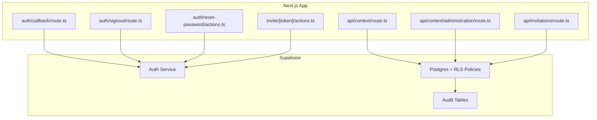

**Diagram sources**
- [apps/hr-suite/app/auth/callback/route.ts](file://apps/hr-suite/app/auth/callback/route.ts)
- [apps/hr-suite/app/auth/signout/route.ts](file://apps/hr-suite/app/auth/signout/route.ts)
- [apps/hr-suite/app/auth/reset-password/actions.ts](file://apps/hr-suite/app/auth/reset-password/actions.ts)
- [apps/hr-suite/app/invite/[token]/actions.ts](file://apps/hr-suite/app/invite/[token]/actions.ts)
- [apps/hr-suite/app/api/context/route.ts](file://apps/hr-suite/app/api/context/route.ts)
- [apps/hr-suite/app/api/context/administration/route.ts](file://apps/hr-suite/app/api/context/administration/route.ts)
- [apps/hr-suite/app/api/invitations/route.ts](file://apps/hr-suite/app/api/invitations/route.ts)
- [apps/hr-suite/supabase/migrations/20260714174305_add_multitenancy_administrations.sql](file://apps/hr-suite/supabase/migrations/20260714174305_add_multitenancy_administrations.sql)
- [apps/hr-suite/supabase/migrations/20260715064245_add_user_invitations.sql](file://apps/hr-suite/supabase/migrations/20260715064245_add_user_invitations.sql)
- [apps/hr-suite/supabase/migrations/20260724160000_add_employee_activity_entries.sql](file://apps/hr-suite/supabase/migrations/20260724160000_add_employee_activity_entries.sql)

**Section sources**
- [apps/hr-suite/app/auth/callback/route.ts](file://apps/hr-suite/app/auth/callback/route.ts)
- [apps/hr-suite/app/auth/signout/route.ts](file://apps/hr-suite/app/auth/signout/route.ts)
- [apps/hr-suite/app/auth/reset-password/actions.ts](file://apps/hr-suite/app/auth/reset-password/actions.ts)
- [apps/hr-suite/app/invite/[token]/actions.ts](file://apps/hr-suite/app/invite/[token]/actions.ts)
- [apps/hr-suite/app/api/context/route.ts](file://apps/hr-suite/app/api/context/route.ts)
- [apps/hr-suite/app/api/context/administration/route.ts](file://apps/hr-suite/app/api/context/administration/route.ts)
- [apps/hr-suite/app/api/invitations/route.ts](file://apps/hr-suite/app/api/invitations/route.ts)

## Core Components
- Supabase Auth integration: Handles sign-in, callback processing, and session establishment via Next.js API routes and server actions.
- JWT token handling: Relies on Supabase client-side SDK to manage tokens and sessions; server routes validate requests using Supabase middleware or service keys where appropriate.
- Session management: Centralized through Supabase Auth sessions; sign-out clears local state and invalidates the session.
- RBAC and RLS: Enforced at the database layer with policies that restrict row access based on roles, tenants, and administrations.
- Multitenancy and administration scope: Users belong to organizations and can be scoped to specific administrations within an organization.
- User invitation workflow: Secure acceptance flow with token validation and isolation checks.

**Section sources**
- [apps/hr-suite/app/auth/callback/route.ts](file://apps/hr-suite/app/auth/callback/route.ts)
- [apps/hr-suite/app/auth/signout/route.ts](file://apps/hr-suite/app/auth/signout/route.ts)
- [apps/hr-suite/app/auth/reset-password/actions.ts](file://apps/hr-suite/app/auth/reset-password/actions.ts)
- [apps/hr-suite/app/invite/[token]/actions.ts](file://apps/hr-suite/app/invite/[token]/actions.ts)
- [apps/hr-suite/app/api/context/route.ts](file://apps/hr-suite/app/api/context/route.ts)
- [apps/hr-suite/app/api/context/administration/route.ts](file://apps/hr-suite/app/api/context/administration/route.ts)
- [apps/hr-suite/supabase/migrations/20260714174305_add_multitenancy_administrations.sql](file://apps/hr-suite/supabase/migrations/20260714174305_add_multitenancy_administrations.sql)
- [apps/hr-suite/supabase/migrations/20260714180142_enforce_administration_management_scope.sql](file://apps/hr-suite/supabase/migrations/20260714180142_enforce_administration_management_scope.sql)
- [apps/hr-suite/supabase/migrations/20260715064245_add_user_invitations.sql](file://apps/hr-suite/supabase/migrations/20260715064245_add_user_invitations.sql)
- [apps/hr-suite/supabase/migrations/20260715064924_harden_user_invitation_acceptance.sql](file://apps/hr-suite/supabase/migrations/20260715064924_harden_user_invitation_acceptance.sql)

## Architecture Overview
LiquidHR uses Supabase Auth for identity and session management, Next.js API routes for authorization logic, and Postgres RLS for fine-grained data access control. The architecture ensures that:
- Authentication occurs via Supabase and redirects through the callback route.
- Context resolution determines the active tenant and administration scope.
- RBAC policies govern what resources a user can access within their scope.
- Audit events are recorded for sensitive operations.

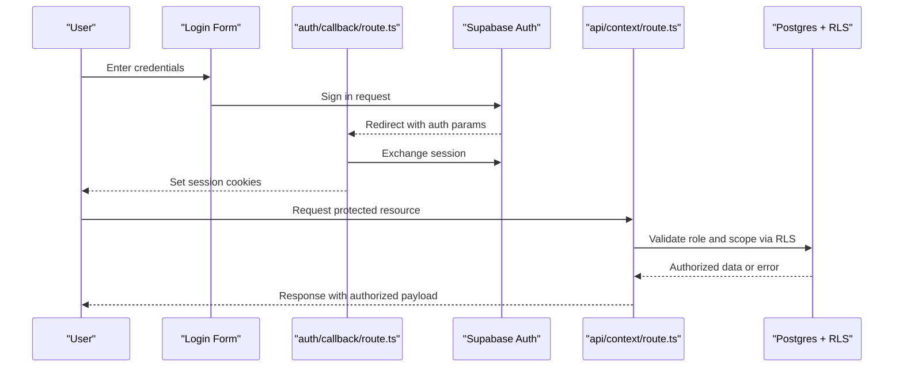

**Diagram sources**
- [apps/hr-suite/components/auth/login-form.tsx](file://apps/hr-suite/components/auth/login-form.tsx)
- [apps/hr-suite/app/auth/callback/route.ts](file://apps/hr-suite/app/auth/callback/route.ts)
- [apps/hr-suite/app/api/context/route.ts](file://apps/hr-suite/app/api/context/route.ts)
- [apps/hr-suite/supabase/migrations/20260714174305_add_multitenancy_administrations.sql](file://apps/hr-suite/supabase/migrations/20260714174305_add_multitenancy_administrations.sql)

## Detailed Component Analysis

### Authentication Callback and Session Establishment
- Purpose: Finalize login by exchanging Supabase auth parameters, establishing a session, and redirecting to the application dashboard.
- Key behaviors: Validates callback state, sets secure cookies, and initializes client session.

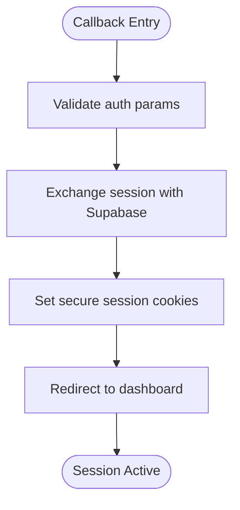

**Diagram sources**
- [apps/hr-suite/app/auth/callback/route.ts](file://apps/hr-suite/app/auth/callback/route.ts)

**Section sources**
- [apps/hr-suite/app/auth/callback/route.ts](file://apps/hr-suite/app/auth/callback/route.ts)

### Sign Out Flow
- Purpose: Invalidate the current session and clear local state.
- Key behaviors: Calls Supabase sign out, removes cookies, and redirects to login.

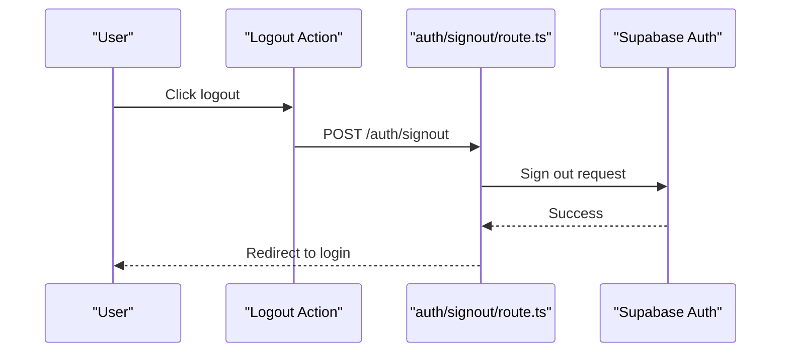

**Diagram sources**
- [apps/hr-suite/app/auth/signout/route.ts](file://apps/hr-suite/app/auth/signout/route.ts)

**Section sources**
- [apps/hr-suite/app/auth/signout/route.ts](file://apps/hr-suite/app/auth/signout/route.ts)

### Password Reset Flow
- Purpose: Allow users to securely reset passwords via email confirmation.
- Key behaviors: Initiates reset, verifies email, updates password, and logs the event.

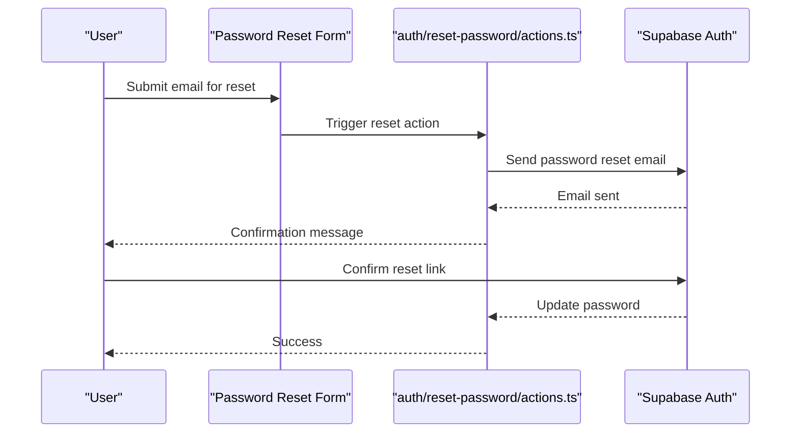

**Diagram sources**
- [apps/hr-suite/components/auth/password-reset-form.tsx](file://apps/hr-suite/components/auth/password-reset-form.tsx)
- [apps/hr-suite/app/auth/reset-password/actions.ts](file://apps/hr-suite/app/auth/reset-password/actions.ts)

**Section sources**
- [apps/hr-suite/components/auth/password-reset-form.tsx](file://apps/hr-suite/components/auth/password-reset-form.tsx)
- [apps/hr-suite/app/auth/reset-password/actions.ts](file://apps/hr-suite/app/auth/reset-password/actions.ts)

### User Invitation Workflow
- Purpose: Invite new users to join an organization and accept invitations securely.
- Key behaviors: Creates invitation records, validates tokens, enforces isolation, and assigns initial roles/scopes.

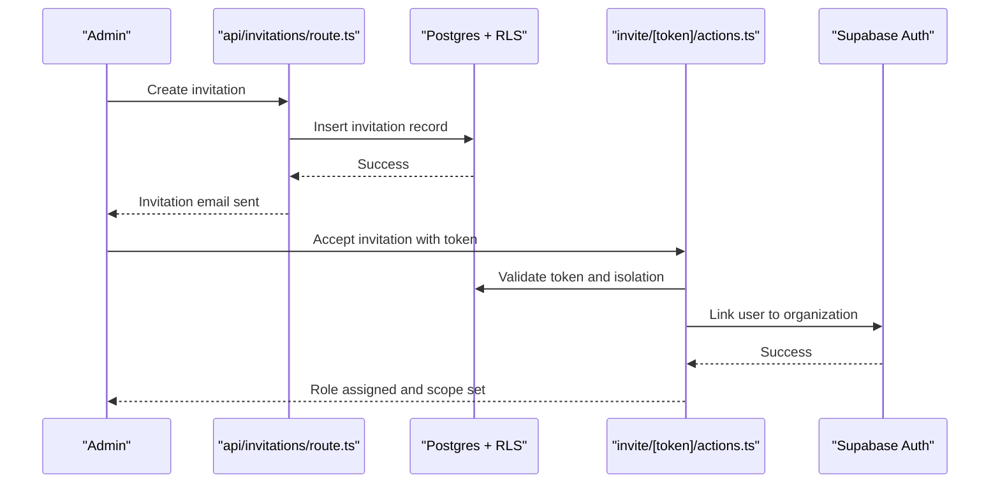

**Diagram sources**
- [apps/hr-suite/app/api/invitations/route.ts](file://apps/hr-suite/app/api/invitations/route.ts)
- [apps/hr-suite/app/invite/[token]/actions.ts](file://apps/hr-suite/app/invite/[token]/actions.ts)
- [apps/hr-suite/supabase/migrations/20260715064245_add_user_invitations.sql](file://apps/hr-suite/supabase/migrations/20260715064245_add_user_invitations.sql)
- [apps/hr-suite/supabase/migrations/20260715064924_harden_user_invitation_acceptance.sql](file://apps/hr-suite/supabase/migrations/20260715064924_harden_user_invitation_acceptance.sql)

**Section sources**
- [apps/hr-suite/app/api/invitations/route.ts](file://apps/hr-suite/app/api/invitations/route.ts)
- [apps/hr-suite/app/invite/[token]/actions.ts](file://apps/hr-suite/app/invite/[token]/actions.ts)
- [apps/hr-suite/supabase/migrations/20260715064245_add_user_invitations.sql](file://apps/hr-suite/supabase/migrations/20260715064245_add_user_invitations.sql)
- [apps/hr-suite/supabase/migrations/20260715064924_harden_user_invitation_acceptance.sql](file://apps/hr-suite/supabase/migrations/20260715064924_harden_user_invitation_acceptance.sql)

### Context Resolution and Administration Scope
- Purpose: Determine the active tenant and administration scope for authenticated users.
- Key behaviors: Resolves context from session and user roles, enforces scope constraints, and returns authorized context.

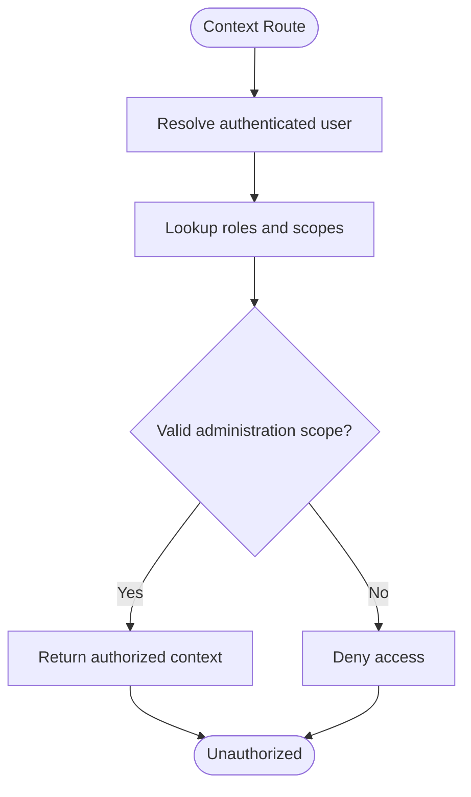

**Diagram sources**
- [apps/hr-suite/app/api/context/route.ts](file://apps/hr-suite/app/api/context/route.ts)
- [apps/hr-suite/app/api/context/administration/route.ts](file://apps/hr-suite/app/api/context/administration/route.ts)
- [apps/hr-suite/supabase/migrations/20260714174305_add_multitenancy_administrations.sql](file://apps/hr-suite/supabase/migrations/20260714174305_add_multitenancy_administrations.sql)
- [apps/hr-suite/supabase/migrations/20260714180142_enforce_administration_management_scope.sql](file://apps/hr-suite/supabase/migrations/20260714180142_enforce_administration_management_scope.sql)

**Section sources**
- [apps/hr-suite/app/api/context/route.ts](file://apps/hr-suite/app/api/context/route.ts)
- [apps/hr-suite/app/api/context/administration/route.ts](file://apps/hr-suite/app/api/context/administration/route.ts)
- [apps/hr-suite/supabase/migrations/20260714174305_add_multitenancy_administrations.sql](file://apps/hr-suite/supabase/migrations/20260714174305_add_multitenancy_administrations.sql)
- [apps/hr-suite/supabase/migrations/20260714180142_enforce_administration_management_scope.sql](file://apps/hr-suite/supabase/migrations/20260714180142_enforce_administration_management_scope.sql)

### RBAC Implementation and Permission Checking
- Roles and scopes are defined and enforced via database policies and role assignments.
- Permission checks occur at the API layer and are backed by RLS policies ensuring row-level isolation.
- Custom permissions can be modeled as role-scoped capabilities and validated in server routes.

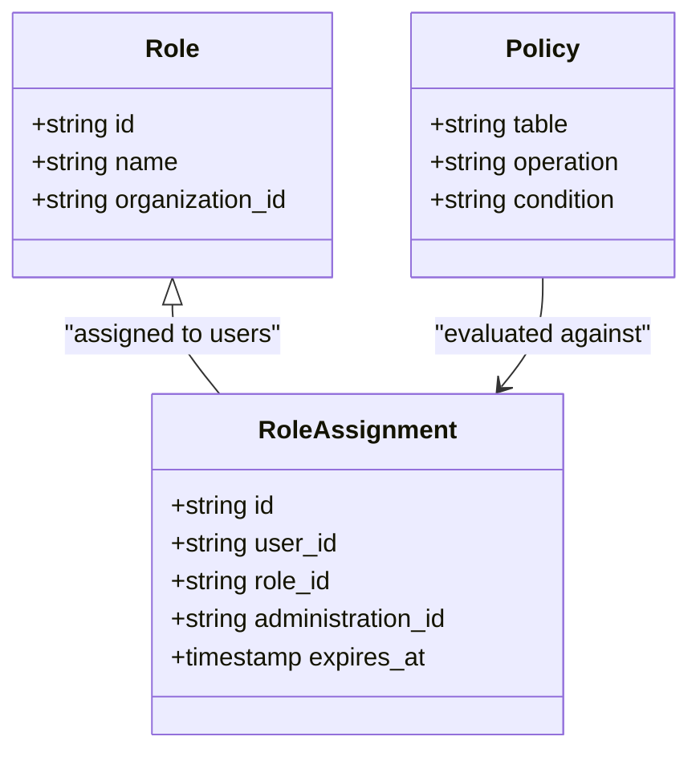

**Diagram sources**
- [apps/hr-suite/supabase/migrations/20260715131230_seed_custom_fields_and_tenant_roles.sql](file://apps/hr-suite/supabase/migrations/20260715131230_seed_custom_fields_and_tenant_roles.sql)
- [apps/hr-suite/supabase/migrations/20260724112407_add_role_assignment_scope.sql](file://apps/hr-suite/supabase/migrations/20260724112407_add_role_assignment_scope.sql)

**Section sources**
- [apps/hr-suite/supabase/migrations/20260715131230_seed_custom_fields_and_tenant_roles.sql](file://apps/hr-suite/supabase/migrations/20260715131230_seed_custom_fields_and_tenant_roles.sql)
- [apps/hr-suite/supabase/migrations/20260724112407_add_role_assignment_scope.sql](file://apps/hr-suite/supabase/migrations/20260724112407_add_role_assignment_scope.sql)

### Multitenancy Security Model and Administration Isolation
- Organizations encapsulate tenants; users are scoped to specific administrations within an organization.
- RLS policies ensure data isolation per administration and prevent cross-tenant access.
- Context routes enforce scope resolution before serving data.

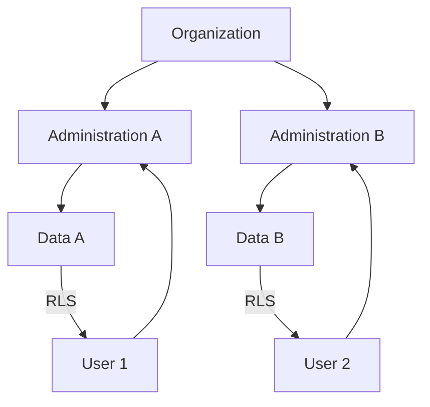

**Diagram sources**
- [apps/hr-suite/supabase/migrations/20260714174305_add_multitenancy_administrations.sql](file://apps/hr-suite/supabase/migrations/20260714174305_add_multitenancy_administrations.sql)
- [apps/hr-suite/supabase/migrations/20260714180142_enforce_administration_management_scope.sql](file://apps/hr-suite/supabase/migrations/20260714180142_enforce_administration_management_scope.sql)

**Section sources**
- [apps/hr-suite/supabase/migrations/20260714174305_add_multitenancy_administrations.sql](file://apps/hr-suite/supabase/migrations/20260714174305_add_multitenancy_administrations.sql)
- [apps/hr-suite/supabase/migrations/20260714180142_enforce_administration_management_scope.sql](file://apps/hr-suite/supabase/migrations/20260714180142_enforce_administration_management_scope.sql)

### Protecting API Routes and Handling Authorization Failures
- Protected routes resolve user context and verify permissions before executing business logic.
- Authorization failures return standardized errors and avoid leaking internal details.
- Example patterns include checking role membership, verifying administration scope, and enforcing RLS.

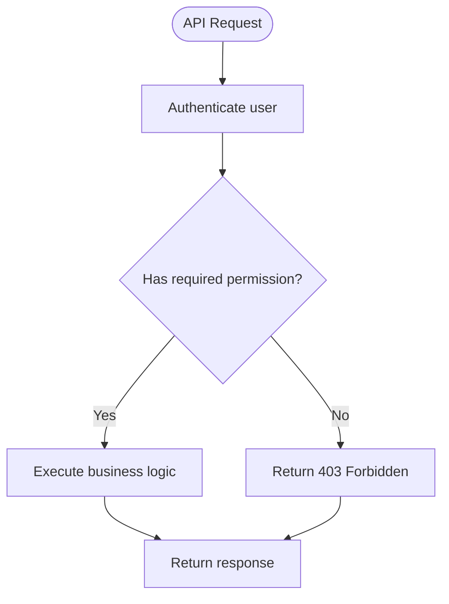

[No sources needed since this diagram shows conceptual workflow, not actual code structure]

### Audit Logging and Security Monitoring
- Employee activity entries are captured for sensitive operations to support auditing and compliance.
- Hardened audit tables ensure integrity and immutability where applicable.
- Monitoring should track failed auth attempts, policy denials, and unusual access patterns.

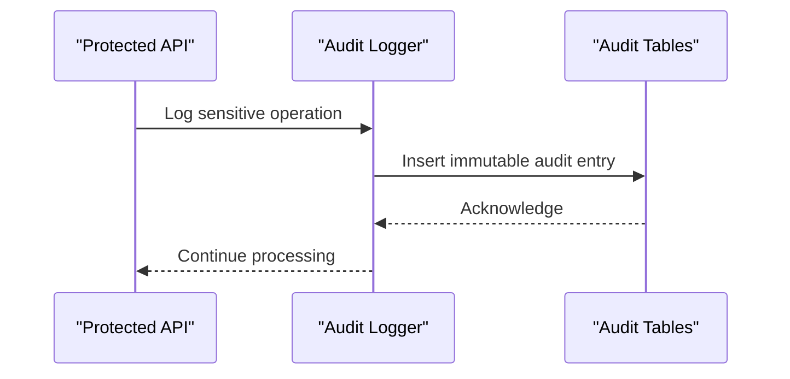

**Diagram sources**
- [apps/hr-suite/supabase/migrations/20260724160000_add_employee_activity_entries.sql](file://apps/hr-suite/supabase/migrations/20260724160000_add_employee_activity_entries.sql)
- [apps/hr-suite/supabase/migrations/20260724172716_harden_employee_activity_entries.sql](file://apps/hr-suite/supabase/migrations/20260724172716_harden_employee_activity_entries.sql)

**Section sources**
- [apps/hr-suite/supabase/migrations/20260724160000_add_employee_activity_entries.sql](file://apps/hr-suite/supabase/migrations/20260724160000_add_employee_activity_entries.sql)
- [apps/hr-suite/supabase/migrations/20260724172716_harden_employee_activity_entries.sql](file://apps/hr-suite/supabase/migrations/20260724172716_harden_employee_activity_entries.sql)

### Email Verification and Security Best Practices
- Email verification is handled by Supabase Auth during sign-up and password reset flows.
- Best practices include:
  - Enforcing HTTPS and secure cookies.
  - Using short-lived tokens for password resets and invitations.
  - Validating all inputs and rejecting malformed requests early.
  - Applying least privilege principles for roles and scopes.
  - Regularly reviewing RLS policies and role assignments.

**Section sources**
- [apps/hr-suite/app/auth/reset-password/actions.ts](file://apps/hr-suite/app/auth/reset-password/actions.ts)
- [apps/hr-suite/supabase/migrations/20260715064245_add_user_invitations.sql](file://apps/hr-suite/supabase/migrations/20260715064245_add_user_invitations.sql)

## Dependency Analysis
Authentication and authorization depend on Supabase Auth, Next.js routing, and Postgres RLS policies. The following diagram illustrates key dependencies:

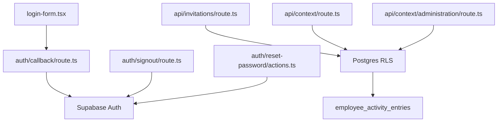

**Diagram sources**
- [apps/hr-suite/components/auth/login-form.tsx](file://apps/hr-suite/components/auth/login-form.tsx)
- [apps/hr-suite/app/auth/callback/route.ts](file://apps/hr-suite/app/auth/callback/route.ts)
- [apps/hr-suite/app/auth/signout/route.ts](file://apps/hr-suite/app/auth/signout/route.ts)
- [apps/hr-suite/app/auth/reset-password/actions.ts](file://apps/hr-suite/app/auth/reset-password/actions.ts)
- [apps/hr-suite/app/api/invitations/route.ts](file://apps/hr-suite/app/api/invitations/route.ts)
- [apps/hr-suite/app/api/context/route.ts](file://apps/hr-suite/app/api/context/route.ts)
- [apps/hr-suite/app/api/context/administration/route.ts](file://apps/hr-suite/app/api/context/administration/route.ts)
- [apps/hr-suite/supabase/migrations/20260724160000_add_employee_activity_entries.sql](file://apps/hr-suite/supabase/migrations/20260724160000_add_employee_activity_entries.sql)

**Section sources**
- [apps/hr-suite/components/auth/login-form.tsx](file://apps/hr-suite/components/auth/login-form.tsx)
- [apps/hr-suite/app/auth/callback/route.ts](file://apps/hr-suite/app/auth/callback/route.ts)
- [apps/hr-suite/app/auth/signout/route.ts](file://apps/hr-suite/app/auth/signout/route.ts)
- [apps/hr-suite/app/auth/reset-password/actions.ts](file://apps/hr-suite/app/auth/reset-password/actions.ts)
- [apps/hr-suite/app/api/invitations/route.ts](file://apps/hr-suite/app/api/invitations/route.ts)
- [apps/hr-suite/app/api/context/route.ts](file://apps/hr-suite/app/api/context/route.ts)
- [apps/hr-suite/app/api/context/administration/route.ts](file://apps/hr-suite/app/api/context/administration/route.ts)
- [apps/hr-suite/supabase/migrations/20260724160000_add_employee_activity_entries.sql](file://apps/hr-suite/supabase/migrations/20260724160000_add_employee_activity_entries.sql)

## Performance Considerations
- Minimize round-trips to Supabase Auth by caching user context where safe.
- Use efficient RLS policies with indexed columns to reduce query latency.
- Avoid heavy computations in API routes; delegate to database functions when possible.
- Monitor slow queries and optimize indexes for frequently accessed tables.

[No sources needed since this section provides general guidance]

## Troubleshooting Guide
Common issues and resolutions:
- Invalid callback state: Ensure proper configuration of Supabase Auth redirect URLs and environment variables.
- Session not persisting: Verify secure cookie settings and HTTPS usage.
- Unauthorized access: Check role assignments, administration scope, and RLS policies for the requested resource.
- Invitation acceptance failures: Validate token expiration and isolation checks; review invitation records and user linkage.
- Audit log gaps: Confirm that sensitive operations invoke the audit logger and that database inserts succeed.

**Section sources**
- [apps/hr-suite/app/auth/callback/route.ts](file://apps/hr-suite/app/auth/callback/route.ts)
- [apps/hr-suite/app/invite/[token]/actions.ts](file://apps/hr-suite/app/invite/[token]/actions.ts)
- [apps/hr-suite/supabase/tests/user_invitation_isolation.sql](file://apps/hr-suite/supabase/tests/user_invitation_isolation.sql)
- [apps/hr-suite/supabase/tests/multitenancy_isolation.sql](file://apps/hr-suite/supabase/tests/multitenancy_isolation.sql)

## Conclusion
LiquidHR’s authentication and authorization system leverages Supabase Auth, Next.js API routes, and Postgres RLS to provide secure, scalable, and auditable access control. RBAC and administration scoping ensure strict isolation across tenants, while robust invitation workflows and password reset flows maintain security and usability. Continuous monitoring and compliance practices protect sensitive HR data and support regulatory requirements.

## Appendices

### Configuration and Proxy Notes
- Supabase configuration is managed via config files and environment variables.
- Proxy settings may be used for development and testing environments.

**Section sources**
- [apps/hr-suite/supabase/config.toml](file://apps/hr-suite/supabase/config.toml)
- [apps/hr-suite/proxy.ts](file://apps/hr-suite/proxy.ts)