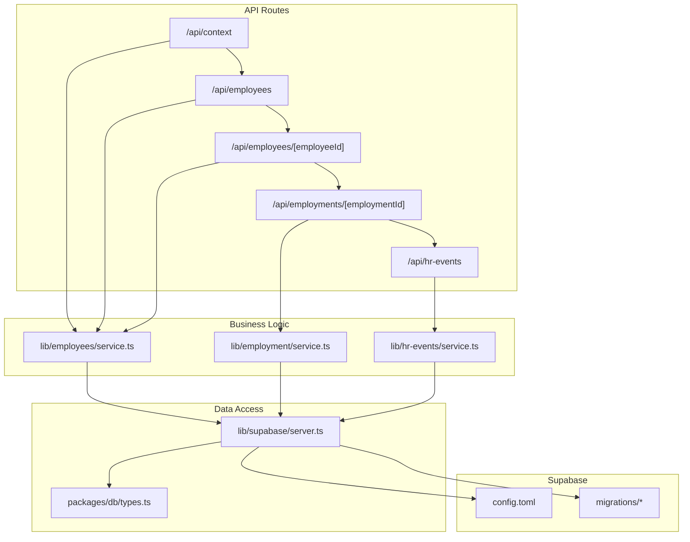
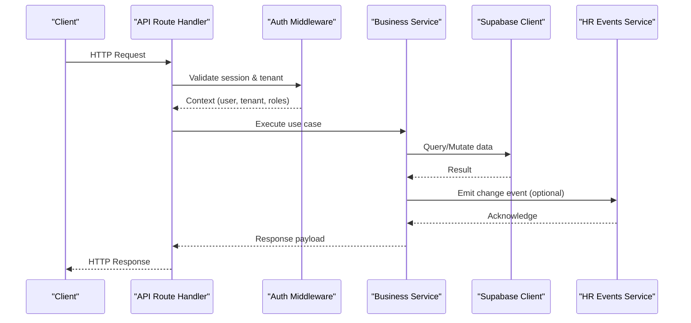
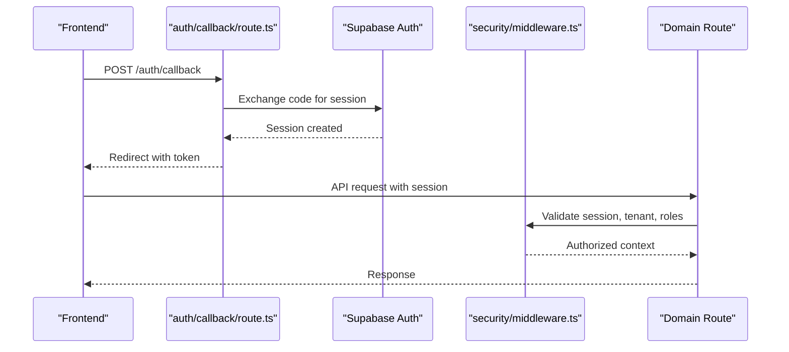
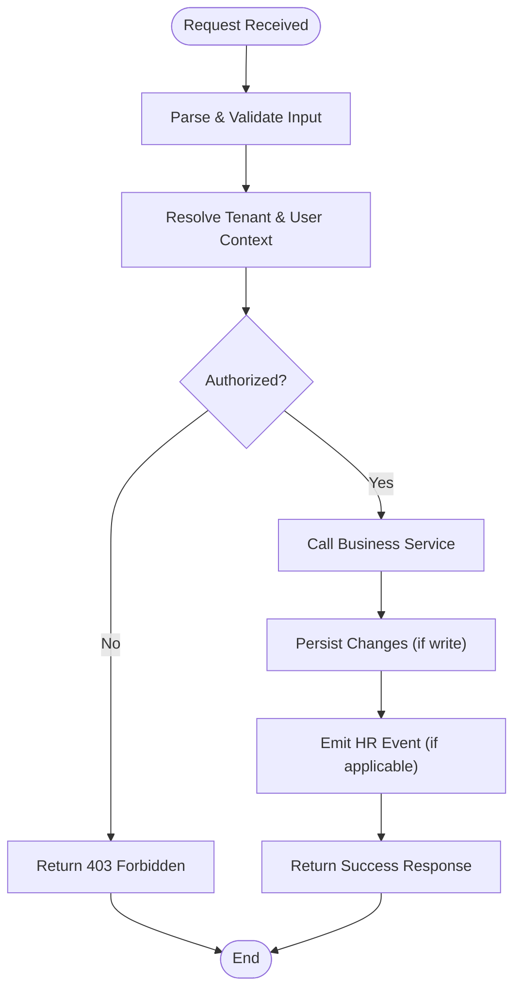
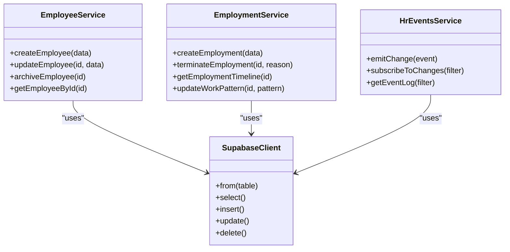
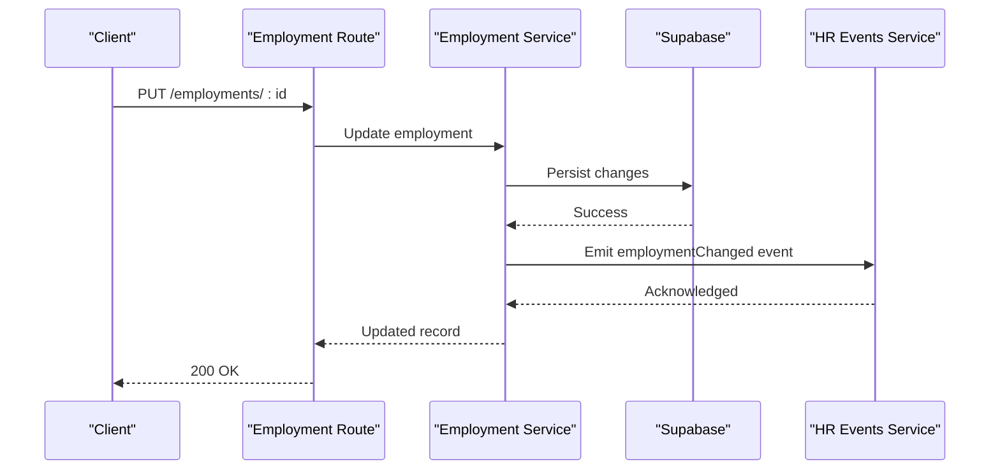
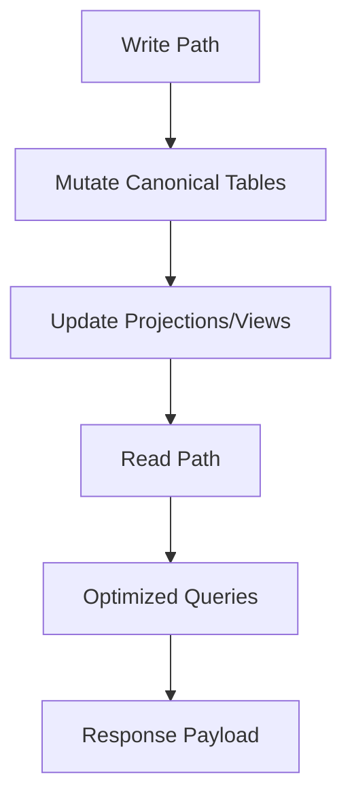
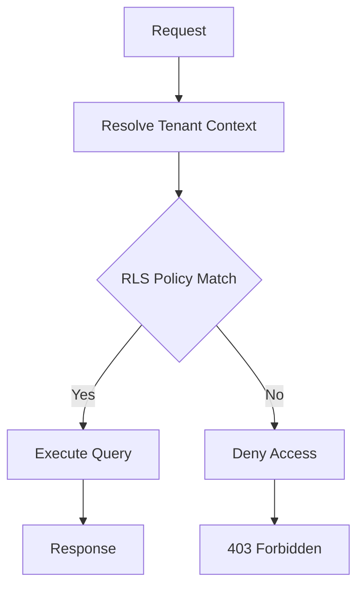
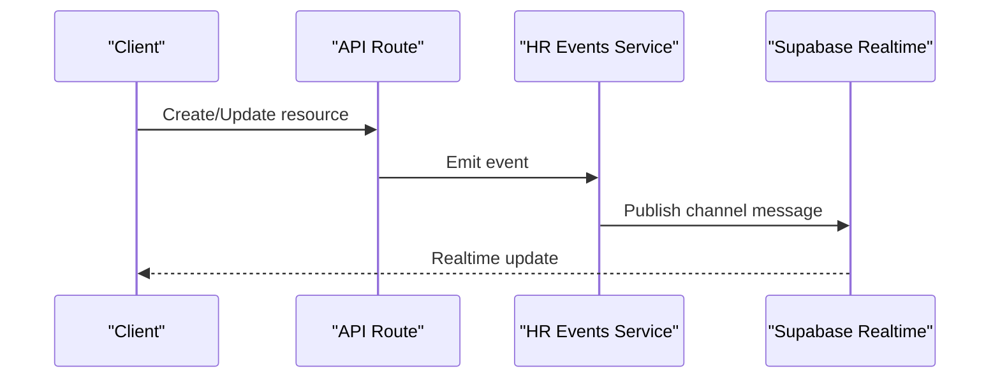
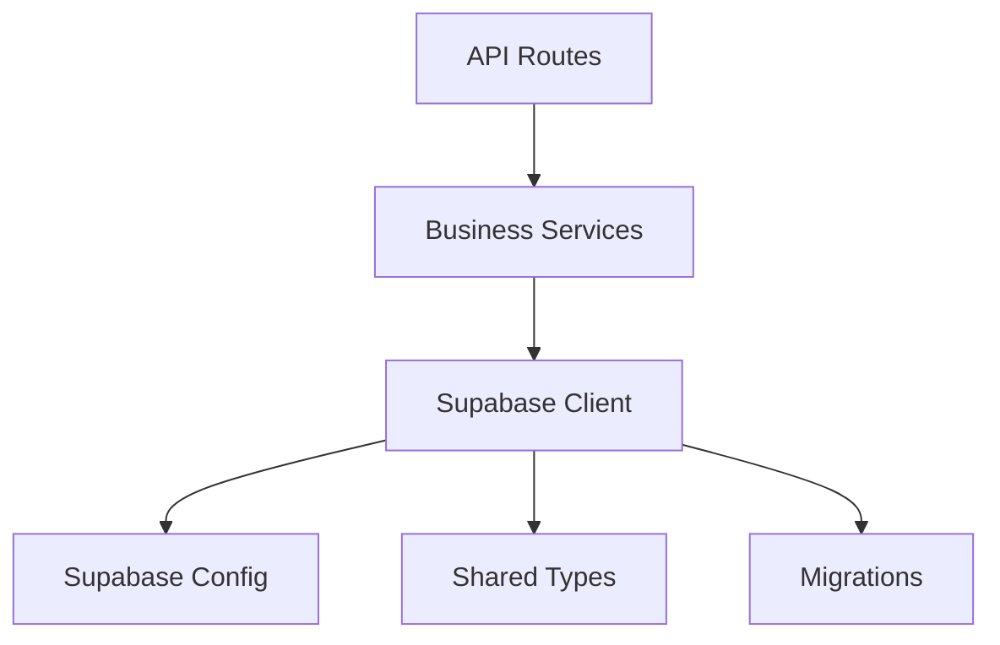

# Backend Architecture

<cite>
**Referenced Files in This Document**
- [apps/hr-suite/app/api/context/route.ts](file://apps/hr-suite/app/api/context/route.ts)
- [apps/hr-suite/app/api/employees/route.ts](file://apps/hr-suite/app/api/employees/route.ts)
- [apps/hr-suite/app/api/employees/[employeeId]/route.ts](file://apps/hr-suite/app/api/employees/[employeeId]/route.ts)
- [apps/hr-suite/app/api/employments/[employmentId]/route.ts](file://apps/hr-suite/app/api/employments/[employmentId]/route.ts)
- [apps/hr-suite/app/api/hr-events/route.ts](file://apps/hr-suite/app/api/hr-events/route.ts)
- [apps/hr-suite/app/auth/callback/route.ts](file://apps/hr-suite/app/auth/callback/route.ts)
- [apps/hr-suite/app/auth/signout/route.ts](file://apps/hr-suite/app/auth/signout/route.ts)
- [apps/hr-suite/lib/supabase/server.ts](file://apps/hr-suite/lib/supabase/server.ts)
- [apps/hr-suite/lib/security/middleware.ts](file://apps/hr-suite/lib/security/middleware.ts)
- [apps/hr-suite/lib/employees/service.ts](file://apps/hr-suite/lib/employees/service.ts)
- [apps/hr-suite/lib/employment/service.ts](file://apps/hr-suite/lib/employment/service.ts)
- [apps/hr-suite/lib/hr-events/service.ts](file://apps/hr-suite/lib/hr-events/service.ts)
- [packages/db/types.ts](file://packages/db/types.ts)
- [supabase/config.toml](file://supabase/config.toml)
- [supabase/migrations/20260714174305_add_multitenancy_administrations.sql](file://supabase/migrations/20260714174305_add_multitenancy_administrations.sql)
- [supabase/migrations/20260718120000_add_hr_change_event_projection.sql](file://supabase/migrations/20260718120000_add_hr_change_event_projection.sql)
</cite>

## Table of Contents
1. [Introduction](#introduction)
2. [Project Structure](#project-structure)
3. [Core Components](#core-components)
4. [Architecture Overview](#architecture-overview)
5. [Detailed Component Analysis](#detailed-component-analysis)
6. [Dependency Analysis](#dependency-analysis)
7. [Performance Considerations](#performance-considerations)
8. [Troubleshooting Guide](#troubleshooting-guide)
9. [Conclusion](#conclusion)

## Introduction
This document describes the backend architecture for LiquidHR’s server-side implementation. It focuses on domain-driven API route organization, business logic layering, and integration with Supabase services. The design emphasizes repository-style data access, event sourcing for employment changes, CQRS patterns for complex queries, robust authentication and authorization, real-time capabilities via Supabase subscriptions, and strong security through Row Level Security (RLS). Multitenancy is implemented using tenant isolation at both application and database layers.

## Project Structure
The backend is implemented as Next.js App Router API routes under apps/hr-suite/app/api. Each domain has its own folder with route handlers that delegate to service modules in lib/<domain>. Database interactions are performed through a Supabase client configured in lib/supabase. Shared types live in packages/db/types.ts. Supabase configuration and migrations reside under supabase/.

**Diagram sources**
- [apps/hr-suite/app/api/context/route.ts](file://apps/hr-suite/app/api/context/route.ts)
- [apps/hr-suite/app/api/employees/route.ts](file://apps/hr-suite/app/api/employees/route.ts)
- [apps/hr-suite/app/api/employees/[employeeId]/route.ts](file://apps/hr-suite/app/api/employees/[employeeId]/route.ts)
- [apps/hr-suite/app/api/employments/[employmentId]/route.ts](file://apps/hr-suite/app/api/employments/[employmentId]/route.ts)
- [apps/hr-suite/app/api/hr-events/route.ts](file://apps/hr-suite/app/api/hr-events/route.ts)
- [apps/hr-suite/lib/employees/service.ts](file://apps/hr-suite/lib/employees/service.ts)
- [apps/hr-suite/lib/employment/service.ts](file://apps/hr-suite/lib/employment/service.ts)
- [apps/hr-suite/lib/hr-events/service.ts](file://apps/hr-suite/lib/hr-events/service.ts)
- [apps/hr-suite/lib/supabase/server.ts](file://apps/hr-suite/lib/supabase/server.ts)
- [packages/db/types.ts](file://packages/db/types.ts)
- [supabase/config.toml](file://supabase/config.toml)
- [supabase/migrations/20260714174305_add_multitenancy_administrations.sql](file://supabase/migrations/20260714174305_add_multitenancy_administrations.sql)
- [supabase/migrations/20260718120000_add_hr_change_event_projection.sql](file://supabase/migrations/20260718120000_add_hr_change_event_projection.sql)

**Section sources**
- [apps/hr-suite/app/api/context/route.ts](file://apps/hr-suite/app/api/context/route.ts)
- [apps/hr-suite/app/api/employees/route.ts](file://apps/hr-suite/app/api/employees/route.ts)
- [apps/hr-suite/app/api/employees/[employeeId]/route.ts](file://apps/hr-suite/app/api/employees/[employeeId]/route.ts)
- [apps/hr-suite/app/api/employments/[employmentId]/route.ts](file://apps/hr-suite/app/api/employments/[employmentId]/route.ts)
- [apps/hr-suite/app/api/hr-events/route.ts](file://apps/hr-suite/app/api/hr-events/route.ts)
- [apps/hr-suite/lib/supabase/server.ts](file://apps/hr-suite/lib/supabase/server.ts)
- [packages/db/types.ts](file://packages/db/types.ts)
- [supabase/config.toml](file://supabase/config.toml)
- [supabase/migrations/20260714174305_add_multitenancy_administrations.sql](file://supabase/migrations/20260714174305_add_multitenancy_administrations.sql)
- [supabase/migrations/20260718120000_add_hr_change_event_projection.sql](file://supabase/migrations/20260718120000_add_hr_change_event_projection.sql)

## Core Components
- API Route Handlers: Domain-scoped endpoints under apps/hr-suite/app/api that parse requests, enforce context, and delegate to business logic.
- Business Logic Services: lib/<domain>/service.ts modules encapsulate use cases, orchestrate operations, and apply domain rules.
- Data Access Layer: lib/supabase/server.ts provides typed Supabase clients and helper methods for queries and mutations.
- Shared Types: packages/db/types.ts defines shared schemas used across services and routes.
- Supabase Integration: config.toml and migrations define database schema, policies, and RLS rules.

Key responsibilities:
- Authentication and session handling via Next.js auth callbacks and Supabase sessions.
- Authorization checks per tenant and role using middleware and RLS policies.
- Event emission for employment lifecycle changes.
- Real-time subscriptions for live updates.

**Section sources**
- [apps/hr-suite/app/api/employees/route.ts](file://apps/hr-suite/app/api/employees/route.ts)
- [apps/hr-suite/app/api/employees/[employeeId]/route.ts](file://apps/hr-suite/app/api/employees/[employeeId]/route.ts)
- [apps/hr-suite/app/api/employments/[employmentId]/route.ts](file://apps/hr-suite/app/api/employments/[employmentId]/route.ts)
- [apps/hr-suite/app/api/hr-events/route.ts](file://apps/hr-suite/app/api/hr-events/route.ts)
- [apps/hr-suite/lib/employees/service.ts](file://apps/hr-suite/lib/employees/service.ts)
- [apps/hr-suite/lib/employment/service.ts](file://apps/hr-suite/lib/employment/service.ts)
- [apps/hr-suite/lib/hr-events/service.ts](file://apps/hr-suite/lib/hr-events/service.ts)
- [apps/hr-suite/lib/supabase/server.ts](file://apps/hr-suite/lib/supabase/server.ts)
- [packages/db/types.ts](file://packages/db/types.ts)
- [supabase/config.toml](file://supabase/config.toml)

## Architecture Overview
The system follows a layered approach:
- Presentation/API Layer: Next.js App Router routes handle HTTP requests and responses.
- Application/Business Layer: Service modules implement domain logic and orchestrate operations.
- Data Layer: Supabase client performs CRUD and advanced queries; RLS enforces tenant isolation.
- Event Layer: HR events capture state changes and can be consumed by subscribers.

**Diagram sources**
- [apps/hr-suite/app/api/employees/[employeeId]/route.ts](file://apps/hr-suite/app/api/employees/[employeeId]/route.ts)
- [apps/hr-suite/lib/security/middleware.ts](file://apps/hr-suite/lib/security/middleware.ts)
- [apps/hr-suite/lib/employees/service.ts](file://apps/hr-suite/lib/employees/service.ts)
- [apps/hr-suite/lib/supabase/server.ts](file://apps/hr-suite/lib/supabase/server.ts)
- [apps/hr-suite/lib/hr-events/service.ts](file://apps/hr-suite/lib/hr-events/service.ts)

## Detailed Component Analysis

### Authentication and Authorization Flow
- Authentication: Handled via Next.js auth callback and Supabase sessions. The callback route establishes the session and redirects appropriately. Sign-out clears the session.
- Authorization: Middleware validates user identity, tenant context, and role-based permissions. Policies are enforced at the API level and reinforced by RLS at the database layer.

**Diagram sources**
- [apps/hr-suite/app/auth/callback/route.ts](file://apps/hr-suite/app/auth/callback/route.ts)
- [apps/hr-suite/app/auth/signout/route.ts](file://apps/hr-suite/app/auth/signout/route.ts)
- [apps/hr-suite/lib/security/middleware.ts](file://apps/hr-suite/lib/security/middleware.ts)

**Section sources**
- [apps/hr-suite/app/auth/callback/route.ts](file://apps/hr-suite/app/auth/callback/route.ts)
- [apps/hr-suite/app/auth/signout/route.ts](file://apps/hr-suite/app/auth/signout/route.ts)
- [apps/hr-suite/lib/security/middleware.ts](file://apps/hr-suite/lib/security/middleware.ts)

### API Route Organization (Domain-Driven Design)
Routes are organized by domain:
- Employees: CRUD and employee-specific resources.
- Employments: Employment lifecycle and related resources.
- HR Events: Event emission and consumption.
- Context: Tenant and user context retrieval.

Each route handler:
- Parses and validates input.
- Enforces tenant scoping.
- Delegates to business logic.
- Returns standardized responses.

**Diagram sources**
- [apps/hr-suite/app/api/employees/route.ts](file://apps/hr-suite/app/api/employees/route.ts)
- [apps/hr-suite/app/api/employees/[employeeId]/route.ts](file://apps/hr-suite/app/api/employees/[employeeId]/route.ts)
- [apps/hr-suite/app/api/employments/[employmentId]/route.ts](file://apps/hr-suite/app/api/employments/[employmentId]/route.ts)
- [apps/hr-suite/app/api/hr-events/route.ts](file://apps/hr-suite/app/api/hr-events/route.ts)

**Section sources**
- [apps/hr-suite/app/api/context/route.ts](file://apps/hr-suite/app/api/context/route.ts)
- [apps/hr-suite/app/api/employees/route.ts](file://apps/hr-suite/app/api/employees/route.ts)
- [apps/hr-suite/app/api/employees/[employeeId]/route.ts](file://apps/hr-suite/app/api/employees/[employeeId]/route.ts)
- [apps/hr-suite/app/api/employments/[employmentId]/route.ts](file://apps/hr-suite/app/api/employments/[employmentId]/route.ts)
- [apps/hr-suite/app/api/hr-events/route.ts](file://apps/hr-suite/app/api/hr-events/route.ts)

### Business Logic Layer Structure
Services encapsulate domain use cases:
- Employee Service: Orchestrates employee creation, updates, archival, and relationships.
- Employment Service: Manages employment lifecycle, terminations, timelines, and work patterns.
- HR Events Service: Emits and tracks HR change events for auditability and real-time updates.

Patterns:
- Repository-style abstraction over Supabase queries.
- Transactional boundaries for multi-step writes.
- Validation and error mapping to consistent response shapes.

**Diagram sources**
- [apps/hr-suite/lib/employees/service.ts](file://apps/hr-suite/lib/employees/service.ts)
- [apps/hr-suite/lib/employment/service.ts](file://apps/hr-suite/lib/employment/service.ts)
- [apps/hr-suite/lib/hr-events/service.ts](file://apps/hr-suite/lib/hr-events/service.ts)
- [apps/hr-suite/lib/supabase/server.ts](file://apps/hr-suite/lib/supabase/server.ts)

**Section sources**
- [apps/hr-suite/lib/employees/service.ts](file://apps/hr-suite/lib/employees/service.ts)
- [apps/hr-suite/lib/employment/service.ts](file://apps/hr-suite/lib/employment/service.ts)
- [apps/hr-suite/lib/hr-events/service.ts](file://apps/hr-suite/lib/hr-events/service.ts)

### Data Access and Repository Pattern
- Supabase Client: Centralized client configuration and helpers for typed queries.
- Repository Abstraction: Service methods encapsulate table access, filtering, and joins.
- Shared Types: packages/db/types.ts ensures consistency between client and server.

Best practices:
- Use explicit column selection to minimize payload size.
- Apply tenant filters consistently.
- Wrap mutations in transactions where needed.

**Section sources**
- [apps/hr-suite/lib/supabase/server.ts](file://apps/hr-suite/lib/supabase/server.ts)
- [packages/db/types.ts](file://packages/db/types.ts)

### Event Sourcing for Employment Changes
Employment changes are captured as events to support audit trails and real-time synchronization. The HR events service emits structured events upon significant state transitions.

**Diagram sources**
- [apps/hr-suite/app/api/employments/[employmentId]/route.ts](file://apps/hr-suite/app/api/employments/[employmentId]/route.ts)
- [apps/hr-suite/lib/employment/service.ts](file://apps/hr-suite/lib/employment/service.ts)
- [apps/hr-suite/lib/hr-events/service.ts](file://apps/hr-suite/lib/hr-events/service.ts)

**Section sources**
- [apps/hr-suite/app/api/hr-events/route.ts](file://apps/hr-suite/app/api/hr-events/route.ts)
- [supabase/migrations/20260718120000_add_hr_change_event_projection.sql](file://supabase/migrations/20260718120000_add_hr_change_event_projection.sql)

### CQRS Patterns for Complex Queries
Read models and projections are used to optimize complex queries:
- Write path: Mutate canonical tables via services.
- Read path: Query optimized views or projections for reports and dashboards.
- Separation improves performance and simplifies query logic.

[No sources needed since this diagram shows conceptual workflow, not actual code structure]

### Multitenancy Implementation
Multitenancy is enforced at multiple levels:
- Application: Tenant context resolved from session or headers.
- Database: RLS policies restrict row access based on tenant_id.
- Migrations: Define tenant-related tables and policies.

**Diagram sources**
- [supabase/migrations/20260714174305_add_multitenancy_administrations.sql](file://supabase/migrations/20260714174305_add_multitenancy_administrations.sql)

**Section sources**
- [supabase/migrations/20260714174305_add_multitenancy_administrations.sql](file://supabase/migrations/20260714174305_add_multitenancy_administrations.sql)

### Real-Time Capabilities with Supabase Subscriptions
Real-time updates are enabled via Supabase subscriptions:
- Clients subscribe to channels for specific tables or filters.
- Server emits events that propagate to subscribers.
- Useful for live dashboards and collaborative features.

**Diagram sources**
- [apps/hr-suite/app/api/hr-events/route.ts](file://apps/hr-suite/app/api/hr-events/route.ts)
- [apps/hr-suite/lib/hr-events/service.ts](file://apps/hr-suite/lib/hr-events/service.ts)

**Section sources**
- [apps/hr-suite/app/api/hr-events/route.ts](file://apps/hr-suite/app/api/hr-events/route.ts)
- [apps/hr-suite/lib/hr-events/service.ts](file://apps/hr-suite/lib/hr-events/service.ts)

### Error Handling Strategies
- Consistent error shapes: Services map domain errors to standardized responses.
- Validation failures: Return clear messages and field-level details.
- Authorization errors: Enforce 403 for unauthorized access.
- Database errors: Wrap and log with actionable context.

Best practices:
- Avoid leaking internal stack traces.
- Provide retry guidance for transient failures.
- Log correlation IDs for tracing.

**Section sources**
- [apps/hr-suite/lib/security/middleware.ts](file://apps/hr-suite/lib/security/middleware.ts)

## Dependency Analysis
The backend exhibits clear separation of concerns:
- API routes depend on business services.
- Business services depend on Supabase client and shared types.
- Supabase client depends on configuration and migrations.

**Diagram sources**
- [apps/hr-suite/app/api/employees/route.ts](file://apps/hr-suite/app/api/employees/route.ts)
- [apps/hr-suite/lib/employees/service.ts](file://apps/hr-suite/lib/employees/service.ts)
- [apps/hr-suite/lib/supabase/server.ts](file://apps/hr-suite/lib/supabase/server.ts)
- [packages/db/types.ts](file://packages/db/types.ts)
- [supabase/config.toml](file://supabase/config.toml)

**Section sources**
- [apps/hr-suite/app/api/employees/route.ts](file://apps/hr-suite/app/api/employees/route.ts)
- [apps/hr-suite/lib/employees/service.ts](file://apps/hr-suite/lib/employees/service.ts)
- [apps/hr-suite/lib/supabase/server.ts](file://apps/hr-suite/lib/supabase/server.ts)
- [packages/db/types.ts](file://packages/db/types.ts)
- [supabase/config.toml](file://supabase/config.toml)

## Performance Considerations
- Minimize data transfer: Select only necessary columns.
- Index frequently queried fields: Ensure foreign keys and filters are indexed.
- Use projections for complex reads: Separate write and read paths.
- Batch operations: Group mutations where possible.
- Cache hot data: Implement caching for static or infrequently changing data.

[No sources needed since this section provides general guidance]

## Troubleshooting Guide
Common issues and resolutions:
- Authentication failures: Verify session validity and callback configuration.
- Authorization denials: Check tenant context and RLS policies.
- Realtime not receiving updates: Confirm channel subscriptions and event emissions.
- Slow queries: Review indexes and projection usage.

Debugging steps:
- Inspect request context and middleware logs.
- Validate Supabase client configuration.
- Test RLS policies directly in Supabase dashboard.
- Use correlation IDs to trace requests.

**Section sources**
- [apps/hr-suite/app/auth/callback/route.ts](file://apps/hr-suite/app/auth/callback/route.ts)
- [apps/hr-suite/lib/security/middleware.ts](file://apps/hr-suite/lib/security/middleware.ts)
- [supabase/config.toml](file://supabase/config.toml)

## Conclusion
LiquidHR’s backend architecture combines domain-driven API design, layered business logic, and robust Supabase integration. It leverages repository-style data access, event sourcing for auditability, and CQRS for efficient reads. Strong multitenancy and RLS ensure data isolation, while real-time capabilities enhance user experience. Adhering to these patterns promotes maintainability, scalability, and security.