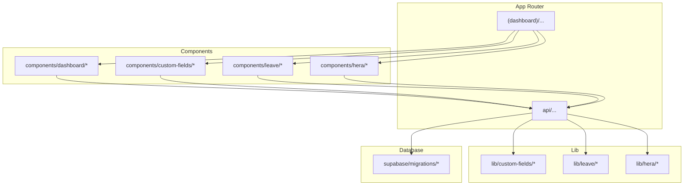
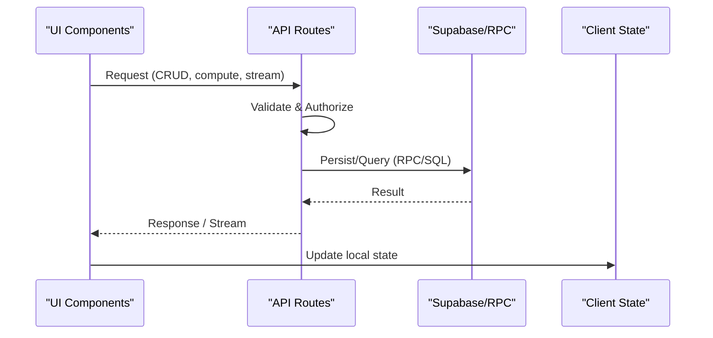
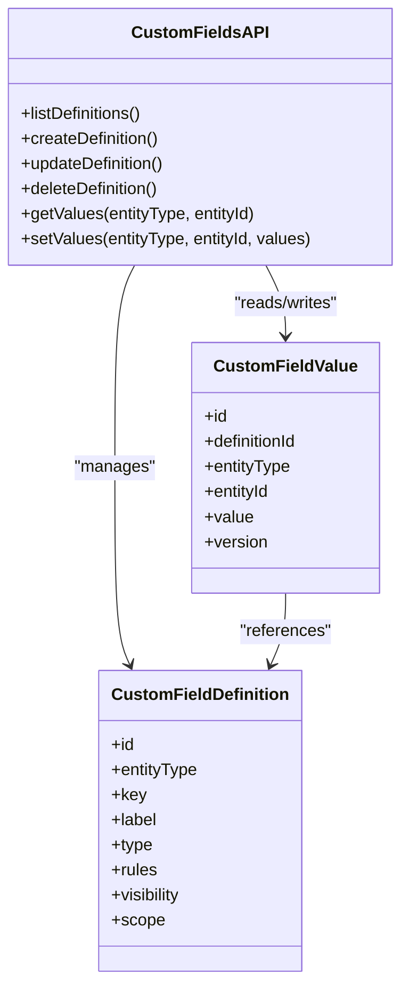
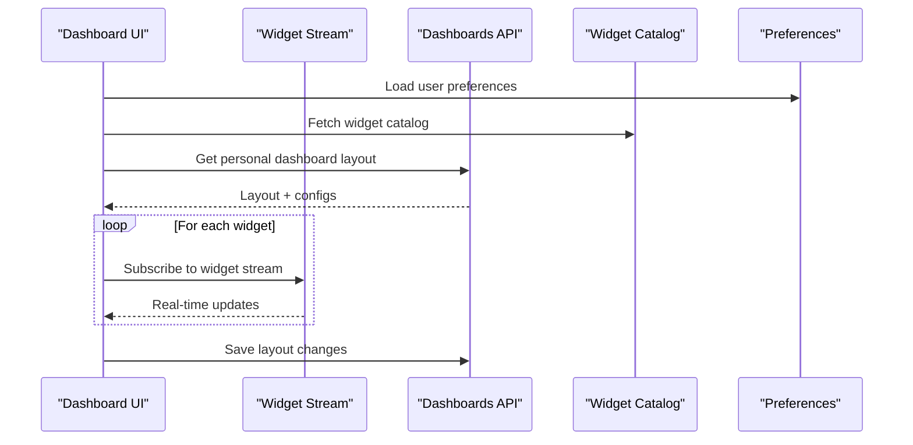
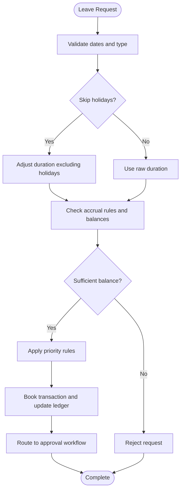
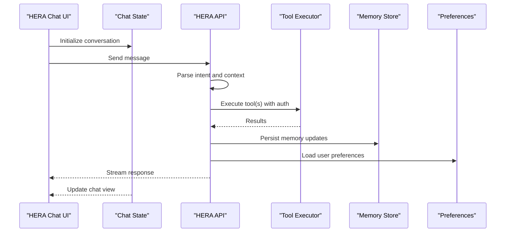
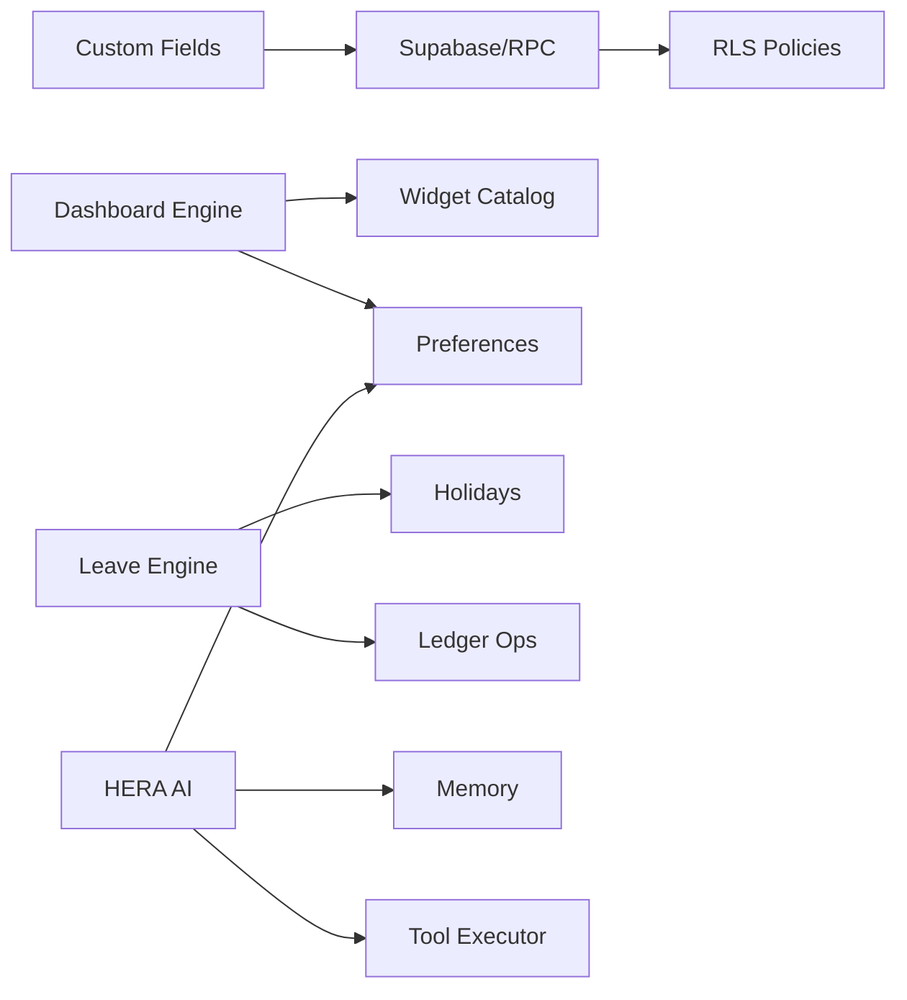

# Advanced Features Business Logic

<cite>
**Referenced Files in This Document**
- [apps/hr-suite/app/(dashboard)/custom-fields/page.tsx](file://apps/hr-suite/app/(dashboard)/custom-fields/page.tsx)
- [apps/hr-suite/app/api/custom-fields/route.ts](file://apps/hr-suite/app/api/custom-fields/route.ts)
- [apps/hr-suite/app/api/custom-fields/[definitionId]/route.ts](file://apps/hr-suite/app/api/custom-fields/[definitionId]/route.ts)
- [apps/hr-suite/components/custom-fields/custom-field-manager.tsx](file://apps/hr-suite/components/custom-fields/custom-field-manager.tsx)
- [apps/hr-suite/components/custom-fields/employee-custom-fields.tsx](file://apps/hr-suite/components/custom-fields/employee-custom-fields.tsx)
- [apps/hr-suite/lib/custom-fields/index.ts](file://apps/hr-suite/lib/custom-fields/index.ts)
- [apps/hr-suite/supabase/migrations/20260715122802_add_custom_field_definitions.sql](file://apps/hr-suite/supabase/migrations/20260715122802_add_custom_field_definitions.sql)
- [apps/hr-suite/supabase/migrations/20260715123119_add_custom_field_value_rpc.sql](file://apps/hr-suite/supabase/migrations/20260715123119_add_custom_field_value_rpc.sql)
- [apps/hr-suite/supabase/migrations/20260715123927_harden_custom_field_values.sql](file://apps/hr-suite/supabase/migrations/20260715123927_harden_custom_field_values.sql)
- [apps/hr-suite/app/(dashboard)/dashboard/page.tsx](file://apps/hr-suite/app/(dashboard)/dashboard/page.tsx)
- [apps/hr-suite/app/(dashboard)/settings/dashboard-widgets/page.tsx](file://apps/hr-suite/app/(dashboard)/settings/dashboard-widgets/page.tsx)
- [apps/hr-suite/app/api/dashboards/route.ts](file://apps/hr-suite/app/api/dashboards/route.ts)
- [apps/hr-suite/app/api/dashboards/[dashboardId]/route.ts](file://apps/hr-suite/app/api/dashboards/[dashboardId]/route.ts)
- [apps/hr-suite/components/dashboard/dashboard-workspace.tsx](file://apps/hr-suite/components/dashboard/dashboard-workspace.tsx)
- [apps/hr-suite/components/dashboard/dashboard-workspace-model.ts](file://apps/hr-suite/components/dashboard/dashboard-workspace-model.ts)
- [apps/hr-suite/components/dashboard/widget-renderer.tsx](file://apps/hr-suite/components/dashboard/widget-renderer.tsx)
- [apps/hr-suite/components/dashboard/dashboard-widget-stream.tsx](file://apps/hr-suite/components/dashboard/dashboard-widget-stream.tsx)
- [apps/hr-suite/components/settings/dashboard-widget-settings-form.tsx](file://apps/hr-suite/components/settings/dashboard-widget-settings-form.tsx)
- [apps/hr-suite/supabase/migrations/20260718170000_add_dashboard_widget_catalog.sql](file://apps/hr-suite/supabase/migrations/20260718170000_add_dashboard_widget_catalog.sql)
- [apps/hr-suite/supabase/migrations/20260718172000_expand_personal_dashboard_widget_types.sql](file://apps/hr-suite/supabase/migrations/20260718172000_expand_personal_dashboard_widget_types.sql)
- [apps/hr-suite/app/(dashboard)/settings/holidays/page.tsx](file://apps/hr-suite/app/(dashboard)/settings/holidays/page.tsx)
- [apps/hr-suite/app/api/settings/holidays/route.ts](file://apps/hr-suite/app/api/settings/holidays/route.ts)
- [apps/hr-suite/app/api/leave/request/route.ts](file://apps/hr-suite/app/api/leave/request/route.ts)
- [apps/hr-suite/app/api/leave/balance-report/route.ts](file://apps/hr-suite/app/api/leave/balance-report/route.ts)
- [apps/hr-suite/app/api/leave/catalog/route.ts](file://apps/hr-suite/app/api/leave/catalog/route.ts)
- [apps/hr-suite/app/api/leave/ledger/route.ts](file://apps/hr-suite/app/api/leave/ledger/route.ts)
- [apps/hr-suite/components/leave/accrual-rule-editor.tsx](file://apps/hr-suite/components/leave/accrual-rule-editor.tsx)
- [apps/hr-suite/components/leave/priority-rule-editor.tsx](file://apps/hr-suite/components/leave/priority-rule-editor.tsx)
- [apps/hr-suite/supabase/migrations/20260722142551_add_leave_engine_foundation.sql](file://apps/hr-suite/supabase/migrations/20260722142551_add_leave_engine_foundation.sql)
- [apps/hr-suite/supabase/migrations/20260722190000_add_leave_request_booking_engine.sql](file://apps/hr-suite/supabase/migrations/20260722190000_add_leave_request_booking_engine.sql)
- [apps/hr-suite/supabase/migrations/20260722192000_add_leave_ledger_operations.sql](file://apps/hr-suite/supabase/migrations/20260722192000_add_leave_ledger_operations.sql)
- [apps/hr-suite/supabase/migrations/20260722192500_skip_holidays_in_leave_requests.sql](file://apps/hr-suite/supabase/migrations/20260722192500_skip_holidays_in_leave_requests.sql)
- [apps/hr-suite/app/(dashboard)/hera/page.tsx](file://apps/hr-suite/app/(dashboard)/hera/page.tsx)
- [apps/hr-suite/app/api/hera/conversations/route.ts](file://apps/hr-suite/app/api/hera/conversations/route.ts)
- [apps/hr-suite/app/api/hera/memory/route.ts](file://apps/hr-suite/app/api/hera/memory/route.ts)
- [apps/hr-suite/app/api/hera/preferences/route.ts](file://apps/hr-suite/app/api/hera/preferences/route.ts)
- [apps/hr-suite/components/hera/hera-chat-state.ts](file://apps/hr-suite/components/hera/hera-chat-state.ts)
- [apps/hr-suite/components/hera/hera-chat.tsx](file://apps/hr-suite/components/hera/hera-chat.tsx)
- [apps/hr-suite/components/hera/hera-request.ts](file://apps/hr-suite/components/hera/hera-request.ts)
- [apps/hr-suite/components/hera/hera-response-model.ts](file://apps/hr-suite/components/hera/hera-response-model.ts)
- [apps/hr-suite/components/hera/hera-floating-state.ts](file://apps/hr-suite/components/hera/hera-floating-state.ts)
- [apps/hr-suite/supabase/migrations/20260716092637_add_hera_ai_agent.sql](file://apps/hr-suite/supabase/migrations/20260716092637_add_hera_ai_agent.sql)
- [apps/hr-suite/supabase/migrations/20260717100000_harden_hera_memory_and_preferences.sql](file://apps/hr-suite/supabase/migrations/20260717100000_harden_hera_memory_and_preferences.sql)
</cite>

## Table of Contents
1. Introduction
2. Project Structure
3. Core Components
4. Architecture Overview
5. Detailed Component Analysis
6. Dependency Analysis
7. Performance Considerations
8. Troubleshooting Guide
9. Conclusion

## Introduction
This document explains the advanced business logic behind LiquidHR’s core features: Custom Fields, Dashboard Engine, Leave Management, and HERA AI Assistant. It focuses on dynamic field definitions and validation, cross-entity data sharing, widget rendering with real-time streaming, accrual calculations and approval workflows, and chat state management with tool execution and memory persistence. The goal is to provide both a high-level understanding and code-level insights for developers and product owners.

## Project Structure
The application follows a Next.js App Router structure with feature-based directories under apps/hr-suite. API routes live under app/api, UI components under components, and business logic utilities under lib. Database schema and policies are managed via Supabase migrations under supabase/migrations.

**Diagram sources**
- [apps/hr-suite/app/(dashboard)/dashboard/page.tsx](file://apps/hr-suite/app/(dashboard)/dashboard/page.tsx)
- [apps/hr-suite/app/api/custom-fields/route.ts](file://apps/hr-suite/app/api/custom-fields/route.ts)
- [apps/hr-suite/components/dashboard/dashboard-workspace.tsx](file://apps/hr-suite/components/dashboard/dashboard-workspace.tsx)
- [apps/hr-suite/components/custom-fields/custom-field-manager.tsx](file://apps/hr-suite/components/custom-fields/custom-field-manager.tsx)
- [apps/hr-suite/components/leave/accrual-rule-editor.tsx](file://apps/hr-suite/components/leave/accrual-rule-editor.tsx)
- [apps/hr-suite/components/hera/hera-chat.tsx](file://apps/hr-suite/components/hera/hera-chat.tsx)

**Section sources**
- [apps/hr-suite/app/(dashboard)/dashboard/page.tsx](file://apps/hr-suite/app/(dashboard)/dashboard/page.tsx)
- [apps/hr-suite/app/api/custom-fields/route.ts](file://apps/hr-suite/app/api/custom-fields/route.ts)
- [apps/hr-suite/components/dashboard/dashboard-workspace.tsx](file://apps/hr-suite/components/dashboard/dashboard-workspace.tsx)
- [apps/hr-suite/components/custom-fields/custom-field-manager.tsx](file://apps/hr-suite/components/custom-fields/custom-field-manager.tsx)
- [apps/hr-suite/components/leave/accrual-rule-editor.tsx](file://apps/hr-suite/components/leave/accrual-rule-editor.tsx)
- [apps/hr-suite/components/hera/hera-chat.tsx](file://apps/hr-suite/components/hera/hera-chat.tsx)

## Core Components
- Custom Fields: Dynamic field definitions, validation rules, and cross-entity value storage.
- Dashboard Engine: Widget catalog, per-user dashboards, widget rendering, and real-time streaming.
- Leave Management: Accrual engine, balance tracking, request booking, ledger operations, and holiday integration.
- HERA AI Assistant: Chat state, conversation lifecycle, tool execution, memory persistence, and preferences.

**Section sources**
- [apps/hr-suite/app/api/custom-fields/route.ts](file://apps/hr-suite/app/api/custom-fields/route.ts)
- [apps/hr-suite/app/api/dashboards/route.ts](file://apps/hr-suite/app/api/dashboards/route.ts)
- [apps/hr-suite/app/api/leave/request/route.ts](file://apps/hr-suite/app/api/leave/request/route.ts)
- [apps/hr-suite/app/api/hera/conversations/route.ts](file://apps/hr-suite/app/api/hera/conversations/route.ts)

## Architecture Overview
High-level flow across features:
- UI components call API routes that enforce tenant isolation, validate inputs, and persist data through Supabase RPCs or direct queries.
- Real-time updates are delivered via streaming endpoints or client-side subscriptions where applicable.
- Business rules (validation, accruals, approvals) are implemented server-side in route handlers and database functions.

[No sources needed since this diagram shows conceptual workflow, not actual code structure]

## Detailed Component Analysis

### Custom Fields System
Custom fields enable dynamic, schema-less attributes attached to entities (e.g., employees). Definitions include type, validation rules, visibility, and scope. Values are stored in a normalized table keyed by entity type and ID.

Key responsibilities:
- Definition CRUD: Create, read, update, delete field definitions.
- Value CRUD: Read/write values for any entity using definition IDs.
- Validation: Enforce types and custom rules at write time.
- Cross-entity sharing: Use shared definition IDs across entities when appropriate.

**Diagram sources**
- [apps/hr-suite/app/api/custom-fields/route.ts](file://apps/hr-suite/app/api/custom-fields/route.ts)
- [apps/hr-suite/app/api/custom-fields/[definitionId]/route.ts](file://apps/hr-suite/app/api/custom-fields/[definitionId]/route.ts)
- [apps/hr-suite/supabase/migrations/20260715122802_add_custom_field_definitions.sql](file://apps/hr-suite/supabase/migrations/20260715122802_add_custom_field_definitions.sql)
- [apps/hr-suite/supabase/migrations/20260715123119_add_custom_field_value_rpc.sql](file://apps/hr-suite/supabase/migrations/20260715123119_add_custom_field_value_rpc.sql)
- [apps/hr-suite/supabase/migrations/20260715123927_harden_custom_field_values.sql](file://apps/hr-suite/supabase/migrations/20260715123927_harden_custom_field_values.sql)

Implementation highlights:
- Definition model includes type, validation rules, and visibility flags.
- Value writes use an RPC to ensure atomicity and rule enforcement.
- Tenant isolation enforced via RLS policies.

Validation and rules:
- Type checks (string, number, date, boolean, enum).
- Range and format validators.
- Custom rule hooks executed server-side before persisting values.

Cross-entity data sharing:
- Definitions can be scoped to multiple entity types.
- Values are linked by entityType and entityId, enabling consistent reuse.

User interface:
- Manager component for creating/editing definitions and previewing values.
- Employee-specific form to edit values inline.

**Section sources**
- [apps/hr-suite/app/api/custom-fields/route.ts](file://apps/hr-suite/app/api/custom-fields/route.ts)
- [apps/hr-suite/app/api/custom-fields/[definitionId]/route.ts](file://apps/hr-suite/app/api/custom-fields/[definitionId]/route.ts)
- [apps/hr-suite/components/custom-fields/custom-field-manager.tsx](file://apps/hr-suite/components/custom-fields/custom-field-manager.tsx)
- [apps/hr-suite/components/custom-fields/employee-custom-fields.tsx](file://apps/hr-suite/components/custom-fields/employee-custom-fields.tsx)
- [apps/hr-suite/lib/custom-fields/index.ts](file://apps/hr-suite/lib/custom-fields/index.ts)
- [apps/hr-suite/supabase/migrations/20260715122802_add_custom_field_definitions.sql](file://apps/hr-suite/supabase/migrations/20260715122802_add_custom_field_definitions.sql)
- [apps/hr-suite/supabase/migrations/20260715123119_add_custom_field_value_rpc.sql](file://apps/hr-suite/supabase/migrations/20260715123119_add_custom_field_value_rpc.sql)
- [apps/hr-suite/supabase/migrations/20260715123927_harden_custom_field_values.sql](file://apps/hr-suite/supabase/migrations/20260715123927_harden_custom_field_values.sql)

### Dashboard Engine
The dashboard engine supports per-user dashboards composed of widgets from a catalog. Widgets render data via APIs and can stream updates. User preferences control layout, visibility, and ordering.

Core capabilities:
- Widget catalog: Define available widgets and their metadata.
- Personal dashboards: Store user-specific widget layouts and configurations.
- Widget rendering: Dynamically render widgets based on configuration.
- Real-time streaming: Push updates to active widgets without full page reloads.
- Preference management: Persist user choices for dashboard behavior.

**Diagram sources**
- [apps/hr-suite/app/(dashboard)/dashboard/page.tsx](file://apps/hr-suite/app/(dashboard)/dashboard/page.tsx)
- [apps/hr-suite/app/api/dashboards/route.ts](file://apps/hr-suite/app/api/dashboards/route.ts)
- [apps/hr-suite/app/api/dashboards/[dashboardId]/route.ts](file://apps/hr-suite/app/api/dashboards/[dashboardId]/route.ts)
- [apps/hr-suite/components/dashboard/dashboard-workspace.tsx](file://apps/hr-suite/components/dashboard/dashboard-workspace.tsx)
- [apps/hr-suite/components/dashboard/dashboard-widget-stream.tsx](file://apps/hr-suite/components/dashboard/dashboard-widget-stream.tsx)
- [apps/hr-suite/components/settings/dashboard-widget-settings-form.tsx](file://apps/hr-suite/components/settings/dashboard-widget-settings-form.tsx)

Rendering and streaming:
- Workspace orchestrates widget lifecycle and layout.
- Widget renderer resolves component by type and injects props.
- Streaming component subscribes to updates and merges into local state.

Preference management:
- Settings form persists user preferences such as theme, date format, and widget toggles.
- Preferences are scoped per user and module.

**Section sources**
- [apps/hr-suite/app/(dashboard)/dashboard/page.tsx](file://apps/hr-suite/app/(dashboard)/dashboard/page.tsx)
- [apps/hr-suite/app/(dashboard)/settings/dashboard-widgets/page.tsx](file://apps/hr-suite/app/(dashboard)/settings/dashboard-widgets/page.tsx)
- [apps/hr-suite/app/api/dashboards/route.ts](file://apps/hr-suite/app/api/dashboards/route.ts)
- [apps/hr-suite/app/api/dashboards/[dashboardId]/route.ts](file://apps/hr-suite/app/api/dashboards/[dashboardId]/route.ts)
- [apps/hr-suite/components/dashboard/dashboard-workspace.tsx](file://apps/hr-suite/components/dashboard/dashboard-workspace.tsx)
- [apps/hr-suite/components/dashboard/dashboard-workspace-model.ts](file://apps/hr-suite/components/dashboard/dashboard-workspace-model.ts)
- [apps/hr-suite/components/dashboard/widget-renderer.tsx](file://apps/hr-suite/components/dashboard/widget-renderer.tsx)
- [apps/hr-suite/components/dashboard/dashboard-widget-stream.tsx](file://apps/hr-suite/components/dashboard/dashboard-widget-stream.tsx)
- [apps/hr-suite/components/settings/dashboard-widget-settings-form.tsx](file://apps/hr-suite/components/settings/dashboard-widget-settings-form.tsx)
- [apps/hr-suite/supabase/migrations/20260718170000_add_dashboard_widget_catalog.sql](file://apps/hr-suite/supabase/migrations/20260718170000_add_dashboard_widget_catalog.sql)
- [apps/hr-suite/supabase/migrations/20260718172000_expand_personal_dashboard_widget_types.sql](file://apps/hr-suite/supabase/migrations/20260718172000_expand_personal_dashboard_widget_types.sql)

### Leave Management Engine
The leave engine manages accruals, balances, requests, approvals, and ledger operations. It integrates with holidays to exclude non-working days from accruals and request durations.

Key flows:
- Accrual calculation: Based on rules (frequency, rate, caps), employment status, and work hours.
- Balance tracking: Aggregates accrued, used, and pending leave by type and period.
- Request booking: Validates availability, applies priority rules, and records transactions.
- Ledger operations: Immutable record of accruals, usage, adjustments, and approvals.
- Holiday integration: Skips holidays in duration calculations and scheduling.

**Diagram sources**
- [apps/hr-suite/app/api/leave/request/route.ts](file://apps/hr-suite/app/api/leave/request/route.ts)
- [apps/hr-suite/app/api/leave/balance-report/route.ts](file://apps/hr-suite/app/api/leave/balance-report/route.ts)
- [apps/hr-suite/app/api/leave/catalog/route.ts](file://apps/hr-suite/app/api/leave/catalog/route.ts)
- [apps/hr-suite/app/api/leave/ledger/route.ts](file://apps/hr-suite/app/api/leave/ledger/route.ts)
- [apps/hr-suite/components/leave/accrual-rule-editor.tsx](file://apps/hr-suite/components/leave/accrual-rule-editor.tsx)
- [apps/hr-suite/components/leave/priority-rule-editor.tsx](file://apps/hr-suite/components/leave/priority-rule-editor.tsx)
- [apps/hr-suite/app/(dashboard)/settings/holidays/page.tsx](file://apps/hr-suite/app/(dashboard)/settings/holidays/page.tsx)
- [apps/hr-suite/app/api/settings/holidays/route.ts](file://apps/hr-suite/app/api/settings/holidays/route.ts)
- [apps/hr-suite/supabase/migrations/20260722142551_add_leave_engine_foundation.sql](file://apps/hr-suite/supabase/migrations/20260722142551_add_leave_engine_foundation.sql)
- [apps/hr-suite/supabase/migrations/20260722190000_add_leave_request_booking_engine.sql](file://apps/hr-suite/supabase/migrations/20260722190000_add_leave_request_booking_engine.sql)
- [apps/hr-suite/supabase/migrations/20260722192000_add_leave_ledger_operations.sql](file://apps/hr-suite/supabase/migrations/20260722192000_add_leave_ledger_operations.sql)
- [apps/hr-suite/supabase/migrations/20260722192500_skip_holidays_in_leave_requests.sql](file://apps/hr-suite/supabase/migrations/20260722192500_skip_holidays_in_leave_requests.sql)

Accrual and balance:
- Accrual rules define frequency, rates, caps, and eligibility.
- Balance report aggregates current and historical balances by employee and type.

Request booking and ledger:
- Booking engine validates and creates immutable ledger entries.
- Ledger operations support accruals, usage, reversals, and adjustments.

Holiday integration:
- Holidays are configured centrally and referenced during duration calculations.
- Requests skip non-working days automatically.

**Section sources**
- [apps/hr-suite/app/api/leave/request/route.ts](file://apps/hr-suite/app/api/leave/request/route.ts)
- [apps/hr-suite/app/api/leave/balance-report/route.ts](file://apps/hr-suite/app/api/leave/balance-report/route.ts)
- [apps/hr-suite/app/api/leave/catalog/route.ts](file://apps/hr-suite/app/api/leave/catalog/route.ts)
- [apps/hr-suite/app/api/leave/ledger/route.ts](file://apps/hr-suite/app/api/leave/ledger/route.ts)
- [apps/hr-suite/components/leave/accrual-rule-editor.tsx](file://apps/hr-suite/components/leave/accrual-rule-editor.tsx)
- [apps/hr-suite/components/leave/priority-rule-editor.tsx](file://apps/hr-suite/components/leave/priority-rule-editor.tsx)
- [apps/hr-suite/app/(dashboard)/settings/holidays/page.tsx](file://apps/hr-suite/app/(dashboard)/settings/holidays/page.tsx)
- [apps/hr-suite/app/api/settings/holidays/route.ts](file://apps/hr-suite/app/api/settings/holidays/route.ts)
- [apps/hr-suite/supabase/migrations/20260722142551_add_leave_engine_foundation.sql](file://apps/hr-suite/supabase/migrations/20260722142551_add_leave_engine_foundation.sql)
- [apps/hr-suite/supabase/migrations/20260722190000_add_leave_request_booking_engine.sql](file://apps/hr-suite/supabase/migrations/20260722190000_add_leave_request_booking_engine.sql)
- [apps/hr-suite/supabase/migrations/20260722192000_add_leave_ledger_operations.sql](file://apps/hr-suite/supabase/migrations/20260722192000_add_leave_ledger_operations.sql)
- [apps/hr-suite/supabase/migrations/20260722192500_skip_holidays_in_leave_requests.sql](file://apps/hr-suite/supabase/migrations/20260722192500_skip_holidays_in_leave_requests.sql)

### HERA AI Assistant
HERA provides conversational assistance with context-aware tools, persistent memory, and user preferences. It manages chat sessions, executes tools safely, and remembers past interactions.

Core responsibilities:
- Chat state management: Tracks messages, turns, and context within a conversation.
- Tool execution: Invokes domain tools (read/write HR data) with authorization checks.
- Memory persistence: Stores summaries and key facts across sessions.
- Preferences handling: Adapts responses based on user settings.

**Diagram sources**
- [apps/hr-suite/app/(dashboard)/hera/page.tsx](file://apps/hr-suite/app/(dashboard)/hera/page.tsx)
- [apps/hr-suite/app/api/hera/conversations/route.ts](file://apps/hr-suite/app/api/hera/conversations/route.ts)
- [apps/hr-suite/app/api/hera/memory/route.ts](file://apps/hr-suite/app/api/hera/memory/route.ts)
- [apps/hr-suite/app/api/hera/preferences/route.ts](file://apps/hr-suite/app/api/hera/preferences/route.ts)
- [apps/hr-suite/components/hera/hera-chat-state.ts](file://apps/hr-suite/components/hera/hera-chat-state.ts)
- [apps/hr-suite/components/hera/hera-chat.tsx](file://apps/hr-suite/components/hera/hera-chat.tsx)
- [apps/hr-suite/components/hera/hera-request.ts](file://apps/hr-suite/components/hera/hera-request.ts)
- [apps/hr-suite/components/hera/hera-response-model.ts](file://apps/hr-suite/components/hera/hera-response-model.ts)
- [apps/hr-suite/components/hera/hera-floating-state.ts](file://apps/hr-suite/components/hera/hera-floating-state.ts)
- [apps/hr-suite/supabase/migrations/20260716092637_add_hera_ai_agent.sql](file://apps/hr-suite/supabase/migrations/20260716092637_add_hera_ai_agent.sql)
- [apps/hr-suite/supabase/migrations/20260717100000_harden_hera_memory_and_preferences.sql](file://apps/hr-suite/supabase/migrations/20260717100000_harden_hera_memory_and_preferences.sql)

Chat state and UI:
- State tracks conversation history, typing indicators, and error states.
- Floating state manages visibility and positioning of the assistant.

Tool execution and safety:
- Tools are invoked with explicit permissions and input validation.
- Responses are modeled and streamed to the UI.

Memory and preferences:
- Memory stores concise facts and context for future turns.
- Preferences influence tone, language, and feature exposure.

**Section sources**
- [apps/hr-suite/app/(dashboard)/hera/page.tsx](file://apps/hr-suite/app/(dashboard)/hera/page.tsx)
- [apps/hr-suite/app/api/hera/conversations/route.ts](file://apps/hr-suite/app/api/hera/conversations/route.ts)
- [apps/hr-suite/app/api/hera/memory/route.ts](file://apps/hr-suite/app/api/hera/memory/route.ts)
- [apps/hr-suite/app/api/hera/preferences/route.ts](file://apps/hr-suite/app/api/hera/preferences/route.ts)
- [apps/hr-suite/components/hera/hera-chat-state.ts](file://apps/hr-suite/components/hera/hera-chat-state.ts)
- [apps/hr-suite/components/hera/hera-chat.tsx](file://apps/hr-suite/components/hera/hera-chat.tsx)
- [apps/hr-suite/components/hera/hera-request.ts](file://apps/hr-suite/components/hera/hera-request.ts)
- [apps/hr-suite/components/hera/hera-response-model.ts](file://apps/hr-suite/components/hera/hera-response-model.ts)
- [apps/hr-suite/components/hera/hera-floating-state.ts](file://apps/hr-suite/components/hera/hera-floating-state.ts)
- [apps/hr-suite/supabase/migrations/20260716092637_add_hera_ai_agent.sql](file://apps/hr-suite/supabase/migrations/20260716092637_add_hera_ai_agent.sql)
- [apps/hr-suite/supabase/migrations/20260717100000_harden_hera_memory_and_preferences.sql](file://apps/hr-suite/supabase/migrations/20260717100000_harden_hera_memory_and_preferences.sql)

## Dependency Analysis
Inter-feature dependencies:
- Custom Fields depend on Supabase RPCs and RLS policies for secure multi-entity storage.
- Dashboard Engine depends on widget catalog and per-user preferences; streams rely on API endpoints.
- Leave Management depends on holiday configuration and uses ledger operations for immutability.
- HERA depends on memory and preferences stores and invokes tools with authorization.

**Diagram sources**
- [apps/hr-suite/app/api/custom-fields/route.ts](file://apps/hr-suite/app/api/custom-fields/route.ts)
- [apps/hr-suite/app/api/dashboards/route.ts](file://apps/hr-suite/app/api/dashboards/route.ts)
- [apps/hr-suite/app/api/leave/request/route.ts](file://apps/hr-suite/app/api/leave/request/route.ts)
- [apps/hr-suite/app/api/hera/conversations/route.ts](file://apps/hr-suite/app/api/hera/conversations/route.ts)
- [apps/hr-suite/supabase/migrations/20260715123927_harden_custom_field_values.sql](file://apps/hr-suite/supabase/migrations/20260715123927_harden_custom_field_values.sql)
- [apps/hr-suite/supabase/migrations/20260722192000_add_leave_ledger_operations.sql](file://apps/hr-suite/supabase/migrations/20260722192000_add_leave_ledger_operations.sql)
- [apps/hr-suite/supabase/migrations/20260717100000_harden_hera_memory_and_preferences.sql](file://apps/hr-suite/supabase/migrations/20260717100000_harden_hera_memory_and_preferences.sql)

**Section sources**
- [apps/hr-suite/app/api/custom-fields/route.ts](file://apps/hr-suite/app/api/custom-fields/route.ts)
- [apps/hr-suite/app/api/dashboards/route.ts](file://apps/hr-suite/app/api/dashboards/route.ts)
- [apps/hr-suite/app/api/leave/request/route.ts](file://apps/hr-suite/app/api/leave/request/route.ts)
- [apps/hr-suite/app/api/hera/conversations/route.ts](file://apps/hr-suite/app/api/hera/conversations/route.ts)

## Performance Considerations
- Custom Fields: Batch reads/writes where possible; leverage indexes on entityType and entityId.
- Dashboard Engine: Debounce layout saves; cache widget catalogs; stream only necessary deltas.
- Leave Engine: Precompute balances periodically; paginate ledger queries; avoid N+1 lookups.
- HERA: Stream responses incrementally; limit memory size; cache frequent preference reads.

[No sources needed since this section provides general guidance]

## Troubleshooting Guide
Common issues and resolutions:
- Custom Fields validation failures: Ensure rule definitions match payload types; check RPC error logs.
- Dashboard widget not rendering: Verify widget type exists in catalog; confirm user has permission.
- Leave request rejected: Inspect accrual rules and holiday calendar; review ledger for inconsistencies.
- HERA memory not persisting: Confirm memory endpoint calls succeed; check tenant scoping.

**Section sources**
- [apps/hr-suite/app/api/custom-fields/route.ts](file://apps/hr-suite/app/api/custom-fields/route.ts)
- [apps/hr-suite/app/api/dashboards/route.ts](file://apps/hr-suite/app/api/dashboards/route.ts)
- [apps/hr-suite/app/api/leave/request/route.ts](file://apps/hr-suite/app/api/leave/request/route.ts)
- [apps/hr-suite/app/api/hera/memory/route.ts](file://apps/hr-suite/app/api/hera/memory/route.ts)

## Conclusion
LiquidHR’s advanced features combine flexible data modeling, dynamic UI composition, robust leave accounting, and intelligent conversational assistance. By centralizing business rules in API routes and database functions, the system ensures consistency, security, and scalability. The provided diagrams and references offer a clear path for extending and maintaining these features.

[No sources needed since this section summarizes without analyzing specific files]