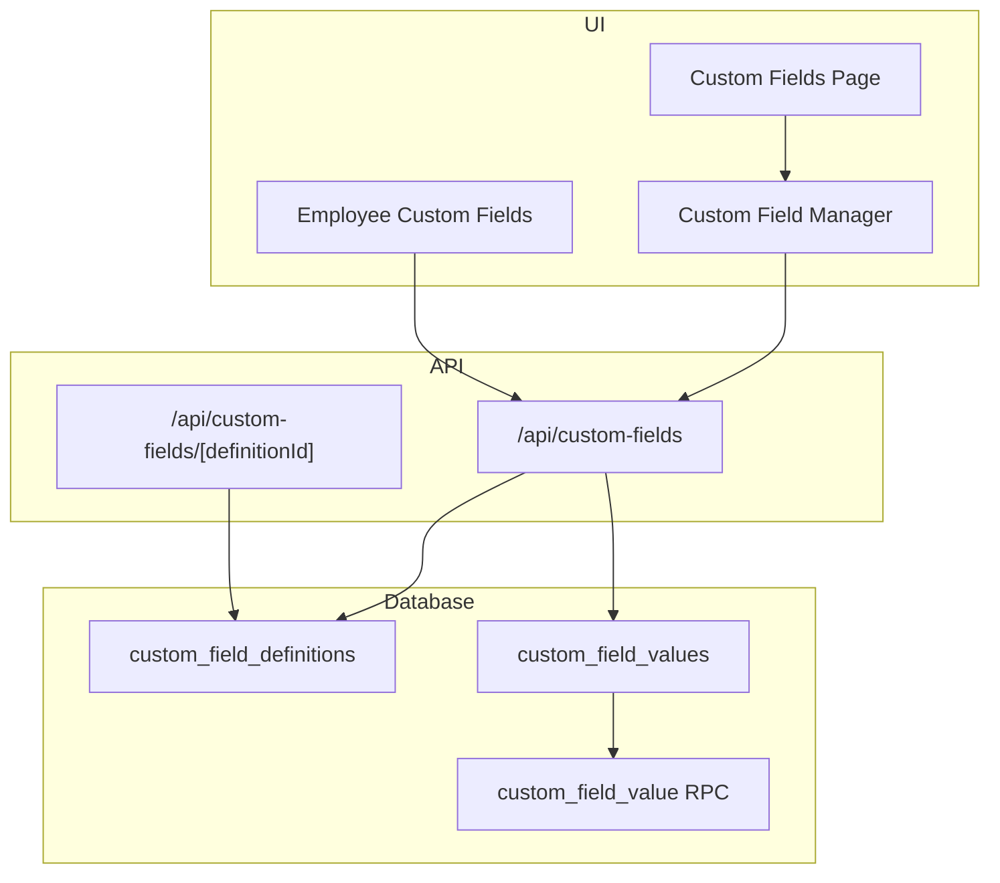
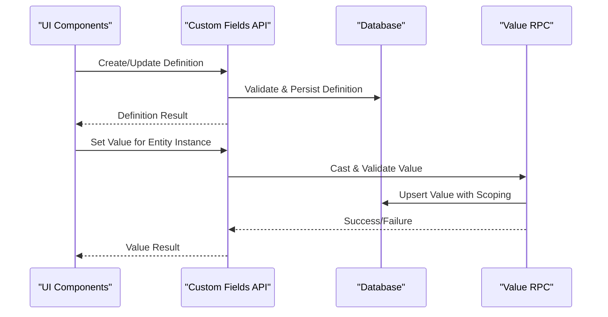
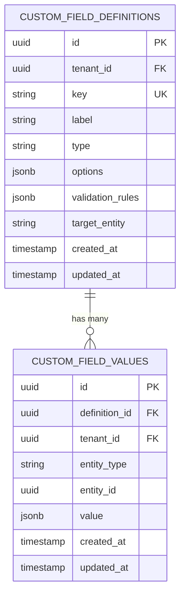
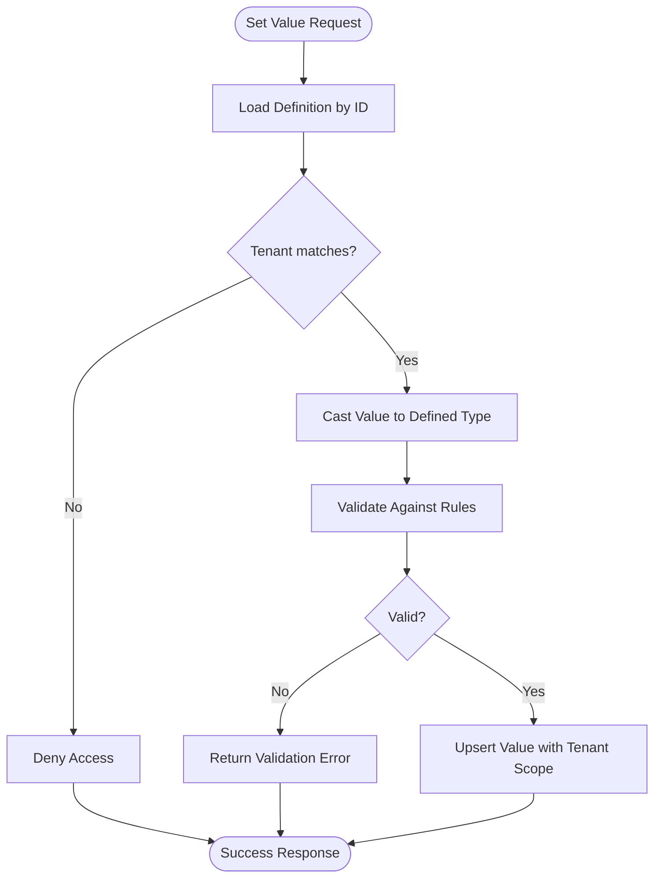
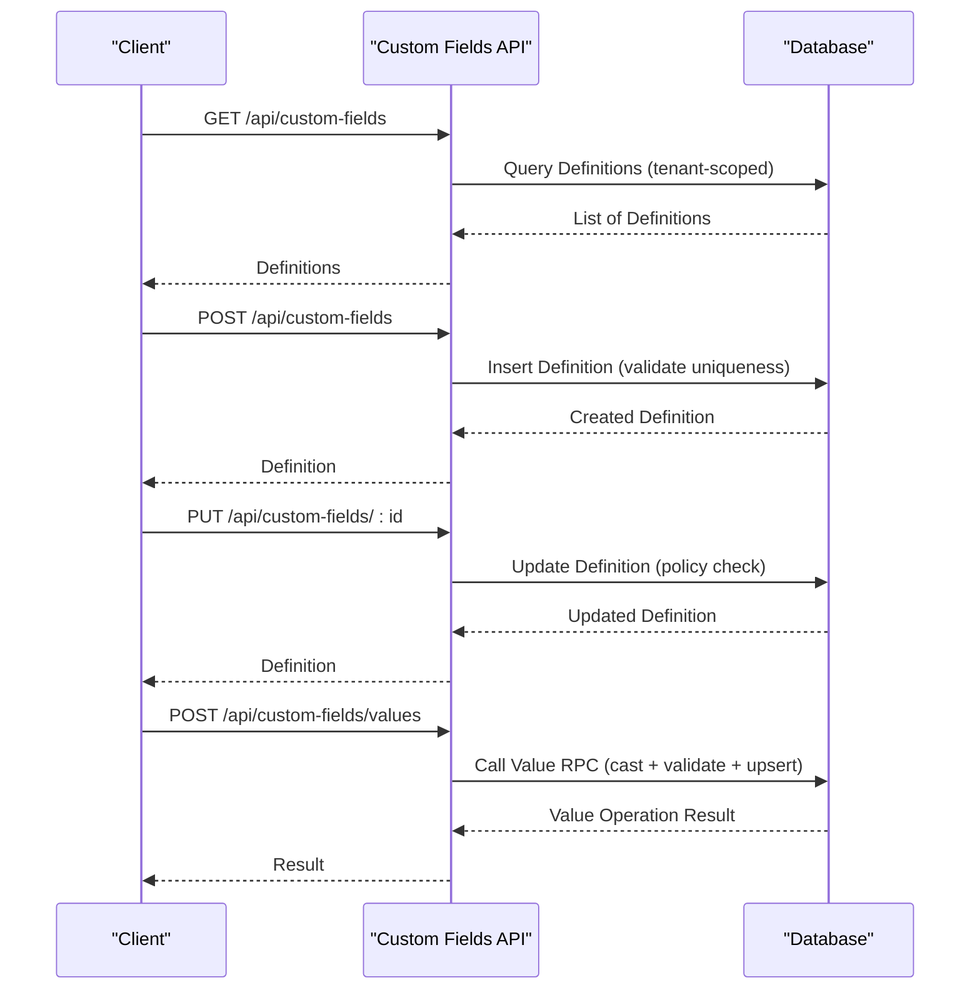
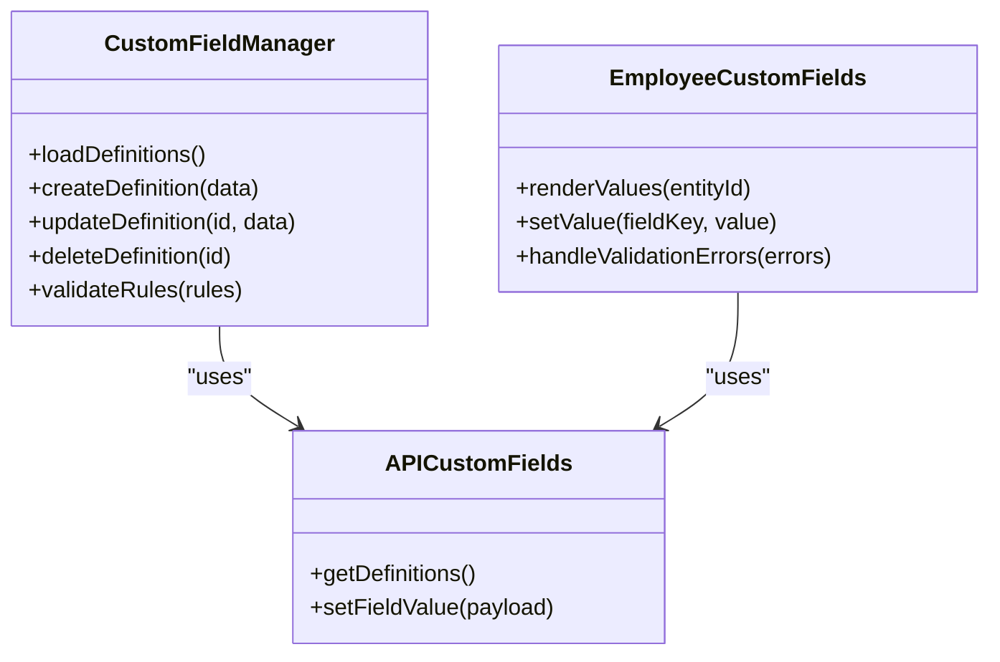
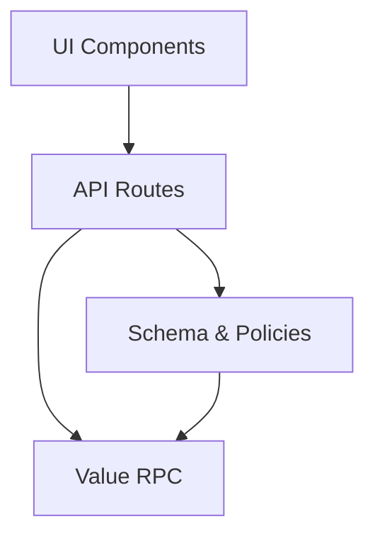

# Custom Fields Business Logic

<cite>
**Referenced Files in This Document**
- [VRIJE_VELDEN.md](file://docs/requirements/custom-fields/VRIJE_VELDEN.md)
- [20260715122802_add_custom_field_definitions.sql](file://apps/hr-suite/supabase/migrations/20260715122802_add_custom_field_definitions.sql)
- [20260715123119_add_custom_field_value_rpc.sql](file://apps/hr-suite/supabase/migrations/20260715123119_add_custom_field_value_rpc.sql)
- [20260715123927_harden_custom_field_values.sql](file://apps/hr-suite/supabase/migrations/20260715123927_harden_custom_field_values.sql)
- [custom_fields_isolation.sql](file://apps/hr-suite/supabase/tests/custom_fields_isolation.sql)
- [route.ts](file://apps/hr-suite/app/api/custom-fields/route.ts)
- [route.ts](file://apps/hr-suite/app/api/custom-fields/[definitionId]/route.ts)
- [employee-custom-fields.tsx](file://apps/hr-suite/components/custom-fields/employee-custom-fields.tsx)
- [custom-field-manager.tsx](file://apps/hr-suite/components/custom-fields/custom-field-manager.tsx)
- [page.tsx](file://apps/hr-suite/app/(dashboard)/custom-fields/page.tsx)
</cite>

## Table of Contents
1. [Introduction](#introduction)
2. [Project Structure](#project-structure)
3. [Core Components](#core-components)
4. [Architecture Overview](#architecture-overview)
5. [Detailed Component Analysis](#detailed-component-analysis)
6. [Dependency Analysis](#dependency-analysis)
7. [Performance Considerations](#performance-considerations)
8. [Troubleshooting Guide](#troubleshooting-guide)
9. [Conclusion](#conclusion)
10. [Appendices](#appendices)

## Introduction
This document explains LiquidHR’s custom fields business logic, focusing on the dynamic field definition system, validation rules, schema management, and how custom fields are associated with entities such as employees and employments. It also covers data storage for custom field values (type casting and serialization), API endpoints for definitions and values, complex validation scenarios, cross-entity sharing, performance optimization strategies, and security considerations including access control and tenant isolation.

## Project Structure
The custom fields feature spans UI pages, components, API routes, and database migrations:
- UI pages and components manage authoring and rendering of custom fields.
- API routes expose endpoints to create, update, and query custom field definitions and values.
- Database migrations define schemas, relationships, and security policies for definitions and values.
- Tests validate isolation and correctness across tenants.

**Diagram sources**
- [page.tsx](file://apps/hr-suite/app/(dashboard)/custom-fields/page.tsx)
- [custom-field-manager.tsx](file://apps/hr-suite/components/custom-fields/custom-field-manager.tsx)
- [employee-custom-fields.tsx](file://apps/hr-suite/components/custom-fields/employee-custom-fields.tsx)
- [route.ts](file://apps/hr-suite/app/api/custom-fields/route.ts)
- [route.ts](file://apps/hr-suite/app/api/custom-fields/[definitionId]/route.ts)
- [20260715122802_add_custom_field_definitions.sql](file://apps/hr-suite/supabase/migrations/20260715122802_add_custom_field_definitions.sql)
- [20260715123119_add_custom_field_value_rpc.sql](file://apps/hr-suite/supabase/migrations/20260715123119_add_custom_field_value_rpc.sql)

**Section sources**
- [page.tsx](file://apps/hr-suite/app/(dashboard)/custom-fields/page.tsx)
- [custom-field-manager.tsx](file://apps/hr-suite/components/custom-fields/custom-field-manager.tsx)
- [employee-custom-fields.tsx](file://apps/hr-suite/components/custom-fields/employee-custom-fields.tsx)
- [route.ts](file://apps/hr-suite/app/api/custom-fields/route.ts)
- [route.ts](file://apps/hr-suite/app/api/custom-fields/[definitionId]/route.ts)
- [20260715122802_add_custom_field_definitions.sql](file://apps/hr-suite/supabase/migrations/20260715122802_add_custom_field_definitions.sql)
- [20260715123119_add_custom_field_value_rpc.sql](file://apps/hr-suite/supabase/migrations/20260715123119_add_custom_field_value_rpc.sql)

## Core Components
- Dynamic field definitions: Define field types, labels, options, and validation rules at runtime.
- Entity associations: Link definitions to target entities (e.g., employee, employment).
- Value storage: Persist typed values per entity instance with type-safe casting and serialization.
- API layer: Endpoints for CRUD operations on definitions and values, enforcing validation and authorization.
- UI layer: Authoring interface for definitions and contextual editors for values within entity views.

Key responsibilities:
- Schema management: Versioned migration-driven schema evolution for definitions and values.
- Validation engine: Enforce constraints defined in field definitions before persisting values.
- Access control: Ensure tenant-scoped visibility and role-based permissions.

**Section sources**
- [VRIJE_VELDEN.md](file://docs/requirements/custom-fields/VRIJE_VELDEN.md)
- [20260715122802_add_custom_field_definitions.sql](file://apps/hr-suite/supabase/migrations/20260715122802_add_custom_field_definitions.sql)
- [20260715123119_add_custom_field_value_rpc.sql](file://apps/hr-suite/supabase/migrations/20260715123119_add_custom_field_value_rpc.sql)
- [20260715123927_harden_custom_field_values.sql](file://apps/hr-suite/supabase/migrations/20260715123927_harden_custom_field_values.sql)

## Architecture Overview
The custom fields architecture separates concerns between UI, API, and persistence:
- UI components render forms and value editors bound to definitions.
- API routes handle requests, validate inputs against definitions, and delegate to database functions.
- Database stores definitions and values with strict scoping and policies; an RPC function centralizes value operations.

**Diagram sources**
- [route.ts](file://apps/hr-suite/app/api/custom-fields/route.ts)
- [route.ts](file://apps/hr-suite/app/api/custom-fields/[definitionId]/route.ts)
- [20260715123119_add_custom_field_value_rpc.sql](file://apps/hr-suite/supabase/migrations/20260715123119_add_custom_field_value_rpc.sql)

## Detailed Component Analysis

### Field Definitions Schema and Management
- Definitions capture metadata: field key, label, type, options, validation rules, and target entity scope.
- Migrations establish tables and indexes for efficient lookups by tenant and entity type.
- Policies enforce tenant isolation and restrict modifications to authorized roles.

**Diagram sources**
- [20260715122802_add_custom_field_definitions.sql](file://apps/hr-suite/supabase/migrations/20260715122802_add_custom_field_definitions.sql)
- [20260715123119_add_custom_field_value_rpc.sql](file://apps/hr-suite/supabase/migrations/20260715123119_add_custom_field_value_rpc.sql)

**Section sources**
- [20260715122802_add_custom_field_definitions.sql](file://apps/hr-suite/supabase/migrations/20260715122802_add_custom_field_definitions.sql)
- [20260715123119_add_custom_field_value_rpc.sql](file://apps/hr-suite/supabase/migrations/20260715123119_add_custom_field_value_rpc.sql)

### Value Storage Model and Type Casting
- Values are stored as JSON with a type hint derived from the definition.
- The RPC function performs type casting and validates values according to definition rules before upserting.
- Tenant scoping is enforced via foreign keys and policies to ensure data isolation.

**Diagram sources**
- [20260715123119_add_custom_field_value_rpc.sql](file://apps/hr-suite/supabase/migrations/20260715123119_add_custom_field_value_rpc.sql)
- [20260715123927_harden_custom_field_values.sql](file://apps/hr-suite/supabase/migrations/20260715123927_harden_custom_field_values.sql)

**Section sources**
- [20260715123119_add_custom_field_value_rpc.sql](file://apps/hr-suite/supabase/migrations/20260715123119_add_custom_field_value_rpc.sql)
- [20260715123927_harden_custom_field_values.sql](file://apps/hr-suite/supabase/migrations/20260715123927_harden_custom_field_values.sql)

### API Endpoints for Definitions and Values
- Definition endpoints support listing, creating, updating, and deleting definitions scoped to the current tenant.
- Value endpoints allow setting or retrieving values for specific entity instances, validated against definitions.
- All endpoints enforce authentication and authorization checks.

**Diagram sources**
- [route.ts](file://apps/hr-suite/app/api/custom-fields/route.ts)
- [route.ts](file://apps/hr-suite/app/api/custom-fields/[definitionId]/route.ts)
- [20260715123119_add_custom_field_value_rpc.sql](file://apps/hr-suite/supabase/migrations/20260715123119_add_custom_field_value_rpc.sql)

**Section sources**
- [route.ts](file://apps/hr-suite/app/api/custom-fields/route.ts)
- [route.ts](file://apps/hr-suite/app/api/custom-fields/[definitionId]/route.ts)

### UI Components and User Workflows
- The Custom Fields page provides authoring tools for definitions.
- Employee Custom Fields component renders inline editors for values tied to employee records.
- Custom Field Manager coordinates form state, validation feedback, and API calls.

**Diagram sources**
- [custom-field-manager.tsx](file://apps/hr-suite/components/custom-fields/custom-field-manager.tsx)
- [employee-custom-fields.tsx](file://apps/hr-suite/components/custom-fields/employee-custom-fields.tsx)
- [route.ts](file://apps/hr-suite/app/api/custom-fields/route.ts)

**Section sources**
- [custom-field-manager.tsx](file://apps/hr-suite/components/custom-fields/custom-field-manager.tsx)
- [employee-custom-fields.tsx](file://apps/hr-suite/components/custom-fields/employee-custom-fields.tsx)
- [page.tsx](file://apps/hr-suite/app/(dashboard)/custom-fields/page.tsx)

### Complex Validation Scenarios and Cross-Entity Sharing
- Validation rules can include pattern matching, range checks, required flags, and conditional dependencies.
- Cross-entity sharing allows a single definition to be reused across multiple entity types (e.g., employee and employment) while maintaining separate value sets per instance.
- The RPC enforces rule evaluation prior to persistence, returning structured errors when validation fails.

[No sources needed since this section synthesizes behavior described in referenced files]

## Dependency Analysis
Custom fields depend on:
- UI components for authoring and editing.
- API routes for request handling and policy enforcement.
- Database schema and policies for scoping and integrity.
- RPC function for centralized value operations.

**Diagram sources**
- [custom-field-manager.tsx](file://apps/hr-suite/components/custom-fields/custom-field-manager.tsx)
- [employee-custom-fields.tsx](file://apps/hr-suite/components/custom-fields/employee-custom-fields.tsx)
- [route.ts](file://apps/hr-suite/app/api/custom-fields/route.ts)
- [route.ts](file://apps/hr-suite/app/api/custom-fields/[definitionId]/route.ts)
- [20260715122802_add_custom_field_definitions.sql](file://apps/hr-suite/supabase/migrations/20260715122802_add_custom_field_definitions.sql)
- [20260715123119_add_custom_field_value_rpc.sql](file://apps/hr-suite/supabase/migrations/20260715123119_add_custom_field_value_rpc.sql)

**Section sources**
- [custom-field-manager.tsx](file://apps/hr-suite/components/custom-fields/custom-field-manager.tsx)
- [employee-custom-fields.tsx](file://apps/hr-suite/components/custom-fields/employee-custom-fields.tsx)
- [route.ts](file://apps/hr-suite/app/api/custom-fields/route.ts)
- [route.ts](file://apps/hr-suite/app/api/custom-fields/[definitionId]/route.ts)
- [20260715122802_add_custom_field_definitions.sql](file://apps/hr-suite/supabase/migrations/20260715122802_add_custom_field_definitions.sql)
- [20260715123119_add_custom_field_value_rpc.sql](file://apps/hr-suite/supabase/migrations/20260715123119_add_custom_field_value_rpc.sql)

## Performance Considerations
- Indexes on tenant_id, entity_type, and entity_id improve lookup speed for values.
- Batch operations for setting multiple values reduce round-trips.
- Caching frequently accessed definitions minimizes repeated queries.
- Avoid heavy JSON payloads; keep validation rules concise and precompiled where possible.

[No sources needed since this section provides general guidance]

## Troubleshooting Guide
Common issues and resolutions:
- Validation failures: Review definition rules and input payloads; ensure type casting aligns with expected formats.
- Tenant isolation errors: Confirm that requests include correct tenant context and that policies allow access.
- RPC errors: Inspect error messages returned by the value RPC for precise validation or permission failures.
- UI inconsistencies: Verify that components subscribe to updated definitions and reflect real-time changes.

**Section sources**
- [custom_fields_isolation.sql](file://apps/hr-suite/supabase/tests/custom_fields_isolation.sql)
- [20260715123927_harden_custom_field_values.sql](file://apps/hr-suite/supabase/migrations/20260715123927_harden_custom_field_values.sql)

## Conclusion
LiquidHR’s custom fields system provides a flexible, secure, and scalable mechanism for extending entity data models. By separating definitions, values, and validation into distinct layers and enforcing tenant isolation through database policies, it supports complex business needs while maintaining performance and security. The API and UI components work together to deliver a seamless authoring and editing experience.

[No sources needed since this section summarizes without analyzing specific files]

## Appendices
- Requirements reference: See the custom fields requirements document for detailed functional specifications.
- Migration history: Review migration files to understand schema evolution and security hardening steps.

**Section sources**
- [VRIJE_VELDEN.md](file://docs/requirements/custom-fields/VRIJE_VELDEN.md)
- [20260715122802_add_custom_field_definitions.sql](file://apps/hr-suite/supabase/migrations/20260715122802_add_custom_field_definitions.sql)
- [20260715123119_add_custom_field_value_rpc.sql](file://apps/hr-suite/supabase/migrations/20260715123119_add_custom_field_value_rpc.sql)
- [20260715123927_harden_custom_field_values.sql](file://apps/hr-suite/supabase/migrations/20260715123927_harden_custom_field_values.sql)