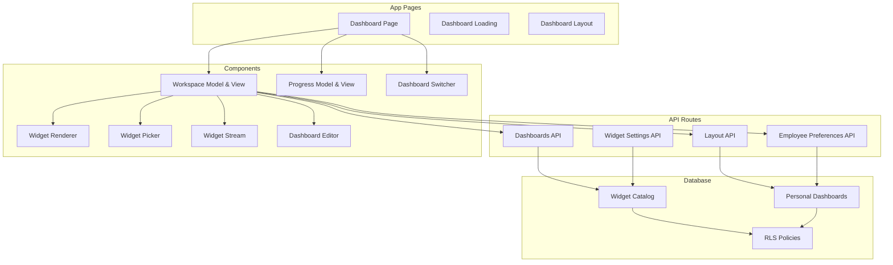
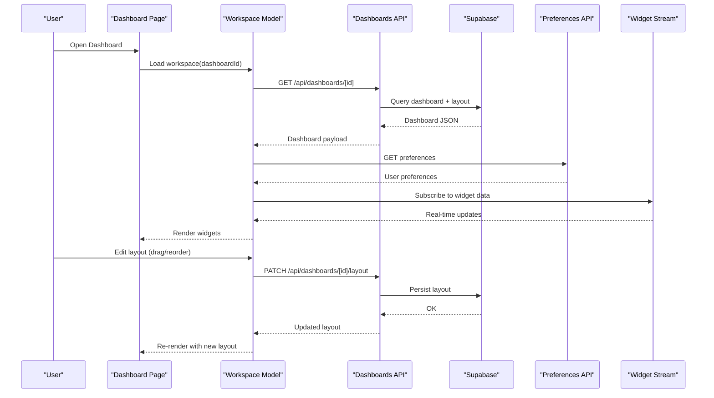
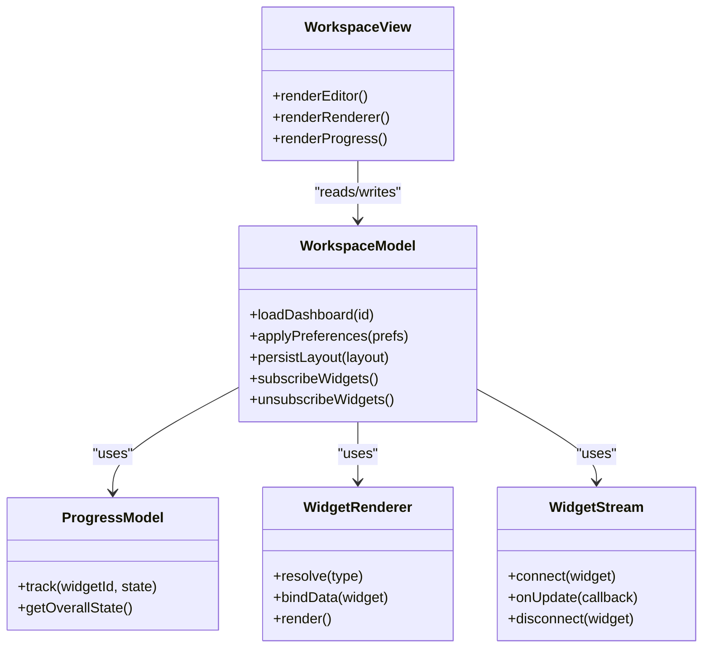
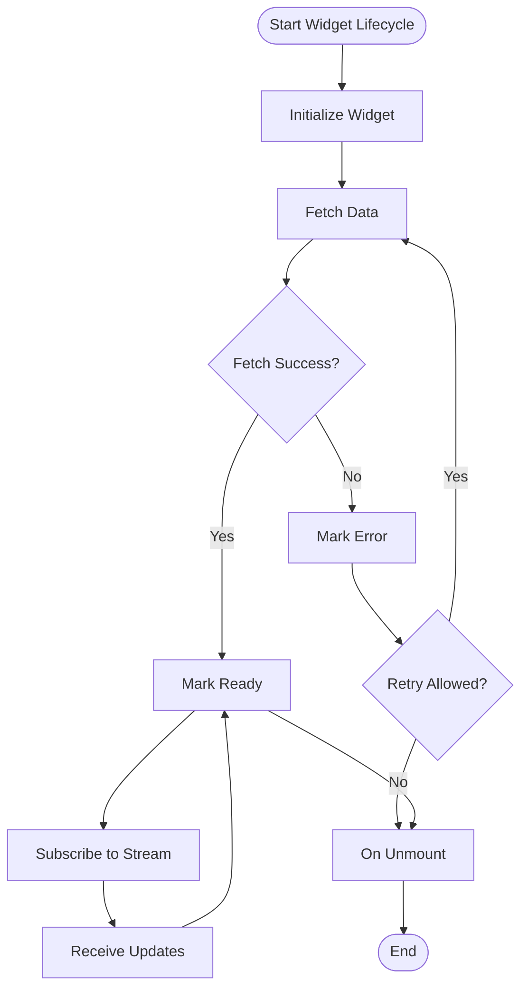
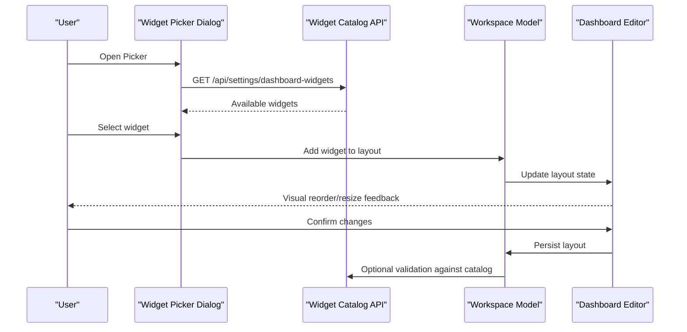
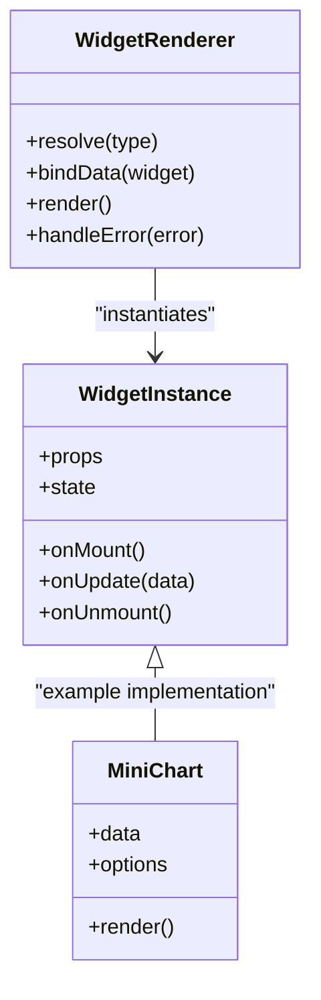
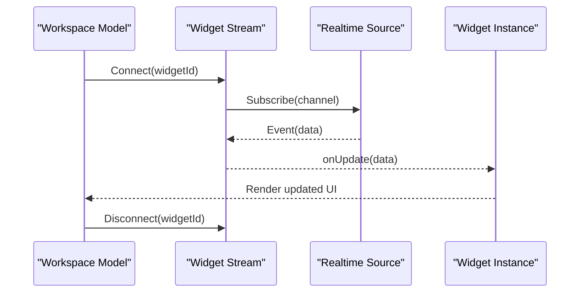
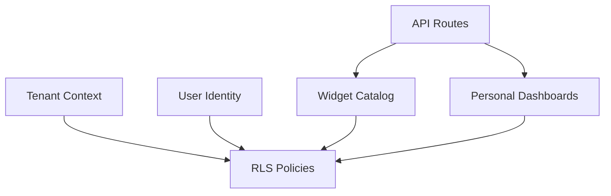
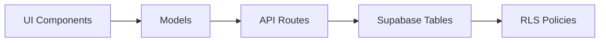

# Dashboard Engine Business Logic

<cite>
**Referenced Files in This Document**
- [page.tsx](file://apps/hr-suite/app/(dashboard)/dashboard/page.tsx)
- [loading.tsx](file://apps/hr-suite/app/(dashboard)/dashboard/loading.tsx)
- [layout.tsx](file://apps/hr-suite/app/(dashboard)/layout.tsx)
- [update-user-preferences.ts](file://apps/hr-suite/app/actions/update-user-preferences.ts)
- [route.ts](file://apps/hr-suite/app/api/dashboards/route.ts)
- [route.ts](file://apps/hr-suite/app/api/dashboards/[dashboardId]/route.ts)
- [route.ts](file://apps/hr-suite/app/api/dashboards/[dashboardId]/layout/route.ts)
- [route.ts](file://apps/hr-suite/app/api/preferences/employee-dashboard/route.ts)
- [route.ts](file://apps/hr-suite/app/api/settings/dashboard-widgets/route.ts)
- [dashboard-workspace-model.ts](file://apps/hr-suite/components/dashboard/dashboard-workspace-model.ts)
- [dashboard-workspace.tsx](file://apps/hr-suite/components/dashboard/dashboard-workspace.tsx)
- [dashboard-progress-model.ts](file://apps/hr-suite/components/dashboard/dashboard-progress-model.ts)
- [dashboard-progress.tsx](file://apps/hr-suite/components/dashboard/dashboard-progress.tsx)
- [widget-picker-model.ts](file://apps/hr-suite/components/dashboard/widget-picker-model.ts)
- [widget-picker-dialog.tsx](file://apps/hr-suite/components/dashboard/widget-picker-dialog.tsx)
- [widget-renderer.tsx](file://apps/hr-suite/components/dashboard/widget-renderer.tsx)
- [widget-skeleton.tsx](file://apps/hr-suite/components/dashboard/widget-skeleton.tsx)
- [dashboard-widget-stream.tsx](file://apps/hr-suite/components/dashboard/dashboard-widget-stream.tsx)
- [mini-chart.tsx](file://apps/hr-suite/components/dashboard/mini-chart.tsx)
- [dashboard-editor.tsx](file://apps/hr-suite/components/dashboard/dashboard-editor.tsx)
- [dashboard-switcher.tsx](file://apps/hr-suite/components/dashboard/dashboard-switcher.tsx)
- [personal_dashboards.sql](file://apps/hr-suite/supabase/migrations/20260718170000_add_dashboard_widget_catalog.sql)
- [personal_dashboards.sql](file://apps/hr-suite/supabase/migrations/20260718171000_relax_dashboard_widget_read_scope.sql)
- [personal_dashboards.sql](file://apps/hr-suite/supabase/migrations/20260718172000_expand_personal_dashboard_widget_types.sql)
- [personal_dashboards.sql](file://apps/hr-suite/supabase/migrations/20260718172051_grant_dashboard_widget_admin_permissions.sql)
- [personal_dashboards.sql](file://apps/hr-suite/supabase/migrations/20260718173000_tune_dashboard_widget_policies.sql)
</cite>

## Table of Contents
1. [Introduction](#introduction)
2. [Project Structure](#project-structure)
3. [Core Components](#core-components)
4. [Architecture Overview](#architecture-overview)
5. [Detailed Component Analysis](#detailed-component-analysis)
6. [Dependency Analysis](#dependency-analysis)
7. [Performance Considerations](#performance-considerations)
8. [Troubleshooting Guide](#troubleshooting-guide)
9. [Conclusion](#conclusion)
10. [Appendices](#appendices)

## Introduction
This document explains the business logic behind LiquidHR’s dashboard engine, focusing on widget architecture, workspace model, progress tracking, widget picker and drag-and-drop behavior, data streaming, performance optimization, and multi-tenant isolation with personalization. It is intended for both developers extending the dashboard and product stakeholders who need to understand how dashboards are composed, persisted, and updated in real time.

## Project Structure
The dashboard feature spans Next.js app routes, API endpoints, React components, and Supabase migrations:
- App pages orchestrate the dashboard shell and loading states.
- API routes handle dashboard CRUD, layout persistence, and widget catalog management.
- Components implement the workspace model, progress tracking, widget rendering, and picker UI.
- Migrations define the widget catalog, personal dashboards, and policies for tenant isolation.

**Diagram sources**
- [page.tsx](file://apps/hr-suite/app/(dashboard)/dashboard/page.tsx)
- [loading.tsx](file://apps/hr-suite/app/(dashboard)/dashboard/loading.tsx)
- [layout.tsx](file://apps/hr-suite/app/(dashboard)/layout.tsx)
- [route.ts](file://apps/hr-suite/app/api/dashboards/route.ts)
- [route.ts](file://apps/hr-suite/app/api/dashboards/[dashboardId]/route.ts)
- [route.ts](file://apps/hr-suite/app/api/dashboards/[dashboardId]/layout/route.ts)
- [route.ts](file://apps/hr-suite/app/api/preferences/employee-dashboard/route.ts)
- [route.ts](file://apps/hr-suite/app/api/settings/dashboard-widgets/route.ts)
- [dashboard-workspace-model.ts](file://apps/hr-suite/components/dashboard/dashboard-workspace-model.ts)
- [dashboard-workspace.tsx](file://apps/hr-suite/components/dashboard/dashboard-workspace.tsx)
- [dashboard-progress-model.ts](file://apps/hr-suite/components/dashboard/dashboard-progress-model.ts)
- [dashboard-progress.tsx](file://apps/hr-suite/components/dashboard/dashboard-progress.tsx)
- [widget-picker-model.ts](file://apps/hr-suite/components/dashboard/widget-picker-model.ts)
- [widget-picker-dialog.tsx](file://apps/hr-suite/components/dashboard/widget-picker-dialog.tsx)
- [widget-renderer.tsx](file://apps/hr-suite/components/dashboard/widget-renderer.tsx)
- [dashboard-widget-stream.tsx](file://apps/hr-suite/components/dashboard/dashboard-widget-stream.tsx)
- [dashboard-editor.tsx](file://apps/hr-suite/components/dashboard/dashboard-editor.tsx)
- [dashboard-switcher.tsx](file://apps/hr-suite/components/dashboard/dashboard-switcher.tsx)
- [personal_dashboards.sql](file://apps/hr-suite/supabase/migrations/20260718170000_add_dashboard_widget_catalog.sql)
- [personal_dashboards.sql](file://apps/hr-suite/supabase/migrations/20260718171000_relax_dashboard_widget_read_scope.sql)
- [personal_dashboards.sql](file://apps/hr-suite/supabase/migrations/20260718172000_expand_personal_dashboard_widget_types.sql)
- [personal_dashboards.sql](file://apps/hr-suite/supabase/migrations/20260718172051_grant_dashboard_widget_admin_permissions.sql)
- [personal_dashboards.sql](file://apps/hr-suite/supabase/migrations/20260718173000_tune_dashboard_widget_policies.sql)

**Section sources**
- [page.tsx](file://apps/hr-suite/app/(dashboard)/dashboard/page.tsx)
- [loading.tsx](file://apps/hr-suite/app/(dashboard)/dashboard/loading.tsx)
- [layout.tsx](file://apps/hr-suite/app/(dashboard)/layout.tsx)
- [route.ts](file://apps/hr-suite/app/api/dashboards/route.ts)
- [route.ts](file://apps/hr-suite/app/api/dashboards/[dashboardId]/route.ts)
- [route.ts](file://apps/hr-suite/app/api/dashboards/[dashboardId]/layout/route.ts)
- [route.ts](file://apps/hr-suite/app/api/preferences/employee-dashboard/route.ts)
- [route.ts](file://apps/hr-suite/app/api/settings/dashboard-widgets/route.ts)
- [dashboard-workspace-model.ts](file://apps/hr-suite/components/dashboard/dashboard-workspace-model.ts)
- [dashboard-workspace.tsx](file://apps/hr-suite/components/dashboard/dashboard-workspace.tsx)
- [dashboard-progress-model.ts](file://apps/hr-suite/components/dashboard/dashboard-progress-model.ts)
- [dashboard-progress.tsx](file://apps/hr-suite/components/dashboard/dashboard-progress.tsx)
- [widget-picker-model.ts](file://apps/hr-suite/components/dashboard/widget-picker-model.ts)
- [widget-picker-dialog.tsx](file://apps/hr-suite/components/dashboard/widget-picker-dialog.tsx)
- [widget-renderer.tsx](file://apps/hr-suite/components/dashboard/widget-renderer.tsx)
- [dashboard-widget-stream.tsx](file://apps/hr-suite/components/dashboard/dashboard-widget-stream.tsx)
- [dashboard-editor.tsx](file://apps/hr-suite/components/dashboard/dashboard-editor.tsx)
- [dashboard-switcher.tsx](file://apps/hr-suite/components/dashboard/dashboard-switcher.tsx)

## Core Components
- Dashboard Workspace: Manages the active dashboard, its layout, and user preferences; persists changes via API routes.
- Progress Tracking: Tracks per-widget load states and overall readiness; drives skeleton UI and completion signals.
- Widget Renderer: Resolves a widget type to a component, binds data, and renders it within the layout grid.
- Widget Picker: Provides a dialog to browse available widgets, search/filter, and add them to the current layout.
- Widget Stream: Handles real-time updates for widget data (e.g., live counters or charts).
- Dashboard Editor: Enables drag-and-drop reordering, resizing, and removal of widgets.
- Dashboard Switcher: Allows users to switch between multiple dashboards (e.g., default vs. custom).

Key responsibilities:
- Registration: Widgets are declared in the widget catalog and exposed through the settings API.
- Rendering lifecycle: Initialize -> fetch data -> render -> update stream -> dispose.
- Data binding: Declarative props and reactive streams keep widget state in sync.

**Section sources**
- [dashboard-workspace-model.ts](file://apps/hr-suite/components/dashboard/dashboard-workspace-model.ts)
- [dashboard-workspace.tsx](file://apps/hr-suite/components/dashboard/dashboard-workspace.tsx)
- [dashboard-progress-model.ts](file://apps/hr-suite/components/dashboard/dashboard-progress-model.ts)
- [dashboard-progress.tsx](file://apps/hr-suite/components/dashboard/dashboard-progress.tsx)
- [widget-renderer.tsx](file://apps/hr-suite/components/dashboard/widget-renderer.tsx)
- [widget-picker-model.ts](file://apps/hr-suite/components/dashboard/widget-picker-model.ts)
- [widget-picker-dialog.tsx](file://apps/hr-suite/components/dashboard/widget-picker-dialog.tsx)
- [dashboard-widget-stream.tsx](file://apps/hr-suite/components/dashboard/dashboard-widget-stream.tsx)
- [dashboard-editor.tsx](file://apps/hr-suite/components/dashboard/dashboard-editor.tsx)
- [dashboard-switcher.tsx](file://apps/hr-suite/components/dashboard/dashboard-switcher.tsx)

## Architecture Overview
The dashboard engine follows a layered architecture:
- Presentation layer: React components for workspace, editor, picker, renderer, and progress UI.
- State layer: Models for workspace and progress that encapsulate layout, preferences, and widget states.
- Integration layer: API routes for dashboards, layout persistence, preferences, and widget catalog.
- Persistence layer: Supabase tables for widget catalog and personal dashboards, protected by RLS policies.

**Diagram sources**
- [page.tsx](file://apps/hr-suite/app/(dashboard)/dashboard/page.tsx)
- [dashboard-workspace-model.ts](file://apps/hr-suite/components/dashboard/dashboard-workspace-model.ts)
- [route.ts](file://apps/hr-suite/app/api/dashboards/[dashboardId]/route.ts)
- [route.ts](file://apps/hr-suite/app/api/dashboards/[dashboardId]/layout/route.ts)
- [route.ts](file://apps/hr-suite/app/api/preferences/employee-dashboard/route.ts)
- [dashboard-widget-stream.tsx](file://apps/hr-suite/components/dashboard/dashboard-widget-stream.tsx)

## Detailed Component Analysis

### Workspace Model and View
The workspace model holds the active dashboard configuration, including layout, visibility, and user preferences. The view composes the editor, renderer, and progress indicators.

Key behaviors:
- Loads dashboard metadata and layout from the API.
- Applies user preferences (e.g., theme, date format) to widgets.
- Persists layout changes atomically.
- Coordinates widget subscriptions for live updates.

**Diagram sources**
- [dashboard-workspace-model.ts](file://apps/hr-suite/components/dashboard/dashboard-workspace-model.ts)
- [dashboard-workspace.tsx](file://apps/hr-suite/components/dashboard/dashboard-workspace.tsx)
- [dashboard-progress-model.ts](file://apps/hr-suite/components/dashboard/dashboard-progress-model.ts)
- [widget-renderer.tsx](file://apps/hr-suite/components/dashboard/widget-renderer.tsx)
- [dashboard-widget-stream.tsx](file://apps/hr-suite/components/dashboard/dashboard-widget-stream.tsx)

**Section sources**
- [dashboard-workspace-model.ts](file://apps/hr-suite/components/dashboard/dashboard-workspace-model.ts)
- [dashboard-workspace.tsx](file://apps/hr-suite/components/dashboard/dashboard-workspace.tsx)

### Progress Tracking System
Progress tracking monitors each widget’s lifecycle: initializing, fetching data, ready, error, and disposed. The overall progress aggregates these states to show skeletons and completion.

**Diagram sources**
- [dashboard-progress-model.ts](file://apps/hr-suite/components/dashboard/dashboard-progress-model.ts)
- [dashboard-progress.tsx](file://apps/hr-suite/components/dashboard/dashboard-progress.tsx)

**Section sources**
- [dashboard-progress-model.ts](file://apps/hr-suite/components/dashboard/dashboard-progress-model.ts)
- [dashboard-progress.tsx](file://apps/hr-suite/components/dashboard/dashboard-progress.tsx)

### Widget Picker and Drag-and-Drop Interface
The widget picker provides a searchable catalog of available widgets. Users can add widgets to the current layout. The editor supports drag-and-drop reordering and resizing.

**Diagram sources**
- [widget-picker-dialog.tsx](file://apps/hr-suite/components/dashboard/widget-picker-dialog.tsx)
- [widget-picker-model.ts](file://apps/hr-suite/components/dashboard/widget-picker-model.ts)
- [route.ts](file://apps/hr-suite/app/api/settings/dashboard-widgets/route.ts)
- [dashboard-editor.tsx](file://apps/hr-suite/components/dashboard/dashboard-editor.tsx)
- [dashboard-workspace-model.ts](file://apps/hr-suite/components/dashboard/dashboard-workspace-model.ts)

**Section sources**
- [widget-picker-dialog.tsx](file://apps/hr-suite/components/dashboard/widget-picker-dialog.tsx)
- [widget-picker-model.ts](file://apps/hr-suite/components/dashboard/widget-picker-model.ts)
- [route.ts](file://apps/hr-suite/app/api/settings/dashboard-widgets/route.ts)
- [dashboard-editor.tsx](file://apps/hr-suite/components/dashboard/dashboard-editor.tsx)

### Widget Rendering and Data Binding
The renderer resolves a widget type to a component, binds required data, and handles lifecycle events. Data binding patterns include:
- Static props for configuration.
- Reactive streams for live updates.
- Error boundaries to isolate failures.

**Diagram sources**
- [widget-renderer.tsx](file://apps/hr-suite/components/dashboard/widget-renderer.tsx)
- [mini-chart.tsx](file://apps/hr-suite/components/dashboard/mini-chart.tsx)

**Section sources**
- [widget-renderer.tsx](file://apps/hr-suite/components/dashboard/widget-renderer.tsx)
- [mini-chart.tsx](file://apps/hr-suite/components/dashboard/mini-chart.tsx)

### Data Streaming Patterns
Widgets can subscribe to real-time channels for live data. The stream manager connects, listens, and dispatches updates to subscribed widgets.

**Diagram sources**
- [dashboard-widget-stream.tsx](file://apps/hr-suite/components/dashboard/dashboard-widget-stream.tsx)

**Section sources**
- [dashboard-widget-stream.tsx](file://apps/hr-suite/components/dashboard/dashboard-widget-stream.tsx)

### Multi-Tenant Isolation and Personalization
Multi-tenancy is enforced via database policies and scoped APIs:
- Widget catalog is shared but filtered by tenant context where applicable.
- Personal dashboards are isolated per user and tenant.
- Preferences are stored per user and applied at runtime.

**Diagram sources**
- [personal_dashboards.sql](file://apps/hr-suite/supabase/migrations/20260718170000_add_dashboard_widget_catalog.sql)
- [personal_dashboards.sql](file://apps/hr-suite/supabase/migrations/20260718171000_relax_dashboard_widget_read_scope.sql)
- [personal_dashboards.sql](file://apps/hr-suite/supabase/migrations/20260718172000_expand_personal_dashboard_widget_types.sql)
- [personal_dashboards.sql](file://apps/hr-suite/supabase/migrations/20260718172051_grant_dashboard_widget_admin_permissions.sql)
- [personal_dashboards.sql](file://apps/hr-suite/supabase/migrations/20260718173000_tune_dashboard_widget_policies.sql)
- [route.ts](file://apps/hr-suite/app/api/dashboards/route.ts)
- [route.ts](file://apps/hr-suite/app/api/preferences/employee-dashboard/route.ts)

**Section sources**
- [personal_dashboards.sql](file://apps/hr-suite/supabase/migrations/20260718170000_add_dashboard_widget_catalog.sql)
- [personal_dashboards.sql](file://apps/hr-suite/supabase/migrations/20260718171000_relax_dashboard_widget_read_scope.sql)
- [personal_dashboards.sql](file://apps/hr-suite/supabase/migrations/20260718172000_expand_personal_dashboard_widget_types.sql)
- [personal_dashboards.sql](file://apps/hr-suite/supabase/migrations/20260718172051_grant_dashboard_widget_admin_permissions.sql)
- [personal_dashboards.sql](file://apps/hr-suite/supabase/migrations/20260718173000_tune_dashboard_widget_policies.sql)
- [route.ts](file://apps/hr-suite/app/api/dashboards/route.ts)
- [route.ts](file://apps/hr-suite/app/api/preferences/employee-dashboard/route.ts)

## Dependency Analysis
The dashboard engine has clear separation between UI, state, and integration layers. Dependencies flow downward:
- UI components depend on models.
- Models depend on API routes.
- API routes depend on database tables and policies.

**Diagram sources**
- [dashboard-workspace.tsx](file://apps/hr-suite/components/dashboard/dashboard-workspace.tsx)
- [dashboard-workspace-model.ts](file://apps/hr-suite/components/dashboard/dashboard-workspace-model.ts)
- [route.ts](file://apps/hr-suite/app/api/dashboards/route.ts)
- [personal_dashboards.sql](file://apps/hr-suite/supabase/migrations/20260718170000_add_dashboard_widget_catalog.sql)

**Section sources**
- [dashboard-workspace.tsx](file://apps/hr-suite/components/dashboard/dashboard-workspace.tsx)
- [dashboard-workspace-model.ts](file://apps/hr-suite/components/dashboard/dashboard-workspace-model.ts)
- [route.ts](file://apps/hr-suite/app/api/dashboards/route.ts)
- [personal_dashboards.sql](file://apps/hr-suite/supabase/migrations/20260718170000_add_dashboard_widget_catalog.sql)

## Performance Considerations
- Lazy loading: Defer widget initialization until visible in the viewport.
- Caching: Cache widget configurations and static data; invalidate on changes.
- Debouncing: Throttle layout persistence and preference updates.
- Streaming efficiency: Batch updates and avoid unnecessary re-renders.
- Skeleton UI: Show placeholders during fetch to improve perceived performance.
- Error boundaries: Isolate widget failures to prevent cascade.

[No sources needed since this section provides general guidance]

## Troubleshooting Guide
Common issues and resolutions:
- Widget fails to load: Check progress state and error boundary logs; verify API responses and permissions.
- Layout not persisting: Ensure PATCH requests succeed and policies allow writes; validate payload schema.
- Real-time updates not received: Confirm channel subscription and event mapping; check network and auth tokens.
- Multi-tenant data leakage: Review RLS policies and tenant context propagation in API routes.

**Section sources**
- [dashboard-progress-model.ts](file://apps/hr-suite/components/dashboard/dashboard-progress-model.ts)
- [route.ts](file://apps/hr-suite/app/api/dashboards/[dashboardId]/layout/route.ts)
- [dashboard-widget-stream.tsx](file://apps/hr-suite/components/dashboard/dashboard-widget-stream.tsx)
- [personal_dashboards.sql](file://apps/hr-suite/supabase/migrations/20260718173000_tune_dashboard_widget_policies.sql)

## Conclusion
LiquidHR’s dashboard engine combines a robust workspace model, progressive rendering, and real-time streaming to deliver a responsive, personalized experience. The widget architecture supports extensibility through a catalog-driven registration process, while multi-tenant isolation ensures secure, scoped access. By following the documented patterns and best practices, teams can develop custom widgets, optimize performance, and maintain consistent user experiences across tenants.

[No sources needed since this section summarizes without analyzing specific files]

## Appendices

### Custom Widget Development Checklist
- Register widget type in the catalog via settings API.
- Implement lifecycle hooks: onMount, onUpdate, onUnmount.
- Bind data declaratively; use streams for live updates.
- Handle errors gracefully; integrate with progress tracker.
- Test with different data shapes and edge cases.

[No sources needed since this section provides general guidance]

### Example: Adding a New Widget
- Define widget metadata and schema in the catalog.
- Create a component implementing the widget interface.
- Wire up data source (REST or realtime).
- Add to picker catalog and test drag-and-drop placement.
- Validate tenant isolation and permissions.

[No sources needed since this section provides general guidance]