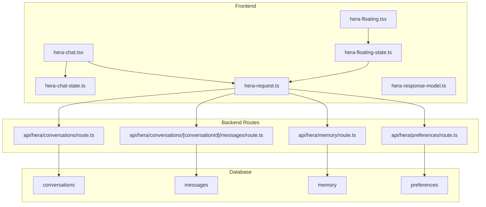
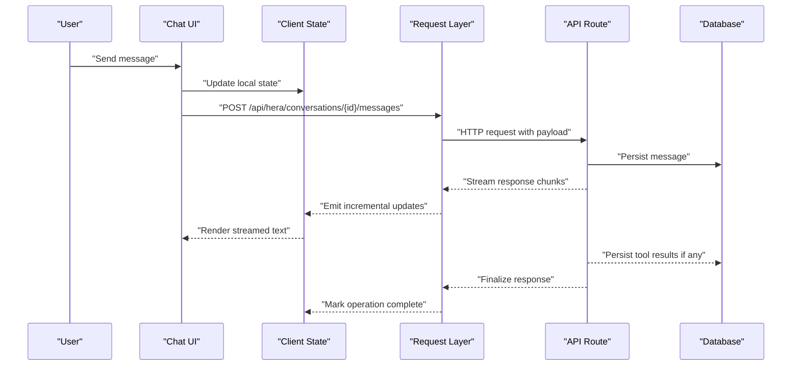
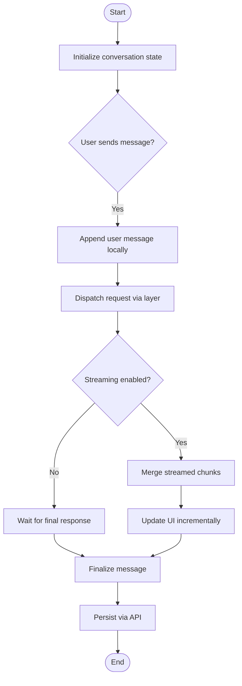
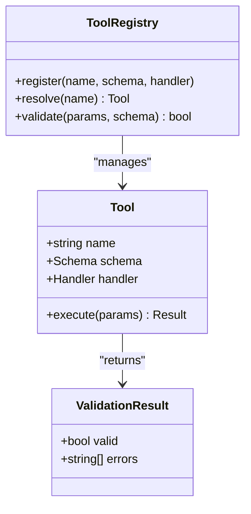
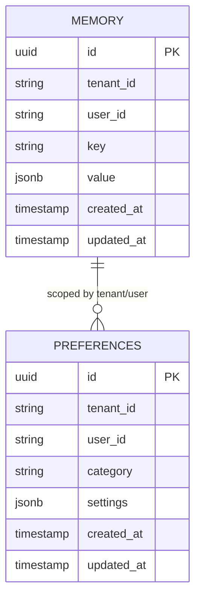
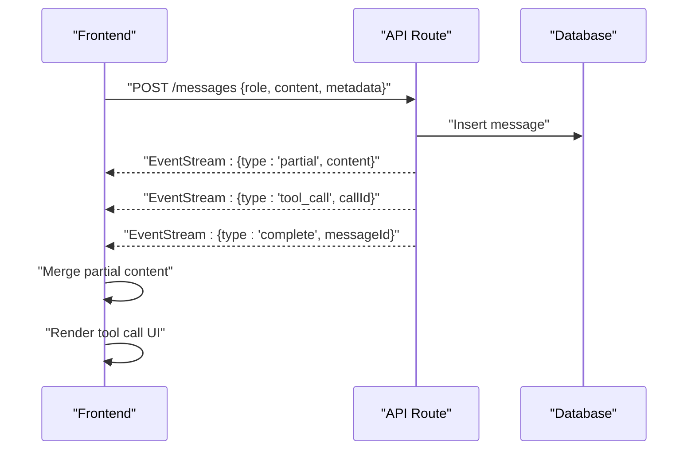
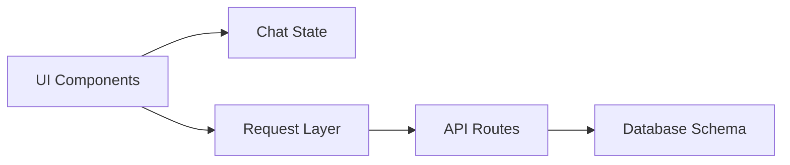

# HERA AI Assistant Business Logic

<cite>
**Referenced Files in This Document**
- [hera-chat-state.ts](file://apps/hr-suite/components/hera/hera-chat-state.ts)
- [hera-chat.tsx](file://apps/hr-suite/components/hera/hera-chat.tsx)
- [hera-request.ts](file://apps/hr-suite/components/hera/hera-request.ts)
- [hera-response-model.ts](file://apps/hr-suite/components/hera/hera-response-model.ts)
- [hera-floating-state.ts](file://apps/hr-suite/components/hera/hera-floating-state.ts)
- [hera-floating.tsx](file://apps/hr-suite/components/hera/hera-floating.tsx)
- [route.ts](file://apps/hr-suite/app/api/hera/conversations/route.ts)
- [route.ts](file://apps/hr-suite/app/api/hera/conversations/[conversationId]/route.ts)
- [route.ts](file://apps/hr-suite/app/api/hera/conversations/[conversationId]/messages/route.ts)
- [route.ts](file://apps/hr-suite/app/api/hera/memory/route.ts)
- [route.ts](file://apps/hr-suite/app/api/hera/preferences/route.ts)
- [20260716092637_add_hera_ai_agent.sql](file://apps/hr-suite/supabase/migrations/20260716092637_add_hera_ai_agent.sql)
- [20260717100000_harden_hera_memory_and_preferences.sql](file://apps/hr-suite/supabase/migrations/20260717100000_harden_hera_memory_and_preferences.sql)
- [20260717100500_index_hera_preferences.sql](file://apps/hr-suite/supabase/migrations/20260717100500_index_hera_preferences.sql)
- [20260717101000_add_hera_message_metadata.sql](file://apps/hr-suite/supabase/migrations/20260717101000_add_hera_message_metadata.sql)
</cite>

## Table of Contents
1. [Introduction](#introduction)
2. [Project Structure](#project-structure)
3. [Core Components](#core-components)
4. [Architecture Overview](#architecture-overview)
5. [Detailed Component Analysis](#detailed-component-analysis)
6. [Dependency Analysis](#dependency-analysis)
7. [Performance Considerations](#performance-considerations)
8. [Troubleshooting Guide](#troubleshooting-guide)
9. [Conclusion](#conclusion)
10. [Appendices](#appendices)

## Introduction
This document explains the business logic behind LiquidHR’s HERA AI assistant. It covers chat state management (conversation history, context preservation, and session handling), the tool execution framework (registration, parameter validation, result processing), persistent memory for AI knowledge and user preferences, and the request/response model including message formatting, error handling, and streaming responses. It also provides guidance on custom tool development, prompt engineering patterns, integration with HR data sources, and security considerations such as safe tool execution, data privacy, and rate limiting.

## Project Structure
HERA spans both the Next.js frontend components and API routes:
- Frontend components manage UI state, conversation rendering, and client-side request orchestration.
- API routes handle persistence of conversations, messages, memory entries, and preferences.
- Database migrations define the schema for conversations, messages, memory, and preferences.

**Diagram sources**
- [hera-chat.tsx](file://apps/hr-suite/components/hera/hera-chat.tsx)
- [hera-chat-state.ts](file://apps/hr-suite/components/hera/hera-chat-state.ts)
- [hera-floating.tsx](file://apps/hr-suite/components/hera/hera-floating.tsx)
- [hera-floating-state.ts](file://apps/hr-suite/components/hera/hera-floating-state.ts)
- [hera-request.ts](file://apps/hr-suite/components/hera/hera-request.ts)
- [hera-response-model.ts](file://apps/hr-suite/components/hera/hera-response-model.ts)
- [route.ts](file://apps/hr-suite/app/api/hera/conversations/route.ts)
- [route.ts](file://apps/hr-suite/app/api/hera/conversations/[conversationId]/messages/route.ts)
- [route.ts](file://apps/hr-suite/app/api/hera/memory/route.ts)
- [route.ts](file://apps/hr-suite/app/api/hera/preferences/route.ts)

**Section sources**
- [hera-chat-state.ts](file://apps/hr-suite/components/hera/hera-chat-state.ts)
- [hera-chat.tsx](file://apps/hr-suite/components/hera/hera-chat.tsx)
- [hera-request.ts](file://apps/hr-suite/components/hera/hera-request.ts)
- [hera-response-model.ts](file://apps/hr-suite/components/hera/hera-response-model.ts)
- [hera-floating-state.ts](file://apps/hr-suite/components/hera/hera-floating-state.ts)
- [hera-floating.tsx](file://apps/hr-suite/components/hera/hera-floating.tsx)
- [route.ts](file://apps/hr-suite/app/api/hera/conversations/route.ts)
- [route.ts](file://apps/hr-suite/app/api/hera/conversations/[conversationId]/messages/route.ts)
- [route.ts](file://apps/hr-suite/app/api/hera/memory/route.ts)
- [route.ts](file://apps/hr-suite/app/api/hera/preferences/route.ts)

## Core Components
- Chat State Management: Centralized state tracks active conversation, message history, typing indicators, and pending operations. It ensures consistent updates across UI and supports rehydration from persisted messages.
- Request Layer: Encapsulates HTTP calls to HERA endpoints, normalizes payloads, handles retries, and streams server-sent events when available.
- Response Model: Defines typed structures for messages, tool results, and streaming chunks to ensure type safety across the stack.
- Floating UI and State: Lightweight overlay that hosts a compact chat interface and shares state with the main chat component.

Key responsibilities:
- Conversation lifecycle: create, resume, list, delete.
- Message lifecycle: append, update, stream partial content.
- Memory and preferences: read/write scoped by tenant/user.
- Error handling: network errors, validation failures, and server-side exceptions surfaced consistently.

**Section sources**
- [hera-chat-state.ts](file://apps/hr-suite/components/hera/hera-chat-state.ts)
- [hera-request.ts](file://apps/hr-suite/components/hera/hera-request.ts)
- [hera-response-model.ts](file://apps/hr-suite/components/hera/hera-response-model.ts)
- [hera-floating-state.ts](file://apps/hr-suite/components/hera/hera-floating-state.ts)

## Architecture Overview
The HERA system follows a layered architecture:
- UI Layer: React components render chat interfaces and manage local state.
- Client Request Layer: Normalizes requests, manages concurrency, and streams responses.
- API Layer: Next.js route handlers validate inputs, enforce authorization, and coordinate persistence.
- Persistence Layer: Supabase-managed tables store conversations, messages, memory, and preferences.

**Diagram sources**
- [hera-chat.tsx](file://apps/hr-suite/components/hera/hera-chat.tsx)
- [hera-chat-state.ts](file://apps/hr-suite/components/hera/hera-chat-state.ts)
- [hera-request.ts](file://apps/hr-suite/components/hera/hera-request.ts)
- [route.ts](file://apps/hr-suite/app/api/hera/conversations/[conversationId]/messages/route.ts)

## Detailed Component Analysis

### Chat State Management
Responsibilities:
- Maintain conversation ID, message list, and metadata (e.g., timestamps, status).
- Provide actions to append messages, mark streaming progress, and reset state.
- Persist and restore conversation snapshots to avoid losing context on reloads.

Data flow:
- User input triggers state update and request dispatch.
- Streaming updates merge into existing messages without full re-renders.
- On completion, finalize message and persist via API.

**Diagram sources**
- [hera-chat-state.ts](file://apps/hr-suite/components/hera/hera-chat-state.ts)
- [hera-request.ts](file://apps/hr-suite/components/hera/hera-request.ts)

**Section sources**
- [hera-chat-state.ts](file://apps/hr-suite/components/hera/hera-chat-state.ts)
- [hera-chat.tsx](file://apps/hr-suite/components/hera/hera-chat.tsx)

### Tool Execution Framework
Concepts:
- Tool registration: Define tools with names, schemas, and handlers.
- Parameter validation: Enforce types and constraints before execution.
- Result processing: Normalize outputs, attach metadata, and integrate into conversation context.

Execution flow:
- The AI engine proposes tool calls based on prompts and context.
- The framework validates parameters against registered schemas.
- Handlers execute safely within an isolated context, returning structured results.
- Results are appended to the conversation and can trigger follow-up actions.

**Diagram sources**
- [hera-response-model.ts](file://apps/hr-suite/components/hera/hera-response-model.ts)

Guidance for custom tools:
- Define clear input schemas with required fields and constraints.
- Implement idempotent handlers where possible.
- Return standardized result objects with success flags and error details.
- Log execution context for auditability without exposing sensitive data.

**Section sources**
- [hera-response-model.ts](file://apps/hr-suite/components/hera/hera-response-model.ts)

### Memory System
Purpose:
- Store persistent AI knowledge, preferences, and user-specific data.
- Scope data per tenant and user to ensure isolation.
- Support retrieval and updates during conversation context building.

Operations:
- Read memory entries relevant to current context.
- Write or update preferences and learned facts.
- Index frequently accessed keys for performance.

**Diagram sources**
- [20260717100000_harden_hera_memory_and_preferences.sql](file://apps/hr-suite/supabase/migrations/20260717100000_harden_hera_memory_and_preferences.sql)
- [20260717100500_index_hera_preferences.sql](file://apps/hr-suite/supabase/migrations/20260717100500_index_hera_preferences.sql)

**Section sources**
- [route.ts](file://apps/hr-suite/app/api/hera/memory/route.ts)
- [route.ts](file://apps/hr-suite/app/api/hera/preferences/route.ts)
- [20260717100000_harden_hera_memory_and_preferences.sql](file://apps/hr-suite/supabase/migrations/20260717100000_harden_hera_memory_and_preferences.sql)
- [20260717100500_index_hera_preferences.sql](file://apps/hr-suite/supabase/migrations/20260717100500_index_hera_preferences.sql)

### Request/Response Model
Message formatting:
- Messages include role, content, and optional metadata (tool calls, timestamps).
- Streaming responses emit incremental chunks with sequence numbers.

Error handling:
- Network errors return structured error codes and messages.
- Validation failures specify invalid fields and constraints.
- Server-side exceptions are sanitized to prevent leaking internal details.

Streaming:
- Use server-sent events or chunked transfer for real-time updates.
- Client merges chunks into existing messages to maintain continuity.

**Diagram sources**
- [hera-request.ts](file://apps/hr-suite/components/hera/hera-request.ts)
- [hera-response-model.ts](file://apps/hr-suite/components/hera/hera-response-model.ts)
- [route.ts](file://apps/hr-suite/app/api/hera/conversations/[conversationId]/messages/route.ts)

**Section sources**
- [hera-request.ts](file://apps/hr-suite/components/hera/hera-request.ts)
- [hera-response-model.ts](file://apps/hr-suite/components/hera/hera-response-model.ts)
- [route.ts](file://apps/hr-suite/app/api/hera/conversations/[conversationId]/messages/route.ts)

### Session Handling and Context Preservation
- Sessions are tied to conversation IDs; each conversation maintains its own message history.
- Context is preserved by including recent messages and memory snippets in prompts.
- On app reload, state is rehydrated from persisted messages and memory.

Best practices:
- Limit context window size to balance relevance and cost.
- Summarize older messages periodically to keep context concise.
- Tag messages with roles and tool references for clarity.

**Section sources**
- [hera-chat-state.ts](file://apps/hr-suite/components/hera/hera-chat-state.ts)
- [hera-chat.tsx](file://apps/hr-suite/components/hera/hera-chat.tsx)

### Prompt Engineering Patterns
Patterns:
- Role-based instructions: Separate system, user, and assistant roles.
- Structured outputs: Request JSON or specific formats for tool calls.
- Guardrails: Explicit rules to avoid unsafe actions or unauthorized data access.
- Few-shot examples: Include examples to guide behavior and tone.

Integration with HR data:
- Inject relevant context (e.g., employee attributes, policies) into prompts.
- Use tools to fetch live data rather than embedding large datasets in prompts.
- Validate tool outputs before presenting to users.

**Section sources**
- [hera-response-model.ts](file://apps/hr-suite/components/hera/hera-response-model.ts)

### Custom Tool Development Examples
Steps:
- Register a new tool with a unique name and schema.
- Implement a handler that performs the action safely and returns a standardized result.
- Wire tool results into the conversation flow for transparency.

Security considerations:
- Validate all inputs strictly.
- Run tools in isolated contexts with minimal privileges.
- Log actions without sensitive payloads.

**Section sources**
- [hera-response-model.ts](file://apps/hr-suite/components/hera/hera-response-model.ts)

### Integration with HR Data Sources
Approach:
- Expose HR data through secure APIs or RPCs.
- Use tools to query employees, departments, leave balances, etc.
- Cache frequently accessed data to reduce latency.

Authorization:
- Enforce tenant and user scoping at every layer.
- Apply least privilege principles for data access.

**Section sources**
- [route.ts](file://apps/hr-suite/app/api/hera/conversations/[conversationId]/messages/route.ts)

## Dependency Analysis
Dependencies between components:
- UI components depend on state and request layers.
- Request layer depends on API routes for persistence and processing.
- API routes depend on database schema defined by migrations.

**Diagram sources**
- [hera-chat.tsx](file://apps/hr-suite/components/hera/hera-chat.tsx)
- [hera-chat-state.ts](file://apps/hr-suite/components/hera/hera-chat-state.ts)
- [hera-request.ts](file://apps/hr-suite/components/hera/hera-request.ts)
- [route.ts](file://apps/hr-suite/app/api/hera/conversations/route.ts)
- [20260716092637_add_hera_ai_agent.sql](file://apps/hr-suite/supabase/migrations/20260716092637_add_hera_ai_agent.sql)

**Section sources**
- [hera-chat.tsx](file://apps/hr-suite/components/hera/hera-chat.tsx)
- [hera-chat-state.ts](file://apps/hr-suite/components/hera/hera-chat-state.ts)
- [hera-request.ts](file://apps/hr-suite/components/hera/hera-request.ts)
- [route.ts](file://apps/hr-suite/app/api/hera/conversations/route.ts)
- [20260716092637_add_hera_ai_agent.sql](file://apps/hr-suite/supabase/migrations/20260716092637_add_hera_ai_agent.sql)

## Performance Considerations
- Stream responses to improve perceived latency.
- Batch database writes where appropriate.
- Cache memory and preferences for frequent reads.
- Limit context window size and summarize older messages.
- Use indexes on frequently queried keys in memory and preferences.

[No sources needed since this section provides general guidance]

## Troubleshooting Guide
Common issues:
- Missing conversation ID: Ensure proper routing and state initialization.
- Streaming interruptions: Implement retry logic and reconnect strategies.
- Validation errors: Check schema definitions and input sanitization.
- Authorization failures: Verify tenant and user scoping in API routes.

Debugging tips:
- Log request payloads and responses (without sensitive data).
- Inspect database records for consistency.
- Use browser dev tools to monitor event streams.

**Section sources**
- [hera-request.ts](file://apps/hr-suite/components/hera/hera-request.ts)
- [route.ts](file://apps/hr-suite/app/api/hera/conversations/[conversationId]/messages/route.ts)

## Conclusion
HERA’s business logic combines robust chat state management, a flexible tool execution framework, and persistent memory to deliver a responsive and intelligent HR assistant. By adhering to secure, scalable patterns and leveraging streaming and caching, the system provides a smooth user experience while maintaining data privacy and performance.

[No sources needed since this section summarizes without analyzing specific files]

## Appendices

### Security Considerations
- Tool execution: Validate inputs, isolate execution, and log actions.
- Data privacy: Scope all data by tenant and user; sanitize logs.
- Rate limiting: Enforce quotas per user/tenant to prevent abuse.

**Section sources**
- [route.ts](file://apps/hr-suite/app/api/hera/conversations/route.ts)
- [route.ts](file://apps/hr-suite/app/api/hera/memory/route.ts)
- [route.ts](file://apps/hr-suite/app/api/hera/preferences/route.ts)

### Database Schema References
- Conversations and messages: Defined in migration files.
- Memory and preferences: Scoped by tenant and user with indexed keys.

**Section sources**
- [20260716092637_add_hera_ai_agent.sql](file://apps/hr-suite/supabase/migrations/20260716092637_add_hera_ai_agent.sql)
- [20260717100000_harden_hera_memory_and_preferences.sql](file://apps/hr-suite/supabase/migrations/20260717100000_harden_hera_memory_and_preferences.sql)
- [20260717100500_index_hera_preferences.sql](file://apps/hr-suite/supabase/migrations/20260717100500_index_hera_preferences.sql)
- [20260717101000_add_hera_message_metadata.sql](file://apps/hr-suite/supabase/migrations/20260717101000_add_hera_message_metadata.sql)