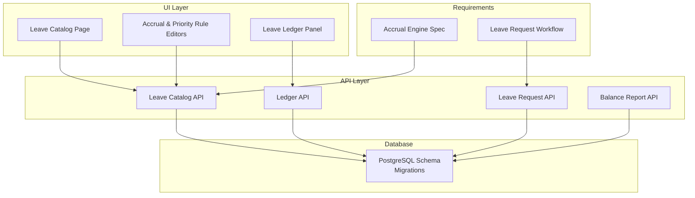
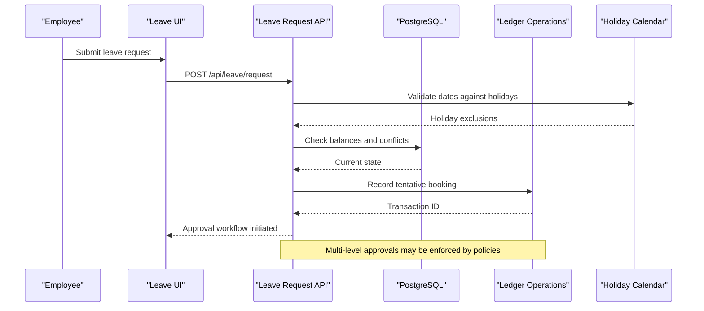
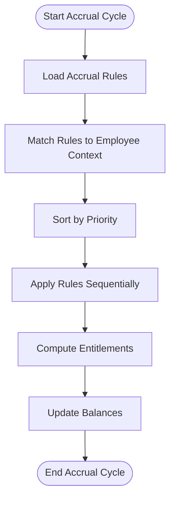
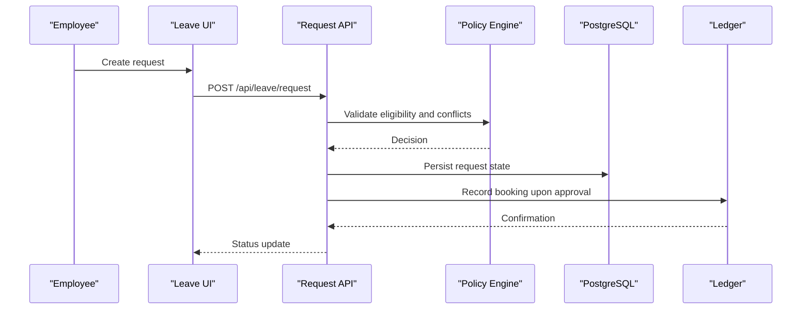
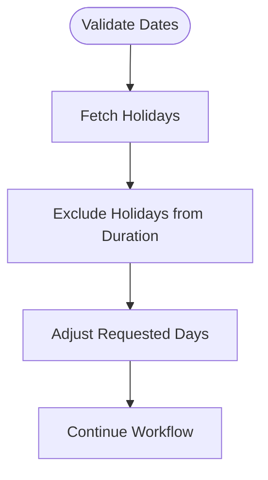
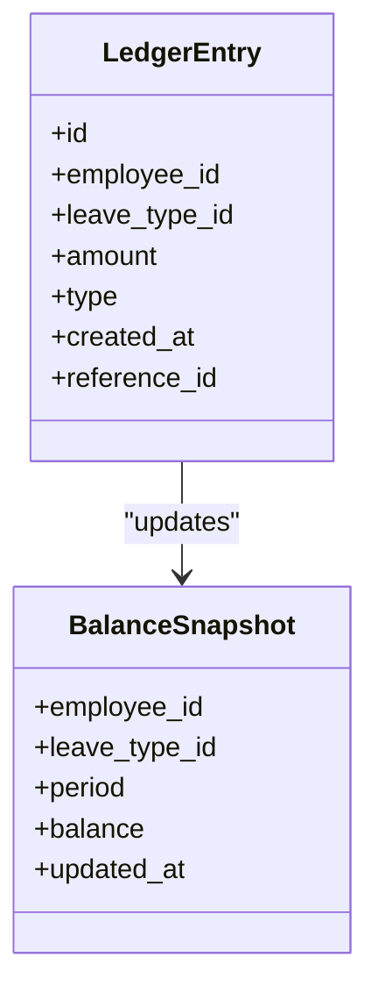
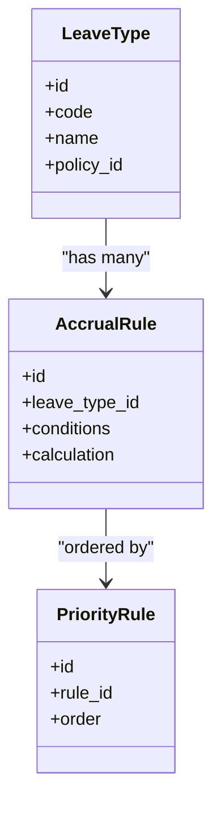
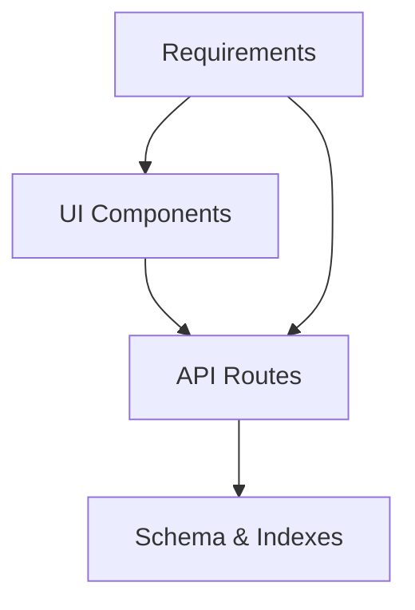

# Leave Engine Business Logic

<cite>
**Referenced Files in This Document**
- [leave_engine_foundation.sql](file://apps/hr-suite/supabase/migrations/20260722142551_add_leave_engine_foundation.sql)
- [leave_engine_fk_indexes.sql](file://apps/hr-suite/supabase/migrations/20260722144232_add_leave_engine_fk_indexes.sql)
- [leave_transaction_bucket_fk_index.sql](file://apps/hr-suite/supabase/migrations/20260722144344_add_leave_transaction_bucket_fk_index.sql)
- [leave_configuration_mutation_functions.sql](file://apps/hr-suite/supabase/migrations/20260722151920_add_leave_configuration_mutation_functions.sql)
- [leave_request_booking_engine.sql](file://apps/hr-suite/supabase/migrations/20260722190000_add_leave_request_booking_engine.sql)
- [seed_leave_demo_linda.sql](file://apps/hr-suite/supabase/migrations/20260722190500_seed_leave_demo_linda.sql)
- [leave_request_fk_indexes.sql](file://apps/hr-suite/supabase/migrations/20260722191500_add_leave_request_fk_indexes.sql)
- [leave_ledger_operations.sql](file://apps/hr-suite/supabase/migrations/20260722192000_add_leave_ledger_operations.sql)
- [skip_holidays_in_leave_requests.sql](file://apps/hr-suite/supabase/migrations/20260722192500_skip_holidays_in_leave_requests.sql)
- [route.ts](file://apps/hr-suite/app/api/leave/balance-report/route.ts)
- [route.ts](file://apps/hr-suite/app/api/leave/catalog/route.ts)
- [route.ts](file://apps/hr-suite/app/api/leave/ledger/route.ts)
- [route.ts](file://apps/hr-suite/app/api/leave/request/route.ts)
- [route.ts](file://apps/hr-suite/app/api/leave/request/preview/route.ts)
- [leave-catalog-page.tsx](file://apps/hr-suite/components/leave/leave-catalog-page.tsx)
- [accrual-rule-editor.tsx](file://apps/hr-suite/components/leave/accrual-rule-editor.tsx)
- [priority-rule-editor.tsx](file://apps/hr-suite/components/leave/priority-rule-editor.tsx)
- [priority-rules-page.tsx](file://apps/hr-suite/components/leave/priority-rules-page.tsx)
- [leave-ledger-panel.tsx](file://apps/hr-suite/components/leave/leave-ledger-panel.tsx)
- [leave-type-editor.tsx](file://apps/hr-suite/components/leave/leave-type-editor.tsx)
- [VERLOF_OPBOUW_ENGINE.md](file://docs/requirements/leave/VERLOF_OPBOUW_ENGINE.md)
- [VERLOF_AANVRAAG_HR_ADMIN.md](file://docs/requirements/leave/VERLOF_AANVRAAG_HR_ADMIN.md)
</cite>

## Table of Contents
1. [Introduction](#introduction)
2. [Project Structure](#project-structure)
3. [Core Components](#core-components)
4. [Architecture Overview](#architecture-overview)
5. [Detailed Component Analysis](#detailed-component-analysis)
6. [Dependency Analysis](#dependency-analysis)
7. [Performance Considerations](#performance-considerations)
8. [Troubleshooting Guide](#troubleshooting-guide)
9. [Conclusion](#conclusion)
10. [Appendices](#appendices)

## Introduction
This document explains the business logic of LiquidHR’s leave engine, focusing on accrual calculations, rule-based policies, priority handling, balance computations, leave request workflows (including approvals and conflict resolution), holiday integration, ledger tracking, and catalog management. It synthesizes database schema migrations, API routes, UI components, and requirements documents to provide a comprehensive view for both technical and non-technical readers.

## Project Structure
The leave engine spans multiple layers:
- Database layer: Migrations define core tables, indexes, functions, and seed data for leave types, rules, requests, and ledger entries.
- API layer: Next.js API routes expose endpoints for catalog management, request submission and preview, ledger queries, and balance reporting.
- UI layer: React components enable configuration of leave types, accrual rules, priority rules, and viewing of ledgers and catalogs.
- Requirements: Domain specifications describe accrual engine behavior and HR admin processes for leave requests.

**Diagram sources**
- [leave_engine_foundation.sql](file://apps/hr-suite/supabase/migrations/20260722142551_add_leave_engine_foundation.sql)
- [leave_request_booking_engine.sql](file://apps/hr-suite/supabase/migrations/20260722190000_add_leave_request_booking_engine.sql)
- [leave_ledger_operations.sql](file://apps/hr-suite/supabase/migrations/20260722192000_add_leave_ledger_operations.sql)
- [route.ts](file://apps/hr-suite/app/api/leave/catalog/route.ts)
- [route.ts](file://apps/hr-suite/app/api/leave/request/route.ts)
- [route.ts](file://apps/hr-suite/app/api/leave/ledger/route.ts)
- [route.ts](file://apps/hr-suite/app/api/leave/balance-report/route.ts)
- [leave-catalog-page.tsx](file://apps/hr-suite/components/leave/leave-catalog-page.tsx)
- [accrual-rule-editor.tsx](file://apps/hr-suite/components/leave/accrual-rule-editor.tsx)
- [priority-rule-editor.tsx](file://apps/hr-suite/components/leave/priority-rule-editor.tsx)
- [leave-ledger-panel.tsx](file://apps/hr-suite/components/leave/leave-ledger-panel.tsx)
- [VERLOF_OPBOUW_ENGINE.md](file://docs/requirements/leave/VERLOF_OPBOUW_ENGINE.md)
- [VERLOF_AANVRAAG_HR_ADMIN.md](file://docs/requirements/leave/VERLOF_AANVRAAG_HR_ADMIN.md)

**Section sources**
- [leave_engine_foundation.sql](file://apps/hr-suite/supabase/migrations/20260722142551_add_leave_engine_foundation.sql)
- [leave_request_booking_engine.sql](file://apps/hr-suite/supabase/migrations/20260722190000_add_leave_request_booking_engine.sql)
- [leave_ledger_operations.sql](file://apps/hr-suite/supabase/migrations/20260722192000_add_leave_ledger_operations.sql)
- [route.ts](file://apps/hr-suite/app/api/leave/catalog/route.ts)
- [route.ts](file://apps/hr-suite/app/api/leave/request/route.ts)
- [route.ts](file://apps/hr-suite/app/api/leave/ledger/route.ts)
- [route.ts](file://apps/hr-suite/app/api/leave/balance-report/route.ts)
- [leave-catalog-page.tsx](file://apps/hr-suite/components/leave/leave-catalog-page.tsx)
- [accrual-rule-editor.tsx](file://apps/hr-suite/components/leave/accrual-rule-editor.tsx)
- [priority-rule-editor.tsx](file://apps/hr-suite/components/leave/priority-rule-editor.tsx)
- [leave-ledger-panel.tsx](file://apps/hr-suite/components/leave/leave-ledger-panel.tsx)
- [VERLOF_OPBOUW_ENGINE.md](file://docs/requirements/leave/VERLOF_OPBOUW_ENGINE.md)
- [VERLOF_AANVRAAG_HR_ADMIN.md](file://docs/requirements/leave/VERLOF_AANVRAAG_HR_ADMIN.md)

## Core Components
- Accrual Calculation Engine: Computes leave entitlements based on configurable rules, work hours, and policy parameters.
- Priority Handling: Resolves conflicts when multiple accrual or deduction rules apply by evaluating priority order.
- Balance Computation: Aggregates accruals, deductions, and adjustments to produce current balances per employee and leave type.
- Leave Request Workflow: Manages submission, validation, approval routing, conflict checks, and booking into the ledger.
- Holiday Integration: Excludes holidays from leave duration calculations and ensures calendar alignment.
- Ledger System: Records all transactions (accruals, bookings, reversals, adjustments) with historical traceability.
- Catalog Management: Centralizes definitions of leave types, accrual rules, and priority rules.

**Section sources**
- [VERLOF_OPBOUW_ENGINE.md](file://docs/requirements/leave/VERLOF_OPBOUW_ENGINE.md)
- [VERLOF_AANVRAAG_HR_ADMIN.md](file://docs/requirements/leave/VERLOF_AANVRAAG_HR_ADMIN.md)
- [leave_engine_foundation.sql](file://apps/hr-suite/supabase/migrations/20260722142551_add_leave_engine_foundation.sql)
- [leave_request_booking_engine.sql](file://apps/hr-suite/supabase/migrations/20260722190000_add_leave_request_booking_engine.sql)
- [leave_ledger_operations.sql](file://apps/hr-suite/supabase/migrations/20260722192000_add_leave_ledger_operations.sql)

## Architecture Overview
The leave engine follows a layered architecture:
- Data persistence via PostgreSQL with well-defined schemas and indexes.
- API endpoints encapsulate business logic and orchestrate operations.
- UI components provide configuration and operational interfaces.
- Requirements guide domain behaviors and constraints.

**Diagram sources**
- [route.ts](file://apps/hr-suite/app/api/leave/request/route.ts)
- [leave_request_booking_engine.sql](file://apps/hr-suite/supabase/migrations/20260722190000_add_leave_request_booking_engine.sql)
- [leave_ledger_operations.sql](file://apps/hr-suite/supabase/migrations/20260722192000_add_leave_ledger_operations.sql)
- [skip_holidays_in_leave_requests.sql](file://apps/hr-suite/supabase/migrations/20260722192500_skip_holidays_in_leave_requests.sql)

## Detailed Component Analysis

### Accrual Calculation Engine
- Rule-Based Accruals: Accrual rules define how entitlements are computed per period, considering factors like employment status, work hours, and policy thresholds.
- Priority Handling: When multiple rules match, priority rules determine evaluation order to avoid conflicting outcomes.
- Balance Computations: The engine aggregates accrued amounts, applied deductions, and adjustments to compute net balances per leave type and period.

**Diagram sources**
- [leave_engine_foundation.sql](file://apps/hr-suite/supabase/migrations/20260722142551_add_leave_engine_foundation.sql)
- [leave_configuration_mutation_functions.sql](file://apps/hr-suite/supabase/migrations/20260722151920_add_leave_configuration_mutation_functions.sql)
- [VERLOF_OPBOUW_ENGINE.md](file://docs/requirements/leave/VERLOF_OPBOUW_ENGINE.md)

**Section sources**
- [leave_engine_foundation.sql](file://apps/hr-suite/supabase/migrations/20260722142551_add_leave_engine_foundation.sql)
- [leave_configuration_mutation_functions.sql](file://apps/hr-suite/supabase/migrations/20260722151920_add_leave_configuration_mutation_functions.sql)
- [VERLOF_OPBOUW_ENGINE.md](file://docs/requirements/leave/VERLOF_OPBOUW_ENGINE.md)

### Leave Request Workflow
- Submission: Employees submit requests specifying type, dates, and reason.
- Validation: Dates are validated against holidays; balances and conflicts are checked.
- Approval Process: Requests follow multi-level approvals based on organizational policies.
- Booking: Upon approval, the request is booked into the ledger, updating balances.

**Diagram sources**
- [route.ts](file://apps/hr-suite/app/api/leave/request/route.ts)
- [leave_request_booking_engine.sql](file://apps/hr-suite/supabase/migrations/20260722190000_add_leave_request_booking_engine.sql)
- [leave_ledger_operations.sql](file://apps/hr-suite/supabase/migrations/20260722192000_add_leave_ledger_operations.sql)
- [VERLOF_AANVRAAG_HR_ADMIN.md](file://docs/requirements/leave/VERLOF_AANVRAAG_HR_ADMIN.md)

**Section sources**
- [route.ts](file://apps/hr-suite/app/api/leave/request/route.ts)
- [leave_request_booking_engine.sql](file://apps/hr-suite/supabase/migrations/20260722190000_add_leave_request_booking_engine.sql)
- [leave_ledger_operations.sql](file://apps/hr-suite/supabase/migrations/20260722192000_add_leave_ledger_operations.sql)
- [VERLOF_AANVRAAG_HR_ADMIN.md](file://docs/requirements/leave/VERLOF_AANVRAAG_HR_ADMIN.md)

### Holiday Integration
- Holiday Exclusions: Leave durations exclude public holidays configured in the system.
- Calendar Alignment: Requests align with organizational calendars to ensure accurate counting.

**Diagram sources**
- [skip_holidays_in_leave_requests.sql](file://apps/hr-suite/supabase/migrations/20260722192500_skip_holidays_in_leave_requests.sql)

**Section sources**
- [skip_holidays_in_leave_requests.sql](file://apps/hr-suite/supabase/migrations/20260722192500_skip_holidays_in_leave_requests.sql)

### Ledger System
- Transaction Recording: All accruals, bookings, reversals, and adjustments are recorded as ledger entries.
- Historical Traceability: Ledgers maintain a complete audit trail for compliance and reporting.
- Balance Updates: Post-transaction balances reflect cumulative effects accurately.

**Diagram sources**
- [leave_ledger_operations.sql](file://apps/hr-suite/supabase/migrations/20260722192000_add_leave_ledger_operations.sql)

**Section sources**
- [leave_ledger_operations.sql](file://apps/hr-suite/supabase/migrations/20260722192000_add_leave_ledger_operations.sql)

### Catalog Management
- Leave Types: Definitions include codes, descriptions, and policy associations.
- Accrual Rules: Configurable rules specify calculation logic and applicability.
- Priority Rules: Order of evaluation to resolve conflicts among rules.

**Diagram sources**
- [leave_engine_foundation.sql](file://apps/hr-suite/supabase/migrations/20260722142551_add_leave_engine_foundation.sql)
- [leave-catalog-page.tsx](file://apps/hr-suite/components/leave/leave-catalog-page.tsx)
- [accrual-rule-editor.tsx](file://apps/hr-suite/components/leave/accrual-rule-editor.tsx)
- [priority-rule-editor.tsx](file://apps/hr-suite/components/leave/priority-rule-editor.tsx)

**Section sources**
- [leave_engine_foundation.sql](file://apps/hr-suite/supabase/migrations/20260722142551_add_leave_engine_foundation.sql)
- [leave-catalog-page.tsx](file://apps/hr-suite/components/leave/leave-catalog-page.tsx)
- [accrual-rule-editor.tsx](file://apps/hr-suite/components/leave/accrual-rule-editor.tsx)
- [priority-rule-editor.tsx](file://apps/hr-suite/components/leave/priority-rule-editor.tsx)

## Dependency Analysis
Key dependencies include:
- Database schema and indexes supporting efficient queries and transactions.
- API routes orchestrating business logic and interacting with the database.
- UI components enabling configuration and operational tasks.
- Requirements guiding domain behavior and constraints.

**Diagram sources**
- [leave_engine_foundation.sql](file://apps/hr-suite/supabase/migrations/20260722142551_add_leave_engine_foundation.sql)
- [leave_engine_fk_indexes.sql](file://apps/hr-suite/supabase/migrations/20260722144232_add_leave_engine_fk_indexes.sql)
- [leave_transaction_bucket_fk_index.sql](file://apps/hr-suite/supabase/migrations/20260722144344_add_leave_transaction_bucket_fk_index.sql)
- [leave_request_fk_indexes.sql](file://apps/hr-suite/supabase/migrations/20260722191500_add_leave_request_fk_indexes.sql)
- [route.ts](file://apps/hr-suite/app/api/leave/catalog/route.ts)
- [route.ts](file://apps/hr-suite/app/api/leave/request/route.ts)
- [route.ts](file://apps/hr-suite/app/api/leave/ledger/route.ts)
- [route.ts](file://apps/hr-suite/app/api/leave/balance-report/route.ts)
- [leave-catalog-page.tsx](file://apps/hr-suite/components/leave/leave-catalog-page.tsx)
- [VERLOF_OPBOUW_ENGINE.md](file://docs/requirements/leave/VERLOF_OPBOUW_ENGINE.md)
- [VERLOF_AANVRAAG_HR_ADMIN.md](file://docs/requirements/leave/VERLOF_AANVRAAG_HR_ADMIN.md)

**Section sources**
- [leave_engine_foundation.sql](file://apps/hr-suite/supabase/migrations/20260722142551_add_leave_engine_foundation.sql)
- [leave_engine_fk_indexes.sql](file://apps/hr-suite/supabase/migrations/20260722144232_add_leave_engine_fk_indexes.sql)
- [leave_transaction_bucket_fk_index.sql](file://apps/hr-suite/supabase/migrations/20260722144344_add_leave_transaction_bucket_fk_index.sql)
- [leave_request_fk_indexes.sql](file://apps/hr-suite/supabase/migrations/20260722191500_add_leave_request_fk_indexes.sql)
- [route.ts](file://apps/hr-suite/app/api/leave/catalog/route.ts)
- [route.ts](file://apps/hr-suite/app/api/leave/request/route.ts)
- [route.ts](file://apps/hr-suite/app/api/leave/ledger/route.ts)
- [route.ts](file://apps/hr-suite/app/api/leave/balance-report/route.ts)
- [leave-catalog-page.tsx](file://apps/hr-suite/components/leave/leave-catalog-page.tsx)
- [VERLOF_OPBOUW_ENGINE.md](file://docs/requirements/leave/VERLOF_OPBOUW_ENGINE.md)
- [VERLOF_AANVRAAG_HR_ADMIN.md](file://docs/requirements/leave/VERLOF_AANVRAAG_HR_ADMIN.md)

## Performance Considerations
- Indexing Strategy: Foreign key indexes optimize join performance across leave-related tables.
- Query Optimization: Use targeted queries for balance reports and ledger lookups to reduce latency.
- Batch Processing: Accrual cycles should process large datasets in batches to avoid timeouts.
- Caching: Cache frequently accessed catalog data and holiday lists to minimize database load.
- Concurrency Control: Implement optimistic locking or transaction isolation to prevent race conditions during concurrent requests.

[No sources needed since this section provides general guidance]

## Troubleshooting Guide
Common issues and resolutions:
- Invalid Date Ranges: Ensure dates do not overlap with holidays and comply with policy constraints.
- Insufficient Balance: Verify accrual rules and prior transactions to confirm available balances.
- Approval Delays: Check policy configurations and approval chains for misconfigurations.
- Ledger Inconsistencies: Audit recent transactions and reconcile balances using ledger reports.

**Section sources**
- [leave_request_booking_engine.sql](file://apps/hr-suite/supabase/migrations/20260722190000_add_leave_request_booking_engine.sql)
- [leave_ledger_operations.sql](file://apps/hr-suite/supabase/migrations/20260722192000_add_leave_ledger_operations.sql)
- [VERLOF_AANVRAAG_HR_ADMIN.md](file://docs/requirements/leave/VERLOF_AANVRAAG_HR_ADMIN.md)

## Conclusion
LiquidHR’s leave engine integrates robust accrual calculations, flexible rule-based policies, and comprehensive ledger tracking to support complex leave management scenarios. By leveraging indexed schemas, optimized APIs, and intuitive UI components, it delivers scalable and reliable functionality for large organizations. Adhering to the documented requirements ensures consistent behavior and compliance across diverse use cases.

[No sources needed since this section summarizes without analyzing specific files]

## Appendices
- Example Scenarios:
  - Complex Accrual: Multiple rules with varying priorities for different employment statuses.
  - Multi-Level Approvals: Hierarchical approval chains based on department and leave type.
  - Calendar Integration: Dynamic holiday exclusion affecting leave duration and balance impact.

[No sources needed since this section provides conceptual examples]