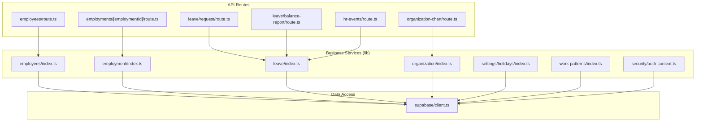
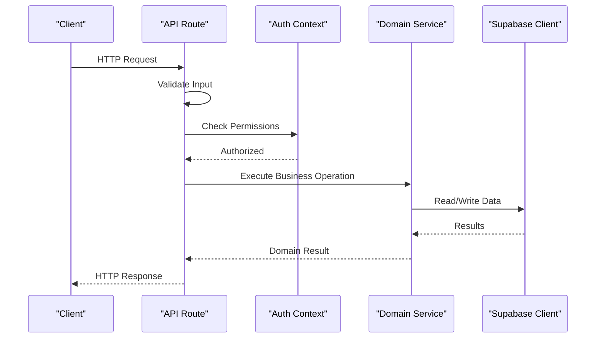
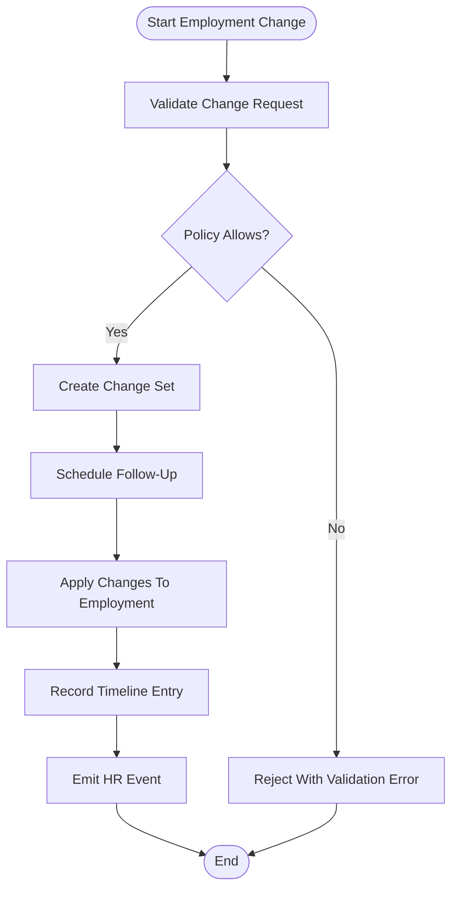
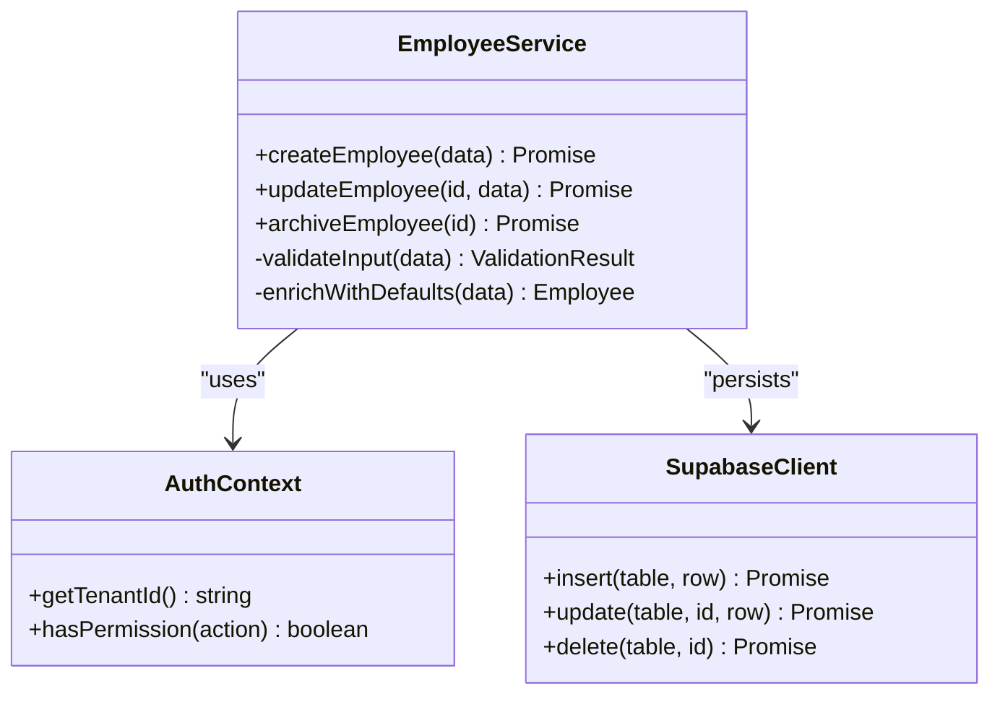
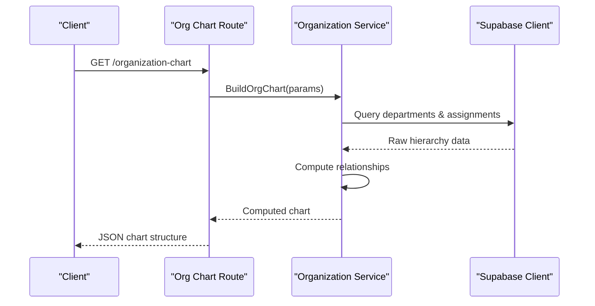
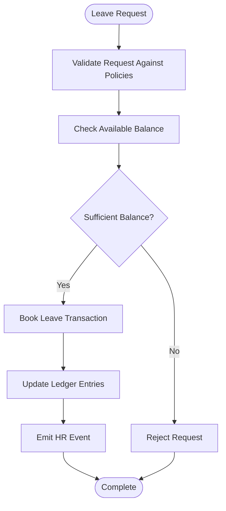
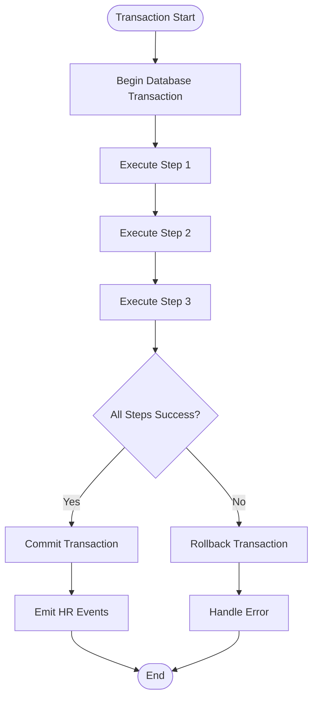
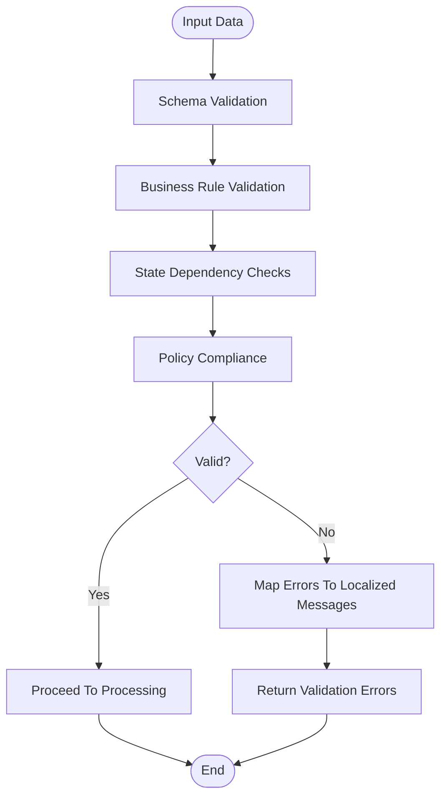
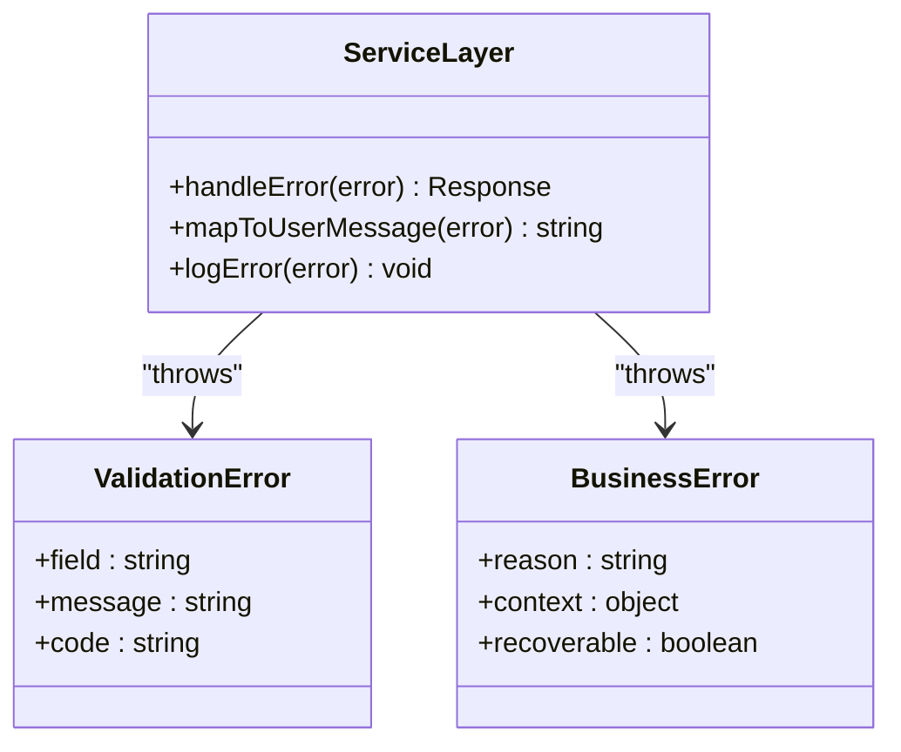
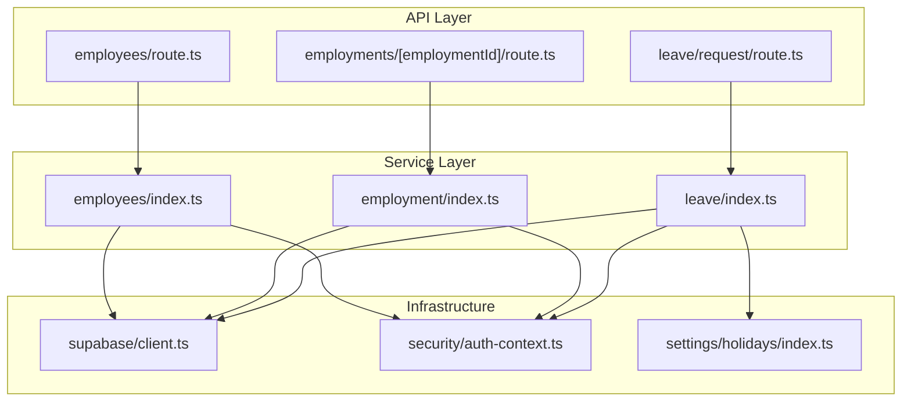

# Business Logic Layer

<cite>
**Referenced Files in This Document**
- [apps/hr-suite/app/api/employees/route.ts](file://apps/hr-suite/app/api/employees/route.ts)
- [apps/hr-suite/app/api/employments/[employmentId]/route.ts](file://apps/hr-suite/app/api/employments/[employmentId]/route.ts)
- [apps/hr-suite/app/api/leave/request/route.ts](file://apps/hr-suite/app/api/leave/request/route.ts)
- [apps/hr-suite/app/api/leave/balance-report/route.ts](file://apps/hr-suite/app/api/leave/balance-report/route.ts)
- [apps/hr-suite/app/api/organization-chart/route.ts](file://apps/hr-suite/app/api/organization-chart/route.ts)
- [apps/hr-suite/app/api/hr-events/route.ts](file://apps/hr-suite/app/api/hr-events/route.ts)
- [apps/hr-suite/lib/employees/index.ts](file://apps/hr-suite/lib/employees/index.ts)
- [apps/hr-suite/lib/employment/index.ts](file://apps/hr-suite/lib/employment/index.ts)
- [apps/hr-suite/lib/leave/index.ts](file://apps/hr-suite/lib/leave/index.ts)
- [apps/hr-suite/lib/organization/index.ts](file://apps/hr-suite/lib/organization/index.ts)
- [apps/hr-suite/lib/supabase/client.ts](file://apps/hr-suite/lib/supabase/client.ts)
- [apps/hr-suite/lib/security/auth-context.ts](file://apps/hr-suite/lib/security/auth-context.ts)
- [apps/hr-suite/lib/settings/holidays/index.ts](file://apps/hr-suite/lib/settings/holidays/index.ts)
- [apps/hr-suite/lib/work-patterns/index.ts](file://apps/hr-suite/lib/work-patterns/index.ts)
- [apps/hr-suite/messages/en/errors.json](file://apps/hr-suite/messages/en/errors.json)
- [apps/hr-suite/messages/en/validation.json](file://apps/hr-suite/messages/en/validation.json)
</cite>

## Table of Contents
1. [Introduction](#introduction)
2. [Project Structure](#project-structure)
3. [Core Components](#core-components)
4. [Architecture Overview](#architecture-overview)
5. [Detailed Component Analysis](#detailed-component-analysis)
6. [Dependency Analysis](#dependency-analysis)
7. [Performance Considerations](#performance-considerations)
8. [Troubleshooting Guide](#troubleshooting-guide)
9. [Conclusion](#conclusion)

## Introduction
This document explains the business logic layer architecture of LiquidHR with a focus on the service-oriented design implemented under the lib directory. It details how domain-specific modules encapsulate business rules, how data access is separated from business logic, and how complex workflows such as employment lifecycle management, employee data processing, organizational hierarchy calculations, and leave engine operations are orchestrated. It also covers transaction management, validation pipelines, error propagation patterns, performance optimization techniques, caching strategies, and asynchronous operation handling.

## Project Structure
The business logic layer is organized by domain within the lib directory:
- employees: Employee master data services and validations
- employment: Employment lifecycle, changes, terminations, and timelines
- leave: Leave engine configuration, request booking, ledger operations, and balance reporting
- organization: Organizational units, assignments, placements, and chart computation
- settings: Holidays, work patterns, and module toggles that influence business rules
- security: Authentication context and authorization helpers used across services
- supabase: Data access client and typed queries for database interactions

API routes in apps/hr-suite/app/api act as thin controllers that validate inputs, enforce authorization, orchestrate services, and return responses. Services in lib implement domain logic and delegate persistence to Supabase via typed clients.

**Diagram sources**
- [apps/hr-suite/app/api/employees/route.ts](file://apps/hr-suite/app/api/employees/route.ts)
- [apps/hr-suite/app/api/employments/[employmentId]/route.ts](file://apps/hr-suite/app/api/employments/[employmentId]/route.ts)
- [apps/hr-suite/app/api/leave/request/route.ts](file://apps/hr-suite/app/api/leave/request/route.ts)
- [apps/hr-suite/app/api/leave/balance-report/route.ts](file://apps/hr-suite/app/api/leave/balance-report/route.ts)
- [apps/hr-suite/app/api/organization-chart/route.ts](file://apps/hr-suite/app/api/organization-chart/route.ts)
- [apps/hr-suite/app/api/hr-events/route.ts](file://apps/hr-suite/app/api/hr-events/route.ts)
- [apps/hr-suite/lib/employees/index.ts](file://apps/hr-suite/lib/employees/index.ts)
- [apps/hr-suite/lib/employment/index.ts](file://apps/hr-suite/lib/employment/index.ts)
- [apps/hr-suite/lib/leave/index.ts](file://apps/hr-suite/lib/leave/index.ts)
- [apps/hr-suite/lib/organization/index.ts](file://apps/hr-suite/lib/organization/index.ts)
- [apps/hr-suite/lib/settings/holidays/index.ts](file://apps/hr-suite/lib/settings/holidays/index.ts)
- [apps/hr-suite/lib/work-patterns/index.ts](file://apps/hr-suite/lib/work-patterns/index.ts)
- [apps/hr-suite/lib/security/auth-context.ts](file://apps/hr-suite/lib/security/auth-context.ts)
- [apps/hr-suite/lib/supabase/client.ts](file://apps/hr-suite/lib/supabase/client.ts)

**Section sources**
- [apps/hr-suite/app/api/employees/route.ts](file://apps/hr-suite/app/api/employees/route.ts)
- [apps/hr-suite/app/api/employments/[employmentId]/route.ts](file://apps/hr-suite/app/api/employments/[employmentId]/route.ts)
- [apps/hr-suite/app/api/leave/request/route.ts](file://apps/hr-suite/app/api/leave/request/route.ts)
- [apps/hr-suite/app/api/leave/balance-report/route.ts](file://apps/hr-suite/app/api/leave/balance-report/route.ts)
- [apps/hr-suite/app/api/organization-chart/route.ts](file://apps/hr-suite/app/api/organization-chart/route.ts)
- [apps/hr-suite/app/api/hr-events/route.ts](file://apps/hr-suite/app/api/hr-events/route.ts)
- [apps/hr-suite/lib/employees/index.ts](file://apps/hr-suite/lib/employees/index.ts)
- [apps/hr-suite/lib/employment/index.ts](file://apps/hr-suite/lib/employment/index.ts)
- [apps/hr-suite/lib/leave/index.ts](file://apps/hr-suite/lib/leave/index.ts)
- [apps/hr-suite/lib/organization/index.ts](file://apps/hr-suite/lib/organization/index.ts)
- [apps/hr-suite/lib/settings/holidays/index.ts](file://apps/hr-suite/lib/settings/holidays/index.ts)
- [apps/hr-suite/lib/work-patterns/index.ts](file://apps/hr-suite/lib/work-patterns/index.ts)
- [apps/hr-suite/lib/security/auth-context.ts](file://apps/hr-suite/lib/security/auth-context.ts)
- [apps/hr-suite/lib/supabase/client.ts](file://apps/hr-suite/lib/supabase/client.ts)

## Core Components
- Service modules in lib encapsulate domain logic:
  - employees: CRUD and validation for employee master data
  - employment: Lifecycle transitions, change sets, timeline events, termination flows
  - leave: Accrual rules, request validation, booking, ledger updates, balance reports
  - organization: Department and placement management, org chart computation
  - settings: Holidays and work patterns that affect scheduling and accrual
  - security: Auth context and permission checks used by services
  - supabase: Typed client for DB operations

- API routes serve as entry points:
  - Validate payloads using shared validators
  - Enforce authorization via auth context
  - Orchestrate one or more services
  - Manage transactions where needed
  - Emit HR events for downstream consumers

**Section sources**
- [apps/hr-suite/lib/employees/index.ts](file://apps/hr-suite/lib/employees/index.ts)
- [apps/hr-suite/lib/employment/index.ts](file://apps/hr-suite/lib/employment/index.ts)
- [apps/hr-suite/lib/leave/index.ts](file://apps/hr-suite/lib/leave/index.ts)
- [apps/hr-suite/lib/organization/index.ts](file://apps/hr-suite/lib/organization/index.ts)
- [apps/hr-suite/lib/settings/holidays/index.ts](file://apps/hr-suite/lib/settings/holidays/index.ts)
- [apps/hr-suite/lib/work-patterns/index.ts](file://apps/hr-suite/lib/work-patterns/index.ts)
- [apps/hr-suite/lib/security/auth-context.ts](file://apps/hr-suite/lib/security/auth-context.ts)
- [apps/hr-suite/lib/supabase/client.ts](file://apps/hr-suite/lib/supabase/client.ts)

## Architecture Overview
LiquidHR follows a service-oriented architecture:
- API routes are thin controllers responsible for input validation, authorization, orchestration, and response formatting.
- Services implement business rules and coordinate multiple data operations.
- Data access is abstracted through a typed Supabase client, ensuring type safety and consistent query patterns.
- Cross-cutting concerns like authentication, authorization, holidays, and work patterns are centralized in dedicated modules.

**Diagram sources**
- [apps/hr-suite/app/api/employees/route.ts](file://apps/hr-suite/app/api/employees/route.ts)
- [apps/hr-suite/lib/security/auth-context.ts](file://apps/hr-suite/lib/security/auth-context.ts)
- [apps/hr-suite/lib/employees/index.ts](file://apps/hr-suite/lib/employees/index.ts)
- [apps/hr-suite/lib/supabase/client.ts](file://apps/hr-suite/lib/supabase/client.ts)

## Detailed Component Analysis

### Employment Lifecycle Management
Employment services manage creation, changes, terminations, and timeline events. The flow typically includes:
- Validating employment change requests against current state and policy rules
- Creating change sets and scheduling follow-ups
- Transitioning employment states and recording timeline entries
- Emitting HR events for audit and notifications

**Diagram sources**
- [apps/hr-suite/lib/employment/index.ts](file://apps/hr-suite/lib/employment/index.ts)
- [apps/hr-suite/app/api/employments/[employmentId]/route.ts](file://apps/hr-suite/app/api/employments/[employmentId]/route.ts)
- [apps/hr-suite/app/api/hr-events/route.ts](file://apps/hr-suite/app/api/hr-events/route.ts)

**Section sources**
- [apps/hr-suite/lib/employment/index.ts](file://apps/hr-suite/lib/employment/index.ts)
- [apps/hr-suite/app/api/employments/[employmentId]/route.ts](file://apps/hr-suite/app/api/employments/[employmentId]/route.ts)
- [apps/hr-suite/app/api/hr-events/route.ts](file://apps/hr-suite/app/api/hr-events/route.ts)

### Employee Data Processing
Employee services handle master data operations with robust validation and authorization:
- Input validation against schema constraints
- Authorization checks based on tenant and role scopes
- Data normalization and enrichment
- Persistence via Supabase client with proper error mapping

**Diagram sources**
- [apps/hr-suite/lib/employees/index.ts](file://apps/hr-suite/lib/employees/index.ts)
- [apps/hr-suite/lib/security/auth-context.ts](file://apps/hr-suite/lib/security/auth-context.ts)
- [apps/hr-suite/lib/supabase/client.ts](file://apps/hr-suite/lib/supabase/client.ts)

**Section sources**
- [apps/hr-suite/lib/employees/index.ts](file://apps/hr-suite/lib/employees/index.ts)
- [apps/hr-suite/lib/security/auth-context.ts](file://apps/hr-suite/lib/security/auth-context.ts)
- [apps/hr-suite/lib/supabase/client.ts](file://apps/hr-suite/lib/supabase/client.ts)

### Organizational Hierarchy Calculations
Organization services compute hierarchical structures and assignments:
- Resolve department trees and management chains
- Calculate reporting relationships and placement hierarchies
- Optimize queries for large organizations using indexed lookups
- Cache computed charts for frequently accessed views

**Diagram sources**
- [apps/hr-suite/app/api/organization-chart/route.ts](file://apps/hr-suite/app/api/organization-chart/route.ts)
- [apps/hr-suite/lib/organization/index.ts](file://apps/hr-suite/lib/organization/index.ts)
- [apps/hr-suite/lib/supabase/client.ts](file://apps/hr-suite/lib/supabase/client.ts)

**Section sources**
- [apps/hr-suite/app/api/organization-chart/route.ts](file://apps/hr-suite/app/api/organization-chart/route.ts)
- [apps/hr-suite/lib/organization/index.ts](file://apps/hr-suite/lib/organization/index.ts)
- [apps/hr-suite/lib/supabase/client.ts](file://apps/hr-suite/lib/supabase/client.ts)

### Leave Engine Business Rules
Leave services implement comprehensive leave management:
- Accrual calculation based on work patterns and holidays
- Request validation against policies and balances
- Booking operations with ledger updates
- Balance reporting with aggregation and filtering

**Diagram sources**
- [apps/hr-suite/app/api/leave/request/route.ts](file://apps/hr-suite/app/api/leave/request/route.ts)
- [apps/hr-suite/lib/leave/index.ts](file://apps/hr-suite/lib/leave/index.ts)
- [apps/hr-suite/lib/settings/holidays/index.ts](file://apps/hr-suite/lib/settings/holidays/index.ts)
- [apps/hr-suite/lib/work-patterns/index.ts](file://apps/hr-suite/lib/work-patterns/index.ts)

**Section sources**
- [apps/hr-suite/app/api/leave/request/route.ts](file://apps/hr-suite/app/api/leave/request/route.ts)
- [apps/hr-suite/lib/leave/index.ts](file://apps/hr-suite/lib/leave/index.ts)
- [apps/hr-suite/lib/settings/holidays/index.ts](file://apps/hr-suite/lib/settings/holidays/index.ts)
- [apps/hr-suite/lib/work-patterns/index.ts](file://apps/hr-suite/lib/work-patterns/index.ts)

### Transaction Management
Transactions are managed at the service layer to ensure data consistency:
- Database-level transactions for atomic operations
- Compensation logic for partial failures
- Rollback strategies for complex multi-step processes
- Event emission only after successful commits

**Diagram sources**
- [apps/hr-suite/lib/employment/index.ts](file://apps/hr-suite/lib/employment/index.ts)
- [apps/hr-suite/lib/leave/index.ts](file://apps/hr-suite/lib/leave/index.ts)
- [apps/hr-suite/lib/supabase/client.ts](file://apps/hr-suite/lib/supabase/client.ts)

**Section sources**
- [apps/hr-suite/lib/employment/index.ts](file://apps/hr-suite/lib/employment/index.ts)
- [apps/hr-suite/lib/leave/index.ts](file://apps/hr-suite/lib/leave/index.ts)
- [apps/hr-suite/lib/supabase/client.ts](file://apps/hr-suite/lib/supabase/client.ts)

### Validation Pipelines
Validation pipelines ensure data integrity and policy compliance:
- Schema validation for input payloads
- Business rule validation against current state
- Cross-field validation and dependency checks
- User-friendly error messages with localized strings

**Diagram sources**
- [apps/hr-suite/lib/employees/index.ts](file://apps/hr-suite/lib/employees/index.ts)
- [apps/hr-suite/lib/employment/index.ts](file://apps/hr-suite/lib/employment/index.ts)
- [apps/hr-suite/lib/leave/index.ts](file://apps/hr-suite/lib/leave/index.ts)
- [apps/hr-suite/messages/en/validation.json](file://apps/hr-suite/messages/en/validation.json)

**Section sources**
- [apps/hr-suite/lib/employees/index.ts](file://apps/hr-suite/lib/employees/index.ts)
- [apps/hr-suite/lib/employment/index.ts](file://apps/hr-suite/lib/employment/index.ts)
- [apps/hr-suite/lib/leave/index.ts](file://apps/hr-suite/lib/leave/index.ts)
- [apps/hr-suite/messages/en/validation.json](file://apps/hr-suite/messages/en/validation.json)

### Error Propagation Patterns
Error handling follows consistent patterns across services:
- Domain-specific error types with structured messages
- Translation of technical errors to user-friendly messages
- Proper HTTP status code mapping
- Audit logging for critical failures

**Diagram sources**
- [apps/hr-suite/messages/en/errors.json](file://apps/hr-suite/messages/en/errors.json)
- [apps/hr-suite/lib/employees/index.ts](file://apps/hr-suite/lib/employees/index.ts)
- [apps/hr-suite/lib/employment/index.ts](file://apps/hr-suite/lib/employment/index.ts)
- [apps/hr-suite/lib/leave/index.ts](file://apps/hr-suite/lib/leave/index.ts)

**Section sources**
- [apps/hr-suite/messages/en/errors.json](file://apps/hr-suite/messages/en/errors.json)
- [apps/hr-suite/lib/employees/index.ts](file://apps/hr-suite/lib/employees/index.ts)
- [apps/hr-suite/lib/employment/index.ts](file://apps/hr-suite/lib/employment/index.ts)
- [apps/hr-suite/lib/leave/index.ts](file://apps/hr-suite/lib/leave/index.ts)

## Dependency Analysis
The business logic layer exhibits clear separation of concerns:
- API routes depend on services for business logic
- Services depend on data access clients and utility modules
- Cross-cutting concerns are isolated in dedicated modules
- Minimal coupling between domain modules through well-defined interfaces

**Diagram sources**
- [apps/hr-suite/app/api/employees/route.ts](file://apps/hr-suite/app/api/employees/route.ts)
- [apps/hr-suite/app/api/employments/[employmentId]/route.ts](file://apps/hr-suite/app/api/employments/[employmentId]/route.ts)
- [apps/hr-suite/app/api/leave/request/route.ts](file://apps/hr-suite/app/api/leave/request/route.ts)
- [apps/hr-suite/lib/employees/index.ts](file://apps/hr-suite/lib/employees/index.ts)
- [apps/hr-suite/lib/employment/index.ts](file://apps/hr-suite/lib/employment/index.ts)
- [apps/hr-suite/lib/leave/index.ts](file://apps/hr-suite/lib/leave/index.ts)
- [apps/hr-suite/lib/supabase/client.ts](file://apps/hr-suite/lib/supabase/client.ts)
- [apps/hr-suite/lib/security/auth-context.ts](file://apps/hr-suite/lib/security/auth-context.ts)
- [apps/hr-suite/lib/settings/holidays/index.ts](file://apps/hr-suite/lib/settings/holidays/index.ts)

**Section sources**
- [apps/hr-suite/app/api/employees/route.ts](file://apps/hr-suite/app/api/employees/route.ts)
- [apps/hr-suite/app/api/employments/[employmentId]/route.ts](file://apps/hr-suite/app/api/employments/[employmentId]/route.ts)
- [apps/hr-suite/app/api/leave/request/route.ts](file://apps/hr-suite/app/api/leave/request/route.ts)
- [apps/hr-suite/lib/employees/index.ts](file://apps/hr-suite/lib/employees/index.ts)
- [apps/hr-suite/lib/employment/index.ts](file://apps/hr-suite/lib/employment/index.ts)
- [apps/hr-suite/lib/leave/index.ts](file://apps/hr-suite/lib/leave/index.ts)
- [apps/hr-suite/lib/supabase/client.ts](file://apps/hr-suite/lib/supabase/client.ts)
- [apps/hr-suite/lib/security/auth-context.ts](file://apps/hr-suite/lib/security/auth-context.ts)
- [apps/hr-suite/lib/settings/holidays/index.ts](file://apps/hr-suite/lib/settings/holidays/index.ts)

## Performance Considerations
- Query optimization: Use indexed columns and efficient joins for large datasets
- Caching strategies: Implement in-memory caching for frequently accessed data like holidays and work patterns
- Async operations: Leverage parallel execution for independent operations
- Connection pooling: Configure optimal connection pool sizes for database operations
- Pagination: Implement cursor-based pagination for large result sets
- Lazy loading: Load related data on demand to reduce initial payload size

## Troubleshooting Guide
Common issues and their resolution patterns:
- Validation errors: Check input schemas and business rule configurations
- Authorization failures: Verify user permissions and tenant scoping
- Database errors: Inspect connection pools and query performance
- Transaction failures: Review rollback scenarios and compensation logic
- Performance issues: Monitor query execution times and cache hit rates

**Section sources**
- [apps/hr-suite/messages/en/errors.json](file://apps/hr-suite/messages/en/errors.json)
- [apps/hr-suite/messages/en/validation.json](file://apps/hr-suite/messages/en/validation.json)

## Conclusion
LiquidHR's business logic layer implements a robust service-oriented architecture with clear separation of concerns. The lib directory organizes domain-specific modules that encapsulate business rules while maintaining clean boundaries with data access layers. Employment lifecycle management, employee data processing, organizational hierarchy calculations, and leave engine operations are implemented with comprehensive validation, transaction management, and error handling. Performance optimizations including caching, async operations, and query optimization ensure scalability and responsiveness.