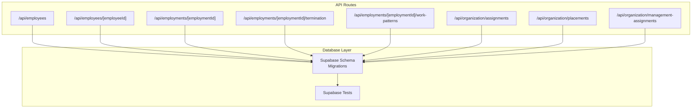
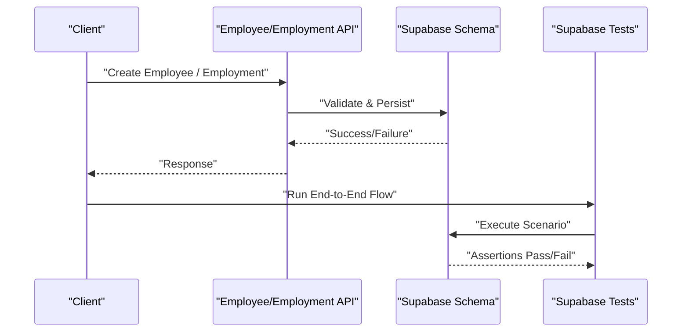
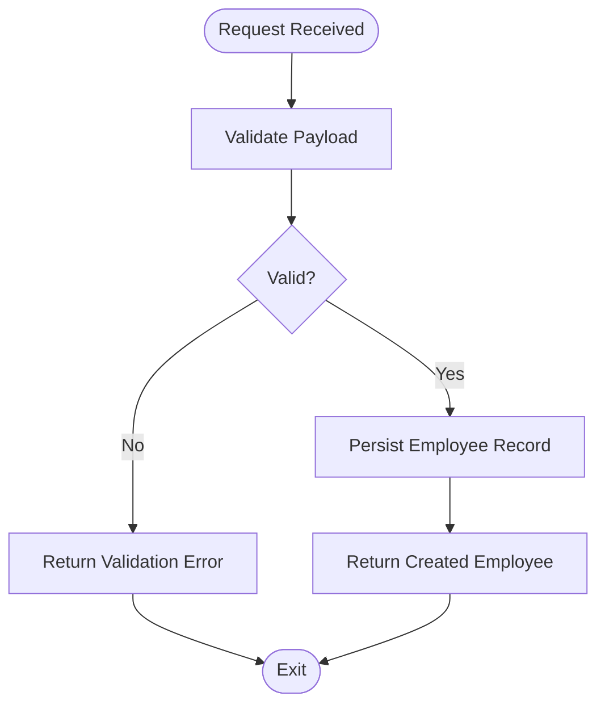
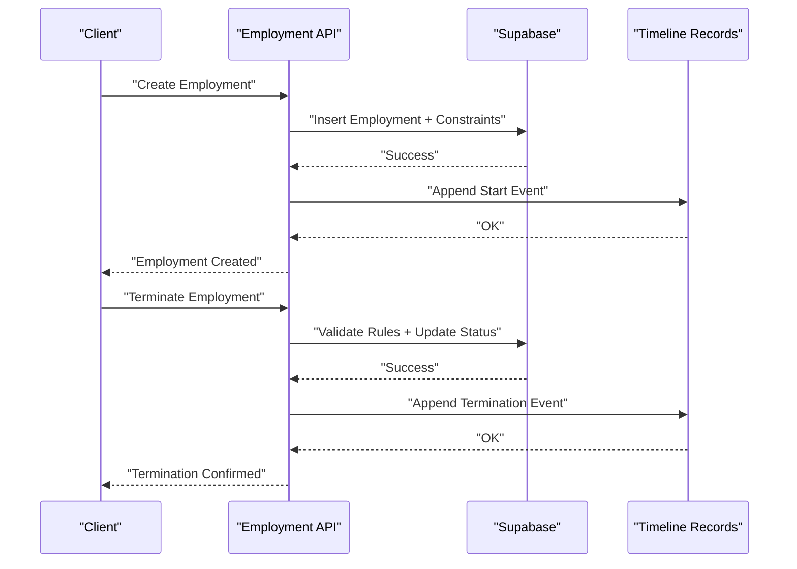
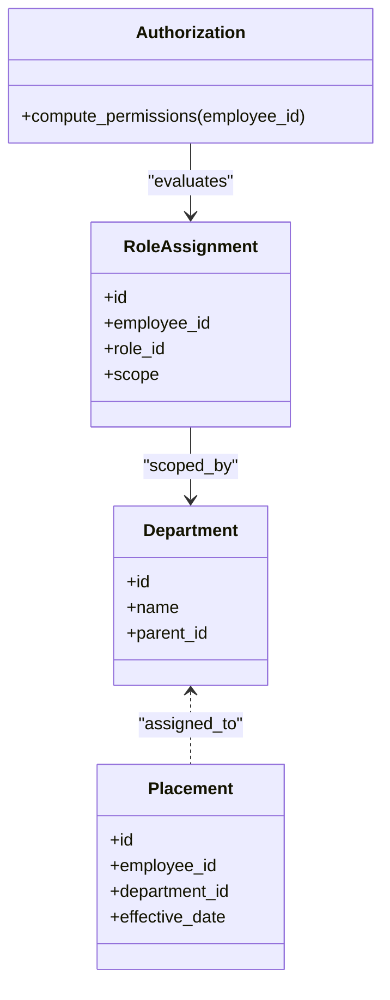
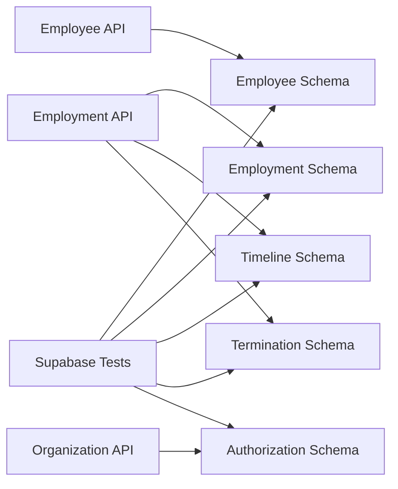

# Core HR Business Logic

<cite>
**Referenced Files in This Document**
- [apps/hr-suite/app/api/employees/route.ts](file://apps/hr-suite/app/api/employees/route.ts)
- [apps/hr-suite/app/api/employees/[employeeId]/route.ts](file://apps/hr-suite/app/api/employees/[employeeId]/route.ts)
- [apps/hr-suite/app/api/employments/[employmentId]/route.ts](file://apps/hr-suite/app/api/employments/[employmentId]/route.ts)
- [apps/hr-suite/app/api/employments/[employmentId]/termination/route.ts](file://apps/hr-suite/app/api/employments/[employmentId]/termination/route.ts)
- [apps/hr-suite/app/api/employments/[employmentId]/work-patterns/route.ts](file://apps/hr-suite/app/api/employments/[employmentId]/work-patterns/route.ts)
- [apps/hr-suite/app/api/organization/assignments/route.ts](file://apps/hr-suite/app/api/organization/assignments/route.ts)
- [apps/hr-suite/app/api/organization/placements/route.ts](file://apps/hr-suite/app/api/organization/placements/route.ts)
- [apps/hr-suite/app/api/organization/management-assignments/route.ts](file://apps/hr-suite/app/api/organization/management-assignments/route.ts)
- [apps/hr-suite/supabase/migrations/20260715071156_add_employment_core.sql](file://apps/hr-suite/supabase/migrations/20260715071156_add_employment_core.sql)
- [apps/hr-suite/supabase/migrations/20260715071422_add_employment_timelines.sql](file://apps/hr-suite/supabase/migrations/20260715071422_add_employment_timelines.sql)
- [apps/hr-suite/supabase/migrations/20260715071717_add_employment_terminations.sql](file://apps/hr-suite/supabase/migrations/20260715071717_add_employment_terminations.sql)
- [apps/hr-suite/supabase/migrations/20260718100000_complete_employment_flow.sql](file://apps/hr-suite/supabase/migrations/20260718100000_complete_employment_flow.sql)
- [apps/hr-suite/supabase/migrations/20260715141843_add_employment_change_management.sql](file://apps/hr-suite/supabase/migrations/20260715141843_add_employment_change_management.sql)
- [apps/hr-suite/supabase/migrations/20260715123639_add_organization_authorization_management.sql](file://apps/hr-suite/supabase/migrations/20260715123639_add_organization_authorization_management.sql)
- [apps/hr-suite/supabase/tests/employment_complete_flow.sql](file://apps/hr-suite/supabase/tests/employment_complete_flow.sql)
- [apps/hr-suite/supabase/tests/employment_terminations.sql](file://apps/hr-suite/supabase/tests/employment_terminations.sql)
- [apps/hr-suite/supabase/tests/employment_change_management.sql](file://apps/hr-suite/supabase/tests/employment_change_management.sql)
</cite>

## Table of Contents
1. [Introduction](#introduction)
2. [Project Structure](#project-structure)
3. [Core Components](#core-components)
4. [Architecture Overview](#architecture-overview)
5. [Detailed Component Analysis](#detailed-component-analysis)
6. [Dependency Analysis](#dependency-analysis)
7. [Performance Considerations](#performance-considerations)
8. [Troubleshooting Guide](#troubleshooting-guide)
9. [Conclusion](#conclusion)

## Introduction
This document explains LiquidHR’s core HR business logic layer with a focus on:
- Employee management services (CRUD, validation, lifecycle state)
- Employment lifecycle services (contract creation, timeline tracking, termination processing, work pattern calculations)
- Organizational hierarchy services (department management, role assignments, authorization calculations)
- Transaction management patterns, error handling strategies, and data consistency mechanisms
- Complex workflows such as employee onboarding, employment changes, and organizational restructuring
- Performance considerations, caching strategies, and async operation handling

The content is derived from the Next.js API routes under apps/hr-suite/app/api and the Supabase schema and tests that define the authoritative business rules for employees, employments, timelines, terminations, and organization authorization.

## Project Structure
The HR business logic is exposed through Next.js App Router API routes and enforced by database migrations and tests. Key areas:
- Employee endpoints: list, create, update, archive, and subresources (addresses, bank accounts, documents, BSN, custom fields, relations, salary, activity)
- Employment endpoints: CRUD, changes, follow-ups, profile links, termination, timeline, and work patterns
- Organization endpoints: assignments, placements, and management assignments
- Database schema and constraints: employment core, timelines, terminations, change management, and organization authorization
- Tests: end-to-end scenarios for complete employment flow, terminations, and change management

**Diagram sources**
- [apps/hr-suite/app/api/employees/route.ts](file://apps/hr-suite/app/api/employees/route.ts)
- [apps/hr-suite/app/api/employees/[employeeId]/route.ts](file://apps/hr-suite/app/api/employees/[employeeId]/route.ts)
- [apps/hr-suite/app/api/employments/[employmentId]/route.ts](file://apps/hr-suite/app/api/employments/[employmentId]/route.ts)
- [apps/hr-suite/app/api/employments/[employmentId]/termination/route.ts](file://apps/hr-suite/app/api/employments/[employmentId]/termination/route.ts)
- [apps/hr-suite/app/api/employments/[employmentId]/work-patterns/route.ts](file://apps/hr-suite/app/api/employments/[employmentId]/work-patterns/route.ts)
- [apps/hr-suite/app/api/organization/assignments/route.ts](file://apps/hr-suite/app/api/organization/assignments/route.ts)
- [apps/hr-suite/app/api/organization/placements/route.ts](file://apps/hr-suite/app/api/organization/placements/route.ts)
- [apps/hr-suite/app/api/organization/management-assignments/route.ts](file://apps/hr-suite/app/api/organization/management-assignments/route.ts)
- [apps/hr-suite/supabase/migrations/20260715071156_add_employment_core.sql](file://apps/hr-suite/supabase/migrations/20260715071156_add_employment_core.sql)
- [apps/hr-suite/supabase/migrations/20260715071422_add_employment_timelines.sql](file://apps/hr-suite/supabase/migrations/20260715071422_add_employment_timelines.sql)
- [apps/hr-suite/supabase/migrations/20260715071717_add_employment_terminations.sql](file://apps/hr-suite/supabase/migrations/20260715071717_add_employment_terminations.sql)
- [apps/hr-suite/supabase/migrations/20260718100000_complete_employment_flow.sql](file://apps/hr-suite/supabase/migrations/20260718100000_complete_employment_flow.sql)
- [apps/hr-suite/supabase/migrations/20260715141843_add_employment_change_management.sql](file://apps/hr-suite/supabase/migrations/20260715141843_add_employment_change_management.sql)
- [apps/hr-suite/supabase/migrations/20260715123639_add_organization_authorization_management.sql](file://apps/hr-suite/supabase/migrations/20260715123639_add_organization_authorization_management.sql)

**Section sources**
- [apps/hr-suite/app/api/employees/route.ts](file://apps/hr-suite/app/api/employees/route.ts)
- [apps/hr-suite/app/api/employees/[employeeId]/route.ts](file://apps/hr-suite/app/api/employees/[employeeId]/route.ts)
- [apps/hr-suite/app/api/employments/[employmentId]/route.ts](file://apps/hr-suite/app/api/employments/[employmentId]/route.ts)
- [apps/hr-suite/app/api/employments/[employmentId]/termination/route.ts](file://apps/hr-suite/app/api/employments/[employmentId]/termination/route.ts)
- [apps/hr-suite/app/api/employments/[employmentId]/work-patterns/route.ts](file://apps/hr-suite/app/api/employments/[employmentId]/work-patterns/route.ts)
- [apps/hr-suite/app/api/organization/assignments/route.ts](file://apps/hr-suite/app/api/organization/assignments/route.ts)
- [apps/hr-suite/app/api/organization/placements/route.ts](file://apps/hr-suite/app/api/organization/placements/route.ts)
- [apps/hr-suite/app/api/organization/management-assignments/route.ts](file://apps/hr-suite/app/api/organization/management-assignments/route.ts)
- [apps/hr-suite/supabase/migrations/20260715071156_add_employment_core.sql](file://apps/hr-suite/supabase/migrations/20260715071156_add_employment_core.sql)
- [apps/hr-suite/supabase/migrations/20260715071422_add_employment_timelines.sql](file://apps/hr-suite/supabase/migrations/20260715071422_add_employment_timelines.sql)
- [apps/hr-suite/supabase/migrations/20260715071717_add_employment_terminations.sql](file://apps/hr-suite/supabase/migrations/20260715071717_add_employment_terminations.sql)
- [apps/hr-suite/supabase/migrations/20260718100000_complete_employment_flow.sql](file://apps/hr-suite/supabase/migrations/20260718100000_complete_employment_flow.sql)
- [apps/hr-suite/supabase/migrations/20260715141843_add_employment_change_management.sql](file://apps/hr-suite/supabase/migrations/20260715141843_add_employment_change_management.sql)
- [apps/hr-suite/supabase/migrations/20260715123639_add_organization_authorization_management.sql](file://apps/hr-suite/supabase/migrations/20260715123639_add_organization_authorization_management.sql)

## Core Components
- Employee Management Service
  - Responsibilities: Create, read, update, archive employees; manage subresources (addresses, bank accounts, documents, BSN, custom fields, relations, salary, activity).
  - Validation: Input validation at route handlers before persistence; refer to route files for parameter checks.
  - Lifecycle states: Active, archived, and status transitions managed via dedicated endpoints.
- Employment Lifecycle Service
  - Responsibilities: Contract creation, employment records, timeline entries, termination processing, and work pattern calculations.
  - Timeline tracking: Append immutable timeline events for contract start, changes, and termination.
  - Termination processing: Enforce business rules around effective dates, reasons, and finalization steps.
  - Work patterns: Compute working days/hours based on configured patterns and holidays.
- Organizational Hierarchy Service
  - Responsibilities: Department management, role assignments, placement of employees into departments/roles, and management assignments.
  - Authorization calculations: Derive effective permissions based on roles, scopes, and organizational context.

**Section sources**
- [apps/hr-suite/app/api/employees/route.ts](file://apps/hr-suite/app/api/employees/route.ts)
- [apps/hr-suite/app/api/employees/[employeeId]/route.ts](file://apps/hr-suite/app/api/employees/[employeeId]/route.ts)
- [apps/hr-suite/app/api/employments/[employmentId]/route.ts](file://apps/hr-suite/app/api/employments/[employmentId]/route.ts)
- [apps/hr-suite/app/api/employments/[employmentId]/termination/route.ts](file://apps/hr-suite/app/api/employments/[employmentId]/termination/route.ts)
- [apps/hr-suite/app/api/employments/[employmentId]/work-patterns/route.ts](file://apps/hr-suite/app/api/employments/[employmentId]/work-patterns/route.ts)
- [apps/hr-suite/app/api/organization/assignments/route.ts](file://apps/hr-suite/app/api/organization/assignments/route.ts)
- [apps/hr-suite/app/api/organization/placements/route.ts](file://apps/hr-suite/app/api/organization/placements/route.ts)
- [apps/hr-suite/app/api/organization/management-assignments/route.ts](file://apps/hr-suite/app/api/organization/management-assignments/route.ts)

## Architecture Overview
The HR business logic follows a layered architecture:
- API layer (Next.js App Router): Validates inputs, orchestrates operations, and returns responses.
- Domain layer (business rules): Implemented within route handlers and enforced by database constraints and functions.
- Data layer (Supabase): Defines schemas, constraints, indexes, and policies ensuring integrity and security.
- Test layer (Supabase tests): Encapsulates complex workflows and validates business rules.

**Diagram sources**
- [apps/hr-suite/app/api/employees/route.ts](file://apps/hr-suite/app/api/employees/route.ts)
- [apps/hr-suite/app/api/employments/[employmentId]/route.ts](file://apps/hr-suite/app/api/employments/[employmentId]/route.ts)
- [apps/hr-suite/supabase/migrations/20260715071156_add_employment_core.sql](file://apps/hr-suite/supabase/migrations/20260715071156_add_employment_core.sql)
- [apps/hr-suite/supabase/tests/employment_complete_flow.sql](file://apps/hr-suite/supabase/tests/employment_complete_flow.sql)

## Detailed Component Analysis

### Employee Management Service
- CRUD Operations
  - Create: Validate payload, persist employee record, initialize default subresources.
  - Read: Retrieve employee details and related subresources with tenant scoping.
  - Update: Apply partial updates with validation and audit logging.
  - Archive: Transition employee to archived state while preserving history.
- Data Validation
  - Route-level validation ensures required fields, formats, and constraints before DB writes.
- Lifecycle State Management
  - Active vs Archived states are enforced via endpoint logic and DB constraints.

**Diagram sources**
- [apps/hr-suite/app/api/employees/route.ts](file://apps/hr-suite/app/api/employees/route.ts)
- [apps/hr-suite/app/api/employees/[employeeId]/route.ts](file://apps/hr-suite/app/api/employees/[employeeId]/route.ts)

**Section sources**
- [apps/hr-suite/app/api/employees/route.ts](file://apps/hr-suite/app/api/employees/route.ts)
- [apps/hr-suite/app/api/employees/[employeeId]/route.ts](file://apps/hr-suite/app/api/employees/[employeeId]/route.ts)

### Employment Lifecycle Service
- Contract Creation
  - Create employment record linked to an employee, job, department, and effective dates.
  - Initialize timeline entry for contract start.
- Timeline Tracking
  - Immutable timeline entries capture key events: start, changes, termination.
- Termination Processing
  - Enforce termination rules: effective date, reason codes, finalization steps.
  - Update employment status and append termination timeline event.
- Work Pattern Calculations
  - Compute working days/hours based on configured patterns and holiday calendars.

**Diagram sources**
- [apps/hr-suite/app/api/employments/[employmentId]/route.ts](file://apps/hr-suite/app/api/employments/[employmentId]/route.ts)
- [apps/hr-suite/app/api/employments/[employmentId]/termination/route.ts](file://apps/hr-suite/app/api/employments/[employmentId]/termination/route.ts)
- [apps/hr-suite/supabase/migrations/20260715071156_add_employment_core.sql](file://apps/hr-suite/supabase/migrations/20260715071156_add_employment_core.sql)
- [apps/hr-suite/supabase/migrations/20260715071422_add_employment_timelines.sql](file://apps/hr-suite/supabase/migrations/20260715071422_add_employment_timelines.sql)
- [apps/hr-suite/supabase/migrations/20260715071717_add_employment_terminations.sql](file://apps/hr-suite/supabase/migrations/20260715071717_add_employment_terminations.sql)

**Section sources**
- [apps/hr-suite/app/api/employments/[employmentId]/route.ts](file://apps/hr-suite/app/api/employments/[employmentId]/route.ts)
- [apps/hr-suite/app/api/employments/[employmentId]/termination/route.ts](file://apps/hr-suite/app/api/employments/[employmentId]/termination/route.ts)
- [apps/hr-suite/app/api/employments/[employmentId]/work-patterns/route.ts](file://apps/hr-suite/app/api/employments/[employmentId]/work-patterns/route.ts)
- [apps/hr-suite/supabase/migrations/20260715071156_add_employment_core.sql](file://apps/hr-suite/supabase/migrations/20260715071156_add_employment_core.sql)
- [apps/hr-suite/supabase/migrations/20260715071422_add_employment_timelines.sql](file://apps/hr-suite/supabase/migrations/20260715071422_add_employment_timelines.sql)
- [apps/hr-suite/supabase/migrations/20260715071717_add_employment_terminations.sql](file://apps/hr-suite/supabase/migrations/20260715071717_add_employment_terminations.sql)
- [apps/hr-suite/supabase/migrations/20260718100000_complete_employment_flow.sql](file://apps/hr-suite/supabase/migrations/20260718100000_complete_employment_flow.sql)

### Organizational Hierarchy Service
- Department Management
  - Create, update, and assign employees to departments.
- Role Assignments
  - Assign roles to employees with scope constraints.
- Authorization Calculations
  - Compute effective permissions based on roles, scopes, and organizational context.

**Diagram sources**
- [apps/hr-suite/app/api/organization/assignments/route.ts](file://apps/hr-suite/app/api/organization/assignments/route.ts)
- [apps/hr-suite/app/api/organization/placements/route.ts](file://apps/hr-suite/app/api/organization/placements/route.ts)
- [apps/hr-suite/app/api/organization/management-assignments/route.ts](file://apps/hr-suite/app/api/organization/management-assignments/route.ts)
- [apps/hr-suite/supabase/migrations/20260715123639_add_organization_authorization_management.sql](file://apps/hr-suite/supabase/migrations/20260715123639_add_organization_authorization_management.sql)

**Section sources**
- [apps/hr-suite/app/api/organization/assignments/route.ts](file://apps/hr-suite/app/api/organization/assignments/route.ts)
- [apps/hr-suite/app/api/organization/placements/route.ts](file://apps/hr-suite/app/api/organization/placements/route.ts)
- [apps/hr-suite/app/api/organization/management-assignments/route.ts](file://apps/hr-suite/app/api/organization/management-assignments/route.ts)
- [apps/hr-suite/supabase/migrations/20260715123639_add_organization_authorization_management.sql](file://apps/hr-suite/supabase/migrations/20260715123639_add_organization_authorization_management.sql)

## Dependency Analysis
- API routes depend on Supabase schema definitions and constraints.
- Employment flows rely on timeline and termination tables for state transitions.
- Organization authorization depends on role assignment and placement tables.
- Tests validate end-to-end behavior and ensure business rule compliance.

**Diagram sources**
- [apps/hr-suite/app/api/employees/route.ts](file://apps/hr-suite/app/api/employees/route.ts)
- [apps/hr-suite/app/api/employments/[employmentId]/route.ts](file://apps/hr-suite/app/api/employments/[employmentId]/route.ts)
- [apps/hr-suite/app/api/organization/assignments/route.ts](file://apps/hr-suite/app/api/organization/assignments/route.ts)
- [apps/hr-suite/supabase/migrations/20260715071156_add_employment_core.sql](file://apps/hr-suite/supabase/migrations/20260715071156_add_employment_core.sql)
- [apps/hr-suite/supabase/migrations/20260715071422_add_employment_timelines.sql](file://apps/hr-suite/supabase/migrations/20260715071422_add_employment_timelines.sql)
- [apps/hr-suite/supabase/migrations/20260715071717_add_employment_terminations.sql](file://apps/hr-suite/supabase/migrations/20260715071717_add_employment_terminations.sql)
- [apps/hr-suite/supabase/migrations/20260715123639_add_organization_authorization_management.sql](file://apps/hr-suite/supabase/migrations/20260715123639_add_organization_authorization_management.sql)
- [apps/hr-suite/supabase/tests/employment_complete_flow.sql](file://apps/hr-suite/supabase/tests/employment_complete_flow.sql)

**Section sources**
- [apps/hr-suite/app/api/employees/route.ts](file://apps/hr-suite/app/api/employees/route.ts)
- [apps/hr-suite/app/api/employments/[employmentId]/route.ts](file://apps/hr-suite/app/api/employments/[employmentId]/route.ts)
- [apps/hr-suite/app/api/organization/assignments/route.ts](file://apps/hr-suite/app/api/organization/assignments/route.ts)
- [apps/hr-suite/supabase/migrations/20260715071156_add_employment_core.sql](file://apps/hr-suite/supabase/migrations/20260715071156_add_employment_core.sql)
- [apps/hr-suite/supabase/migrations/20260715071422_add_employment_timelines.sql](file://apps/hr-suite/supabase/migrations/20260715071422_add_employment_timelines.sql)
- [apps/hr-suite/supabase/migrations/20260715071717_add_employment_terminations.sql](file://apps/hr-suite/supabase/migrations/20260715071717_add_employment_terminations.sql)
- [apps/hr-suite/supabase/migrations/20260715123639_add_organization_authorization_management.sql](file://apps/hr-suite/supabase/migrations/20260715123639_add_organization_authorization_management.sql)
- [apps/hr-suite/supabase/tests/employment_complete_flow.sql](file://apps/hr-suite/supabase/tests/employment_complete_flow.sql)

## Performance Considerations
- Indexing: Ensure foreign keys and frequently queried columns are indexed in schema migrations.
- Query Optimization: Use targeted queries in API routes to minimize payload size.
- Caching Strategies: Cache read-heavy data like department trees and role catalogs where appropriate.
- Async Operations: Offload long-running tasks (e.g., bulk imports, recalculations) to background jobs.
- Concurrency Control: Use optimistic locking or DB-level constraints to prevent race conditions during updates.

[No sources needed since this section provides general guidance]

## Troubleshooting Guide
- Common Issues
  - Validation failures: Check input payloads against route-level requirements.
  - Constraint violations: Review DB schema constraints and migration order.
  - Authorization errors: Verify role assignments and scopes for the current user context.
- Debugging Steps
  - Inspect API route logs for request/response details.
  - Run Supabase tests to reproduce issues in isolation.
  - Validate timeline entries for unexpected state transitions.

**Section sources**
- [apps/hr-suite/supabase/tests/employment_complete_flow.sql](file://apps/hr-suite/supabase/tests/employment_complete_flow.sql)
- [apps/hr-suite/supabase/tests/employment_terminations.sql](file://apps/hr-suite/supabase/tests/employment_terminations.sql)
- [apps/hr-suite/supabase/tests/employment_change_management.sql](file://apps/hr-suite/supabase/tests/employment_change_management.sql)

## Conclusion
LiquidHR’s core HR business logic is implemented through well-defined API routes and enforced by robust database schemas and tests. The design emphasizes data integrity, clear lifecycle management, and scalable authorization. By following the documented workflows and performance recommendations, teams can maintain consistent, reliable HR processes across employee onboarding, employment changes, and organizational restructuring.

[No sources needed since this section summarizes without analyzing specific files]