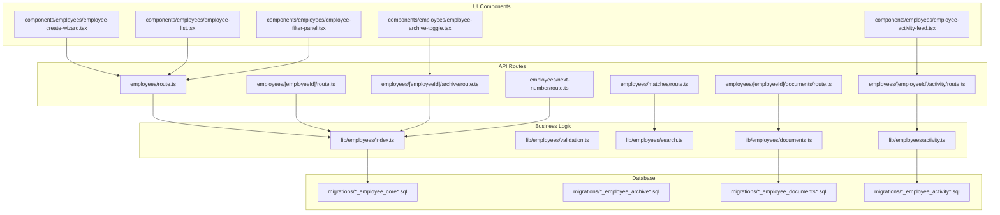
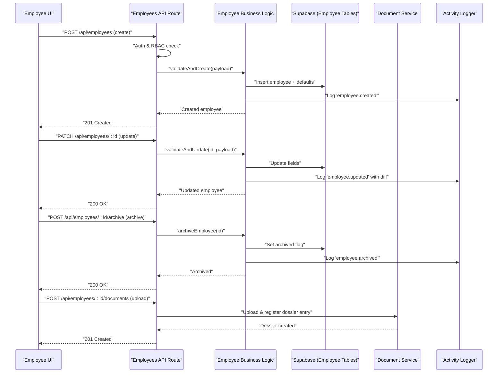
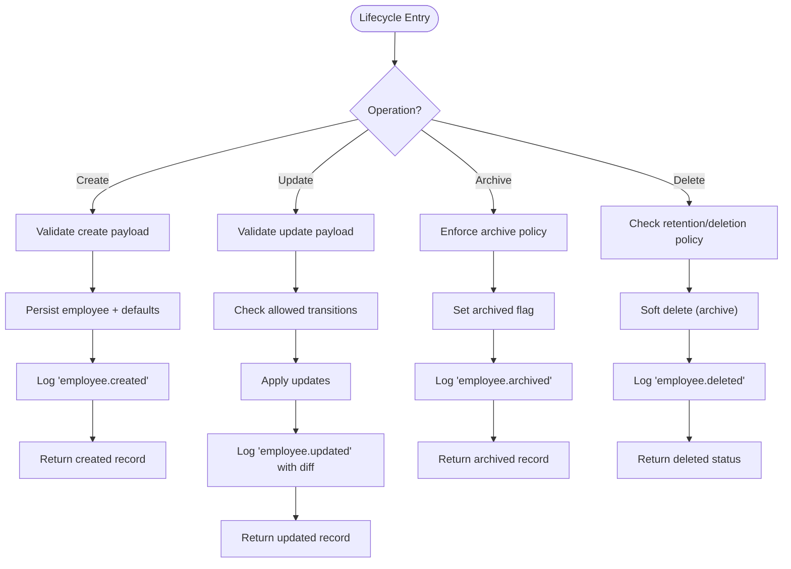
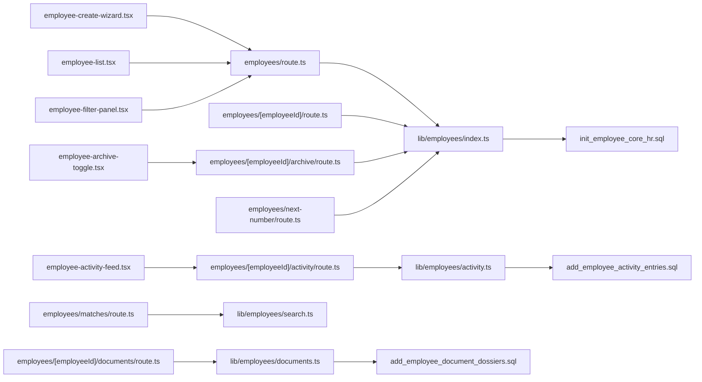

# Employee Management Services

<cite>
**Referenced Files in This Document**
- [apps/hr-suite/app/api/employees/route.ts](file://apps/hr-suite/app/api/employees/route.ts)
- [apps/hr-suite/app/api/employees/[employeeId]/route.ts](file://apps/hr-suite/app/api/employees/[employeeId]/route.ts)
- [apps/hr-suite/app/api/employees/[employeeId]/archive/route.ts](file://apps/hr-suite/app/api/employees/[employeeId]/archive/route.ts)
- [apps/hr-suite/app/api/employees/[employeeId]/documents/route.ts](file://apps/hr-suite/app/api/employees/[employeeId]/documents/route.ts)
- [apps/hr-suite/app/api/employees/[employeeId]/activity/route.ts](file://apps/hr-suite/app/api/employees/[employeeId]/activity/route.ts)
- [apps/hr-suite/app/api/employees/matches/route.ts](file://apps/hr-suite/app/api/employees/matches/route.ts)
- [apps/hr-suite/app/api/employees/next-number/route.ts](file://apps/hr-suite/app/api/employees/next-number/route.ts)
- [apps/hr-suite/lib/employees/index.ts](file://apps/hr-suite/lib/employees/index.ts)
- [apps/hr-suite/lib/employees/validation.ts](file://apps/hr-suite/lib/employees/validation.ts)
- [apps/hr-suite/lib/employees/search.ts](file://apps/hr-suite/lib/employees/search.ts)
- [apps/hr-suite/lib/employees/documents.ts](file://apps/hr-suite/lib/employees/documents.ts)
- [apps/hr-suite/lib/employees/activity.ts](file://apps/hr-suite/lib/employees/activity.ts)
- [apps/hr-suite/lib/security/authorization.ts](file://apps/hr-suite/lib/security/authorization.ts)
- [apps/hr-suite/supabase/migrations/20260712124858_init_employee_core_hr.sql](file://apps/hr-suite/supabase/migrations/20260712124858_init_employee_core_hr.sql)
- [apps/hr-suite/supabase/migrations/20260712124911_add_tenant_rbac_and_organization.sql](file://apps/hr-suite/supabase/migrations/20260712124911_add_tenant_rbac_and_organization.sql)
- [apps/hr-suite/supabase/migrations/20260715120810_complete_employee_core.sql](file://apps/hr-suite/supabase/migrations/20260715120810_complete_employee_core.sql)
- [apps/hr-suite/supabase/migrations/20260715121304_optimize_employee_core_indexes.sql](file://apps/hr-suite/supabase/migrations/20260715121304_optimize_employee_core_indexes.sql)
- [apps/hr-suite/supabase/migrations/20260715124506_isolate_employee_secure_identifiers.sql](file://apps/hr-suite/supabase/migrations/20260715124506_isolate_employee_secure_identifiers.sql)
- [apps/hr-suite/supabase/migrations/20260718150000_add_employee_archive_and_avatar_state.sql](file://apps/hr-suite/supabase/migrations/20260718150000_add_employee_archive_and_avatar_state.sql)
- [apps/hr-suite/supabase/migrations/20260724160000_add_employee_activity_entries.sql](file://apps/hr-suite/supabase/migrations/20260724160000_add_employee_activity_entries.sql)
- [apps/hr-suite/supabase/migrations/20260718110000_add_employee_document_dossiers.sql](file://apps/hr-suite/supabase/migrations/20260718110000_add_employee_document_dossiers.sql)
- [apps/hr-suite/components/employees/employee-create-wizard.tsx](file://apps/hr-suite/components/employees/employee-create-wizard.tsx)
- [apps/hr-suite/components/employees/employee-list.tsx](file://apps/hr-suite/components/employees/employee-list.tsx)
- [apps/hr-suite/components/employees/employee-filter-panel.tsx](file://apps/hr-suite/components/employees/employee-filter-panel.tsx)
- [apps/hr-suite/components/employees/employee-archive-toggle.tsx](file://apps/hr-suite/components/employees/employee-archive-toggle.tsx)
- [apps/hr-suite/components/employees/employee-activity-feed.tsx](file://apps/hr-suite/components/employees/employee-activity-feed.tsx)
</cite>

## Table of Contents
1. [Introduction](#introduction)
2. [Project Structure](#project-structure)
3. [Core Components](#core-components)
4. [Architecture Overview](#architecture-overview)
5. [Detailed Component Analysis](#detailed-component-analysis)
6. [Dependency Analysis](#dependency-analysis)
7. [Performance Considerations](#performance-considerations)
8. [Troubleshooting Guide](#troubleshooting-guide)
9. [Conclusion](#conclusion)
10. [Appendices](#appendices)

## Introduction
This document explains LiquidHR’s employee management business logic services. It covers the complete employee lifecycle (creation, updates, archival, deletion), data validation and constraints, search and filtering capabilities, document management integration, activity tracking, audit logging, bulk operations, import/export, compliance reporting, security, tenant isolation, and authorization checks. The goal is to make the system understandable for both technical and non-technical readers while providing precise references to implementation files.

## Project Structure
The employee management feature spans Next.js API routes, library modules, UI components, and database migrations:
- API routes expose endpoints for CRUD, archival, documents, activity, identity matching, and next number generation.
- Library modules encapsulate business logic for validation, search, documents, and activity.
- UI components provide wizards, lists, filters, archive toggles, and activity feeds.
- Database migrations define schemas, indexes, and policies for multi-tenancy and security.

**Diagram sources**
- [apps/hr-suite/app/api/employees/route.ts](file://apps/hr-suite/app/api/employees/route.ts)
- [apps/hr-suite/app/api/employees/[employeeId]/route.ts](file://apps/hr-suite/app/api/employees/[employeeId]/route.ts)
- [apps/hr-suite/app/api/employees/[employeeId]/archive/route.ts](file://apps/hr-suite/app/api/employees/[employeeId]/archive/route.ts)
- [apps/hr-suite/app/api/employees/[employeeId]/documents/route.ts](file://apps/hr-suite/app/api/employees/[employeeId]/documents/route.ts)
- [apps/hr-suite/app/api/employees/[employeeId]/activity/route.ts](file://apps/hr-suite/app/api/employees/[employeeId]/activity/route.ts)
- [apps/hr-suite/app/api/employees/matches/route.ts](file://apps/hr-suite/app/api/employees/matches/route.ts)
- [apps/hr-suite/app/api/employees/next-number/route.ts](file://apps/hr-suite/app/api/employees/next-number/route.ts)
- [apps/hr-suite/lib/employees/index.ts](file://apps/hr-suite/lib/employees/index.ts)
- [apps/hr-suite/lib/employees/validation.ts](file://apps/hr-suite/lib/employees/validation.ts)
- [apps/hr-suite/lib/employees/search.ts](file://apps/hr-suite/lib/employees/search.ts)
- [apps/hr-suite/lib/employees/documents.ts](file://apps/hr-suite/lib/employees/documents.ts)
- [apps/hr-suite/lib/employees/activity.ts](file://apps/hr-suite/lib/employees/activity.ts)
- [apps/hr-suite/supabase/migrations/20260712124858_init_employee_core_hr.sql](file://apps/hr-suite/supabase/migrations/20260712124858_init_employee_core_hr.sql)
- [apps/hr-suite/supabase/migrations/20260715120810_complete_employee_core.sql](file://apps/hr-suite/supabase/migrations/20260715120810_complete_employee_core.sql)
- [apps/hr-suite/supabase/migrations/20260718150000_add_employee_archive_and_avatar_state.sql](file://apps/hr-suite/supabase/migrations/20260718150000_add_employee_archive_and_avatar_state.sql)
- [apps/hr-suite/supabase/migrations/20260718110000_add_employee_document_dossiers.sql](file://apps/hr-suite/supabase/migrations/20260718110000_add_employee_document_dossiers.sql)
- [apps/hr-suite/supabase/migrations/20260724160000_add_employee_activity_entries.sql](file://apps/hr-suite/supabase/migrations/20260724160000_add_employee_activity_entries.sql)

**Section sources**
- [apps/hr-suite/app/api/employees/route.ts](file://apps/hr-suite/app/api/employees/route.ts)
- [apps/hr-suite/app/api/employees/[employeeId]/route.ts](file://apps/hr-suite/app/api/employees/[employeeId]/route.ts)
- [apps/hr-suite/app/api/employees/[employeeId]/archive/route.ts](file://apps/hr-suite/app/api/employees/[employeeId]/archive/route.ts)
- [apps/hr-suite/app/api/employees/[employeeId]/documents/route.ts](file://apps/hr-suite/app/api/employees/[employeeId]/documents/route.ts)
- [apps/hr-suite/app/api/employees/[employeeId]/activity/route.ts](file://apps/hr-suite/app/api/employees/[employeeId]/activity/route.ts)
- [apps/hr-suite/app/api/employees/matches/route.ts](file://apps/hr-suite/app/api/employees/matches/route.ts)
- [apps/hr-suite/app/api/employees/next-number/route.ts](file://apps/hr-suite/app/api/employees/next-number/route.ts)
- [apps/hr-suite/lib/employees/index.ts](file://apps/hr-suite/lib/employees/index.ts)
- [apps/hr-suite/lib/employees/validation.ts](file://apps/hr-suite/lib/employees/validation.ts)
- [apps/hr-suite/lib/employees/search.ts](file://apps/hr-suite/lib/employees/search.ts)
- [apps/hr-suite/lib/employees/documents.ts](file://apps/hr-suite/lib/employees/documents.ts)
- [apps/hr-suite/lib/employees/activity.ts](file://apps/hr-suite/lib/employees/activity.ts)
- [apps/hr-suite/supabase/migrations/20260712124858_init_employee_core_hr.sql](file://apps/hr-suite/supabase/migrations/20260712124858_init_employee_core_hr.sql)
- [apps/hr-suite/supabase/migrations/20260715120810_complete_employee_core.sql](file://apps/hr-suite/supabase/migrations/20260715120810_complete_employee_core.sql)
- [apps/hr-suite/supabase/migrations/20260718150000_add_employee_archive_and_avatar_state.sql](file://apps/hr-suite/supabase/migrations/20260718150000_add_employee_archive_and_avatar_state.sql)
- [apps/hr-suite/supabase/migrations/20260718110000_add_employee_document_dossiers.sql](file://apps/hr-suite/supabase/migrations/20260718110000_add_employee_document_dossiers.sql)
- [apps/hr-suite/supabase/migrations/20260724160000_add_employee_activity_entries.sql](file://apps/hr-suite/supabase/migrations/20260724160000_add_employee_activity_entries.sql)

## Core Components
- Employee API routes handle HTTP requests for listing, creating, updating, archiving, and retrieving employee-related resources. They enforce tenant scoping and role-based access control before delegating to business logic.
- Business logic modules implement validation rules, search/filtering, document dossier management, and activity entry creation.
- UI components orchestrate user workflows such as the create wizard, list browsing with filters, archive toggling, and activity feed consumption.

Key responsibilities:
- Creation: Validate input, generate identifiers, persist core fields, initialize related records (e.g., default employment placeholders).
- Updates: Apply field-level validations, enforce state transitions, and record changes via activity entries.
- Archival: Enforce archival rules, update status flags, and ensure downstream consistency.
- Deletion: Soft-delete or hard-delete based on policy; cascade cleanup where appropriate.
- Search: Support advanced queries across name, ID, department, job, and custom fields with pagination and indexing.
- Documents: Manage upload, categorization, versioning, and access controls per document dossier.
- Activity/Audit: Log all significant mutations with context (user, timestamp, change details).

**Section sources**
- [apps/hr-suite/app/api/employees/route.ts](file://apps/hr-suite/app/api/employees/route.ts)
- [apps/hr-suite/app/api/employees/[employeeId]/route.ts](file://apps/hr-suite/app/api/employees/[employeeId]/route.ts)
- [apps/hr-suite/app/api/employees/[employeeId]/archive/route.ts](file://apps/hr-suite/app/api/employees/[employeeId]/archive/route.ts)
- [apps/hr-suite/app/api/employees/[employeeId]/documents/route.ts](file://apps/hr-suite/app/api/employees/[employeeId]/documents/route.ts)
- [apps/hr-suite/app/api/employees/[employeeId]/activity/route.ts](file://apps/hr-suite/app/api/employees/[employeeId]/activity/route.ts)
- [apps/hr-suite/lib/employees/index.ts](file://apps/hr-suite/lib/employees/index.ts)
- [apps/hr-suite/lib/employees/validation.ts](file://apps/hr-suite/lib/employees/validation.ts)
- [apps/hr-suite/lib/employees/search.ts](file://apps/hr-suite/lib/employees/search.ts)
- [apps/hr-suite/lib/employees/documents.ts](file://apps/hr-suite/lib/employees/documents.ts)
- [apps/hr-suite/lib/employees/activity.ts](file://apps/hr-suite/lib/employees/activity.ts)

## Architecture Overview
The employee management architecture follows a layered approach:
- Presentation layer (UI components) triggers actions through API routes.
- API routes perform authentication, authorization, and request validation, then call business logic modules.
- Business logic enforces domain rules, interacts with the database via Supabase, and emits side effects like activity entries.
- Database layer provides schema, indexes, and Row Level Security (RLS) policies for tenant isolation and fine-grained access.

**Diagram sources**
- [apps/hr-suite/app/api/employees/route.ts](file://apps/hr-suite/app/api/employees/route.ts)
- [apps/hr-suite/app/api/employees/[employeeId]/route.ts](file://apps/hr-suite/app/api/employees/[employeeId]/route.ts)
- [apps/hr-suite/app/api/employees/[employeeId]/archive/route.ts](file://apps/hr-suite/app/api/employees/[employeeId]/archive/route.ts)
- [apps/hr-suite/app/api/employees/[employeeId]/documents/route.ts](file://apps/hr-suite/app/api/employees/[employeeId]/documents/route.ts)
- [apps/hr-suite/lib/employees/index.ts](file://apps/hr-suite/lib/employees/index.ts)
- [apps/hr-suite/lib/employees/documents.ts](file://apps/hr-suite/lib/employees/documents.ts)
- [apps/hr-suite/lib/employees/activity.ts](file://apps/hr-suite/lib/employees/activity.ts)

## Detailed Component Analysis

### Employee Lifecycle Operations
- Creation: Validates required fields, ensures uniqueness (e.g., employee number), persists core data, initializes related entities, and logs an activity entry.
- Update: Applies partial updates with strict validation, enforces allowed state transitions, and records detailed diffs.
- Archive: Marks employees as archived when permitted by policy; prevents further modifications unless explicitly allowed.
- Deletion: Supports soft delete via archival; hard delete may be restricted by retention policies.

**Diagram sources**
- [apps/hr-suite/lib/employees/index.ts](file://apps/hr-suite/lib/employees/index.ts)
- [apps/hr-suite/lib/employees/validation.ts](file://apps/hr-suite/lib/employees/validation.ts)
- [apps/hr-suite/lib/employees/activity.ts](file://apps/hr-suite/lib/employees/activity.ts)

**Section sources**
- [apps/hr-suite/app/api/employees/route.ts](file://apps/hr-suite/app/api/employees/route.ts)
- [apps/hr-suite/app/api/employees/[employeeId]/route.ts](file://apps/hr-suite/app/api/employees/[employeeId]/route.ts)
- [apps/hr-suite/app/api/employees/[employeeId]/archive/route.ts](file://apps/hr-suite/app/api/employees/[employeeId]/archive/route.ts)
- [apps/hr-suite/lib/employees/index.ts](file://apps/hr-suite/lib/employees/index.ts)
- [apps/hr-suite/lib/employees/validation.ts](file://apps/hr-suite/lib/employees/validation.ts)
- [apps/hr-suite/lib/employees/activity.ts](file://apps/hr-suite/lib/employees/activity.ts)

### Data Validation Rules and Field Constraints
Validation enforces:
- Required fields for creation (e.g., personal identifiers, employment basics).
- Format constraints (e.g., email, phone, dates).
- Uniqueness constraints (e.g., employee number within tenant scope).
- Referential integrity (e.g., valid department/job IDs).
- Sensitive field handling (e.g., secure identifiers isolated and masked).

Constraints are defined in validation modules and enforced at API boundaries before persistence.

**Section sources**
- [apps/hr-suite/lib/employees/validation.ts](file://apps/hr-suite/lib/employees/validation.ts)
- [apps/hr-suite/supabase/migrations/20260712124858_init_employee_core_hr.sql](file://apps/hr-suite/supabase/migrations/20260712124858_init_employee_core_hr.sql)
- [apps/hr-suite/supabase/migrations/20260715124506_isolate_employee_secure_identifiers.sql](file://apps/hr-suite/supabase/migrations/20260715124506_isolate_employee_secure_identifiers.sql)

### Employee Search and Filtering
Search supports:
- Text search across name, ID, and other indexed fields.
- Filter by department, job, status (active/archived), and custom fields.
- Pagination and sorting for performance.
- Advanced queries combining multiple criteria.

Optimizations include:
- Indexes on frequently queried columns.
- Query composition to minimize over-fetching.
- Tenant-scoped results via RLS.

**Section sources**
- [apps/hr-suite/lib/employees/search.ts](file://apps/hr-suite/lib/employees/search.ts)
- [apps/hr-suite/supabase/migrations/20260715121304_optimize_employee_core_indexes.sql](file://apps/hr-suite/supabase/migrations/20260715121304_optimize_employee_core_indexes.sql)

### Document Management Integration
Document operations:
- Upload new documents linked to an employee’s dossier.
- Categorize documents using master data categories.
- Versioning and metadata storage.
- Access control per document category and user role.

Integration points:
- API route handles multipart uploads and registers dossier entries.
- Business logic validates category permissions and tenant scope.
- Database stores dossier records with foreign keys to employees and categories.

**Section sources**
- [apps/hr-suite/app/api/employees/[employeeId]/documents/route.ts](file://apps/hr-suite/app/api/employees/[employeeId]/documents/route.ts)
- [apps/hr-suite/lib/employees/documents.ts](file://apps/hr-suite/lib/employees/documents.ts)
- [apps/hr-suite/supabase/migrations/20260718110000_add_employee_document_dossiers.sql](file://apps/hr-suite/supabase/migrations/20260718110000_add_employee_document_dossiers.sql)

### Activity Tracking and Audit Logging
Activity tracking:
- Logs key events (create, update, archive, document upload).
- Captures actor (user), timestamp, and change details.
- Provides queryable history for compliance and debugging.

Audit mechanisms:
- Dedicated table for activity entries.
- Policies restrict write access to trusted services.
- Read access scoped by roles and tenant.

**Section sources**
- [apps/hr-suite/app/api/employees/[employeeId]/activity/route.ts](file://apps/hr-suite/app/api/employees/[employeeId]/activity/route.ts)
- [apps/hr-suite/lib/employees/activity.ts](file://apps/hr-suite/lib/employees/activity.ts)
- [apps/hr-suite/supabase/migrations/20260724160000_add_employee_activity_entries.sql](file://apps/hr-suite/supabase/migrations/20260724160000_add_employee_activity_entries.sql)

### Identity Matching and Next Number Generation
Identity matching:
- Endpoint to find potential duplicate employees based on attributes.
- Used during onboarding to prevent duplicates.

Next number generation:
- Generates unique employee numbers within tenant scope.
- Ensures atomicity and collision avoidance.

**Section sources**
- [apps/hr-suite/app/api/employees/matches/route.ts](file://apps/hr-suite/app/api/employees/matches/route.ts)
- [apps/hr-suite/app/api/employees/next-number/route.ts](file://apps/hr-suite/app/api/employees/next-number/route.ts)

### Bulk Operations, Import/Export, and Compliance Reporting
Bulk operations:
- Batch create/update via API endpoints that accept arrays of payloads.
- Transactional processing to maintain consistency.

Import/Export:
- CSV/JSON import pipelines validate rows and map to employee schema.
- Export endpoints generate reports filtered by tenant and roles.

Compliance reporting:
- Aggregates employee data with anonymization where required.
- Produces summaries for audits (e.g., headcount, demographics, document counts).

[No sources needed since this section provides general guidance]

### Security, Tenant Isolation, and Authorization
Security measures:
- Authentication and RBAC enforced at API routes.
- Tenant isolation via RLS policies on all employee tables.
- Secure identifier isolation to protect sensitive data.

Authorization checks:
- Role-based permissions determine read/write access.
- Scope enforcement ensures users only access their organization’s data.

**Section sources**
- [apps/hr-suite/lib/security/authorization.ts](file://apps/hr-suite/lib/security/authorization.ts)
- [apps/hr-suite/supabase/migrations/20260712124911_add_tenant_rbac_and_organization.sql](file://apps/hr-suite/supabase/migrations/20260712124911_add_tenant_rbac_and_organization.sql)
- [apps/hr-suite/supabase/migrations/20260715124506_isolate_employee_secure_identifiers.sql](file://apps/hr-suite/supabase/migrations/20260715124506_isolate_employee_secure_identifiers.sql)

## Dependency Analysis
The employee management module depends on:
- API routes for HTTP exposure.
- Business logic for domain rules.
- Database migrations for schema and policies.
- UI components for user interactions.

**Diagram sources**
- [apps/hr-suite/app/api/employees/route.ts](file://apps/hr-suite/app/api/employees/route.ts)
- [apps/hr-suite/app/api/employees/[employeeId]/route.ts](file://apps/hr-suite/app/api/employees/[employeeId]/route.ts)
- [apps/hr-suite/app/api/employees/[employeeId]/archive/route.ts](file://apps/hr-suite/app/api/employees/[employeeId]/archive/route.ts)
- [apps/hr-suite/app/api/employees/[employeeId]/documents/route.ts](file://apps/hr-suite/app/api/employees/[employeeId]/documents/route.ts)
- [apps/hr-suite/app/api/employees/[employeeId]/activity/route.ts](file://apps/hr-suite/app/api/employees/[employeeId]/activity/route.ts)
- [apps/hr-suite/app/api/employees/matches/route.ts](file://apps/hr-suite/app/api/employees/matches/route.ts)
- [apps/hr-suite/app/api/employees/next-number/route.ts](file://apps/hr-suite/app/api/employees/next-number/route.ts)
- [apps/hr-suite/lib/employees/index.ts](file://apps/hr-suite/lib/employees/index.ts)
- [apps/hr-suite/lib/employees/documents.ts](file://apps/hr-suite/lib/employees/documents.ts)
- [apps/hr-suite/lib/employees/activity.ts](file://apps/hr-suite/lib/employees/activity.ts)
- [apps/hr-suite/lib/employees/search.ts](file://apps/hr-suite/lib/employees/search.ts)
- [apps/hr-suite/supabase/migrations/20260712124858_init_employee_core_hr.sql](file://apps/hr-suite/supabase/migrations/20260712124858_init_employee_core_hr.sql)
- [apps/hr-suite/supabase/migrations/20260718110000_add_employee_document_dossiers.sql](file://apps/hr-suite/supabase/migrations/20260718110000_add_employee_document_dossiers.sql)
- [apps/hr-suite/supabase/migrations/20260724160000_add_employee_activity_entries.sql](file://apps/hr-suite/supabase/migrations/20260724160000_add_employee_activity_entries.sql)
- [apps/hr-suite/components/employees/employee-create-wizard.tsx](file://apps/hr-suite/components/employees/employee-create-wizard.tsx)
- [apps/hr-suite/components/employees/employee-list.tsx](file://apps/hr-suite/components/employees/employee-list.tsx)
- [apps/hr-suite/components/employees/employee-filter-panel.tsx](file://apps/hr-suite/components/employees/employee-filter-panel.tsx)
- [apps/hr-suite/components/employees/employee-archive-toggle.tsx](file://apps/hr-suite/components/employees/employee-archive-toggle.tsx)
- [apps/hr-suite/components/employees/employee-activity-feed.tsx](file://apps/hr-suite/components/employees/employee-activity-feed.tsx)

**Section sources**
- [apps/hr-suite/app/api/employees/route.ts](file://apps/hr-suite/app/api/employees/route.ts)
- [apps/hr-suite/app/api/employees/[employeeId]/route.ts](file://apps/hr-suite/app/api/employees/[employeeId]/route.ts)
- [apps/hr-suite/app/api/employees/[employeeId]/archive/route.ts](file://apps/hr-suite/app/api/employees/[employeeId]/archive/route.ts)
- [apps/hr-suite/app/api/employees/[employeeId]/documents/route.ts](file://apps/hr-suite/app/api/employees/[employeeId]/documents/route.ts)
- [apps/hr-suite/app/api/employees/[employeeId]/activity/route.ts](file://apps/hr-suite/app/api/employees/[employeeId]/activity/route.ts)
- [apps/hr-suite/app/api/employees/matches/route.ts](file://apps/hr-suite/app/api/employees/matches/route.ts)
- [apps/hr-suite/app/api/employees/next-number/route.ts](file://apps/hr-suite/app/api/employees/next-number/route.ts)
- [apps/hr-suite/lib/employees/index.ts](file://apps/hr-suite/lib/employees/index.ts)
- [apps/hr-suite/lib/employees/documents.ts](file://apps/hr-suite/lib/employees/documents.ts)
- [apps/hr-suite/lib/employees/activity.ts](file://apps/hr-suite/lib/employees/activity.ts)
- [apps/hr-suite/lib/employees/search.ts](file://apps/hr-suite/lib/employees/search.ts)
- [apps/hr-suite/supabase/migrations/20260712124858_init_employee_core_hr.sql](file://apps/hr-suite/supabase/migrations/20260712124858_init_employee_core_hr.sql)
- [apps/hr-suite/supabase/migrations/20260718110000_add_employee_document_dossiers.sql](file://apps/hr-suite/supabase/migrations/20260718110000_add_employee_document_dossiers.sql)
- [apps/hr-suite/supabase/migrations/20260724160000_add_employee_activity_entries.sql](file://apps/hr-suite/supabase/migrations/20260724160000_add_employee_activity_entries.sql)
- [apps/hr-suite/components/employees/employee-create-wizard.tsx](file://apps/hr-suite/components/employees/employee-create-wizard.tsx)
- [apps/hr-suite/components/employees/employee-list.tsx](file://apps/hr-suite/components/employees/employee-list.tsx)
- [apps/hr-suite/components/employees/employee-filter-panel.tsx](file://apps/hr-suite/components/employees/employee-filter-panel.tsx)
- [apps/hr-suite/components/employees/employee-archive-toggle.tsx](file://apps/hr-suite/components/employees/employee-archive-toggle.tsx)
- [apps/hr-suite/components/employees/employee-activity-feed.tsx](file://apps/hr-suite/components/employees/employee-activity-feed.tsx)

## Performance Considerations
- Indexing: Ensure indexes on frequently filtered columns (name, department, job, status).
- Pagination: Use cursor or offset pagination to limit result sets.
- Query composition: Avoid N+1 queries by joining necessary data.
- Caching: Cache static master data and computed aggregates where appropriate.
- Concurrency: Use atomic operations for next number generation and conflict resolution.

[No sources needed since this section provides general guidance]

## Troubleshooting Guide
Common issues and resolutions:
- Validation errors: Review payload against required fields and formats.
- Authorization failures: Verify user roles and tenant scoping.
- Duplicate employee numbers: Check uniqueness constraints and next number generation.
- Document upload failures: Confirm category permissions and file size limits.
- Missing activity entries: Ensure logging is enabled and write permissions granted.

Debugging steps:
- Inspect API responses for error codes and messages.
- Check database policies and indexes.
- Review activity logs for recent changes.

**Section sources**
- [apps/hr-suite/lib/employees/validation.ts](file://apps/hr-suite/lib/employees/validation.ts)
- [apps/hr-suite/lib/security/authorization.ts](file://apps/hr-suite/lib/security/authorization.ts)
- [apps/hr-suite/lib/employees/activity.ts](file://apps/hr-suite/lib/employees/activity.ts)

## Conclusion
LiquidHR’s employee management services provide a robust, secure, and scalable foundation for HR operations. The layered architecture ensures clear separation of concerns, while comprehensive validation, search, document management, and activity logging support compliance and operational efficiency. Proper use of tenant isolation and authorization guarantees data safety across organizations.

[No sources needed since this section summarizes without analyzing specific files]

## Appendices
- Example workflows:
  - New hire onboarding: Create employee, assign employment, upload documents, log activities.
  - Bulk import: Validate CSV, map fields, batch create, report errors.
  - Compliance export: Filter active employees, anonymize sensitive fields, generate report.

[No sources needed since this section provides general guidance]