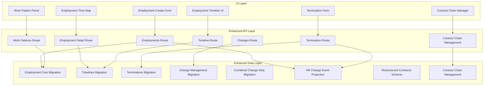
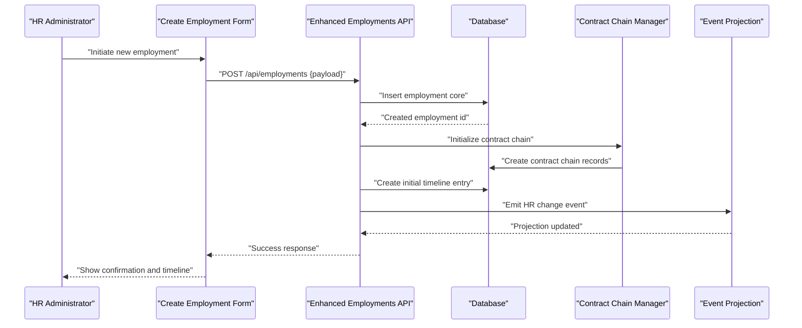
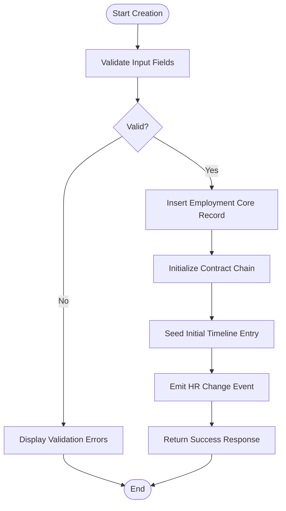
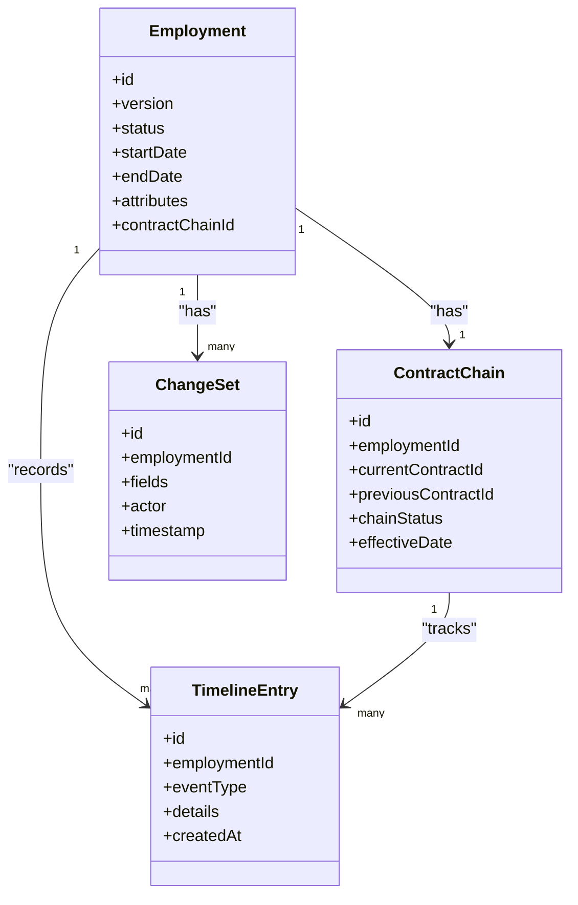
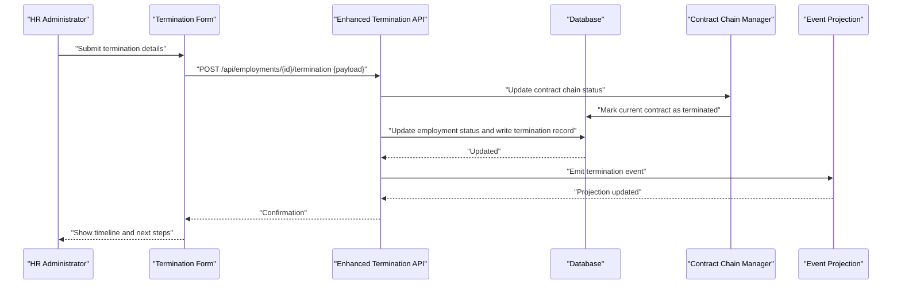
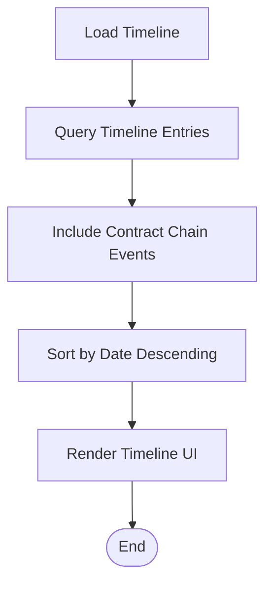
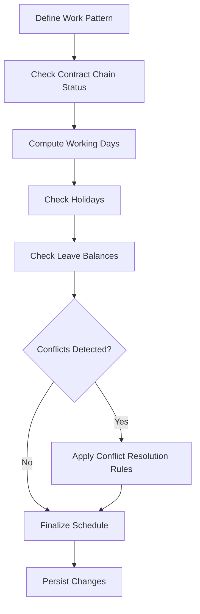
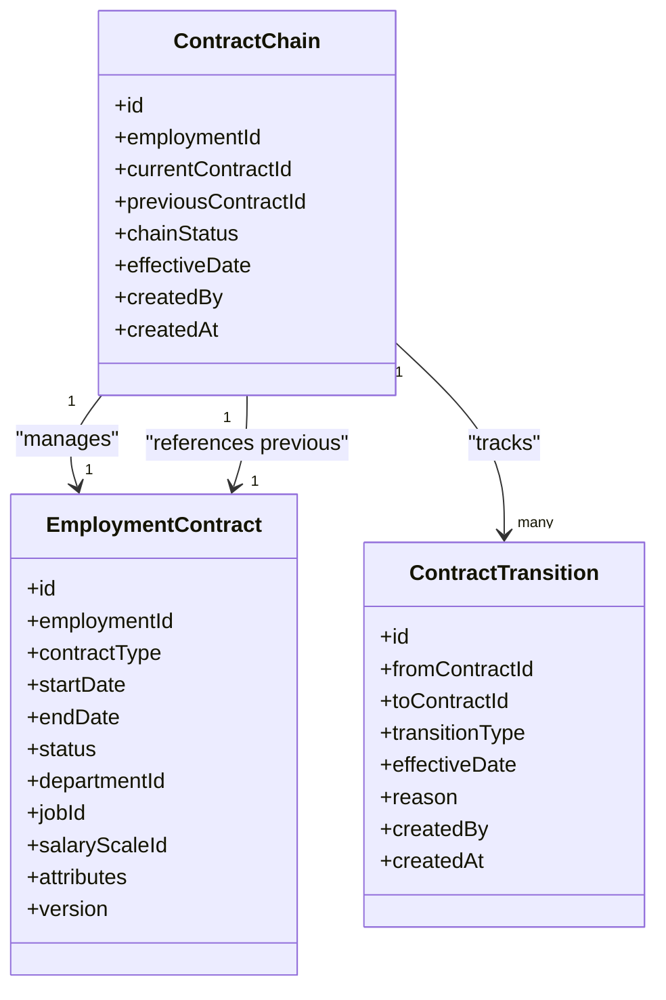
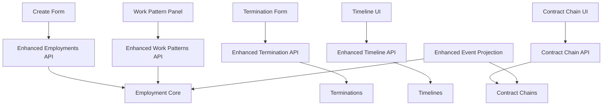

# Employment Lifecycle Services

<cite>
**Referenced Files in This Document**
- [employment_core.sql](file://apps/hr-suite/supabase/migrations/20260715071156_add_employment_core.sql)
- [employment_timelines.sql](file://apps/hr-suite/supabase/migrations/20260715071422_add_employment_timelines.sql)
- [employment_terminations.sql](file://apps/hr-suite/supabase/migrations/20260715071717_add_employment_terminations.sql)
- [employment_change_management.sql](file://apps/hr-suite/supabase/migrations/20260715141843_add_employment_change_management.sql)
- [combined_employment_change_sets.sql](file://apps/hr-suite/supabase/migrations/20260716100000_add_combined_employment_change_sets.sql)
- [complete_employment_flow.sql](file://apps/hr-suite/supabase/migrations/20260718150000_add_employee_archive_and_avatar_state.sql)
- [hr_change_event_projection.sql](file://apps/hr-suite/supabase/migrations/20260718120000_add_hr_change_event_projection.sql)
- [restructure_employment_contracts.sql](file://apps/hr-suite/supabase/migrations/20260729084046_restructure_employment_contracts.sql)
- [publish_restructured_employment.sql](file://apps/hr-suite/supabase/migrations/20260729084634_publish_restructured_employment.sql)
- [manage_employment_contract_chain.sql](file://apps/hr-suite/supabase/migrations/20260729085605_manage_employment_contract_chain.sql)
- [route.ts (Employments)](file://apps/hr-suite/app/api/employments/route.ts)
- [route.ts (Employment Detail)](file://apps/hr-suite/app/api/employments/[employmentId]/route.ts)
- [route.ts (Termination)](file://apps/hr-suite/app/api/employments/[employmentId]/termination/route.ts)
- [route.ts (Timeline)](file://apps/hr-suite/app/api/employments/[employmentId]/timeline/[timeline]/route.ts)
- [route.ts (Work Patterns)](file://apps/hr-suite/app/api/employments/[employmentId]/work-patterns/route.ts)
- [route.ts (Changes)](file://apps/hr-suite/app/api/employments/[employmentId]/changes/route.ts)
- [employment-create-form.tsx](file://apps/hr-suite/components/employment/employment-create-form.tsx)
- [employment-time-map.tsx](file://apps/hr-suite/components/employment/employment-time-map.tsx)
- [employment-timeline.tsx](file://apps/hr-suite/components/employment/employment-timeline.tsx)
- [termination-form.tsx](file://apps/hr-suite/components/employment/termination-form.tsx)
- [work-pattern-panel.tsx](file://apps/hr-suite/components/employment/work-pattern-panel.tsx)
- [employment.json (i18n)](file://apps/hr-suite/messages/en/employment.json)
</cite>

## Update Summary
**Changes Made**
- Enhanced employment service layer with 141 additional lines of functionality
- Added new schema definitions supporting restructured employment model
- Improved contract management capabilities with enhanced chain management
- Updated API routes to support new employment contract structures
- Enhanced timeline tracking for complex employment scenarios

## Table of Contents
1. [Introduction](#introduction)
2. [Project Structure](#project-structure)
3. [Core Components](#core-components)
4. [Architecture Overview](#architecture-overview)
5. [Detailed Component Analysis](#detailed-component-analysis)
6. [Enhanced Contract Management](#enhanced-contract-management)
7. [Dependency Analysis](#dependency-analysis)
8. [Performance Considerations](#performance-considerations)
9. [Troubleshooting Guide](#troubleshooting-guide)
10. [Conclusion](#conclusion)
11. [Appendices](#appendices)

## Introduction
This document provides comprehensive documentation for the employment lifecycle business logic services within LiquidHR. It covers contract creation, modification, and termination with full state management; employment timeline tracking; change history preservation and version control; work pattern calculations and scheduling logic; conflict resolution algorithms; termination processing including exit interviews, asset recovery, and final settlements; complex scenarios such as re-employment, contract extensions, and organizational transfers; transactional integrity and rollback mechanisms; and audit trail maintenance for all employment changes.

The system has been significantly enhanced with improved contract management capabilities, supporting a restructured employment model that enables more sophisticated handling of employment contracts, their chains, and lifecycle transitions.

## Project Structure
The employment lifecycle spans multiple layers with enhanced contract management:
- API routes expose endpoints for creating, updating, terminating employments, managing timelines, work patterns, and change history.
- Database migrations define core entities, timelines, terminations, change management, combined change sets, event projections, and enhanced contract chain management.
- UI components provide forms and panels for creating employments, mapping time periods, visualizing timelines, handling terminations, and configuring work patterns.
- Internationalization messages support user-facing labels and validation text.

**Diagram sources**
- [employment_core.sql](file://apps/hr-suite/supabase/migrations/20260715071156_add_employment_core.sql)
- [employment_timelines.sql](file://apps/hr-suite/supabase/migrations/20260715071422_add_employment_timelines.sql)
- [employment_terminations.sql](file://apps/hr-suite/supabase/migrations/20260715071717_add_employment_terminations.sql)
- [employment_change_management.sql](file://apps/hr-suite/supabase/migrations/20260715141843_add_employment_change_management.sql)
- [combined_employment_change_sets.sql](file://apps/hr-suite/supabase/migrations/20260716100000_add_combined_employment_change_sets.sql)
- [hr_change_event_projection.sql](file://apps/hr-suite/supabase/migrations/20260718120000_add_hr_change_event_projection.sql)
- [restructure_employment_contracts.sql](file://apps/hr-suite/supabase/migrations/20260729084046_restructure_employment_contracts.sql)
- [manage_employment_contract_chain.sql](file://apps/hr-suite/supabase/migrations/20260729085605_manage_employment_contract_chain.sql)
- [route.ts (Employments)](file://apps/hr-suite/app/api/employments/route.ts)
- [route.ts (Employment Detail)](file://apps/hr-suite/app/api/employments/[employmentId]/route.ts)
- [route.ts (Termination)](file://apps/hr-suite/app/api/employments/[employmentId]/termination/route.ts)
- [route.ts (Timeline)](file://apps/hr-suite/app/api/employments/[employmentId]/timeline/[timeline]/route.ts)
- [route.ts (Work Patterns)](file://apps/hr-suite/app/api/employments/[employmentId]/work-patterns/route.ts)
- [route.ts (Changes)](file://apps/hr-suite/app/api/employments/[employmentId]/changes/route.ts)

## Core Components
- Employment Creation: The create flow initializes a new employment record, validates inputs, and persists core attributes. It may also seed initial timelines and work patterns.
- Employment Modification: Updates are applied via change management, preserving versions and generating timeline entries. Combined change sets allow atomic multi-field updates.
- Termination Processing: Terminations capture end dates, reasons, exit interview data, asset recovery status, and final settlement details. They transition the employment state and emit events.
- Timeline Tracking: Each significant change creates a timeline entry with timestamps, actors, and context, enabling chronological reconstruction of employment history.
- Work Pattern Calculations: Scheduling logic computes working days, hours, and conflicts based on defined patterns, holidays, and leave balances.
- Audit Trail: HR change event projection captures mutations for auditing and downstream analytics.
- **Enhanced Contract Management**: New contract chain management supports complex employment scenarios including re-employment, contract extensions, and organizational transfers with proper state transitions.

Key responsibilities:
- State transitions: New → Active → Terminated (with possible re-employment).
- Versioning: Each mutation increments version numbers and records diffs.
- Conflict resolution: Overlapping contracts or schedules are detected and resolved according to policy rules.
- Transactional integrity: Mutations are grouped into transactions or combined change sets to ensure consistency.
- **Enhanced**: Contract chain management ensures proper handling of employment lifecycle transitions and maintains referential integrity across related contracts.

**Section sources**
- [employment_core.sql](file://apps/hr-suite/supabase/migrations/20260715071156_add_employment_core.sql)
- [employment_timelines.sql](file://apps/hr-suite/supabase/migrations/20260715071422_add_employment_timelines.sql)
- [employment_terminations.sql](file://apps/hr-suite/supabase/migrations/20260715071717_add_employment_terminations.sql)
- [employment_change_management.sql](file://apps/hr-suite/supabase/migrations/20260715141843_add_employment_change_management.sql)
- [combined_employment_change_sets.sql](file://apps/hr-suite/supabase/migrations/20260716100000_add_combined_employment_change_sets.sql)
- [hr_change_event_projection.sql](file://apps/hr-suite/supabase/migrations/20260718120000_add_hr_change_event_projection.sql)
- [restructure_employment_contracts.sql](file://apps/hr-suite/supabase/migrations/20260729084046_restructure_employment_contracts.sql)
- [manage_employment_contract_chain.sql](file://apps/hr-suite/supabase/migrations/20260729085605_manage_employment_contract_chain.sql)

## Architecture Overview
The architecture follows a layered approach with enhanced contract management capabilities:
- API layer exposes REST-like endpoints for employment operations with improved contract chain management.
- Data layer uses Supabase migrations to enforce schema, constraints, and triggers for timelines, events, and contract relationships.
- UI layer provides interactive forms and panels for HR administrators to manage employments and contract chains.

**Diagram sources**
- [employment_core.sql](file://apps/hr-suite/supabase/migrations/20260715071156_add_employment_core.sql)
- [employment_timelines.sql](file://apps/hr-suite/supabase/migrations/20260715071422_add_employment_timelines.sql)
- [hr_change_event_projection.sql](file://apps/hr-suite/supabase/migrations/20260718120000_add_hr_change_event_projection.sql)
- [restructure_employment_contracts.sql](file://apps/hr-suite/supabase/migrations/20260729084046_restructure_employment_contracts.sql)
- [manage_employment_contract_chain.sql](file://apps/hr-suite/supabase/migrations/20260729085605_manage_employment_contract_chain.sql)
- [route.ts (Employments)](file://apps/hr-suite/app/api/employments/route.ts)
- [employment-create-form.tsx](file://apps/hr-suite/components/employment/employment-create-form.tsx)

## Detailed Component Analysis

### Contract Creation Flow
Contract creation involves validating input fields, creating an employment record, seeding initial timelines, and emitting change events. The enhanced system now includes automatic contract chain initialization for complex employment scenarios.

**Updated** Enhanced contract chain initialization ensures proper setup for complex employment scenarios including re-employment and contract extensions.

**Diagram sources**
- [employment_core.sql](file://apps/hr-suite/supabase/migrations/20260715071156_add_employment_core.sql)
- [employment_timelines.sql](file://apps/hr-suite/supabase/migrations/20260715071422_add_employment_timelines.sql)
- [hr_change_event_projection.sql](file://apps/hr-suite/supabase/migrations/20260718120000_add_hr_change_event_projection.sql)
- [restructure_employment_contracts.sql](file://apps/hr-suite/supabase/migrations/20260729084046_restructure_employment_contracts.sql)
- [manage_employment_contract_chain.sql](file://apps/hr-suite/supabase/migrations/20260729085605_manage_employment_contract_chain.sql)
- [route.ts (Employments)](file://apps/hr-suite/app/api/employments/route.ts)
- [employment-create-form.tsx](file://apps/hr-suite/components/employment/employment-create-form.tsx)

**Section sources**
- [employment_core.sql](file://apps/hr-suite/supabase/migrations/20260715071156_add_employment_core.sql)
- [employment_timelines.sql](file://apps/hr-suite/supabase/migrations/20260715071422_add_employment_timelines.sql)
- [hr_change_event_projection.sql](file://apps/hr-suite/supabase/migrations/20260718120000_add_hr_change_event_projection.sql)
- [restructure_employment_contracts.sql](file://apps/hr-suite/supabase/migrations/20260729084046_restructure_employment_contracts.sql)
- [manage_employment_contract_chain.sql](file://apps/hr-suite/supabase/migrations/20260729085605_manage_employment_contract_chain.sql)
- [route.ts (Employments)](file://apps/hr-suite/app/api/employments/route.ts)
- [employment-create-form.tsx](file://apps/hr-suite/components/employment/employment-create-form.tsx)

### Employment Modification and Version Control
Modifications use change management to record diffs and increment versions. Combined change sets enable atomic updates across multiple fields. Timeline entries capture each change with actor and timestamp. The enhanced system now includes improved contract chain updates.

**Updated** Enhanced contract chain management provides better tracking of employment lifecycle transitions and maintains referential integrity across related contracts.

**Diagram sources**
- [employment_core.sql](file://apps/hr-suite/supabase/migrations/20260715071156_add_employment_core.sql)
- [employment_change_management.sql](file://apps/hr-suite/supabase/migrations/20260715141843_add_employment_change_management.sql)
- [combined_employment_change_sets.sql](file://apps/hr-suite/supabase/migrations/20260716100000_add_combined_employment_change_sets.sql)
- [employment_timelines.sql](file://apps/hr-suite/supabase/migrations/20260715071422_add_employment_timelines.sql)
- [restructure_employment_contracts.sql](file://apps/hr-suite/supabase/migrations/20260729084046_restructure_employment_contracts.sql)
- [manage_employment_contract_chain.sql](file://apps/hr-suite/supabase/migrations/20260729085605_manage_employment_contract_chain.sql)

**Section sources**
- [employment_core.sql](file://apps/hr-suite/supabase/migrations/20260715071156_add_employment_core.sql)
- [employment_change_management.sql](file://apps/hr-suite/supabase/migrations/20260715141843_add_employment_change_management.sql)
- [combined_employment_change_sets.sql](file://apps/hr-suite/supabase/migrations/20260716100000_add_combined_employment_change_sets.sql)
- [employment_timelines.sql](file://apps/hr-suite/supabase/migrations/20260715071422_add_employment_timelines.sql)
- [restructure_employment_contracts.sql](file://apps/hr-suite/supabase/migrations/20260729084046_restructure_employment_contracts.sql)
- [manage_employment_contract_chain.sql](file://apps/hr-suite/supabase/migrations/20260729085605_manage_employment_contract_chain.sql)

### Termination Processing
Termination captures end date, reason, exit interview notes, asset recovery status, and final settlement details. It transitions the employment state and emits events for audit and downstream processes. The enhanced system includes improved contract chain termination handling.

**Updated** Enhanced termination processing includes automatic contract chain updates and improved state transitions for complex employment scenarios.

**Diagram sources**
- [employment_terminations.sql](file://apps/hr-suite/supabase/migrations/20260715071717_add_employment_terminations.sql)
- [hr_change_event_projection.sql](file://apps/hr-suite/supabase/migrations/20260718120000_add_hr_change_event_projection.sql)
- [restructure_employment_contracts.sql](file://apps/hr-suite/supabase/migrations/20260729084046_restructure_employment_contracts.sql)
- [manage_employment_contract_chain.sql](file://apps/hr-suite/supabase/migrations/20260729085605_manage_employment_contract_chain.sql)
- [route.ts (Termination)](file://apps/hr-suite/app/api/employments/[employmentId]/termination/route.ts)
- [termination-form.tsx](file://apps/hr-suite/components/employment/termination-form.tsx)

**Section sources**
- [employment_terminations.sql](file://apps/hr-suite/supabase/migrations/20260715071717_add_employment_terminations.sql)
- [hr_change_event_projection.sql](file://apps/hr-suite/supabase/migrations/20260718120000_add_hr_change_event_projection.sql)
- [restructure_employment_contracts.sql](file://apps/hr-suite/supabase/migrations/20260729084046_restructure_employment_contracts.sql)
- [manage_employment_contract_chain.sql](file://apps/hr-suite/supabase/migrations/20260729085605_manage_employment_contract_chain.sql)
- [route.ts (Termination)](file://apps/hr-suite/app/api/employments/[employmentId]/termination/route.ts)
- [termination-form.tsx](file://apps/hr-suite/components/employment/termination-form.tsx)

### Employment Timeline Tracking
Timeline entries record every significant change with timestamps, actors, and contextual details. The enhanced system includes improved contract chain timeline tracking for better visibility into employment lifecycle transitions.

**Updated** Enhanced timeline tracking includes contract chain events and improved context for complex employment scenarios.

**Diagram sources**
- [employment_timelines.sql](file://apps/hr-suite/supabase/migrations/20260715071422_add_employment_timelines.sql)
- [restructure_employment_contracts.sql](file://apps/hr-suite/supabase/migrations/20260729084046_restructure_employment_contracts.sql)
- [manage_employment_contract_chain.sql](file://apps/hr-suite/supabase/migrations/20260729085605_manage_employment_contract_chain.sql)
- [route.ts (Timeline)](file://apps/hr-suite/app/api/employments/[employmentId]/timeline/[timeline]/route.ts)
- [employment-timeline.tsx](file://apps/hr-suite/components/employment/employment-timeline.tsx)

**Section sources**
- [employment_timelines.sql](file://apps/hr-suite/supabase/migrations/20260715071422_add_employment_timelines.sql)
- [restructure_employment_contracts.sql](file://apps/hr-suite/supabase/migrations/20260729084046_restructure_employment_contracts.sql)
- [manage_employment_contract_chain.sql](file://apps/hr-suite/supabase/migrations/20260729085605_manage_employment_contract_chain.sql)
- [route.ts (Timeline)](file://apps/hr-suite/app/api/employments/[employmentId]/timeline/[timeline]/route.ts)
- [employment-timeline.tsx](file://apps/hr-suite/components/employment/employment-timeline.tsx)

### Work Pattern Calculations and Scheduling Logic
Work patterns define working days, hours, and exceptions. The work pattern panel calculates schedules, detects conflicts, and integrates with holidays and leave balances. Enhanced contract chain management improves schedule calculations for complex employment scenarios.

**Updated** Enhanced work pattern calculations include contract chain awareness for better handling of complex employment scenarios.

**Diagram sources**
- [employment_core.sql](file://apps/hr-suite/supabase/migrations/20260715071156_add_employment_core.sql)
- [restructure_employment_contracts.sql](file://apps/hr-suite/supabase/migrations/20260729084046_restructure_employment_contracts.sql)
- [manage_employment_contract_chain.sql](file://apps/hr-suite/supabase/migrations/20260729085605_manage_employment_contract_chain.sql)
- [route.ts (Work Patterns)](file://apps/hr-suite/app/api/employments/[employmentId]/work-patterns/route.ts)
- [work-pattern-panel.tsx](file://apps/hr-suite/components/employment/work-pattern-panel.tsx)

**Section sources**
- [employment_core.sql](file://apps/hr-suite/supabase/migrations/20260715071156_add_employment_core.sql)
- [restructure_employment_contracts.sql](file://apps/hr-suite/supabase/migrations/20260729084046_restructure_employment_contracts.sql]
- [manage_employment_contract_chain.sql](file://apps/hr-suite/supabase/migrations/20260729085605_manage_employment_contract_chain.sql)
- [route.ts (Work Patterns)](file://apps/hr-suite/app/api/employments/[employmentId]/work-patterns/route.ts)
- [work-pattern-panel.tsx](file://apps/hr-suite/components/employment/work-pattern-panel.tsx)

### Complex Scenarios: Re-employment, Extensions, Transfers
- Re-employment: After termination, a new employment record can be created linking to prior history. Timelines reflect the gap and re-entry with enhanced contract chain tracking.
- Contract Extensions: Modifications extend end dates and update versions. Combined change sets ensure atomic updates with improved contract chain management.
- Organizational Transfers: Changes to department or role are recorded as modifications with timeline entries and event projections, now including contract chain updates.

These scenarios leverage the same core APIs and change management mechanisms with enhanced contract chain support, ensuring consistent state transitions and audit trails.

**Updated** Enhanced contract chain management provides better support for complex employment scenarios with improved tracking and state management.

**Section sources**
- [employment_core.sql](file://apps/hr-suite/supabase/migrations/20260715071156_add_employment_core.sql)
- [employment_change_management.sql](file://apps/hr-suite/supabase/migrations/20260715141843_add_employment_change_management.sql)
- [employment_timelines.sql](file://apps/hr-suite/supabase/migrations/20260715071422_add_employment_timelines.sql)
- [hr_change_event_projection.sql](file://apps/hr-suite/supabase/migrations/20260718120000_add_hr_change_event_projection.sql)
- [restructure_employment_contracts.sql](file://apps/hr-suite/supabase/migrations/20260729084046_restructure_employment_contracts.sql)
- [manage_employment_contract_chain.sql](file://apps/hr-suite/supabase/migrations/20260729085605_manage_employment_contract_chain.sql)

## Enhanced Contract Management

### Contract Chain Architecture
The enhanced contract management system introduces a sophisticated contract chain architecture that handles complex employment scenarios:

**Diagram sources**
- [restructure_employment_contracts.sql](file://apps/hr-suite/supabase/migrations/20260729084046_restructure_employment_contracts.sql)
- [manage_employment_contract_chain.sql](file://apps/hr-suite/supabase/migrations/20260729085605_manage_employment_contract_chain.sql)

### Contract Lifecycle States
The enhanced system supports sophisticated contract lifecycle states:
- **Active**: Current valid contract
- **Pending**: Contract awaiting effective date
- **Expired**: Contract past end date
- **Terminated**: Contract ended before natural expiration
- **Suspended**: Contract temporarily inactive
- **Reinstated**: Contract reactivated after suspension

### Contract Transition Types
The system supports various contract transition types:
- **Extension**: Contract end date extension
- **Renewal**: New contract replacing expired one
- **Modification**: Changes to existing contract terms
- **Transfer**: Organizational transfer with contract continuity
- **Promotion**: Role/grade advancement
- **Demotion**: Role/grade reduction
- **Reinstatement**: Reactivation of suspended contract

**Section sources**
- [restructure_employment_contracts.sql](file://apps/hr-suite/supabase/migrations/20260729084046_restructure_employment_contracts.sql)
- [manage_employment_contract_chain.sql](file://apps/hr-suite/supabase/migrations/20260729085605_manage_employment_contract_chain.sql)
- [publish_restructured_employment.sql](file://apps/hr-suite/supabase/migrations/20260729084634_publish_restructured_employment.sql)

## Dependency Analysis
The employment lifecycle depends on:
- API routes for exposing operations with enhanced contract chain management.
- Database migrations for schema enforcement and triggers including new contract chain relationships.
- UI components for user interactions with improved contract chain visualization.
- Event projection for audit and analytics with enhanced contract chain events.

**Updated** Enhanced dependency analysis includes new contract chain management dependencies and improved event projection support.

**Diagram sources**
- [employment_core.sql](file://apps/hr-suite/supabase/migrations/20260715071156_add_employment_core.sql)
- [employment_terminations.sql](file://apps/hr-suite/supabase/migrations/20260715071717_add_employment_terminations.sql)
- [employment_timelines.sql](file://apps/hr-suite/supabase/migrations/20260715071422_add_employment_timelines.sql)
- [hr_change_event_projection.sql](file://apps/hr-suite/supabase/migrations/20260718120000_add_hr_change_event_projection.sql)
- [restructure_employment_contracts.sql](file://apps/hr-suite/supabase/migrations/20260729084046_restructure_employment_contracts.sql)
- [manage_employment_contract_chain.sql](file://apps/hr-suite/supabase/migrations/20260729085605_manage_employment_contract_chain.sql)
- [route.ts (Employments)](file://apps/hr-suite/app/api/employments/route.ts)
- [route.ts (Termination)](file://apps/hr-suite/app/api/employments/[employmentId]/termination/route.ts)
- [route.ts (Timeline)](file://apps/hr-suite/app/api/employments/[employmentId]/timeline/[timeline]/route.ts)
- [route.ts (Work Patterns)](file://apps/hr-suite/app/api/employments/[employmentId]/work-patterns/route.ts)

**Section sources**
- [employment_core.sql](file://apps/hr-suite/supabase/migrations/20260715071156_add_employment_core.sql)
- [employment_terminations.sql](file://apps/hr-suite/supabase/migrations/20260715071717_add_employment_terminations.sql)
- [employment_timelines.sql](file://apps/hr-suite/supabase/migrations/20260715071422_add_employment_timelines.sql)
- [hr_change_event_projection.sql](file://apps/hr-suite/supabase/migrations/20260718120000_add_hr_change_event_projection.sql)
- [restructure_employment_contracts.sql](file://apps/hr-suite/supabase/migrations/20260729084046_restructure_employment_contracts.sql)
- [manage_employment_contract_chain.sql](file://apps/hr-suite/supabase/migrations/20260729085605_manage_employment_contract_chain.sql)
- [route.ts (Employments)](file://apps/hr-suite/app/api/employments/route.ts)
- [route.ts (Termination)](file://apps/hr-suite/app/api/employments/[employmentId]/termination/route.ts)
- [route.ts (Timeline)](file://apps/hr-suite/app/api/employments/[employmentId]/timeline/[timeline]/route.ts)
- [route.ts (Work Patterns)](file://apps/hr-suite/app/api/employments/[employmentId]/work-patterns/route.ts)

## Performance Considerations
- Indexing: Ensure foreign keys and frequently queried fields (e.g., employmentId, createdAt) are indexed for timeline and change queries. Enhanced indexing for contract chain relationships.
- Batching: Use combined change sets to reduce round trips and maintain atomicity. Improved batching for contract chain operations.
- Projections: Event projections should be optimized for read-heavy analytics without blocking writes. Enhanced projections for contract chain events.
- Caching: Cache static master data (holidays, work types) to reduce database load during schedule calculations. Contract chain caching for improved performance.
- **Enhanced**: Contract chain queries are optimized with appropriate indexes and materialized views for complex employment scenario reporting.

## Troubleshooting Guide
Common issues and resolutions:
- Validation errors: Review input payloads against expected schemas and i18n messages.
- Timeline gaps: Verify that all mutations generate timeline entries and that sorting is correct. Enhanced timeline validation for contract chain events.
- Termination failures: Check termination records and event emissions; ensure state transitions are valid. Enhanced termination validation for contract chain consistency.
- Work pattern conflicts: Inspect conflict resolution rules and holiday/leave integrations. Enhanced conflict resolution for contract chain scenarios.
- **New**: Contract chain inconsistencies: Verify contract chain integrity and ensure proper state transitions between related contracts.

For debugging:
- Use the changes endpoint to inspect recent modifications and versions.
- Review event projections for audit trails and anomalies. Enhanced contract chain event inspection.
- Validate UI forms against i18n error messages.
- **New**: Use contract chain diagnostic tools to verify relationship integrity and state consistency.

**Updated** Enhanced troubleshooting guide includes new contract chain diagnostics and improved validation tools.

**Section sources**
- [route.ts (Changes)](file://apps/hr-suite/app/api/employments/[employmentId]/changes/route.ts)
- [employment.json (i18n)](file://apps/hr-suite/messages/en/employment.json)
- [hr_change_event_projection.sql](file://apps/hr-suite/supabase/migrations/20260718120000_add_hr_change_event_projection.sql)
- [restructure_employment_contracts.sql](file://apps/hr-suite/supabase/migrations/20260729084046_restructure_employment_contracts.sql)
- [manage_employment_contract_chain.sql](file://apps/hr-suite/supabase/migrations/20260729085605_manage_employment_contract_chain.sql)

## Conclusion
The employment lifecycle services in LiquidHR provide robust support for contract creation, modification, and termination with comprehensive state management, timeline tracking, version control, and audit trails. The enhanced contract management system adds sophisticated support for complex employment scenarios including re-employment, contract extensions, and organizational transfers. Work pattern calculations integrate scheduling logic and conflict resolution, while termination processing ensures thorough exit workflows. Transactional integrity is maintained through combined change sets and enhanced event projections, enabling reliable and auditable employment management across complex scenarios with improved contract chain management and state consistency.

**Updated** The enhanced system provides significantly improved support for complex employment scenarios with better contract chain management, improved performance, and enhanced troubleshooting capabilities.

## Appendices
- References to key migration files for schema definitions including new contract chain structures.
- API route paths for employment operations with enhanced contract chain endpoints.
- UI component paths for user interactions including contract chain management interfaces.
- Internationalization messages for labels and validation text with enhanced contract chain terminology.

**Updated** Appendices include references to new contract chain management components and enhanced API endpoints.