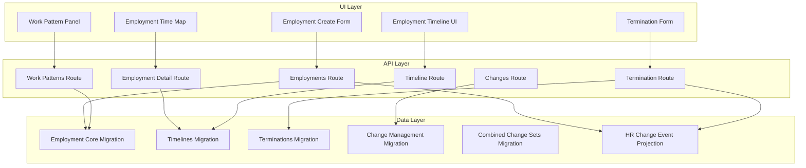
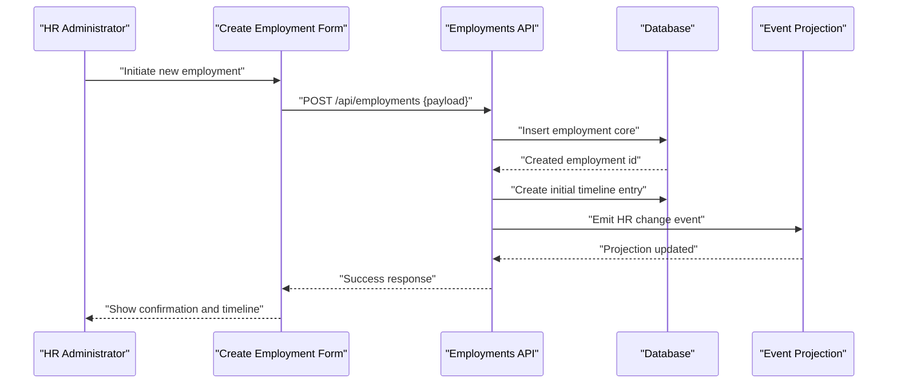
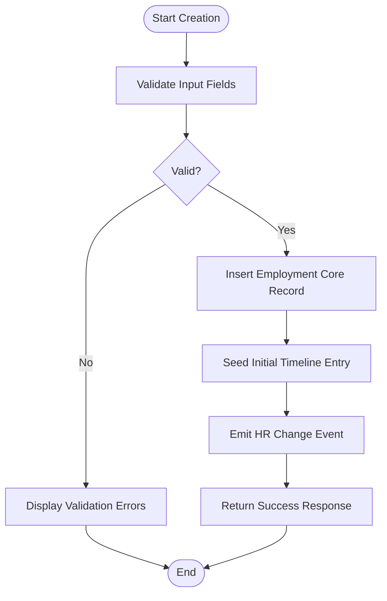
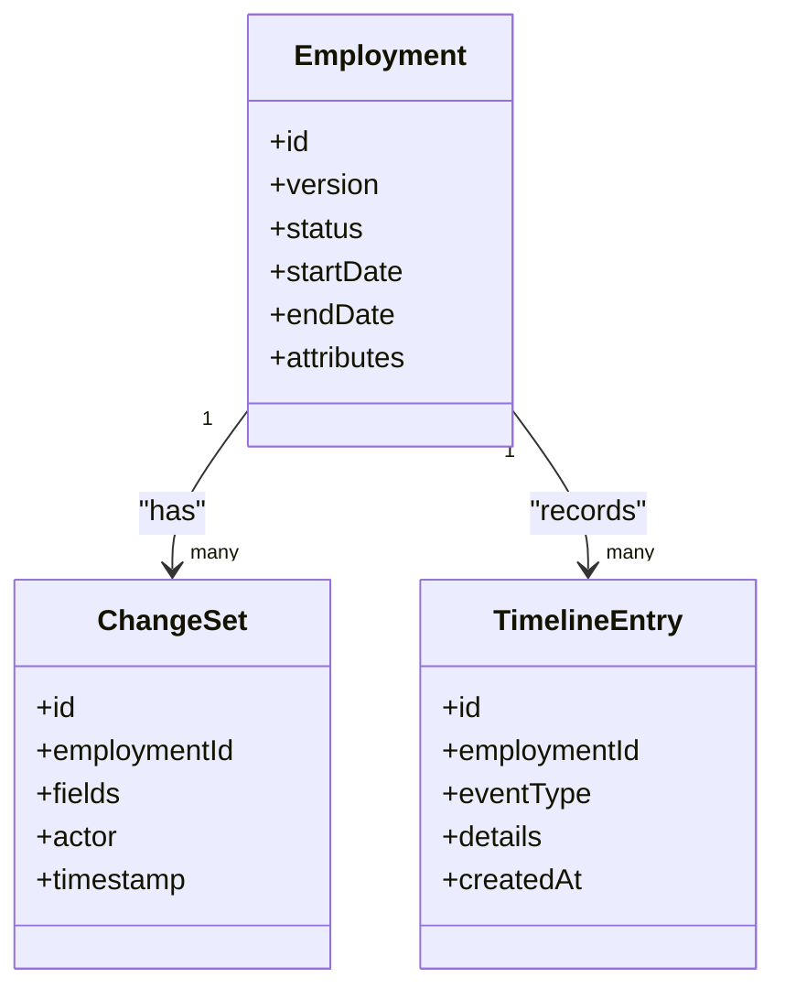
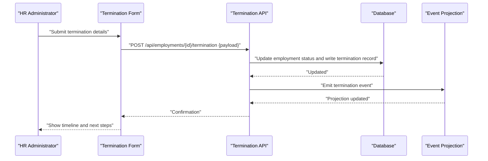
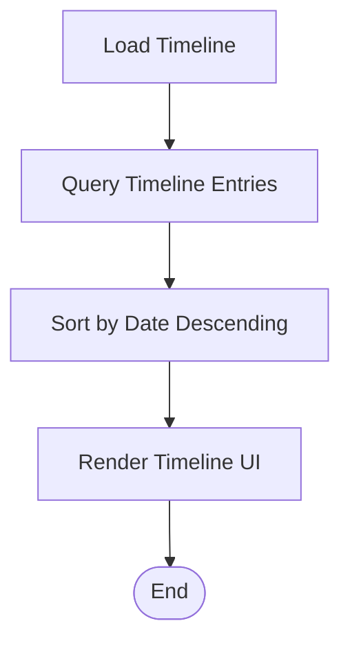
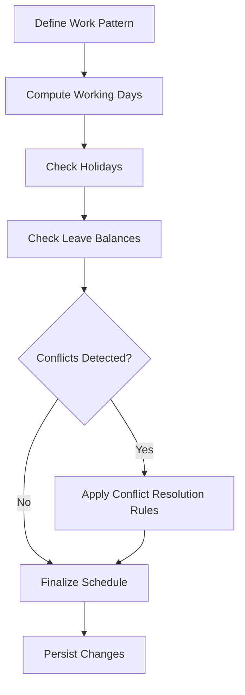
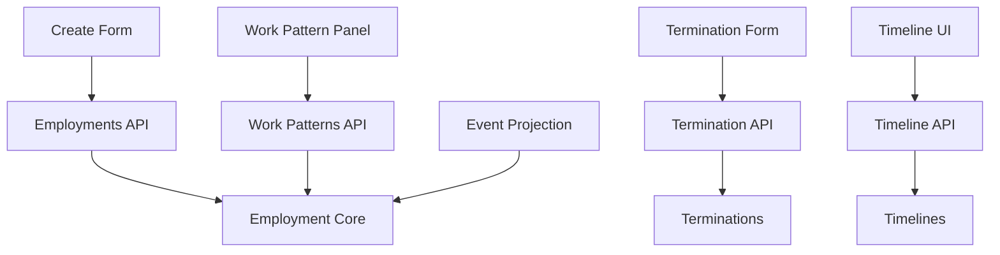

# Employment Lifecycle Services

<cite>
**Referenced Files in This Document**
- [employment_core.sql](file://apps/hr-suite/supabase/migrations/20260715071156_add_employment_core.sql)
- [employment_timelines.sql](file://apps/hr-suite/supabase/migrations/20260715071422_add_employment_timelines.sql)
- [employment_terminations.sql](file://apps/hr-suite/supabase/migrations/20260715071717_add_employment_terminations.sql)
- [employment_change_management.sql](file://apps/hr-suite/supabase/migrations/20260715141843_add_employment_change_management.sql)
- [combined_employment_change_sets.sql](file://apps/hr-suite/supabase/migrations/20260716100000_add_combined_employment_change_sets.sql)
- [complete_employment_flow.sql](file://apps/hr-suite/supabase/migrations/20260718150000_add_employee_archive_and_avatar_state.sql)
- [hr_change_event_projection.sql](file://apps/hr-suite/supabase/migrations/20260718120000_add_hr_change_event_projection.sql)
- [route.ts (Employments)](file://apps/hr-suite/app/api/employments/route.ts)
- [route.ts (Employment Detail)](file://apps/hr-suite/app/api/employments/[employmentId]/route.ts)
- [route.ts (Termination)](file://apps/hr-suite/app/api/employments/[employmentId]/termination/route.ts)
- [route.ts (Timeline)](file://apps/hr-suite/app/api/employments/[employmentId]/timeline/[timeline]/route.ts)
- [route.ts (Work Patterns)](file://apps/hr-suite/app/api/employments/[employmentId]/work-patterns/route.ts)
- [route.ts (Changes)](file://apps/hr-suite/app/api/employments/[employmentId]/changes/route.ts)
- [employment-create-form.tsx](file://apps/hr-suite/components/employment/employment-create-form.tsx)
- [employment-time-map.tsx](file://apps/hr-suite/components/employment/employment-time-map.tsx)
- [employment-timeline.tsx](file://apps/hr-suite/components/employment/employment-timeline.tsx)
- [termination-form.tsx](file://apps/hr-suite/components/employment/termination-form.tsx)
- [work-pattern-panel.tsx](file://apps/hr-suite/components/employment/work-pattern-panel.tsx)
- [employment.json (i18n)](file://apps/hr-suite/messages/en/employment.json)
</cite>

## Table of Contents
1. [Introduction](#introduction)
2. [Project Structure](#project-structure)
3. [Core Components](#core-components)
4. [Architecture Overview](#architecture-overview)
5. [Detailed Component Analysis](#detailed-component-analysis)
6. [Dependency Analysis](#dependency-analysis)
7. [Performance Considerations](#performance-considerations)
8. [Troubleshooting Guide](#troubleshooting-guide)
9. [Conclusion](#conclusion)
10. [Appendices](#appendices)

## Introduction
This document provides comprehensive documentation for the employment lifecycle business logic services within LiquidHR. It covers contract creation, modification, and termination with full state management; employment timeline tracking; change history preservation and version control; work pattern calculations and scheduling logic; conflict resolution algorithms; termination processing including exit interviews, asset recovery, and final settlements; complex scenarios such as re-employment, contract extensions, and organizational transfers; transactional integrity and rollback mechanisms; and audit trail maintenance for all employment changes.

The goal is to make the system understandable for both technical and non-technical readers while providing precise references to implementation files and database migrations that underpin these capabilities.

## Project Structure
The employment lifecycle spans multiple layers:
- API routes expose endpoints for creating, updating, terminating employments, managing timelines, work patterns, and change history.
- Database migrations define core entities, timelines, terminations, change management, combined change sets, and event projections.
- UI components provide forms and panels for creating employments, mapping time periods, visualizing timelines, handling terminations, and configuring work patterns.
- Internationalization messages support user-facing labels and validation text.

**Diagram sources**
- [employment_core.sql](file://apps/hr-suite/supabase/migrations/20260715071156_add_employment_core.sql)
- [employment_timelines.sql](file://apps/hr-suite/supabase/migrations/20260715071422_add_employment_timelines.sql)
- [employment_terminations.sql](file://apps/hr-suite/supabase/migrations/20260715071717_add_employment_terminations.sql)
- [employment_change_management.sql](file://apps/hr-suite/supabase/migrations/20260715141843_add_employment_change_management.sql)
- [combined_employment_change_sets.sql](file://apps/hr-suite/supabase/migrations/20260716100000_add_combined_employment_change_sets.sql)
- [hr_change_event_projection.sql](file://apps/hr-suite/supabase/migrations/20260718120000_add_hr_change_event_projection.sql)
- [route.ts (Employments)](file://apps/hr-suite/app/api/employments/route.ts)
- [route.ts (Employment Detail)](file://apps/hr-suite/app/api/employments/[employmentId]/route.ts)
- [route.ts (Termination)](file://apps/hr-suite/app/api/employments/[employmentId]/termination/route.ts)
- [route.ts (Timeline)](file://apps/hr-suite/app/api/employments/[employmentId]/timeline/[timeline]/route.ts)
- [route.ts (Work Patterns)](file://apps/hr-suite/app/api/employments/[employmentId]/work-patterns/route.ts)
- [route.ts (Changes)](file://apps/hr-suite/app/api/employments/[employmentId]/changes/route.ts)
- [employment-create-form.tsx](file://apps/hr-suite/components/employment/employment-create-form.tsx)
- [employment-time-map.tsx](file://apps/hr-suite/components/employment/employment-time-map.tsx)
- [employment-timeline.tsx](file://apps/hr-suite/components/employment/employment-timeline.tsx)
- [termination-form.tsx](file://apps/hr-suite/components/employment/termination-form.tsx)
- [work-pattern-panel.tsx](file://apps/hr-suite/components/employment/work-pattern-panel.tsx)

**Section sources**
- [employment_core.sql](file://apps/hr-suite/supabase/migrations/20260715071156_add_employment_core.sql)
- [employment_timelines.sql](file://apps/hr-suite/supabase/migrations/20260715071422_add_employment_timelines.sql)
- [employment_terminations.sql](file://apps/hr-suite/supabase/migrations/20260715071717_add_employment_terminations.sql)
- [employment_change_management.sql](file://apps/hr-suite/supabase/migrations/20260715141843_add_employment_change_management.sql)
- [combined_employment_change_sets.sql](file://apps/hr-suite/supabase/migrations/20260716100000_add_combined_employment_change_sets.sql)
- [hr_change_event_projection.sql](file://apps/hr-suite/supabase/migrations/20260718120000_add_hr_change_event_projection.sql)
- [route.ts (Employments)](file://apps/hr-suite/app/api/employments/route.ts)
- [route.ts (Employment Detail)](file://apps/hr-suite/app/api/employments/[employmentId]/route.ts)
- [route.ts (Termination)](file://apps/hr-suite/app/api/employments/[employmentId]/termination/route.ts)
- [route.ts (Timeline)](file://apps/hr-suite/app/api/employments/[employmentId]/timeline/[timeline]/route.ts)
- [route.ts (Work Patterns)](file://apps/hr-suite/app/api/employments/[employmentId]/work-patterns/route.ts)
- [route.ts (Changes)](file://apps/hr-suite/app/api/employments/[employmentId]/changes/route.ts)
- [employment-create-form.tsx](file://apps/hr-suite/components/employment/employment-create-form.tsx)
- [employment-time-map.tsx](file://apps/hr-suite/components/employment/employment-time-map.tsx)
- [employment-timeline.tsx](file://apps/hr-suite/components/employment/employment-timeline.tsx)
- [termination-form.tsx](file://apps/hr-suite/components/employment/termination-form.tsx)
- [work-pattern-panel.tsx](file://apps/hr-suite/components/employment/work-pattern-panel.tsx)

## Core Components
- Employment Creation: The create flow initializes a new employment record, validates inputs, and persists core attributes. It may also seed initial timelines and work patterns.
- Employment Modification: Updates are applied via change management, preserving versions and generating timeline entries. Combined change sets allow atomic multi-field updates.
- Termination Processing: Terminations capture end dates, reasons, exit interview data, asset recovery status, and final settlement details. They transition the employment state and emit events.
- Timeline Tracking: Each significant change creates a timeline entry with timestamps, actors, and context, enabling chronological reconstruction of employment history.
- Work Pattern Calculations: Scheduling logic computes working days, hours, and conflicts based on defined patterns, holidays, and leave balances.
- Audit Trail: HR change event projection captures mutations for auditing and downstream analytics.

Key responsibilities:
- State transitions: New → Active → Terminated (with possible re-employment).
- Versioning: Each mutation increments version numbers and records diffs.
- Conflict resolution: Overlapping contracts or schedules are detected and resolved according to policy rules.
- Transactional integrity: Mutations are grouped into transactions or combined change sets to ensure consistency.

**Section sources**
- [employment_core.sql](file://apps/hr-suite/supabase/migrations/20260715071156_add_employment_core.sql)
- [employment_timelines.sql](file://apps/hr-suite/supabase/migrations/20260715071422_add_employment_timelines.sql)
- [employment_terminations.sql](file://apps/hr-suite/supabase/migrations/20260715071717_add_employment_terminations.sql)
- [employment_change_management.sql](file://apps/hr-suite/supabase/migrations/20260715141843_add_employment_change_management.sql)
- [combined_employment_change_sets.sql](file://apps/hr-suite/supabase/migrations/20260716100000_add_combined_employment_change_sets.sql)
- [hr_change_event_projection.sql](file://apps/hr-suite/supabase/migrations/20260718120000_add_hr_change_event_projection.sql)

## Architecture Overview
The architecture follows a layered approach:
- API layer exposes REST-like endpoints for employment operations.
- Data layer uses Supabase migrations to enforce schema, constraints, and triggers for timelines and events.
- UI layer provides interactive forms and panels for HR administrators to manage employments.

**Diagram sources**
- [employment_core.sql](file://apps/hr-suite/supabase/migrations/20260715071156_add_employment_core.sql)
- [employment_timelines.sql](file://apps/hr-suite/supabase/migrations/20260715071422_add_employment_timelines.sql)
- [hr_change_event_projection.sql](file://apps/hr-suite/supabase/migrations/20260718120000_add_hr_change_event_projection.sql)
- [route.ts (Employments)](file://apps/hr-suite/app/api/employments/route.ts)
- [employment-create-form.tsx](file://apps/hr-suite/components/employment/employment-create-form.tsx)

## Detailed Component Analysis

### Contract Creation Flow
Contract creation involves validating input fields, creating an employment record, seeding initial timelines, and emitting change events. The UI form collects necessary data and submits it to the API endpoint.

**Diagram sources**
- [employment_core.sql](file://apps/hr-suite/supabase/migrations/20260715071156_add_employment_core.sql)
- [employment_timelines.sql](file://apps/hr-suite/supabase/migrations/20260715071422_add_employment_timelines.sql)
- [hr_change_event_projection.sql](file://apps/hr-suite/supabase/migrations/20260718120000_add_hr_change_event_projection.sql)
- [route.ts (Employments)](file://apps/hr-suite/app/api/employments/route.ts)
- [employment-create-form.tsx](file://apps/hr-suite/components/employment/employment-create-form.tsx)

**Section sources**
- [employment_core.sql](file://apps/hr-suite/supabase/migrations/20260715071156_add_employment_core.sql)
- [employment_timelines.sql](file://apps/hr-suite/supabase/migrations/20260715071422_add_employment_timelines.sql)
- [hr_change_event_projection.sql](file://apps/hr-suite/supabase/migrations/20260718120000_add_hr_change_event_projection.sql)
- [route.ts (Employments)](file://apps/hr-suite/app/api/employments/route.ts)
- [employment-create-form.tsx](file://apps/hr-suite/components/employment/employment-create-form.tsx)

### Employment Modification and Version Control
Modifications use change management to record diffs and increment versions. Combined change sets enable atomic updates across multiple fields. Timeline entries capture each change with actor and timestamp.

**Diagram sources**
- [employment_core.sql](file://apps/hr-suite/supabase/migrations/20260715071156_add_employment_core.sql)
- [employment_change_management.sql](file://apps/hr-suite/supabase/migrations/20260715141843_add_employment_change_management.sql)
- [combined_employment_change_sets.sql](file://apps/hr-suite/supabase/migrations/20260716100000_add_combined_employment_change_sets.sql)
- [employment_timelines.sql](file://apps/hr-suite/supabase/migrations/20260715071422_add_employment_timelines.sql)

**Section sources**
- [employment_core.sql](file://apps/hr-suite/supabase/migrations/20260715071156_add_employment_core.sql)
- [employment_change_management.sql](file://apps/hr-suite/supabase/migrations/20260715141843_add_employment_change_management.sql)
- [combined_employment_change_sets.sql](file://apps/hr-suite/supabase/migrations/20260716100000_add_combined_employment_change_sets.sql)
- [employment_timelines.sql](file://apps/hr-suite/supabase/migrations/20260715071422_add_employment_timelines.sql)

### Termination Processing
Termination captures end date, reason, exit interview notes, asset recovery status, and final settlement details. It transitions the employment state and emits events for audit and downstream processes.

**Diagram sources**
- [employment_terminations.sql](file://apps/hr-suite/supabase/migrations/20260715071717_add_employment_terminations.sql)
- [hr_change_event_projection.sql](file://apps/hr-suite/supabase/migrations/20260718120000_add_hr_change_event_projection.sql)
- [route.ts (Termination)](file://apps/hr-suite/app/api/employments/[employmentId]/termination/route.ts)
- [termination-form.tsx](file://apps/hr-suite/components/employment/termination-form.tsx)

**Section sources**
- [employment_terminations.sql](file://apps/hr-suite/supabase/migrations/20260715071717_add_employment_terminations.sql)
- [hr_change_event_projection.sql](file://apps/hr-suite/supabase/migrations/20260718120000_add_hr_change_event_projection.sql)
- [route.ts (Termination)](file://apps/hr-suite/app/api/employments/[employmentId]/termination/route.ts)
- [termination-form.tsx](file://apps/hr-suite/components/employment/termination-form.tsx)

### Employment Timeline Tracking
Timeline entries record every significant change with timestamps, actors, and contextual details. The timeline route retrieves chronological data for display.

**Diagram sources**
- [employment_timelines.sql](file://apps/hr-suite/supabase/migrations/20260715071422_add_employment_timelines.sql)
- [route.ts (Timeline)](file://apps/hr-suite/app/api/employments/[employmentId]/timeline/[timeline]/route.ts)
- [employment-timeline.tsx](file://apps/hr-suite/components/employment/employment-timeline.tsx)

**Section sources**
- [employment_timelines.sql](file://apps/hr-suite/supabase/migrations/20260715071422_add_employment_timelines.sql)
- [route.ts (Timeline)](file://apps/hr-suite/app/api/employments/[employmentId]/timeline/[timeline]/route.ts)
- [employment-timeline.tsx](file://apps/hr-suite/components/employment/employment-timeline.tsx)

### Work Pattern Calculations and Scheduling Logic
Work patterns define working days, hours, and exceptions. The work pattern panel calculates schedules, detects conflicts, and integrates with holidays and leave balances.

**Diagram sources**
- [employment_core.sql](file://apps/hr-suite/supabase/migrations/20260715071156_add_employment_core.sql)
- [route.ts (Work Patterns)](file://apps/hr-suite/app/api/employments/[employmentId]/work-patterns/route.ts)
- [work-pattern-panel.tsx](file://apps/hr-suite/components/employment/work-pattern-panel.tsx)

**Section sources**
- [employment_core.sql](file://apps/hr-suite/supabase/migrations/20260715071156_add_employment_core.sql)
- [route.ts (Work Patterns)](file://apps/hr-suite/app/api/employments/[employmentId]/work-patterns/route.ts)
- [work-pattern-panel.tsx](file://apps/hr-suite/components/employment/work-pattern-panel.tsx)

### Complex Scenarios: Re-employment, Extensions, Transfers
- Re-employment: After termination, a new employment record can be created linking to prior history. Timelines reflect the gap and re-entry.
- Contract Extensions: Modifications extend end dates and update versions. Combined change sets ensure atomic updates.
- Organizational Transfers: Changes to department or role are recorded as modifications with timeline entries and event projections.

These scenarios leverage the same core APIs and change management mechanisms, ensuring consistent state transitions and audit trails.

**Section sources**
- [employment_core.sql](file://apps/hr-suite/supabase/migrations/20260715071156_add_employment_core.sql)
- [employment_change_management.sql](file://apps/hr-suite/supabase/migrations/20260715141843_add_employment_change_management.sql)
- [employment_timelines.sql](file://apps/hr-suite/supabase/migrations/20260715071422_add_employment_timelines.sql)
- [hr_change_event_projection.sql](file://apps/hr-suite/supabase/migrations/20260718120000_add_hr_change_event_projection.sql)

## Dependency Analysis
The employment lifecycle depends on:
- API routes for exposing operations.
- Database migrations for schema enforcement and triggers.
- UI components for user interactions.
- Event projection for audit and analytics.

**Diagram sources**
- [employment_core.sql](file://apps/hr-suite/supabase/migrations/20260715071156_add_employment_core.sql)
- [employment_terminations.sql](file://apps/hr-suite/supabase/migrations/20260715071717_add_employment_terminations.sql)
- [employment_timelines.sql](file://apps/hr-suite/supabase/migrations/20260715071422_add_employment_timelines.sql)
- [hr_change_event_projection.sql](file://apps/hr-suite/supabase/migrations/20260718120000_add_hr_change_event_projection.sql)
- [route.ts (Employments)](file://apps/hr-suite/app/api/employments/route.ts)
- [route.ts (Termination)](file://apps/hr-suite/app/api/employments/[employmentId]/termination/route.ts)
- [route.ts (Timeline)](file://apps/hr-suite/app/api/employments/[employmentId]/timeline/[timeline]/route.ts)
- [route.ts (Work Patterns)](file://apps/hr-suite/app/api/employments/[employmentId]/work-patterns/route.ts)
- [employment-create-form.tsx](file://apps/hr-suite/components/employment/employment-create-form.tsx)
- [termination-form.tsx](file://apps/hr-suite/components/employment/termination-form.tsx)
- [employment-timeline.tsx](file://apps/hr-suite/components/employment/employment-timeline.tsx)
- [work-pattern-panel.tsx](file://apps/hr-suite/components/employment/work-pattern-panel.tsx)

**Section sources**
- [employment_core.sql](file://apps/hr-suite/supabase/migrations/20260715071156_add_employment_core.sql)
- [employment_terminations.sql](file://apps/hr-suite/supabase/migrations/20260715071717_add_employment_terminations.sql)
- [employment_timelines.sql](file://apps/hr-suite/supabase/migrations/20260715071422_add_employment_timelines.sql)
- [hr_change_event_projection.sql](file://apps/hr-suite/supabase/migrations/20260718120000_add_hr_change_event_projection.sql)
- [route.ts (Employments)](file://apps/hr-suite/app/api/employments/route.ts)
- [route.ts (Termination)](file://apps/hr-suite/app/api/employments/[employmentId]/termination/route.ts)
- [route.ts (Timeline)](file://apps/hr-suite/app/api/employments/[employmentId]/timeline/[timeline]/route.ts)
- [route.ts (Work Patterns)](file://apps/hr-suite/app/api/employments/[employmentId]/work-patterns/route.ts)
- [employment-create-form.tsx](file://apps/hr-suite/components/employment/employment-create-form.tsx)
- [termination-form.tsx](file://apps/hr-suite/components/employment/termination-form.tsx)
- [employment-timeline.tsx](file://apps/hr-suite/components/employment/employment-timeline.tsx)
- [work-pattern-panel.tsx](file://apps/hr-suite/components/employment/work-pattern-panel.tsx)

## Performance Considerations
- Indexing: Ensure foreign keys and frequently queried fields (e.g., employmentId, createdAt) are indexed for timeline and change queries.
- Batching: Use combined change sets to reduce round trips and maintain atomicity.
- Projections: Event projections should be optimized for read-heavy analytics without blocking writes.
- Caching: Cache static master data (holidays, work types) to reduce database load during schedule calculations.

[No sources needed since this section provides general guidance]

## Troubleshooting Guide
Common issues and resolutions:
- Validation errors: Review input payloads against expected schemas and i18n messages.
- Timeline gaps: Verify that all mutations generate timeline entries and that sorting is correct.
- Termination failures: Check termination records and event emissions; ensure state transitions are valid.
- Work pattern conflicts: Inspect conflict resolution rules and holiday/leave integrations.

For debugging:
- Use the changes endpoint to inspect recent modifications and versions.
- Review event projections for audit trails and anomalies.
- Validate UI forms against i18n error messages.

**Section sources**
- [route.ts (Changes)](file://apps/hr-suite/app/api/employments/[employmentId]/changes/route.ts)
- [employment.json (i18n)](file://apps/hr-suite/messages/en/employment.json)
- [hr_change_event_projection.sql](file://apps/hr-suite/supabase/migrations/20260718120000_add_hr_change_event_projection.sql)

## Conclusion
The employment lifecycle services in LiquidHR provide robust support for contract creation, modification, and termination with comprehensive state management, timeline tracking, version control, and audit trails. Work pattern calculations integrate scheduling logic and conflict resolution, while termination processing ensures thorough exit workflows. Transactional integrity is maintained through combined change sets and event projections, enabling reliable and auditable employment management across complex scenarios like re-employment, extensions, and transfers.

[No sources needed since this section summarizes without analyzing specific files]

## Appendices
- References to key migration files for schema definitions.
- API route paths for employment operations.
- UI component paths for user interactions.
- Internationalization messages for labels and validation text.

[No sources needed since this section lists references without analyzing specific files]