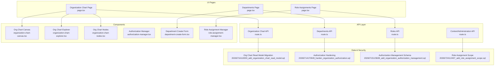
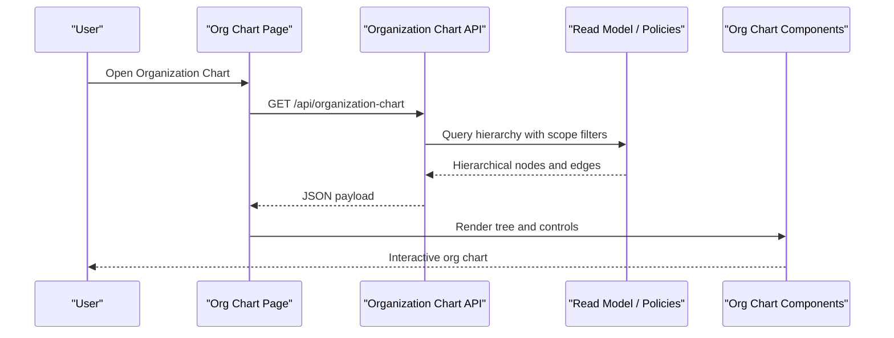
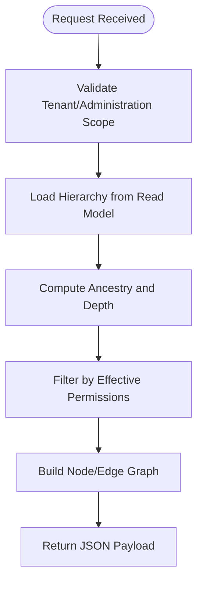
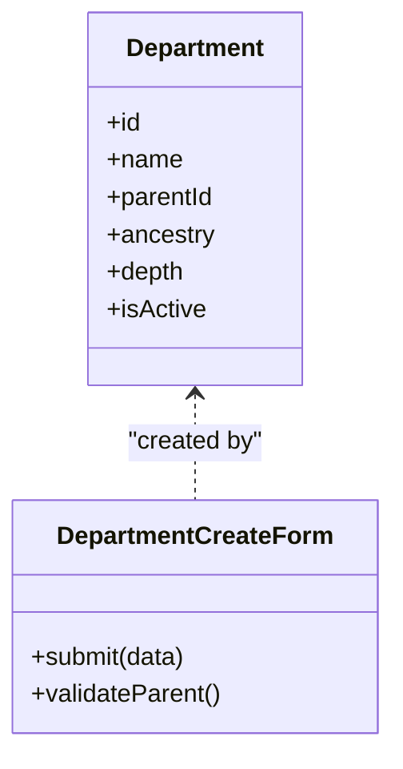
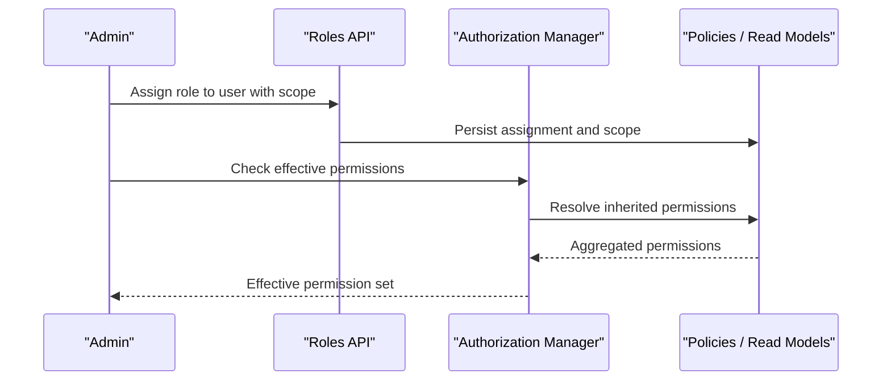
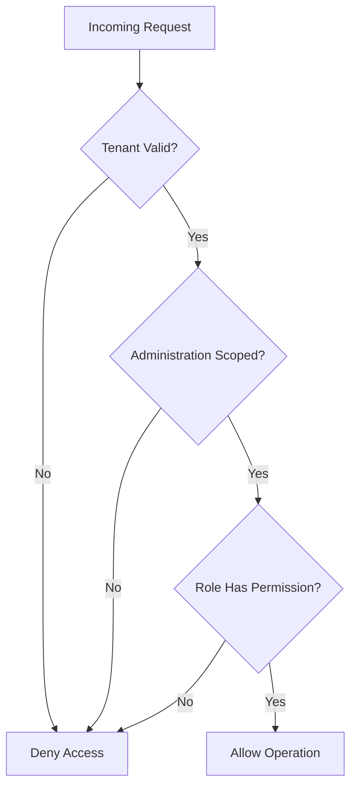
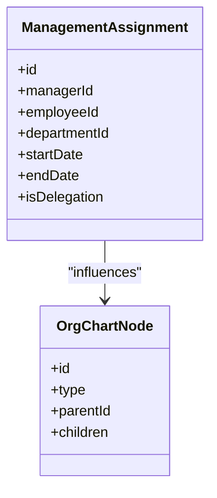
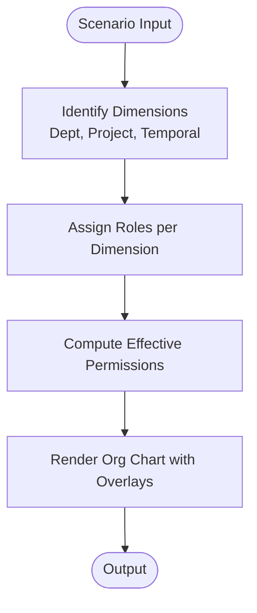
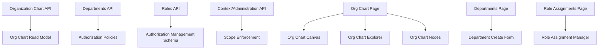

# Organizational Hierarchy Services

<cite>
**Referenced Files in This Document**
- [route.ts](file://apps/hr-suite/app/api/organization-chart/route.ts)
- [route.ts](file://apps/hr-suite/app/api/organization/route.ts)
- [route.ts](file://apps/hr-suite/app/api/departments/route.ts)
- [route.ts](file://apps/hr-suite/app/api/roles/route.ts)
- [route.ts](file://apps/hr-suite/app/api/context/route.ts)
- [route.ts](file://apps/hr-suite/app/api/context/administration/route.ts)
- [page.tsx](file://apps/hr-suite/app/(dashboard)/organization-chart/page.tsx)
- [page.tsx](file://apps/hr-suite/app/(dashboard)/departments/page.tsx)
- [page.tsx](file://apps/hr-suite/app/(dashboard)/role-assignments/page.tsx)
- [organization-chart-canvas.tsx](file://apps/hr-suite/components/organization-chart/organization-chart-canvas.tsx)
- [organization-chart-explorer.tsx](file://apps/hr-suite/components/organization-chart/organization-chart-explorer.tsx)
- [organization-chart-nodes.tsx](file://apps/hr-suite/components/organization-chart/organization-chart-nodes.tsx)
- [authorization-manager.tsx](file://apps/hr-suite/components/organization/authorization-manager.tsx)
- [department-create-form.tsx](file://apps/hr-suite/components/organization/department-create-form.tsx)
- [role-assignment-manager.tsx](file://apps/hr-suite/components/organization/role-assignment-manager.tsx)
- [20260714170949_harden_organization_authorization.sql](file://apps/hr-suite/supabase/migrations/20260714170949_harden_organization_authorization.sql)
- [20260715123639_add_organization_authorization_management.sql](file://apps/hr-suite/supabase/migrations/20260715123639_add_organization_authorization_management.sql)
- [20260716110000_add_organization_chart_read_model.sql](file://apps/hr-suite/supabase/migrations/20260716110000_add_organization_chart_read model.sql)
- [20260724112407_add_role_assignment_scope.sql](file://apps/hr-suite/supabase/migrations/20260724112407_add_role_assignment_scope.sql)
- [organization_chart.sql](file://apps/hr-suite/supabase/tests/organization_chart.sql)
- [organization_authorization_management.sql](file://apps/hr-suite/supabase/tests/organization_authorization_management.sql)
</cite>

## Table of Contents
1. [Introduction](#introduction)
2. [Project Structure](#project-structure)
3. [Core Components](#core-components)
4. [Architecture Overview](#architecture-overview)
5. [Detailed Component Analysis](#detailed-component-analysis)
6. [Dependency Analysis](#dependency-analysis)
7. [Performance Considerations](#performance-considerations)
8. [Troubleshooting Guide](#troubleshooting-guide)
9. [Conclusion](#conclusion)

## Introduction
This document explains the organizational hierarchy business logic services implemented in the HR Suite application. It covers department management, role assignment and permission inheritance, authorization calculations across organizational levels, organization chart generation, tree traversal algorithms, real-time updates, management assignments, reporting lines, delegation chains, and advanced scenarios such as matrix structures and cross-departmental collaborations. It also addresses performance optimization for large organizations, caching strategies for hierarchy queries, and consistency guarantees during structural changes.

## Project Structure
The organizational hierarchy features are implemented across API routes, UI pages, reusable components, and database migrations and tests:

- API layer exposes endpoints for organization chart data, departments, roles, and context (administration scoping).
- UI pages provide dashboards for organization chart visualization, department management, and role assignments.
- Reusable components render interactive org charts and manage authorization and role assignment workflows.
- Database schema and policies enforce security, isolation, and read-model optimizations for org chart queries.
- Tests validate behavior for org chart operations and authorization management.

**Diagram sources**
- [route.ts](file://apps/hr-suite/app/api/organization-chart/route.ts)
- [route.ts](file://apps/hr-suite/app/api/departments/route.ts)
- [route.ts](file://apps/hr-suite/app/api/roles/route.ts)
- [route.ts](file://apps/hr-suite/app/api/context/route.ts)
- [page.tsx](file://apps/hr-suite/app/(dashboard)/organization-chart/page.tsx)
- [page.tsx](file://apps/hr-suite/app/(dashboard)/departments/page.tsx)
- [page.tsx](file://apps/hr-suite/app/(dashboard)/role-assignments/page.tsx)
- [organization-chart-canvas.tsx](file://apps/hr-suite/components/organization-chart/organization-chart-canvas.tsx)
- [organization-chart-explorer.tsx](file://apps/hr-suite/components/organization-chart/organization-chart-explorer.tsx)
- [organization-chart-nodes.tsx](file://apps/hr-suite/components/organization-chart/organization-chart-nodes.tsx)
- [authorization-manager.tsx](file://apps/hr-suite/components/organization/authorization-manager.tsx)
- [department-create-form.tsx](file://apps/hr-suite/components/organization/department-create-form.tsx)
- [role-assignment-manager.tsx](file://apps/hr-suite/components/organization/role-assignment-manager.tsx)
- [20260716110000_add_organization_chart_read_model.sql](file://apps/hr-suite/supabase/migrations/20260716110000_add_organization_chart_read model.sql)
- [20260714170949_harden_organization_authorization.sql](file://apps/hr-suite/supabase/migrations/20260714170949_harden_organization_authorization.sql)
- [20260715123639_add_organization_authorization_management.sql](file://apps/hr-suite/supabase/migrations/20260715123639_add_organization_authorization_management.sql)
- [20260724112407_add_role_assignment_scope.sql](file://apps/hr-suite/supabase/migrations/20260724112407_add_role_assignment_scope.sql)

**Section sources**
- [route.ts](file://apps/hr-suite/app/api/organization-chart/route.ts)
- [route.ts](file://apps/hr-suite/app/api/departments/route.ts)
- [route.ts](file://apps/hr-suite/app/api/roles/route.ts)
- [route.ts](file://apps/hr-suite/app/api/context/route.ts)
- [page.tsx](file://apps/hr-suite/app/(dashboard)/organization-chart/page.tsx)
- [page.tsx](file://apps/hr-suite/app/(dashboard)/departments/page.tsx)
- [page.tsx](file://apps/hr-suite/app/(dashboard)/role-assignments/page.tsx)
- [organization-chart-canvas.tsx](file://apps/hr-suite/components/organization-chart/organization-chart-canvas.tsx)
- [organization-chart-explorer.tsx](file://apps/hr-suite/components/organization-chart/organization-chart-explorer.tsx)
- [organization-chart-nodes.tsx](file://apps/hr-suite/components/organization-chart/organization-chart-nodes.tsx)
- [authorization-manager.tsx](file://apps/hr-suite/components/organization/authorization-manager.tsx)
- [department-create-form.tsx](file://apps/hr-suite/components/organization/department-create-form.tsx)
- [role-assignment-manager.tsx](file://apps/hr-suite/components/organization/role-assignment-manager.tsx)
- [20260716110000_add_organization_chart_read_model.sql](file://apps/hr-suite/supabase/migrations/20260716110000_add_organization_chart_read model.sql)
- [20260714170949_harden_organization_authorization.sql](file://apps/hr-suite/supabase/migrations/20260714170949_harden_organization_authorization.sql)
- [20260715123639_add_organization_authorization_management.sql](file://apps/hr-suite/supabase/migrations/20260715123639_add_organization_authorization_management.sql)
- [20260724112407_add_role_assignment_scope.sql](file://apps/hr-suite/supabase/migrations/20260724112407_add_role_assignment_scope.sql)

## Core Components
- Organization Chart API: Provides hierarchical data for rendering org charts, including nodes, edges, and metadata required for visualization and interaction.
- Departments API: Supports creation, restructuring, and hierarchical relationships among departments.
- Roles API: Manages roles and permissions, enabling assignment to users within organizational scopes.
- Context/Administration API: Enforces multi-tenancy and administration boundaries for all organization-related operations.
- Org Chart UI Components: Render interactive trees, support exploration, and display node details.
- Authorization Manager: Centralizes permission checks and displays effective permissions based on roles and scope.
- Department Create Form: Guides users through creating new departments and assigning parent relationships.
- Role Assignment Manager: Handles role-to-user assignments with scope constraints.

Key responsibilities:
- Build and serve a consistent view of the organization hierarchy.
- Enforce authorization at multiple layers (tenant, administration, department, role).
- Provide efficient read paths for org chart queries via optimized read models.
- Support complex scenarios like matrix structures and temporary assignments through flexible role scoping.

**Section sources**
- [route.ts](file://apps/hr-suite/app/api/organization-chart/route.ts)
- [route.ts](file://apps/hr-suite/app/api/departments/route.ts)
- [route.ts](file://apps/hr-suite/app/api/roles/route.ts)
- [route.ts](file://apps/hr-suite/app/api/context/route.ts)
- [organization-chart-canvas.tsx](file://apps/hr-suite/components/organization-chart/organization-chart-canvas.tsx)
- [organization-chart-explorer.tsx](file://apps/hr-suite/components/organization-chart/organization-chart-explorer.tsx)
- [organization-chart-nodes.tsx](file://apps/hr-suite/components/organization-chart/organization-chart-nodes.tsx)
- [authorization-manager.tsx](file://apps/hr-suite/components/organization/authorization-manager.tsx)
- [department-create-form.tsx](file://apps/hr-suite/components/organization/department-create-form.tsx)
- [role-assignment-manager.tsx](file://apps/hr-suite/components/organization/role-assignment-manager.tsx)

## Architecture Overview
The system follows a layered architecture:
- Presentation layer: Next.js pages and React components for user interactions.
- API layer: Route handlers that orchestrate requests, apply authorization, and query/read models.
- Data layer: Supabase-backed relational schema with RLS policies and read model tables for performance.
- Security layer: Multi-tenancy and administration scoping enforced via context and policies.

**Diagram sources**
- [route.ts](file://apps/hr-suite/app/api/organization-chart/route.ts)
- [page.tsx](file://apps/hr-suite/app/(dashboard)/organization-chart/page.tsx)
- [organization-chart-canvas.tsx](file://apps/hr-suite/components/organization-chart/organization-chart-canvas.tsx)
- [organization-chart-explorer.tsx](file://apps/hr-suite/components/organization-chart/organization-chart-explorer.tsx)
- [organization-chart-nodes.tsx](file://apps/hr-suite/components/organization-chart/organization-chart-nodes.tsx)

## Detailed Component Analysis

### Organization Chart Generation and Tree Traversal
- The organization chart API constructs a hierarchical structure suitable for visualization. It aggregates nodes (departments, positions, employees) and edges (parent-child relationships), applying tenant and administration scoping.
- Tree traversal is performed server-side to compute depth, ancestry, and descendant sets efficiently using optimized read models.
- Client components render the tree interactively, supporting zoom, pan, and drill-down into sub-trees.

**Diagram sources**
- [route.ts](file://apps/hr-suite/app/api/organization-chart/route.ts)
- [20260716110000_add_organization_chart_read_model.sql](file://apps/hr-suite/supabase/migrations/20260716110000_add_organization_chart_read model.sql)

**Section sources**
- [route.ts](file://apps/hr-suite/app/api/organization-chart/route.ts)
- [organization-chart-canvas.tsx](file://apps/hr-suite/components/organization-chart/organization-chart-canvas.tsx)
- [organization-chart-explorer.tsx](file://apps/hr-suite/components/organization-chart/organization-chart-explorer.tsx)
- [organization-chart-nodes.tsx](file://apps/hr-suite/components/organization-chart/organization-chart-nodes.tsx)
- [20260716110000_add_organization_chart_read_model.sql](file://apps/hr-suite/supabase/migrations/20260716110000_add_organization_chart_read model.sql)

### Department Management: Creation, Restructuring, and Relationships
- Departments can be created with a parent reference to establish hierarchical relationships.
- Restructuring involves updating parent pointers and recalculating derived fields (ancestry, depth).
- Constraints ensure no cycles and maintain valid hierarchies.

**Diagram sources**
- [department-create-form.tsx](file://apps/hr-suite/components/organization/department-create-form.tsx)
- [route.ts](file://apps/hr-suite/app/api/departments/route.ts)

**Section sources**
- [route.ts](file://apps/hr-suite/app/api/departments/route.ts)
- [department-create-form.tsx](file://apps/hr-suite/components/organization/department-create-form.tsx)

### Role Assignment System and Permission Inheritance
- Roles define permissions; assignments bind roles to users within specific organizational scopes (e.g., department or administration).
- Permission inheritance flows from higher-level scopes down to child scopes unless explicitly overridden.
- Effective permissions are computed by aggregating role-based permissions across applicable scopes.

**Diagram sources**
- [route.ts](file://apps/hr-suite/app/api/roles/route.ts)
- [authorization-manager.tsx](file://apps/hr-suite/components/organization/authorization-manager.tsx)
- [20260715123639_add_organization_authorization_management.sql](file://apps/hr-suite/supabase/migrations/20260715123639_add_organization_authorization_management.sql)
- [20260724112407_add_role_assignment_scope.sql](file://apps/hr-suite/supabase/migrations/20260724112407_add_role_assignment_scope.sql)

**Section sources**
- [route.ts](file://apps/hr-suite/app/api/roles/route.ts)
- [authorization-manager.tsx](file://apps/hr-suite/components/organization/authorization-manager.tsx)
- [role-assignment-manager.tsx](file://apps/hr-suite/components/organization/role-assignment-manager.tsx)
- [20260715123639_add_organization_authorization_management.sql](file://apps/hr-suite/supabase/migrations/20260715123639_add_organization_authorization_management.sql)
- [20260724112407_add_role_assignment_scope.sql](file://apps/hr-suite/supabase/migrations/20260724112407_add_role_assignment_scope.sql)

### Authorization Calculations Across Organizational Levels
- Authorization is enforced at multiple layers: tenant isolation, administration boundaries, department scope, and role-based permissions.
- Policies restrict access to sensitive data and operations based on current context and user roles.
- Effective permissions are calculated by combining explicit role grants with inherited permissions from parent scopes.

**Diagram sources**
- [20260714170949_harden_organization_authorization.sql](file://apps/hr-suite/supabase/migrations/20260714170949_harden_organization_authorization.sql)
- [route.ts](file://apps/hr-suite/app/api/context/route.ts)

**Section sources**
- [20260714170949_harden_organization_authorization.sql](file://apps/hr-suite/supabase/migrations/20260714170949_harden_organization_authorization.sql)
- [route.ts](file://apps/hr-suite/app/api/context/route.ts)
- [authorization-manager.tsx](file://apps/hr-suite/components/organization/authorization-manager.tsx)

### Management Assignments, Reporting Lines, and Delegation Chains
- Management assignments link managers to employees or departments, establishing reporting lines.
- Delegation chains allow temporary or conditional authority transfer along reporting lines.
- These relationships influence authorization decisions and org chart rendering.

**Diagram sources**
- [route.ts](file://apps/hr-suite/app/api/organization/route.ts)
- [organization-chart-nodes.tsx](file://apps/hr-suite/components/organization-chart/organization-chart-nodes.tsx)

**Section sources**
- [route.ts](file://apps/hr-suite/app/api/organization/route.ts)
- [organization-chart-nodes.tsx](file://apps/hr-suite/components/organization-chart/organization-chart-nodes.tsx)

### Complex Organizational Scenarios
- Matrix Structures: Users may belong to multiple departments or projects simultaneously; role assignments scoped per matrix dimension enable fine-grained permissions.
- Temporary Assignments: Time-bound management assignments and delegations are supported via start/end dates and active flags.
- Cross-Departmental Collaborations: Shared roles and scoped permissions facilitate collaboration without compromising isolation.

[No sources needed since this diagram shows conceptual workflow, not actual code structure]

**Section sources**
- [20260724112407_add_role_assignment_scope.sql](file://apps/hr-suite/supabase/migrations/20260724112407_add_role_assignment_scope.sql)
- [role-assignment-manager.tsx](file://apps/hr-suite/components/organization/role-assignment-manager.tsx)

## Dependency Analysis
The following diagram illustrates key dependencies between API routes, UI components, and database migrations:

**Diagram sources**
- [route.ts](file://apps/hr-suite/app/api/organization-chart/route.ts)
- [route.ts](file://apps/hr-suite/app/api/departments/route.ts)
- [route.ts](file://apps/hr-suite/app/api/roles/route.ts)
- [route.ts](file://apps/hr-suite/app/api/context/route.ts)
- [page.tsx](file://apps/hr-suite/app/(dashboard)/organization-chart/page.tsx)
- [page.tsx](file://apps/hr-suite/app/(dashboard)/departments/page.tsx)
- [page.tsx](file://apps/hr-suite/app/(dashboard)/role-assignments/page.tsx)
- [organization-chart-canvas.tsx](file://apps/hr-suite/components/organization-chart/organization-chart-canvas.tsx)
- [organization-chart-explorer.tsx](file://apps/hr-suite/components/organization-chart/organization-chart-explorer.tsx)
- [organization-chart-nodes.tsx](file://apps/hr-suite/components/organization-chart/organization-chart-nodes.tsx)
- [department-create-form.tsx](file://apps/hr-suite/components/organization/department-create-form.tsx)
- [role-assignment-manager.tsx](file://apps/hr-suite/components/organization/role-assignment-manager.tsx)
- [20260716110000_add_organization_chart_read_model.sql](file://apps/hr-suite/supabase/migrations/20260716110000_add_organization_chart_read model.sql)
- [20260714170949_harden_organization_authorization.sql](file://apps/hr-suite/supabase/migrations/20260714170949_harden_organization_authorization.sql)
- [20260715123639_add_organization_authorization_management.sql](file://apps/hr-suite/supabase/migrations/20260715123639_add_organization_authorization_management.sql)

**Section sources**
- [route.ts](file://apps/hr-suite/app/api/organization-chart/route.ts)
- [route.ts](file://apps/hr-suite/app/api/departments/route.ts)
- [route.ts](file://apps/hr-suite/app/api/roles/route.ts)
- [route.ts](file://apps/hr-suite/app/api/context/route.ts)
- [page.tsx](file://apps/hr-suite/app/(dashboard)/organization-chart/page.tsx)
- [page.tsx](file://apps/hr-suite/app/(dashboard)/departments/page.tsx)
- [page.tsx](file://apps/hr-suite/app/(dashboard)/role-assignments/page.tsx)
- [organization-chart-canvas.tsx](file://apps/hr-suite/components/organization-chart/organization-chart-canvas.tsx)
- [organization-chart-explorer.tsx](file://apps/hr-suite/components/organization-chart/organization-chart-explorer.tsx)
- [organization-chart-nodes.tsx](file://apps/hr-suite/components/organization-chart/organization-chart-nodes.tsx)
- [department-create-form.tsx](file://apps/hr-suite/components/organization/department-create-form.tsx)
- [role-assignment-manager.tsx](file://apps/hr-suite/components/organization/role-assignment-manager.tsx)
- [20260716110000_add_organization_chart_read_model.sql](file://apps/hr-suite/supabase/migrations/20260716110000_add_organization_chart_read model.sql)
- [20260714170949_harden_organization_authorization.sql](file://apps/hr-suite/supabase/migrations/20260714170949_harden_organization_authorization.sql)
- [20260715123639_add_organization_authorization_management.sql](file://apps/hr-suite/supabase/migrations/20260715123639_add_organization_authorization_management.sql)

## Performance Considerations
- Read Model Optimization: Dedicated org chart read models reduce join complexity and improve query latency for large hierarchies.
- Indexing: Foreign keys and scope columns are indexed to accelerate filtering by tenant, administration, and department.
- Caching Strategy: Cache org chart payloads keyed by tenant, administration, and user scope; invalidate on structural changes (department restructure, role assignment updates).
- Pagination and Lazy Loading: For very large orgs, implement pagination and lazy-load subtrees to minimize initial payload size.
- Consistency Guarantees: Use transactions for structural changes and publish events to update read models atomically; employ optimistic concurrency control where appropriate.

[No sources needed since this section provides general guidance]

## Troubleshooting Guide
Common issues and resolutions:
- Authorization Denials: Verify tenant and administration context; ensure role assignments include correct scopes.
- Missing Org Chart Nodes: Confirm read model synchronization after structural changes; check policy enforcement logs.
- Cycle Detection Errors: Validate parent references when restructuring departments; ensure no circular dependencies.
- Performance Degradation: Review indexes and query plans; consider adding cache invalidation hooks.

Relevant validation and tests:
- Organization chart behavior and edge cases are validated in dedicated test suites.
- Authorization management operations are covered by acceptance tests.

**Section sources**
- [organization_chart.sql](file://apps/hr-suite/supabase/tests/organization_chart.sql)
- [organization_authorization_management.sql](file://apps/hr-suite/supabase/tests/organization_authorization_management.sql)

## Conclusion
The organizational hierarchy services provide a robust foundation for managing departments, roles, and authorizations across multi-tenant environments. By leveraging optimized read models, strict policy enforcement, and flexible role scoping, the system supports complex organizational structures while maintaining performance and consistency. The UI components deliver an interactive experience for exploring and managing the organization chart, with clear pathways for extending capabilities to accommodate evolving business needs.