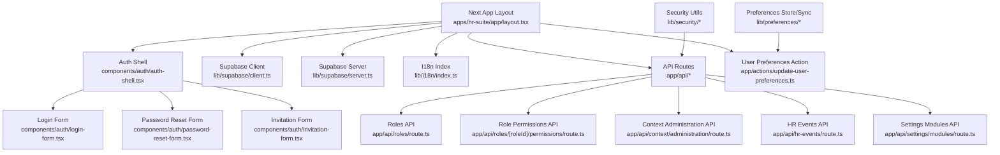
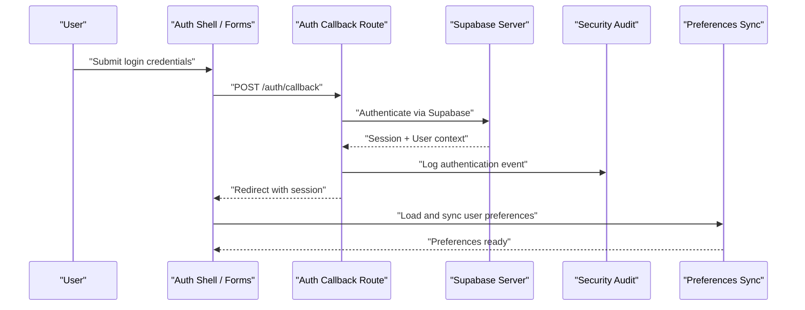
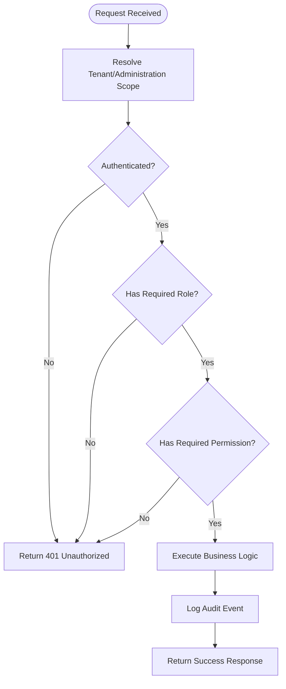
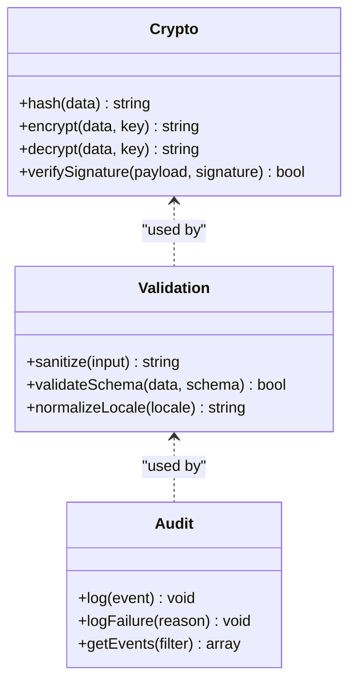
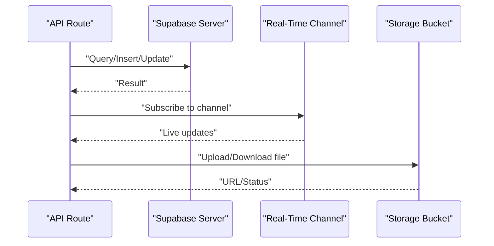
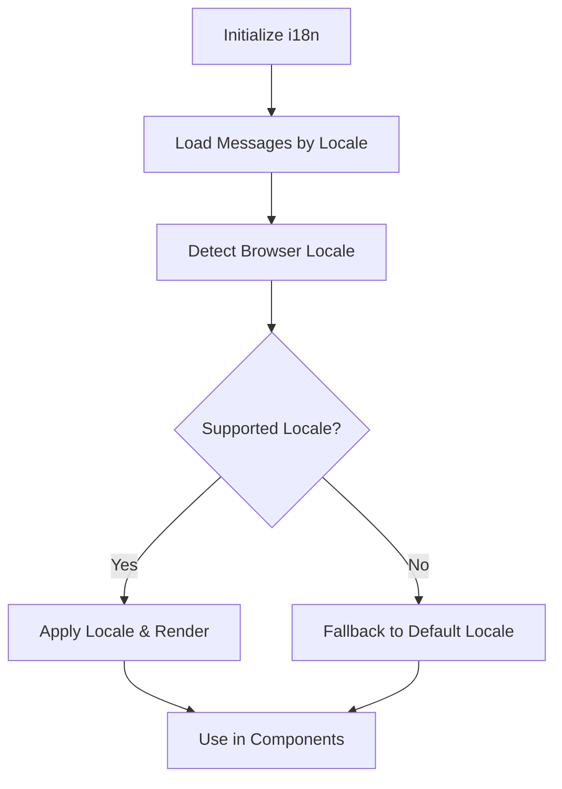
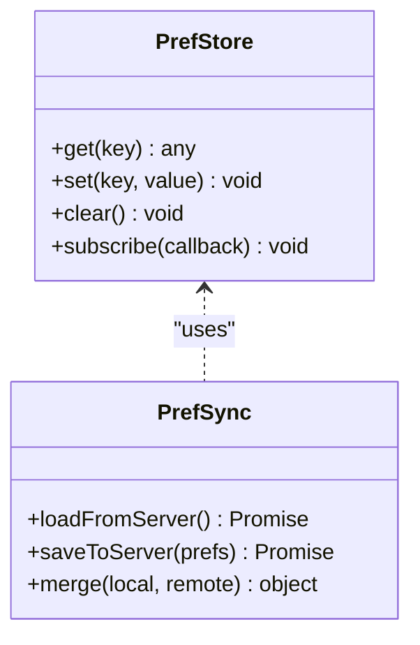
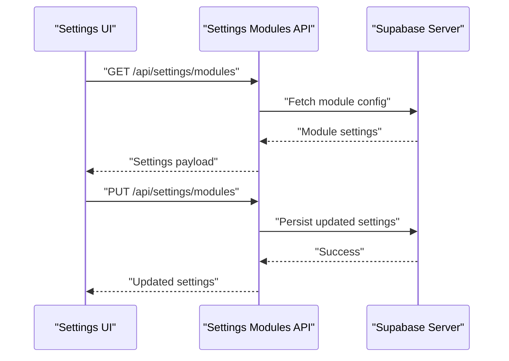
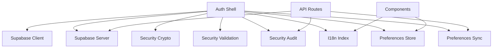

# Shared Utilities and Services

<cite>
**Referenced Files in This Document**
- [layout.tsx](file://apps/hr-suite/app/layout.tsx)
- [page.tsx](file://apps/hr-suite/app/page.tsx)
- [auth-shell.tsx](file://apps/hr-suite/components/auth/auth-shell.tsx)
- [login-form.tsx](file://apps/hr-suite/components/auth/login-form.tsx)
- [password-reset-form.tsx](file://apps/hr-suite/components/auth/password-reset-form.tsx)
- [invitation-form.tsx](file://apps/hr-suite/components/auth/invitation-form.tsx)
- [callback/route.ts](file://apps/hr-suite/app/auth/callback/route.ts)
- [signout/route.ts](file://apps/hr-suite/app/auth/signout/route.ts)
- [reset-password/actions.ts](file://apps/hr-suite/app/auth/reset-password/actions.ts)
- [update-user-preferences.ts](file://apps/hr-suite/app/actions/update-user-preferences.ts)
- [i18n/index.ts](file://apps/hr-suite/lib/i18n/index.ts)
- [supabase/client.ts](file://apps/hr-suite/lib/supabase/client.ts)
- [supabase/server.ts](file://apps/hr-suite/lib/supabase/server.ts)
- [supabase/middleware.ts](file://apps/hr-suite/lib/supabase/middleware.ts)
- [security/crypto.ts](file://apps/hr-suite/lib/security/crypto.ts)
- [security/validation.ts](file://apps/hr-suite/lib/security/validation.ts)
- [security/audit.ts](file://apps/hr-suite/lib/security/audit.ts)
- [preferences/store.ts](file://apps/hr-suite/lib/preferences/store.ts)
- [preferences/sync.ts](file://apps/hr-suite/lib/preferences/sync.ts)
- [context/administration/route.ts](file://apps/hr-suite/app/api/context/administration/route.ts)
- [roles/route.ts](file://apps/hr-suite/app/api/roles/route.ts)
- [roles/[roleId]/permissions/route.ts](file://apps/hr-suite/app/api/roles/[roleId]/permissions/route.ts)
- [organization/authorization-manager.tsx](file://apps/hr-suite/components/organization/authorization-manager.tsx)
- [hr-events/route.ts](file://apps/hr-suite/app/api/hr-events/route.ts)
- [settings/modules/route.ts](file://apps/hr-suite/app/api/settings/modules/route.ts)
</cite>

## Table of Contents
1. [Introduction](#introduction)
2. [Project Structure](#project-structure)
3. [Core Components](#core-components)
4. [Architecture Overview](#architecture-overview)
5. [Detailed Component Analysis](#detailed-component-analysis)
6. [Dependency Analysis](#dependency-analysis)
7. [Performance Considerations](#performance-considerations)
8. [Troubleshooting Guide](#troubleshooting-guide)
9. [Conclusion](#conclusion)
10. [Appendices](#appendices)

## Introduction
This document provides comprehensive documentation for LiquidHR’s shared utilities and cross-cutting services. It focuses on authentication and authorization (including RBAC, tenant isolation, and permission checks), security utilities (encryption, input sanitization, audit logging), Supabase integration (database connections, real-time subscriptions, storage operations), internationalization (multi-language support and localization patterns), user preferences management (storage, synchronization, configuration handling), and service composition patterns with dependency injection approaches used across the application.

## Project Structure
LiquidHR organizes shared functionality under the apps/hr-suite/lib directory, with feature-specific subdirectories such as auth, security, supabase, i18n, and preferences. API routes live under apps/hr-suite/app/api, while UI components are under apps/hr-suite/components. The Next.js app layout and pages orchestrate global providers and middleware that wire these services together.

**Diagram sources**
- [layout.tsx](file://apps/hr-suite/app/layout.tsx)
- [auth-shell.tsx](file://apps/hr-suite/components/auth/auth-shell.tsx)
- [client.ts](file://apps/hr-suite/lib/supabase/client.ts)
- [server.ts](file://apps/hr-suite/lib/supabase/server.ts)
- [index.ts](file://apps/hr-suite/lib/i18n/index.ts)
- [login-form.tsx](file://apps/hr-suite/components/auth/login-form.tsx)
- [password-reset-form.tsx](file://apps/hr-suite/components/auth/password-reset-form.tsx)
- [invitation-form.tsx](file://apps/hr-suite/components/auth/invitation-form.tsx)
- [route.ts](file://apps/hr-suite/app/api/roles/route.ts)
- [route.ts](file://apps/hr-suite/app/api/roles/[roleId]/permissions/route.ts)
- [route.ts](file://apps/hr-suite/app/api/context/administration/route.ts)
- [route.ts](file://apps/hr-suite/app/api/hr-events/route.ts)
- [route.ts](file://apps/hr-suite/app/api/settings/modules/route.ts)
- [update-user-preferences.ts](file://apps/hr-suite/app/actions/update-user-preferences.ts)

**Section sources**
- [layout.tsx](file://apps/hr-suite/app/layout.tsx)
- [page.tsx](file://apps/hr-suite/app/page.tsx)

## Core Components
- Authentication shell and forms: Provide login, password reset, and invitation acceptance flows, integrating with Supabase Auth and session handling.
- Supabase client/server modules: Centralize database connections, real-time subscriptions, and storage operations; server module is used in API routes and server-side logic.
- Security utilities: Implement encryption helpers, input validation/sanitization, and audit logging to ensure data protection and compliance.
- Internationalization: Centralized locale management and message loading for multi-language support.
- User preferences: Local store and sync mechanisms to persist and synchronize per-user settings across devices and sessions.

**Section sources**
- [auth-shell.tsx](file://apps/hr-suite/components/auth/auth-shell.tsx)
- [login-form.tsx](file://apps/hr-suite/components/auth/login-form.tsx)
- [password-reset-form.tsx](file://apps/hr-suite/components/auth/password-reset-form.tsx)
- [invitation-form.tsx](file://apps/hr-suite/components/auth/invitation-form.tsx)
- [client.ts](file://apps/hr-suite/lib/supabase/client.ts)
- [server.ts](file://apps/hr-suite/lib/supabase/server.ts)
- [crypto.ts](file://apps/hr-suite/lib/security/crypto.ts)
- [validation.ts](file://apps/hr-suite/lib/security/validation.ts)
- [audit.ts](file://apps/hr-suite/lib/security/audit.ts)
- [index.ts](file://apps/hr-suite/lib/i18n/index.ts)
- [store.ts](file://apps/hr-suite/lib/preferences/store.ts)
- [sync.ts](file://apps/hr-suite/lib/preferences/sync.ts)

## Architecture Overview
The system uses a layered architecture:
- Presentation layer: Next.js pages and components render UI and handle user interactions.
- Service layer: API routes implement business logic, enforce RBAC, and interact with Supabase.
- Data layer: Supabase client/server modules manage DB connections, real-time subscriptions, and storage.
- Cross-cutting concerns: Security utilities, i18n, and preferences are injected into both presentation and service layers.

**Diagram sources**
- [auth-shell.tsx](file://apps/hr-suite/components/auth/auth-shell.tsx)
- [login-form.tsx](file://apps/hr-suite/components/auth/login-form.tsx)
- [callback/route.ts](file://apps/hr-suite/app/auth/callback/route.ts)
- [server.ts](file://apps/hr-suite/lib/supabase/server.ts)
- [audit.ts](file://apps/hr-suite/lib/security/audit.ts)
- [sync.ts](file://apps/hr-suite/lib/preferences/sync.ts)

## Detailed Component Analysis

### Authentication and Authorization (RBAC, Tenant Isolation, Permission Checking)
- Authentication flow:
  - Login form submits credentials to the callback route, which authenticates via Supabase and establishes a session.
  - Sign-out route clears sessions securely.
  - Password reset actions guide users through secure recovery flows.
- RBAC and permissions:
  - Roles API endpoints manage roles and their permissions.
  - Role permissions endpoint handles CRUD operations scoped by role ID.
  - Context administration API resolves current tenant and administration scope for requests.
- Tenant isolation:
  - Middleware enforces tenant boundaries and ensures requests are scoped to the correct administration.
  - Database policies (via Supabase RLS) isolate data at the tenant level.
- Permission checking:
  - API routes validate user roles and permissions before executing mutations or sensitive reads.
  - UI components like the organization authorization manager reflect permissions to control visibility and actions.

**Diagram sources**
- [context/administration/route.ts](file://apps/hr-suite/app/api/context/administration/route.ts)
- [roles/route.ts](file://apps/hr-suite/app/api/roles/route.ts)
- [roles/[roleId]/permissions/route.ts](file://apps/hr-suite/app/api/roles/[roleId]/permissions/route.ts)
- [middleware.ts](file://apps/hr-suite/lib/supabase/middleware.ts)
- [audit.ts](file://apps/hr-suite/lib/security/audit.ts)

**Section sources**
- [callback/route.ts](file://apps/hr-suite/app/auth/callback/route.ts)
- [signout/route.ts](file://apps/hr-suite/app/auth/signout/route.ts)
- [reset-password/actions.ts](file://apps/hr-suite/app/auth/reset-password/actions.ts)
- [roles/route.ts](file://apps/hr-suite/app/api/roles/route.ts)
- [roles/[roleId]/permissions/route.ts](file://apps/hr-suite/app/api/roles/[roleId]/permissions/route.ts)
- [context/administration/route.ts](file://apps/hr-suite/app/api/context/administration/route.ts)
- [authorization-manager.tsx](file://apps/hr-suite/components/organization/authorization-manager.tsx)

### Security Utilities (Encryption, Input Sanitization, Audit Logging)
- Encryption:
  - Crypto utilities provide hashing, symmetric encryption, and secure key management helpers.
- Input sanitization:
  - Validation utilities sanitize and validate inputs to prevent injection and malformed data.
- Audit logging:
  - Audit utilities record security-relevant events (authentication, authorization failures, sensitive operations).

**Diagram sources**
- [crypto.ts](file://apps/hr-suite/lib/security/crypto.ts)
- [validation.ts](file://apps/hr-suite/lib/security/validation.ts)
- [audit.ts](file://apps/hr-suite/lib/security/audit.ts)

**Section sources**
- [crypto.ts](file://apps/hr-suite/lib/security/crypto.ts)
- [validation.ts](file://apps/hr-suite/lib/security/validation.ts)
- [audit.ts](file://apps/hr-suite/lib/security/audit.ts)

### Supabase Integration (Database Connections, Real-Time Subscriptions, Storage Operations)
- Client module:
  - Initializes Supabase client for browser usage, including real-time subscriptions and storage access.
- Server module:
  - Provides server-side Supabase client for API routes, ensuring secure server-to-database communication.
- Middleware:
  - Enforces authentication and tenant scoping for incoming requests.
- Real-time subscriptions:
  - Used for live updates (e.g., HR events, reminders, chat messages).
- Storage operations:
  - Uploads and retrieval for documents, avatars, and other assets.

**Diagram sources**
- [client.ts](file://apps/hr-suite/lib/supabase/client.ts)
- [server.ts](file://apps/hr-suite/lib/supabase/server.ts)
- [middleware.ts](file://apps/hr-suite/lib/supabase/middleware.ts)
- [hr-events/route.ts](file://apps/hr-suite/app/api/hr-events/route.ts)

**Section sources**
- [client.ts](file://apps/hr-suite/lib/supabase/client.ts)
- [server.ts](file://apps/hr-suite/lib/supabase/server.ts)
- [middleware.ts](file://apps/hr-suite/lib/supabase/middleware.ts)
- [hr-events/route.ts](file://apps/hr-suite/app/api/hr-events/route.ts)

### Internationalization (Multi-Language Support and Localization Patterns)
- Centralized i18n index manages locales, message loading, and fallback strategies.
- Messages are organized by language and feature area under apps/hr-suite/messages.
- UI components consume i18n hooks to render localized text dynamically.

**Diagram sources**
- [index.ts](file://apps/hr-suite/lib/i18n/index.ts)

**Section sources**
- [index.ts](file://apps/hr-suite/lib/i18n/index.ts)

### User Preferences Management (Storage, Synchronization, Configuration Handling)
- Store module:
  - Manages local storage of user preferences with type safety and defaults.
- Sync module:
  - Synchronizes preferences with server state, handling conflicts and offline scenarios.
- Actions:
  - Update user preferences action integrates with UI and backend APIs.

**Diagram sources**
- [store.ts](file://apps/hr-suite/lib/preferences/store.ts)
- [sync.ts](file://apps/hr-suite/lib/preferences/sync.ts)
- [update-user-preferences.ts](file://apps/hr-suite/app/actions/update-user-preferences.ts)

**Section sources**
- [store.ts](file://apps/hr-suite/lib/preferences/store.ts)
- [sync.ts](file://apps/hr-suite/lib/preferences/sync.ts)
- [update-user-preferences.ts](file://apps/hr-suite/app/actions/update-user-preferences.ts)

### Settings Synchronization and Configuration Handling
- Settings modules API exposes endpoints to manage feature toggles and configuration values.
- UI components read and update settings through these endpoints, ensuring consistency across tenants.

**Diagram sources**
- [settings/modules/route.ts](file://apps/hr-suite/app/api/settings/modules/route.ts)
- [server.ts](file://apps/hr-suite/lib/supabase/server.ts)

**Section sources**
- [settings/modules/route.ts](file://apps/hr-suite/app/api/settings/modules/route.ts)

## Dependency Analysis
Shared utilities are composed through dependency injection patterns:
- Supabase client/server modules are injected into API routes and components.
- Security utilities are used across authentication, authorization, and data mutation flows.
- i18n is provided globally via layout and consumed by components.
- Preferences store and sync are integrated into actions and UI state management.

**Diagram sources**
- [auth-shell.tsx](file://apps/hr-suite/components/auth/auth-shell.tsx)
- [client.ts](file://apps/hr-suite/lib/supabase/client.ts)
- [server.ts](file://apps/hr-suite/lib/supabase/server.ts)
- [crypto.ts](file://apps/hr-suite/lib/security/crypto.ts)
- [validation.ts](file://apps/hr-suite/lib/security/validation.ts)
- [audit.ts](file://apps/hr-suite/lib/security/audit.ts)
- [index.ts](file://apps/hr-suite/lib/i18n/index.ts)
- [store.ts](file://apps/hr-suite/lib/preferences/store.ts)
- [sync.ts](file://apps/hr-suite/lib/preferences/sync.ts)

**Section sources**
- [auth-shell.tsx](file://apps/hr-suite/components/auth/auth-shell.tsx)
- [client.ts](file://apps/hr-suite/lib/supabase/client.ts)
- [server.ts](file://apps/hr-suite/lib/supabase/server.ts)
- [crypto.ts](file://apps/hr-suite/lib/security/crypto.ts)
- [validation.ts](file://apps/hr-suite/lib/security/validation.ts)
- [audit.ts](file://apps/hr-suite/lib/security/audit.ts)
- [index.ts](file://apps/hr-suite/lib/i18n/index.ts)
- [store.ts](file://apps/hr-suite/lib/preferences/store.ts)
- [sync.ts](file://apps/hr-suite/lib/preferences/sync.ts)

## Performance Considerations
- Minimize re-renders by memoizing i18n keys and preference selectors.
- Use Supabase real-time channels judiciously to avoid excessive network traffic.
- Cache frequently accessed settings and module configurations locally with stale-while-revalidate patterns.
- Debounce preference updates to reduce server load during rapid user interactions.

[No sources needed since this section provides general guidance]

## Troubleshooting Guide
- Authentication failures:
  - Verify Supabase credentials and session handling in callback and sign-out routes.
  - Check audit logs for failed authentication events and reasons.
- Authorization errors:
  - Ensure tenant resolution middleware is invoked and scopes are correctly set.
  - Validate role and permission mappings in roles and permissions APIs.
- Supabase connectivity issues:
  - Confirm client/server initialization and environment variables.
  - Inspect real-time subscription errors and storage upload/download statuses.
- Preferences sync conflicts:
  - Review merge strategies in preferences sync module.
  - Validate local vs remote timestamps and conflict resolution rules.

**Section sources**
- [callback/route.ts](file://apps/hr-suite/app/auth/callback/route.ts)
- [signout/route.ts](file://apps/hr-suite/app/auth/signout/route.ts)
- [audit.ts](file://apps/hr-suite/lib/security/audit.ts)
- [middleware.ts](file://apps/hr-suite/lib/supabase/middleware.ts)
- [roles/route.ts](file://apps/hr-suite/app/api/roles/route.ts)
- [roles/[roleId]/permissions/route.ts](file://apps/hr-suite/app/api/roles/[roleId]/permissions/route.ts)
- [client.ts](file://apps/hr-suite/lib/supabase/client.ts)
- [server.ts](file://apps/hr-suite/lib/supabase/server.ts)
- [sync.ts](file://apps/hr-suite/lib/preferences/sync.ts)

## Conclusion
LiquidHR’s shared utilities and cross-cutting services provide a robust foundation for authentication, authorization, security, Supabase integration, internationalization, and user preferences management. By adhering to clear architectural patterns, dependency injection, and centralized utilities, the application maintains consistency, security, and scalability across features and tenants.

[No sources needed since this section summarizes without analyzing specific files]

## Appendices
- Example utility function paths:
  - Encryption: [crypto.ts](file://apps/hr-suite/lib/security/crypto.ts)
  - Validation: [validation.ts](file://apps/hr-suite/lib/security/validation.ts)
  - Audit logging: [audit.ts](file://apps/hr-suite/lib/security/audit.ts)
- Service composition examples:
  - Supabase client/server usage in API routes: [server.ts](file://apps/hr-suite/lib/supabase/server.ts)
  - Preferences store and sync integration: [store.ts](file://apps/hr-suite/lib/preferences/store.ts), [sync.ts](file://apps/hr-suite/lib/preferences/sync.ts)
- Dependency injection patterns:
  - Global i18n provider in layout: [layout.tsx](file://apps/hr-suite/app/layout.tsx)
  - Auth shell injecting services into components: [auth-shell.tsx](file://apps/hr-suite/components/auth/auth-shell.tsx)