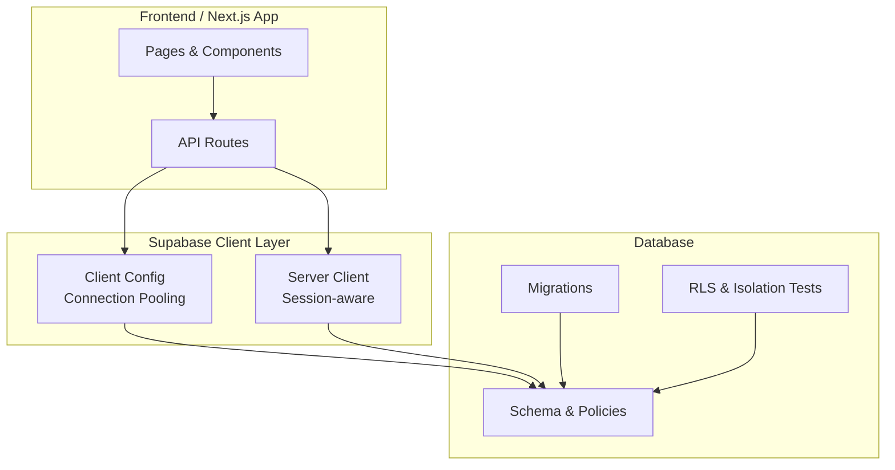
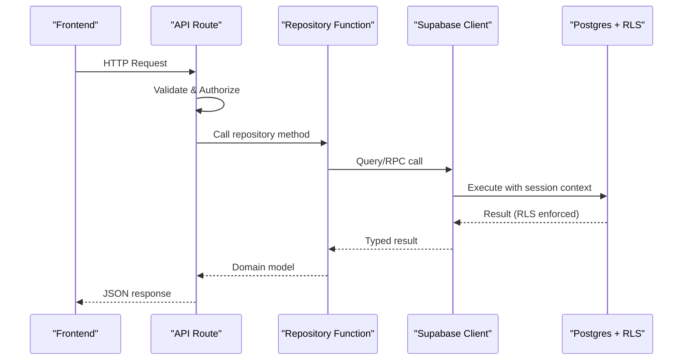
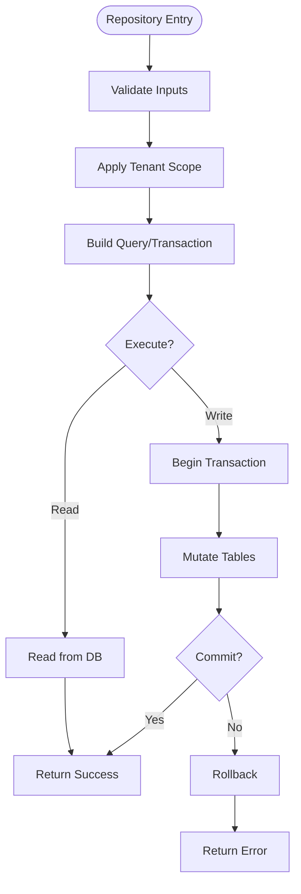
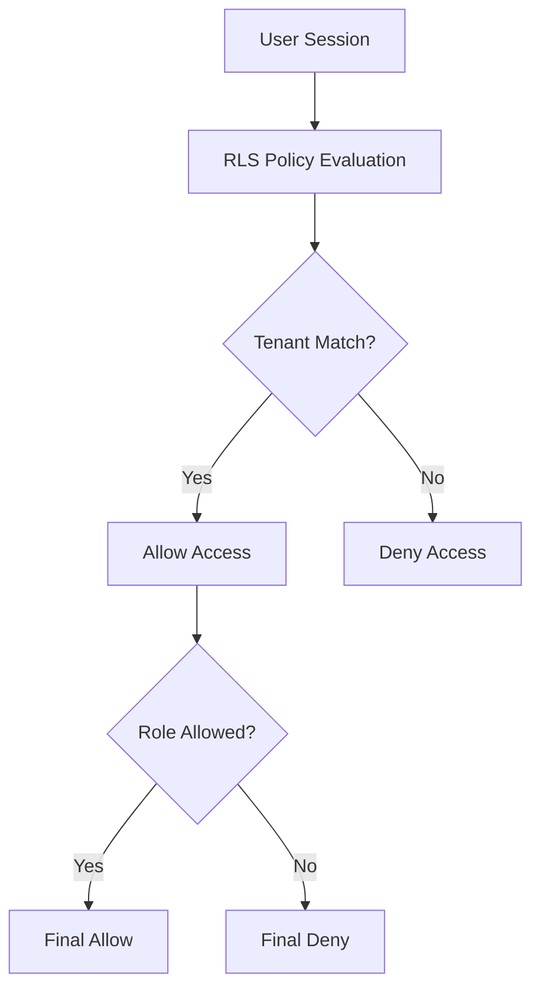
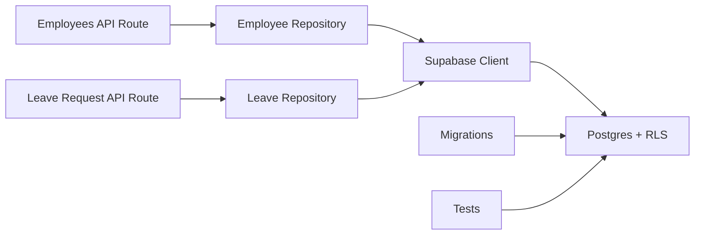
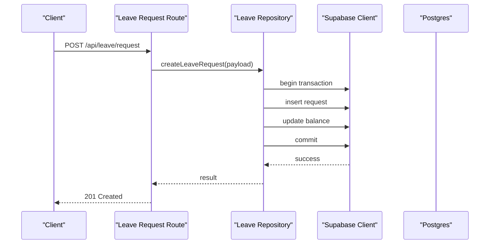

# Data Access Patterns

<cite>
**Referenced Files in This Document**
- [apps/hr-suite/supabase/config.toml](file://apps/hr-suite/supabase/config.toml)
- [apps/hr-suite/lib/supabase/client.ts](file://apps/hr-suite/lib/supabase/client.ts)
- [apps/hr-suite/lib/supabase/server-client.ts](file://apps/hr-suite/lib/supabase/server-client.ts)
- [apps/hr-suite/app/api/employees/route.ts](file://apps/hr-suite/app/api/employees/route.ts)
- [apps/hr-suite/app/api/employees/[employeeId]/route.ts](file://apps/hr-suite/app/api/employees/[employeeId]/route.ts)
- [apps/hr-suite/app/api/leave/request/route.ts](file://apps/hr-suite/app/api/leave/request/route.ts)
- [apps/hr-suite/supabase/migrations/20260712124911_add_tenant_rbac_and_organization.sql](file://apps/hr-suite/supabase/migrations/20260712124911_add_tenant_rbac_and_organization.sql)
- [apps/hr-suite/supabase/migrations/20260715124506_isolate_employee_secure_identifiers.sql](file://apps/hr-suite/supabase/migrations/20260715124506_isolate_employee_secure_identifiers.sql)
- [apps/hr-suite/supabase/migrations/20260722142551_add_leave_engine_foundation.sql](file://apps/hr-suite/supabase/migrations/20260722142551_add_leave_engine_foundation.sql)
- [apps/hr-suite/supabase/tests/multitenancy_isolation.sql](file://apps/hr-suite/supabase/tests/multitenancy_isolation.sql)
- [apps/hr-suite/supabase/tests/employee_core_crud_isolation.sql](file://apps/hr-suite/supabase/tests/employee_core_crud_isolation.sql)
- [apps/hr-suite/supabase/tests/leave_engine_foundation.sql](file://apps/hr-suite/supabase/tests/leave_engine_foundation.sql)
</cite>

## Table of Contents
1. [Introduction](#introduction)
2. [Project Structure](#project-structure)
3. [Core Components](#core-components)
4. [Architecture Overview](#architecture-overview)
5. [Detailed Component Analysis](#detailed-component-analysis)
6. [Dependency Analysis](#dependency-analysis)
7. [Performance Considerations](#performance-considerations)
8. [Troubleshooting Guide](#troubleshooting-guide)
9. [Conclusion](#conclusion)
10. [Appendices](#appendices)

## Introduction
This document explains LiquidHR’s data access patterns and repository-style implementations built on Supabase. It covers client configuration, connection pooling, database interaction strategies, the repository pattern for abstracting operations, query building, transaction management, Row Level Security (RLS), multitenancy isolation, security best practices, complex queries and joins across tenant boundaries, performance optimization, migration and schema evolution, data integrity constraints, backup and recovery procedures, monitoring, and troubleshooting.

## Project Structure
LiquidHR organizes data access around:
- A shared Supabase client layer for typed, secure interactions
- API routes that implement repository-like functions encapsulating CRUD and business logic
- SQL migrations defining schema, indexes, RLS policies, and stored procedures
- Tests validating isolation, authorization, and correctness

**Diagram sources**
- [apps/hr-suite/lib/supabase/client.ts](file://apps/hr-suite/lib/supabase/client.ts)
- [apps/hr-suite/lib/supabase/server-client.ts](file://apps/hr-suite/lib/supabase/server-client.ts)
- [apps/hr-suite/supabase/migrations/20260712124911_add_tenant_rbac_and_organization.sql](file://apps/hr-suite/supabase/migrations/20260712124911_add_tenant_rbac_and_organization.sql)
- [apps/hr-suite/supabase/tests/multitenancy_isolation.sql](file://apps/hr-suite/supabase/tests/multitenancy_isolation.sql)

**Section sources**
- [apps/hr-suite/supabase/config.toml](file://apps/hr-suite/supabase/config.toml)
- [apps/hr-suite/lib/supabase/client.ts](file://apps/hr-suite/lib/supabase/client.ts)
- [apps/hr-suite/lib/supabase/server-client.ts](file://apps/hr-suite/lib/supabase/server-client.ts)

## Core Components
- Supabase client configuration and environment-driven settings
- Server-side client with session context for authenticated requests
- API route handlers implementing repository-style methods
- SQL migrations for schema, RLS policies, and functions
- Test suites ensuring tenant isolation and policy enforcement

Key responsibilities:
- Centralize client setup and pooling to reduce overhead
- Encapsulate data operations behind repository-like functions
- Enforce tenant scoping via RLS and role-based access control
- Provide auditable, transactional writes where needed

**Section sources**
- [apps/hr-suite/lib/supabase/client.ts](file://apps/hr-suite/lib/supabase/client.ts)
- [apps/hr-suite/lib/supabase/server-client.ts](file://apps/hr-suite/lib/supabase/server-client.ts)
- [apps/hr-suite/app/api/employees/route.ts](file://apps/hr-suite/app/api/employees/route.ts)
- [apps/hr-suite/app/api/employees/[employeeId]/route.ts](file://apps/hr-suite/app/api/employees/[employeeId]/route.ts)
- [apps/hr-suite/app/api/leave/request/route.ts](file://apps/hr-suite/app/api/leave/request/route.ts)

## Architecture Overview
The data access architecture follows a layered approach:
- API routes receive requests, validate inputs, and delegate to repository functions
- Repository functions use the Supabase client to execute queries or call RPCs
- RLS policies enforce tenant isolation at the database level
- Migrations evolve schema and policies; tests validate behavior

**Diagram sources**
- [apps/hr-suite/app/api/employees/route.ts](file://apps/hr-suite/app/api/employees/route.ts)
- [apps/hr-suite/lib/supabase/server-client.ts](file://apps/hr-suite/lib/supabase/server-client.ts)
- [apps/hr-suite/supabase/migrations/20260712124911_add_tenant_rbac_and_organization.sql](file://apps/hr-suite/supabase/migrations/20260712124911_add_tenant_rbac_and_organization.sql)

## Detailed Component Analysis

### Supabase Client Configuration and Connection Pooling
- Environment variables define endpoint and keys
- Client instances are created per request on the server to leverage session context
- Connection pooling is managed by the Supabase JS client and underlying PostgREST/Postgres pool

Best practices:
- Reuse client instances within a single request lifecycle
- Avoid creating clients in hot paths outside request scope
- Configure timeouts and retries according to workload

**Section sources**
- [apps/hr-suite/lib/supabase/client.ts](file://apps/hr-suite/lib/supabase/client.ts)
- [apps/hr-suite/lib/supabase/server-client.ts](file://apps/hr-suite/lib/supabase/server-client.ts)
- [apps/hr-suite/supabase/config.toml](file://apps/hr-suite/supabase/config.toml)

### Repository Pattern Implementation
Repository functions encapsulate:
- Input validation and normalization
- Tenant scoping via RLS or explicit filters
- Query composition using typed Supabase client
- Transactional grouping for multi-step writes

Examples:
- Employee CRUD endpoints implement repository-style reads/writes
- Leave request creation composes multiple inserts and updates atomically

**Diagram sources**
- [apps/hr-suite/app/api/employees/route.ts](file://apps/hr-suite/app/api/employees/route.ts)
- [apps/hr-suite/app/api/employees/[employeeId]/route.ts](file://apps/hr-suite/app/api/employees/[employeeId]/route.ts)
- [apps/hr-suite/app/api/leave/request/route.ts](file://apps/hr-suite/app/api/leave/request/route.ts)

**Section sources**
- [apps/hr-suite/app/api/employees/route.ts](file://apps/hr-suite/app/api/employees/route.ts)
- [apps/hr-suite/app/api/employees/[employeeId]/route.ts](file://apps/hr-suite/app/api/employees/[employeeId]/route.ts)
- [apps/hr-suite/app/api/leave/request/route.ts](file://apps/hr-suite/app/api/leave/request/route.ts)

### Query Building Patterns
- Use typed builders to construct safe, readable queries
- Compose filters for tenant scoping, status, and date ranges
- Prefer indexed columns in WHERE clauses and JOIN conditions
- Leverage RPCs for complex read models or aggregations

Guidelines:
- Keep queries close to their usage to avoid over-fetching
- Paginate large result sets
- Use projections to return only necessary fields

**Section sources**
- [apps/hr-suite/app/api/employees/route.ts](file://apps/hr-suite/app/api/employees/route.ts)
- [apps/hr-suite/app/api/employees/[employeeId]/route.ts](file://apps/hr-suite/app/api/employees/[employeeId]/route.ts)

### Transaction Management
- Group related mutations into a single transaction for consistency
- Handle partial failures by rolling back all changes
- Ensure idempotency for critical operations like leave bookings

Patterns:
- Begin transaction before first write
- Commit after all writes succeed
- Catch errors and rollback explicitly

**Section sources**
- [apps/hr-suite/app/api/leave/request/route.ts](file://apps/hr-suite/app/api/leave/request/route.ts)

### Row Level Security (RLS) and Multitenancy
RLS enforces:
- Per-tenant data isolation
- Role-based access control (RBAC)
- Secure identifier exposure based on user context

Key aspects:
- Policies reference current tenant and roles
- Sensitive identifiers are isolated and conditionally exposed
- Cross-tenant joins are prevented unless explicitly allowed

**Diagram sources**
- [apps/hr-suite/supabase/migrations/20260712124911_add_tenant_rbac_and_organization.sql](file://apps/hr-suite/supabase/migrations/20260712124911_add_tenant_rbac_and_organization.sql)
- [apps/hr-suite/supabase/migrations/20260715124506_isolate_employee_secure_identifiers.sql](file://apps/hr-suite/supabase/migrations/20260715124506_isolate_employee_secure_identifiers.sql)

**Section sources**
- [apps/hr-suite/supabase/migrations/20260712124911_add_tenant_rbac_and_organization.sql](file://apps/hr-suite/supabase/migrations/20260712124911_add_tenant_rbac_and_organization.sql)
- [apps/hr-suite/supabase/migrations/20260715124506_isolate_employee_secure_identifiers.sql](file://apps/hr-suite/supabase/migrations/20260715124506_isolate_employee_secure_identifiers.sql)
- [apps/hr-suite/supabase/tests/multitenancy_isolation.sql](file://apps/hr-suite/supabase/tests/multitenancy_isolation.sql)

### Security Best Practices
- Always rely on RLS for authorization; never trust client-side checks alone
- Minimize sensitive field exposure; use conditional policies for identifiers
- Validate and sanitize inputs at the API boundary
- Audit privileged operations and log outcomes without leaking secrets

**Section sources**
- [apps/hr-suite/supabase/migrations/20260712124911_add_tenant_rbac_and_organization.sql](file://apps/hr-suite/supabase/migrations/20260712124911_add_tenant_rbac_and_organization.sql)
- [apps/hr-suite/supabase/migrations/20260715124506_isolate_employee_secure_identifiers.sql](file://apps/hr-suite/supabase/migrations/20260715124506_isolate_employee_secure_identifiers.sql)

### Complex Queries and Cross-Tenant Joins
- Prefer single-tenant queries; cross-tenant joins should be rare and intentional
- Use materialized views or RPCs for heavy aggregations
- Index foreign keys and frequently filtered columns

Example scenarios:
- Employee overview with department and job catalog data
- Leave ledger aggregation across periods

**Section sources**
- [apps/hr-suite/supabase/migrations/20260722142551_add_leave_engine_foundation.sql](file://apps/hr-suite/supabase/migrations/20260722142551_add_leave_engine_foundation.sql)
- [apps/hr-suite/supabase/tests/leave_engine_foundation.sql](file://apps/hr-suite/supabase/tests/leave_engine_foundation.sql)

### Performance Optimization Techniques
- Add targeted indexes on filter and join columns
- Use pagination and cursor-based navigation for large lists
- Reduce payload size with selective projections
- Cache read-heavy data when appropriate

**Section sources**
- [apps/hr-suite/supabase/migrations/20260722142551_add_leave_engine_foundation.sql](file://apps/hr-suite/supabase/migrations/20260722142551_add_leave_engine_foundation.sql)

### Migration Strategies and Schema Evolution
- Versioned migrations ensure reproducible deployments
- Backward-compatible changes minimize downtime
- Data migrations run within transactions where possible

Recommendations:
- Separate schema changes from data seeding
- Test migrations against representative datasets
- Document breaking changes and deprecation timelines

**Section sources**
- [apps/hr-suite/supabase/migrations/20260712124911_add_tenant_rbac_and_organization.sql](file://apps/hr-suite/supabase/migrations/20260712124911_add_tenant_rbac_and_organization.sql)
- [apps/hr-suite/supabase/migrations/20260715124506_isolate_employee_secure_identifiers.sql](file://apps/hr-suite/supabase/migrations/20260715124506_isolate_employee_secure_identifiers.sql)
- [apps/hr-suite/supabase/migrations/20260722142551_add_leave_engine_foundation.sql](file://apps/hr-suite/supabase/migrations/20260722142551_add_leave_engine_foundation.sql)

### Data Integrity Constraints
- Enforce referential integrity with foreign keys
- Apply unique constraints on natural keys where applicable
- Use check constraints for domain rules

**Section sources**
- [apps/hr-suite/supabase/migrations/20260722142551_add_leave_engine_foundation.sql](file://apps/hr-suite/supabase/migrations/20260722142551_add_leave_engine_foundation.sql)

### Backup and Recovery Procedures
- Use Supabase-native backups and point-in-time recovery
- Schedule regular snapshots for critical tenants
- Validate restore procedures periodically

Operational tips:
- Tag backups with tenant identifiers
- Maintain runbooks for disaster recovery
- Monitor backup success and latency

[No sources needed since this section provides general guidance]

### Monitoring Database Performance
- Track query latency and error rates
- Monitor connection pool saturation
- Alert on slow queries and lock contention

Tools:
- Supabase dashboard metrics
- Database logs and EXPLAIN plans
- Application-level tracing for API routes

[No sources needed since this section provides general guidance]

### Troubleshooting Common Data Access Issues
Common symptoms:
- Permission denied due to missing RLS policies
- Timeouts from unindexed queries
- Deadlocks in concurrent transactions

Diagnostic steps:
- Verify session context and tenant resolution
- Review RLS policies and roles
- Analyze query plans and add indexes
- Normalize transaction scopes and retry logic

**Section sources**
- [apps/hr-suite/supabase/tests/multitenancy_isolation.sql](file://apps/hr-suite/supabase/tests/multitenancy_isolation.sql)
- [apps/hr-suite/supabase/tests/employee_core_crud_isolation.sql](file://apps/hr-suite/supabase/tests/employee_core_crud_isolation.sql)
- [apps/hr-suite/supabase/tests/leave_engine_foundation.sql](file://apps/hr-suite/supabase/tests/leave_engine_foundation.sql)

## Dependency Analysis

**Diagram sources**
- [apps/hr-suite/app/api/employees/route.ts](file://apps/hr-suite/app/api/employees/route.ts)
- [apps/hr-suite/app/api/leave/request/route.ts](file://apps/hr-suite/app/api/leave/request/route.ts)
- [apps/hr-suite/lib/supabase/server-client.ts](file://apps/hr-suite/lib/supabase/server-client.ts)
- [apps/hr-suite/supabase/migrations/20260712124911_add_tenant_rbac_and_organization.sql](file://apps/hr-suite/supabase/migrations/20260712124911_add_tenant_rbac_and_organization.sql)

**Section sources**
- [apps/hr-suite/app/api/employees/route.ts](file://apps/hr-suite/app/api/employees/route.ts)
- [apps/hr-suite/app/api/leave/request/route.ts](file://apps/hr-suite/app/api/leave/request/route.ts)
- [apps/hr-suite/lib/supabase/server-client.ts](file://apps/hr-suite/lib/supabase/server-client.ts)

## Performance Considerations
- Index foreign keys and high-cardinality filters
- Use pagination and limit result sets
- Prefer RPCs for complex reads to reduce round trips
- Monitor and optimize slow queries with EXPLAIN ANALYZE

[No sources needed since this section provides general guidance]

## Troubleshooting Guide
- Confirm RLS policies allow expected operations for the current role and tenant
- Validate session propagation in server-side clients
- Inspect transaction boundaries and error handling
- Reproduce issues using test scripts under supabase/tests

**Section sources**
- [apps/hr-suite/supabase/tests/multitenancy_isolation.sql](file://apps/hr-suite/supabase/tests/multitenancy_isolation.sql)
- [apps/hr-suite/supabase/tests/employee_core_crud_isolation.sql](file://apps/hr-suite/supabase/tests/employee_core_crud_isolation.sql)
- [apps/hr-suite/supabase/tests/leave_engine_foundation.sql](file://apps/hr-suite/supabase/tests/leave_engine_foundation.sql)

## Conclusion
LiquidHR’s data access layer combines a robust Supabase client, repository-style APIs, and strong RLS-driven multitenancy. By following the patterns outlined here—typed queries, transactional writes, careful indexing, and rigorous testing—you can maintain secure, scalable, and maintainable data operations across tenants.

[No sources needed since this section summarizes without analyzing specific files]

## Appendices

### Example: Leave Request Booking Flow

**Diagram sources**
- [apps/hr-suite/app/api/leave/request/route.ts](file://apps/hr-suite/app/api/leave/request/route.ts)
- [apps/hr-suite/supabase/migrations/20260722142551_add_leave_engine_foundation.sql](file://apps/hr-suite/supabase/migrations/20260722142551_add_leave_engine_foundation.sql)