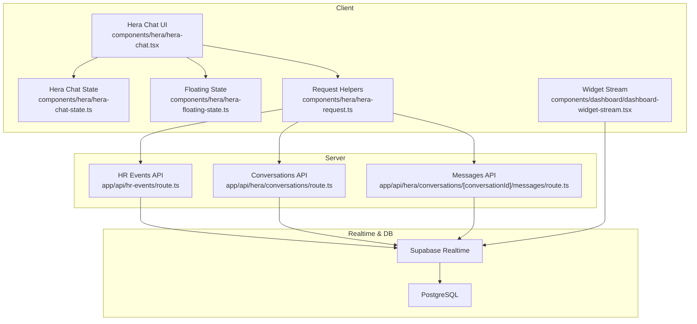
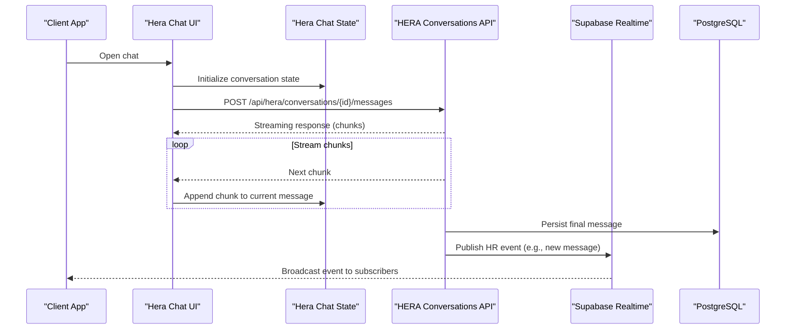
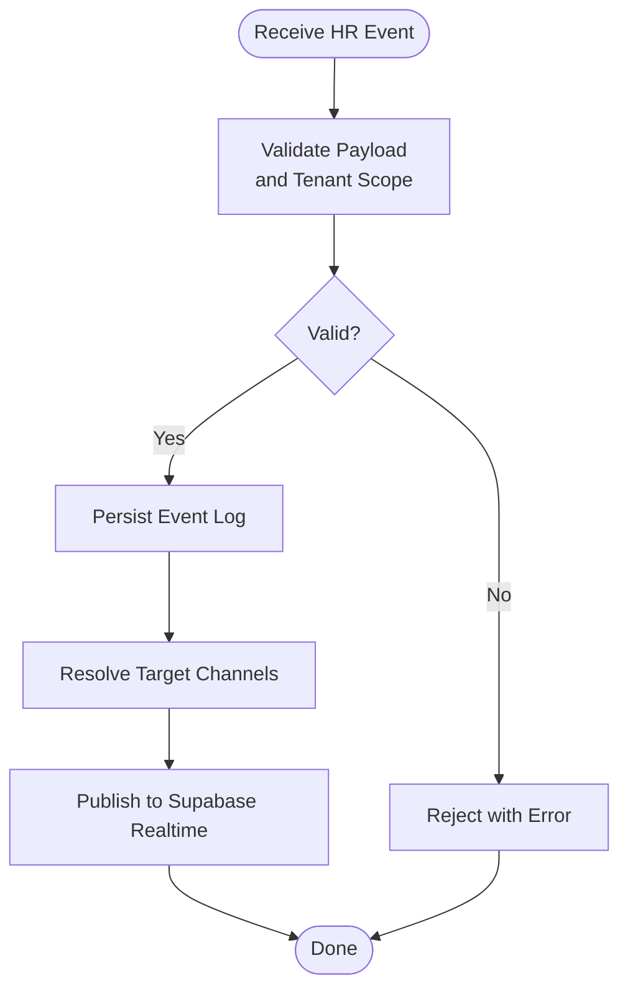
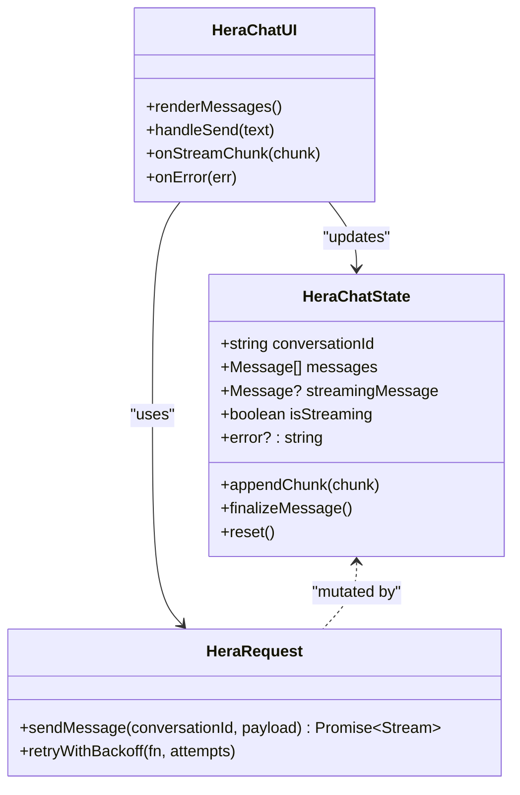
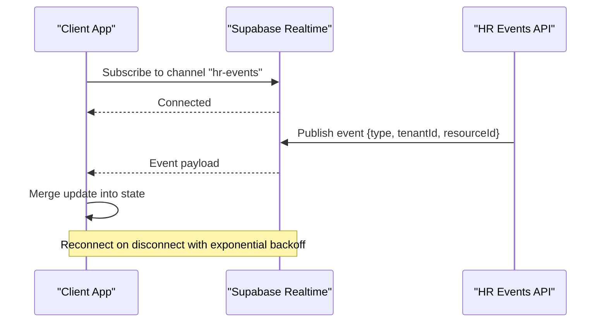
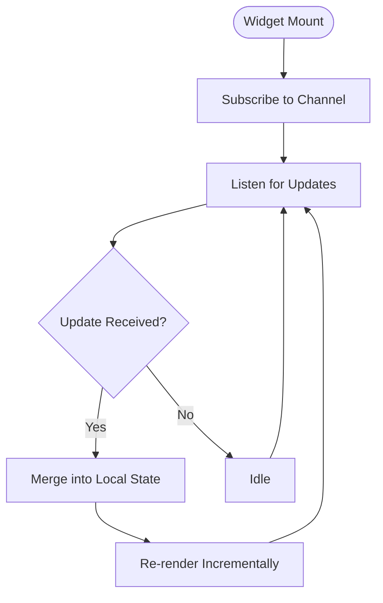
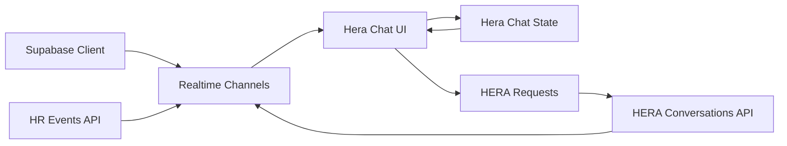

# Real-time Features

<cite>
**Referenced Files in This Document**
- [apps/hr-suite/app/api/hr-events/route.ts](file://apps/hr-suite/app/api/hr-events/route.ts)
- [apps/hr-suite/components/hera/hera-chat-state.ts](file://apps/hr-suite/components/hera/hera-chat-state.ts)
- [apps/hr-suite/components/hera/hera-chat.tsx](file://apps/hr-suite/components/hera/hera-chat.tsx)
- [apps/hr-suite/components/hera/hera-floating-state.ts](file://apps/hr-suite/components/hera/hera-floating-state.ts)
- [apps/hr-suite/components/hera/hera-request.ts](file://apps/hr-suite/components/hera/hera-request.ts)
- [apps/hr-suite/components/hera/hera-response-model.ts](file://apps/hr-suite/components/hera/hera-response-model.ts)
- [apps/hr-suite/lib/hr-events/index.ts](file://apps/hr-suite/lib/hr-events/index.ts)
- [apps/hr-suite/lib/supabase/client.ts](file://apps/hr-suite/lib/supabase/client.ts)
- [apps/hr-suite/app/api/hera/conversations/route.ts](file://apps/hr-suite/app/api/hera/conversations/route.ts)
- [apps/hr-suite/app/api/hera/conversations/[conversationId]/messages/route.ts](file://apps/hr-suite/app/api/hera/conversations/[conversationId]/messages/route.ts)
- [apps/hr-suite/app/(dashboard)/hera/page.tsx](file://apps/hr-suite/app/(dashboard)/hera/page.tsx)
- [apps/hr-suite/components/dashboard/dashboard-widget-stream.tsx](file://apps/hr-suite/components/dashboard/dashboard-widget-stream.tsx)
</cite>

## Table of Contents
1. Introduction
2. Project Structure
3. Core Components
4. Architecture Overview
5. Detailed Component Analysis
6. Dependency Analysis
7. Performance Considerations
8. Troubleshooting Guide
9. Conclusion

## Introduction
This document explains LiquidHR’s real-time capabilities and event-driven architecture with a focus on:
- Supabase Realtime subscriptions for live data synchronization
- HR events system for tracking employee activities, employment changes, and notifications
- HERA AI agent’s real-time communication patterns, message streaming, and conversation state management
- Client-side state synchronization, reconnection handling, and concurrent update strategies
- Performance considerations for high-frequency updates, bandwidth optimization, and offline support

## Project Structure
LiquidHR organizes real-time features across API routes, client-side components, and shared libraries:
- API routes expose endpoints for HR events and HERA conversations/messages
- The HERA chat UI manages conversation state, streaming responses, and floating interactions
- Shared libraries encapsulate HR event definitions and Supabase client configuration
- Dashboard widgets demonstrate real-time streaming patterns

**Diagram sources**
- [apps/hr-suite/components/hera/hera-chat.tsx](file://apps/hr-suite/components/hera/hera-chat.tsx)
- [apps/hr-suite/components/hera/hera-chat-state.ts](file://apps/hr-suite/components/hera/hera-chat-state.ts)
- [apps/hr-suite/components/hera/hera-floating-state.ts](file://apps/hr-suite/components/hera/hera-floating-state.ts)
- [apps/hr-suite/components/hera/hera-request.ts](file://apps/hr-suite/components/hera/hera-request.ts)
- [apps/hr-suite/app/api/hr-events/route.ts](file://apps/hr-suite/app/api/hr-events/route.ts)
- [apps/hr-suite/app/api/hera/conversations/route.ts](file://apps/hr-suite/app/api/hera/conversations/route.ts)
- [apps/hr-suite/app/api/hera/conversations/[conversationId]/messages/route.ts](file://apps/hr-suite/app/api/hera/conversations/[conversationId]/messages/route.ts)
- [apps/hr-suite/components/dashboard/dashboard-widget-stream.tsx](file://apps/hr-suite/components/dashboard/dashboard-widget-stream.tsx)

**Section sources**
- [apps/hr-suite/app/api/hr-events/route.ts](file://apps/hr-suite/app/api/hr-events/route.ts)
- [apps/hr-suite/components/hera/hera-chat-state.ts](file://apps/hr-suite/components/hera/hera-chat-state.ts)
- [apps/hr-suite/components/hera/hera-chat.tsx](file://apps/hr-suite/components/hera/hera-chat.tsx)
- [apps/hr-suite/components/hera/hera-floating-state.ts](file://apps/hr-suite/components/hera/hera-floating-state.ts)
- [apps/hr-suite/components/hera/hera-request.ts](file://apps/hr-suite/components/hera/hera-request.ts)
- [apps/hr-suite/components/dashboard/dashboard-widget-stream.tsx](file://apps/hr-suite/components/dashboard/dashboard-widget-stream.tsx)

## Core Components
- HR Events API: Central endpoint to publish and broadcast HR events such as employee activity, employment lifecycle changes, and system notifications. It integrates with Supabase Realtime to push updates to subscribed clients.
- HERA Chat State: Manages conversation state, message history, streaming chunks, and error states for the HERA AI agent.
- Floating State: Provides lightweight UI state for the floating chat widget, including visibility and minimal interaction context.
- Request Helpers: Encapsulates HTTP calls to HERA APIs and HR events, normalizing payloads and handling retries.
- Supabase Client: Configures the Supabase instance used by both server and client for realtime subscriptions and database access.
- Dashboard Widget Stream: Demonstrates how dashboard widgets subscribe to realtime channels and render incremental updates.

**Section sources**
- [apps/hr-suite/app/api/hr-events/route.ts](file://apps/hr-suite/app/api/hr-events/route.ts)
- [apps/hr-suite/components/hera/hera-chat-state.ts](file://apps/hr-suite/components/hera/hera-chat-state.ts)
- [apps/hr-suite/components/hera/hera-floating-state.ts](file://apps/hr-suite/components/hera/hera-floating-state.ts)
- [apps/hr-suite/components/hera/hera-request.ts](file://apps/hr-suite/components/hera/hera-request.ts)
- [apps/hr-suite/lib/supabase/client.ts](file://apps/hr-suite/lib/supabase/client.ts)
- [apps/hr-suite/components/dashboard/dashboard-widget-stream.tsx](file://apps/hr-suite/components/dashboard/dashboard-widget-stream.tsx)

## Architecture Overview
The system uses an event-driven architecture where:
- Clients subscribe to Supabase Realtime channels for live updates
- Server endpoints publish events to these channels upon data mutations or scheduled tasks
- HERA AI agent communicates via REST APIs with streaming responses; client state tracks partial messages and completion
- HR events are emitted from multiple sources (UI actions, background jobs, integrations) and broadcast to relevant subscribers

**Diagram sources**
- [apps/hr-suite/components/hera/hera-chat.tsx](file://apps/hr-suite/components/hera/hera-chat.tsx)
- [apps/hr-suite/components/hera/hera-chat-state.ts](file://apps/hr-suite/components/hera/hera-chat-state.ts)
- [apps/hr-suite/app/api/hera/conversations/[conversationId]/messages/route.ts](file://apps/hr-suite/app/api/hera/conversations/[conversationId]/messages/route.ts)
- [apps/hr-suite/app/api/hera/conversations/route.ts](file://apps/hr-suite/app/api/hera/conversations/route.ts)

## Detailed Component Analysis

### HR Events System
Responsibilities:
- Accepts structured HR events (employee activity, employment changes, notifications)
- Validates payloads and enforces tenant scoping
- Publishes events to Supabase Realtime channels based on event type and target scope
- Optionally persists event logs for auditability

Key behaviors:
- Event types include employee lifecycle transitions, custom field updates, reminders, and system alerts
- Channel naming conventions ensure efficient filtering on the client side
- Idempotency keys prevent duplicate broadcasts when retries occur

**Diagram sources**
- [apps/hr-suite/app/api/hr-events/route.ts](file://apps/hr-suite/app/api/hr-events/route.ts)

**Section sources**
- [apps/hr-suite/app/api/hr-events/route.ts](file://apps/hr-suite/app/api/hr-events/route.ts)
- [apps/hr-suite/lib/hr-events/index.ts](file://apps/hr-suite/lib/hr-events/index.ts)

### HERA AI Agent Communication
Responsibilities:
- Manage conversation lifecycle and message history
- Stream AI-generated responses incrementally
- Maintain local state for pending, streaming, and completed messages
- Handle errors, retries, and connection drops gracefully

Patterns:
- Use fetch with ReadableStream to process chunks
- Update state per chunk to reflect progress
- On completion, persist final message and emit HR events if needed

**Diagram sources**
- [apps/hr-suite/components/hera/hera-chat-state.ts](file://apps/hr-suite/components/hera/hera-chat-state.ts)
- [apps/hr-suite/components/hera/hera-request.ts](file://apps/hr-suite/components/hera/hera-request.ts)
- [apps/hr-suite/components/hera/hera-chat.tsx](file://apps/hr-suite/components/hera/hera-chat.tsx)

**Section sources**
- [apps/hr-suite/components/hera/hera-chat-state.ts](file://apps/hr-suite/components/hera/hera-chat-state.ts)
- [apps/hr-suite/components/hera/hera-chat.tsx](file://apps/hr-suite/components/hera/hera-chat.tsx)
- [apps/hr-suite/components/hera/hera-floating-state.ts](file://apps/hr-suite/components/hera/hera-floating-state.ts)
- [apps/hr-suite/components/hera/hera-request.ts](file://apps/hr-suite/components/hera/hera-request.ts)
- [apps/hr-suite/components/hera/hera-response-model.ts](file://apps/hr-suite/components/hera/hera-response-model.ts)
- [apps/hr-suite/app/(dashboard)/hera/page.tsx](file://apps/hr-suite/app/(dashboard)/hera/page.tsx)

### Supabase Realtime Subscriptions
Responsibilities:
- Establish connections to Supabase Realtime channels
- Subscribe to specific tables, rows, or custom channels
- Handle reconnections and channel lifecycle events
- Merge incoming updates into client state efficiently

Best practices:
- Use presence channels for user activity indicators
- Filter updates by tenant ID and resource IDs to reduce noise
- Debounce high-frequency updates before rendering

**Diagram sources**
- [apps/hr-suite/lib/supabase/client.ts](file://apps/hr-suite/lib/supabase/client.ts)
- [apps/hr-suite/app/api/hr-events/route.ts](file://apps/hr-suite/app/api/hr-events/route.ts)

**Section sources**
- [apps/hr-suite/lib/supabase/client.ts](file://apps/hr-suite/lib/supabase/client.ts)

### Dashboard Widget Streaming
Responsibilities:
- Subscribe to realtime channels for dashboard metrics
- Render incremental updates without full page reloads
- Handle loading states and error boundaries

**Diagram sources**
- [apps/hr-suite/components/dashboard/dashboard-widget-stream.tsx](file://apps/hr-suite/components/dashboard/dashboard-widget-stream.tsx)

**Section sources**
- [apps/hr-suite/components/dashboard/dashboard-widget-stream.tsx](file://apps/hr-suite/components/dashboard/dashboard-widget-stream.tsx)

## Dependency Analysis
Real-time features depend on:
- Supabase client for realtime connectivity
- API routes for publishing events and handling HERA requests
- Client-side state managers for UI consistency
- Background processes or triggers for event generation

**Diagram sources**
- [apps/hr-suite/lib/supabase/client.ts](file://apps/hr-suite/lib/supabase/client.ts)
- [apps/hr-suite/app/api/hr-events/route.ts](file://apps/hr-suite/app/api/hr-events/route.ts)
- [apps/hr-suite/app/api/hera/conversations/route.ts](file://apps/hr-suite/app/api/hera/conversations/route.ts)
- [apps/hr-suite/components/hera/hera-chat.tsx](file://apps/hr-suite/components/hera/hera-chat.tsx)
- [apps/hr-suite/components/hera/hera-chat-state.ts](file://apps/hr-suite/components/hera/hera-chat-state.ts)
- [apps/hr-suite/components/hera/hera-request.ts](file://apps/hr-suite/components/hera/hera-request.ts)

**Section sources**
- [apps/hr-suite/lib/supabase/client.ts](file://apps/hr-suite/lib/supabase/client.ts)
- [apps/hr-suite/app/api/hr-events/route.ts](file://apps/hr-suite/app/api/hr-events/route.ts)
- [apps/hr-suite/app/api/hera/conversations/route.ts](file://apps/hr-suite/app/api/hera/conversations/route.ts)
- [apps/hr-suite/components/hera/hera-chat.tsx](file://apps/hr-suite/components/hera/hera-chat.tsx)
- [apps/hr-suite/components/hera/hera-chat-state.ts](file://apps/hr-suite/components/hera/hera-chat-state.ts)
- [apps/hr-suite/components/hera/hera-request.ts](file://apps/hr-suite/components/hera/hera-request.ts)

## Performance Considerations
- High-frequency updates:
  - Debounce UI updates to avoid excessive re-renders
  - Batch state merges using immutable updates
  - Use selective subscriptions to limit payload size
- Bandwidth optimization:
  - Compress payloads where possible
  - Send only changed fields instead of full objects
  - Implement pagination for large datasets
- Offline support:
  - Cache last known state locally
  - Queue mutations and replay on reconnect
  - Use optimistic updates with rollback on failure
- Connection resilience:
  - Implement exponential backoff for reconnections
  - Monitor connection health and notify users
  - Gracefully handle channel drops and resubscribe

[No sources needed since this section provides general guidance]

## Troubleshooting Guide
Common issues and resolutions:
- Connection failures:
  - Verify Supabase credentials and network connectivity
  - Check firewall rules and CORS settings
  - Inspect browser console for WebSocket errors
- Duplicate events:
  - Ensure idempotency keys are used in event payloads
  - Deduplicate events on the client side using timestamps or IDs
- State desynchronization:
  - Compare server state with local cache periodically
  - Implement conflict resolution strategies for concurrent updates
- Streaming interruptions:
  - Detect stream termination and retry failed chunks
  - Provide user feedback during long-running operations

**Section sources**
- [apps/hr-suite/lib/supabase/client.ts](file://apps/hr-suite/lib/supabase/client.ts)
- [apps/hr-suite/components/hera/hera-chat-state.ts](file://apps/hr-suite/components/hera/hera-chat-state.ts)
- [apps/hr-suite/components/hera/hera-request.ts](file://apps/hr-suite/components/hera/hera-request.ts)

## Conclusion
LiquidHR’s real-time architecture leverages Supabase Realtime for live data synchronization, an event-driven HR system for tracking activities and changes, and a robust HERA AI agent interface with streaming responses. By following best practices for subscription management, state synchronization, and performance optimization, the system delivers responsive, scalable, and reliable real-time experiences for HR workflows.

[No sources needed since this section summarizes without analyzing specific files]