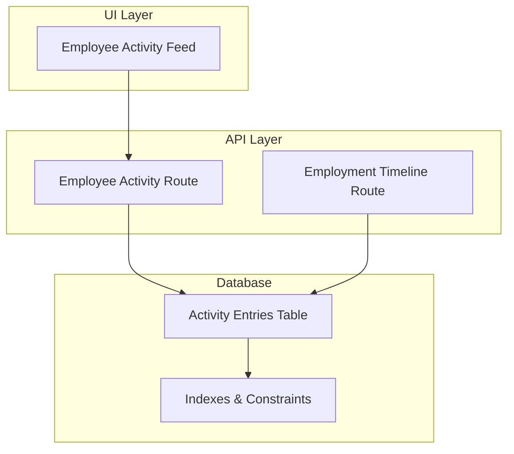
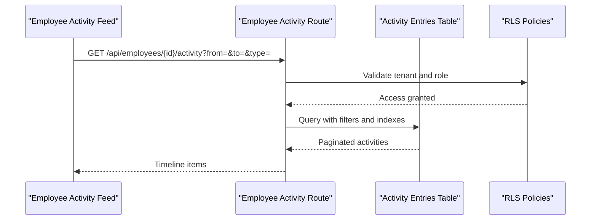
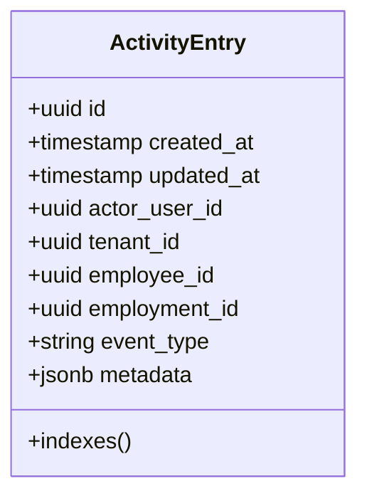
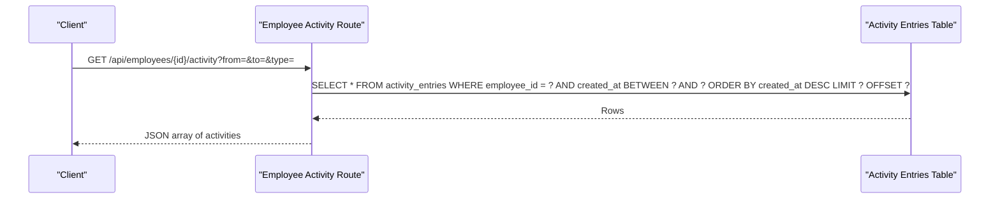
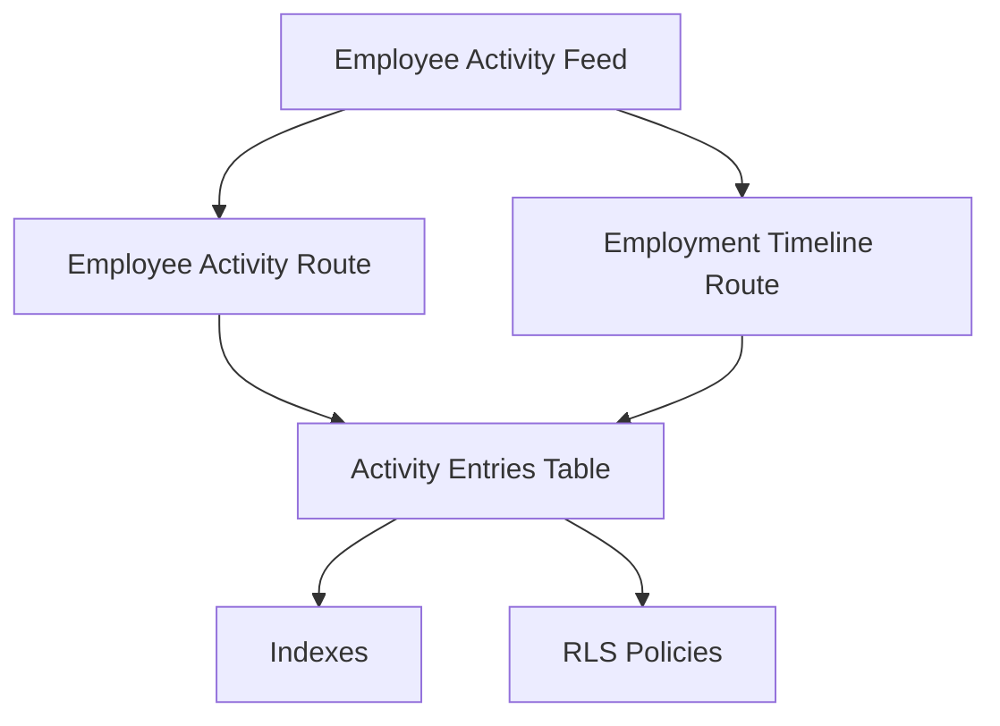

# Activity Tracking Schema

<cite>
**Referenced Files in This Document**
- [20260724160000_add_employee_activity_entries.sql](file://apps/hr-suite/supabase/migrations/20260724160000_add_employee_activity_entries.sql)
- [20260724172716_harden_employee_activity_entries.sql](file://apps/hr-suite/supabase/migrations/20260724172716_harden_employee_activity_entries.sql)
- [employee-activity-feed.tsx](file://apps/hr-suite/components/employees/employee-activity-feed.tsx)
- [route.ts (Employee Activity)](file://apps/hr-suite/app/api/employees/[employeeId]/activity/route.ts)
- [route.ts (Employment Timeline)](file://apps/hr-suite/app/api/employments/[employmentId]/timeline/[timeline]/route.ts)
</cite>

## Table of Contents
1. [Introduction](#introduction)
2. [Project Structure](#project-structure)
3. [Core Components](#core-components)
4. [Architecture Overview](#architecture-overview)
5. [Detailed Component Analysis](#detailed-component-analysis)
6. [Dependency Analysis](#dependency-analysis)
7. [Performance Considerations](#performance-considerations)
8. [Troubleshooting Guide](#troubleshooting-guide)
9. [Conclusion](#conclusion)

## Introduction
This document specifies the schema and behavior of LiquidHR’s employee activity tracking system. It covers the activity entries table structure, event types, metadata storage, audit trail functionality for employee records, employment details, and organizational data, as well as relationship mappings to source entities for traceability. It also documents indexing strategies for efficient timeline queries and filtering by date ranges, user actions, or entity types; security policies for activity log access; data retention and archival strategies; and performance considerations for high-volume logging and query optimization for timeline views.

## Project Structure
Activity tracking spans database migrations, API routes, and UI components:
- Database schema and constraints are defined in Supabase migrations under apps/hr-suite/supabase/migrations.
- API endpoints expose activity retrieval and related operations under apps/hr-suite/app/api.
- The employee activity feed component renders timelines in the UI under apps/hr-suite/components/employees.

[No sources needed since this diagram shows conceptual workflow, not actual code structure]

## Core Components
- Activity entries table: Stores immutable audit events with typed event categories, timestamps, actor identity, tenant context, and a flexible JSONB metadata payload.
- Event taxonomy: Enumerated event types covering employee lifecycle, employment changes, and organizational updates.
- Metadata storage: JSONB column enabling extensible per-event attributes without schema churn.
- Audit trail integration: Triggers or application-level hooks that emit events on mutations to core HR entities.
- API exposure: Endpoints to fetch activities scoped by employee or employment, supporting filters and pagination.
- UI rendering: Timeline view that aggregates and displays activities chronologically.

**Section sources**
- [20260724160000_add_employee_activity_entries.sql](file://apps/hr-suite/supabase/migrations/20260724160000_add_employee_activity_entries.sql)
- [20260724172716_harden_employee_activity_entries.sql](file://apps/hr-suite/supabase/migrations/20260724172716_harden_employee_activity_entries.sql)
- [employee-activity-feed.tsx](file://apps/hr-suite/components/employees/employee-activity-feed.tsx)
- [route.ts (Employee Activity)](file://apps/hr-suite/app/api/employees/[employeeId]/activity/route.ts)
- [route.ts (Employment Timeline)](file://apps/hr-suite/app/api/employments/[employmentId]/timeline/[timeline]/route.ts)

## Architecture Overview
The activity tracking system follows an append-only audit model:
- Mutations to HR entities produce activity entries via triggers or explicit calls.
- API routes enforce tenant scoping and role-based access before returning activity rows.
- UI components consume APIs to render chronological timelines.

**Diagram sources**
- [route.ts (Employee Activity)](file://apps/hr-suite/app/api/employees/[employeeId]/activity/route.ts)
- [20260724160000_add_employee_activity_entries.sql](file://apps/hr-suite/supabase/migrations/20260724160000_add_employee_activity_entries.sql)
- [20260724172716_harden_employee_activity_entries.sql](file://apps/hr-suite/supabase/migrations/20260724172716_harden_employee_activity_entries.sql)

## Detailed Component Analysis

### Activity Entries Table Schema
- Primary key: Unique identifier for each activity entry.
- Timestamps: Created at and updated at fields for ordering and auditing.
- Actor identity: User or system actor responsible for the change.
- Tenant context: Multi-tenant isolation via tenant/administration identifiers.
- Entity references: Foreign keys or IDs linking to source entities (e.g., employee_id, employment_id).
- Event type: Categorized action (create, update, delete, status change, etc.).
- Metadata: JSONB payload capturing field-level diffs, contextual parameters, and correlation IDs.
- Indexes: Optimized for timeline queries by date range, entity type, and actor.

**Diagram sources**
- [20260724160000_add_employee_activity_entries.sql](file://apps/hr-suite/supabase/migrations/20260724160000_add_employee_activity_entries.sql)
- [20260724172716_harden_employee_activity_entries.sql](file://apps/hr-suite/supabase/migrations/20260724172716_harden_employee_activity_entries.sql)

**Section sources**
- [20260724160000_add_employee_activity_entries.sql](file://apps/hr-suite/supabase/migrations/20260724160000_add_employee_activity_entries.sql)
- [20260724172716_harden_employee_activity_entries.sql](file://apps/hr-suite/supabase/migrations/20260724172716_harden_employee_activity_entries.sql)

### Event Types and Taxonomy
Event types categorize activities into logical groups:
- Employee lifecycle: create, update, archive/unarchive, identity changes.
- Employment changes: start, transfer, promotion, termination, work pattern updates.
- Organizational data: department reassignment, job catalog updates, policy changes.
- System events: automated processes, imports, exports, background jobs.

Each event type is designed to be extensible, allowing new categories without migration overhead.

**Section sources**
- [20260724160000_add_employee_activity_entries.sql](file://apps/hr-suite/supabase/migrations/20260724160000_add_employee_activity_entries.sql)

### Metadata Storage Strategy
- Use JSONB for flexible, schema-less payloads.
- Store field-level diffs, old/new values, and contextual parameters.
- Enforce minimal required keys via check constraints or application validation.
- Support querying nested fields using JSON operators when needed.

**Section sources**
- [20260724160000_add_employee_activity_entries.sql](file://apps/hr-suite/supabase/migrations/20260724160000_add_employee_activity_entries.sql)

### Audit Trail Functionality
- Append-only design ensures immutability and integrity of historical records.
- Triggers or application hooks emit events on mutations to core HR tables.
- Correlation IDs link related activities across transactions.
- Supports full reconstruction of state changes over time.

**Section sources**
- [20260724160000_add_employee_activity_entries.sql](file://apps/hr-suite/supabase/migrations/20260724160000_add_employee_activity_entries.sql)
- [20260724172716_harden_employee_activity_entries.sql](file://apps/hr-suite/supabase/migrations/20260724172716_harden_employee_activity_entries.sql)

### Relationship Mappings and Traceability
- employee_id links activities to specific employees.
- employment_id links activities to employment records for granular tracking.
- tenant_id enforces multi-tenant isolation.
- actor_user_id identifies who performed the action.
- Optional foreign keys to other entities (e.g., department_id) enable cross-entity traceability.

**Section sources**
- [20260724160000_add_employee_activity_entries.sql](file://apps/hr-suite/supabase/migrations/20260724160000_add_employee_activity_entries.sql)

### API Endpoints for Activity Retrieval
- Employee Activity endpoint: Returns activities filtered by employee ID, date range, and event type.
- Employment Timeline endpoint: Returns activities scoped to a specific employment record.
- Both endpoints enforce tenant scoping and role-based access control.

**Diagram sources**
- [route.ts (Employee Activity)](file://apps/hr-suite/app/api/employees/[employeeId]/activity/route.ts)
- [20260724160000_add_employee_activity_entries.sql](file://apps/hr-suite/supabase/migrations/20260724160000_add_employee_activity_entries.sql)

**Section sources**
- [route.ts (Employee Activity)](file://apps/hr-suite/app/api/employees/[employeeId]/activity/route.ts)
- [route.ts (Employment Timeline)](file://apps/hr-suite/app/api/employments/[employmentId]/timeline/[timeline]/route.ts)

### UI Rendering: Employee Activity Feed
- Fetches activities via API and renders them in chronological order.
- Supports filtering by date range and event type.
- Displays metadata summaries and links to source entities.

**Section sources**
- [employee-activity-feed.tsx](file://apps/hr-suite/components/employees/employee-activity-feed.tsx)

## Dependency Analysis
The activity tracking system depends on:
- Database schema and indexes for performance.
- RLS policies for security and tenant isolation.
- API routes for controlled access.
- UI components for visualization.

**Diagram sources**
- [employee-activity-feed.tsx](file://apps/hr-suite/components/employees/employee-activity-feed.tsx)
- [route.ts (Employee Activity)](file://apps/hr-suite/app/api/employees/[employeeId]/activity/route.ts)
- [route.ts (Employment Timeline)](file://apps/hr-suite/app/api/employments/[employmentId]/timeline/[timeline]/route.ts)
- [20260724160000_add_employee_activity_entries.sql](file://apps/hr-suite/supabase/migrations/20260724160000_add_employee_activity_entries.sql)
- [20260724172716_harden_employee_activity_entries.sql](file://apps/hr-suite/supabase/migrations/20260724172716_harden_employee_activity_entries.sql)

**Section sources**
- [20260724160000_add_employee_activity_entries.sql](file://apps/hr-suite/supabase/migrations/20260724160000_add_employee_activity_entries.sql)
- [20260724172716_harden_employee_activity_entries.sql](file://apps/hr-suite/supabase/migrations/20260724172716_harden_employee_activity_entries.sql)

## Performance Considerations
- Indexing strategy:
  - Composite index on (employee_id, created_at) for timeline queries.
  - Index on (employment_id, created_at) for employment timelines.
  - Index on (event_type) for filtering by category.
  - Partial indexes for active vs archived employees if applicable.
- Query optimization:
  - Use pagination with LIMIT/OFFSET or cursor-based navigation.
  - Avoid selecting large JSONB payloads unless necessary.
  - Pre-aggregate counts for filters where possible.
- High-volume logging:
  - Batch inserts for bulk operations.
  - Asynchronous emission of activities to avoid blocking main transactions.
  - Monitor write throughput and adjust batch sizes accordingly.
- Archival strategies:
  - Partition by year/month for long-term retention.
  - Move older partitions to cold storage.
  - Implement retention policies to purge or anonymize old data.

[No sources needed since this section provides general guidance]

## Troubleshooting Guide
Common issues and resolutions:
- Missing activities:
  - Verify triggers or hooks are enabled for relevant tables.
  - Check transaction boundaries and rollback scenarios.
- Slow timeline queries:
  - Ensure indexes exist and are used by the query planner.
  - Analyze query plans and adjust filters.
- Security denials:
  - Confirm RLS policies allow read access for the current user’s tenant and role.
  - Validate tenant_id matching in requests.
- Metadata parsing errors:
  - Validate JSONB structure in application layer.
  - Add fallbacks for missing keys.

**Section sources**
- [20260724160000_add_employee_activity_entries.sql](file://apps/hr-suite/supabase/migrations/20260724160000_add_employee_activity_entries.sql)
- [20260724172716_harden_employee_activity_entries.sql](file://apps/hr-suite/supabase/migrations/20260724172716_harden_employee_activity_entries.sql)

## Conclusion
LiquidHR’s activity tracking system provides a robust, scalable audit trail for employee and organizational data. With a well-defined schema, flexible metadata storage, and optimized indexing, it supports efficient timeline queries and comprehensive traceability. Security policies ensure tenant isolation, while archival strategies enable long-term retention. Proper implementation of triggers, batching, and monitoring will maintain performance under high-volume conditions.