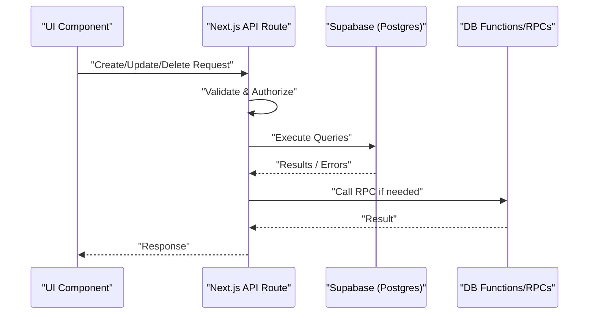
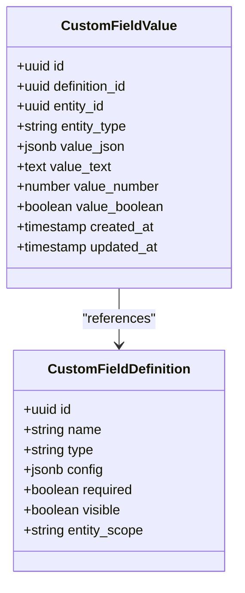
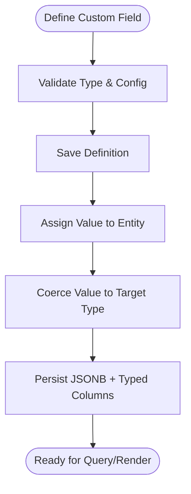
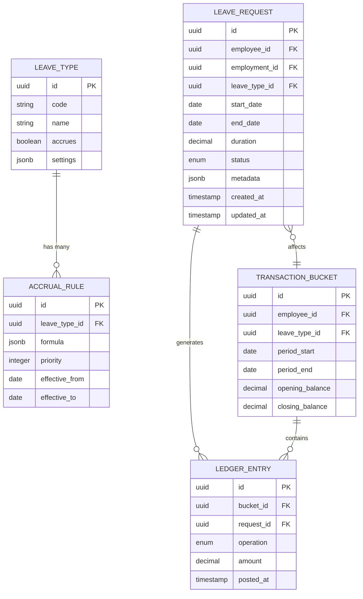
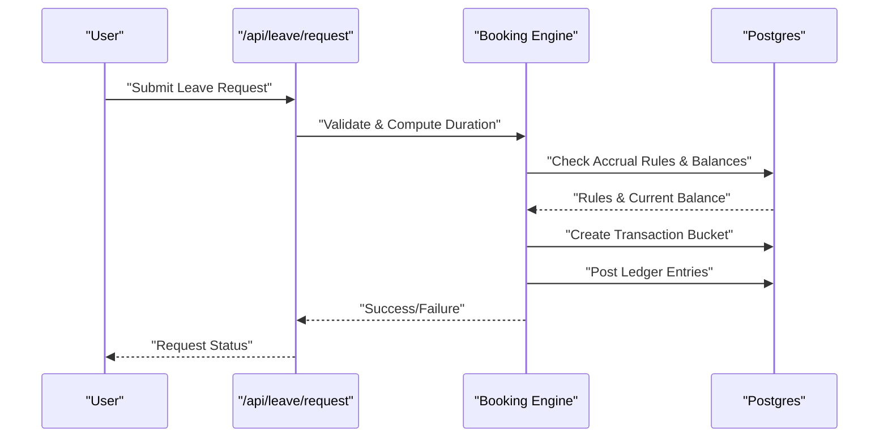
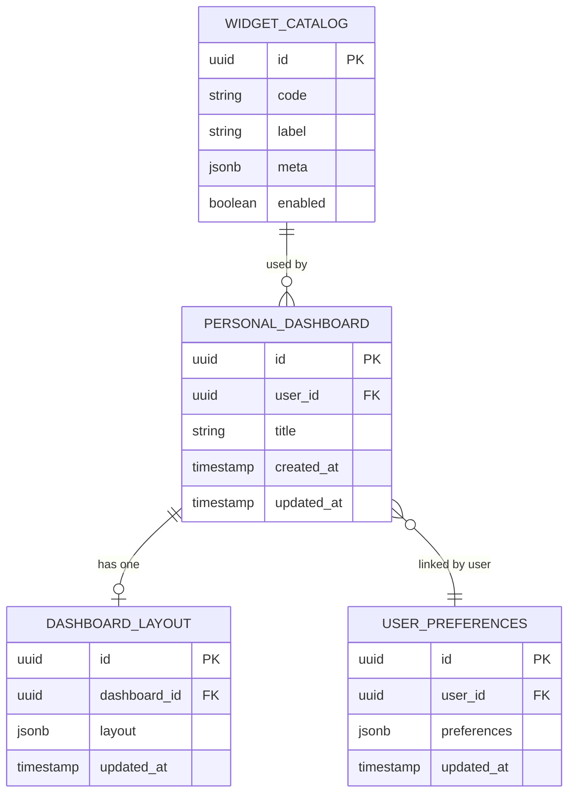
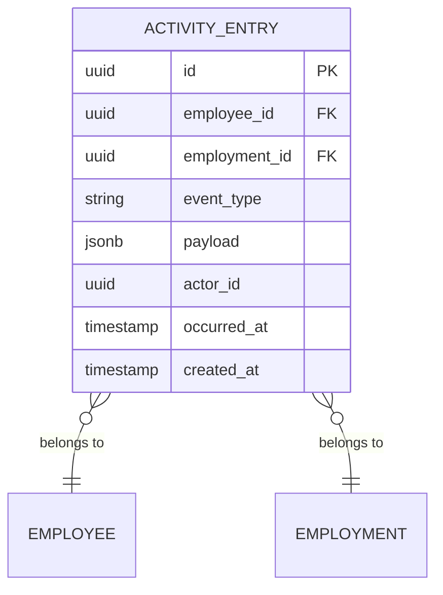
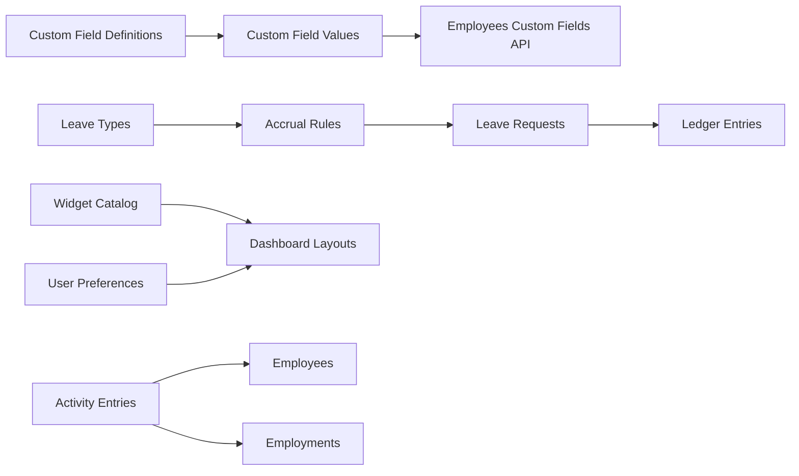

# Advanced Features Schema

<cite>
**Referenced Files in This Document**
- [20260715122802_add_custom_field_definitions.sql](file://apps/hr-suite/supabase/migrations/20260715122802_add_custom_field_definitions.sql)
- [20260715123119_add_custom_field_value_rpc.sql](file://apps/hr-suite/supabase/migrations/20260715123119_add_custom_field_value_rpc.sql)
- [20260715123927_harden_custom_field_values.sql](file://apps/hr-suite/supabase/migrations/20260715123927_harden_custom_field_values.sql)
- [20260718170000_add_dashboard_widget_catalog.sql](file://apps/hr-suite/supabase/migrations/20260718170000_add_dashboard_widget_catalog.sql)
- [20260718172000_expand_personal_dashboard_widget_types.sql](file://apps/hr-suite/supabase/migrations/20260718172000_expand_personal_dashboard_widget_types.sql)
- [20260718173000_tune_dashboard_widget_policies.sql](file://apps/hr-suite/supabase/migrations/20260718173000_tune_dashboard_widget_policies.sql)
- [20260718180354_add_date_time_user_preferences.sql](file://apps/hr-suite/supabase/migrations/20260718180354_add_date_time_user_preferences.sql)
- [20260719112000_add_week_numbering_user_preference.sql](file://apps/hr-suite/supabase/migrations/20260719112000_add_week_numbering_user_preference.sql)
- [20260722142551_add_leave_engine_foundation.sql](file://apps/hr-suite/supabase/migrations/20260722142551_add_leave_engine_foundation.sql)
- [20260722144232_add_leave_engine_fk_indexes.sql](file://apps/hr-suite/supabase/migrations/20260722144232_add_leave_engine_fk_indexes.sql)
- [20260722144344_add_leave_transaction_bucket_fk_index.sql](file://apps/hr-suite/supabase/migrations/20260722144344_add_leave_transaction_bucket_fk_index.sql)
- [20260722151920_add_leave_configuration_mutation_functions.sql](file://apps/hr-suite/supabase/migrations/20260722151920_add_leave_configuration_mutation_functions.sql)
- [20260722190000_add_leave_request_booking_engine.sql](file://apps/hr-suite/supabase/migrations/20260722190000_add_leave_request_booking_engine.sql)
- [20260722191500_add_leave_request_fk_indexes.sql](file://apps/hr-suite/supabase/migrations/20260722191500_add_leave_request_fk_indexes.sql)
- [20260722192000_add_leave_ledger_operations.sql](file://apps/hr-suite/supabase/migrations/20260722192000_add_leave_ledger_operations.sql)
- [20260722192100_seed_leave_demo_year_controls.sql](file://apps/hr-suite/supabase/migrations/20260722192100_seed_leave_demo_year_controls.sql)
- [20260722192500_skip_holidays_in_leave_requests.sql](file://apps/hr-suite/supabase/migrations/20260722192500_skip_holidays_in_leave_requests.sql)
- [20260724160000_add_employee_activity_entries.sql](file://apps/hr-suite/supabase/migrations/20260724160000_add_employee_activity_entries.sql)
- [20260724172716_harden_employee_activity_entries.sql](file://apps/hr-suite/supabase/migrations/20260724172716_harden_employee_activity_entries.sql)
- [custom-fields/route.ts](file://apps/hr-suite/app/api/custom-fields/route.ts)
- [custom-fields/[definitionId]/route.ts](file://apps/hr-suite/app/api/custom-fields/[definitionId]/route.ts)
- [employees/[employeeId]/custom-fields/route.ts](file://apps/hr-suite/app/api/employees/[employeeId]/custom-fields/route.ts)
- [dashboards/[dashboardId]/layout/route.ts](file://apps/hr-suite/app/api/dashboards/[dashboardId]/layout/route.ts)
- [dashboards/[dashboardId]/route.ts](file://apps/hr-suite/app/api/dashboards/[dashboardId]/route.ts)
- [preferences/employee-dashboard/route.ts](file://apps/hr-suite/app/api/preferences/employee-dashboard/route.ts)
- [leave/catalog/route.ts](file://apps/hr-suite/app/api/leave/catalog/route.ts)
- [leave/request/route.ts](file://apps/hr-suite/app/api/leave/request/route.ts)
- [leave/balance-report/route.ts](file://apps/hr-suite/app/api/leave/balance-report/route.ts)
- [leave/ledger/route.ts](file://apps/hr-suite/app/api/leave/ledger/route.ts)
- [employees/[employeeId]/activity/route.ts](file://apps/hr-suite/app/api/employees/[employeeId]/activity/route.ts)
- [update-user-preferences.ts](file://apps/hr-suite/app/actions/update-user-preferences.ts)
</cite>

## Table of Contents
1. Introduction
2. Project Structure
3. Core Components
4. Architecture Overview
5. Detailed Component Analysis
6. Dependency Analysis
7. Performance Considerations
8. Troubleshooting Guide
9. Conclusion

## Introduction
This document provides detailed schema documentation for LiquidHR’s advanced features: custom fields, leave management, dashboard widgets, and activity tracking. It explains the dynamic custom field system (definitions, values, type handling), the leave engine schema (requests, accruals, balances, approvals), the dashboard widget catalog with user preferences and layout persistence, and the activity entry system for audit trails and employee timelines. It also covers complex relationship mappings, JSONB usage patterns, performance considerations, and data migration strategies for evolving schemas and backward compatibility.

## Project Structure
The advanced features are implemented across Supabase migrations (schema definitions, indexes, policies, functions), Next.js API routes (CRUD and workflows), and UI components/pages. The key areas are:
- Custom Fields: definition and value storage via dedicated tables and RPC helpers
- Leave Engine: configuration, requests, ledger, and balance reporting
- Dashboard Widgets: catalog, personal dashboards, layouts, and user preferences
- Activity Tracking: structured entries for audit trails and timelines

```mermaid
graph TB
subgraph "Schema (Supabase Migrations)"
CF["Custom Field Definitions<br/>and Values"]
LW["Dashboard Widget Catalog<br/>and Personal Dashboards"]
LE["Leave Engine Foundation<br/>and Booking/Ledger"]
AT["Employee Activity Entries"]
end
subgraph "API Routes"
CFR["/api/custom-fields/*"]
EMP_CF["/api/employees/:id/custom-fields"]
DASH_R["/api/dashboards/:id"]
DASH_L["/api/dashboards/:id/layout"]
PREF["/api/preferences/employee-dashboard"]
LCAT["/api/leave/catalog"]
LREQ["/api/leave/request"]
LBAL["/api/leave/balance-report"]
LLED["/api/leave/ledger"]
ACT["/api/employees/:id/activity"]
end
subgraph "UI"
CF_UI["Custom Fields Manager"]
DASH_UI["Dashboard Editor & Workspace"]
LE_UI["Leave Catalog & Request Flows"]
ACT_UI["Employee Activity Feed"]
end
CF --> CFR
CF --> EMP_CF
LW --> DASH_R
LW --> DASH_L
LW --> PREF
LE --> LCAT
LE --> LREQ
LE --> LBAL
LE --> LLED
AT --> ACT
CF_UI --> CFR
CF_UI --> EMP_CF
DASH_UI --> DASH_R
DASH_UI --> DASH_L
DASH_UI --> PREF
LE_UI --> LCAT
LE_UI --> LREQ
LE_UI --> LBAL
LE_UI --> LLED
ACT_UI --> ACT
```

**Diagram sources**
- [20260715122802_add_custom_field_definitions.sql](file://apps/hr-suite/supabase/migrations/20260715122802_add_custom_field_definitions.sql)
- [20260715123119_add_custom_field_value_rpc.sql](file://apps/hr-suite/supabase/migrations/20260715123119_add_custom_field_value_rpc.sql)
- [20260718170000_add_dashboard_widget_catalog.sql](file://apps/hr-suite/supabase/migrations/20260718170000_add_dashboard_widget_catalog.sql)
- [20260722142551_add_leave_engine_foundation.sql](file://apps/hr-suite/supabase/migrations/20260722142551_add_leave_engine_foundation.sql)
- [20260724160000_add_employee_activity_entries.sql](file://apps/hr-suite/supabase/migrations/20260724160000_add_employee_activity_entries.sql)
- [custom-fields/route.ts](file://apps/hr-suite/app/api/custom-fields/route.ts)
- [employees/[employeeId]/custom-fields/route.ts](file://apps/hr-suite/app/api/employees/[employeeId]/custom-fields/route.ts)
- [dashboards/[dashboardId]/route.ts](file://apps/hr-suite/app/api/dashboards/[dashboardId]/route.ts)
- [dashboards/[dashboardId]/layout/route.ts](file://apps/hr-suite/app/api/dashboards/[dashboardId]/layout/route.ts)
- [preferences/employee-dashboard/route.ts](file://apps/hr-suite/app/api/preferences/employee-dashboard/route.ts)
- [leave/catalog/route.ts](file://apps/hr-suite/app/api/leave/catalog/route.ts)
- [leave/request/route.ts](file://apps/hr-suite/app/api/leave/request/route.ts)
- [leave/balance-report/route.ts](file://apps/hr-suite/app/api/leave/balance-report/route.ts)
- [leave/ledger/route.ts](file://apps/hr-suite/app/api/leave/ledger/route.ts)
- [employees/[employeeId]/activity/route.ts](file://apps/hr-suite/app/api/employees/[employeeId]/activity/route.ts)

**Section sources**
- [20260715122802_add_custom_field_definitions.sql](file://apps/hr-suite/supabase/migrations/20260715122802_add_custom_field_definitions.sql)
- [20260718170000_add_dashboard_widget_catalog.sql](file://apps/hr-suite/supabase/migrations/20260718170000_add_dashboard_widget_catalog.sql)
- [20260722142551_add_leave_engine_foundation.sql](file://apps/hr-suite/supabase/migrations/20260722142551_add_leave_engine_foundation.sql)
- [20260724160000_add_employee_activity_entries.sql](file://apps/hr-suite/supabase/migrations/20260724160000_add_employee_activity_entries.sql)

## Core Components
- Custom Fields: Definition-driven extensible attributes for entities with typed values stored efficiently using JSONB and normalized columns where appropriate.
- Leave Engine: A comprehensive model covering leave types, accrual rules, request lifecycle, transaction buckets, and a double-entry style ledger for balances.
- Dashboard Widgets: A catalog of reusable widgets, personal dashboard instances, per-user layout persistence, and preference storage.
- Activity Tracking: Structured audit entries linked to employees and employments, enabling timelines and compliance logs.

**Section sources**
- [20260715122802_add_custom_field_definitions.sql](file://apps/hr-suite/supabase/migrations/20260715122802_add_custom_field_definitions.sql)
- [20260715123119_add_custom_field_value_rpc.sql](file://apps/hr-suite/supabase/migrations/20260715123119_add_custom_field_value_rpc.sql)
- [20260718170000_add_dashboard_widget_catalog.sql](file://apps/hr-suite/supabase/migrations/20260718170000_add_dashboard_widget_catalog.sql)
- [20260722142551_add_leave_engine_foundation.sql](file://apps/hr-suite/supabase/migrations/20260722142551_add_leave_engine_foundation.sql)
- [20260724160000_add_employee_activity_entries.sql](file://apps/hr-suite/supabase/migrations/20260724160000_add_employee_activity_entries.sql)

## Architecture Overview
The advanced features follow a layered architecture:
- Data Layer: Supabase Postgres schema with tables, indexes, policies, and functions/RPCs.
- API Layer: Next.js API routes orchestrating validation, authorization, and business logic.
- Presentation Layer: React components and pages driving user interactions.

**Diagram sources**
- [custom-fields/route.ts](file://apps/hr-suite/app/api/custom-fields/route.ts)
- [20260715123119_add_custom_field_value_rpc.sql](file://apps/hr-suite/supabase/migrations/20260715123119_add_custom_field_value_rpc.sql)
- [leave/request/route.ts](file://apps/hr-suite/app/api/leave/request/route.ts)
- [20260722190000_add_leave_request_booking_engine.sql](file://apps/hr-suite/supabase/migrations/20260722190000_add_leave_request_booking_engine.sql)

## Detailed Component Analysis

### Custom Fields System
The custom fields system enables dynamic attribute extension for entities through definitions and typed values.

Key schema elements:
- Custom field definitions: define name, type, constraints, visibility, and entity scope.
- Custom field values: store typed values per entity instance; uses JSONB for flexible storage and normalized columns when applicable.
- RPC helpers: provide safe read/write operations with type coercion and validation.

**Diagram sources**
- [20260715122802_add_custom_field_definitions.sql](file://apps/hr-suite/supabase/migrations/20260715122802_add_custom_field_definitions.sql)
- [20260715123119_add_custom_field_value_rpc.sql](file://apps/hr-suite/supabase/migrations/20260715123119_add_custom_field_value_rpc.sql)

Data flow:
- Definitions are managed centrally and referenced by values.
- Values are stored with a combination of JSONB and typed columns to optimize queries and enforce constraints.
- RPCs encapsulate type-safe reads/writes and ensure consistency.

**Diagram sources**
- [20260715123119_add_custom_field_value_rpc.sql](file://apps/hr-suite/supabase/migrations/20260715123119_add_custom_field_value_rpc.sql)

API endpoints:
- Manage definitions and values at tenant level.
- Scoped endpoints for employee-specific custom fields.

**Section sources**
- [20260715122802_add_custom_field_definitions.sql](file://apps/hr-suite/supabase/migrations/20260715122802_add_custom_field_definitions.sql)
- [20260715123119_add_custom_field_value_rpc.sql](file://apps/hr-suite/supabase/migrations/20260715123119_add_custom_field_value_rpc.sql)
- [20260715123927_harden_custom_field_values.sql](file://apps/hr-suite/supabase/migrations/20260715123927_harden_custom_field_values.sql)
- [custom-fields/route.ts](file://apps/hr-suite/app/api/custom-fields/route.ts)
- [employees/[employeeId]/custom-fields/route.ts](file://apps/hr-suite/app/api/employees/[employeeId]/custom-fields/route.ts)

### Leave Management Engine
The leave engine supports leave types, accrual rules, request workflows, transaction buckets, and a ledger for accurate balance tracking.

Core schema elements:
- Leave types and catalogs: define available leave categories and defaults.
- Accrual rules: specify accrual calculations based on work hours, priority rules, and time periods.
- Requests: capture intent, dates, duration, status, and approval workflow state.
- Transaction buckets: group transactions by period or rule application.
- Ledger: records debits/credits for precise balance reconciliation.

**Diagram sources**
- [20260722142551_add_leave_engine_foundation.sql](file://apps/hr-suite/supabase/migrations/20260722142551_add_leave_engine_foundation.sql)
- [20260722190000_add_leave_request_booking_engine.sql](file://apps/hr-suite/supabase/migrations/20260722190000_add_leave_request_booking_engine.sql)
- [20260722192000_add_leave_ledger_operations.sql](file://apps/hr-suite/supabase/migrations/20260722192000_add_leave_ledger_operations.sql)

Request workflow:
- Create request -> validate against accrual rules -> compute duration -> create transaction bucket -> post ledger entries -> update balances.

**Diagram sources**
- [leave/request/route.ts](file://apps/hr-suite/app/api/leave/request/route.ts)
- [20260722190000_add_leave_request_booking_engine.sql](file://apps/hr-suite/supabase/migrations/20260722190000_add_leave_request_booking_engine.sql)

Balance and ledger:
- Balance reports aggregate ledger entries per bucket and type.
- Ledger ensures double-entry integrity and auditability.

**Section sources**
- [20260722142551_add_leave_engine_foundation.sql](file://apps/hr-suite/supabase/migrations/20260722142551_add_leave_engine_foundation.sql)
- [20260722144232_add_leave_engine_fk_indexes.sql](file://apps/hr-suite/supabase/migrations/20260722144232_add_leave_engine_fk_indexes.sql)
- [20260722144344_add_leave_transaction_bucket_fk_index.sql](file://apps/hr-suite/supabase/migrations/20260722144344_add_leave_transaction_bucket_fk_index.sql)
- [20260722151920_add_leave_configuration_mutation_functions.sql](file://apps/hr-suite/supabase/migrations/20260722151920_add_leave_configuration_mutation_functions.sql)
- [20260722190000_add_leave_request_booking_engine.sql](file://apps/hr-suite/supabase/migrations/20260722190000_add_leave_request_booking_engine.sql)
- [20260722191500_add_leave_request_fk_indexes.sql](file://apps/hr-suite/supabase/migrations/20260722191500_add_leave_request_fk_indexes.sql)
- [20260722192000_add_leave_ledger_operations.sql](file://apps/hr-suite/supabase/migrations/20260722192000_add_leave_ledger_operations.sql)
- [20260722192100_seed_leave_demo_year_controls.sql](file://apps/hr-suite/supabase/migrations/20260722192100_seed_leave_demo_year_controls.sql)
- [20260722192500_skip_holidays_in_leave_requests.sql](file://apps/hr-suite/supabase/migrations/20260722192500_skip_holidays_in_leave_requests.sql)
- [leave/catalog/route.ts](file://apps/hr-suite/app/api/leave/catalog/route.ts)
- [leave/request/route.ts](file://apps/hr-suite/app/api/leave/request/route.ts)
- [leave/balance-report/route.ts](file://apps/hr-suite/app/api/leave/balance-report/route.ts)
- [leave/ledger/route.ts](file://apps/hr-suite/app/api/leave/ledger/route.ts)

### Dashboard Widgets and Preferences
The dashboard system includes a widget catalog, personal dashboards, layout persistence, and user preferences.

Key schema elements:
- Widget catalog: defines available widgets, metadata, and rendering hints.
- Personal dashboards: user-owned dashboard instances.
- Layouts: JSON-based layout definitions persisted per dashboard.
- Preferences: per-user settings including date/time formats and week numbering.

**Diagram sources**
- [20260718170000_add_dashboard_widget_catalog.sql](file://apps/hr-suite/supabase/migrations/20260718170000_add_dashboard_widget_catalog.sql)
- [20260718172000_expand_personal_dashboard_widget_types.sql](file://apps/hr-suite/supabase/migrations/20260718172000_expand_personal_dashboard_widget_types.sql)
- [20260718180354_add_date_time_user_preferences.sql](file://apps/hr-suite/supabase/migrations/20260718180354_add_date_time_user_preferences.sql)
- [20260719112000_add_week_numbering_user_preference.sql](file://apps/hr-suite/supabase/migrations/20260719112000_add_week_numbering_user_preference.sql)

Layout persistence flow:
- Users edit dashboard layout -> save JSON structure -> persist to database -> render dynamically based on widget catalog.

**Section sources**
- [20260718170000_add_dashboard_widget_catalog.sql](file://apps/hr-suite/supabase/migrations/20260718170000_add_dashboard_widget_catalog.sql)
- [20260718172000_expand_personal_dashboard_widget_types.sql](file://apps/hr-suite/supabase/migrations/20260718172000_expand_personal_dashboard_widget_types.sql)
- [20260718173000_tune_dashboard_widget_policies.sql](file://apps/hr-suite/supabase/migrations/20260718173000_tune_dashboard_widget_policies.sql)
- [20260718180354_add_date_time_user_preferences.sql](file://apps/hr-suite/supabase/migrations/20260718180354_add_date_time_user_preferences.sql)
- [20260719112000_add_week_numbering_user_preference.sql](file://apps/hr-suite/supabase/migrations/20260719112000_add_week_numbering_user_preference.sql)
- [dashboards/[dashboardId]/route.ts](file://apps/hr-suite/app/api/dashboards/[dashboardId]/route.ts)
- [dashboards/[dashboardId]/layout/route.ts](file://apps/hr-suite/app/api/dashboards/[dashboardId]/layout/route.ts)
- [preferences/employee-dashboard/route.ts](file://apps/hr-suite/app/api/preferences/employee-dashboard/route.ts)
- [update-user-preferences.ts](file://apps/hr-suite/app/actions/update-user-preferences.ts)

### Activity Tracking System
Activity entries provide an audit trail and timeline view for employees.

Key schema elements:
- Activity entries: structured records linking to employees and employments, capturing event type, payload, timestamps, and actor.

**Diagram sources**
- [20260724160000_add_employee_activity_entries.sql](file://apps/hr-suite/supabase/migrations/20260724160000_add_employee_activity_entries.sql)
- [20260724172716_harden_employee_activity_entries.sql](file://apps/hr-suite/supabase/migrations/20260724172716_harden_employee_activity_entries.sql)

Timeline generation:
- Aggregate activity entries by employee and employment -> sort by occurred_at -> present as timeline.

**Section sources**
- [20260724160000_add_employee_activity_entries.sql](file://apps/hr-suite/supabase/migrations/20260724160000_add_employee_activity_entries.sql)
- [20260724172716_harden_employee_activity_entries.sql](file://apps/hr-suite/supabase/migrations/20260724172716_harden_employee_activity_entries.sql)
- [employees/[employeeId]/activity/route.ts](file://apps/hr-suite/app/api/employees/[employeeId]/activity/route.ts)

## Dependency Analysis
Inter-component dependencies:
- Custom Fields depend on definitions and use RPCs for type-safe operations.
- Leave Engine depends on leave types, accrual rules, and generates ledger entries affecting balances.
- Dashboard Widgets rely on catalog metadata and persist layouts and preferences per user.
- Activity Tracking links to employees and employments for contextual timelines.

**Diagram sources**
- [20260715122802_add_custom_field_definitions.sql](file://apps/hr-suite/supabase/migrations/20260715122802_add_custom_field_definitions.sql)
- [20260722142551_add_leave_engine_foundation.sql](file://apps/hr-suite/supabase/migrations/20260722142551_add_leave_engine_foundation.sql)
- [20260718170000_add_dashboard_widget_catalog.sql](file://apps/hr-suite/supabase/migrations/20260718170000_add_dashboard_widget_catalog.sql)
- [20260724160000_add_employee_activity_entries.sql](file://apps/hr-suite/supabase/migrations/20260724160000_add_employee_activity_entries.sql)

**Section sources**
- [20260715122802_add_custom_field_definitions.sql](file://apps/hr-suite/supabase/migrations/20260715122802_add_custom_field_definitions.sql)
- [20260722142551_add_leave_engine_foundation.sql](file://apps/hr-suite/supabase/migrations/20260722142551_add_leave_engine_foundation.sql)
- [20260718170000_add_dashboard_widget_catalog.sql](file://apps/hr-suite/supabase/migrations/20260718170000_add_dashboard_widget_catalog.sql)
- [20260724160000_add_employee_activity_entries.sql](file://apps/hr-suite/supabase/migrations/20260724160000_add_employee_activity_entries.sql)

## Performance Considerations
- Use JSONB judiciously: store flexible structures but add indexed columns for frequently queried fields.
- Leverage indexes on foreign keys and common filters (e.g., employee_id, leave_type_id, occurred_at).
- Prefer RPCs for complex validations and type coercions to reduce client-side overhead.
- Partition large tables (e.g., ledger entries) by time ranges if growth is significant.
- Cache static catalogs (widgets, leave types) at the edge or application layer.
- Optimize queries with selective projections and avoid N+1 patterns.

[No sources needed since this section provides general guidance]

## Troubleshooting Guide
Common issues and resolutions:
- Custom field type mismatches: ensure RPC coercion matches definition types; validate payloads before writes.
- Leave balance discrepancies: verify ledger postings and bucket boundaries; check accrual rule effective dates.
- Dashboard layout corruption: validate JSON schema on save; fallback to default layout on parse errors.
- Activity timeline gaps: confirm actor_id and occurred_at timestamps; ensure consistent event emission.

**Section sources**
- [20260715123119_add_custom_field_value_rpc.sql](file://apps/hr-suite/supabase/migrations/20260715123119_add_custom_field_value_rpc.sql)
- [20260722192000_add_leave_ledger_operations.sql](file://apps/hr-suite/supabase/migrations/20260722192000_add_leave_ledger_operations.sql)
- [20260718173000_tune_dashboard_widget_policies.sql](file://apps/hr-suite/supabase/migrations/20260718173000_tune_dashboard_widget_policies.sql)
- [20260724172716_harden_employee_activity_entries.sql](file://apps/hr-suite/supabase/migrations/20260724172716_harden_employee_activity_entries.sql)

## Conclusion
LiquidHR’s advanced features are built on a robust schema design that balances flexibility with performance. Custom fields enable dynamic extensibility, the leave engine ensures accurate accruals and balances through a ledger, dashboard widgets support personalized experiences with persistent layouts, and activity tracking provides comprehensive audit trails. By following the documented patterns and considering performance and migration strategies, teams can evolve schemas safely while maintaining backward compatibility and operational reliability.

[No sources needed since this section summarizes without analyzing specific files]