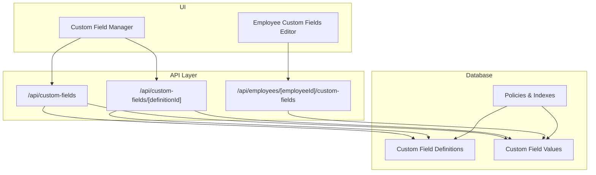
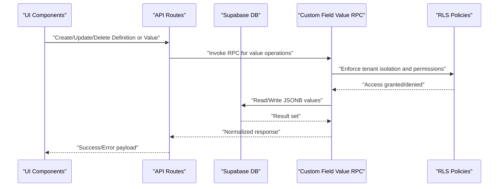
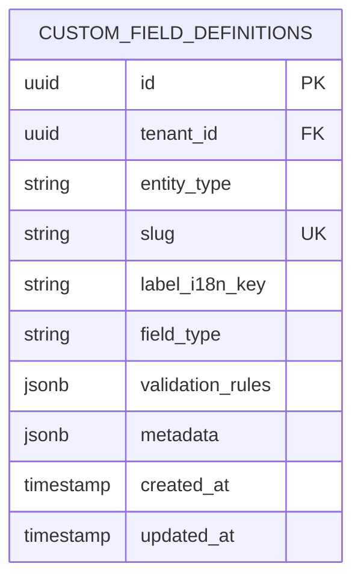
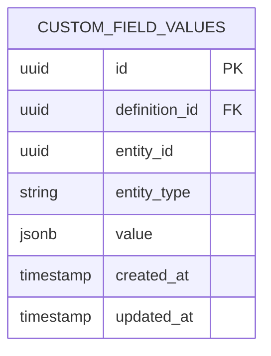
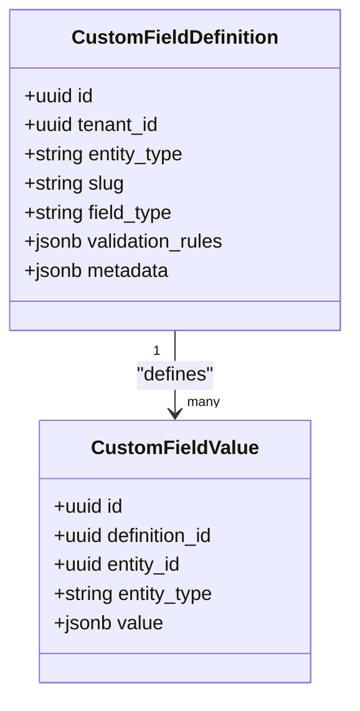
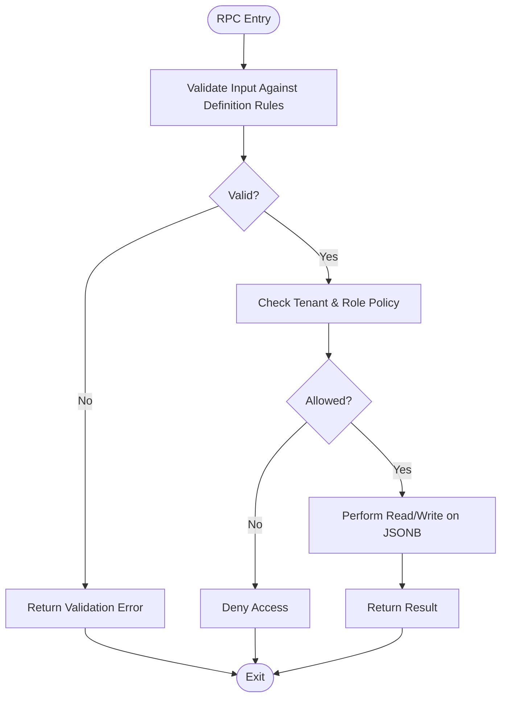
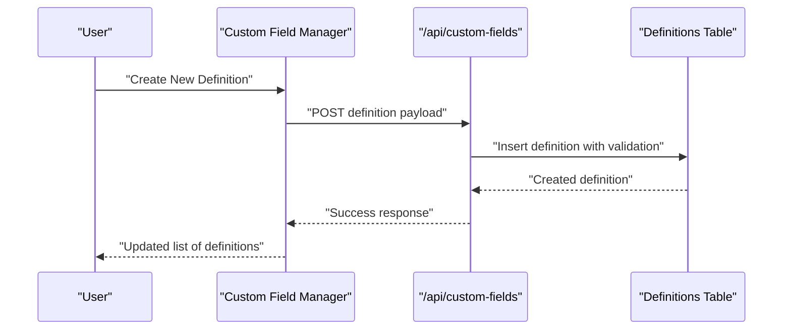
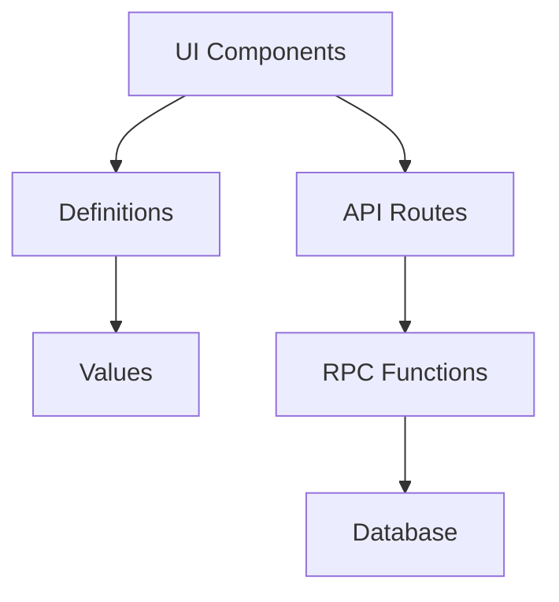

# Custom Fields Schema

<cite>
**Referenced Files in This Document**
- [20260715122802_add_custom_field_definitions.sql](file://apps/hr-suite/supabase/migrations/20260715122802_add_custom_field_definitions.sql)
- [20260715123119_add_custom_field_value_rpc.sql](file://apps/hr-suite/supabase/migrations/20260715123119_add_custom_field_value_rpc.sql)
- [20260715123927_harden_custom_field_values.sql](file://apps/hr-suite/supabase/migrations/20260715123927_harden_custom_field_values.sql)
- [20260715131230_seed_custom_fields_and_tenant_roles.sql](file://apps/hr-suite/supabase/migrations/20260715131230_seed_custom_fields_and_tenant_roles.sql)
- [custom-fields/route.ts](file://apps/hr-suite/app/api/custom-fields/route.ts)
- [custom-fields/[definitionId]/route.ts](file://apps/hr-suite/app/api/custom-fields/[definitionId]/route.ts)
- [employees/[employeeId]/custom-fields/route.ts](file://apps/hr-suite/app/api/employees/[employeeId]/custom-fields/route.ts)
- [custom-field-manager.tsx](file://apps/hr-suite/components/custom-fields/custom-field-manager.tsx)
- [employee-custom-fields.tsx](file://apps/hr-suite/components/custom-fields/employee-custom-fields.tsx)
- [VRIJE_VELDEN.md](file://docs/requirements/custom-fields/VRIJE_VELDEN.md)
</cite>

## Table of Contents
1. [Introduction](#introduction)
2. [Project Structure](#project-structure)
3. [Core Components](#core-components)
4. [Architecture Overview](#architecture-overview)
5. [Detailed Component Analysis](#detailed-component-analysis)
6. [Dependency Analysis](#dependency-analysis)
7. [Performance Considerations](#performance-considerations)
8. [Troubleshooting Guide](#troubleshooting-guide)
9. [Conclusion](#conclusion)
10. [Appendices](#appendices)

## Introduction
This document provides comprehensive schema documentation for LiquidHR’s custom fields system. It explains the custom field definitions table structure, supported field types and validation rules, metadata storage, and the dynamic value storage mechanism using JSONB to support flexible data types across entities such as employees and employments. It also details the RPC functions that enable efficient custom field operations, indexing strategies for performance, and security policies for tenant isolation. Finally, it includes examples of common custom field patterns, migration approaches, and best practices for extending the system with new field types.

## Project Structure
The custom fields feature spans database migrations, API routes, and UI components:
- Database schema and policies are defined in Supabase migrations under apps/hr-suite/supabase/migrations.
- API endpoints expose CRUD operations for custom field definitions and values under apps/hr-suite/app/api/custom-fields and per-entity endpoints like employees.
- UI components provide managers and editors for custom fields under apps/hr-suite/components/custom-fields.

**Diagram sources**
- [20260715122802_add_custom_field_definitions.sql](file://apps/hr-suite/supabase/migrations/20260715122802_add_custom_field_definitions.sql)
- [20260715123119_add_custom_field_value_rpc.sql](file://apps/hr-suite/supabase/migrations/20260715123119_add_custom_field_value_rpc.sql)
- [20260715123927_harden_custom_field_values.sql](file://apps/hr-suite/supabase/migrations/20260715123927_harden_custom_field_values.sql)
- [custom-fields/route.ts](file://apps/hr-suite/app/api/custom-fields/route.ts)
- [custom-fields/[definitionId]/route.ts](file://apps/hr-suite/app/api/custom-fields/[definitionId]/route.ts)
- [employees/[employeeId]/custom-fields/route.ts](file://apps/hr-suite/app/api/employees/[employeeId]/custom-fields/route.ts)
- [custom-field-manager.tsx](file://apps/hr-suite/components/custom-fields/custom-field-manager.tsx)
- [employee-custom-fields.tsx](file://apps/hr-suite/components/custom-fields/employee-custom-fields.tsx)

**Section sources**
- [20260715122802_add_custom_field_definitions.sql](file://apps/hr-suite/supabase/migrations/20260715122802_add_custom_field_definitions.sql)
- [20260715123119_add_custom_field_value_rpc.sql](file://apps/hr-suite/supabase/migrations/20260715123119_add_custom_field_value_rpc.sql)
- [20260715123927_harden_custom_field_values.sql](file://apps/hr-suite/supabase/migrations/20260715123927_harden_custom_field_values.sql)
- [custom-fields/route.ts](file://apps/hr-suite/app/api/custom-fields/route.ts)
- [custom-fields/[definitionId]/route.ts](file://apps/hr-suite/app/api/custom-fields/[definitionId]/route.ts)
- [employees/[employeeId]/custom-fields/route.ts](file://apps/hr-suite/app/api/employees/[employeeId]/custom-fields/route.ts)
- [custom-field-manager.tsx](file://apps/hr-suite/components/custom-fields/custom-field-manager.tsx)
- [employee-custom-fields.tsx](file://apps/hr-suite/components/custom-fields/employee-custom-fields.tsx)

## Core Components
- Custom Field Definitions: Central registry of field schemas including type, label, validation rules, and metadata.
- Custom Field Values: Dynamic storage of field values per entity (e.g., employee, employment) using a JSONB column to accommodate diverse data types.
- RPC Functions: Server-side functions for efficient read/write operations on custom field values, enforcing validation and tenant isolation.
- API Routes: REST endpoints for managing definitions and values, delegating to RPCs where appropriate.
- UI Components: Managers and editors for defining and editing custom fields within the application context.

Key responsibilities:
- Definitions define allowed types and constraints; values store actual data per entity instance.
- Policies ensure tenant-level isolation and role-based access control.
- Indexes optimize queries by entity, definition, and commonly filtered keys.

**Section sources**
- [20260715122802_add_custom_field_definitions.sql](file://apps/hr-suite/supabase/migrations/20260715122802_add_custom_field_definitions.sql)
- [20260715123119_add_custom_field_value_rpc.sql](file://apps/hr-suite/supabase/migrations/20260715123119_add_custom_field_value_rpc.sql)
- [20260715123927_harden_custom_field_values.sql](file://apps/hr-suite/supabase/migrations/20260715123927_harden_custom_field_values.sql)

## Architecture Overview
The custom fields architecture separates schema definitions from runtime values, enabling flexible extension without altering core tables.

**Diagram sources**
- [custom-fields/route.ts](file://apps/hr-suite/app/api/custom-fields/route.ts)
- [custom-fields/[definitionId]/route.ts](file://apps/hr-suite/app/api/custom-fields/[definitionId]/route.ts)
- [employees/[employeeId]/custom-fields/route.ts](file://apps/hr-suite/app/api/employees/[employeeId]/custom-fields/route.ts)
- [20260715123119_add_custom_field_value_rpc.sql](file://apps/hr-suite/supabase/migrations/20260715123119_add_custom_field_value_rpc.sql)
- [20260715123927_harden_custom_field_values.sql](file://apps/hr-suite/supabase/migrations/20260715123927_harden_custom_field_values.sql)

## Detailed Component Analysis

### Custom Field Definitions Schema
- Purpose: Define field metadata, types, labels, validation rules, and visibility settings.
- Typical attributes include:
  - Unique identifier
  - Tenant scope
  - Entity target (e.g., employee, employment)
  - Field type (string, number, boolean, date, enum, json)
  - Validation rules (required, min/max, regex, allowed values)
  - Metadata (order, default value, i18n keys)
- Constraints:
  - Unique per tenant and entity/target combination
  - Referential integrity to tenant and entity catalogs

**Diagram sources**
- [20260715122802_add_custom_field_definitions.sql](file://apps/hr-suite/supabase/migrations/20260715122802_add_custom_field_definitions.sql)

**Section sources**
- [20260715122802_add_custom_field_definitions.sql](file://apps/hr-suite/supabase/migrations/20260715122802_add_custom_field_definitions.sql)

### Custom Field Values Storage (JSONB)
- Purpose: Store dynamic values per entity instance, supporting multiple data types via JSONB.
- Typical attributes include:
  - Unique identifier
  - Reference to definition
  - Entity reference (e.g., employee_id, employment_id)
  - JSONB value column
  - Audit timestamps
- Benefits:
  - Flexible schema evolution without migrations for each new field
  - Efficient partial updates and key-level reads/writes
- Considerations:
  - Validate against definition rules at write time
  - Use indexes on frequently queried keys when needed

**Diagram sources**
- [20260715123119_add_custom_field_value_rpc.sql](file://apps/hr-suite/supabase/migrations/20260715123119_add_custom_field_value_rpc.sql)
- [20260715123927_harden_custom_field_values.sql](file://apps/hr-suite/supabase/migrations/20260715123927_harden_custom_field_values.sql)

**Section sources**
- [20260715123119_add_custom_field_value_rpc.sql](file://apps/hr-suite/supabase/migrations/20260715123119_add_custom_field_value_rpc.sql)
- [20260715123927_harden_custom_field_values.sql](file://apps/hr-suite/supabase/migrations/20260715123927_harden_custom_field_values.sql)

### Relationship Between Definitions and Values Across Entities
- One-to-many relationship: Each definition can have many values across different entity instances.
- Entity polymorphism: Values link to an entity via entity_type and entity_id, allowing reuse across employees, employments, etc.
- Query patterns:
  - Fetch all values for an entity by joining definitions for display
  - Filter values by definition slug and entity type
  - Partial reads/writes on JSONB keys for performance

**Diagram sources**
- [20260715122802_add_custom_field_definitions.sql](file://apps/hr-suite/supabase/migrations/20260715122802_add_custom_field_definitions.sql)
- [20260715123119_add_custom_field_value_rpc.sql](file://apps/hr-suite/supabase/migrations/20260715123119_add_custom_field_value_rpc.sql)

**Section sources**
- [20260715122802_add_custom_field_definitions.sql](file://apps/hr-suite/supabase/migrations/20260715122802_add_custom_field_definitions.sql)
- [20260715123119_add_custom_field_value_rpc.sql](file://apps/hr-suite/supabase/migrations/20260715123119_add_custom_field_value_rpc.sql)

### RPC Functions for Efficient Operations
- Purpose: Provide server-side functions for reading and writing custom field values with validation and tenant isolation.
- Typical operations:
  - Get value by definition and entity
  - Set value with validation against definition rules
  - Batch update/delete for performance
- Security:
  - Enforce RLS policies based on tenant and roles
  - Validate input payloads against definition metadata

**Diagram sources**
- [20260715123119_add_custom_field_value_rpc.sql](file://apps/hr-suite/supabase/migrations/20260715123119_add_custom_field_value_rpc.sql)
- [20260715123927_harden_custom_field_values.sql](file://apps/hr-suite/supabase/migrations/20260715123927_harden_custom_field_values.sql)

**Section sources**
- [20260715123119_add_custom_field_value_rpc.sql](file://apps/hr-suite/supabase/migrations/20260715123119_add_custom_field_value_rpc.sql)
- [20260715123927_harden_custom_field_values.sql](file://apps/hr-suite/supabase/migrations/20260715123927_harden_custom_field_values.sql)

### API Routes and UI Integration
- API routes:
  - /api/custom-fields: Manage definitions (CRUD)
  - /api/custom-fields/[definitionId]: Update specific definitions
  - /api/employees/[employeeId]/custom-fields: Manage employee-specific values
- UI components:
  - Custom Field Manager: Create/edit definitions and map to entities
  - Employee Custom Fields Editor: Render forms based on definitions and persist values

**Diagram sources**
- [custom-fields/route.ts](file://apps/hr-suite/app/api/custom-fields/route.ts)
- [custom-fields/[definitionId]/route.ts](file://apps/hr-suite/app/api/custom-fields/[definitionId]/route.ts)
- [custom-field-manager.tsx](file://apps/hr-suite/components/custom-fields/custom-field-manager.tsx)

**Section sources**
- [custom-fields/route.ts](file://apps/hr-suite/app/api/custom-fields/route.ts)
- [custom-fields/[definitionId]/route.ts](file://apps/hr-suite/app/api/custom-fields/[definitionId]/route.ts)
- [employees/[employeeId]/custom-fields/route.ts](file://apps/hr-suite/app/api/employees/[employeeId]/custom-fields/route.ts)
- [custom-field-manager.tsx](file://apps/hr-suite/components/custom-fields/custom-field-manager.tsx)
- [employee-custom-fields.tsx](file://apps/hr-suite/components/custom-fields/employee-custom-fields.tsx)

## Dependency Analysis
- Database dependencies:
  - Definitions depend on tenant and entity catalogs
  - Values depend on definitions and entity instances
- API dependencies:
  - Routes depend on Supabase client and RPC functions
  - Validation logic depends on definition metadata
- UI dependencies:
  - Components depend on API responses and definition schemas to render forms

**Diagram sources**
- [20260715122802_add_custom_field_definitions.sql](file://apps/hr-suite/supabase/migrations/20260715122802_add_custom_field_definitions.sql)
- [20260715123119_add_custom_field_value_rpc.sql](file://apps/hr-suite/supabase/migrations/20260715123119_add_custom_field_value_rpc.sql)
- [custom-fields/route.ts](file://apps/hr-suite/app/api/custom-fields/route.ts)
- [custom-field-manager.tsx](file://apps/hr-suite/components/custom-fields/custom-field-manager.tsx)

**Section sources**
- [20260715122802_add_custom_field_definitions.sql](file://apps/hr-suite/supabase/migrations/20260715122802_add_custom_field_definitions.sql)
- [20260715123119_add_custom_field_value_rpc.sql](file://apps/hr-suite/supabase/migrations/20260715123119_add_custom_field_value_rpc.sql)
- [custom-fields/route.ts](file://apps/hr-suite/app/api/custom-fields/route.ts)
- [custom-field-manager.tsx](file://apps/hr-suite/components/custom-fields/custom-field-manager.tsx)

## Performance Considerations
- Indexing strategies:
  - Index definitions by tenant_id and entity_type for fast listing
  - Index values by definition_id and entity_type for quick lookups
  - Consider GIN indexes on JSONB columns for key-based queries
- Query optimization:
  - Use partial updates on JSONB to minimize payload size
  - Avoid scanning entire JSONB unless necessary; prefer targeted key access
- Concurrency:
  - Leverage RPC functions for atomic operations and validation
  - Ensure policies prevent race conditions across tenants

[No sources needed since this section provides general guidance]

## Troubleshooting Guide
Common issues and resolutions:
- Validation errors:
  - Ensure definition rules match input types and constraints
  - Check required fields and allowed values
- Tenant isolation failures:
  - Verify RLS policies allow access for current tenant and role
  - Confirm foreign keys reference correct tenant-scoped entities
- Performance bottlenecks:
  - Add appropriate indexes for frequent query patterns
  - Reduce JSONB payload size by storing only necessary keys

**Section sources**
- [20260715123927_harden_custom_field_values.sql](file://apps/hr-suite/supabase/migrations/20260715123927_harden_custom_field_values.sql)

## Conclusion
LiquidHR’s custom fields system provides a flexible, secure, and performant way to extend HR data models. By separating definitions from values and leveraging JSONB for dynamic storage, the system supports evolving requirements without schema migrations. RPC functions enforce validation and tenant isolation, while API routes and UI components offer a cohesive developer and user experience. Proper indexing and policy configuration ensure scalability and security across multi-tenant environments.

[No sources needed since this section summarizes without analyzing specific files]

## Appendices

### Common Custom Field Patterns
- Employee profile extensions:
  - Personal notes, emergency contacts, certifications
- Employment-specific attributes:
  - Contract type, probation period, work location codes
- Validation examples:
  - Required text fields with length limits
  - Enumerated choices for standardized options
  - Date ranges with overlap checks

[No sources needed since this section provides general guidance]

### Data Migration Approaches
- Adding new field types:
  - Extend definition validation rules
  - Update UI components to handle new types
- Migrating existing values:
  - Use RPC batch operations for safe updates
  - Validate transformations against new rules

[No sources needed since this section provides general guidance]

### Best Practices for Extending Field Types
- Keep validation rules centralized in definitions
- Use consistent naming conventions for slugs and keys
- Test edge cases for JSONB serialization and parsing
- Monitor query performance and add indexes as needed

[No sources needed since this section provides general guidance]