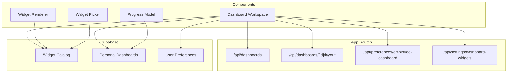
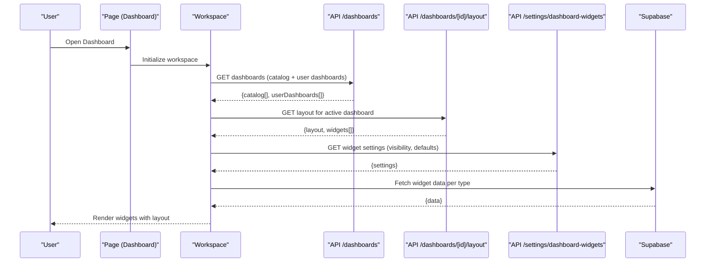
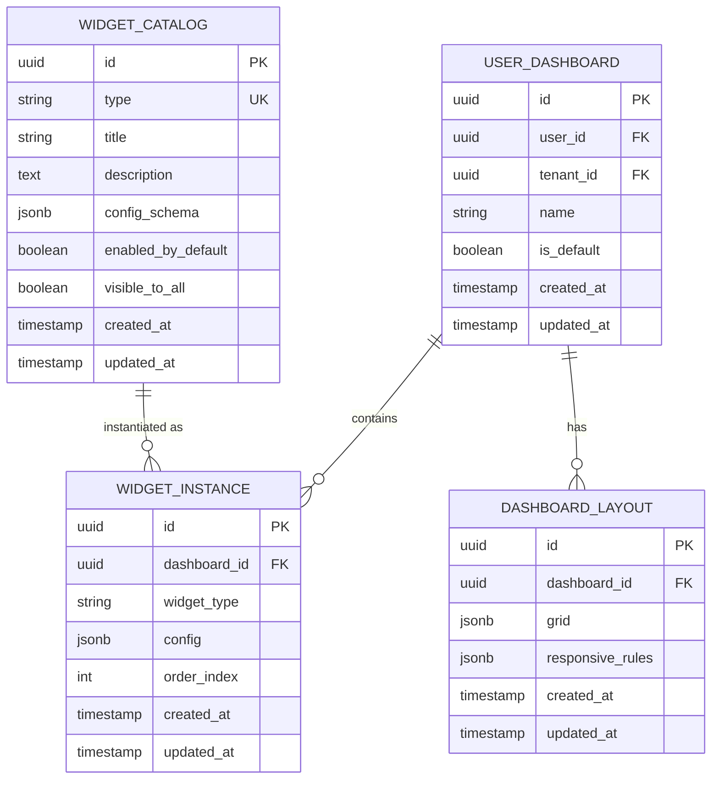
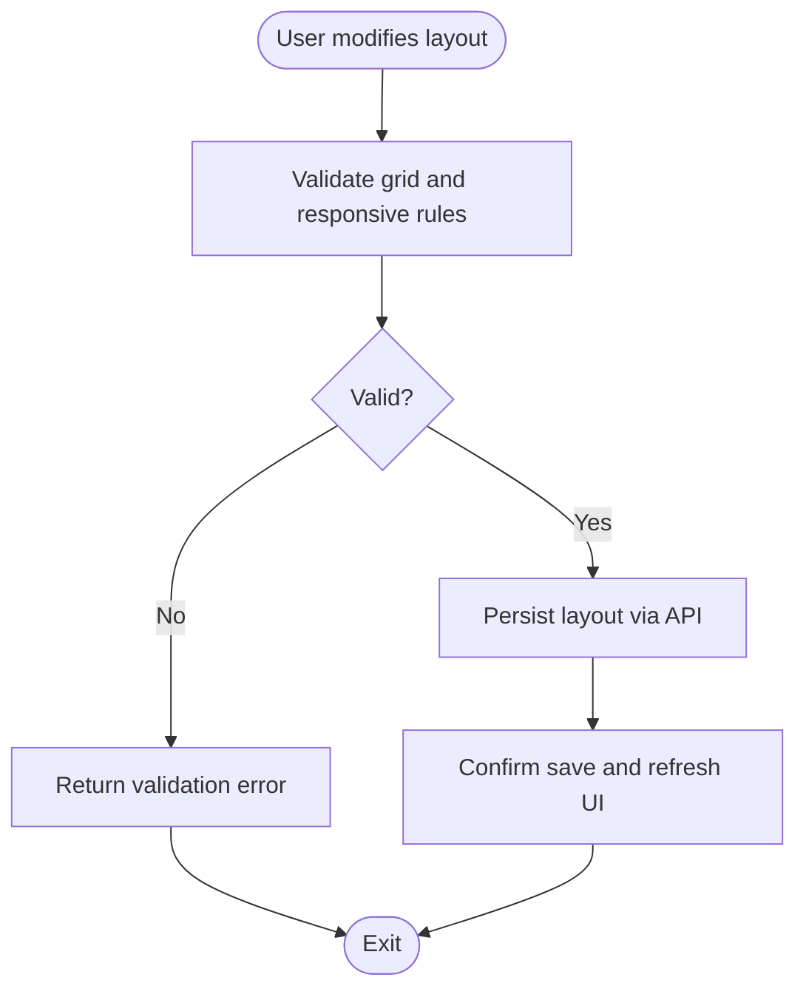
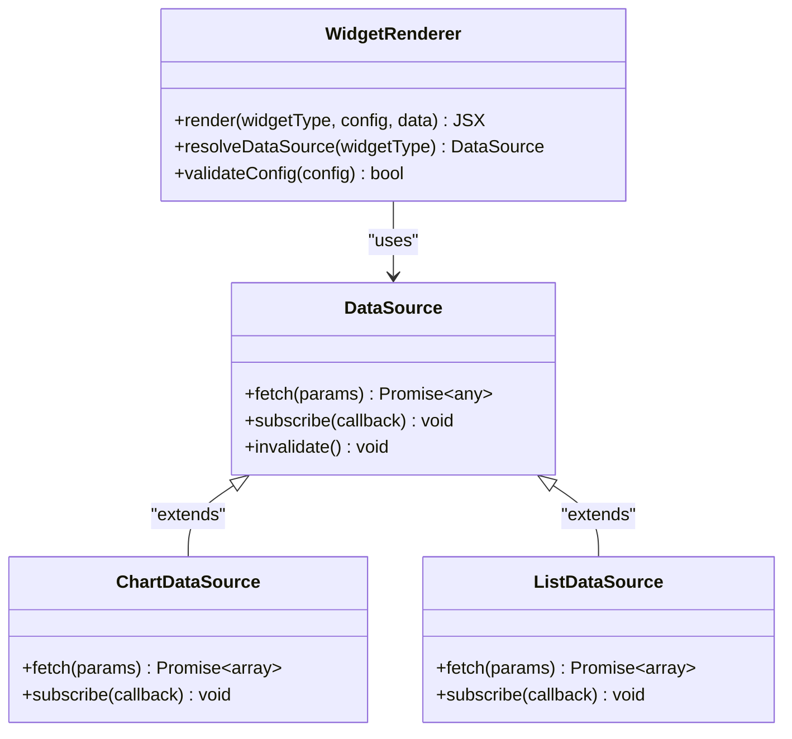
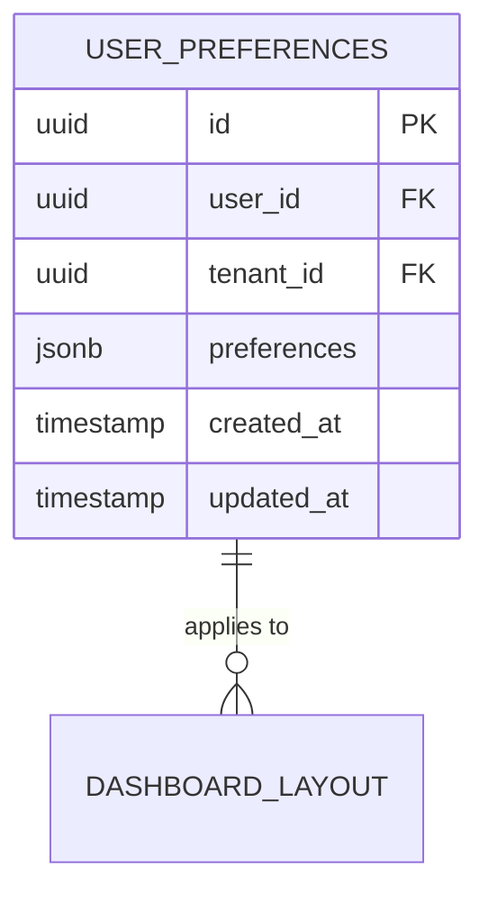
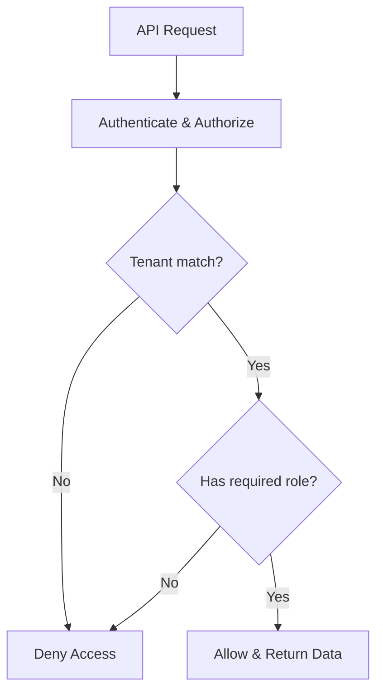
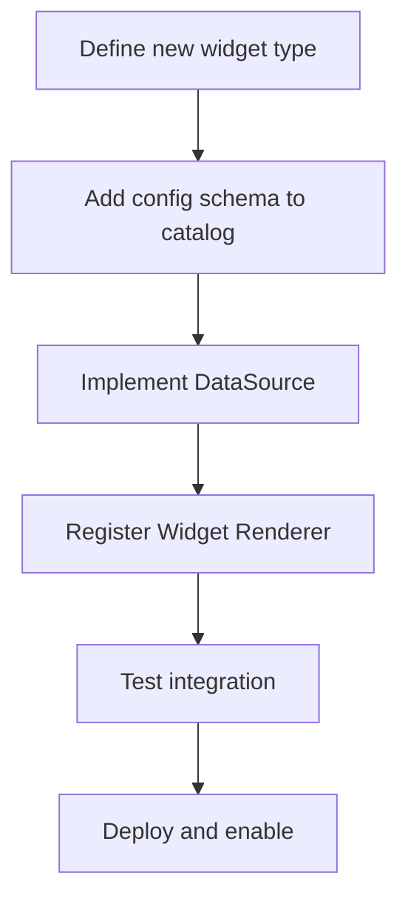
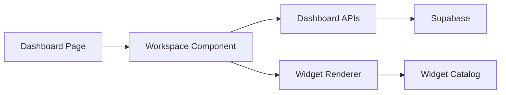

# Dashboard Widget Schema

<cite>
**Referenced Files in This Document**
- [page.tsx](file://apps/hr-suite/app/(dashboard)/dashboard/page.tsx)
- [loading.tsx](file://apps/hr-suite/app/(dashboard)/dashboard/loading.tsx)
- [layout.tsx](file://apps/hr-suite/app/(dashboard)/layout.tsx)
- [update-user-preferences.ts](file://apps/hr-suite/app/actions/update-user-preferences.ts)
- [route.ts](file://apps/hr-suite/app/api/dashboards/route.ts)
- [route.ts](file://apps/hr-suite/app/api/dashboards/[dashboardId]/route.ts)
- [route.ts](file://apps/hr-suite/app/api/dashboards/[dashboardId]/layout/route.ts)
- [route.ts](file://apps/hr-suite/app/api/preferences/employee-dashboard/route.ts)
- [route.ts](file://apps/hr-suite/app/api/settings/dashboard-widgets/route.ts)
- [dashboard-workspace.tsx](file://apps/hr-suite/components/dashboard/dashboard-workspace.tsx)
- [dashboard-workspace-model.ts](file://apps/hr-suite/components/dashboard/dashboard-workspace-model.ts)
- [dashboard-progress-model.ts](file://apps/hr-suite/components/dashboard/dashboard-progress-model.ts)
- [widget-renderer.tsx](file://apps/hr-suite/components/dashboard/widget-renderer.tsx)
- [widget-picker-dialog.tsx](file://apps/hr-suite/components/dashboard/widget-picker-dialog.tsx)
- [widget-picker-model.ts](file://apps/hr-suite/components/dashboard/widget-picker-model.ts)
- [dashboard-widget-settings-form.tsx](file://apps/hr-suite/components/settings/dashboard-widget-settings-form.tsx)
- [20260718170000_add_dashboard_widget_catalog.sql](file://apps/hr-suite/supabase/migrations/20260718170000_add_dashboard_widget_catalog.sql)
- [20260718171000_relax_dashboard_widget_read_scope.sql](file://apps/hr-suite/supabase/migrations/20260718171000_relax_dashboard_widget_read_scope.sql)
- [20260718172000_expand_personal_dashboard_widget_types.sql](file://apps/hr-suite/supabase/migrations/20260718172000_expand_personal_dashboard_widget_types.sql)
- [20260718172051_grant_dashboard_widget_admin_permissions.sql](file://apps/hr-suite/supabase/migrations/20260718172051_grant_dashboard_widget_admin_permissions.sql)
- [20260718173000_tune_dashboard_widget_policies.sql](file://apps/hr-suite/supabase/migrations/20260718173000_tune_dashboard_widget_policies.sql)
- [20260718180354_add_date_time_user_preferences.sql](file://apps/hr-suite/supabase/migrations/20260718180354_add_date_time_user_preferences.sql)
- [20260719112000_add_week_numbering_user_preference.sql](file://apps/hr-suite/supabase/migrations/20260719112000_add_week_numbering_user_preference.sql)
- [personal_dashboards.sql](file://apps/hr-suite/supabase/tests/personal_dashboards.sql)
</cite>

## Table of Contents
1. [Introduction](#introduction)
2. [Project Structure](#project-structure)
3. [Core Components](#core-components)
4. [Architecture Overview](#architecture-overview)
5. [Detailed Component Analysis](#detailed-component-analysis)
6. [Dependency Analysis](#dependency-analysis)
7. [Performance Considerations](#performance-considerations)
8. [Troubleshooting Guide](#troubleshooting-guide)
9. [Conclusion](#conclusion)
10. [Appendices](#appendices)

## Introduction
This document defines the schema and behavior of LiquidHR’s dashboard widget system. It covers the widget catalog, user-specific layouts, configuration persistence, widget type system, layout management for grid positions and responsive behavior, user preferences storage, permission model for access control and tenant isolation, performance considerations (loading, caching, real-time updates), and extension patterns for integrating external data sources.

## Project Structure
The dashboard widget system spans Next.js app routes, React components, and Supabase migrations:
- App routes expose APIs for dashboards, layouts, settings, and user preferences.
- Components implement the workspace, widget rendering, picker, and progress models.
- Migrations define the persistent schema for widget catalogs, personal dashboards, and user preferences.

**Diagram sources**
- [route.ts](file://apps/hr-suite/app/api/dashboards/route.ts)
- [route.ts](file://apps/hr-suite/app/api/dashboards/[dashboardId]/layout/route.ts)
- [route.ts](file://apps/hr-suite/app/api/preferences/employee-dashboard/route.ts)
- [route.ts](file://apps/hr-suite/app/api/settings/dashboard-widgets/route.ts)
- [dashboard-workspace.tsx](file://apps/hr-suite/components/dashboard/dashboard-workspace.tsx)
- [widget-renderer.tsx](file://apps/hr-suite/components/dashboard/widget-renderer.tsx)
- [widget-picker-dialog.tsx](file://apps/hr-suite/components/dashboard/widget-picker-dialog.tsx)
- [dashboard-progress-model.ts](file://apps/hr-suite/components/dashboard/dashboard-progress-model.ts)
- [20260718170000_add_dashboard_widget_catalog.sql](file://apps/hr-suite/supabase/migrations/20260718170000_add_dashboard_widget_catalog.sql)
- [20260718180354_add_date_time_user_preferences.sql](file://apps/hr-suite/supabase/migrations/20260718180354_add_date_time_user_preferences.sql)

**Section sources**
- [page.tsx](file://apps/hr-suite/app/(dashboard)/dashboard/page.tsx)
- [loading.tsx](file://apps/hr-suite/app/(dashboard)/dashboard/loading.tsx)
- [layout.tsx](file://apps/hr-suite/app/(dashboard)/layout.tsx)

## Core Components
- Dashboard Workspace: Orchestrates loading, layout, and rendering of widgets for a given dashboard context.
- Widget Renderer: Renders individual widgets based on their type and configuration.
- Widget Picker: Allows users to add/remove widgets from their dashboard.
- Progress Model: Tracks loading state and completion for dashboard initialization.
- Settings Form: Manages global widget catalog visibility and defaults.

Key responsibilities:
- Resolve widget catalog entries and filter by permissions.
- Load or create user-specific dashboard layouts.
- Persist layout changes and widget configurations.
- Render widgets with appropriate data sources and update strategies.

**Section sources**
- [dashboard-workspace.tsx](file://apps/hr-suite/components/dashboard/dashboard-workspace.tsx)
- [widget-renderer.tsx](file://apps/hr-suite/components/dashboard/widget-renderer.tsx)
- [widget-picker-dialog.tsx](file://apps/hr-suite/components/dashboard/widget-picker-dialog.tsx)
- [dashboard-progress-model.ts](file://apps/hr-suite/components/dashboard/dashboard-progress-model.ts)
- [dashboard-widget-settings-form.tsx](file://apps/hr-suite/components/settings/dashboard-widget-settings-form.tsx)

## Architecture Overview
The system follows a layered architecture:
- UI Layer: Next.js pages and components manage user interactions and rendering.
- API Layer: Route handlers provide CRUD operations for dashboards, layouts, and settings.
- Data Layer: Supabase stores widget catalog, personal dashboards, and user preferences.
- Authorization: Row-level policies enforce tenant isolation and role-based access.

**Diagram sources**
- [page.tsx](file://apps/hr-suite/app/(dashboard)/dashboard/page.tsx)
- [dashboard-workspace.tsx](file://apps/hr-suite/components/dashboard/dashboard-workspace.tsx)
- [route.ts](file://apps/hr-suite/app/api/dashboards/route.ts)
- [route.ts](file://apps/hr-suite/app/api/dashboards/[dashboardId]/layout/route.ts)
- [route.ts](file://apps/hr-suite/app/api/settings/dashboard-widgets/route.ts)

## Detailed Component Analysis

### Widget Catalog Schema
The widget catalog defines available visualization types, metadata, and default configurations. It is persisted in Supabase and exposed via API routes.

**Diagram sources**
- [20260718170000_add_dashboard_widget_catalog.sql](file://apps/hr-suite/supabase/migrations/20260718170000_add_dashboard_widget_catalog.sql)
- [20260718172000_expand_personal_dashboard_widget_types.sql](file://apps/hr-suite/supabase/migrations/20260718172000_expand_personal_dashboard_widget_types.sql)
- [personal_dashboards.sql](file://apps/hr-suite/supabase/tests/personal_dashboards.sql)

**Section sources**
- [20260718170000_add_dashboard_widget_catalog.sql](file://apps/hr-suite/supabase/migrations/20260718170000_add_dashboard_widget_catalog.sql)
- [20260718172000_expand_personal_dashboard_widget_types.sql](file://apps/hr-suite/supabase/migrations/20260718172000_expand_personal_dashboard_widget_types.sql)
- [personal_dashboards.sql](file://apps/hr-suite/supabase/tests/personal_dashboards.sql)

### User-Specific Layouts and Persistence
Layouts store grid positions, sizes, and responsive rules per user dashboard. Changes are persisted through dedicated API endpoints.

**Diagram sources**
- [route.ts](file://apps/hr-suite/app/api/dashboards/[dashboardId]/layout/route.ts)
- [dashboard-workspace.tsx](file://apps/hr-suite/components/dashboard/dashboard-workspace.tsx)

**Section sources**
- [route.ts](file://apps/hr-suite/app/api/dashboards/[dashboardId]/layout/route.ts)
- [dashboard-workspace.tsx](file://apps/hr-suite/components/dashboard/dashboard-workspace.tsx)

### Widget Type System and Data Sources
Widgets are typed components that consume data from various sources. The renderer selects implementation based on widget type and configuration.

**Diagram sources**
- [widget-renderer.tsx](file://apps/hr-suite/components/dashboard/widget-renderer.tsx)

**Section sources**
- [widget-renderer.tsx](file://apps/hr-suite/components/dashboard/widget-renderer.tsx)

### User Preferences Storage
User preferences include dashboard-specific settings such as date/time formats and week numbering. These are stored in Supabase and managed via API routes.

**Diagram sources**
- [20260718180354_add_date_time_user_preferences.sql](file://apps/hr-suite/supabase/migrations/20260718180354_add_date_time_user_preferences.sql)
- [20260719112000_add_week_numbering_user_preference.sql](file://apps/hr-suite/supabase/migrations/20260719112000_add_week_numbering_user_preference.sql)
- [route.ts](file://apps/hr-suite/app/api/preferences/employee-dashboard/route.ts)

**Section sources**
- [20260718180354_add_date_time_user_preferences.sql](file://apps/hr-suite/supabase/migrations/20260718180354_add_date_time_user_preferences.sql)
- [20260719112000_add_week_numbering_user_preference.sql](file://apps/hr-suite/supabase/migrations/20260719112000_add_week_numbering_user_preference.sql)
- [route.ts](file://apps/hr-suite/app/api/preferences/employee-dashboard/route.ts)

### Permission System and Tenant Isolation
Row-level policies enforce tenant isolation and role-based access for widget catalog and dashboard data. Admin roles can manage widget visibility and defaults.

**Diagram sources**
- [20260718171000_relax_dashboard_widget_read_scope.sql](file://apps/hr-suite/supabase/migrations/20260718171000_relax_dashboard_widget_read_scope.sql)
- [20260718172051_grant_dashboard_widget_admin_permissions.sql](file://apps/hr-suite/supabase/migrations/20260718172051_grant_dashboard_widget_admin_permissions.sql)
- [20260718173000_tune_dashboard_widget_policies.sql](file://apps/hr-suite/supabase/migrations/20260718173000_tune_dashboard_widget_policies.sql)

**Section sources**
- [20260718171000_relax_dashboard_widget_read_scope.sql](file://apps/hr-suite/supabase/migrations/20260718171000_relax_dashboard_widget_read_scope.sql)
- [20260718172051_grant_dashboard_widget_admin_permissions.sql](file://apps/hr-suite/supabase/migrations/20260718172051_grant_dashboard_widget_admin_permissions.sql)
- [20260718173000_tune_dashboard_widget_policies.sql](file://apps/hr-suite/supabase/migrations/20260718173000_tune_dashboard_widget_policies.sql)

### Performance Considerations
- Lazy Loading: Widgets load on demand based on viewport and user interaction.
- Caching: Client-side cache for widget data with invalidation hooks.
- Real-Time Updates: Subscribe to changes for live dashboards using Supabase subscriptions.
- Optimistic UI: Update layout immediately and rollback on failure.

[No sources needed since this section provides general guidance]

### Extension Patterns and External Integrations
- Widget Types: Extend by adding new entries to the widget catalog with config schemas.
- Data Sources: Implement custom DataSource classes for external APIs.
- Rendering: Register new widget renderers in the WidgetRenderer registry.

**Diagram sources**
- [20260718170000_add_dashboard_widget_catalog.sql](file://apps/hr-suite/supabase/migrations/20260718170000_add_dashboard_widget_catalog.sql)
- [widget-renderer.tsx](file://apps/hr-suite/components/dashboard/widget-renderer.tsx)

**Section sources**
- [20260718170000_add_dashboard_widget_catalog.sql](file://apps/hr-suite/supabase/migrations/20260718170000_add_dashboard_widget_catalog.sql)
- [widget-renderer.tsx](file://apps/hr-suite/components/dashboard/widget-renderer.tsx)

## Dependency Analysis
The dashboard system depends on:
- Next.js routing for API endpoints.
- Supabase for data persistence and real-time capabilities.
- React components for UI orchestration.

**Diagram sources**
- [page.tsx](file://apps/hr-suite/app/(dashboard)/dashboard/page.tsx)
- [dashboard-workspace.tsx](file://apps/hr-suite/components/dashboard/dashboard-workspace.tsx)
- [route.ts](file://apps/hr-suite/app/api/dashboards/route.ts)
- [widget-renderer.tsx](file://apps/hr-suite/components/dashboard/widget-renderer.tsx)

**Section sources**
- [page.tsx](file://apps/hr-suite/app/(dashboard)/dashboard/page.tsx)
- [dashboard-workspace.tsx](file://apps/hr-suite/components/dashboard/dashboard-workspace.tsx)
- [route.ts](file://apps/hr-suite/app/api/dashboards/route.ts)
- [widget-renderer.tsx](file://apps/hr-suite/components/dashboard/widget-renderer.tsx)

## Performance Considerations
- Minimize initial payload by lazy-loading widget data.
- Use optimistic updates for layout changes to improve perceived performance.
- Implement debounced saves for frequent layout adjustments.
- Cache widget responses with TTL and invalidate on data mutations.
- Leverage Supabase subscriptions for real-time updates without polling.

[No sources needed since this section provides general guidance]

## Troubleshooting Guide
Common issues and resolutions:
- Widget not rendering: Verify widget type exists in catalog and permissions allow access.
- Layout not saving: Check API response for validation errors and network connectivity.
- Data not updating: Ensure subscriptions are active and data sources support real-time updates.
- Permission denied: Confirm tenant isolation and role-based policies are correctly configured.

**Section sources**
- [route.ts](file://apps/hr-suite/app/api/dashboards/[dashboardId]/layout/route.ts)
- [20260718173000_tune_dashboard_widget_policies.sql](file://apps/hr-suite/supabase/migrations/20260718173000_tune_dashboard_widget_policies.sql)

## Conclusion
LiquidHR’s dashboard widget system provides a flexible, secure, and performant framework for personalized dashboards. The schema supports extensible widget types, robust layout management, and tenant-isolated permissions. By following the extension patterns and performance guidelines, developers can integrate new visualizations and data sources seamlessly.

[No sources needed since this section summarizes without analyzing specific files]

## Appendices
- Migration history for widget catalog and preferences.
- API route documentation for dashboards and settings.
- Component interface specifications for widget rendering.

[No sources needed since this section provides general guidance]