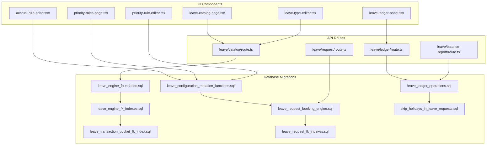
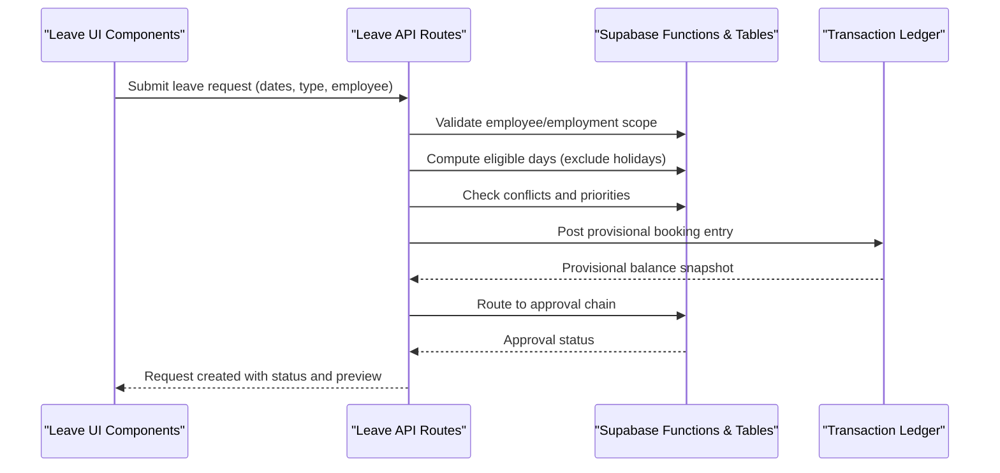
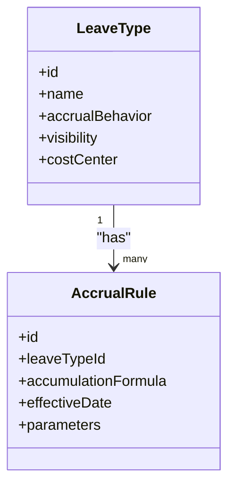
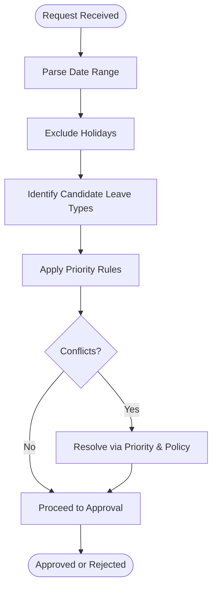
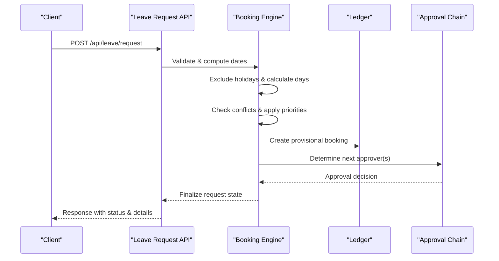
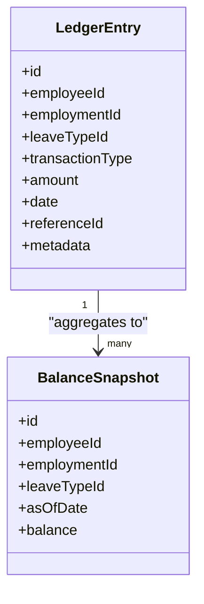
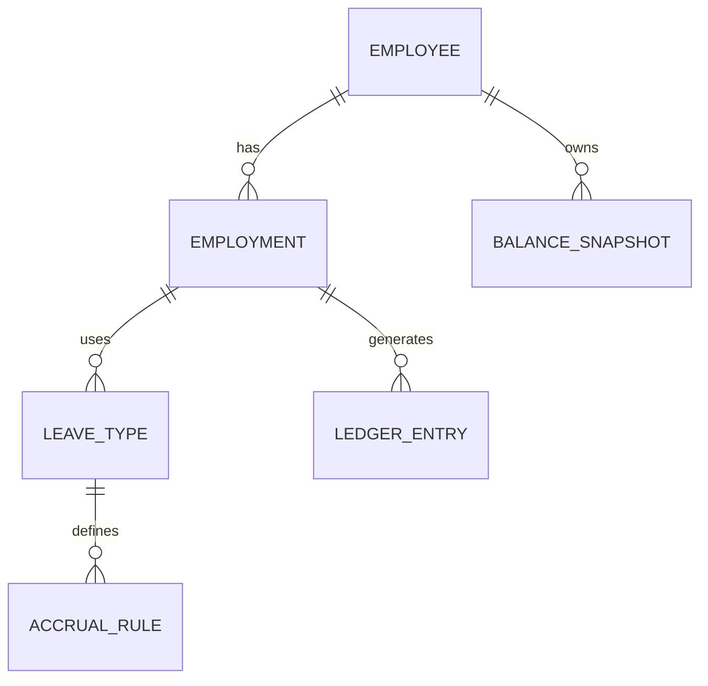
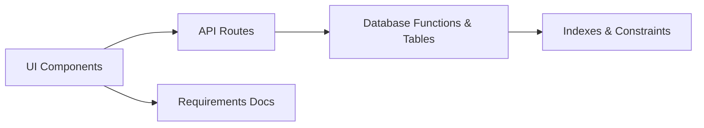

# Leave Engine Schema

<cite>
**Referenced Files in This Document**
- [leave_engine_foundation.sql](file://apps/hr-suite/supabase/migrations/20260722142551_add_leave_engine_foundation.sql)
- [leave_engine_fk_indexes.sql](file://apps/hr-suite/supabase/migrations/20260722144232_add_leave_engine_fk_indexes.sql)
- [leave_transaction_bucket_fk_index.sql](file://apps/hr-suite/supabase/migrations/20260722144344_add_leave_transaction_bucket_fk_index.sql)
- [leave_configuration_mutation_functions.sql](file://apps/hr-suite/supabase/migrations/20260722151920_add_leave_configuration_mutation_functions.sql)
- [leave_request_booking_engine.sql](file://apps/hr-suite/supabase/migrations/20260722190000_add_leave_request_booking_engine.sql)
- [seed_leave_demo_linda.sql](file://apps/hr-suite/supabase/migrations/20260722190500_seed_leave_demo_linda.sql)
- [leave_request_fk_indexes.sql](file://apps/hr-suite/supabase/migrations/20260722191500_add_leave_request_fk_indexes.sql)
- [leave_ledger_operations.sql](file://apps/hr-suite/supabase/migrations/20260722192000_add_leave_ledger_operations.sql)
- [seed_leave_demo_year_controls.sql](file://apps/hr-suite/supabase/migrations/20260722192100_seed_leave_demo_year_controls.sql)
- [skip_holidays_in_leave_requests.sql](file://apps/hr-suite/supabase/migrations/20260722192500_skip_holidays_in_leave_requests.sql)
- [leave-catalog-page.tsx](file://apps/hr-suite/components/leave/leave-catalog-page.tsx)
- [leave-type-editor.tsx](file://apps/hr-suite/components/leave/leave-type-editor.tsx)
- [accrual-rule-editor.tsx](file://apps/hr-suite/components/leave/accrual-rule-editor.tsx)
- [priority-rules-page.tsx](file://apps/hr-suite/components/leave/priority-rules-page.tsx)
- [priority-rule-editor.tsx](file://apps/hr-suite/components/leave/priority-rule-editor.tsx)
- [leave-ledger-panel.tsx](file://apps/hr-suite/components/leave/leave-ledger-panel.tsx)
- [route.ts (leave catalog)](file://apps/hr-suite/app/api/leave/catalog/route.ts)
- [route.ts (leave request)](file://apps/hr-suite/app/api/leave/request/route.ts)
- [route.ts (leave ledger)](file://apps/hr-suite/app/api/leave/ledger/route.ts)
- [route.ts (balance report)](file://apps/hr-suite/app/api/leave/balance-report/route.ts)
- [VERLOF_OPBOUW_ENGINE.md](file://docs/requirements/leave/VERLOF_OPBOUW_ENGINE.md)
- [VERLOF_AANVRAAG_HR_ADMIN.md](file://docs/requirements/leave/VERLOF_AANVRAAG_HR_ADMIN.md)
</cite>

## Table of Contents
1. Introduction
2. Project Structure
3. Core Components
4. Architecture Overview
5. Detailed Component Analysis
6. Dependency Analysis
7. Performance Considerations
8. Troubleshooting Guide
9. Conclusion

## Introduction
This document provides a comprehensive schema and workflow reference for LiquidHR’s leave management engine. It covers leave type definitions, accrual rules, priority configurations, the leave request booking engine, transaction ledger for balances and adjustments, and the relationships between employees, employments, leave types, and transactions. It also includes performance considerations, indexing strategies, and data integrity constraints to ensure accurate financial-like accounting of leave balances.

## Project Structure
The leave engine spans database migrations, API routes, UI components, and requirements documents:
- Database schema and operations are defined in Supabase migrations under apps/hr-suite/supabase/migrations.
- API endpoints expose catalog, request, ledger, and balance report capabilities.
- UI components provide configuration and operational interfaces for leave types, accrual rules, priority rules, and ledger views.
- Requirements documents describe business rules for accrual engine and HR admin workflows.

**Diagram sources**
- [leave_engine_foundation.sql](file://apps/hr-suite/supabase/migrations/20260722142551_add_leave_engine_foundation.sql)
- [leave_engine_fk_indexes.sql](file://apps/hr-suite/supabase/migrations/20260722144232_add_leave_engine_fk_indexes.sql)
- [leave_transaction_bucket_fk_index.sql](file://apps/hr-suite/supabase/migrations/20260722144344_add_leave_transaction_bucket_fk_index.sql)
- [leave_configuration_mutation_functions.sql](file://apps/hr-suite/supabase/migrations/20260722151920_add_leave_configuration_mutation_functions.sql)
- [leave_request_booking_engine.sql](file://apps/hr-suite/supabase/migrations/20260722190000_add_leave_request_booking_engine.sql)
- [leave_request_fk_indexes.sql](file://apps/hr-suite/supabase/migrations/20260722191500_add_leave_request_fk_indexes.sql)
- [leave_ledger_operations.sql](file://apps/hr-suite/supabase/migrations/20260722192000_add_leave_ledger_operations.sql)
- [skip_holidays_in_leave_requests.sql](file://apps/hr-suite/supabase/migrations/20260722192500_skip_holidays_in_leave_requests.sql)
- [route.ts (leave catalog)](file://apps/hr-suite/app/api/leave/catalog/route.ts)
- [route.ts (leave request)](file://apps/hr-suite/app/api/leave/request/route.ts)
- [route.ts (leave ledger)](file://apps/hr-suite/app/api/leave/ledger/route.ts)
- [route.ts (balance report)](file://apps/hr-suite/app/api/leave/balance-report/route.ts)
- [leave-catalog-page.tsx](file://apps/hr-suite/components/leave/leave-catalog-page.tsx)
- [leave-type-editor.tsx](file://apps/hr-suite/components/leave/leave-type-editor.tsx)
- [accrual-rule-editor.tsx](file://apps/hr-suite/components/leave/accrual-rule-editor.tsx)
- [priority-rules-page.tsx](file://apps/hr-suite/components/leave/priority-rules-page.tsx)
- [priority-rule-editor.tsx](file://apps/hr-suite/components/leave/priority-rule-editor.tsx)
- [leave-ledger-panel.tsx](file://apps/hr-suite/components/leave/leave-ledger-panel.tsx)

**Section sources**
- [leave_engine_foundation.sql](file://apps/hr-suite/supabase/migrations/20260722142551_add_leave_engine_foundation.sql)
- [leave_request_booking_engine.sql](file://apps/hr-suite/supabase/migrations/20260722190000_add_leave_request_booking_engine.sql)
- [leave_ledger_operations.sql](file://apps/hr-suite/supabase/migrations/20260722192000_add_leave_ledger_operations.sql)
- [route.ts (leave catalog)](file://apps/hr-suite/app/api/leave/catalog/route.ts)
- [route.ts (leave request)](file://apps/hr-suite/app/api/leave/request/route.ts)
- [route.ts (leave ledger)](file://apps/hr-suite/app/api/leave/ledger/route.ts)
- [route.ts (balance report)](file://apps/hr-suite/app/api/leave/balance-report/route.ts)
- [leave-catalog-page.tsx](file://apps/hr-suite/components/leave/leave-catalog-page.tsx)
- [leave-type-editor.tsx](file://apps/hr-suite/components/leave/leave-type-editor.tsx)
- [accrual-rule-editor.tsx](file://apps/hr-suite/components/leave/accrual-rule-editor.tsx)
- [priority-rules-page.tsx](file://apps/hr-suite/components/leave/priority-rules-page.tsx)
- [priority-rule-editor.tsx](file://apps/hr-suite/components/leave/priority-rule-editor.tsx)
- [leave-ledger-panel.tsx](file://apps/hr-suite/components/leave/leave-ledger-panel.tsx)

## Core Components
- Leave Types: Catalog entries defining categories of leave with attributes such as accrual behavior, cost center mapping, and visibility.
- Accrual Rules: Configurations that determine how leave entitlements accumulate over time based on employment history, work hours, and policy parameters.
- Priority Rules: Ordering logic used when multiple leave types compete for coverage or when allocating partial days across types.
- Booking Engine: Handles leave request creation, date calculations, holiday exclusions, conflict detection, and approval routing.
- Transaction Ledger: Immutable records of accruals, bookings, approvals, rejections, and adjustments ensuring auditability and balance reconciliation.
- API Endpoints: RESTful routes for catalog management, request submission and preview, ledger queries, and balance reporting.
- UI Panels: Editors and dashboards for configuring leave types, accrual rules, priority rules, and viewing ledger entries.

**Section sources**
- [leave_engine_foundation.sql](file://apps/hr-suite/supabase/migrations/20260722142551_add_leave_engine_foundation.sql)
- [leave_configuration_mutation_functions.sql](file://apps/hr-suite/supabase/migrations/20260722151920_add_leave_configuration_mutation_functions.sql)
- [leave_request_booking_engine.sql](file://apps/hr-suite/supabase/migrations/20260722190000_add_leave_request_booking_engine.sql)
- [leave_ledger_operations.sql](file://apps/hr-suite/supabase/migrations/20260722192000_add_leave_ledger_operations.sql)
- [route.ts (leave catalog)](file://apps/hr-suite/app/api/leave/catalog/route.ts)
- [route.ts (leave request)](file://apps/hr-suite/app/api/leave/request/route.ts)
- [route.ts (leave ledger)](file://apps/hr-suite/app/api/leave/ledger/route.ts)
- [route.ts (balance report)](file://apps/hr-suite/app/api/leave/balance-report/route.ts)
- [leave-catalog-page.tsx](file://apps/hr-suite/components/leave/leave-catalog-page.tsx)
- [leave-type-editor.tsx](file://apps/hr-suite/components/leave/leave-type-editor.tsx)
- [accrual-rule-editor.tsx](file://apps/hr-suite/components/leave/accrual-rule-editor.tsx)
- [priority-rules-page.tsx](file://apps/hr-suite/components/leave/priority-rules-page.tsx)
- [priority-rule-editor.tsx](file://apps/hr-suite/components/leave/priority-rule-editor.tsx)
- [leave-ledger-panel.tsx](file://apps/hr-suite/components/leave/leave-ledger-panel.tsx)

## Architecture Overview
The leave engine follows a layered architecture:
- Data Layer: Relational schema with strong foreign keys and indexes for performance and integrity.
- Service Layer: SQL functions and stored procedures encapsulate complex operations like accrual computation and ledger posting.
- API Layer: Next.js route handlers orchestrate requests, validate inputs, and call service functions.
- Presentation Layer: React components manage user interactions and display real-time ledger and balance information.

**Diagram sources**
- [leave_request_booking_engine.sql](file://apps/hr-suite/supabase/migrations/20260722190000_add_leave_request_booking_engine.sql)
- [leave_ledger_operations.sql](file://apps/hr-suite/supabase/migrations/20260722192000_add_leave_ledger_operations.sql)
- [route.ts (leave request)](file://apps/hr-suite/app/api/leave/request/route.ts)

## Detailed Component Analysis

### Leave Types and Accrual Rules
- Leave types define categories and behaviors; accrual rules specify accumulation logic tied to employment periods, work patterns, and policy parameters.
- Configuration mutations allow safe updates to accrual policies without breaking historical data.

**Diagram sources**
- [leave_engine_foundation.sql](file://apps/hr-suite/supabase/migrations/20260722142551_add_leave_engine_foundation.sql)
- [leave_configuration_mutation_functions.sql](file://apps/hr-suite/supabase/migrations/20260722151920_add_leave_configuration_mutation_functions.sql)

**Section sources**
- [leave_engine_foundation.sql](file://apps/hr-suite/supabase/migrations/20260722142551_add_leave_engine_foundation.sql)
- [leave_configuration_mutation_functions.sql](file://apps/hr-suite/supabase/migrations/20260722151920_add_leave_configuration_mutation_functions.sql)
- [accrual-rule-editor.tsx](file://apps/hr-suite/components/leave/accrual-rule-editor.tsx)
- [leave-type-editor.tsx](file://apps/hr-suite/components/leave/leave-type-editor.tsx)

### Priority Rules and Conflict Resolution
- Priority rules order competing leave types during allocation or partial-day splits.
- Conflict resolution ensures no double-booking and enforces organizational policies.

**Diagram sources**
- [leave_request_booking_engine.sql](file://apps/hr-suite/supabase/migrations/20260722190000_add_leave_request_booking_engine.sql)
- [skip_holidays_in_leave_requests.sql](file://apps/hr-suite/supabase/migrations/20260722192500_skip_holidays_in_leave_requests.sql)
- [priority-rules-page.tsx](file://apps/hr-suite/components/leave/priority-rules-page.tsx)
- [priority-rule-editor.tsx](file://apps/hr-suite/components/leave/priority-rule-editor.tsx)

**Section sources**
- [leave_request_booking_engine.sql](file://apps/hr-suite/supabase/migrations/20260722190000_add_leave_request_booking_engine.sql)
- [skip_holidays_in_leave_requests.sql](file://apps/hr-suite/supabase/migrations/20260722192500_skip_holidays_in_leave_requests.sql)
- [priority-rules-page.tsx](file://apps/hr-suite/components/leave/priority-rules-page.tsx)
- [priority-rule-editor.tsx](file://apps/hr-suite/components/leave/priority-rule-editor.tsx)

### Booking Engine Workflow
- The booking engine validates employee and employment context, computes eligible days excluding holidays, checks conflicts, applies priority rules, posts provisional ledger entries, and routes through approval chains.

**Diagram sources**
- [leave_request_booking_engine.sql](file://apps/hr-suite/supabase/migrations/20260722190000_add_leave_request_booking_engine.sql)
- [leave_ledger_operations.sql](file://apps/hr-suite/supabase/migrations/20260722192000_add_leave_ledger_operations.sql)
- [route.ts (leave request)](file://apps/hr-suite/app/api/leave/request/route.ts)

**Section sources**
- [leave_request_booking_engine.sql](file://apps/hr-suite/supabase/migrations/20260722190000_add_leave_request_booking_engine.sql)
- [leave_ledger_operations.sql](file://apps/hr-suite/supabase/migrations/20260722192000_add_leave_ledger_operations.sql)
- [route.ts (leave request)](file://apps/hr-suite/app/api/leave/request/route.ts)

### Transaction Ledger System
- The ledger records all accruals, bookings, approvals, rejections, and adjustments with immutable entries.
- Operations include posting entries, reversing incorrect postings, and generating balance snapshots.

**Diagram sources**
- [leave_ledger_operations.sql](file://apps/hr-suite/supabase/migrations/20260722192000_add_leave_ledger_operations.sql)

**Section sources**
- [leave_ledger_operations.sql](file://apps/hr-suite/supabase/migrations/20260722192000_add_leave_ledger_operations.sql)
- [leave-ledger-panel.tsx](file://apps/hr-suite/components/leave/leave-ledger-panel.tsx)
- [route.ts (leave ledger)](file://apps/hr-suite/app/api/leave/ledger/route.ts)
- [route.ts (balance report)](file://apps/hr-suite/app/api/leave/balance-report/route.ts)

### Relationships Between Employees, Employments, Leave Types, and Transactions
- Employees have one or many employments; each employment is associated with leave types and generates ledger transactions.
- Foreign key constraints and indexes enforce referential integrity and optimize queries across these relationships.

**Diagram sources**
- [leave_engine_foundation.sql](file://apps/hr-suite/supabase/migrations/20260722142551_add_leave_engine_foundation.sql)
- [leave_engine_fk_indexes.sql](file://apps/hr-suite/supabase/migrations/20260722144232_add_leave_engine_fk_indexes.sql)
- [leave_transaction_bucket_fk_index.sql](file://apps/hr-suite/supabase/migrations/20260722144344_add_leave_transaction_bucket_fk_index.sql)

**Section sources**
- [leave_engine_foundation.sql](file://apps/hr-suite/supabase/migrations/20260722142551_add_leave_engine_foundation.sql)
- [leave_engine_fk_indexes.sql](file://apps/hr-suite/supabase/migrations/20260722144232_add_leave_engine_fk_indexes.sql)
- [leave_transaction_bucket_fk_index.sql](file://apps/hr-suite/supabase/migrations/20260722144344_add_leave_transaction_bucket_fk_index.sql)

## Dependency Analysis
- API routes depend on database functions and tables defined in migrations.
- UI components depend on API endpoints for CRUD operations and real-time data.
- Indexes and foreign keys reduce query latency and maintain data consistency.

**Diagram sources**
- [leave_catalog-page.tsx](file://apps/hr-suite/components/leave/leave-catalog-page.tsx)
- [route.ts (leave catalog)](file://apps/hr-suite/app/api/leave/catalog/route.ts)
- [leave_engine_fk_indexes.sql](file://apps/hr-suite/supabase/migrations/20260722144232_add_leave_engine_fk_indexes.sql)

**Section sources**
- [leave_catalog-page.tsx](file://apps/hr-suite/components/leave/leave-catalog-page.tsx)
- [route.ts (leave catalog)](file://apps/hr-suite/app/api/leave/catalog/route.ts)
- [leave_engine_fk_indexes.sql](file://apps/hr-suite/supabase/migrations/20260722144232_add_leave_engine_fk_indexes.sql)

## Performance Considerations
- Balance Calculations: Use precomputed snapshots and indexed aggregation queries to minimize runtime computation.
- Indexing Strategy: Leverage foreign key indexes on employeeId, employmentId, leaveTypeId, and date ranges for fast lookups.
- Query Optimization: Partition large ledger tables by date or tenant if necessary; use materialized views for frequent reports.
- Concurrency Control: Implement optimistic locking or row-level locks during booking and approval transitions to prevent race conditions.
- Financial Accuracy: Enforce immutability of ledger entries; require reversal entries instead of direct modifications.

[No sources needed since this section provides general guidance]

## Troubleshooting Guide
- Common Issues:
  - Holiday exclusion errors: Verify holiday calendars and date range parsing.
  - Conflict detection failures: Review priority rules and overlap logic.
  - Ledger imbalance: Audit recent postings and reversals; ensure atomic transactions.
- Debugging Steps:
  - Inspect ledger entries around the problematic dates.
  - Validate accrual rule parameters and effective dates.
  - Check approval chain configuration and permissions.

**Section sources**
- [leave_ledger_operations.sql](file://apps/hr-suite/supabase/migrations/20260722192000_add_leave_ledger_operations.sql)
- [leave_request_booking_engine.sql](file://apps/hr-suite/supabase/migrations/20260722190000_add_leave_request_booking_engine.sql)
- [skip_holidays_in_leave_requests.sql](file://apps/hr-suite/supabase/migrations/20260722192500_skip_holidays_in_leave_requests.sql)

## Conclusion
LiquidHR’s leave engine combines robust schema design, precise accrual and priority rules, and an immutable transaction ledger to deliver accurate and auditable leave management. The layered architecture ensures scalability and maintainability, while indexing and concurrency controls support high-performance operations. Adhering to the documented workflows and constraints will help maintain data integrity and system reliability.

[No sources needed since this section summarizes without analyzing specific files]