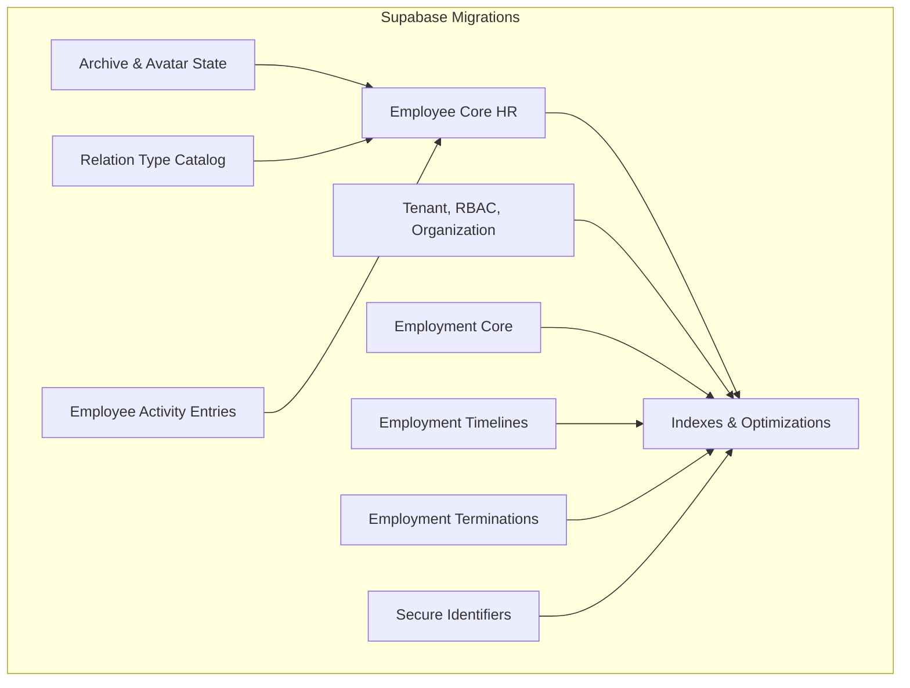
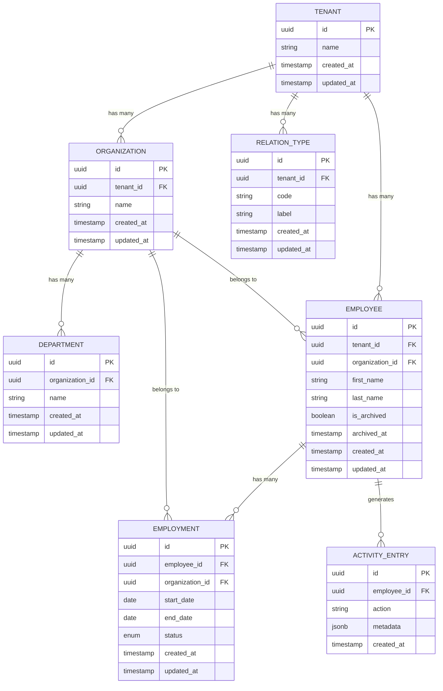
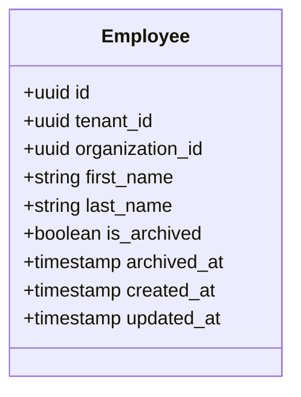
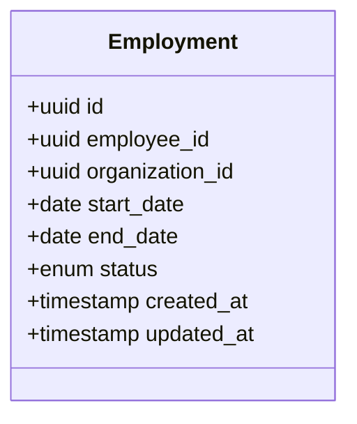
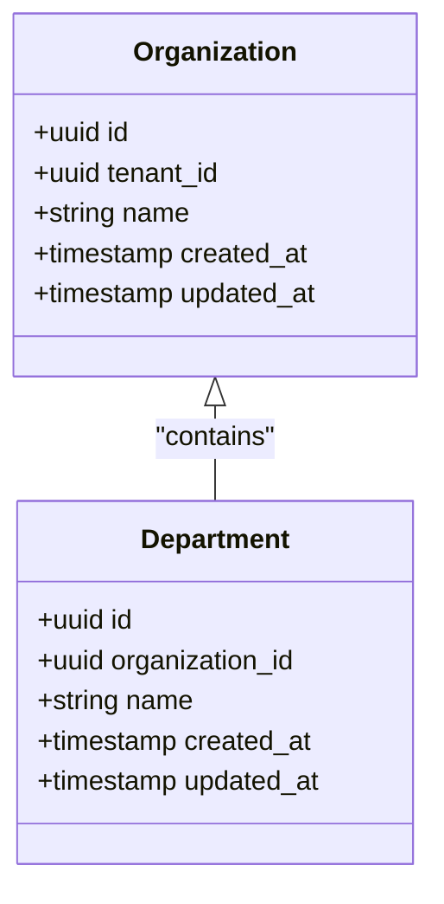
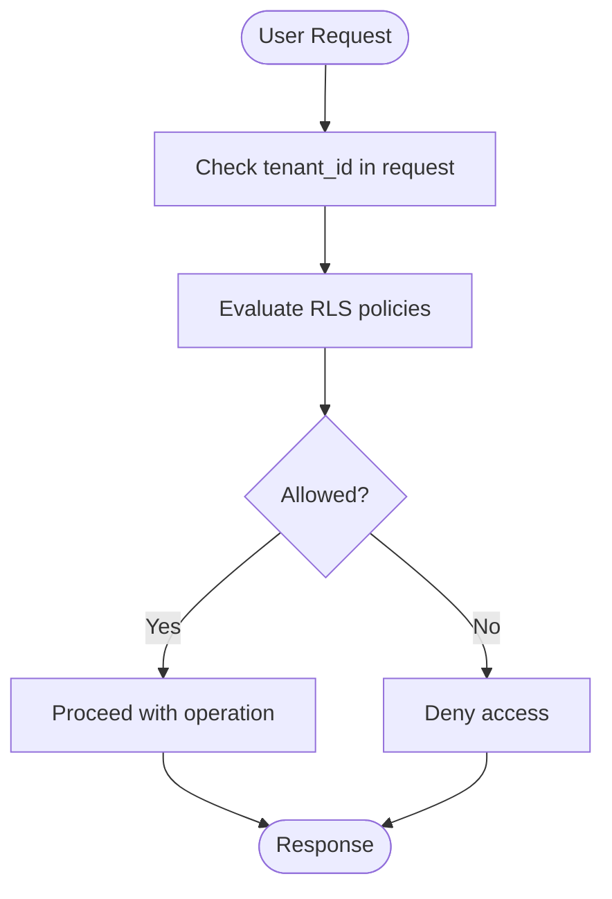
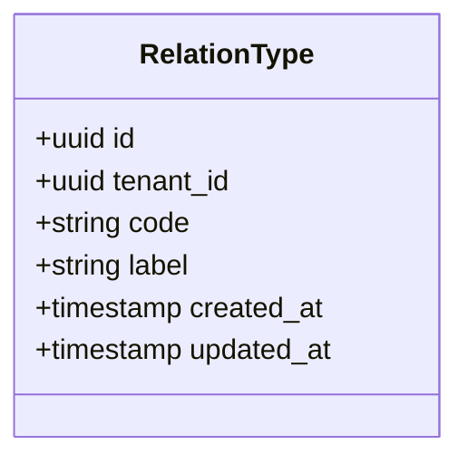
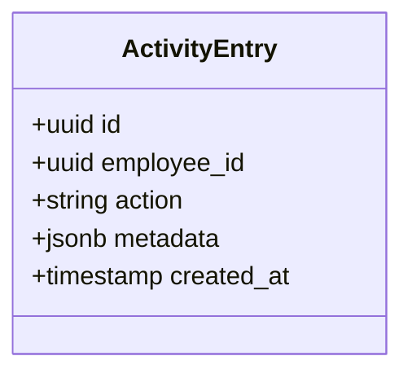
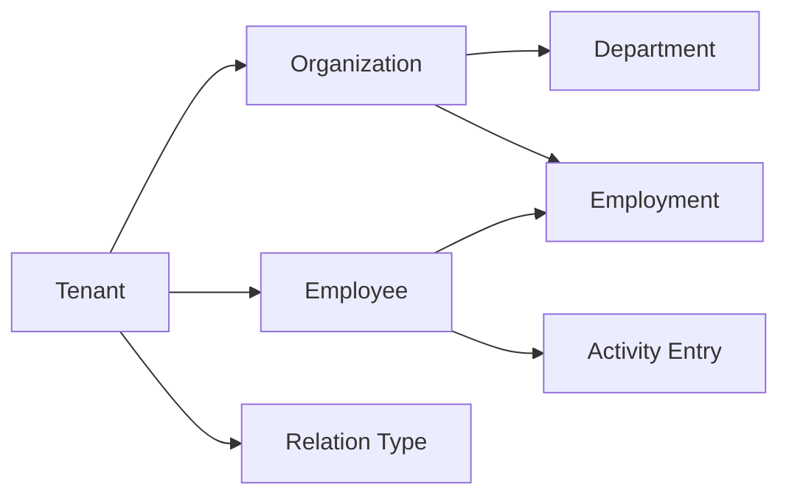

# Core Entities

<cite>
**Referenced Files in This Document**
- [20260712124858_init_employee_core_hr.sql](file://apps/hr-suite/supabase/migrations/20260712124858_init_employee_core_hr.sql)
- [20260712124911_add_tenant_rbac_and_organization.sql](file://apps/hr-suite/supabase/migrations/20260712124911_add_tenant_rbac_and_organization.sql)
- [20260715071156_add_employment_core.sql](file://apps/hr-suite/supabase/migrations/20260715071156_add_employment_core.sql)
- [20260715071422_add_employment_timelines.sql](file://apps/hr-suite/supabase/migrations/20260715071422_add_employment_timelines.sql)
- [20260715071717_add_employment_terminations.sql](file://apps/hr-suite/supabase/migrations/20260715071717_add_employment_terminations.sql)
- [20260715120810_complete_employee_core.sql](file://apps/hr-suite/supabase/migrations/20260715120810_complete_employee_core.sql)
- [20260715121304_optimize_employee_core_indexes.sql](file://apps/hr-suite/supabase/migrations/20260715121304_optimize_employee_core_indexes.sql)
- [20260715124506_isolate_employee_secure_identifiers.sql](file://apps/hr-suite/supabase/migrations/20260715124506_isolate_employee_secure_identifiers.sql)
- [20260715130026_index_secure_employee_foreign_keys.sql](file://apps/hr-suite/supabase/migrations/20260715130026_index_secure_employee_foreign_keys.sql)
- [20260718150000_add_employee_archive_and_avatar_state.sql](file://apps/hr-suite/supabase/migrations/20260718150000_add_employee_archive_and_avatar_state.sql)
- [20260718180354_add_date_time_user_preferences.sql](file://apps/hr-suite/supabase/migrations/20260718180354_add_date_time_user_preferences.sql)
- [20260719170000_add_tenant_relation_type_catalog.sql](file://apps/hr-suite/supabase/migrations/20260719170000_add_tenant_relation_type_catalog.sql)
- [20260719180000_allow_custom_relation_type_catalog_entries.sql](file://apps/hr-suite/supabase/migrations/20260719180000_allow_custom_relation_type_catalog_entries.sql)
- [20260719181000_index_relation_type_catalog_fk.sql](file://apps/hr-suite/supabase/migrations/20260719181000_index_relation_type_catalog_fk.sql)
- [20260724160000_add_employee_activity_entries.sql](file://apps/hr-suite/supabase/migrations/20260724160000_add_employee_activity_entries.sql)
- [20260724172716_harden_employee_activity_entries.sql](file://apps/hr-suite/supabase/migrations/20260724172716_harden_employee_activity_entries.sql)
- [multitenancy_isolation.sql](file://apps/hr-suite/supabase/tests/multitenancy_isolation.sql)
- [employee_core_crud_isolation.sql](file://apps/hr-suite/supabase/tests/employee_core_crud_isolation.sql)
- [employee_overview.sql](file://apps/hr-suite/supabase/tests/employee_overview.sql)
- [employee_secure_identifiers.sql](file://apps/hr-suite/supabase/tests/employee_secure_identifiers.sql)
- [employment_core.sql](file://apps/hr-suite/supabase/tests/employment_core.sql)
- [employment_complete_flow.sql](file://apps/hr-suite/supabase/tests/employment_complete_flow.sql)
</cite>

## Table of Contents
1. [Introduction](#introduction)
2. [Project Structure](#project-structure)
3. [Core Components](#core-components)
4. [Architecture Overview](#architecture-overview)
5. [Detailed Component Analysis](#detailed-component-analysis)
6. [Dependency Analysis](#dependency-analysis)
7. [Performance Considerations](#performance-considerations)
8. [Troubleshooting Guide](#troubleshooting-guide)
9. [Conclusion](#conclusion)
10. [Appendices](#appendices)

## Introduction
This document provides a comprehensive data model for LiquidHR’s core entities: employees, employments, organizations, and tenants. It explains entity relationships, field definitions, data types, primary and foreign keys, indexes, constraints, multitenancy architecture with tenant isolation and administration boundaries, validation rules, business constraints, referential integrity policies, and lifecycle management including soft deletes and archival processes. The goal is to make the schema accessible to both technical and non-technical readers while preserving precise implementation details sourced from the repository migrations and tests.

## Project Structure
The data model is defined through Supabase migrations under apps/hr-suite/supabase/migrations and validated by SQL tests under apps/hr-suite/supabase/tests. Key areas:
- Employee core schema and secure identifiers
- Employment lifecycle (core, timelines, terminations)
- Multitenancy and organization structures
- Indexes and performance optimizations
- Archival and avatar state for employees
- Relation type catalogs and employee activity entries

**Diagram sources**
- [20260712124858_init_employee_core_hr.sql](file://apps/hr-suite/supabase/migrations/20260712124858_init_employee_core_hr.sql)
- [20260712124911_add_tenant_rbac_and_organization.sql](file://apps/hr-suite/supabase/migrations/20260712124911_add_tenant_rbac_and_organization.sql)
- [20260715071156_add_employment_core.sql](file://apps/hr-suite/supabase/migrations/2026071156_add_employment_core.sql)
- [20260715071422_add_employment_timelines.sql](file://apps/hr-suite/supabase/migrations/20260715071422_add_employment_timelines.sql)
- [20260715071717_add_employment_terminations.sql](file://apps/hr-suite/supabase/migrations/20260715071717_add_employment_terminations.sql)
- [20260715121304_optimize_employee_core_indexes.sql](file://apps/hr-suite/supabase/migrations/20260715121304_optimize_employee_core_indexes.sql)
- [20260715124506_isolate_employee_secure_identifiers.sql](file://apps/hr-suite/supabase/migrations/20260715124506_isolate_employee_secure_identifiers.sql)
- [20260718150000_add_employee_archive_and_avatar_state.sql](file://apps/hr-suite/supabase/migrations/20260718150000_add_employee_archive_and_avatar_state.sql)
- [20260719170000_add_tenant_relation_type_catalog.sql](file://apps/hr-suite/supabase/migrations/20260719170000_add_tenant_relation_type_catalog.sql)
- [20260724160000_add_employee_activity_entries.sql](file://apps/hr-suite/supabase/migrations/20260724160000_add_employee_activity_entries.sql)

**Section sources**
- [20260712124858_init_employee_core_hr.sql](file://apps/hr-suite/supabase/migrations/20260712124858_init_employee_core_hr.sql)
- [20260712124911_add_tenant_rbac_and_organization.sql](file://apps/hr-suite/supabase/migrations/20260712124911_add_tenant_rbac_and_organization.sql)
- [20260715071156_add_employment_core.sql](file://apps/hr-suite/supabase/migrations/20260715071156_add_employment_core.sql)
- [20260715071422_add_employment_timelines.sql](file://apps/hr-suite/supabase/migrations/20260715071422_add_employment_timelines.sql)
- [20260715071717_add_employment_terminations.sql](file://apps/hr-suite/supabase/migrations/20260715071717_add_employment_terminations.sql)
- [20260715121304_optimize_employee_core_indexes.sql](file://apps/hr-suite/supabase/migrations/20260715121304_optimize_employee_core_indexes.sql)
- [20260715124506_isolate_employee_secure_identifiers.sql](file://apps/hr-suite/supabase/migrations/20260715124506_isolate_employee_secure_identifiers.sql)
- [20260718150000_add_employee_archive_and_avatar_state.sql](file://apps/hr-suite/supabase/migrations/20260718150000_add_employee_archive_and_avatar_state.sql)
- [20260719170000_add_tenant_relation_type_catalog.sql](file://apps/hr-suite/supabase/migrations/20260719170000_add_tenant_relation_type_catalog.sql)
- [20260724160000_add_employee_activity_entries.sql](file://apps/hr-suite/supabase/migrations/20260724160000_add_employee_activity_entries.sql)

## Core Components
This section outlines the core entities and their responsibilities:
- Tenant: Represents a logical organization or customer context; isolates data and admin boundaries.
- Organization: Hierarchical structure within a tenant (e.g., departments, roles).
- Employee: Person record linked to a tenant and organization scope; includes personal and secure identifiers.
- Employment: Contractual relationship between an employee and the organization; includes lifecycle states and timeline events.
- Department: Organizational unit within an organization.
- Relation Types: Catalogs defining allowed relations for employees (tenant-scoped).
- Employee Activity: Audit trail of changes and actions on employee records.

Key aspects:
- Primary keys are UUIDs for all core entities.
- Foreign keys enforce referential integrity across tenant, organization, employee, and employment tables.
- Row-level security and policies isolate data per tenant and administration scope.
- Soft delete and archival flags manage inactive or archived employee records.

**Section sources**
- [20260712124858_init_employee_core_hr.sql](file://apps/hr-suite/supabase/migrations/20260712124858_init_employee_core_hr.sql)
- [20260712124911_add_tenant_rbac_and_organization.sql](file://apps/hr-suite/supabase/migrations/20260712124911_add_tenant_rbac_and_organization.sql)
- [20260715071156_add_employment_core.sql](file://apps/hr-suite/supabase/migrations/20260715071156_add_employment_core.sql)
- [20260715071422_add_employment_timelines.sql](file://apps/hr-suite/supabase/migrations/20260715071422_add_employment_timelines.sql)
- [20260715071717_add_employment_terminations.sql](file://apps/hr-suite/supabase/migrations/20260715071717_add_employment_terminations.sql)
- [20260719170000_add_tenant_relation_type_catalog.sql](file://apps/hr-suite/supabase/migrations/20260719170000_add_tenant_relation_type_catalog.sql)
- [20260724160000_add_employee_activity_entries.sql](file://apps/hr-suite/supabase/migrations/20260724160000_add_employee_activity_entries.sql)

## Architecture Overview
The multitenancy architecture ensures strict isolation at the database level using tenant_id and administration scopes. Employees and employments are scoped to tenants, and row-level policies restrict access based on user roles and tenant membership. Organizations define hierarchical structures (departments, roles), and relation type catalogs constrain permissible employee relations per tenant.

**Diagram sources**
- [20260712124858_init_employee_core_hr.sql](file://apps/hr-suite/supabase/migrations/20260712124858_init_employee_core_hr.sql)
- [20260712124911_add_tenant_rbac_and_organization.sql](file://apps/hr-suite/supabase/migrations/20260712124911_add_tenant_rbac_and_organization.sql)
- [20260715071156_add_employment_core.sql](file://apps/hr-suite/supabase/migrations/20260715071156_add_employment_core.sql)
- [20260719170000_add_tenant_relation_type_catalog.sql](file://apps/hr-suite/supabase/migrations/20260719170000_add_tenant_relation_type_catalog.sql)
- [20260724160000_add_employee_activity_entries.sql](file://apps/hr-suite/supabase/migrations/20260724160000_add_employee_activity_entries.sql)

## Detailed Component Analysis

### Employee Entity
- Purpose: Stores person information and links to tenant and organization scope. Includes archival state and secure identifier isolation.
- Key fields:
  - id (UUID, PK)
  - tenant_id (UUID, FK to tenant)
  - organization_id (UUID, FK to organization)
  - first_name, last_name (text)
  - is_archived (boolean)
  - archived_at (timestamp)
  - created_at, updated_at (timestamps)
- Constraints:
  - Foreign keys ensure employee belongs to a valid tenant and organization.
  - Unique constraints may apply to secure identifiers (see Secure Identifiers section).
- Lifecycle:
  - Soft delete via is_archived flag; archived_at records when archived.
  - Secure identifiers are isolated to reduce exposure.

**Diagram sources**
- [20260712124858_init_employee_core_hr.sql](file://apps/hr-suite/supabase/migrations/20260712124858_init_employee_core_hr.sql)
- [20260715124506_isolate_employee_secure_identifiers.sql](file://apps/hr-suite/supabase/migrations/20260715124506_isolate_employee_secure_identifiers.sql)
- [20260718150000_add_employee_archive_and_avatar_state.sql](file://apps/hr-suite/supabase/migrations/20260718150000_add_employee_archive_and_avatar_state.sql)

**Section sources**
- [20260712124858_init_employee_core_hr.sql](file://apps/hr-suite/supabase/migrations/20260712124858_init_employee_core_hr.sql)
- [20260715124506_isolate_employee_secure_identifiers.sql](file://apps/hr-suite/supabase/migrations/20260715124506_isolate_employee_secure_identifiers.sql)
- [20260718150000_add_employee_archive_and_avatar_state.sql](file://apps/hr-suite/supabase/migrations/20260718150000_add_employee_archive_and_avatar_state.sql)

### Employment Entity
- Purpose: Models contractual relationship between employee and organization; tracks lifecycle states and timeline events.
- Key fields:
  - id (UUID, PK)
  - employee_id (UUID, FK to employee)
  - organization_id (UUID, FK to organization)
  - start_date, end_date (date)
  - status (enum)
  - created_at, updated_at (timestamps)
- Constraints:
  - Referential integrity enforced via foreign keys.
  - Status enum constrains lifecycle transitions.
- Lifecycle:
  - Timeline entries capture changes over time.
  - Termination records formalize end-of-employment events.

**Diagram sources**
- [20260715071156_add_employment_core.sql](file://apps/hr-suite/supabase/migrations/20260715071156_add_employment_core.sql)
- [20260715071422_add_employment_timelines.sql](file://apps/hr-suite/supabase/migrations/20260715071422_add_employment_timelines.sql)
- [20260715071717_add_employment_terminations.sql](file://apps/hr-suite/supabase/migrations/20260715071717_add_employment_terminations.sql)

**Section sources**
- [20260715071156_add_employment_core.sql](file://apps/hr-suite/supabase/migrations/20260715071156_add_employment_core.sql)
- [20260715071422_add_employment_timelines.sql](file://apps/hr-suite/supabase/migrations/20260715071422_add_employment_timelines.sql)
- [20260715071717_add_employment_terminations.sql](file://apps/hr-suite/supabase/migrations/20260715071717_add_employment_terminations.sql)

### Organization and Department Entities
- Purpose: Define organizational hierarchy within a tenant. Departments belong to organizations.
- Key fields:
  - Organization: id (UUID, PK), tenant_id (UUID, FK), name (text), timestamps.
  - Department: id (UUID, PK), organization_id (UUID, FK), name (text), timestamps.
- Constraints:
  - Foreign keys ensure department belongs to a valid organization.
  - Tenant scoping isolates organizations per tenant.

**Diagram sources**
- [20260712124911_add_tenant_rbac_and_organization.sql](file://apps/hr-suite/supabase/migrations/20260712124911_add_tenant_rbac_and_organization.sql)

**Section sources**
- [20260712124911_add_tenant_rbac_and_organization.sql](file://apps/hr-suite/supabase/migrations/20260712124911_add_tenant_rbac_and_organization.sql)

### Tenant and Administration Boundaries
- Purpose: Isolates data and administrative control per tenant.
- Key fields:
  - Tenant: id (UUID, PK), name (text), timestamps.
- Policies:
  - Row-level security enforces tenant isolation.
  - Administration boundaries restrict who can manage tenants and their data.

**Diagram sources**
- [20260712124911_add_tenant_rbac_and_organization.sql](file://apps/hr-suite/supabase/migrations/20260712124911_add_tenant_rbac_and_organization.sql)
- [multitenancy_isolation.sql](file://apps/hr-suite/supabase/tests/multitenancy_isolation.sql)

**Section sources**
- [20260712124911_add_tenant_rbac_and_organization.sql](file://apps/hr-suite/supabase/migrations/20260712124911_add_tenant_rbac_and_organization.sql)
- [multitenancy_isolation.sql](file://apps/hr-suite/supabase/tests/multitenancy_isolation.sql)

### Relation Type Catalog
- Purpose: Defines allowed relation types for employees within a tenant.
- Key fields:
  - id (UUID, PK), tenant_id (UUID, FK), code (text), label (text), timestamps.
- Constraints:
  - Tenant scoping ensures catalog entries are isolated per tenant.
  - Custom entries allowed via migration updates.

**Diagram sources**
- [20260719170000_add_tenant_relation_type_catalog.sql](file://apps/hr-suite/supabase/migrations/20260719170000_add_tenant_relation_type_catalog.sql)
- [20260719180000_allow_custom_relation_type_catalog_entries.sql](file://apps/hr-suite/supabase/migrations/20260719180000_allow_custom_relation_type_catalog_entries.sql)

**Section sources**
- [20260719170000_add_tenant_relation_type_catalog.sql](file://apps/hr-suite/supabase/migrations/20260719170000_add_tenant_relation_type_catalog.sql)
- [20260719180000_allow_custom_relation_type_catalog_entries.sql](file://apps/hr-suite/supabase/migrations/20260719180000_allow_custom_relation_type_catalog_entries.sql)

### Employee Activity Entries
- Purpose: Audit trail capturing actions and metadata related to employee records.
- Key fields:
  - id (UUID, PK), employee_id (FK), action (text), metadata (jsonb), created_at (timestamp).
- Constraints:
  - Foreign key ensures activity references a valid employee.
  - Metadata allows flexible event payloads.

**Diagram sources**
- [20260724160000_add_employee_activity_entries.sql](file://apps/hr-suite/supabase/migrations/20260724160000_add_employee_activity_entries.sql)
- [20260724172716_harden_employee_activity_entries.sql](file://apps/hr-suite/supabase/migrations/20260724172716_harden_employee_activity_entries.sql)

**Section sources**
- [20260724160000_add_employee_activity_entries.sql](file://apps/hr-suite/supabase/migrations/20260724160000_add_employee_activity_entries.sql)
- [20260724172716_harden_employee_activity_entries.sql](file://apps/hr-suite/supabase/migrations/20260724172716_harden_employee_activity_entries.sql)

## Dependency Analysis
Dependencies between core entities are enforced via foreign keys and row-level policies:
- Employee depends on Tenant and Organization.
- Employment depends on Employee and Organization.
- Department depends on Organization.
- Relation Type depends on Tenant.
- Activity Entry depends on Employee.

**Diagram sources**
- [20260712124858_init_employee_core_hr.sql](file://apps/hr-suite/supabase/migrations/20260712124858_init_employee_core_hr.sql)
- [20260712124911_add_tenant_rbac_and_organization.sql](file://apps/hr-suite/supabase/migrations/20260712124911_add_tenant_rbac_and_organization.sql)
- [20260715071156_add_employment_core.sql](file://apps/hr-suite/supabase/migrations/20260715071156_add_employment_core.sql)
- [20260719170000_add_tenant_relation_type_catalog.sql](file://apps/hr-suite/supabase/migrations/20260719170000_add_tenant_relation_type_catalog.sql)
- [20260724160000_add_employee_activity_entries.sql](file://apps/hr-suite/supabase/migrations/20260724160000_add_employee_activity_entries.sql)

**Section sources**
- [20260712124858_init_employee_core_hr.sql](file://apps/hr-suite/supabase/migrations/20260712124858_init_employee_core_hr.sql)
- [20260712124911_add_tenant_rbac_and_organization.sql](file://apps/hr-suite/supabase/migrations/20260712124911_add_tenant_rbac_and_organization.sql)
- [20260715071156_add_employment_core.sql](file://apps/hr-suite/supabase/migrations/20260715071156_add_employment_core.sql)
- [20260719170000_add_tenant_relation_type_catalog.sql](file://apps/hr-suite/supabase/migrations/20260719170000_add_tenant_relation_type_catalog.sql)
- [20260724160000_add_employee_activity_entries.sql](file://apps/hr-suite/supabase/migrations/20260724160000_add_employee_activity_entries.sql)

## Performance Considerations
- Indexes:
  - Employee core indexes optimize lookups by tenant and organization.
  - Secure identifier indexes improve query performance for sensitive fields.
  - Relation type catalog foreign key indexes support efficient joins.
- Query Optimization:
  - Use tenant-scoped queries to minimize data scanning.
  - Leverage indexes on frequently filtered columns (tenant_id, organization_id).
- Archival:
  - Soft deletes avoid heavy deletions; archive flags enable efficient filtering.

**Section sources**
- [20260715121304_optimize_employee_core_indexes.sql](file://apps/hr-suite/supabase/migrations/20260715121304_optimize_employee_core_indexes.sql)
- [20260715130026_index_secure_employee_foreign_keys.sql](file://apps/hr-suite/supabase/migrations/20260715130026_index_secure_employee_foreign_keys.sql)
- [20260719181000_index_relation_type_catalog_fk.sql](file://apps/hr-suite/supabase/migrations/20260719181000_index_relation_type_catalog_fk.sql)

## Troubleshooting Guide
Common issues and resolutions:
- Tenant Isolation Failures:
  - Verify RLS policies are applied correctly.
  - Ensure tenant_id is present in requests and matches user context.
- Employee CRUD Errors:
  - Check foreign key constraints for tenant and organization.
  - Validate secure identifier uniqueness if applicable.
- Employment Lifecycle Issues:
  - Confirm status enum values match expected transitions.
  - Review timeline entries for consistency.
- Archive State Problems:
  - Ensure is_archived and archived_at are updated atomically.
  - Validate that archived employees are excluded from active queries.

**Section sources**
- [multitenancy_isolation.sql](file://apps/hr-suite/supabase/tests/multitenancy_isolation.sql)
- [employee_core_crud_isolation.sql](file://apps/hr-suite/supabase/tests/employee_core_crud_isolation.sql)
- [employee_overview.sql](file://apps/hr-suite/supabase/tests/employee_overview.sql)
- [employee_secure_identifiers.sql](file://apps/hr-suite/supabase/tests/employee_secure_identifiers.sql)
- [employment_core.sql](file://apps/hr-suite/supabase/tests/employment_core.sql)
- [employment_complete_flow.sql](file://apps/hr-suite/supabase/tests/employment_complete_flow.sql)

## Conclusion
LiquidHR’s core data model provides robust support for employee management, employment lifecycle tracking, and multitenant isolation. The schema enforces strong referential integrity, supports soft deletes and archival, and includes performance optimizations through targeted indexes. Row-level security and administration boundaries ensure data isolation and controlled access. This documentation serves as a foundation for developers and administrators to understand and extend the system confidently.

## Appendices
- Additional resources:
  - Migration files for detailed schema definitions.
  - Test suites for validating behavior and constraints.
  - Documentation decisions for architectural choices.

[No sources needed since this section summarizes without analyzing specific files]