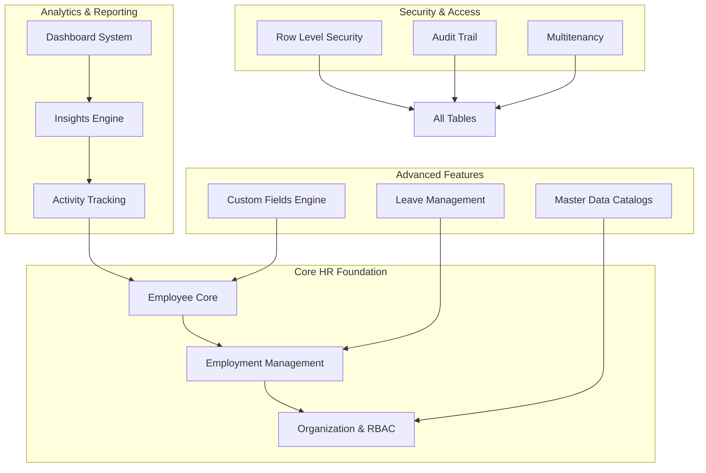
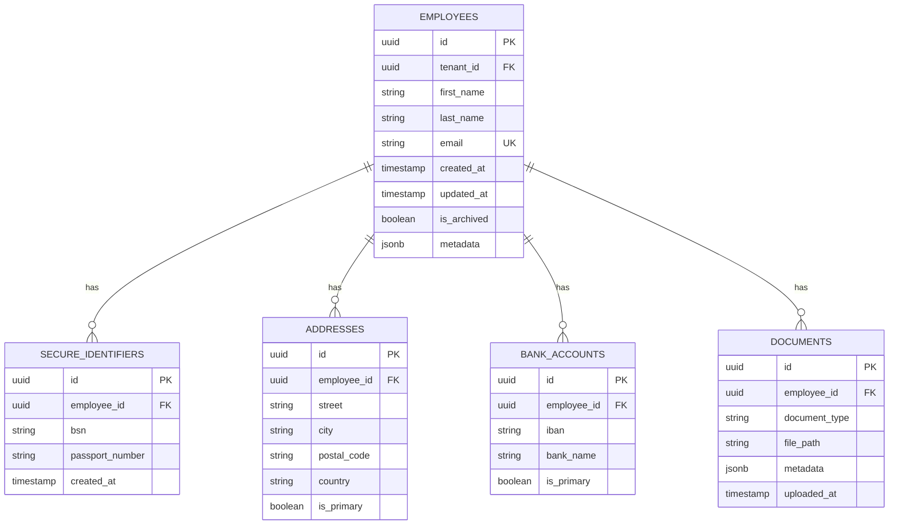
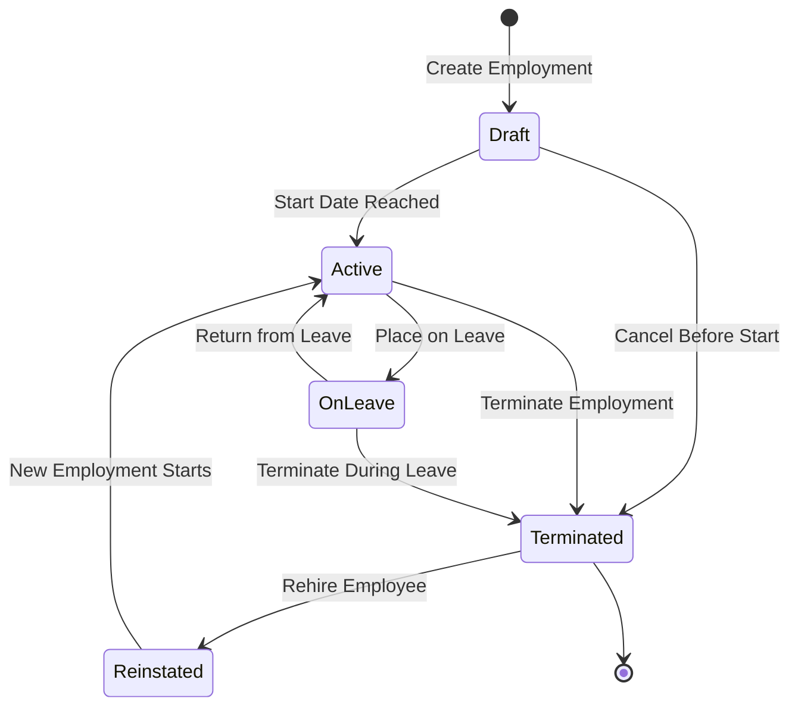
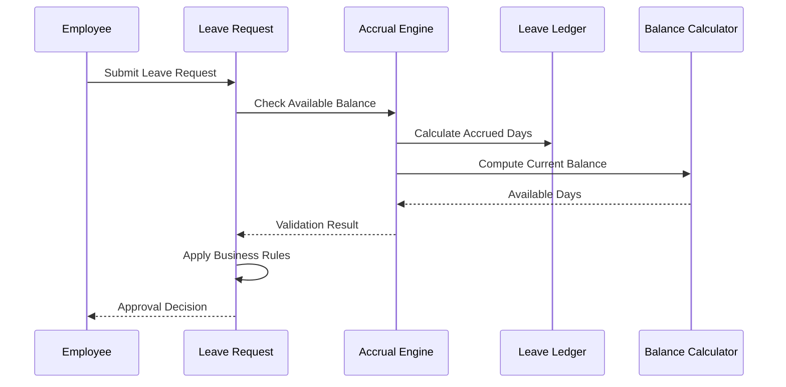
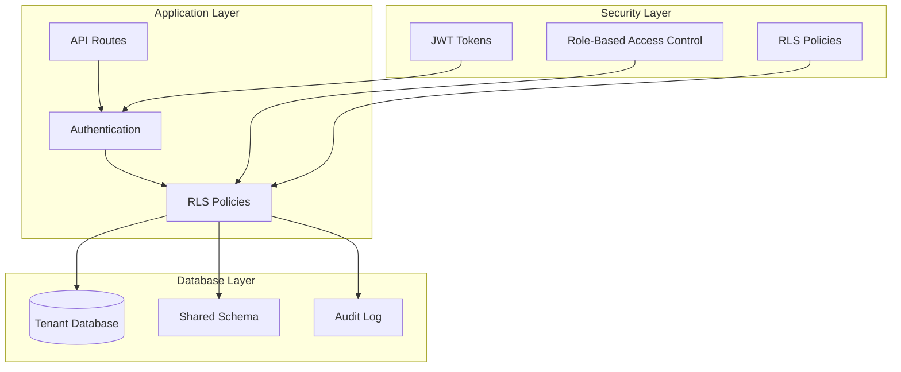
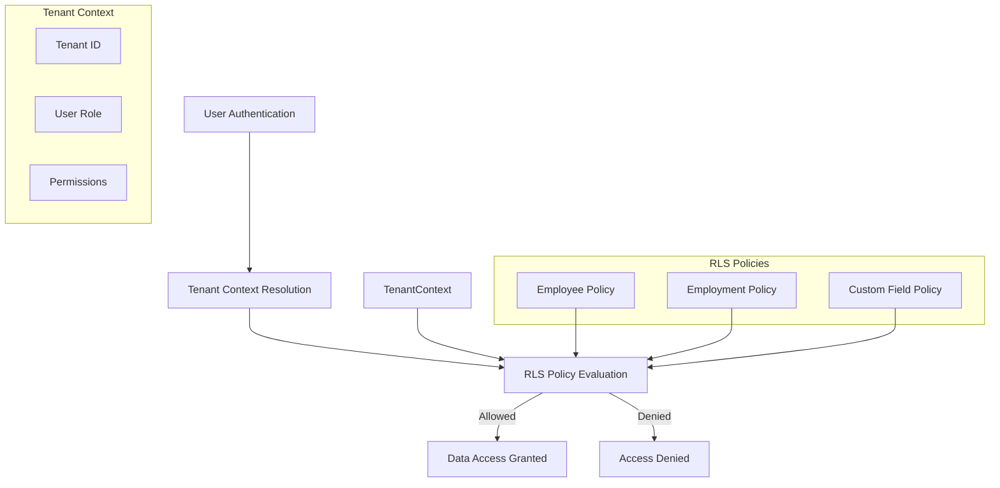
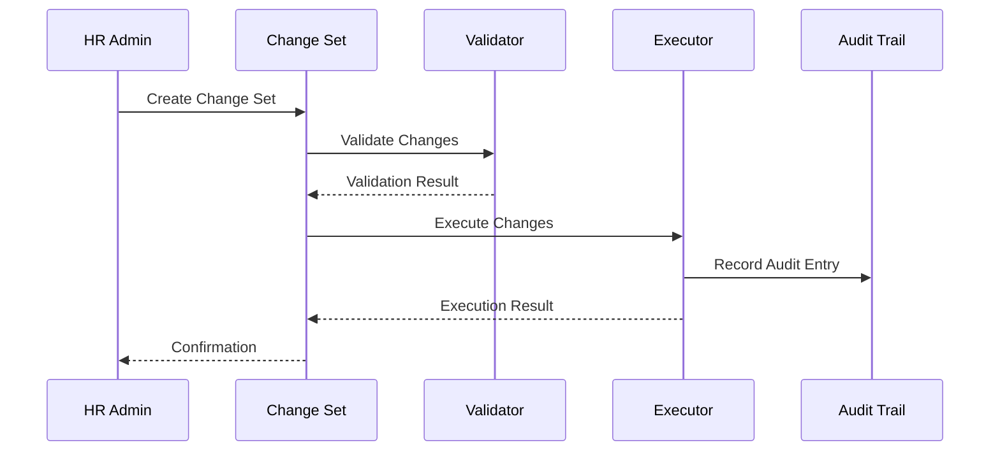
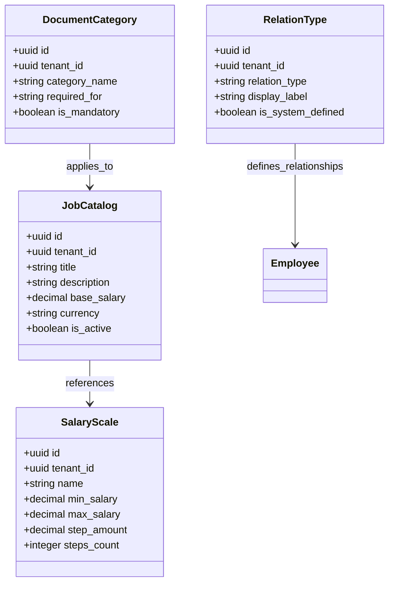
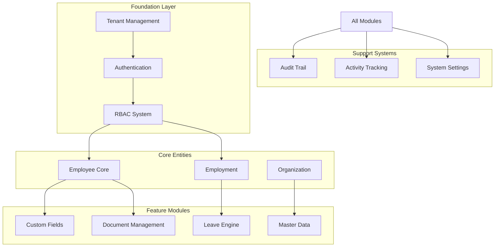

# Database Design

<cite>
**Referenced Files in This Document**
- [20260712124858_init_employee_core_hr.sql](file://apps/hr-suite/supabase/migrations/20260712124858_init_employee_core_hr.sql)
- [20260712124911_add_tenant_rbac_and_organization.sql](file://apps/hr-suite/supabase/migrations/20260712124911_add_tenant_rbac_and_organization.sql)
- [20260715122802_add_custom_field_definitions.sql](file://apps/hr-suite/supabase/migrations/20260715122802_add_custom_field_definitions.sql)
- [20260715071156_add_employment_core.sql](file://apps/hr-suite/supabase/migrations/20260715071156_add_employment_core.sql)
- [20260722142551_add_leave_engine_foundation.sql](file://apps/hr-suite/supabase/migrations/20260722142551_add_leave_engine_foundation.sql)
- [20260715123119_add_custom_field_value_rpc.sql](file://apps/hr-suite/supabase/migrations/20260715123119_add_custom_field_value_rpc.sql)
- [20260715123639_add_organization_authorization_management.sql](file://apps/hr-suite/supabase/migrations/20260715123639_add_organization_authorization_management.sql)
- [20260715124506_isolate_employee_secure_identifiers.sql](file://apps/hr-suite/supabase/migrations/20260715124506_isolate_employee_secure_identifiers.sql)
- [20260715131230_seed_custom_fields_and_tenant_roles.sql](file://apps/hr-suite/supabase/migrations/20260715131230_seed_custom_fields_and_tenant_roles.sql)
- [20260715141843_add_employment_change_management.sql](file://apps/hr-suite/supabase/migrations/20260715141843_add_employment_change_management.sql)
- [20260715145432_optimize_employment_change_management.sql](file://apps/hr-suite/supabase/migrations/20260715145432_optimize_employment_change_management.sql)
- [20260716100000_add_combined_employment_change_sets.sql](file://apps/hr-suite/supabase/migrations/20260716100000_add_combined_employment_change_sets.sql)
- [20260718100000_add_job_catalog_salary_revisions.sql](file://apps/hr-suite/supabase/migrations/20260718100000_add_job_catalog_salary_revisions.sql)
- [20260718100500_add_master_data_mutation_rpcs.sql](file://apps/hr-suite/supabase/migrations/20260718100500_add_master_data_mutation_rpcs.sql)
- [20260718120000_add_hr_change_event_projection.sql](file://apps/hr-suite/supabase/migrations/20260718120000_add_hr_change_event projection.sql)
- [20260718121308_add_settings_modules_work_patterns_holidays.sql](file://apps/hr-suite/supabase/migrations/20260718121308_add_settings_modules_work_patterns_holidays.sql)
- [20260718130000_add_hr_calendar_permission.sql](file://apps/hr-suite/supabase/migrations/20260718130000_add_hr_calendar_permission.sql)
- [20260718150000_add_employee_archive_and_avatar_state.sql](file://apps/hr-suite/supabase/migrations/20260718150000_add_employee_archive_and_avatar_state.sql)
- [20260718170000_add_dashboard_widget_catalog.sql](file://apps/hr-suite/supabase/migrations/20260718170000_add_dashboard_widget_catalog.sql)
- [20260719153000_add_star_performer_management.sql](file://apps/hr-suite/supabase/migrations/20260719153000_add_star_performer_management.sql)
- [20260722190000_add_leave_request_booking_engine.sql](file://apps/hr-suite/supabase/migrations/20260722190000_add_leave_request_booking_engine.sql)
- [20260722192000_add_leave_ledger_operations.sql](file://apps/hr-suite/supabase/migrations/20260722192000_add_leave_ledger_operations.sql)
- [20260724160000_add_employee_activity_entries.sql](file://apps/hr-suite/supabase/migrations/20260724160000_add_employee_activity_entries.sql)
</cite>

## Table of Contents
1. [Introduction](#introduction)
2. [Project Structure](#project-structure)
3. [Core Components](#core-components)
4. [Architecture Overview](#architecture-overview)
5. [Detailed Component Analysis](#detailed-component-analysis)
6. [Dependency Analysis](#dependency-analysis)
7. [Performance Considerations](#performance-considerations)
8. [Troubleshooting Guide](#troubleshooting-guide)
9. [Conclusion](#conclusion)
10. [Appendices](#appendices)

## Introduction

LiquidHR is a comprehensive Human Resources management system built with Next.js and Supabase, featuring a sophisticated PostgreSQL database schema designed for multi-tenant HR operations. The database architecture supports core HR functions including employee management, employment tracking, organizational structures, custom fields, leave management, and advanced authorization systems.

The system implements enterprise-grade security through Row Level Security (RLS) policies, ensuring strict tenant isolation while maintaining data integrity across complex HR workflows. The schema is designed to handle large-scale HR operations with performance optimizations, comprehensive audit trails, and flexible customization capabilities.

## Project Structure

The LiquidHR database schema follows a modular migration-based approach using Supabase migrations. Each migration file represents a specific feature or enhancement, allowing for incremental database evolution while maintaining backward compatibility.



**Diagram sources**
- [20260712124858_init_employee_core_hr.sql:1-50](file://apps/hr-suite/supabase/migrations/20260712124858_init_employee_core_hr.sql#L1-L50)
- [20260712124911_add_tenant_rbac_and_organization.sql:1-50](file://apps/hr-suite/supabase/migrations/20260712124911_add_tenant_rbac_and_organization.sql#L1-L50)
- [20260715122802_add_custom_field_definitions.sql:1-50](file://apps/hr-suite/supabase/migrations/20260715122802_add_custom_field_definitions.sql#L1-L50)

**Section sources**
- [20260712124858_init_employee_core_hr.sql:1-100](file://apps/hr-suite/supabase/migrations/20260712124858_init_employee_core_hr.sql#L1-L100)
- [20260712124911_add_tenant_rbac_and_organization.sql:1-100](file://apps/hr-suite/supabase/migrations/20260712124911_add_tenant_rbac_and_organization.sql#L1-L100)

## Core Components

### Employee Management System

The employee core system forms the foundation of LiquidHR's HR functionality, providing comprehensive employee lifecycle management with secure identifier handling and archival capabilities.

#### Key Tables and Relationships



**Diagram sources**
- [20260712124858_init_employee_core_hr.sql:1-150](file://apps/hr-suite/supabase/migrations/20260712124858_init_employee_core_hr.sql#L1-L150)
- [20260715124506_isolate_employee_secure_identifiers.sql:1-100](file://apps/hr-suite/supabase/migrations/20260715124506_isolate_employee_secure_identifiers.sql#L1-L100)

### Employment Lifecycle Management

The employment system manages the complete employee lifecycle from hiring to termination, supporting multiple concurrent employments and complex organizational hierarchies.

#### Employment State Machine



**Diagram sources**
- [20260715071156_add_employment_core.sql:1-200](file://apps/hr-suite/supabase/migrations/20260715071156_add_employment_core.sql#L1-L200)
- [20260715071717_add_employment_terminations.sql:1-150](file://apps/hr-suite/supabase/migrations/20260715071717_add_employment_terminations.sql#L1-L150)

### Custom Fields Engine

LiquidHR implements a flexible custom fields system that allows organizations to extend employee records with organization-specific attributes without database schema modifications.

#### Custom Field Architecture

```mermaid
classDiagram
class CustomFieldDefinition {
+uuid id
+uuid tenant_id
+string field_name
+string field_type
+jsonb validation_rules
+boolean is_required
+boolean is_searchable
+integer display_order
}
class CustomFieldValue {
+uuid id
+uuid definition_id
+uuid entity_id
+text value_text
+numeric value_numeric
+boolean value_boolean
+date value_date
+timestamp value_timestamp
}
class Employee {
+uuid id
+string first_name
+string last_name
+string email
}
CustomFieldDefinition ||--o{ CustomFieldValue : defines
Employee ||--o{ CustomFieldValue : has_values
```

**Diagram sources**
- [20260715122802_add_custom_field_definitions.sql:1-150](file://apps/hr-suite/supabase/migrations/20260715122802_add_custom_field_definitions.sql#L1-L150)
- [20260715123119_add_custom_field_value_rpc.sql:1-100](file://apps/hr-suite/supabase/migrations/20260715123119_add_custom_field_value_rpc.sql#L1-L100)

### Leave Management Engine

The leave engine provides comprehensive leave management with accrual calculation, request processing, and balance tracking across different leave types.

#### Leave Transaction Flow



**Diagram sources**
- [20260722142551_add_leave_engine_foundation.sql:1-200](file://apps/hr-suite/supabase/migrations/20260722142551_add_leave_engine_foundation.sql#L1-L200)
- [20260722190000_add_leave_request_booking_engine.sql:1-150](file://apps/hr-suite/supabase/migrations/20260722190000_add_leave_request_booking_engine.sql#L1-L150)
- [20260722192000_add_leave_ledger_operations.sql:1-100](file://apps/hr-suite/supabase/migrations/20260722192000_add_leave_ledger_operations.sql#L1-L100)

## Architecture Overview

The LiquidHR database architecture follows a multi-tenant design pattern with strict isolation between tenants while sharing common infrastructure. The system implements comprehensive Row Level Security (RLS) policies to ensure data isolation at the database level.



**Diagram sources**
- [20260712124911_add_tenant_rbac_and_organization.sql:1-100](file://apps/hr-suite/supabase/migrations/20260712124911_add_tenant_rbac_and_organization.sql#L1-L100)
- [20260715123639_add_organization_authorization_management.sql:1-100](file://apps/hr-suite/supabase/migrations/20260715123639_add_organization_authorization_management.sql#L1-L100)

## Detailed Component Analysis

### Multitenancy and Authorization System

The multitenancy system ensures complete data isolation between different organizations while maintaining shared authentication and user management.

#### Tenant Isolation Strategy



**Diagram sources**
- [20260712124911_add_tenant_rbac_and_organization.sql:1-200](file://apps/hr-suite/supabase/migrations/20260712124911_add_tenant_rbac_and_organization.sql#L1-L200)
- [20260715123639_add_organization_authorization_management.sql:1-150](file://apps/hr-suite/supabase/migrations/20260715123639_add_organization_authorization_management.sql#L1-L150)

### Employment Change Management

The employment change system tracks all modifications to employment records with full audit trail and version control capabilities.

#### Change Tracking Implementation



**Diagram sources**
- [20260715141843_add_employment_change_management.sql:1-200](file://apps/hr-suite/supabase/migrations/20260715141843_add_employment_change_management.sql#L1-L200)
- [20260716100000_add_combined_employment_change_sets.sql:1-150](file://apps/hr-suite/supabase/migrations/20260716100000_add_combined_employment_change_sets.sql#L1-L150)

### Master Data Management

The master data system provides centralized management for organizational reference data including job catalogs, salary scales, and document categories.

#### Master Data Architecture



**Diagram sources**
- [20260718100000_add_job_catalog_salary_revisions.sql:1-150](file://apps/hr-suite/supabase/migrations/20260718100000_add_job_catalog_salary_revisions.sql#L1-L150)
- [20260718100500_add_master_data_mutation_rpcs.sql:1-100](file://apps/hr-suite/supabase/migrations/20260718100500_add_master_data_mutation_rpcs.sql#L1-L100)

## Dependency Analysis

The database schema demonstrates careful dependency management with clear separation of concerns and minimal circular dependencies.



**Diagram sources**
- [20260712124911_add_tenant_rbac_and_organization.sql:1-100](file://apps/hr-suite/supabase/migrations/20260712124911_add_tenant_rbac_and_organization.sql#L1-L100)
- [20260715122802_add_custom_field_definitions.sql:1-100](file://apps/hr-suite/supabase/migrations/20260715122802_add_custom_field_definitions.sql#L1-L100)
- [20260722142551_add_leave_engine_foundation.sql:1-100](file://apps/hr-suite/supabase/migrations/20260722142551_add_leave_engine_foundation.sql#L1-L100)

**Section sources**
- [20260712124911_add_tenant_rbac_and_organization.sql:1-200](file://apps/hr-suite/supabase/migrations/20260712124911_add_tenant_rbac_and_organization.sql#L1-L200)
- [20260715122802_add_custom_field_definitions.sql:1-200](file://apps/hr-suite/supabase/migrations/20260715122802_add_custom_field_definitions.sql#L1-L200)

## Performance Considerations

### Indexing Strategy

The database schema implements strategic indexing to optimize query performance across common access patterns:

- **Foreign Key Indexes**: Comprehensive indexing on all foreign key relationships to optimize join operations
- **Composite Indexes**: Multi-column indexes for frequently queried combinations (tenant_id + entity_id)
- **Partial Indexes**: Conditional indexes for active records only, reducing index size
- **Covering Indexes**: Indexes that include frequently accessed columns to avoid table lookups

### Query Optimization Patterns

Common optimization patterns implemented in the schema:

1. **Partitioning Strategy**: Large tables like activity logs and audit trails are partitioned by date ranges
2. **Materialized Views**: Pre-computed views for complex analytics queries
3. **Connection Pooling**: Optimized connection settings for high-concurrency scenarios
4. **Query Plan Caching**: Strategic use of prepared statements for repeated queries

### Scalability Considerations

The schema is designed for horizontal scaling with:

- **Sharding Ready**: Clear tenant isolation enables easy database sharding
- **Read Replicas**: Read-heavy operations can be offloaded to replicas
- **Archive Strategy**: Historical data archiving for performance maintenance
- **Caching Layers**: Application-level caching for frequently accessed data

## Troubleshooting Guide

### Common Database Issues

#### RLS Policy Violations

When encountering permission denied errors:

1. Verify tenant context is properly set in the session
2. Check user role assignments and permissions
3. Review RLS policy definitions for the specific table
4. Ensure proper foreign key relationships exist

#### Performance Degradation

For slow queries:

1. Analyze query execution plans using EXPLAIN ANALYZE
2. Check for missing indexes on frequently queried columns
3. Monitor connection pool utilization
4. Review table statistics and update if necessary

#### Data Integrity Issues

For constraint violations:

1. Verify referential integrity before bulk operations
2. Check for orphaned records in related tables
3. Validate custom field values against defined schemas
4. Review audit trails for recent changes

### Monitoring and Maintenance

Regular maintenance tasks include:

- **Index Rebuilding**: Schedule periodic index rebuilds for heavily modified tables
- **Statistics Updates**: Regular UPDATE STATISTICS to maintain query optimizer accuracy
- **Vacuum Operations**: Configure autovacuum for optimal table maintenance
- **Backup Verification**: Regular backup restoration testing

## Conclusion

The LiquidHR database schema represents a comprehensive, enterprise-grade solution for HR management with strong emphasis on security, scalability, and flexibility. The multi-tenant architecture with Row Level Security ensures complete data isolation while the flexible custom fields system allows for extensive customization without schema modifications.

Key strengths of the design include:

- **Robust Security Model**: Comprehensive RLS policies and tenant isolation
- **Flexible Extensibility**: Custom fields engine for organization-specific requirements  
- **Comprehensive Audit Trail**: Complete change tracking and activity monitoring
- **Performance Optimized**: Strategic indexing and query optimization patterns
- **Scalable Architecture**: Designed for horizontal scaling and high availability

The schema successfully balances complexity with usability, providing powerful HR functionality while maintaining data integrity and security standards required for enterprise HR applications.

## Appendices

### Migration Strategy

The migration strategy follows semantic versioning principles with each migration representing a discrete feature or enhancement. Rollback procedures are well-defined, and forward-only migrations ensure consistent database state across environments.

### Backup and Recovery Procedures

Recommended backup strategies include:

- **Full Backups**: Daily complete database backups with retention policies
- **Incremental Backups**: Hourly transaction log backups for point-in-time recovery
- **Cross-Region Replication**: Geographic redundancy for disaster recovery
- **Automated Testing**: Regular backup restoration testing to verify integrity

### Compliance Considerations

The schema addresses key compliance requirements:

- **GDPR Compliance**: Personal data isolation and right-to-erasure support
- **SOX Compliance**: Comprehensive audit trails and change tracking
- **Data Retention**: Configurable retention policies for different data types
- **Access Controls**: Granular permissions aligned with HR data sensitivity levels