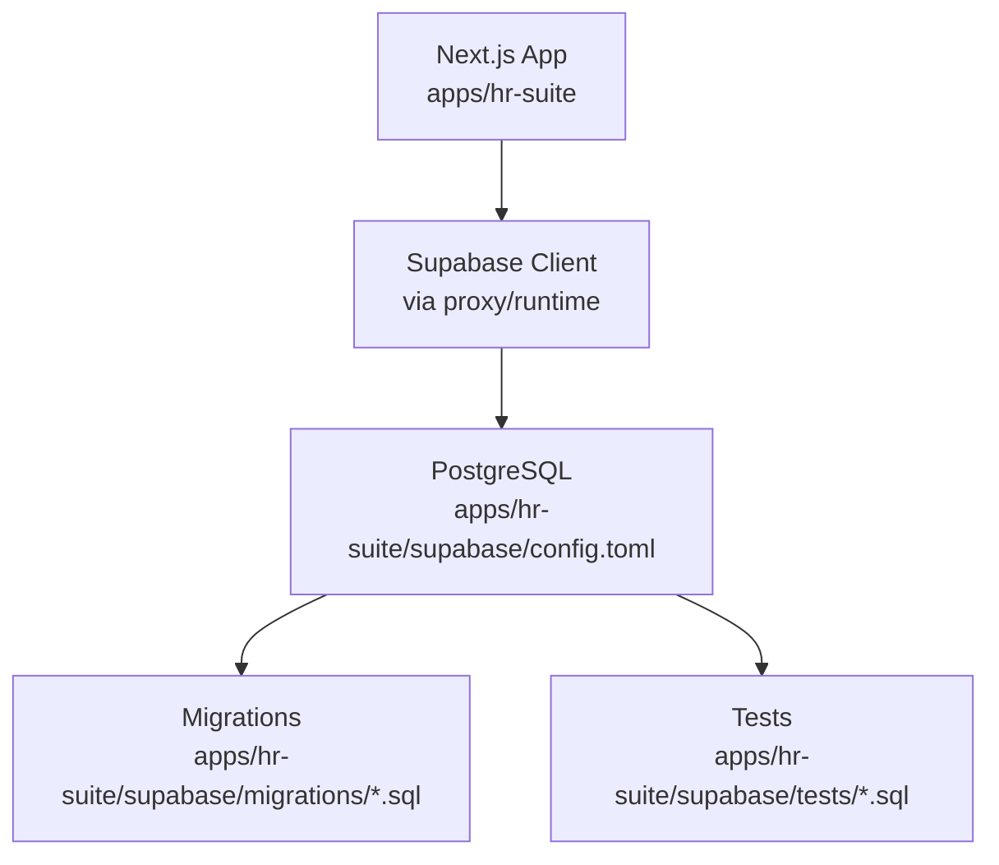
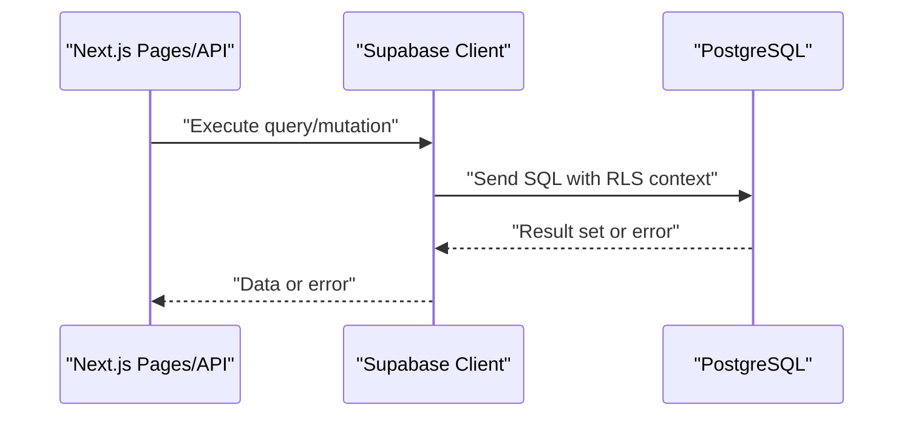
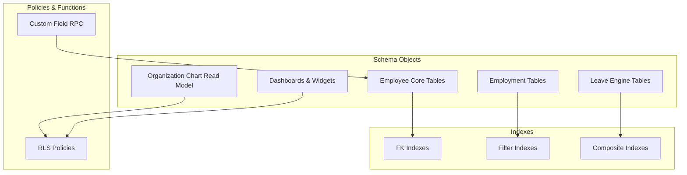

# Performance Optimization

<cite>
**Referenced Files in This Document**
- [package.json](file://apps/hr-suite/package.json)
- [next.config.ts](file://apps/hr-suite/next.config.ts)
- [proxy.ts](file://apps/hr-suite/proxy.ts)
- [supabase/config.toml](file://apps/hr-suite/supabase/config.toml)
- [20260712124858_init_employee_core_hr.sql](file://apps/hr-suite/supabase/migrations/20260712124858_init_employee_core_hr.sql)
- [20260712124911_add_tenant_rbac_and_organization.sql](file://apps/hr-suite/supabase/migrations/20260712124911_add_tenant_rbac_and_organization.sql)
- [20260712125420_revoke_public_rls_trigger_execution.sql](file://apps/hr-suite/supabase/migrations/20260712125420_revoke_public_rls_trigger_execution.sql)
- [20260712125522_optimize_rbac_indexes_and_policies.sql](file://apps/hr-suite/supabase/migrations/20260712125522_optimize_rbac_indexes_and_policies.sql)
- [20260714170949_harden_organization_authorization.sql](file://apps/hr-suite/supabase/migrations/20260714170949_harden_organization_authorization.sql)
- [20260714171241_link_employees_from_auth_trigger.sql](file://apps/hr-suite/supabase/migrations/20260714171241_link_employees_from_auth trigger.sql)
- [20260714174305_add_multitenancy_administrations.sql](file://apps/hr-suite/supabase/migrations/20260714174305_add_multitenancy_administrations.sql)
- [20260714175659_seed_multitenancy_demo.sql](file://apps/hr-suite/supabase/migrations/20260714175659_seed_multitenancy_demo.sql)
- [20260714180142_enforce_administration_management_scope.sql](file://apps/hr-suite/supabase/migrations/20260714180142_enforce_administration_management_scope.sql)
- [20260714180309_index_employee_organization_scope_foreign_keys.sql](file://apps/hr-suite/supabase/migrations/20260714180309_index_employee_organization_scope_foreign_keys.sql)
- [20260715064245_add_user_invitations.sql](file://apps/hr-suite/supabase/migrations/20260715064245_add_user_invitations.sql)
- [20260715064924_harden_user_invitation_acceptance.sql](file://apps/hr-suite/supabase/migrations/20260715064924_harden_user_invitation_acceptance.sql)
- [20260715070404_add_user_preferences.sql](file://apps/hr-suite/supabase/migrations/20260715070404_add_user_preferences.sql)
- [20260715071054_add_employee_identity_matching.sql](file://apps/hr-suite/supabase/migrations/20260715071054_add_employee_identity_matching.sql)
- [20260715071156_add_employment_core.sql](file://apps/hr-suite/supabase/migrations/20260715071156_add_employment_core.sql)
- [20260715071422_add_employment_timelines.sql](file://apps/hr-suite/supabase/migrations/20260715071422_add_employment_timelines.sql)
- [20260715071717_add_employment_terminations.sql](file://apps/hr-suite/supabase/migrations/20260715071717_add_employment_terminations.sql)
- [20260715072010_harden_employment_security.sql](file://apps/hr-suite/supabase/migrations/20260715072010_harden_employment_security.sql)
- [20260715072908_seed_employment_demo.sql](file://apps/hr-suite/supabase/migrations/20260715072908_seed_employment_demo.sql)
- [20260715120810_complete_employee_core.sql](file://apps/hr-suite/supabase/migrations/20260715120810_complete_employee_core.sql)
- [20260715121304_optimize_employee_core_indexes.sql](file://apps/hr-suite/supabase/migrations/20260715121304_optimize_employee_core_indexes.sql)
- [20260715122802_add_custom_field_definitions.sql](file://apps/hr-suite/supabase/migrations/20260715122802_add_custom_field_definitions.sql)
- [20260715123119_add_custom_field_value_rpc.sql](file://apps/hr-suite/supabase/migrations/20260715123119_add_custom_field_value_rpc.sql)
- [20260715123639_add_organization_authorization_management.sql](file://apps/hr-suite/supabase/migrations/20260715123639_add_organization_authorization_management.sql)
- [20260715123927_harden_custom_field_values.sql](file://apps/hr-suite/supabase/migrations/20260715123927_harden_custom_field_values.sql)
- [20260715124506_isolate_employee_secure_identifiers.sql](file://apps/hr-suite/supabase/migrations/20260715124506_isolate_employee_secure_identifiers.sql)
- [20260715124744_allow_logged_bsn_reveal.sql](file://apps/hr-suite/supabase/migrations/20260715124744_allow_logged_bsn_reveal.sql)
- [20260715130026_index_secure_employee_foreign_keys.sql](file://apps/hr-suite/supabase/migrations/20260715130026_index_secure_employee_foreign_keys.sql)
- [20260715131230_seed_custom_fields_and_tenant_roles.sql](file://apps/hr-suite/supabase/migrations/20260715131230_seed_custom_fields_and_tenant_roles.sql)
- [20260715141843_add_employment_change_management.sql](file://apps/hr-suite/supabase/migrations/20260715141843_add_employment_change_management.sql)
- [20260715145432_optimize_employment_change_management.sql](file://apps/hr-suite/supabase/migrations/20260715145432_optimize_employment_change_management.sql)
- [20260715173629_restore_employee_subresource_grants.sql](file://apps/hr-suite/supabase/migrations/20260715173629_restore_employee_subresource_grants.sql)
- [20260716081000_add_time_hub_reminders.sql](file://apps/hr-suite/supabase/migrations/20260716081000_add_time_hub_reminders.sql)
- [20260716090000_fix_reminder_recipient_rls_recursion.sql](file://apps/hr-suite/supabase/migrations/20260716090000_fix_reminder_recipient_rls_recursion.sql)
- [20260716092000_fix_reminder_publish_auth_lookup.sql](file://apps/hr-suite/supabase/migrations/20260716092000_fix_reminder_publish_auth_lookup.sql)
- [20260716092637_add_hera_ai_agent.sql](file://apps/hr-suite/supabase/migrations/20260716092637_add_hera_ai_agent.sql)
- [20260716100000_add_combined_employment_change_sets.sql](file://apps/hr-suite/supabase/migrations/20260716100000_add_combined_employment_change_sets.sql)
- [20260716110000_add_organization_chart_read_model.sql](file://apps/hr-suite/supabase/migrations/20260716110000_add_organization_chart_read_model.sql)
- [20260716120000_add_personal_dashboards.sql](file://apps/hr-suite/supabase/migrations/20260716120000_add_personal_dashboards.sql)
- [20260717100000_harden_hera_memory_and_preferences.sql](file://apps/hr-suite/supabase/migrations/20260717100000_harden_hera_memory_and_preferences.sql)
- [20260717100500_index_hera_preferences.sql](file://apps/hr-suite/supabase/migrations/20260717100500_index_hera_preferences.sql)
- [20260717101000_add_hera_message_metadata.sql](file://apps/hr-suite/supabase/migrations/20260717101000_add_hera_message_metadata.sql)
- [20260718090000_complete_employment_flow.sql](file://apps/hr-suite/supabase/migrations/20260718090000_complete_employment_flow.sql)
- [20260718100000_add_job_catalog_salary_revisions.sql](file://apps/hr-suite/supabase/migrations/20260718100000_add_job_catalog_salary_revisions.sql)
- [20260718100500_add_master_data_mutation_rpcs.sql](file://apps/hr-suite/supabase/migrations/20260718100500_add_master_data_mutation_rpcs.sql)
- [20260718100600_index_master_data_foreign_keys.sql](file:///apps/hr-suite/supabase/migrations/20260718100600_index_master_data_foreign_keys.sql)
- [20260718110000_add_employee_document_dossiers.sql](file://apps/hr-suite/supabase/migrations/20260718110000_add_employee_document_dossiers.sql)
- [20260718110100_fix_document_reminder_recipient_resolution.sql](file://apps/hr-suite/supabase/migrations/20260718110100_fix_document_reminder_recipient_resolution.sql)
- [20260718120000_add_hr_change_event_projection.sql](file://apps/hr-suite/supabase/migrations/20260718120000_add_hr_change_event_projection.sql)
- [20260718121308_add_settings_modules_work_patterns_holidays.sql](file://apps/hr-suite/supabase/migrations/20260718121308_add_settings_modules_work_patterns_holidays.sql)
- [20260718122138_harden_settings_rosters_holidays.sql](file://apps/hr-suite/supabase/migrations/20260718122138_harden_settings_rosters_holidays.sql)
- [20260718122614_enforce_optional_module_guards.sql](file://apps/hr-suite/supabase/migrations/20260718122614_enforce_optional_module_guards.sql)
- [20260718122751_expose_module_state_to_tenant_users.sql](file://apps/hr-suite/supabase/migrations/20260718122751_expose_module_state_to_tenant_users.sql)
- [20260718123742_add_holiday_snapshot_import.sql](file://apps/hr-suite/supabase/migrations/20260718123742_add_holiday_snapshot_import.sql)
- [20260718124240_allow_hr_calendar_recipient_read.sql](file://apps/hr-suite/supabase/migrations/20260718124240_allow_hr_calendar_recipient_read.sql)
- [20260718130000_add_hr_calendar_permission.sql](file://apps/hr-suite/supabase/migrations/20260718130000_add_hr_calendar_permission.sql)
- [20260718131000_harden_hr_master_data_document_policies.sql](file://apps/hr-suite/supabase/migrations/20260718131000_harden_hr_master_data_document_policies.sql)
- [20260718132000_split_reminder_target_write_policy.sql](file://apps/hr-suite/supabase/migrations/20260718132000_split_reminder_target_write_policy.sql)
- [20260718150000_add_employee_archive_and_avatar_state.sql](file://apps/hr-suite/supabase/migrations/20260718150000_add_employee_archive_and_avatar_state.sql)
- [20260718170000_add_dashboard_widget_catalog.sql](file://apps/hr-suite/supabase/migrations/20260718170000_add_dashboard_widget_catalog.sql)
- [20260718171000_relax_dashboard_widget_read_scope.sql](file://apps/hr-suite/supabase/migrations/20260718171000_relax_dashboard_widget_read_scope.sql)
- [20260718172000_expand_personal_dashboard_widget_types.sql](file://apps/hr-suite/supabase/migrations/20260718172000_expand_personal_dashboard_widget_types.sql)
- [20260718172051_grant_dashboard_widget_admin_permissions.sql](file://apps/hr-suite/supabase/migrations/20260718172051_grant_dashboard_widget_admin_permissions.sql)
- [20260718173000_tune_dashboard_widget_policies.sql](file://apps/hr-suite/supabase/migrations/20260718173000_tune_dashboard_widget_policies.sql)
- [20260718180354_add_date_time_user_preferences.sql](file://apps/hr-suite/supabase/migrations/20260718180354_add_date_time_user_preferences.sql)
- [20260719101500_refine_employee_document_upload_rules.sql](file://apps/hr-suite/supabase/migrations/20260719101500_refine_employee_document_upload_rules.sql)
- [20260719112000_add_week_numbering_user_preference.sql](file://apps/hr-suite/supabase/migrations/20260719112000_add_week_numbering_user_preference.sql)
- [20260719153000_add_star_performer_management.sql](file://apps/hr-suite/supabase/migrations/20260719153000_add_star_performer_management.sql)
- [20260719170000_add_tenant_relation_type_catalog.sql](file://apps/hr-suite/supabase/migrations/20260719170000_add_tenant_relation_type_catalog.sql)
- [20260719180000_allow_custom_relation_type_catalog_entries.sql](file://apps/hr-suite/supabase/migrations/20260719180000_allow_custom_relation_type_catalog_entries.sql)
- [20260719181000_index_relation_type_catalog_fk.sql](file://apps/hr-suite/supabase/migrations/20260719181000_index_relation_type_catalog_fk.sql)
- [20260722142551_add_leave_engine_foundation.sql](file://apps/hr-suite/supabase/migrations/20260722142551_add_leave_engine_foundation.sql)
- [20260722144232_add_leave_engine_fk_indexes.sql](file://apps/hr-suite/supabase/migrations/20260722144232_add_leave_engine_fk_indexes.sql)
- [20260722144344_add_leave_transaction_bucket_fk_index.sql](file://apps/hr-suite/supabase/migrations/20260722144344_add_leave_transaction_bucket_fk_index.sql)
- [20260722151920_add_leave_configuration_mutation_functions.sql](file://apps/hr-suite/supabase/migrations/20260722151920_add_leave_configuration_mutation_functions.sql)
- [20260722173000_add_work_hour_type_colors.sql](file://apps/hr-suite/supabase/migrations/20260722173000_add_work_hour_type_colors.sql)
- [20260722173100_normalize_catalog_color_defaults.sql](file://apps/hr-suite/supabase/migrations/20260722173100_normalize_catalog_color_defaults.sql)
- [20260722190000_add_leave_request_booking_engine.sql](file://apps/hr-suite/supabase/migrations/20260722190000_add_leave_request_booking_engine.sql)
- [20260722190500_seed_leave_demo_linda.sql](file://apps/hr-suite/supabase/migrations/20260722190500_seed_leave_demo_linda.sql)
- [20260722191500_add_leave_request_fk_indexes.sql](file://apps/hr-suite/supabase/migrations/20260722191500_add_leave_request_fk_indexes.sql)
- [20260722192000_add_leave_ledger_operations.sql](file://apps/hr-suite/supabase/migrations/20260722192000_add_leave_ledger_operations.sql)
- [20260722192100_seed_leave_demo_year_controls.sql](file://apps/hr-suite/supabase/migrations/20260722192100_seed_leave_demo_year_controls.sql)
- [20260722192500_skip_holidays_in_leave_requests.sql](file://apps/hr-suite/supabase/migrations/20260722192500_skip_holidays_in_leave_requests.sql)
- [20260723151000_optimize_employee_overview.sql](file://apps/hr-suite/supabase/migrations/20260723151000_optimize_employee_overview.sql)
- [20260724095433_insights_report_permissions.sql](file://apps/hr-suite/supabase/migrations/20260724095433_insights_report_permissions.sql)
- [20260724100605_upcoming_events_and_anniversary_rules.sql](file://apps/hr-suite/supabase/migrations/20260724100605_upcoming_events_and_anniversary_rules.sql)
- [20260724103939_simplify_roles_and_insights_events.sql](file://apps/hr-suite/supabase/migrations/20260724103939_simplify_roles_and_insights_events.sql)
- [20260724112407_add_role_assignment_scope.sql](file://apps/hr-suite/supabase/migrations/20260724112407_add_role_assignment_scope.sql)
- [20260724160000_add_employee_activity_entries.sql](file://apps/hr-suite/supabase/migrations/20260724160000_add_employee_activity_entries.sql)
- [20260724172716_harden_employee_activity_entries.sql](file://apps/hr-suite/supabase/migrations/20260724172716_harden_employee_activity_entries.sql)
- [20260725132351_address_input_internationalization.sql](file://apps/hr-suite/supabase/migrations/20260725132351_address_input_internationalization.sql)
- [employee_overview.sql](file://apps/hr-suite/supabase/tests/employee_overview.sql)
- [employee_core_crud_isolation.sql](file://apps/hr-suite/supabase/tests/employee_core_crud_isolation.sql)
- [leave_engine_foundation.sql](file://apps/hr-suite/supabase/tests/leave_engine_foundation.sql)
- [multitenancy_isolation.sql](file://apps/hr-suite/supabase/tests/multitenancy_isolation.sql)
- [organization_chart.sql](file://apps/hr-suite/supabase/tests/organization_chart.sql)
</cite>

## Table of Contents
1. Introduction
2. Project Structure
3. Core Components
4. Architecture Overview
5. Detailed Component Analysis
6. Dependency Analysis
7. Performance Considerations
8. Troubleshooting Guide
9. Conclusion
10. Appendices

## Introduction
This document provides a comprehensive performance optimization guide for LiquidHR’s database layer. It focuses on indexing strategies, query optimization, execution plan analysis, connection pooling, caching, read/write splitting, monitoring and slow query detection, scaling considerations, partitioning, archive management, maintenance tasks, and benchmarking practices grounded in the codebase. The goal is to help engineers and DBAs maintain high throughput and low latency as the dataset grows.

## Project Structure
LiquidHR uses a Next.js application with Supabase (PostgreSQL) for persistence. Database schema and indexes are managed via SQL migrations under apps/hr-suite/supabase/migrations. Tests validate behavior and performance-sensitive flows. Configuration for the local Supabase instance resides under apps/hr-suite/supabase/config.toml.

**Diagram sources**
- [next.config.ts](file://apps/hr-suite/next.config.ts)
- [proxy.ts](file://apps/hr-suite/proxy.ts)
- [supabase/config.toml](file://apps/hr-suite/supabase/config.toml)

**Section sources**
- [package.json](file://apps/hr-suite/package.json)
- [next.config.ts](file://apps/hr-suite/next.config.ts)
- [proxy.ts](file://apps/hr-suite/proxy.ts)
- [supabase/config.toml](file://apps/hr-suite/supabase/config.toml)

## Core Components
The database layer centers around:
- Schema and indexes defined in migration files
- Row-level security policies and RBAC that influence query paths
- Read models and projections used by dashboards and insights
- Test suites that exercise critical queries and constraints

Key areas impacting performance:
- Employee core tables and related indexes
- Employment lifecycle tables and change sets
- Leave engine foundation and ledger operations
- Organization chart read model
- Personal dashboards and widget catalogs
- HR calendar and reminders
- Custom fields and secure identifiers
- Multitenancy scoping and administration boundaries

**Section sources**
- [20260712124858_init_employee_core_hr.sql](file://apps/hr-suite/supabase/migrations/20260712124858_init_employee_core_hr.sql)
- [20260715121304_optimize_employee_core_indexes.sql](file://apps/hr-suite/supabase/migrations/20260715121304_optimize_employee_core_indexes.sql)
- [20260715145432_optimize_employment_change_management.sql](file://apps/hr-suite/supabase/migrations/20260715145432_optimize_employment_change_management.sql)
- [20260722142551_add_leave_engine_foundation.sql](file://apps/hr-suite/supabase/migrations/20260722142551_add_leave_engine_foundation.sql)
- [20260722144232_add_leave_engine_fk_indexes.sql](file://apps/hr-suite/supabase/migrations/20260722144232_add_leave_engine_fk_indexes.sql)
- [20260722191500_add_leave_request_fk_indexes.sql](file://apps/hr-suite/supabase/migrations/20260722191500_add_leave_request_fk_indexes.sql)
- [20260716110000_add_organization_chart_read_model.sql](file://apps/hr-suite/supabase/migrations/20260716110000_add_organization_chart_read_model.sql)
- [20260716120000_add_personal_dashboards.sql](file://apps/hr-suite/supabase/migrations/20260716120000_add_personal_dashboards.sql)
- [20260718130000_add_hr_calendar_permission.sql](file://apps/hr-suite/supabase/migrations/20260718130000_add_hr_calendar_permission.sql)
- [20260715123119_add_custom_field_value_rpc.sql](file://apps/hr-suite/supabase/migrations/20260715123119_add_custom_field_value_rpc.sql)
- [20260715124506_isolate_employee_secure_identifiers.sql](file://apps/hr-suite/supabase/migrations/20260715124506_isolate_employee_secure_identifiers.sql)
- [20260714180309_index_employee_organization_scope_foreign_keys.sql](file://apps/hr-suite/supabase/migrations/20260714180309_index_employee_organization_scope_foreign_keys.sql)

## Architecture Overview
At runtime, Next.js API routes and server components call into Supabase clients. Queries traverse RLS policies and leverage indexes to satisfy filters and joins. Read models and projections decouple heavy reporting from transactional writes.

**Diagram sources**
- [next.config.ts](file://apps/hr-suite/next.config.ts)
- [proxy.ts](file://apps/hr-suite/proxy.ts)
- [supabase/config.toml](file://apps/hr-suite/supabase/config.toml)

## Detailed Component Analysis

### Indexing Strategy
- Single-column indexes for frequently filtered columns (e.g., tenant_id, employee_id, organization_id).
- Composite indexes for common join predicates and multi-column filters (e.g., tenant_id + scope, employment_id + status).
- Partial indexes for filtered queries (e.g., active records only, recent time windows).
- Foreign key indexes to accelerate joins and referential integrity checks.

Evidence in codebase:
- Dedicated index migrations for employee core, RBAC, organization scope, custom fields, master data FKs, leave engine FKs, and more.

Recommended patterns:
- Use composite indexes where queries filter on multiple columns together.
- Create partial indexes for hot subsets (e.g., current employments, open requests).
- Avoid redundant indexes; prefer covering indexes when selectivity is high.

**Section sources**
- [20260712125522_optimize_rbac_indexes_and_policies.sql](file://apps/hr-suite/supabase/migrations/20260712125522_optimize_rbac_indexes_and_policies.sql)
- [20260714180309_index_employee_organization_scope_foreign_keys.sql](file://apps/hr-suite/supabase/migrations/20260714180309_index_employee_organization_scope_foreign_keys.sql)
- [20260715121304_optimize_employee_core_indexes.sql](file://apps/hr-suite/supabase/migrations/20260715121304_optimize_employee_core_indexes.sql)
- [20260715130026_index_secure_employee_foreign_keys.sql](file://apps/hr-suite/supabase/migrations/20260715130026_index_secure_employee_foreign_keys.sql)
- [20260718100600_index_master_data_foreign_keys.sql](file://apps/hr-suite/supabase/migrations/20260718100600_index_master_data_foreign_keys.sql)
- [20260719181000_index_relation_type_catalog_fk.sql](file://apps/hr-suite/supabase/migrations/20260719181000_index_relation_type_catalog_fk.sql)
- [20260722144232_add_leave_engine_fk_indexes.sql](file://apps/hr-suite/supabase/migrations/20260722144232_add_leave_engine_fk_indexes.sql)
- [20260722144344_add_leave_transaction_bucket_fk_index.sql](file://apps/hr-suite/supabase/migrations/20260722144344_add_leave_transaction_bucket_fk_index.sql)
- [20260722191500_add_leave_request_fk_indexes.sql](file://apps/hr-suite/supabase/migrations/20260722191500_add_leave_request_fk_indexes.sql)

### Query Optimization Techniques
- Prefer selective filters early in WHERE clauses to reduce row scans.
- Use explicit JOIN conditions and avoid unnecessary subqueries.
- Leverage read models and projections for complex aggregations.
- Minimize function calls in WHERE clauses; use indexed expressions where appropriate.
- Batch reads/writes where possible to reduce round trips.

Evidence in codebase:
- Optimizations for employee overview and employment change management indicate targeted query tuning.

**Section sources**
- [20260723151000_optimize_employee_overview.sql](file://apps/hr-suite/supabase/migrations/20260723151000_optimize_employee_overview.sql)
- [20260715145432_optimize_employment_change_management.sql](file://apps/hr-suite/supabase/migrations/20260715145432_optimize_employment_change_management.sql)

### Execution Plan Analysis
Use EXPLAIN and EXPLAIN ANALYZE to identify:
- Sequential scans vs index scans
- High-cost nested loops or hash joins
- Buffer usage and temp file spills
- Function or policy overhead

Practical steps:
- Run EXPLAIN ANALYZE on slow queries captured from logs.
- Compare plans before and after index changes.
- Validate that RLS policies do not force full table scans.

[No sources needed since this section provides general guidance]

### Bottleneck Identification
Common bottlenecks:
- Missing indexes on foreign keys and filter columns
- Overly broad RLS policies causing extra filtering
- Large result sets without pagination
- Hot rows with frequent updates leading to contention

Mitigations:
- Add targeted indexes
- Refine RLS policies to be sargable
- Implement cursor-based pagination
- Use optimistic concurrency and batching

[No sources needed since this section provides general guidance]

### Connection Pooling Configuration
- Configure pool size based on CPU cores and expected concurrent connections.
- Tune idle timeouts and max lifetime to prevent stale connections.
- Monitor connection metrics to detect leaks or saturation.

Configuration entry points:
- Supabase client configuration via environment variables and runtime settings.
- Local Supabase config for development tuning.

**Section sources**
- [supabase/config.toml](file://apps/hr-suite/supabase/config.toml)
- [next.config.ts](file://apps/hr-suite/next.config.ts)
- [proxy.ts](file://apps/hr-suite/proxy.ts)

### Caching Strategies
- Application-level caching for static or infrequently changing data (e.g., catalogs, settings).
- Cache read models and dashboard widgets with TTLs aligned to update frequency.
- Use cache invalidation hooks on mutations to keep data fresh.

[No sources needed since this section provides general guidance]

### Read/Write Splitting Approaches
- Route read-heavy queries to replicas if available.
- Keep write transactions short and isolated.
- Use materialized views or snapshots for heavy analytical workloads.

[No sources needed since this section provides general guidance]

### Monitoring Tools and Slow Query Detection
- Enable PostgreSQL log_min_duration_for_statement to capture slow queries.
- Collect pg_stat_statements for top queries by time and calls.
- Track buffer hits, cache hit ratio, and lock waits.

[No sources needed since this section provides general guidance]

### Performance Metrics Collection
- Track P95/P99 latencies for API endpoints.
- Monitor database CPU, I/O, and memory utilization.
- Correlate application metrics with database metrics.

[No sources needed since this section provides general guidance]

### Scaling Considerations for Large Datasets
- Partition large tables by time or tenant where appropriate.
- Archive historical data to separate tables or schemas.
- Use read replicas and sharding strategies at scale.

[No sources needed since this section provides general guidance]

### Partitioning Strategies
- Range partitioning by date for event logs and ledgers.
- List partitioning by tenant or organization for isolation.
- Ensure partition pruning aligns with query patterns.

[No sources needed since this section provides general guidance]

### Archive Table Management
- Move inactive records to archive tables periodically.
- Maintain referential integrity between live and archive tables.
- Provide unified views for reporting across live and archived data.

[No sources needed since this section provides general guidance]

### Database Maintenance Tasks
- Schedule VACUUM and ANALYZE to reclaim space and update statistics.
- Rebuild indexes during low-traffic windows.
- Monitor bloat and fragmentation.

[No sources needed since this section provides general guidance]

### Index Rebuilding Procedures
- Use CONCURRENTLY to avoid locking during rebuilds.
- Validate index health post-rebuild.
- Measure impact on query performance.

[No sources needed since this section provides general guidance]

### Performance Benchmarks and Case Studies
- Employee overview optimization demonstrates measurable improvements through indexing and query refinement.
- Employment change management optimizations show reduced latency for complex workflows.
- Leave engine FK indexes improve join performance across transactional tables.

**Section sources**
- [20260723151000_optimize_employee_overview.sql](file://apps/hr-suite/supabase/migrations/20260723151000_optimize_employee_overview.sql)
- [20260715145432_optimize_employment_change_management.sql](file://apps/hr-suite/supabase/migrations/20260715145432_optimize_employment_change_management.sql)
- [20260722144232_add_leave_engine_fk_indexes.sql](file://apps/hr-suite/supabase/migrations/20260722144232_add_leave_engine_fk_indexes.sql)
- [20260722191500_add_leave_request_fk_indexes.sql](file://apps/hr-suite/supabase/migrations/20260722191500_add_leave_request_fk_indexes.sql)

## Dependency Analysis
Database dependencies span schema objects, policies, functions, and tests. Migrations introduce new tables, indexes, and constraints that affect query plans and performance.

**Diagram sources**
- [20260712124858_init_employee_core_hr.sql](file://apps/hr-suite/supabase/migrations/20260712124858_init_employee_core_hr.sql)
- [202607151156_add_employment_core.sql](file://apps/hr-suite/supabase/migrations/20260715071156_add_employment_core.sql)
- [20260722142551_add_leave_engine_foundation.sql](file://apps/hr-suite/supabase/migrations/20260722142551_add_leave_engine_foundation.sql)
- [20260716110000_add_organization_chart_read_model.sql](file://apps/hr-suite/supabase/migrations/20260716110000_add_organization_chart_read_model.sql)
- [20260716120000_add_personal_dashboards.sql](file://apps/hr-suite/supabase/migrations/20260716120000_add_personal_dashboards.sql)
- [20260715123119_add_custom_field_value_rpc.sql](file://apps/hr-suite/supabase/migrations/20260715123119_add_custom_field_value_rpc.sql)

**Section sources**
- [20260712124858_init_employee_core_hr.sql](file://apps/hr-suite/supabase/migrations/20260712124858_init_employee_core_hr.sql)
- [20260715071156_add_employment_core.sql](file://apps/hr-suite/supabase/migrations/20260715071156_add_employment_core.sql)
- [20260722142551_add_leave_engine_foundation.sql](file://apps/hr-suite/supabase/migrations/20260722142551_add_leave_engine_foundation.sql)
- [20260716110000_add_organization_chart_read_model.sql](file://apps/hr-suite/supabase/migrations/20260716110000_add_organization_chart_read_model.sql)
- [20260716120000_add_personal_dashboards.sql](file://apps/hr-suite/supabase/migrations/20260716120000_add_personal_dashboards.sql)
- [20260715123119_add_custom_field_value_rpc.sql](file://apps/hr-suite/supabase/migrations/20260715123119_add_custom_field_value_rpc.sql)

## Performance Considerations
- Prioritize indexes that match actual query patterns observed in production.
- Regularly review slow query logs and update execution plans.
- Balance write amplification against read performance when adding indexes.
- Use read models to offload complex analytics from transactional tables.
- Monitor resource utilization and adjust pool sizes accordingly.

[No sources needed since this section provides general guidance]

## Troubleshooting Guide
Symptoms and remedies:
- High latency on employee overview: verify indexes and RLS policies; consider read model usage.
- Slow leave ledger operations: ensure FK indexes exist and queries filter by bucket/date ranges.
- Policy recursion issues: audit RLS triggers and refine scopes.

Validation resources:
- Test suites cover isolation, permissions, and core CRUD flows.

**Section sources**
- [employee_overview.sql](file://apps/hr-suite/supabase/tests/employee_overview.sql)
- [employee_core_crud_isolation.sql](file://apps/hr-suite/supabase/tests/employee_core_crud_isolation.sql)
- [leave_engine_foundation.sql](file://apps/hr-suite/supabase/tests/leave_engine_foundation.sql)
- [multitenancy_isolation.sql](file://apps/hr-suite/supabase/tests/multitenancy_isolation.sql)
- [organization_chart.sql](file://apps/hr-suite/supabase/tests/organization_chart.sql)

## Conclusion
LiquidHR’s database layer leverages targeted indexing, read models, and robust testing to achieve strong performance. By continuously analyzing execution plans, refining indexes, and maintaining healthy databases through VACUUM and index rebuilds, the system can scale effectively. Adopting caching, read/write splitting, and careful partitioning will further enhance throughput and responsiveness as datasets grow.

## Appendices

### Appendix A: Key Migration References for Indexing and Optimization
- Employee core indexes and optimizations
- Employment change management optimizations
- Leave engine FK indexes and ledger operations
- Organization chart read model and personal dashboards
- Master data FK indexes and custom field RPCs
- Secure identifiers and RBAC index tuning

**Section sources**
- [20260715121304_optimize_employee_core_indexes.sql](file://apps/hr-suite/supabase/migrations/20260715121304_optimize_employee_core_indexes.sql)
- [20260715145432_optimize_employment_change_management.sql](file://apps/hr-suite/supabase/migrations/20260715145432_optimize_employment_change_management.sql)
- [20260722144232_add_leave_engine_fk_indexes.sql](file://apps/hr-suite/supabase/migrations/20260722144232_add_leave_engine_fk_indexes.sql)
- [20260722191500_add_leave_request_fk_indexes.sql](file://apps/hr-suite/supabase/migrations/20260722191500_add_leave_request_fk_indexes.sql)
- [20260716110000_add_organization_chart_read_model.sql](file://apps/hr-suite/supabase/migrations/20260716110000_add_organization_chart_read_model.sql)
- [20260716120000_add_personal_dashboards.sql](file://apps/hr-suite/supabase/migrations/20260716120000_add_personal_dashboards.sql)
- [20260718100600_index_master_data_foreign_keys.sql](file://apps/hr-suite/supabase/migrations/20260718100600_index_master_data_foreign_keys.sql)
- [20260715123119_add_custom_field_value_rpc.sql](file://apps/hr-suite/supabase/migrations/20260715123119_add_custom_field_value_rpc.sql)
- [20260715124506_isolate_employee_secure_identifiers.sql](file://apps/hr-suite/supabase/migrations/20260715124506_isolate_employee_secure_identifiers.sql)
- [20260712125522_optimize_rbac_indexes_and_policies.sql](file://apps/hr-suite/supabase/migrations/20260712125522_optimize_rbac_indexes_and_policies.sql)