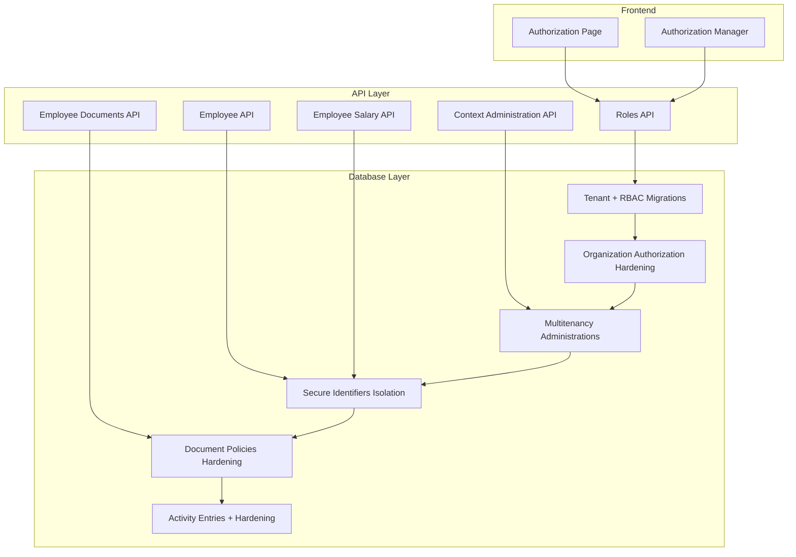
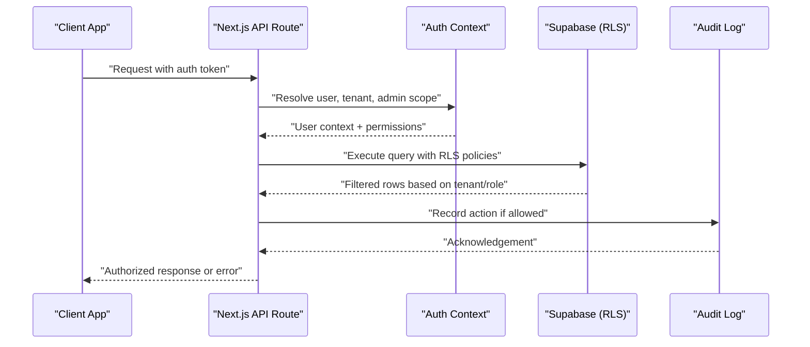
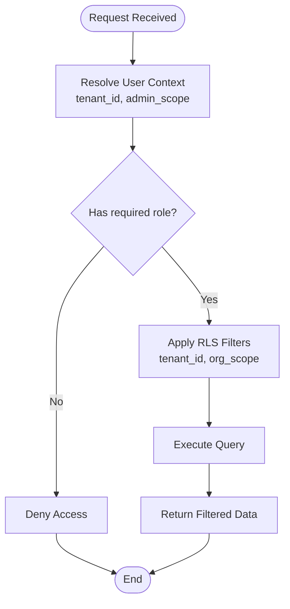
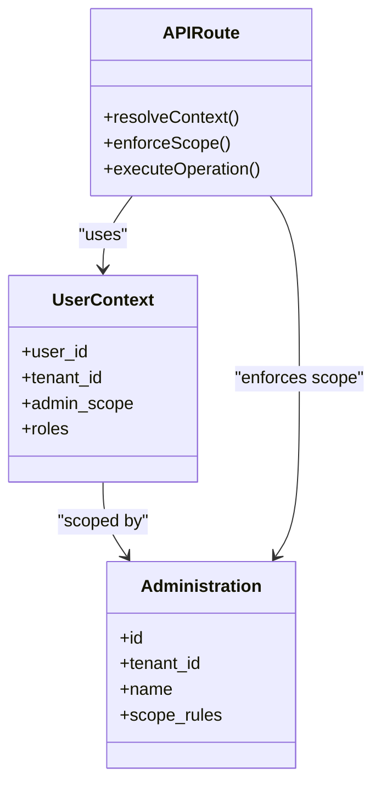
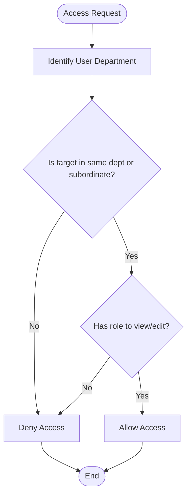
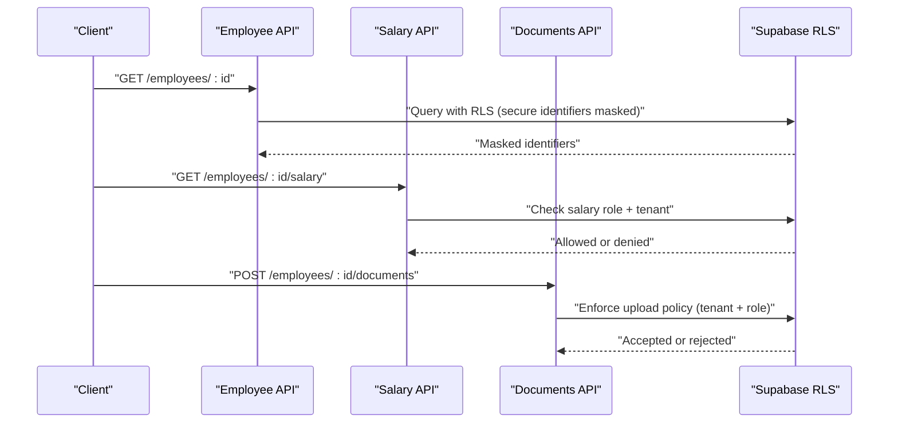
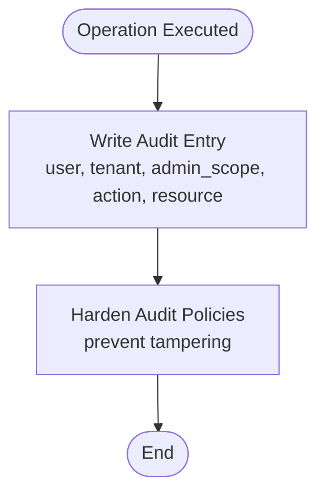
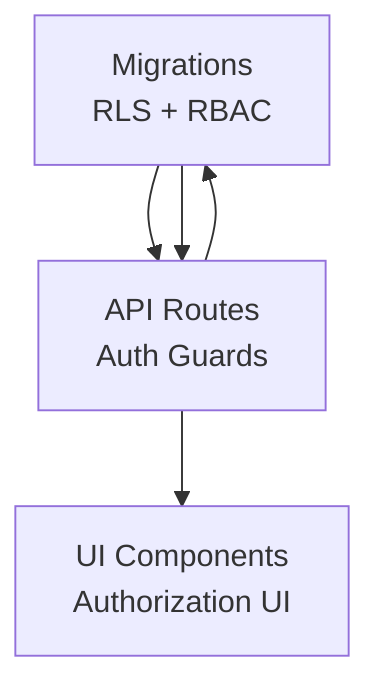

# Security Policies & RLS

<cite>
**Referenced Files in This Document**
- [20260712124911_add_tenant_rbac_and_organization.sql](file://apps/hr-suite/supabase/migrations/20260712124911_add_tenant_rbac_and_organization.sql)
- [20260712125522_optimize_rbac_indexes_and_policies.sql](file://apps/hr-suite/supabase/migrations/20260712125522_optimize_rbac_indexes_and_policies.sql)
- [20260714170949_harden_organization_authorization.sql](file://apps/hr-suite/supabase/migrations/20260714170949_harden_organization_authorization.sql)
- [20260714174305_add_multitenancy_administrations.sql](file://apps/hr-suite/supabase/migrations/20260714174305_add_multitenancy_administrations.sql)
- [20260714180142_enforce_administration_management_scope.sql](file://apps/hr-suite/supabase/migrations/20260714180142_enforce_administration_management_scope.sql)
- [20260714180309_index_employee_organization_scope_foreign_keys.sql](file://apps/hr-suite/supabase/migrations/20260714180309_index_employee_organization_scope_foreign_keys.sql)
- [20260715124506_isolate_employee_secure_identifiers.sql](file://apps/hr-suite/supabase/migrations/20260715124506_isolate_employee_secure_identifiers.sql)
- [20260715124744_allow_logged_bsn_reveal.sql](file://apps/hr-suite/supabase/migrations/20260715124744_allow_logged_bsn_reveal.sql)
- [20260715130026_index_secure_employee_foreign_keys.sql](file://apps/hr-suite/supabase/migrations/20260715130026_index_secure_employee_foreign_keys.sql)
- [20260715131230_seed_custom_fields_and_tenant_roles.sql](file://apps/hr-suite/supabase/migrations/20260715131230_seed_custom_fields_and_tenant_roles.sql)
- [20260718131000_harden_hr_master_data_document_policies.sql](file://apps/hr-suite/supabase/migrations/20260718131000_harden_hr_master_data_document_policies.sql)
- [20260719101500_refine_employee_document_upload_rules.sql](file://apps/hr-suite/supabase/migrations/20260719101500_refine_employee_document_upload_rules.sql)
- [20260724160000_add_employee_activity_entries.sql](file://apps/hr-suite/supabase/migrations/20260724160000_add_employee_activity_entries.sql)
- [20260724172716_harden_employee_activity_entries.sql](file://apps/hr-suite/supabase/migrations/20260724172716_harden_employee_activity_entries.sql)
- [authorization/page.tsx](file://apps/hr-suite/app/(dashboard)/authorization/page.tsx)
- [organization/authorization-manager.tsx](file://apps/hr-suite/components/organization/authorization-manager.tsx)
- [roles/route.ts](file://apps/hr-suite/app/api/roles/route.ts)
- [employees/[employeeId]/route.ts](file://apps/hr-suite/app/api/employees/[employeeId]/route.ts)
- [employees/[employeeId]/documents/route.ts](file://apps/hr-suite/app/api/employees/[employeeId]/documents/route.ts)
- [employees/[employeeId]/salary/route.ts](file://apps/hr-suite/app/api/employees/[employeeId]/salary/route.ts)
- [context/administration/route.ts](file://apps/hr-suite/app/api/context/administration/route.ts)
- [multitenancy_isolation.sql](file://apps/hr-suite/supabase/tests/multitenancy_isolation.sql)
- [employee_secure_identifiers.sql](file://apps/hr-suite/supabase/tests/employee_secure_identifiers.sql)
- [employee_document_upload_rules.sql](file://apps/hr-suite/supabase/tests/employee_document_upload_rules.sql)
- [harden_employee_activity_entries.sql](file://apps/hr-suite/supabase/tests/harden_employee_activity_entries.sql)
</cite>

## Table of Contents
1. [Introduction](#introduction)
2. [Project Structure](#project-structure)
3. [Core Components](#core-components)
4. [Architecture Overview](#architecture-overview)
5. [Detailed Component Analysis](#detailed-component-analysis)
6. [Dependency Analysis](#dependency-analysis)
7. [Performance Considerations](#performance-considerations)
8. [Troubleshooting Guide](#troubleshooting-guide)
9. [Conclusion](#conclusion)
10. [Appendices](#appendices)

## Introduction
This document explains LiquidHR’s Row Level Security (RLS) and authorization policies, focusing on tenant isolation, role-based access control (RBAC), permission inheritance, and protection of sensitive HR data. It covers multi-administration environments, department-level controls, hierarchical permissions, audit logging, data masking strategies, compliance requirements, performance implications, and optimization techniques. The content is grounded in the repository’s database migrations, API routes, and UI components that implement these security mechanisms.

## Project Structure
Security-related implementation spans:
- Database layer: Supabase SQL migrations define tables, indexes, RLS policies, and functions to enforce tenant isolation and RBAC.
- API layer: Next.js API routes enforce authentication, authorization checks, and scope scoping before executing business logic.
- UI layer: Dashboard pages and components expose authorization management and role assignment features for administrators.

**Diagram sources**
- [authorization/page.tsx](file://apps/hr-suite/app/(dashboard)/authorization/page.tsx)
- [organization/authorization-manager.tsx](file://apps/hr-suite/components/organization/authorization-manager.tsx)
- [roles/route.ts](file://apps/hr-suite/app/api/roles/route.ts)
- [employees/[employeeId]/route.ts](file://apps/hr-suite/app/api/employees/[employeeId]/route.ts)
- [employees/[employeeId]/documents/route.ts](file://apps/hr-suite/app/api/employees/[employeeId]/documents/route.ts)
- [employees/[employeeId]/salary/route.ts](file://apps/hr-suite/app/api/employees/[employeeId]/salary/route.ts)
- [context/administration/route.ts](file://apps/hr-suite/app/api/context/administration/route.ts)
- [20260712124911_add_tenant_rbac_and_organization.sql](file://apps/hr-suite/supabase/migrations/20260712124911_add_tenant_rbac_and_organization.sql)
- [20260714170949_harden_organization_authorization.sql](file://apps/hr-suite/supabase/migrations/20260714170949_harden_organization_authorization.sql)
- [20260714174305_add_multitenancy_administrations.sql](file://apps/hr-suite/supabase/migrations/20260714174305_add_multitenancy_administrations.sql)
- [20260715124506_isolate_employee_secure_identifiers.sql](file://apps/hr-suite/supabase/migrations/20260715124506_isolate_employee_secure_identifiers.sql)
- [20260718131000_harden_hr_master_data_document_policies.sql](file://apps/hr-suite/supabase/migrations/20260718131000_harden_hr_master_data_document_policies.sql)
- [20260724160000_add_employee_activity_entries.sql](file://apps/hr-suite/supabase/migrations/20260724160000_add_employee_activity_entries.sql)

**Section sources**
- [20260712124911_add_tenant_rbac_and_organization.sql](file://apps/hr-suite/supabase/migrations/20260712124911_add_tenant_rbac_and_organization.sql)
- [20260714170949_harden_organization_authorization.sql](file://apps/hr-suite/supabase/migrations/20260714170949_harden_organization_authorization.sql)
- [20260714174305_add_multitenancy_administrations.sql](file://apps/hr-suite/supabase/migrations/20260714174305_add_multitenancy_administrations.sql)
- [20260715124506_isolate_employee_secure_identifiers.sql](file://apps/hr-suite/supabase/migrations/20260715124506_isolate_employee_secure_identifiers.sql)
- [20260718131000_harden_hr_master_data_document_policies.sql](file://apps/hr-suite/supabase/migrations/20260718131000_harden_hr_master_data_document_policies.sql)
- [20260724160000_add_employee_activity_entries.sql](file://apps/hr-suite/supabase/migrations/20260724160000_add_employee_activity_entries.sql)
- [authorization/page.tsx](file://apps/hr-suite/app/(dashboard)/authorization/page.tsx)
- [organization/authorization-manager.tsx](file://apps/hr-suite/components/organization/authorization-manager.tsx)
- [roles/route.ts](file://apps/hr-suite/app/api/roles/route.ts)
- [employees/[employeeId]/route.ts](file://apps/hr-suite/app/api/employees/[employeeId]/route.ts)
- [employees/[employeeId]/documents/route.ts](file://apps/hr-suite/app/api/employees/[employeeId]/documents/route.ts)
- [employees/[employeeId]/salary/route.ts](file://apps/hr-suite/app/api/employees/[employeeId]/salary/route.ts)
- [context/administration/route.ts](file://apps/hr-suite/app/api/context/administration/route.ts)

## Core Components
- Tenant isolation and RBAC foundation:
  - Introduces tenants, roles, and organization-scoped entities with RLS policies ensuring data visibility per tenant and user context.
- Organization authorization hardening:
  - Enforces strict boundaries for organizational data access based on user roles and scopes.
- Multitenancy administrations:
  - Adds administration-level scoping to isolate operations across multiple administrative contexts within a tenant.
- Secure employee identifiers:
  - Isolates sensitive identifiers (e.g., BSN) and restricts reveal to authenticated users with explicit permissions.
- Document policies hardening:
  - Tightens read/write rules for employee documents, enforcing upload and access constraints tied to tenant and role.
- Audit activity entries:
  - Captures detailed audit logs for employee actions with hardened policies to prevent unauthorized access or tampering.

**Section sources**
- [20260712124911_add_tenant_rbac_and_organization.sql](file://apps/hr-suite/supabase/migrations/20260712124911_add_tenant_rbac_and_organization.sql)
- [20260714170949_harden_organization_authorization.sql](file://apps/hr-suite/supabase/migrations/20260714170949_harden_organization_authorization.sql)
- [20260714174305_add_multitenancy_administrations.sql](file://apps/hr-suite/supabase/migrations/20260714174305_add_multitenancy_administrations.sql)
- [20260715124506_isolate_employee_secure_identifiers.sql](file://apps/hr-suite/supabase/migrations/20260715124506_isolate_employee_secure_identifiers.sql)
- [20260718131000_harden_hr_master_data_document_policies.sql](file://apps/hr-suite/supabase/migrations/20260718131000_harden_hr_master_data_document_policies.sql)
- [20260724160000_add_employee_activity_entries.sql](file://apps/hr-suite/supabase/migrations/20260724160000_add_employee_activity_entries.sql)

## Architecture Overview
The authorization framework combines:
- Authentication context from the request (user identity, tenant, administration).
- Role-based permissions derived from user assignments and inherited scopes.
- RLS policies at the database level to enforce row-level visibility and mutation constraints.
- API route guards that validate permissions before delegating to business logic.
- UI components that reflect authorized capabilities and present only permitted actions.

**Diagram sources**
- [roles/route.ts](file://apps/hr-suite/app/api/roles/route.ts)
- [employees/[employeeId]/route.ts](file://apps/hr-suite/app/api/employees/[employeeId]/route.ts)
- [employees/[employeeId]/documents/route.ts](file://apps/hr-suite/app/api/employees/[employeeId]/documents/route.ts)
- [employees/[employeeId]/salary/route.ts](file://apps/hr-suite/app/api/employees/[employeeId]/salary/route.ts)
- [context/administration/route.ts](file://apps/hr-suite/app/api/context/administration/route.ts)
- [20260712124911_add_tenant_rbac_and_organization.sql](file://apps/hr-suite/supabase/migrations/20260712124911_add_tenant_rbac_and_organization.sql)
- [20260724160000_add_employee_activity_entries.sql](file://apps/hr-suite/supabase/migrations/20260724160000_add_employee_activity_entries.sql)

## Detailed Component Analysis

### Tenant Isolation and RBAC Foundation
- Purpose: Ensure each tenant’s data is isolated and users can only access resources within their assigned roles and scopes.
- Key mechanisms:
  - Tables include tenant identifiers; RLS policies filter queries by tenant context.
  - Roles and role assignments are scoped per tenant; permissions are enforced via policy expressions.
  - Organization-level entities inherit tenant isolation and add departmental scoping.

**Diagram sources**
- [20260712124911_add_tenant_rbac_and_organization.sql](file://apps/hr-suite/supabase/migrations/20260712124911_add_tenant_rbac_and_organization.sql)
- [20260712125522_optimize_rbac_indexes_and_policies.sql](file://apps/hr-suite/supabase/migrations/20260712125522_optimize_rbac_indexes_and_policies.sql)
- [roles/route.ts](file://apps/hr-suite/app/api/roles/route.ts)

**Section sources**
- [20260712124911_add_tenant_rbac_and_organization.sql](file://apps/hr-suite/supabase/migrations/20260712124911_add_tenant_rbac_and_organization.sql)
- [20260712125522_optimize_rbac_indexes_and_policies.sql](file://apps/hr-suite/supabase/migrations/20260712125522_optimize_rbac_indexes_and_policies.sql)
- [roles/route.ts](file://apps/hr-suite/app/api/roles/route.ts)

### Multi-Administration Environment Controls
- Purpose: Support multiple administrations within a tenant, isolating management operations per administration scope.
- Key mechanisms:
  - Administration entity defines scope boundaries.
  - API routes resolve current administration context and enforce it on all operations.
  - RLS policies ensure users cannot cross administration boundaries without explicit grants.

**Diagram sources**
- [20260714174305_add_multitenancy_administrations.sql](file://apps/hr-suite/supabase/migrations/20260714174305_add_multitenancy_administrations.sql)
- [20260714180142_enforce_administration_management_scope.sql](file://apps/hr-suite/supabase/migrations/20260714180142_enforce_administration_management_scope.sql)
- [context/administration/route.ts](file://apps/hr-suite/app/api/context/administration/route.ts)

**Section sources**
- [20260714174305_add_multitenancy_administrations.sql](file://apps/hr-suite/supabase/migrations/20260714174305_add_multitenancy_administrations.sql)
- [20260714180142_enforce_administration_management_scope.sql](file://apps/hr-suite/supabase/migrations/20260714180142_enforce_administration_management_scope.sql)
- [context/administration/route.ts](file://apps/hr-suite/app/api/context/administration/route.ts)

### Department-Level Access Controls and Hierarchical Permissions
- Purpose: Restrict access to employees and related data based on department membership and hierarchy.
- Key mechanisms:
  - Organization and department relationships define ownership and reporting lines.
  - RLS policies use department membership and hierarchy to allow managers to view subordinates’ data.
  - Role inheritance allows higher-level roles to encompass lower-level permissions.

**Diagram sources**
- [20260712124911_add_tenant_rbac_and_organization.sql](file://apps/hr-suite/supabase/migrations/20260712124911_add_tenant_rbac_and_organization.sql)
- [20260714170949_harden_organization_authorization.sql](file://apps/hr-suite/supabase/migrations/20260714170949_harden_organization_authorization.sql)

**Section sources**
- [20260712124911_add_tenant_rbac_and_organization.sql](file://apps/hr-suite/supabase/migrations/20260712124911_add_tenant_rbac_and_organization.sql)
- [20260714170949_harden_organization_authorization.sql](file://apps/hr-suite/supabase/migrations/20260714170949_harden_organization_authorization.sql)

### Protection of Sensitive HR Data (Employee Identifiers, Salary, Documents)
- Employee secure identifiers:
  - Sensitive fields like BSN are isolated and only revealed to authenticated users with explicit permissions.
  - Masking strategies ensure partial visibility unless explicitly allowed.
- Salary information:
  - Restricted to roles with compensation privileges; RLS enforces tenant and role-based visibility.
- Employee documents:
  - Upload and access rules require tenant alignment and role permissions; policies prevent unauthorized reads/writes.

**Diagram sources**
- [20260715124506_isolate_employee_secure_identifiers.sql](file://apps/hr-suite/supabase/migrations/20260715124506_isolate_employee_secure_identifiers.sql)
- [20260715124744_allow_logged_bsn_reveal.sql](file://apps/hr-suite/supabase/migrations/20260715124744_allow_logged_bsn_reveal.sql)
- [employees/[employeeId]/route.ts](file://apps/hr-suite/app/api/employees/[employeeId]/route.ts)
- [employees/[employeeId]/salary/route.ts](file://apps/hr-suite/app/api/employees/[employeeId]/salary/route.ts)
- [employees/[employeeId]/documents/route.ts](file://apps/hr-suite/app/api/employees/[employeeId]/documents/route.ts)
- [20260718131000_harden_hr_master_data_document_policies.sql](file://apps/hr-suite/supabase/migrations/20260718131000_harden_hr_master_data_document_policies.sql)
- [20260719101500_refine_employee_document_upload_rules.sql](file://apps/hr-suite/supabase/migrations/20260719101500_refine_employee_document_upload_rules.sql)

**Section sources**
- [20260715124506_isolate_employee_secure_identifiers.sql](file://apps/hr-suite/supabase/migrations/20260715124506_isolate_employee_secure_identifiers.sql)
- [20260715124744_allow_logged_bsn_reveal.sql](file://apps/hr-suite/supabase/migrations/20260715124744_allow_logged_bsn_reveal.sql)
- [employees/[employeeId]/route.ts](file://apps/hr-suite/app/api/employees/[employeeId]/route.ts)
- [employees/[employeeId]/salary/route.ts](file://apps/hr-suite/app/api/employees/[employeeId]/salary/route.ts)
- [employees/[employeeId]/documents/route.ts](file://apps/hr-suite/app/api/employees/[employeeId]/documents/route.ts)
- [20260718131000_harden_hr_master_data_document_policies.sql](file://apps/hr-suite/supabase/migrations/20260718131000_harden_hr_master_data_document_policies.sql)
- [20260719101500_refine_employee_document_upload_rules.sql](file://apps/hr-suite/supabase/migrations/20260719101500_refine_employee_document_upload_rules.sql)

### Audit Logging and Compliance Requirements
- Purpose: Capture detailed audit trails for employee-related actions to support compliance and forensic analysis.
- Key mechanisms:
  - Dedicated audit table records user, tenant, administration scope, action type, and affected resource IDs.
  - RLS policies protect audit entries from unauthorized modification or deletion.
  - API routes write audit entries upon successful operations.

**Diagram sources**
- [20260724160000_add_employee_activity_entries.sql](file://apps/hr-suite/supabase/migrations/20260724160000_add_employee_activity_entries.sql)
- [20260724172716_harden_employee_activity_entries.sql](file://apps/hr-suite/supabase/migrations/20260724172716_harden_employee_activity_entries.sql)

**Section sources**
- [20260724160000_add_employee_activity_entries.sql](file://apps/hr-suite/supabase/migrations/20260724160000_add_employee_activity_entries.sql)
- [20260724172716_harden_employee_activity_entries.sql](file://apps/hr-suite/supabase/migrations/20260724172716_harden_employee_activity_entries.sql)

### Policy Examples and Permission Inheritance Patterns
- Policy examples:
  - Read access to employees requires tenant match and role-based department scope.
  - Salary read/write restricted to compensation roles within the same tenant and administration.
  - Document uploads require tenant alignment and role permissions; downloads follow similar constraints.
- Permission inheritance:
  - Higher-level roles inherit permissions from lower-level roles.
  - Department managers inherit read access to subordinate employees’ non-sensitive data.

**Section sources**
- [20260712124911_add_tenant_rbac_and_organization.sql](file://apps/hr-suite/supabase/migrations/20260712124911_add_tenant_rbac_and_organization.sql)
- [20260714170949_harden_organization_authorization.sql](file://apps/hr-suite/supabase/migrations/20260714170949_harden_organization_authorization.sql)
- [20260715124506_isolate_employee_secure_identifiers.sql](file://apps/hr-suite/supabase/migrations/20260715124506_isolate_employee_secure_identifiers.sql)
- [20260718131000_harden_hr_master_data_document_policies.sql](file://apps/hr-suite/supabase/migrations/20260718131000_harden_hr_master_data_document_policies.sql)

### UI Authorization Management
- Purpose: Provide administrators with tools to manage roles, permissions, and authorization scopes.
- Key components:
  - Authorization page displays current permissions and allows inspection.
  - Authorization manager component enables role assignment and scope configuration.

**Section sources**
- [authorization/page.tsx](file://apps/hr-suite/app/(dashboard)/authorization/page.tsx)
- [organization/authorization-manager.tsx](file://apps/hr-suite/components/organization/authorization-manager.tsx)

## Dependency Analysis
The authorization system depends on:
- Database migrations defining schemas, indexes, and RLS policies.
- API routes resolving user context and enforcing permissions.
- UI components reflecting authorized capabilities.

**Diagram sources**
- [20260712124911_add_tenant_rbac_and_organization.sql](file://apps/hr-suite/supabase/migrations/20260712124911_add_tenant_rbac_and_organization.sql)
- [roles/route.ts](file://apps/hr-suite/app/api/roles/route.ts)
- [authorization/page.tsx](file://apps/hr-suite/app/(dashboard)/authorization/page.tsx)

**Section sources**
- [20260712124911_add_tenant_rbac_and_organization.sql](file://apps/hr-suite/supabase/migrations/20260712124911_add_tenant_rbac_and_organization.sql)
- [roles/route.ts](file://apps/hr-suite/app/api/roles/route.ts)
- [authorization/page.tsx](file://apps/hr-suite/app/(dashboard)/authorization/page.tsx)

## Performance Considerations
- Indexing:
  - RBAC indexes optimize role lookups and permission checks.
  - Employee organization scope foreign keys indexed to speed up tenant and department filtering.
- Policy complexity:
  - Keep RLS policies simple and avoid expensive joins; prefer direct foreign key comparisons.
- Caching:
  - Cache resolved user contexts and role assignments where appropriate to reduce repeated checks.
- Query design:
  - Use selective projections to minimize data transfer when sensitive fields are masked.

**Section sources**
- [20260712125522_optimize_rbac_indexes_and_policies.sql](file://apps/hr-suite/supabase/migrations/20260712125522_optimize_rbac_indexes_and_policies.sql)
- [20260714180309_index_employee_organization_scope_foreign_keys.sql](file://apps/hr-suite/supabase/migrations/20260714180309_index_employee_organization_scope_foreign_keys.sql)
- [20260715130026_index_secure_employee_foreign_keys.sql](file://apps/hr-suite/supabase/migrations/20260715130026_index_secure_employee_foreign_keys.sql)

## Troubleshooting Guide
Common issues and mitigations:
- Unauthorized access errors:
  - Verify user’s tenant and administration scope; ensure role assignments are correct.
- Data not visible:
  - Check RLS policies for tenant and department filters; confirm foreign key relationships are indexed.
- Document upload failures:
  - Validate upload policies and role permissions; ensure tenant alignment.
- Audit log gaps:
  - Confirm audit entry writes occur post-operation; check hardened policies preventing deletions.

**Section sources**
- [multitenancy_isolation.sql](file://apps/hr-suite/supabase/tests/multitenancy_isolation.sql)
- [employee_secure_identifiers.sql](file://apps/hr-suite/supabase/tests/employee_secure_identifiers.sql)
- [employee_document_upload_rules.sql](file://apps/hr-suite/supabase/tests/employee_document_upload_rules.sql)
- [harden_employee_activity_entries.sql](file://apps/hr-suite/supabase/tests/harden_employee_activity_entries.sql)

## Conclusion
LiquidHR’s RLS and authorization framework provides robust tenant isolation, RBAC enforcement, and sensitive data protection. By combining database-level policies with API route guards and UI-driven authorization management, the system ensures secure, compliant handling of HR data across multi-administration environments. Proper indexing, policy simplicity, and audit logging contribute to both performance and accountability.

## Appendices
- Best practices:
  - Always resolve user context early and pass it through API layers.
  - Prefer least-privilege roles and explicit grants.
  - Regularly review RLS policies for complexity and performance.
- Compliance considerations:
  - Mask sensitive identifiers unless explicitly allowed.
  - Maintain immutable audit logs for regulatory requirements.
  - Enforce tenant and administration boundaries strictly.

[No sources needed since this section summarizes without analyzing specific files]