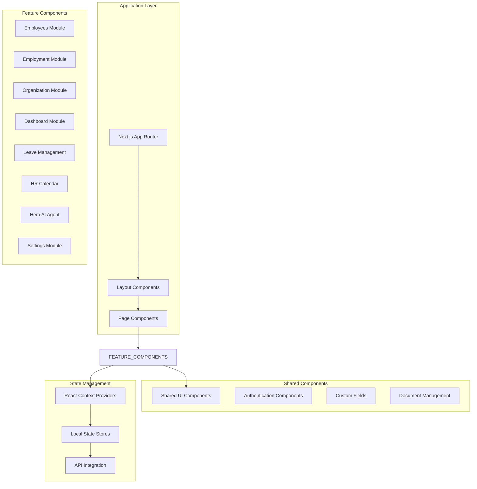
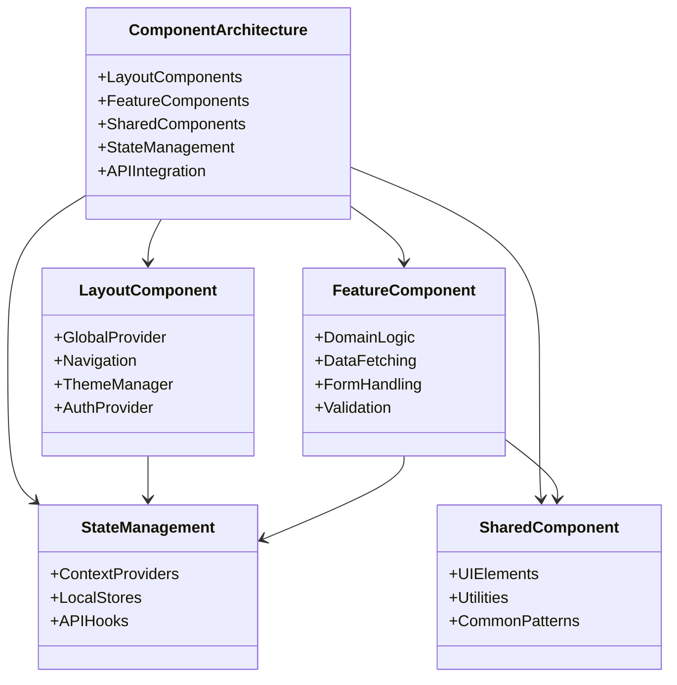
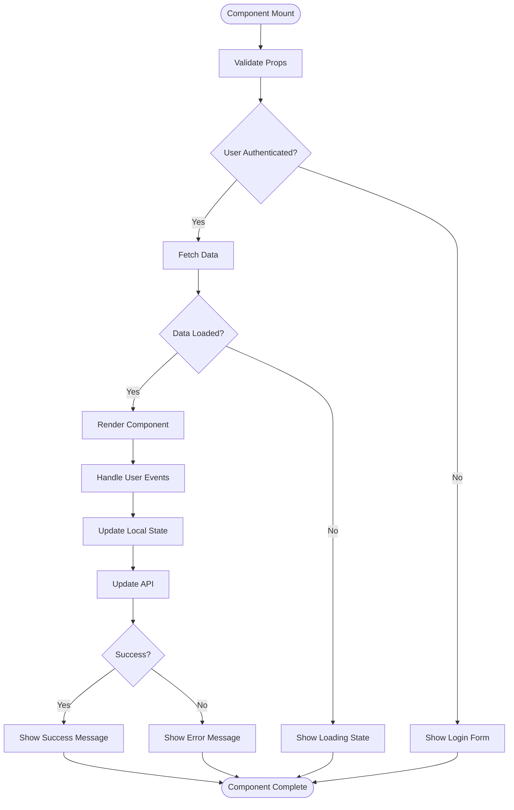
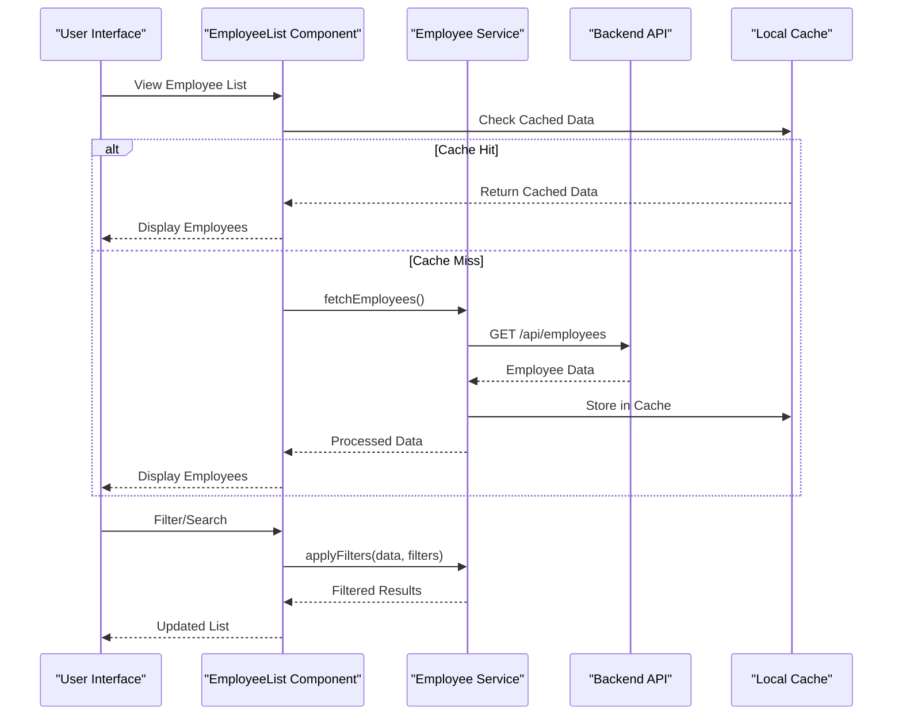
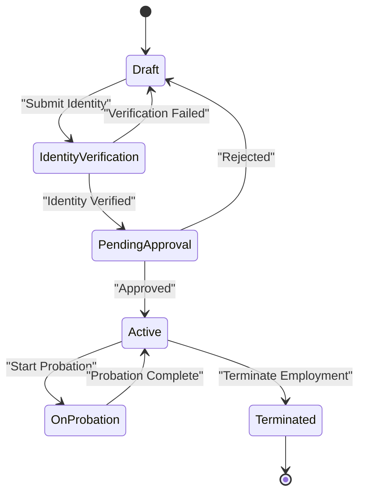
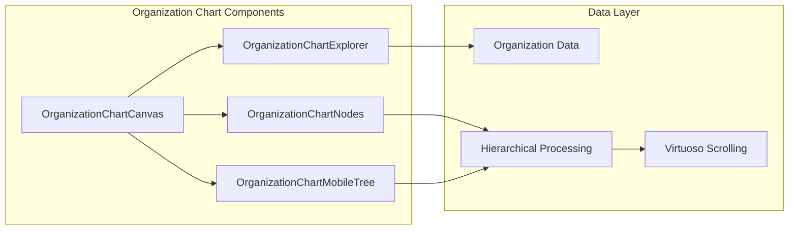
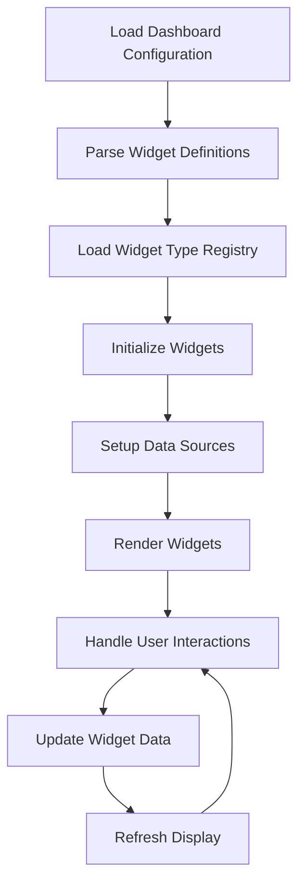
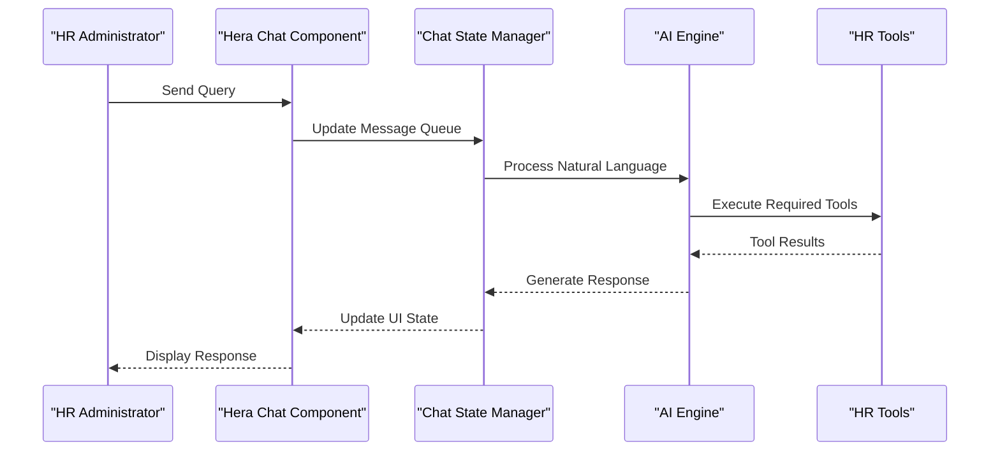
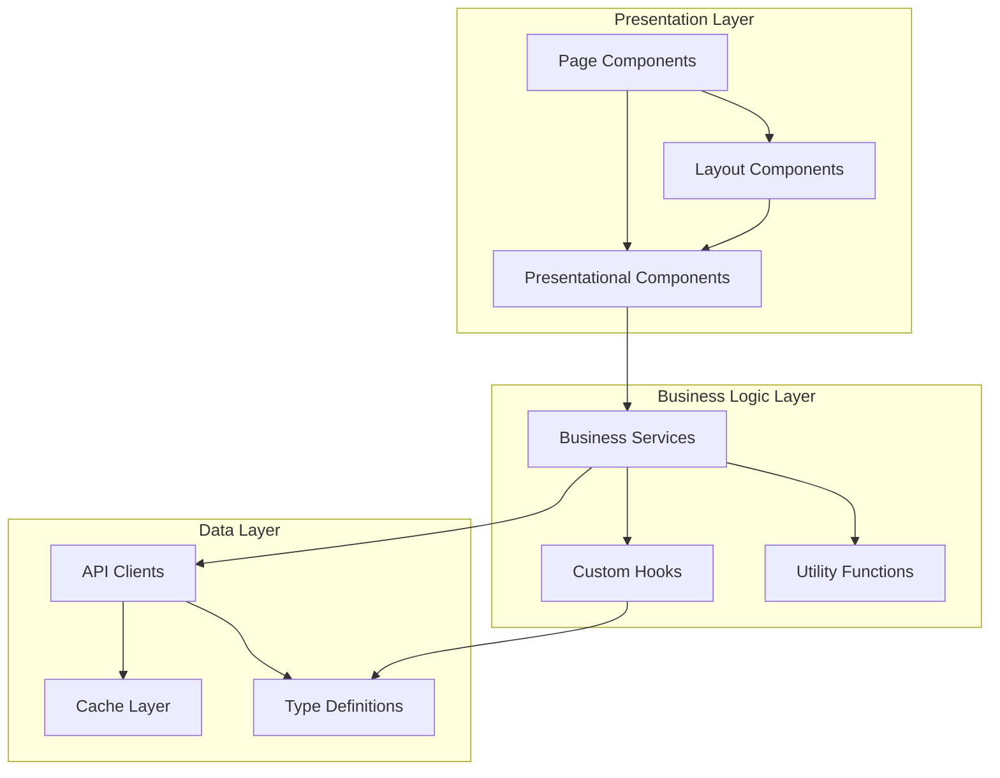

# Component Architecture

<cite>
**Referenced Files in This Document**
- [layout.tsx](file://apps/hr-suite/app/layout.tsx)
- [dashboard-layout.tsx](file://apps/hr-suite/app/(dashboard)/layout.tsx)
- [sidebar.tsx](file://apps/hr-suite/components/layout/sidebar.tsx)
- [employees-page.tsx](file://apps/hr-suite/app/(dashboard)/employees/page.tsx)
- [employment-page.tsx](file://apps/hr-suite/app/(dashboard)/employees/[employeeId]/page.tsx)
- [employee-list.tsx](file://apps/hr-suite/components/employees/employee-list.tsx)
- [employee-dashboard.tsx](file://apps/hr-suite/components/employees/employee-dashboard.tsx)
- [employment-create-form.tsx](file://apps/hr-suite/components/employment/employment-create-form.tsx)
- [organization-chart-canvas.tsx](file://apps/hr-suite/components/organization-chart/organization-chart-canvas.tsx)
- [dashboard-workspace.tsx](file://apps/hr-suite/components/dashboard/dashboard-workspace.tsx)
- [hera-chat.tsx](file://apps/hr-suite/components/hera/hera-chat.tsx)
- [hr-calendar.tsx](file://apps/hr-suite/components/hr-calendar/hr-month-calendar.tsx)
- [leave-catalog-page.tsx](file://apps/hr-suite/components/leave/leave-catalog-page.tsx)
- [auth-shell.tsx](file://apps/hr-suite/components/auth/auth-shell.tsx)
- [custom-field-manager.tsx](file://apps/hr-suite/components/custom-fields/custom-field-manager.tsx)
- [administration-switcher.tsx](file://apps/hr-suite/components/layout/administration-switcher.tsx)
- [settings-modal.tsx](file://apps/hr-suite/components/layout/settings-modal.tsx)
- [email-link.tsx](file://apps/hr-suite/components/shared/email-link.tsx)
</cite>

## Table of Contents
1. [Introduction](#introduction)
2. [Project Structure](#project-structure)
3. [Core Components](#core-components)
4. [Architecture Overview](#architecture-overview)
5. [Detailed Component Analysis](#detailed-component-analysis)
6. [Dependency Analysis](#dependency-analysis)
7. [Performance Considerations](#performance-considerations)
8. [Troubleshooting Guide](#troubleshooting-guide)
9. [Conclusion](#conclusion)

## Introduction

LiquidHR is a comprehensive Human Resources management system built with Next.js and React, implementing a feature-sliced architecture pattern that provides clear separation between domain-specific components, shared utilities, and layout elements. The application follows modern React best practices with a focus on maintainability, scalability, and developer experience.

The component architecture is designed around several key principles:
- **Feature-Sliced Design**: Each business domain (employees, employment, organization, etc.) has its own dedicated component folder
- **Separation of Concerns**: Clear distinction between presentational and container components
- **Reusability**: Shared components are extracted for common UI patterns
- **Type Safety**: Comprehensive TypeScript usage throughout the codebase
- **Performance Optimization**: Strategic use of memoization, lazy loading, and code splitting

## Project Structure

The LiquidHR application follows a well-organized feature-sliced architecture that promotes modularity and maintainability:

**Diagram sources**
- [layout.tsx](file://apps/hr-suite/app/layout.tsx)
- [dashboard-layout.tsx](file://apps/hr-suite/app/(dashboard)/layout.tsx)
- [sidebar.tsx](file://apps/hr-suite/components/layout/sidebar.tsx)

### Directory Organization Pattern

The application follows a consistent directory structure:

- **`app/`**: Next.js App Router pages and layouts
- **`components/`**: Feature-specific React components organized by domain
- **`lib/`**: Business logic, utilities, and state management
- **`messages/`**: Internationalization files
- **`supabase/`**: Database migrations and configuration

**Section sources**
- [layout.tsx](file://apps/hr-suite/app/layout.tsx)
- [dashboard-layout.tsx](file://apps/hr-suite/app/(dashboard)/layout.tsx)

## Core Components

LiquidHR implements a layered component architecture with clear responsibilities:

### Layout Components
Layout components provide the overall application structure and navigation:

- **Root Layout**: Global application shell with authentication and theme providers
- **Dashboard Layout**: Main application layout with sidebar navigation
- **Sidebar**: Navigation menu with role-based access control
- **Administration Switcher**: Multi-tenancy support for different organizations

### Feature Components
Each business domain has its own component module:

#### Employees Module
Comprehensive employee management with CRUD operations, activity tracking, and document management.

#### Employment Module
Handles employment lifecycle including creation, modifications, terminations, and timeline tracking.

#### Organization Module
Organizational structure management including departments, roles, and authorization systems.

#### Dashboard Module
Personalized dashboards with configurable widgets and real-time data visualization.

**Section sources**
- [employee-list.tsx](file://apps/hr-suite/components/employees/employee-list.tsx)
- [employee-dashboard.tsx](file://apps/hr-suite/components/employees/employee-dashboard.tsx)
- [employment-create-form.tsx](file://apps/hr-suite/components/employment/employment-create-form.tsx)
- [organization-chart-canvas.tsx](file://apps/hr-suite/components/organization-chart/organization-chart-canvas.tsx)

## Architecture Overview

LiquidHR implements a sophisticated component architecture that combines multiple design patterns:

**Diagram sources**
- [auth-shell.tsx](file://apps/hr-suite/components/auth/auth-shell.tsx)
- [sidebar.tsx](file://apps/hr-suite/components/layout/sidebar.tsx)
- [dashboard-workspace.tsx](file://apps/hr-suite/components/dashboard/dashboard-workspace.tsx)

### Component Composition Patterns

The application uses several composition patterns:

1. **Container/Presentational Pattern**: Separates data fetching logic from UI rendering
2. **Higher-Order Components**: Reusable component wrappers for common functionality
3. **Render Props**: Flexible component composition for dynamic behavior
4. **Compound Components**: Related components that work together as a unit

### Prop Interfaces and Event Handling

Components follow strict prop interfaces defined with TypeScript:

**Diagram sources**
- [employment-create-form.tsx](file://apps/hr-suite/components/employment/employment-create-form.tsx)
- [employee-list.tsx](file://apps/hr-suite/components/employees/employee-list.tsx)

## Detailed Component Analysis

### Employee Management Components

The employees module demonstrates a complete feature implementation with proper separation of concerns:

**Diagram sources**
- [employee-list.tsx](file://apps/hr-suite/components/employees/employee-list.tsx)
- [employee-dashboard.tsx](file://apps/hr-suite/components/employees/employee-dashboard.tsx)

### Employment Lifecycle Management

The employment module handles complex business logic for employment lifecycle management:

#### Employment Creation Flow

**Diagram sources**
- [employment-create-form.tsx](file://apps/hr-suite/components/employment/employment-create-form.tsx)
- [confirmation-dialog.tsx](file://apps/hr-suite/components/employment/confirmation-dialog.tsx)

### Organization Chart Visualization

The organization chart component provides interactive organizational structure visualization:

**Diagram sources**
- [organization-chart-canvas.tsx](file://apps/hr-suite/components/organization-chart/organization-chart-canvas.tsx)
- [organization-chart-explorer.tsx](file://apps/hr-suite/components/organization-chart/organization-chart-explorer.tsx)

### Dashboard System

The dashboard system implements a flexible widget-based architecture:

#### Widget Rendering Pipeline

**Diagram sources**
- [dashboard-workspace.tsx](file://apps/hr-suite/components/dashboard/dashboard-workspace.tsx)
- [widget-renderer.tsx](file://apps/hr-suite/components/dashboard/widget-renderer.tsx)

### Hera AI Agent Integration

The Hera component provides AI-powered assistance within the HR workflow:

**Diagram sources**
- [hera-chat.tsx](file://apps/hr-suite/components/hera/hera-chat.tsx)
- [hera-chat-state.ts](file://apps/hr-suite/components/hera/hera-chat-state.ts)

## Dependency Analysis

The component architecture maintains clean dependencies through careful module organization:

**Diagram sources**
- [employees-page.tsx](file://apps/hr-suite/app/(dashboard)/employees/page.tsx)
- [employment-page.tsx](file://apps/hr-suite/app/(dashboard)/employees/[employeeId]/page.tsx)

### Component Coupling Analysis

The architecture minimizes coupling through:
- **Interface-driven development**: Strict TypeScript interfaces define component contracts
- **Dependency injection**: Services are injected rather than directly imported
- **Event-driven communication**: Components communicate through events rather than direct calls
- **Feature isolation**: Each feature module encapsulates its own dependencies

**Section sources**
- [employees-page.tsx](file://apps/hr-suite/app/(dashboard)/employees/page.tsx)
- [employment-page.tsx](file://apps/hr-suite/app/(dashboard)/employees/[employeeId]/page.tsx)

## Performance Considerations

LiquidHR implements several performance optimization strategies:

### Memoization Strategies
- **React.memo**: Used for expensive presentational components
- **useMemo**: Applied to computed values and derived state
- **useCallback**: Optimized event handlers to prevent unnecessary re-renders
- **Selective re-rendering**: Components only update when their specific props change

### Lazy Loading Implementation
- **Dynamic imports**: Heavy components loaded on demand
- **Route-based code splitting**: Each page loads only its required code
- **Component-level lazy loading**: Large features like organization charts load lazily
- **Image optimization**: Automatic image optimization and lazy loading

### Memory Management
- **Cleanup functions**: Proper cleanup of event listeners and subscriptions
- **Weak references**: Used for caching large objects
- **Virtual scrolling**: Implemented for large lists and trees
- **Debounced updates**: Prevents excessive re-renders during rapid user input

### Bundle Optimization
- **Tree shaking**: Unused code eliminated during build
- **Module federation**: Shared components loaded from central location
- **Compression**: Gzip/Brotli compression for production builds
- **CDN integration**: Static assets served through content delivery networks

## Troubleshooting Guide

### Common Component Issues

#### Performance Problems
- **Symptoms**: Slow rendering, memory leaks, high CPU usage
- **Diagnosis**: Use React DevTools Profiler to identify bottlenecks
- **Solutions**: Implement proper memoization, optimize re-renders, reduce component tree depth

#### State Management Issues
- **Symptoms**: Inconsistent UI state, unexpected re-renders
- **Diagnosis**: Check context provider hierarchy and state synchronization
- **Solutions**: Normalize state structure, implement proper error boundaries, add state validation

#### API Integration Problems
- **Symptoms**: Network errors, stale data, loading states not updating
- **Diagnosis**: Inspect network requests and error handling
- **Solutions**: Implement proper retry logic, add offline support, improve error messages

### Debugging Techniques

#### Component Inspection
- Use React DevTools to inspect component props and state
- Add logging hooks to track component lifecycle
- Implement error boundaries to catch and display component errors

#### Performance Profiling
- Enable React Profiler in development mode
- Measure component render times and frequencies
- Identify memory leaks using browser performance tools

#### Network Debugging
- Monitor API requests and responses
- Implement request/response interceptors
- Add detailed error logging and reporting

**Section sources**
- [settings-modal.tsx](file://apps/hr-suite/components/layout/settings-modal.tsx)
- [administration-switcher.tsx](file://apps/hr-suite/components/layout/administration-switcher.tsx)

## Conclusion

LiquidHR's component architecture demonstrates best practices in modern React application development. The feature-sliced design pattern provides clear separation of concerns while maintaining high cohesion within each business domain. The implementation showcases:

- **Scalable Architecture**: Clean separation between presentation, business logic, and data layers
- **Maintainable Code**: Well-organized components with clear responsibilities and interfaces
- **Performance Optimization**: Strategic use of memoization, lazy loading, and code splitting
- **Developer Experience**: TypeScript support, comprehensive testing, and clear documentation
- **Production Ready**: Robust error handling, monitoring, and debugging capabilities

The architecture serves as a solid foundation for future enhancements and scaling, providing both flexibility for new features and stability for existing functionality. The modular design allows teams to work independently on different features while maintaining overall system coherence.

This comprehensive component architecture ensures that LiquidHR can effectively handle the complexities of modern HR management while providing an excellent user experience for HR administrators and employees alike.