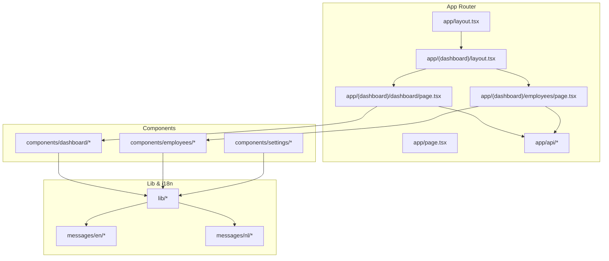
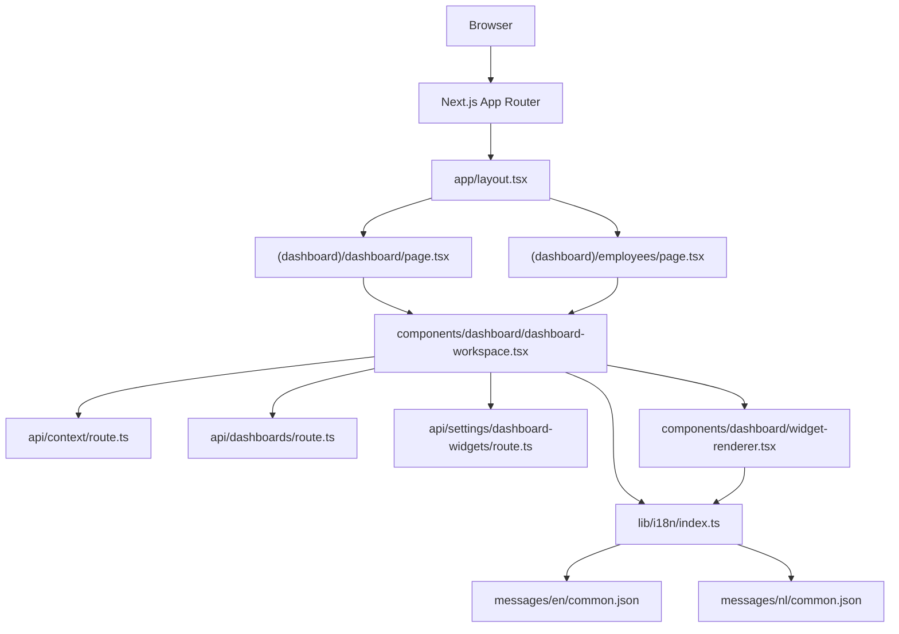
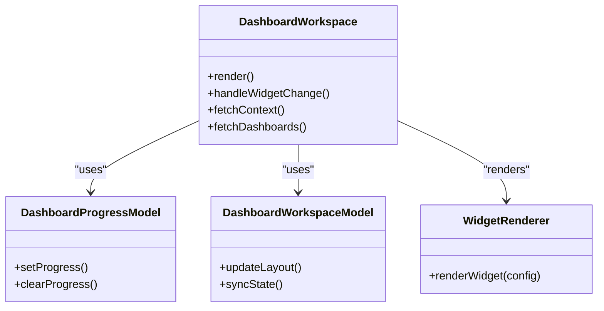
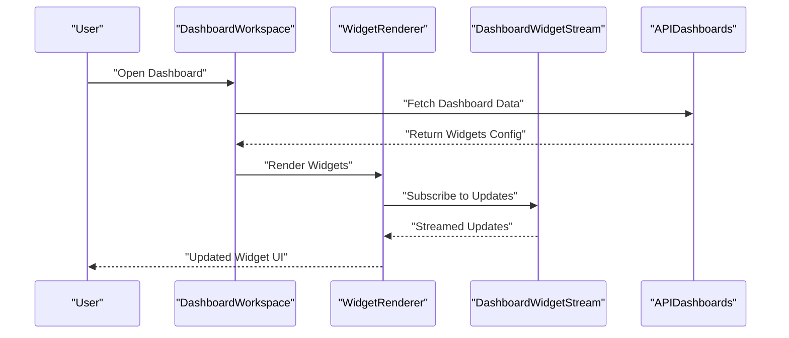
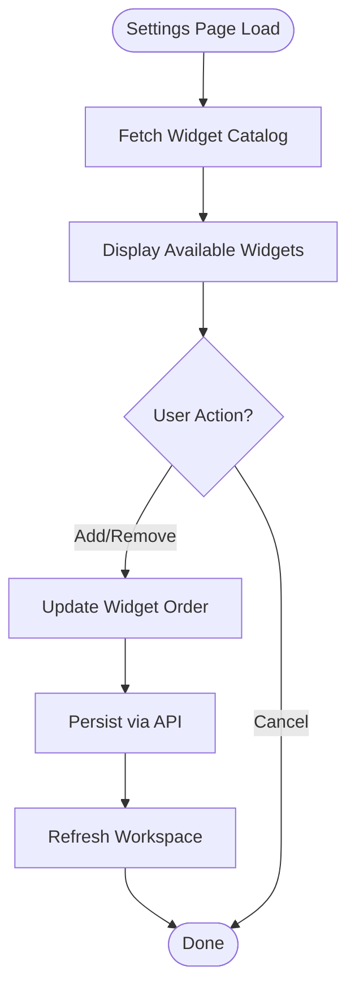
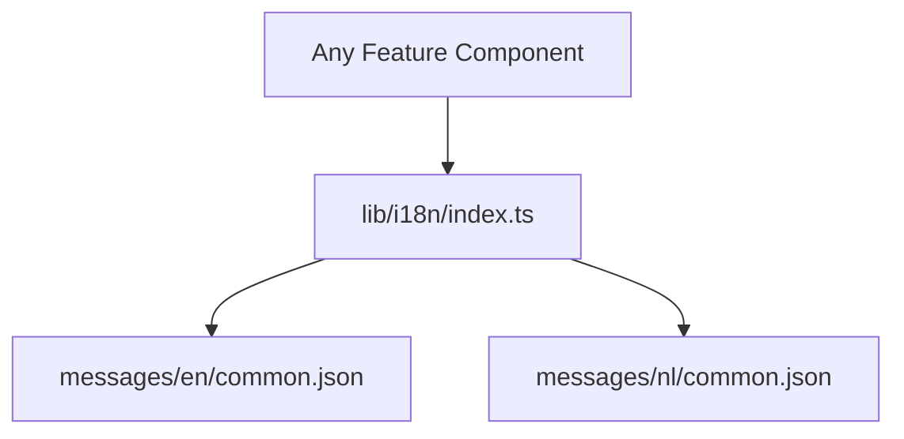
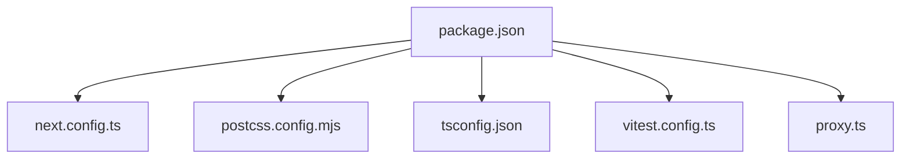

# Frontend Architecture

<cite>
**Referenced Files in This Document**
- [layout.tsx](file://apps/hr-suite/app/layout.tsx)
- [page.tsx](file://apps/hr-suite/app/page.tsx)
- [globals.css](file://apps/hr-suite/app/globals.css)
- [next.config.ts](file://apps/hr-suite/next.config.ts)
- [package.json](file://apps/hr-suite/package.json)
- [postcss.config.mjs](file://apps/hr-suite/postcss.config.mjs)
- [tsconfig.json](file://apps/hr-suite/tsconfig.json)
- [vitest.config.ts](file://apps/hr-suite/vitest.config.ts)
- [proxy.ts](file://apps/hr-suite/proxy.ts)
- [dashboard/page.tsx](file://apps/hr-suite/app/(dashboard)/dashboard/page.tsx)
- [dashboard/loading.tsx](file://apps/hr-suite/app/(dashboard)/dashboard/loading.tsx)
- [employees/page.tsx](file://apps/hr-suite/app/(dashboard)/employees/page.tsx)
- [employees/loading.tsx](file://apps/hr-suite/app/(dashboard)/employees/loading.tsx)
- [settings/dashboard-widgets/page.tsx](file://apps/hr-suite/app/(dashboard)/settings/dashboard-widgets/page.tsx)
- [actions/update-user-preferences.ts](file://apps/hr-suite/app/actions/update-user-preferences.ts)
- [api/context/route.ts](file://apps/hr-suite/app/api/context/route.ts)
- [api/dashboards/route.ts](file://apps/hr-suite/app/api/dashboards/route.ts)
- [api/settings/dashboard-widgets/route.ts](file://apps/hr-suite/app/api/settings/dashboard-widgets/route.ts)
- [components/dashboard/dashboard-workspace.tsx](file://apps/hr-suite/components/dashboard/dashboard-workspace.tsx)
- [components/dashboard/dashboard-editor.tsx](file://apps/hr-suite/components/dashboard/dashboard-editor.tsx)
- [components/dashboard/widget-renderer.tsx](file://apps/hr-suite/components/dashboard/widget-renderer.tsx)
- [components/dashboard/dashboard-widget-stream.tsx](file://apps/hr-suite/components/dashboard/dashboard-widget-stream.tsx)
- [components/dashboard/dashboard-progress-model.ts](file://apps/hr-suite/components/dashboard/dashboard-progress-model.ts)
- [components/dashboard/dashboard-workspace-model.ts](file://apps/hr-suite/components/dashboard/dashboard-workspace-model.ts)
- [components/dashboard/widget-picker-model.ts](file://apps/hr-suite/components/dashboard/widget-picker-model.ts)
- [lib/i18n/index.ts](file://apps/hr-suite/lib/i18n/index.ts)
- [messages/en/common.json](file://apps/hr-suite/messages/en/common.json)
- [messages/nl/common.json](file://apps/hr-suite/messages/nl/common.json)
</cite>

## Table of Contents
1. [Introduction](#introduction)
2. [Project Structure](#project-structure)
3. [Core Components](#core-components)
4. [Architecture Overview](#architecture-overview)
5. [Detailed Component Analysis](#detailed-component-analysis)
6. [Dependency Analysis](#dependency-analysis)
7. [Performance Considerations](#performance-considerations)
8. [Troubleshooting Guide](#troubleshooting-guide)
9. [Conclusion](#conclusion)

## Introduction
This document explains the frontend architecture of LiquidHR’s Next.js application. It focuses on the feature-sliced organization, component composition, state management with React Context and custom hooks, routing via the Next.js App Router, internationalization (i18n), styling with Tailwind CSS, data flow from API routes to UI components, and the dashboard widget system. It also covers responsive design patterns, accessibility considerations, and performance optimizations used across the app.

## Project Structure
The application follows a feature-sliced architecture within the Next.js App Router:
- app/: Routes, layouts, actions, and API routes organized by feature domains.
- components/: Feature-scoped UI components grouped by domain (e.g., dashboard, employees, settings).
- lib/: Domain-specific utilities, contexts, hooks, and integrations.
- messages/: i18n message files per language and feature.
- scripts/: Utility scripts (e.g., i18n checks).
- supabase/: Database migrations and tests for backend integration.

Key configuration files:
- next.config.ts: Next.js configuration.
- postcss.config.mjs: PostCSS setup for Tailwind CSS.
- tsconfig.json: TypeScript configuration.
- vitest.config.ts: Testing configuration.
- package.json: Dependencies and scripts.
- proxy.ts: Development proxy configuration.

**Diagram sources**
- [layout.tsx](file://apps/hr-suite/app/layout.tsx)
- [page.tsx](file://apps/hr-suite/app/page.tsx)
- [dashboard/page.tsx](file://apps/hr-suite/app/(dashboard)/dashboard/page.tsx)
- [employees/page.tsx](file://apps/hr-suite/app/(dashboard)/employees/page.tsx)
- [api/dashboards/route.ts](file://apps/hr-suite/app/api/dashboards/route.ts)
- [components/dashboard/dashboard-workspace.tsx](file://apps/hr-suite/components/dashboard/dashboard-workspace.tsx)
- [lib/i18n/index.ts](file://apps/hr-suite/lib/i18n/index.ts)
- [messages/en/common.json](file://apps/hr-suite/messages/en/common.json)
- [messages/nl/common.json](file://apps/hr-suite/messages/nl/common.json)

**Section sources**
- [next.config.ts](file://apps/hr-suite/next.config.ts)
- [postcss.config.mjs](file://apps/hr-suite/postcss.config.mjs)
- [tsconfig.json](file://apps/hr-suite/tsconfig.json)
- [vitest.config.ts](file://apps/hr-suite/vitest.config.ts)
- [package.json](file://apps/hr-suite/package.json)
- [proxy.ts](file://apps/hr-suite/proxy.ts)

## Core Components
- Dashboard Workspace: Orchestrates layout, loading states, and widget rendering for personal dashboards.
- Widget Renderer: Dynamically renders widgets based on configuration and catalog.
- Dashboard Editor: Provides editing capabilities for widget arrangement and selection.
- Progress Model: Manages progress indicators for long-running operations.
- Workspace Model: Encapsulates workspace state and interactions.
- Widget Picker Model: Handles widget selection and filtering logic.

These components are organized under components/dashboard and integrate with lib/dashboard utilities and API routes for persistence and data fetching.

**Section sources**
- [components/dashboard/dashboard-workspace.tsx](file://apps/hr-suite/components/dashboard/dashboard-workspace.tsx)
- [components/dashboard/widget-renderer.tsx](file://apps/hr-suite/components/dashboard/widget-renderer.tsx)
- [components/dashboard/dashboard-editor.tsx](file://apps/hr-suite/components/dashboard/dashboard-editor.tsx)
- [components/dashboard/dashboard-progress-model.ts](file://apps/hr-suite/components/dashboard/dashboard-progress-model.ts)
- [components/dashboard/dashboard-workspace-model.ts](file://apps/hr-suite/components/dashboard/dashboard-workspace-model.ts)
- [components/dashboard/widget-picker-model.ts](file://apps/hr-suite/components/dashboard/widget-picker-model.ts)

## Architecture Overview
The frontend uses Next.js App Router for file-based routing and server-side rendering where appropriate. Feature slices encapsulate pages, components, and lib modules. State is managed through React Context and custom hooks, while API routes provide a thin layer over backend services. i18n is implemented via JSON message files and a centralized i18n utility. Styling is handled by Tailwind CSS with PostCSS.

**Diagram sources**
- [layout.tsx](file://apps/hr-suite/app/layout.tsx)
- [dashboard/page.tsx](file://apps/hr-suite/app/(dashboard)/dashboard/page.tsx)
- [employees/page.tsx](file://apps/hr-suite/app/(dashboard)/employees/page.tsx)
- [api/context/route.ts](file://apps/hr-suite/app/api/context/route.ts)
- [api/dashboards/route.ts](file://apps/hr-suite/app/api/dashboards/route.ts)
- [api/settings/dashboard-widgets/route.ts](file://apps/hr-suite/app/api/settings/dashboard-widgets/route.ts)
- [components/dashboard/dashboard-workspace.tsx](file://apps/hr-suite/components/dashboard/dashboard-workspace.tsx)
- [components/dashboard/widget-renderer.tsx](file://apps/hr-suite/components/dashboard/widget-renderer.tsx)
- [lib/i18n/index.ts](file://apps/hr-suite/lib/i18n/index.ts)
- [messages/en/common.json](file://apps/hr-suite/messages/en/common.json)
- [messages/nl/common.json](file://apps/hr-suite/messages/nl/common.json)

## Detailed Component Analysis

### Dashboard Workspace
The dashboard workspace coordinates layout, loading states, and widget rendering. It integrates with the progress model and workspace model to manage user interactions and data synchronization. It fetches context and dashboard data via API routes and renders widgets using the widget renderer.

**Diagram sources**
- [components/dashboard/dashboard-workspace.tsx](file://apps/hr-suite/components/dashboard/dashboard-workspace.tsx)
- [components/dashboard/dashboard-progress-model.ts](file://apps/hr-suite/components/dashboard/dashboard-progress-model.ts)
- [components/dashboard/dashboard-workspace-model.ts](file://apps/hr-suite/components/dashboard/dashboard-workspace-model.ts)
- [components/dashboard/widget-renderer.tsx](file://apps/hr-suite/components/dashboard/widget-renderer.tsx)

**Section sources**
- [components/dashboard/dashboard-workspace.tsx](file://apps/hr-suite/components/dashboard/dashboard-workspace.tsx)
- [components/dashboard/dashboard-progress-model.ts](file://apps/hr-suite/components/dashboard/dashboard-progress-model.ts)
- [components/dashboard/dashboard-workspace-model.ts](file://apps/hr-suite/components/dashboard/dashboard-workspace-model.ts)

### Widget Rendering Pipeline
The widget rendering pipeline handles dynamic widget selection, configuration validation, and rendering. It supports streaming updates and skeleton placeholders during load states.

**Diagram sources**
- [components/dashboard/widget-renderer.tsx](file://apps/hr-suite/components/dashboard/widget-renderer.tsx)
- [components/dashboard/dashboard-widget-stream.tsx](file://apps/hr-suite/components/dashboard/dashboard-widget-stream.tsx)
- [api/dashboards/route.ts](file://apps/hr-suite/app/api/dashboards/route.ts)

**Section sources**
- [components/dashboard/widget-renderer.tsx](file://apps/hr-suite/components/dashboard/widget-renderer.tsx)
- [components/dashboard/dashboard-widget-stream.tsx](file://apps/hr-suite/components/dashboard/dashboard-widget-stream.tsx)
- [api/dashboards/route.ts](file://apps/hr-suite/app/api/dashboards/route.ts)

### Settings Dashboard Widgets
The settings page for dashboard widgets allows administrators to configure available widgets and their order. It interacts with API routes to persist changes and refresh the workspace.

**Diagram sources**
- [settings/dashboard-widgets/page.tsx](file://apps/hr-suite/app/(dashboard)/settings/dashboard-widgets/page.tsx)
- [api/settings/dashboard-widgets/route.ts](file://apps/hr-suite/app/api/settings/dashboard-widgets/route.ts)

**Section sources**
- [settings/dashboard-widgets/page.tsx](file://apps/hr-suite/app/(dashboard)/settings/dashboard-widgets/page.tsx)
- [api/settings/dashboard-widgets/route.ts](file://apps/hr-suite/app/api/settings/dashboard-widgets/route.ts)

### Internationalization Implementation
i18n is implemented using JSON message files per language and feature. The lib/i18n module centralizes message loading and switching. Components access localized strings via hooks or utilities provided by the i18n module.

**Diagram sources**
- [lib/i18n/index.ts](file://apps/hr-suite/lib/i18n/index.ts)
- [messages/en/common.json](file://apps/hr-suite/messages/en/common.json)
- [messages/nl/common.json](file://apps/hr-suite/messages/nl/common.json)

**Section sources**
- [lib/i18n/index.ts](file://apps/hr-suite/lib/i18n/index.ts)
- [messages/en/common.json](file://apps/hr-suite/messages/en/common.json)
- [messages/nl/common.json](file://apps/hr-suite/messages/nl/common.json)

### Styling Approach with Tailwind CSS
Styling is handled by Tailwind CSS configured via PostCSS. Global styles are defined in globals.css, and utility classes are used throughout components for consistent theming and responsiveness.

**Section sources**
- [postcss.config.mjs](file://apps/hr-suite/postcss.config.mjs)
- [globals.css](file://apps/hr-suite/app/globals.css)

### Routing Strategy with Next.js App Router
Routing is organized using folders under app/, with route groups like (dashboard) for shared layouts. Pages define UI for each route, and loading.tsx files provide suspense boundaries for progressive rendering.

**Section sources**
- [dashboard/page.tsx](file://apps/hr-suite/app/(dashboard)/dashboard/page.tsx)
- [dashboard/loading.tsx](file://apps/hr-suite/app/(dashboard)/dashboard/loading.tsx)
- [employees/page.tsx](file://apps/hr-suite/app/(dashboard)/employees/page.tsx)
- [employees/loading.tsx](file://apps/hr-suite/app/(dashboard)/employees/loading.tsx)

### State Management Patterns
State is managed using React Context for global state (e.g., authentication, preferences) and custom hooks for local component state. Actions like updating user preferences are handled via server actions or API routes.

**Section sources**
- [actions/update-user-preferences.ts](file://apps/hr-suite/app/actions/update-user-preferences.ts)
- [api/context/route.ts](file://apps/hr-suite/app/api/context/route.ts)

## Dependency Analysis
The frontend dependencies include Next.js, React, Tailwind CSS, and testing libraries. Configuration files define build and runtime behavior.

**Diagram sources**
- [package.json](file://apps/hr-suite/package.json)
- [next.config.ts](file://apps/hr-suite/next.config.ts)
- [postcss.config.mjs](file://apps/hr-suite/postcss.config.mjs)
- [tsconfig.json](file://apps/hr-suite/tsconfig.json)
- [vitest.config.ts](file://apps/hr-suite/vitest.config.ts)
- [proxy.ts](file://apps/hr-suite/proxy.ts)

**Section sources**
- [package.json](file://apps/hr-suite/package.json)
- [next.config.ts](file://apps/hr-suite/next.config.ts)
- [postcss.config.mjs](file://apps/hr-suite/postcss.config.mjs)
- [tsconfig.json](file://apps/hr-suite/tsconfig.json)
- [vitest.config.ts](file://apps/hr-suite/vitest.config.ts)
- [proxy.ts](file://apps/hr-suite/proxy.ts)

## Performance Considerations
- Use Next.js App Router for efficient routing and server-side rendering where applicable.
- Implement code splitting and lazy loading for large components.
- Optimize images and assets using Next.js image optimization.
- Leverage caching strategies for API responses and static content.
- Monitor bundle size and remove unused dependencies.

[No sources needed since this section provides general guidance]

## Troubleshooting Guide
- Check API route responses for errors and ensure proper error handling in components.
- Verify i18n message keys exist in all language files to avoid missing translations.
- Inspect network requests for failed API calls and validate CORS settings.
- Use browser developer tools to debug React state and component rendering issues.

**Section sources**
- [api/dashboards/route.ts](file://apps/hr-suite/app/api/dashboards/route.ts)
- [lib/i18n/index.ts](file://apps/hr-suite/lib/i18n/index.ts)

## Conclusion
LiquidHR’s frontend architecture leverages Next.js App Router, feature-sliced organization, and React Context for scalable and maintainable development. The dashboard widget system demonstrates dynamic rendering and real-time updates. With Tailwind CSS for styling and i18n for localization, the application ensures a responsive and accessible user experience. Continuous performance monitoring and optimization are recommended to maintain efficiency as the application grows.