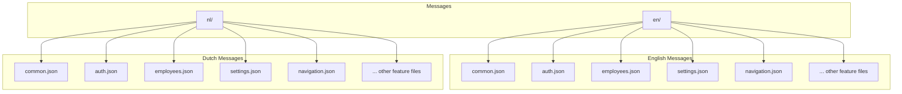
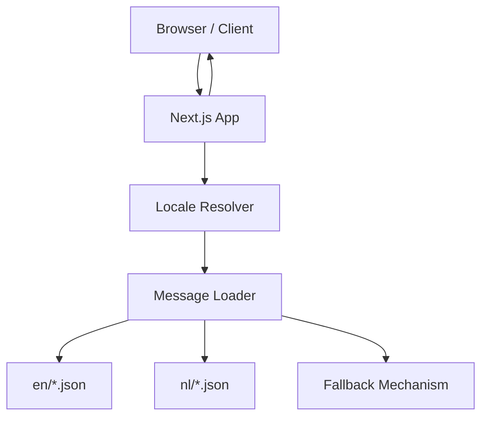
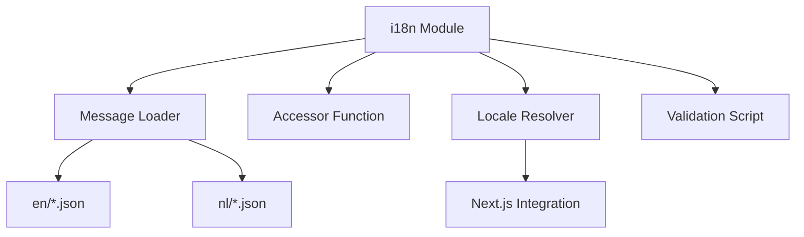
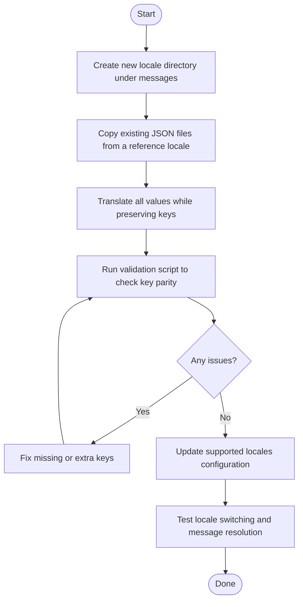

# Internationalization (i18n)

<cite>
**Referenced Files in This Document**
- [messages/en/common.json](file://apps/hr-suite/messages/en/common.json)
- [messages/nl/common.json](file://apps/hr-suite/messages/nl/common.json)
- [scripts/check-i18n.mjs](file://apps/hr-suite/scripts/check-i18n.mjs)
- [next.config.ts](file://apps/hr-suite/next.config.ts)
- [app/layout.tsx](file://apps/hr-suite/app/layout.tsx)
</cite>

## Table of Contents
1. [Introduction](#introduction)
2. [Project Structure](#project-structure)
3. [Core Components](#core-components)
4. [Architecture Overview](#architecture-overview)
5. [Detailed Component Analysis](#detailed-component-analysis)
6. [Dependency Analysis](#dependency-analysis)
7. [Performance Considerations](#performance-considerations)
8. [Troubleshooting Guide](#troubleshooting-guide)
9. [Conclusion](#conclusion)
10. [Appendices](#appendices)

## Introduction
This document explains LiquidHR’s internationalization (i18n) system, which uses a message-based approach with separate JSON files per locale. The application currently supports English and Dutch through dedicated message directories. Translations are organized by feature area into multiple JSON files, enabling modular maintenance and clear ownership of keys. The i18n layer integrates with Next.js to provide runtime locale resolution, fallback behavior, and consistent access to messages across the UI.

The documentation covers:
- How translations are structured and loaded
- Key organization and naming conventions
- Pluralization rules and date/time formatting strategies
- Runtime locale switching and browser locale detection
- Fallback mechanisms when a key is missing
- Integration points with Next.js
- Performance considerations for large translation sets
- Best practices for maintaining consistency and adding new languages
- Testing approaches for i18n functionality

## Project Structure
LiquidHR stores all user-facing text under a single messages directory, with one subdirectory per locale. Each locale contains multiple JSON files grouped by feature or domain (for example, common, authentication, employees, settings). This structure promotes modularity and makes it easier to manage translations at scale.

**Diagram sources**
- [messages/en/common.json](file://apps/hr-suite/messages/en/common.json)
- [messages/nl/common.json](file://apps/hr-suite/messages/nl/common.json)

**Section sources**
- [messages/en/common.json](file://apps/hr-suite/messages/en/common.json)
- [messages/nl/common.json](file://apps/hr-suite/messages/nl/common.json)

## Core Components
The i18n system revolves around three core aspects:
- Message storage: JSON files per locale and feature
- Loader and accessor utilities: functions that load and retrieve messages by key
- Locale management: determining the active locale and handling fallbacks

Key responsibilities:
- Organize keys consistently across locales
- Provide a unified API to access messages from components and server code
- Support pluralization and interpolation where needed
- Integrate with Next.js routing and layout to set the locale context

Best practices:
- Keep keys flat or shallowly nested to simplify lookups
- Use descriptive key names that reflect UI context
- Avoid embedding dynamic content directly in keys; use placeholders instead
- Maintain parity of keys across locales to prevent missing translations

[No sources needed since this section provides general guidance]

## Architecture Overview
At a high level, the i18n architecture consists of:
- Message files: JSON resources per locale and feature
- Loader module: reads and caches messages for the current locale
- Accessor function: resolves keys with optional parameters (interpolation, pluralization)
- Locale resolver: determines the active locale from browser preferences, cookies, or explicit selection
- Next.js integration: ensures the correct locale is available during rendering and hydration

**Diagram sources**
- [next.config.ts](file://apps/hr-suite/next.config.ts)
- [app/layout.tsx](file://apps/hr-suite/app/layout.tsx)

**Section sources**
- [next.config.ts](file://apps/hr-suite/next.config.ts)
- [app/layout.tsx](file://apps/hr-suite/app/layout.tsx)

## Detailed Component Analysis

### Message Organization and Key Structure
Translations are split into multiple JSON files per locale. A typical file groups related keys for a specific feature or domain. Keys should be stable and descriptive, avoiding changes that would break existing references.

Guidelines:
- Group keys by feature (e.g., auth, employees, settings)
- Use dot notation for hierarchical keys if necessary
- Keep values as simple strings unless interpolation or pluralization is required
- Ensure every key exists in all supported locales

Example file paths:
- [messages/en/common.json](file://apps/hr-suite/messages/en/common.json)
- [messages/nl/common.json](file://apps/hr-suite/messages/nl/common.json)

**Section sources**
- [messages/en/common.json](file://apps/hr-suite/messages/en/common.json)
- [messages/nl/common.json](file://apps/hr-suite/messages/nl/common.json)

### Loading and Accessing Messages
The loader module is responsible for reading the appropriate JSON files based on the active locale and providing an accessor function to resolve keys. It may cache results to avoid repeated file reads.

Responsibilities:
- Resolve the active locale
- Load the corresponding message files
- Expose a typed accessor function for safe key resolution
- Handle missing keys gracefully via fallback

Integration points:
- Server-side rendering: ensure messages are available during page render
- Client-side hydration: maintain locale consistency after hydration

[No sources needed since this section provides general guidance]

### Pluralization Rules
Pluralization should be handled within the message layer. Depending on the implementation, you can:
- Use ICU-style plural formats inside message values
- Provide separate keys for singular and plural forms
- Implement a helper that selects the correct form based on count and locale

Recommendations:
- Prefer ICU format for complex pluralization needs
- Keep plural logic localized to the i18n layer
- Test pluralization across different locales and edge cases

[No sources needed since this section provides general guidance]

### Date and Time Formatting
Date and time formatting should be locale-aware. Options include:
- Using the Intl.DateTimeFormat API for client-side formatting
- Pre-formatting dates on the server using the active locale
- Storing raw timestamps and formatting them at display time

Best practices:
- Store dates as ISO strings or timestamps
- Format only for presentation, not for storage
- Respect locale-specific patterns (e.g., DD/MM/YYYY vs MM/DD/YYYY)

[No sources needed since this section provides general guidance]

### Runtime Locale Switching and Browser Detection
Locale resolution typically follows a priority order:
- Explicit user selection (stored in preferences or cookies)
- Browser language preferences
- Default fallback locale

Implementation steps:
- Detect browser locale on initial load
- Allow users to change locale and persist the choice
- Update the locale context in Next.js to re-render with the new messages

Integration with Next.js:
- Set locale in layout or middleware
- Ensure client and server agree on the active locale

**Section sources**
- [next.config.ts](file://apps/hr-suite/next.config.ts)
- [app/layout.tsx](file://apps/hr-suite/app/layout.tsx)

### Fallback Mechanisms
When a key is missing in the active locale:
- Fall back to a default locale (e.g., English)
- Optionally log missing keys for developers
- Avoid breaking the UI by providing sensible defaults

Strategies:
- Merge messages from fallback locale before lookup
- Wrap accessor calls with error handling and logging
- Provide a developer mode that highlights missing keys

[No sources needed since this section provides general guidance]

### Adding a New Language
To add a new locale:
- Create a new directory under messages (e.g., fr/)
- Copy existing JSON files from an existing locale (e.g., en/)
- Translate each value while preserving keys
- Validate parity of keys across locales
- Update any configuration that lists supported locales

Steps:
- Mirror the structure of existing locales
- Ensure all feature files exist in the new locale
- Run checks to verify key parity

**Section sources**
- [scripts/check-i18n.mjs](file://apps/hr-suite/scripts/check-i18n.mjs)

### Managing Translation Keys
Maintaining consistent keys is critical:
- Centralize key definitions if possible
- Use automated checks to detect missing or extra keys
- Review diffs carefully when modifying keys

Tools:
- Scripts to compare keys across locales
- Linting rules to enforce naming conventions
- Documentation to guide contributors

**Section sources**
- [scripts/check-i18n.mjs](file://apps/hr-suite/scripts/check-i18n.mjs)

### Testing i18n Functionality
Testing strategies:
- Unit tests for message accessors and pluralization helpers
- Snapshot tests for rendered UI text to catch unexpected changes
- Integration tests verifying locale switching behavior
- Automated checks for key parity across locales

Approaches:
- Mock locale context in tests
- Assert expected messages for given inputs
- Verify fallback behavior when keys are missing

**Section sources**
- [scripts/check-i18n.mjs](file://apps/hr-suite/scripts/check-i18n.mjs)

## Dependency Analysis
The i18n system depends on:
- Message JSON files per locale and feature
- Loader and accessor modules
- Locale resolver integrated with Next.js
- Optional scripts for validation and maintenance

**Diagram sources**
- [next.config.ts](file://apps/hr-suite/next.config.ts)
- [scripts/check-i18n.mjs](file://apps/hr-suite/scripts/check-i18n.mjs)

**Section sources**
- [next.config.ts](file://apps/hr-suite/next.config.ts)
- [scripts/check-i18n.mjs](file://apps/hr-suite/scripts/check-i18n.mjs)

## Performance Considerations
For large translation files:
- Lazy-load message files per route or feature
- Cache resolved messages in memory to avoid repeated reads
- Minimize payload size by excluding unused keys
- Use bundler optimizations to tree-shake unused locales

Additional tips:
- Avoid heavy computations in message accessors
- Defer non-critical translations until needed
- Monitor bundle size impact of added locales

[No sources needed since this section provides general guidance]

## Troubleshooting Guide
Common issues and resolutions:
- Missing keys: ensure parity across locales and implement fallbacks
- Incorrect locale: verify browser detection and persistence logic
- Pluralization errors: test with various counts and locales
- Date formatting inconsistencies: confirm locale-aware formatting usage

Debugging steps:
- Enable developer mode to highlight missing keys
- Log locale resolution decisions
- Inspect network requests for message loading
- Validate JSON syntax in message files

**Section sources**
- [scripts/check-i18n.mjs](file://apps/hr-suite/scripts/check-i18n.mjs)

## Conclusion
LiquidHR’s i18n system provides a robust, modular foundation for supporting multiple languages. By organizing messages into feature-specific JSON files, integrating with Next.js for locale resolution, and implementing fallback and pluralization strategies, the application delivers a consistent multilingual experience. Following the best practices outlined here will help maintain translation quality, performance, and scalability as the application grows.

[No sources needed since this section summarizes without analyzing specific files]

## Appendices

### Example Workflow: Adding a New Language

[No sources needed since this diagram shows conceptual workflow, not actual code structure]