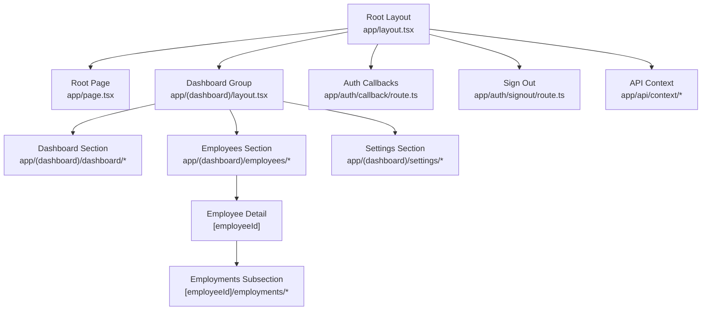
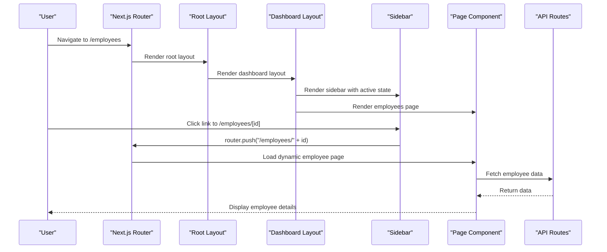
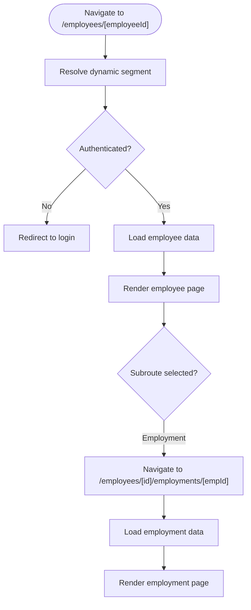
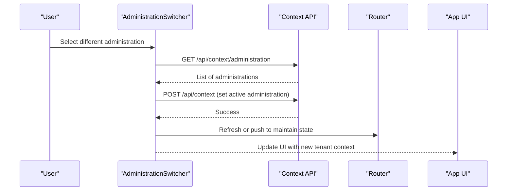
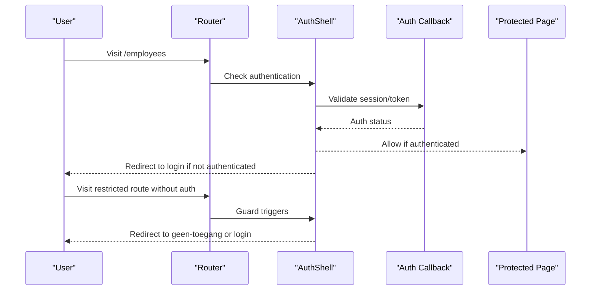
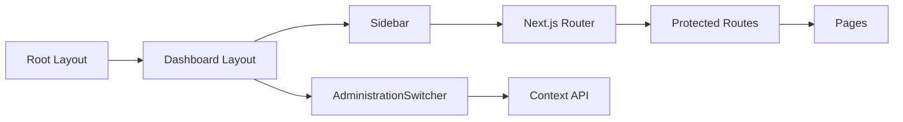

# Routing & Navigation

<cite>
**Referenced Files in This Document**
- [layout.tsx](file://apps/hr-suite/app/layout.tsx)
- [page.tsx](file://apps/hr-suite/app/page.tsx)
- [layout.tsx](file://apps/hr-suite/app/(dashboard)/layout.tsx)
- [loading.tsx](file://apps/hr-suite/app/(dashboard)/loading.tsx)
- [page.tsx](file://apps/hr-suite/app/(dashboard)/dashboard/page.tsx)
- [loading.tsx](file://apps/hr-suite/app/(dashboard)/dashboard/loading.tsx)
- [page.tsx](file://apps/hr-suite/app/(dashboard)/employees/page.tsx)
- [loading.tsx](file://apps/hr-suite/app/(dashboard)/employees/loading.tsx)
- [page.tsx](file://apps/hr-suite/app/(dashboard)/employees/[employeeId]/page.tsx)
- [loading.tsx](file://apps/hr-suite/app/(dashboard)/employees/[employeeId]/loading.tsx)
- [page.tsx](file://apps/hr-suite/app/(dashboard)/employees/[employeeId]/employments/[employmentId]/page.tsx)
- [page.tsx](file://apps/hr-suite/app/(dashboard)/settings/page.tsx)
- [sidebar.tsx](file://apps/hr-suite/components/layout/sidebar.tsx)
- [administration-switcher.tsx](file://apps/hr-suite/components/layout/administration-switcher.tsx)
- [auth-shell.tsx](file://apps/hr-suite/components/auth/auth-shell.tsx)
- [login-form.tsx](file://apps/hr-suite/components/auth/login-form.tsx)
- [route.ts](file://apps/hr-suite/app/api/context/route.ts)
- [route.ts](file://apps/hr-suite/app/api/context/administration/route.ts)
- [route.ts](file://apps/hr-suite/app/auth/callback/route.ts)
- [route.ts](file://apps/hr-suite/app/auth/signout/route.ts)
- [page.tsx](file://apps/hr-suite/app/geen-toegang/page.tsx)
- [next.config.ts](file://apps/hr-suite/next.config.ts)
</cite>

## Table of Contents
1. [Introduction](#introduction)
2. [Project Structure](#project-structure)
3. [Core Components](#core-components)
4. [Architecture Overview](#architecture-overview)
5. [Detailed Component Analysis](#detailed-component-analysis)
6. [Dependency Analysis](#dependency-analysis)
7. [Performance Considerations](#performance-considerations)
8. [Troubleshooting Guide](#troubleshooting-guide)
9. [Conclusion](#conclusion)

## Introduction
This document explains LiquidHR’s routing and navigation system built on the Next.js App Router. It covers file-based routing, dynamic routes for employees and employments, nested layouts, route groups, sidebar navigation, multitenancy administration switcher, programmatic navigation, authentication guards, loading states, error handling, search query management, deep linking, SEO considerations, prefetching, and performance optimization strategies for large applications.

## Project Structure
LiquidHR uses a feature-oriented layout under apps/hr-suite/app with:
- Root layout and page for global shell and default redirect
- A (dashboard) route group that encapsulates authenticated sections
- Nested layouts and loading screens per section
- Dynamic segments for employees and employments
- API routes for context, authentication callbacks, and domain resources
- Shared UI components for sidebar and administration switcher

**Diagram sources**
- [layout.tsx](file://apps/hr-suite/app/layout.tsx)
- [page.tsx](file://apps/hr-suite/app/page.tsx)
- [layout.tsx](file://apps/hr-suite/app/(dashboard)/layout.tsx)
- [page.tsx](file://apps/hr-suite/app/(dashboard)/dashboard/page.tsx)
- [page.tsx](file://apps/hr-suite/app/(dashboard)/employees/page.tsx)
- [page.tsx](file://apps/hr-suite/app/(dashboard)/employees/[employeeId]/page.tsx)
- [page.tsx](file://apps/hr-suite/app/(dashboard)/employees/[employeeId]/employments/[employmentId]/page.tsx)
- [page.tsx](file://apps/hr-suite/app/(dashboard)/settings/page.tsx)
- [route.ts](file://apps/hr-suite/app/api/context/route.ts)
- [route.ts](file://apps/hr-suite/app/auth/callback/route.ts)
- [route.ts](file://apps/hr-suite/app/auth/signout/route.ts)

**Section sources**
- [layout.tsx](file://apps/hr-suite/app/layout.tsx)
- [page.tsx](file://apps/hr-suite/app/page.tsx)
- [layout.tsx](file://apps/hr-suite/app/(dashboard)/layout.tsx)

## Core Components
- Root layout provides global HTML structure, metadata, and shared providers.
- Dashboard layout wraps authenticated sections with persistent UI (e.g., sidebar).
- Sidebar component renders navigation links and active state.
- Administration switcher manages tenant context across the app.
- Auth shell coordinates authentication state and redirects.
- Loading screens provide optimistic UX during data fetching and transitions.

Key responsibilities:
- File-based routing maps directories to URLs.
- Route groups organize related pages without affecting URL paths.
- Dynamic segments capture identifiers like employeeId and employmentId.
- API routes expose endpoints for context and auth flows.

**Section sources**
- [layout.tsx](file://apps/hr-suite/app/layout.tsx)
- [layout.tsx](file://apps/hr-suite/app/(dashboard)/layout.tsx)
- [sidebar.tsx](file://apps/hr-suite/components/layout/sidebar.tsx)
- [administration-switcher.tsx](file://apps/hr-suite/components/layout/administration-switcher.tsx)
- [auth-shell.tsx](file://apps/hr-suite/components/auth/auth-shell.tsx)

## Architecture Overview
The navigation architecture combines Next.js App Router features with application-specific components:
- Global layout defines base chrome and providers.
- The (dashboard) route group enforces consistent authenticated behavior.
- Sections are organized by feature folders with their own layouts and loading states.
- Sidebar drives client-side navigation using Next.js router utilities.
- Multitenancy is managed via an administration switcher that updates context used by API calls and UI.

**Diagram sources**
- [layout.tsx](file://apps/hr-suite/app/layout.tsx)
- [layout.tsx](file://apps/hr-suite/app/(dashboard)/layout.tsx)
- [sidebar.tsx](file://apps/hr-suite/components/layout/sidebar.tsx)
- [page.tsx](file://apps/hr-suite/app/(dashboard)/employees/page.tsx)
- [page.tsx](file://apps/hr-suite/app/(dashboard)/employees/[employeeId]/page.tsx)
- [route.ts](file://apps/hr-suite/app/api/context/route.ts)

## Detailed Component Analysis

### File-Based Routing and Route Groups
- Root page handles initial navigation or redirects to the dashboard.
- The (dashboard) route group encapsulates authenticated sections without adding path segments.
- Each section folder contains its own page.tsx and optional loading.tsx for progressive UX.

Examples:
- Dashboard entry point at (dashboard)/dashboard/page.tsx
- Employees list at (dashboard)/employees/page.tsx
- Settings at (dashboard)/settings/page.tsx

**Section sources**
- [page.tsx](file://apps/hr-suite/app/page.tsx)
- [layout.tsx](file://apps/hr-suite/app/(dashboard)/layout.tsx)
- [page.tsx](file://apps/hr-suite/app/(dashboard)/dashboard/page.tsx)
- [page.tsx](file://apps/hr-suite/app/(dashboard)/employees/page.tsx)
- [page.tsx](file://apps/hr-suite/app/(dashboard)/settings/page.tsx)

### Dynamic Routes for Employees and Employments
- Employee detail uses [employeeId] segment to render specific profiles.
- Employment subroutes live under [employeeId]/employments/[employmentId] for granular views.
- Loading screens per dynamic route improve perceived performance.

**Diagram sources**
- [page.tsx](file://apps/hr-suite/app/(dashboard)/employees/[employeeId]/page.tsx)
- [page.tsx](file://apps/hr-suite/app/(dashboard)/employees/[employeeId]/employments/[employmentId]/page.tsx)

**Section sources**
- [page.tsx](file://apps/hr-suite/app/(dashboard)/employees/[employeeId]/page.tsx)
- [loading.tsx](file://apps/hr-suite/app/(dashboard)/employees/[employeeId]/loading.tsx)
- [page.tsx](file://apps/hr-suite/app/(dashboard)/employees/[employeeId]/employments/[employmentId]/page.tsx)

### Nested Layouts and Section-Specific Chrome
- Dashboard layout provides persistent elements such as header, sidebar, and tenant context.
- Section-level layouts can add additional chrome (e.g., tabs, breadcrumbs).
- Loading screens at each level ensure smooth transitions.

**Section sources**
- [layout.tsx](file://apps/hr-suite/app/(dashboard)/layout.tsx)
- [loading.tsx](file://apps/hr-suite/app/(dashboard)/loading.tsx)
- [loading.tsx](file://apps/hr-suite/app/(dashboard)/dashboard/loading.tsx)
- [loading.tsx](file://apps/hr-suite/app/(dashboard)/employees/loading.tsx)

### Sidebar Navigation Implementation
- Sidebar renders navigation items with active state based on current route.
- Uses Next.js router hooks to detect active segments and highlight links.
- Supports programmatic navigation via router.push for seamless transitions.

Best practices:
- Keep labels centralized in messages for i18n.
- Use shallow routing when only query changes to avoid full re-renders.
- Debounce heavy operations triggered by navigation.

**Section sources**
- [sidebar.tsx](file://apps/hr-suite/components/layout/sidebar.tsx)

### Administration Switcher for Multitenancy
- Administration switcher updates the active tenant context used across API calls and UI.
- Integrates with API routes to fetch available administrations and set preferences.
- Ensures consistent scope for all subsequent requests.

**Diagram sources**
- [administration-switcher.tsx](file://apps/hr-suite/components/layout/administration-switcher.tsx)
- [route.ts](file://apps/hr-suite/app/api/context/route.ts)
- [route.ts](file://apps/hr-suite/app/api/context/administration/route.ts)

**Section sources**
- [administration-switcher.tsx](file://apps/hr-suite/components/layout/administration-switcher.tsx)
- [route.ts](file://apps/hr-suite/app/api/context/route.ts)
- [route.ts](file://apps/hr-suite/app/api/context/administration/route.ts)

### Programmatic Navigation Patterns
- Use Next.js router.push for navigating between routes without full reloads.
- Combine with search params for filtering and stateful queries.
- Prefer shallow routing when only query parameters change to minimize re-renders.

Common patterns:
- Navigate to employee detail with id from a list item click.
- Push to settings with updated filters via query string.
- Maintain back navigation history for multi-step flows.

**Section sources**
- [sidebar.tsx](file://apps/hr-suite/components/layout/sidebar.tsx)

### Authentication Guards and Unauthorized Access Handling
- Auth shell ensures protected routes require authentication.
- Callback route handles OAuth or session verification.
- Sign out route clears sessions and redirects appropriately.
- Unauthorized access displays a dedicated page (geen-toegang).

**Diagram sources**
- [auth-shell.tsx](file://apps/hr-suite/components/auth/auth-shell.tsx)
- [route.ts](file://apps/hr-suite/app/auth/callback/route.ts)
- [route.ts](file://apps/hr-suite/app/auth/signout/route.ts)
- [page.tsx](file://apps/hr-suite/app/geen-toegang/page.tsx)

**Section sources**
- [auth-shell.tsx](file://apps/hr-suite/components/auth/auth-shell.tsx)
- [login-form.tsx](file://apps/hr-suite/components/auth/login-form.tsx)
- [route.ts](file://apps/hr-suite/app/auth/callback/route.ts)
- [route.ts](file://apps/hr-suite/app/auth/signout/route.ts)
- [page.tsx](file://apps/hr-suite/app/geen-toegang/page.tsx)

### Loading States for Route Transitions
- Each route can define a loading.tsx to show skeletons or spinners.
- Nested loading screens compose to provide layered UX.
- Combine with Suspense boundaries for fine-grained streaming.

**Section sources**
- [loading.tsx](file://apps/hr-suite/app/(dashboard)/loading.tsx)
- [loading.tsx](file://apps/hr-suite/app/(dashboard)/dashboard/loading.tsx)
- [loading.tsx](file://apps/hr-suite/app/(dashboard)/employees/loading.tsx)
- [loading.tsx](file://apps/hr-suite/app/(dashboard)/employees/[employeeId]/loading.tsx)

### Search Query Management and Deep Linking
- Use URL search params to represent filters and state.
- Implement debounced input to update query without excessive re-renders.
- Support deep linking by encoding state in URL (e.g., /employees?department=IT&status=active).
- Preserve navigation history for back/forward operations.

Best practices:
- Normalize query keys and values.
- Validate and sanitize inputs before pushing to URL.
- Provide clear reset actions for filters.

**Section sources**
- [sidebar.tsx](file://apps/hr-suite/components/layout/sidebar.tsx)

### SEO Considerations
- Define metadata in layout and page files for titles, descriptions, and canonical URLs.
- Use static generation where possible for indexable content.
- Avoid rendering critical SEO content behind client-only logic.

Recommendations:
- Generate structured data for key entities (employees, employments).
- Ensure robots.txt and sitemap reflect public routes.
- Use Open Graph tags for social sharing.

**Section sources**
- [layout.tsx](file://apps/hr-suite/app/layout.tsx)
- [page.tsx](file://apps/hr-suite/app/(dashboard)/dashboard/page.tsx)

### Route Prefetching and Performance Optimization
- Leverage Next.js automatic prefetching for links within viewport.
- Use router.prefetch for offscreen links to reduce latency.
- Code-split heavy components and lazy-load modules.
- Optimize images and assets; use next/image for responsive delivery.

Strategies:
- Preload critical CSS and fonts.
- Minimize bundle size by removing unused dependencies.
- Cache API responses with SWR or React Query for repeated data.

**Section sources**
- [next.config.ts](file://apps/hr-suite/next.config.ts)

## Dependency Analysis
Routing and navigation depend on:
- Next.js App Router for file-based routing and layouts
- Client-side router for programmatic navigation
- API routes for context and authentication
- Shared components for UI consistency

**Diagram sources**
- [layout.tsx](file://apps/hr-suite/app/layout.tsx)
- [layout.tsx](file://apps/hr-suite/app/(dashboard)/layout.tsx)
- [sidebar.tsx](file://apps/hr-suite/components/layout/sidebar.tsx)
- [administration-switcher.tsx](file://apps/hr-suite/components/layout/administration-switcher.tsx)
- [route.ts](file://apps/hr-suite/app/api/context/route.ts)

**Section sources**
- [layout.tsx](file://apps/hr-suite/app/layout.tsx)
- [layout.tsx](file://apps/hr-suite/app/(dashboard)/layout.tsx)
- [sidebar.tsx](file://apps/hr-suite/components/layout/sidebar.tsx)
- [administration-switcher.tsx](file://apps/hr-suite/components/layout/administration-switcher.tsx)
- [route.ts](file://apps/hr-suite/app/api/context/route.ts)

## Performance Considerations
- Use route-level loading screens to mask data fetching.
- Implement virtualization for large lists (employees, employments).
- Defer non-critical interactions until after initial paint.
- Monitor bundle size and split code by route.
- Utilize caching layers for frequently accessed data.

[No sources needed since this section provides general guidance]

## Troubleshooting Guide
Common issues and resolutions:
- Unauthorized redirects loop: Verify callback route logic and session validation.
- Sidebar active state mismatch: Ensure route matching accounts for nested segments.
- Tenant context not persisting: Confirm API calls set preferences correctly.
- Slow navigation: Check for heavy computations in route transitions and optimize with memoization.

Debugging tips:
- Log router events to track navigation flow.
- Inspect network requests for API failures.
- Use browser dev tools to analyze hydration and re-renders.

**Section sources**
- [auth-shell.tsx](file://apps/hr-suite/components/auth/auth-shell.tsx)
- [route.ts](file://apps/hr-suite/app/auth/callback/route.ts)
- [route.ts](file://apps/hr-suite/app/api/context/route.ts)

## Conclusion
LiquidHR’s routing and navigation system leverages Next.js App Router features to deliver a scalable, maintainable, and performant experience. File-based routing, dynamic segments, route groups, and nested layouts provide clear organization. Sidebar navigation and administration switcher enhance usability and multitenancy support. Authentication guards, loading states, and robust error handling ensure reliability. With careful attention to SEO, prefetching, and performance optimization, the application remains responsive even at scale.