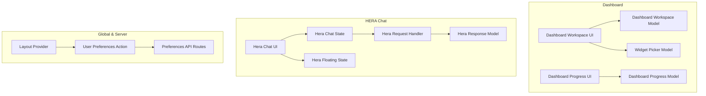
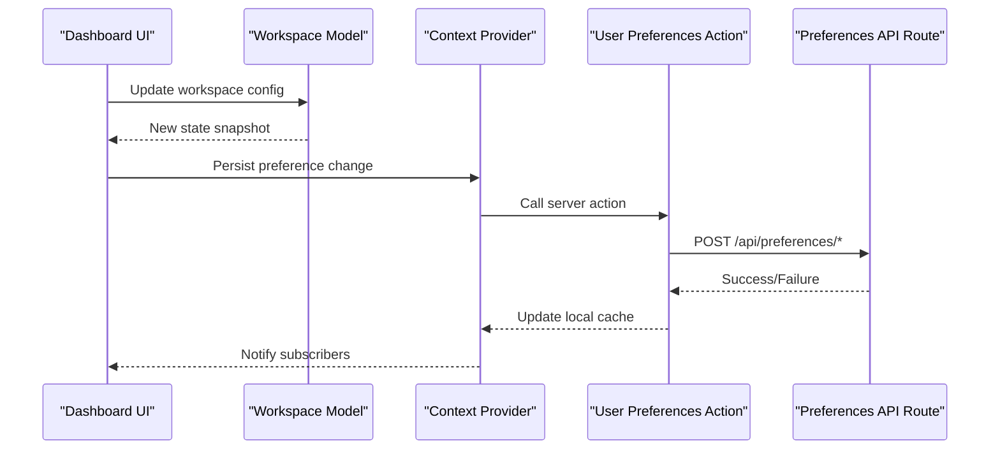
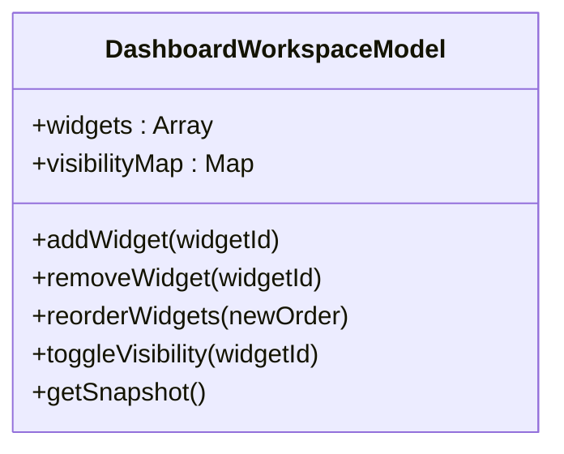
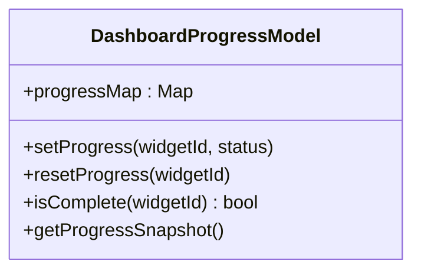
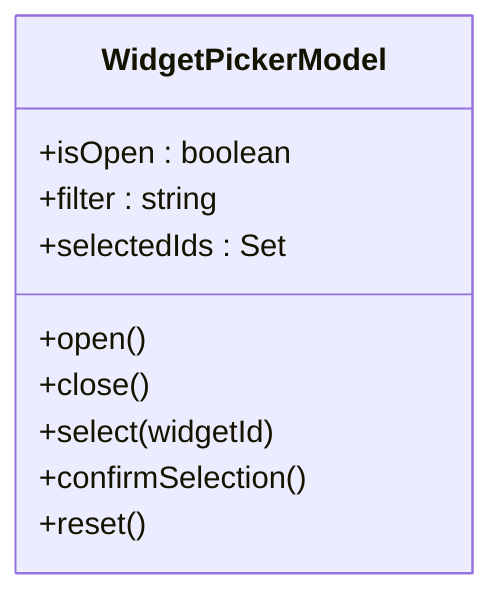
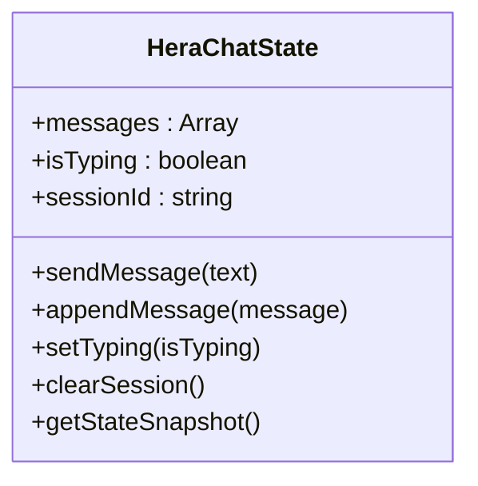
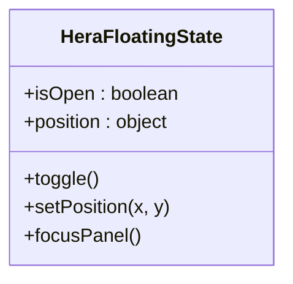
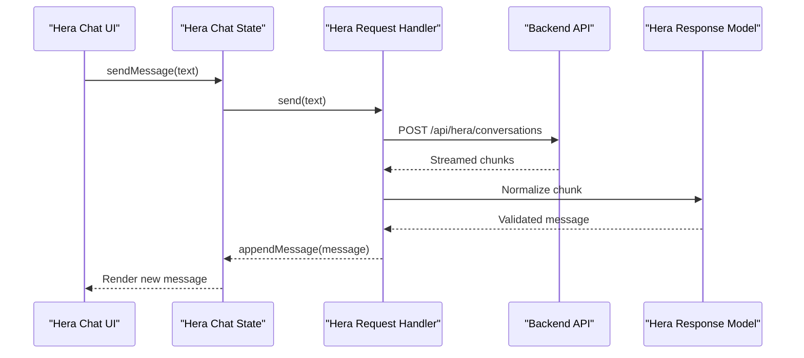
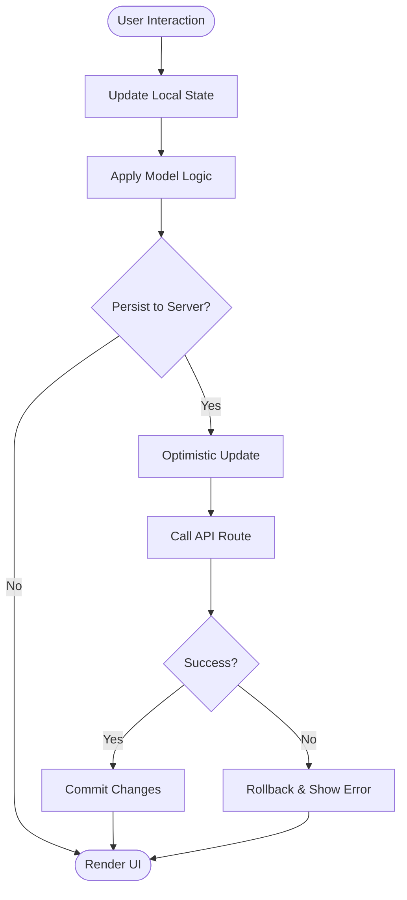
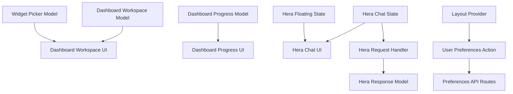

# State Management

<cite>
**Referenced Files in This Document**
- [dashboard-workspace-model.ts](file://apps/hr-suite/components/dashboard/dashboard-workspace-model.ts)
- [dashboard-workspace.tsx](file://apps/hr-suite/components/dashboard/dashboard-workspace.tsx)
- [dashboard-progress-model.ts](file://apps/hr-suite/components/dashboard/dashboard-progress-model.ts)
- [dashboard-progress.tsx](file://apps/hr-suite/components/dashboard/dashboard-progress.tsx)
- [widget-picker-model.ts](file://apps/hr-suite/components/dashboard/widget-picker-model.ts)
- [dashboard-widget-stream.tsx](file://apps/hr-suite/components/dashboard/dashboard-widget-stream.tsx)
- [hera-chat-state.ts](file://apps/hr-suite/components/hera/hera-chat-state.ts)
- [hera-floating-state.ts](file://apps/hr-suite/components/hera/hera-floating-state.ts)
- [hera-chat.tsx](file://apps/hr-suite/components/hera/hera-chat.tsx)
- [hera-request.ts](file://apps/hr-suite/components/hera/hera-request.ts)
- [hera-response-model.ts](file://apps/hr-suite/components/hera/hera-response-model.ts)
- [layout.tsx](file://apps/hr-suite/app/(dashboard)/layout.tsx)
- [update-user-preferences.ts](file://apps/hr-suite/app/actions/update-user-preferences.ts)
- [route.ts (preferences/employees)](file://apps/hr-suite/app/api/preferences/employees/route.ts)
- [route.ts (preferences/hr-calendar)](file://apps/hr-suite/app/api/preferences/hr-calendar/route.ts)
- [route.ts (preferences/insights)](file://apps/hr-suite/app/api/preferences/insights/route.ts)
- [route.ts (preferences/organization-chart)](file://apps/hr-suite/app/api/preferences/organization-chart/route.ts)
- [route.ts (preferences/employee-dashboard)](file://apps/hr-suite/app/api/preferences/employee-dashboard/route.ts)
</cite>

## Table of Contents
1. [Introduction](#introduction)
2. [Project Structure](#project-structure)
3. [Core Components](#core-components)
4. [Architecture Overview](#architecture-overview)
5. [Detailed Component Analysis](#detailed-component-analysis)
6. [Dependency Analysis](#dependency-analysis)
7. [Performance Considerations](#performance-considerations)
8. [Troubleshooting Guide](#troubleshooting-guide)
9. [Conclusion](#conclusion)

## Introduction
This document explains LiquidHR’s hybrid state management strategy that combines React Context, custom hooks, and local component state to deliver a responsive, scalable user experience. It focuses on:
- Model-based state patterns for complex features such as the dashboard workspace and HERA chat
- Global state via context providers
- Local state optimization with useState and useReducer
- Server state handling through API routes and Supabase subscriptions where applicable
- State persistence, optimistic updates, error handling, synchronization between client and server, real-time updates, and performance considerations for large datasets

The goal is to provide both high-level architecture insights and practical guidance for developers working on LiquidHR’s frontend.

## Project Structure
LiquidHR organizes stateful logic close to the UI components that consume it, while sharing global concerns via context providers and actions. Key areas include:
- Dashboard workspace and progress models encapsulate complex UI state and behaviors
- HERA chat state manages conversation lifecycle, floating panel state, and request/response modeling
- Preferences are persisted via API routes and updated through server actions

**Diagram sources**
- [dashboard-workspace-model.ts](file://apps/hr-suite/components/dashboard/dashboard-workspace-model.ts)
- [dashboard-workspace.tsx](file://apps/hr-suite/components/dashboard/dashboard-workspace.tsx)
- [dashboard-progress-model.ts](file://apps/hr-suite/components/dashboard/dashboard-progress-model.ts)
- [dashboard-progress.tsx](file://apps/hr-suite/components/dashboard/dashboard-progress.tsx)
- [widget-picker-model.ts](file://apps/hr-suite/components/dashboard/widget-picker-model.ts)
- [hera-chat-state.ts](file://apps/hr-suite/components/hera/hera-chat-state.ts)
- [hera-floating-state.ts](file://apps/hr-suite/components/hera/hera-floating-state.ts)
- [hera-request.ts](file://apps/hr-suite/components/hera/hera-request.ts)
- [hera-response-model.ts](file://apps/hr-suite/components/hera/hera-response-model.ts)
- [layout.tsx](file://apps/hr-suite/app/(dashboard)/layout.tsx)
- [update-user-preferences.ts](file://apps/hr-suite/app/actions/update-user-preferences.ts)
- [route.ts (preferences/employees)](file://apps/hr-suite/app/api/preferences/employees/route.ts)
- [route.ts (preferences/hr-calendar)](file://apps/hr-suite/app/api/preferences/hr-calendar/route.ts)
- [route.ts (preferences/insights)](file://apps/hr-suite/app/api/preferences/insights/route.ts)
- [route.ts (preferences/organization-chart)](file://apps/hr-suite/app/api/preferences/organization-chart/route.ts)
- [route.ts (preferences/employee-dashboard)](file://apps/hr-suite/app/api/preferences/employee-dashboard/route.ts)

**Section sources**
- [dashboard-workspace-model.ts](file://apps/hr-suite/components/dashboard/dashboard-workspace-model.ts)
- [dashboard-workspace.tsx](file://apps/hr-suite/components/dashboard/dashboard-workspace.tsx)
- [dashboard-progress-model.ts](file://apps/hr-suite/components/dashboard/dashboard-progress-model.ts)
- [dashboard-progress.tsx](file://apps/hr-suite/components/dashboard/dashboard-progress.tsx)
- [widget-picker-model.ts](file://apps/hr-suite/components/dashboard/widget-picker-model.ts)
- [hera-chat-state.ts](file://apps/hr-suite/components/hera/hera-chat-state.ts)
- [hera-floating-state.ts](file://apps/hr-suite/components/hera/hera-floating-state.ts)
- [hera-request.ts](file://apps/hr-suite/components/hera/hera-request.ts)
- [hera-response-model.ts](file://apps/hr-suite/components/hera/hera-response-model.ts)
- [layout.tsx](file://apps/hr-suite/app/(dashboard)/layout.tsx)
- [update-user-preferences.ts](file://apps/hr-suite/app/actions/update-user-preferences.ts)
- [route.ts (preferences/employees)](file://apps/hr-suite/app/api/preferences/employees/route.ts)
- [route.ts (preferences/hr-calendar)](file://apps/hr-suite/app/api/preferences/hr-calendar/route.ts)
- [route.ts (preferences/insights)](file://apps/hr-suite/app/api/preferences/insights/route.ts)
- [route.ts (preferences/organization-chart)](file://apps/hr-suite/app/api/preferences/organization-chart/route.ts)
- [route.ts (preferences/employee-dashboard)](file://apps/hr-suite/app/api/preferences/employee-dashboard/route.ts)

## Core Components
LiquidHR’s state management centers around model files that encapsulate state transitions and business rules, paired with UI components that render and interact with these models.

- Dashboard Workspace Model: Manages workspace configuration, widget ordering, layout state, and interactions like adding/removing widgets or changing visibility.
- Dashboard Progress Model: Tracks per-widget progress states, loading indicators, and completion status across the dashboard.
- Widget Picker Model: Controls the picker dialog state, filtering, selection, and confirmation flows.
- Hera Chat State: Encapsulates conversation history, active messages, typing indicators, and session control.
- Hera Floating State: Manages the floating panel’s open/close state, positioning, and focus behavior.
- Hera Request Handler: Orchestrates sending requests, handling streaming responses, and updating chat state accordingly.
- Hera Response Model: Normalizes and validates incoming responses from the backend.

These components follow a consistent pattern:
- Define a state shape and a reducer-like update function
- Expose methods to mutate state safely
- Provide hooks or consumers to subscribe to state changes
- Integrate with server state via API calls and optional optimistic updates

**Section sources**
- [dashboard-workspace-model.ts](file://apps/hr-suite/components/dashboard/dashboard-workspace-model.ts)
- [dashboard-progress-model.ts](file://apps/hr-suite/components/dashboard/dashboard-progress-model.ts)
- [widget-picker-model.ts](file://apps/hr-suite/components/dashboard/widget-picker-model.ts)
- [hera-chat-state.ts](file://apps/hr-suite/components/hera/hera-chat-state.ts)
- [hera-floating-state.ts](file://apps/hr-suite/components/hera/hera-floating-state.ts)
- [hera-request.ts](file://apps/hr-suite/components/hera/hera-request.ts)
- [hera-response-model.ts](file://apps/hr-suite/components/hera/hera-response-model.ts)

## Architecture Overview
LiquidHR uses a layered approach:
- Global state via context providers for cross-cutting concerns (e.g., theme, preferences, current administration)
- Feature-specific models for complex UI state (dashboard, hera)
- Local component state for transient UI interactions (form inputs, toggles)
- Server state via API routes and Supabase subscriptions for persistence and real-time updates

**Diagram sources**
- [dashboard-workspace.tsx](file://apps/hr-suite/components/dashboard/dashboard-workspace.tsx)
- [dashboard-workspace-model.ts](file://apps/hr-suite/components/dashboard/dashboard-workspace-model.ts)
- [layout.tsx](file://apps/hr-suite/app/(dashboard)/layout.tsx)
- [update-user-preferences.ts](file://apps/hr-suite/app/actions/update-user-preferences.ts)
- [route.ts (preferences/employees)](file://apps/hr-suite/app/api/preferences/employees/route.ts)
- [route.ts (preferences/hr-calendar)](file://apps/hr-suite/app/api/preferences/hr-calendar/route.ts)
- [route.ts (preferences/insights)](file://apps/hr-suite/app/api/preferences/insights/route.ts)
- [route.ts (preferences/organization-chart)](file://apps/hr-suite/app/api/preferences/organization-chart/route.ts)
- [route.ts (preferences/employee-dashboard)](file://apps/hr-suite/app/api/preferences/employee-dashboard/route.ts)

## Detailed Component Analysis

### Dashboard Workspace Model
The dashboard workspace model centralizes state for widget layout, ordering, visibility, and user interactions. It exposes methods to add/remove widgets, reorder them, and toggle visibility, ensuring consistent state transitions.

**Diagram sources**
- [dashboard-workspace-model.ts](file://apps/hr-suite/components/dashboard/dashboard-workspace-model.ts)

**Section sources**
- [dashboard-workspace-model.ts](file://apps/hr-suite/components/dashboard/dashboard-workspace-model.ts)
- [dashboard-workspace.tsx](file://apps/hr-suite/components/dashboard/dashboard-workspace.tsx)

### Dashboard Progress Model
Tracks per-widget progress states, including loading, success, and error states. It provides methods to update progress atomically and derive UI states efficiently.

**Diagram sources**
- [dashboard-progress-model.ts](file://apps/hr-suite/components/dashboard/dashboard-progress-model.ts)

**Section sources**
- [dashboard-progress-model.ts](file://apps/hr-suite/components/dashboard/dashboard-progress-model.ts)
- [dashboard-progress.tsx](file://apps/hr-suite/components/dashboard/dashboard-progress.tsx)

### Widget Picker Model
Manages the widget picker dialog state, including search filters, selected widgets, and confirmation flow. It ensures selections are validated before committing changes.

**Diagram sources**
- [widget-picker-model.ts](file://apps/hr-suite/components/dashboard/widget-picker-model.ts)

**Section sources**
- [widget-picker-model.ts](file://apps/hr-suite/components/dashboard/widget-picker-model.ts)

### Hera Chat State
Encapsulates conversation lifecycle, message history, typing indicators, and session control. It integrates with the request handler to send messages and process responses.

**Diagram sources**
- [hera-chat-state.ts](file://apps/hr-suite/components/hera/hera-chat-state.ts)

**Section sources**
- [hera-chat-state.ts](file://apps/hr-suite/components/hera/hera-chat-state.ts)
- [hera-chat.tsx](file://apps/hr-suite/components/hera/hera-chat.tsx)

### Hera Floating State
Controls the floating panel’s open/close state, positioning, and focus behavior. It ensures smooth UX when toggling the panel.

**Diagram sources**
- [hera-floating-state.ts](file://apps/hr-suite/components/hera/hera-floating-state.ts)

**Section sources**
- [hera-floating-state.ts](file://apps/hr-suite/components/hera/hera-floating-state.ts)

### Hera Request Handler
Orchestrates sending requests to the backend, handling streaming responses, and updating chat state accordingly. It normalizes responses using the response model.

**Diagram sources**
- [hera-request.ts](file://apps/hr-suite/components/hera/hera-request.ts)
- [hera-response-model.ts](file://apps/hr-suite/components/hera/hera-response-model.ts)
- [hera-chat-state.ts](file://apps/hr-suite/components/hera/hera-chat-state.ts)
- [hera-chat.tsx](file://apps/hr-suite/components/hera/hera-chat.tsx)

**Section sources**
- [hera-request.ts](file://apps/hr-suite/components/hera/hera-request.ts)
- [hera-response-model.ts](file://apps/hr-suite/components/hera/hera-response-model.ts)
- [hera-chat-state.ts](file://apps/hr-suite/components/hera/hera-chat-state.ts)
- [hera-chat.tsx](file://apps/hr-suite/components/hera/hera-chat.tsx)

### Conceptual Overview
The overall state strategy balances simplicity and scalability:
- Use React Context for global settings and shared state
- Implement feature-specific models for complex UI logic
- Leverage local state for transient interactions
- Persist server state via API routes and real-time subscriptions where needed

[No sources needed since this diagram shows conceptual workflow, not actual code structure]

## Dependency Analysis
The following diagram illustrates dependencies between key stateful components and their relationships with providers and APIs.

**Diagram sources**
- [dashboard-workspace-model.ts](file://apps/hr-suite/components/dashboard/dashboard-workspace-model.ts)
- [dashboard-workspace.tsx](file://apps/hr-suite/components/dashboard/dashboard-workspace.tsx)
- [dashboard-progress-model.ts](file://apps/hr-suite/components/dashboard/dashboard-progress-model.ts)
- [dashboard-progress.tsx](file://apps/hr-suite/components/dashboard/dashboard-progress.tsx)
- [widget-picker-model.ts](file://apps/hr-suite/components/dashboard/widget-picker-model.ts)
- [hera-chat-state.ts](file://apps/hr-suite/components/hera/hera-chat-state.ts)
- [hera-floating-state.ts](file://apps/hr-suite/components/hera/hera-floating-state.ts)
- [hera-request.ts](file://apps/hr-suite/components/hera/hera-request.ts)
- [hera-response-model.ts](file://apps/hr-suite/components/hera/hera-response-model.ts)
- [layout.tsx](file://apps/hr-suite/app/(dashboard)/layout.tsx)
- [update-user-preferences.ts](file://apps/hr-suite/app/actions/update-user-preferences.ts)
- [route.ts (preferences/employees)](file://apps/hr-suite/app/api/preferences/employees/route.ts)
- [route.ts (preferences/hr-calendar)](file://apps/hr-suite/app/api/preferences/hr-calendar/route.ts)
- [route.ts (preferences/insights)](file://apps/hr-suite/app/api/preferences/insights/route.ts)
- [route.ts (preferences/organization-chart)](file://apps/hr-suite/app/api/preferences/organization-chart/route.ts)
- [route.ts (preferences/employee-dashboard)](file://apps/hr-suite/app/api/preferences/employee-dashboard/route.ts)

**Section sources**
- [dashboard-workspace-model.ts](file://apps/hr-suite/components/dashboard/dashboard-workspace-model.ts)
- [dashboard-workspace.tsx](file://apps/hr-suite/components/dashboard/dashboard-workspace.tsx)
- [dashboard-progress-model.ts](file://apps/hr-suite/components/dashboard/dashboard-progress-model.ts)
- [dashboard-progress.tsx](file://apps/hr-suite/components/dashboard/dashboard-progress.tsx)
- [widget-picker-model.ts](file://apps/hr-suite/components/dashboard/widget-picker-model.ts)
- [hera-chat-state.ts](file://apps/hr-suite/components/hera/hera-chat-state.ts)
- [hera-floating-state.ts](file://apps/hr-suite/components/hera/hera-floating-state.ts)
- [hera-request.ts](file://apps/hr-suite/components/hera/hera-request.ts)
- [hera-response-model.ts](file://apps/hr-suite/components/hera/hera-response-model.ts)
- [layout.tsx](file://apps/hr-suite/app/(dashboard)/layout.tsx)
- [update-user-preferences.ts](file://apps/hr-suite/app/actions/update-user-preferences.ts)
- [route.ts (preferences/employees)](file://apps/hr-suite/app/api/preferences/employees/route.ts)
- [route.ts (preferences/hr-calendar)](file://apps/hr-suite/app/api/preferences/hr-calendar/route.ts)
- [route.ts (preferences/insights)](file://apps/hr-suite/app/api/preferences/insights/route.ts)
- [route.ts (preferences/organization-chart)](file://apps/hr-suite/app/api/preferences/organization-chart/route.ts)
- [route.ts (preferences/employee-dashboard)](file://apps/hr-suite/app/api/preferences/employee-dashboard/route.ts)

## Performance Considerations
- Prefer memoization for expensive computations in models and selectors
- Batch state updates to minimize re-renders
- Use virtualization for large lists in dashboards and chat histories
- Debounce input events in forms and search fields
- Cache frequently accessed data locally and invalidate on mutations
- Optimize context usage by splitting into smaller contexts to reduce unnecessary re-renders
- Leverage streaming responses for long-running operations like AI chat

[No sources needed since this section provides general guidance]

## Troubleshooting Guide
Common issues and resolutions:
- State desynchronization: Ensure optimistic updates are rolled back on failure and that server responses are normalized consistently
- Memory leaks: Clean up subscriptions and event listeners in useEffect cleanup functions
- Performance bottlenecks: Profile re-renders and optimize context consumers; consider splitting contexts
- Real-time updates: Verify Supabase subscription channels and handle connection errors gracefully
- Error handling: Centralize error messages and provide user-friendly feedback

**Section sources**
- [hera-request.ts](file://apps/hr-suite/components/hera/hera-request.ts)
- [hera-response-model.ts](file://apps/hr-suite/components/hera/hera-response-model.ts)
- [update-user-preferences.ts](file://apps/hr-suite/app/actions/update-user-preferences.ts)
- [route.ts (preferences/employees)](file://apps/hr-suite/app/api/preferences/employees/route.ts)
- [route.ts (preferences/hr-calendar)](file://apps/hr-suite/app/api/preferences/hr-calendar/route.ts)
- [route.ts (preferences/insights)](file://apps/hr-suite/app/api/preferences/insights/route.ts)
- [route.ts (preferences/organization-chart)](file://apps/hr-suite/app/api/preferences/organization-chart/route.ts)
- [route.ts (preferences/employee-dashboard)](file://apps/hr-suite/app/api/preferences/employee-dashboard/route.ts)

## Conclusion
LiquidHR’s state management leverages a hybrid approach combining React Context, custom hooks, and local component state to deliver a robust and maintainable architecture. Model-based patterns ensure predictable state transitions, while server state integration enables persistence and real-time updates. By following best practices for performance, error handling, and synchronization, LiquidHR provides a seamless user experience across complex features like dashboards and AI-driven chat interfaces.

[No sources needed since this section summarizes without analyzing specific files]