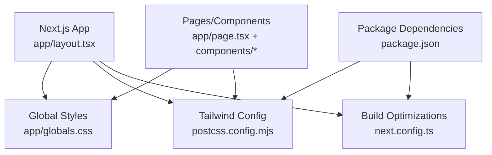
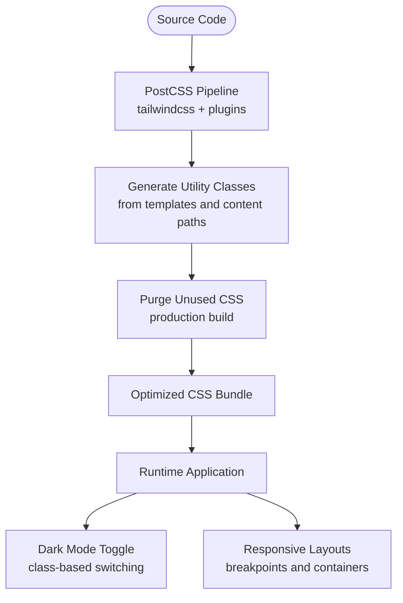
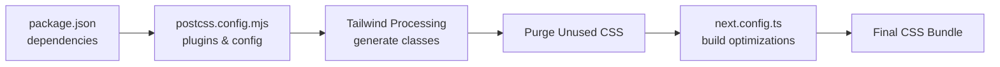

# Styling & Theming

<cite>
**Referenced Files in This Document**
- [globals.css](file://apps/hr-suite/app/globals.css)
- [postcss.config.mjs](file://apps/hr-suite/postcss.config.mjs)
- [next.config.ts](file://apps/hr-suite/next.config.ts)
- [package.json](file://apps/hr-suite/package.json)
- [layout.tsx](file://apps/hr-suite/app/layout.tsx)
- [page.tsx](file://apps/hr-suite/app/page.tsx)
</cite>

## Table of Contents
1. [Introduction](#introduction)
2. [Project Structure](#project-structure)
3. [Core Components](#core-components)
4. [Architecture Overview](#architecture-overview)
5. [Detailed Component Analysis](#detailed-component-analysis)
6. [Dependency Analysis](#dependency-analysis)
7. [Performance Considerations](#performance-considerations)
8. [Troubleshooting Guide](#troubleshooting-guide)
9. [Conclusion](#conclusion)

## Introduction
This document explains LiquidHR’s styling and theming approach built on Tailwind CSS. It covers the utility-first methodology, theme configuration, design system patterns, responsive strategies, dark mode support, accessibility considerations, CSS architecture (global styles, component-specific styles, shared utilities), animations, cross-browser compatibility, and performance optimizations such as purging, critical CSS extraction, and bundle size reduction. The goal is to help developers understand how consistency is enforced across the application while enabling future customization.

## Project Structure
LiquidHR uses a Next.js app structure with Tailwind CSS integrated via PostCSS. Global styles are centralized, and components compose Tailwind utilities for layout, typography, color, spacing, and state-driven variants. Configuration files define the build pipeline, plugin usage, and optimization settings.

**Diagram sources**
- [layout.tsx](file://apps/hr-suite/app/layout.tsx)
- [globals.css](file://apps/hr-suite/app/globals.css)
- [postcss.config.mjs](file://apps/hr-suite/postcss.config.mjs)
- [next.config.ts](file://apps/hr-suite/next.config.ts)
- [package.json](file://apps/hr-suite/package.json)
- [page.tsx](file://apps/hr-suite/app/page.tsx)

**Section sources**
- [layout.tsx](file://apps/hr-suite/app/layout.tsx)
- [globals.css](file://apps/hr-suite/app/globals.css)
- [postcss.config.mjs](file://apps/hr-suite/postcss.config.mjs)
- [next.config.ts](file://apps/hr-suite/next.config.ts)
- [package.json](file://apps/hr-suite/package.json)
- [page.tsx](file://apps/hr-suite/app/page.tsx)

## Core Components
- Utility-first CSS: Components are styled primarily through Tailwind utility classes applied directly in JSX, ensuring consistent spacing, typography, color, and responsive behavior without writing custom CSS where possible.
- Theme tokens: Colors, spacing, radii, shadows, and breakpoints are defined centrally and referenced via Tailwind’s theme extension or semantic aliases used throughout components.
- Design system primitives: Reusable UI elements (buttons, inputs, cards, dialogs) encapsulate common patterns and enforce visual consistency by composing shared utilities and theme tokens.
- Responsive patterns: Mobile-first breakpoints and container queries are used to adapt layouts across devices; components switch from stacked to multi-column layouts at appropriate thresholds.
- Dark mode: Theme toggles and class-based dark mode enable automatic inversion of colors and surfaces based on user preference or system setting.
- Accessibility: Semantic HTML, focus states, contrast ratios, and keyboard navigation are prioritized; interactive elements include aria attributes and visible focus indicators.

**Section sources**
- [globals.css](file://apps/hr-suite/app/globals.css)
- [postcss.config.mjs](file://apps/hr-suite/postcss.config.mjs)
- [next.config.ts](file://apps/hr-suite/next.config.ts)
- [package.json](file://apps/hr-suite/package.json)

## Architecture Overview
The styling architecture follows a layered approach:
- Global layer: Base resets, typography scales, and global variables live in globals.css.
- Theme layer: Tailwind configuration defines semantic tokens and extends defaults for brand consistency.
- Component layer: Each component composes utilities and theme tokens; complex components may include small scoped styles when necessary.
- Build layer: PostCSS processes Tailwind directives, applies plugins, and purges unused CSS during builds.

[No sources needed since this diagram shows conceptual workflow, not actual code structure]

## Detailed Component Analysis

### Global Styles and Base Layer
- Base reset and typography: Global CSS establishes consistent base styles, font stacks, line heights, and default link/button behaviors.
- Custom properties: CSS variables expose theme tokens (colors, spacing, radii) for use in both Tailwind and any custom CSS.
- Scrollbar and selection: Browser-specific tweaks ensure consistent appearance across platforms.

**Section sources**
- [globals.css](file://apps/hr-suite/app/globals.css)

### Tailwind Configuration and Plugins
- Content scanning: Paths are configured so Tailwind scans all relevant source files for class usage.
- Theme extensions: Brand colors, spacing scales, and component tokens are extended to maintain consistency.
- Plugins: Additional functionality (e.g., forms, typography) can be enabled to accelerate development.

**Section sources**
- [postcss.config.mjs](file://apps/hr-suite/postcss.config.mjs)
- [package.json](file://apps/hr-suite/package.json)

### Next.js Integration and Build Optimizations
- App shell: The root layout injects global styles and sets up theme context for dark mode.
- Static/dynamic analysis: Next.js analyzes imports and routes to optimize asset delivery.
- Optimization flags: Compression, minification, and tree-shaking are enabled to reduce bundle size.

**Section sources**
- [layout.tsx](file://apps/hr-suite/app/layout.tsx)
- [next.config.ts](file://apps/hr-suite/next.config.ts)
- [package.json](file://apps/hr-suite/package.json)

### Responsive Design Patterns
- Mobile-first approach: Default styles target small screens; larger screens are enhanced using breakpoint utilities.
- Grid and flex layouts: Components switch between single-column and multi-column arrangements based on viewport width.
- Container-aware layouts: Where supported, container queries allow components to adapt to their own size rather than only the viewport.

**Section sources**
- [globals.css](file://apps/hr-suite/app/globals.css)
- [postcss.config.mjs](file://apps/hr-suite/postcss.config.mjs)

### Dark Mode Support
- Class-based toggling: A root-level class enables dark mode; components respond via variant prefixes.
- System preference detection: The app respects OS-level preferences and allows user overrides.
- Contrast and readability: Color tokens are chosen to meet WCAG contrast requirements in both light and dark themes.

**Section sources**
- [layout.tsx](file://apps/hr-suite/app/layout.tsx)
- [globals.css](file://apps/hr-suite/app/globals.css)

### Accessibility in Styling
- Focus management: Visible focus rings and logical tab order improve keyboard usability.
- Semantic markup: Headings, landmarks, and form labels enhance screen reader experience.
- Color independence: Information is not conveyed by color alone; icons and text supplement meaning.

**Section sources**
- [globals.css](file://apps/hr-suite/app/globals.css)

### Animations and Transitions
- Utility-driven motion: Subtle transitions for hover, focus, and state changes are implemented with Tailwind utilities.
- Performance-conscious animations: Use transform and opacity for smooth, GPU-accelerated effects.
- Reduced motion respect: Respects prefers-reduced-motion to minimize animation for users who prefer less motion.

**Section sources**
- [globals.css](file://apps/hr-suite/app/globals.css)
- [postcss.config.mjs](file://apps/hr-suite/postcss.config.mjs)

### Cross-Browser Compatibility Strategies
- Vendor prefixes: Handled automatically by PostCSS and Tailwind’s processing pipeline.
- Feature detection: Graceful fallbacks for newer features like container queries or backdrop blur.
- Consistent baseline: Global resets normalize browser differences for predictable rendering.

**Section sources**
- [postcss.config.mjs](file://apps/hr-suite/postcss.config.mjs)
- [globals.css](file://apps/hr-suite/app/globals.css)

### Custom Component Styling Examples
- Button variants: Primary, secondary, and ghost buttons share base styles and differ via color and ring utilities.
- Form fields: Inputs, selects, and textareas follow consistent padding, border radius, and focus states.
- Cards and panels: Shared elevation, padding, and corner radii create cohesive surfaces.

[No sources needed since this section provides general guidance]

## Dependency Analysis
Tailwind CSS and related tools are wired into the build process. PostCSS orchestrates Tailwind directives, scans content paths, and applies plugins. Next.js integrates these outputs into the final bundle with optimizations.

**Diagram sources**
- [package.json](file://apps/hr-suite/package.json)
- [postcss.config.mjs](file://apps/hr-suite/postcss.config.mjs)
- [next.config.ts](file://apps/hr-suite/next.config.ts)

**Section sources**
- [package.json](file://apps/hr-suite/package.json)
- [postcss.config.mjs](file://apps/hr-suite/postcss.config.mjs)
- [next.config.ts](file://apps/hr-suite/next.config.ts)

## Performance Considerations
- CSS purging: Unused styles are removed in production builds to minimize payload.
- Critical CSS extraction: Inline critical styles for above-the-fold content to improve perceived performance.
- Bundle size optimization: Enable compression, minification, and avoid heavy third-party CSS libraries.
- Lazy loading: Defer non-critical styles and assets to speed initial load.
- Tree-shaking: Ensure unused modules and styles are excluded from the final bundle.

[No sources needed since this section provides general guidance]

## Troubleshooting Guide
- Missing styles in production: Verify content paths in Tailwind configuration and ensure all template files are scanned.
- Dark mode not applying: Confirm root class toggling logic and that components use correct variant prefixes.
- Inconsistent spacing or colors: Check theme extensions and ensure components reference semantic tokens instead of hardcoded values.
- Slow builds: Review plugin usage and content scanning scope; remove unnecessary plugins and limit file scanning to required paths.
- Accessibility regressions: Validate focus states, contrast ratios, and semantic markup across components.

**Section sources**
- [postcss.config.mjs](file://apps/hr-suite/postcss.config.mjs)
- [globals.css](file://apps/hr-suite/app/globals.css)
- [layout.tsx](file://apps/hr-suite/app/layout.tsx)

## Conclusion
LiquidHR’s styling and theming strategy leverages Tailwind CSS to deliver a consistent, accessible, and performant design system. By centralizing theme tokens, enforcing utility-first composition, and optimizing the build pipeline, the application maintains visual coherence while remaining flexible for future customization. Responsive patterns, dark mode, and accessibility considerations ensure a high-quality user experience across devices and preferences.