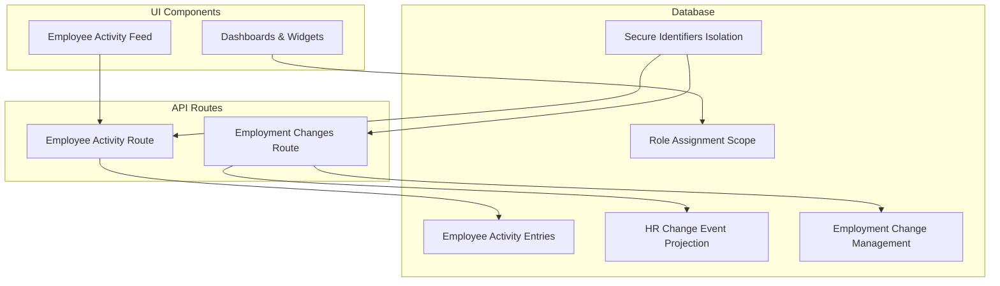
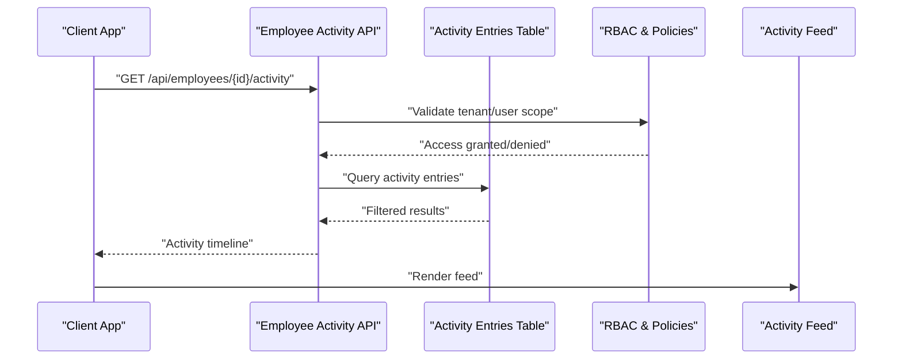
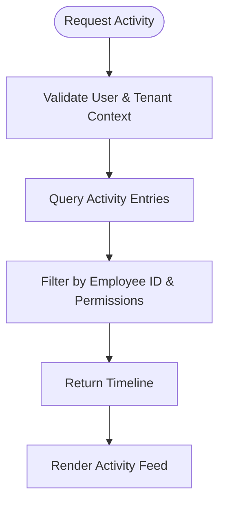
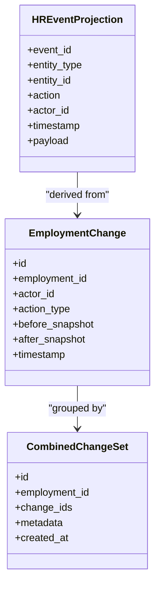
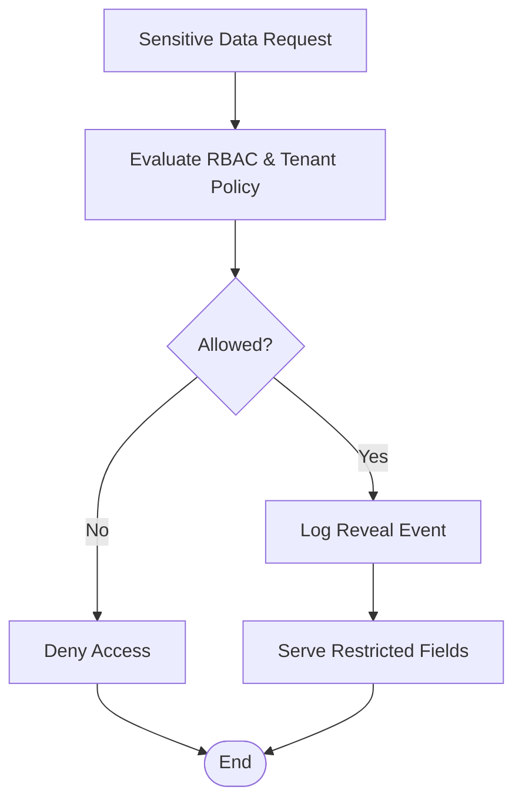
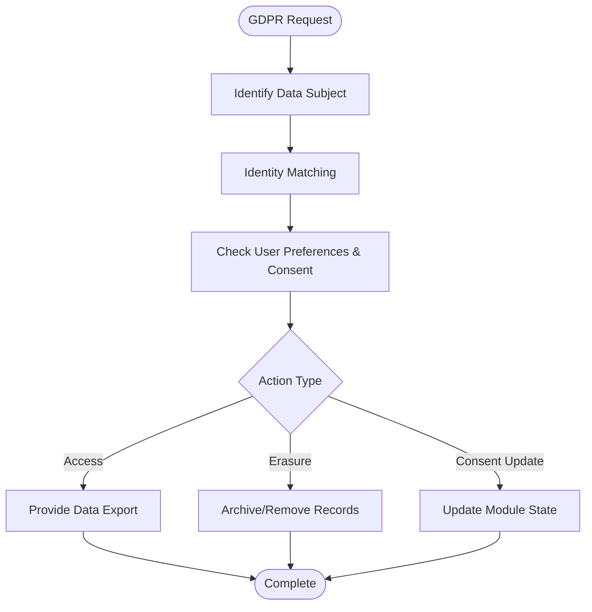
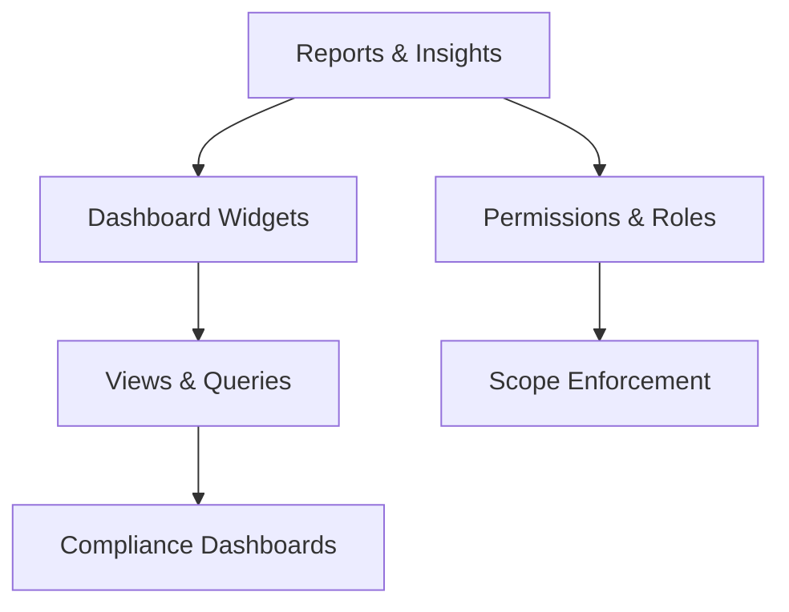
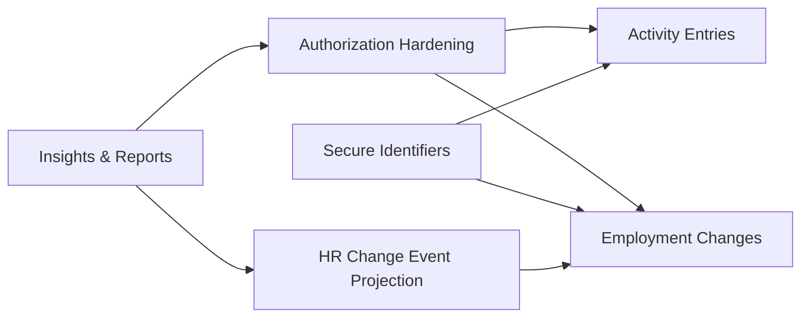

# Audit and Compliance

<cite>
**Referenced Files in This Document**
- [20260724160000_add_employee_activity_entries.sql](file://apps/hr-suite/supabase/migrations/20260724160000_add_employee_activity_entries.sql)
- [20260724172716_harden_employee_activity_entries.sql](file://apps/hr-suite/supabase/migrations/20260724172716_harden_employee_activity_entries.sql)
- [route.ts (Employee Activity)](file://apps/hr-suite/app/api/employees/[employeeId]/activity/route.ts)
- [employee-activity-feed.tsx](file://apps/hr-suite/components/employees/employee-activity-feed.tsx)
- [20260718120000_add_hr_change_event_projection.sql](file://apps/hr-suite/supabase/migrations/20260718120000_add_hr_change_event_projection.sql)
- [changes route.ts](file://apps/hr-suite/app/api/employments/[employmentId]/changes/route.ts)
- [20260715141843_add_employment_change_management.sql](file://apps/hr-suite/supabase/migrations/20260715141843_add_employment_change_management.sql)
- [20260716100000_add_combined_employment_change_sets.sql](file://apps/hr-suite/supabase/migrations/20260716100000_add_combined_employment_change_sets.sql)
- [20260715124506_isolate_employee_secure_identifiers.sql](file://apps/hr-suite/supabase/migrations/20260715124506_isolate_employee_secure_identifiers.sql)
- [20260715124744_allow_logged_bsn_reveal.sql](file://apps/hr-suite/supabase/migrations/20260715124744_allow_logged_bsn_reveal.sql)
- [20260715072010_harden_employment_security.sql](file://apps/hr-suite/supabase/migrations/20260715072010_harden_employment_security.sql)
- [20260714170949_harden_organization_authorization.sql](file://apps/hr-suite/supabase/migrations/20260714170949_harden_organization_authorization.sql)
- [20260714171241_link_employees_from_auth_trigger.sql](file://apps/hr-suite/supabase/migrations/20260714171241_link_employees_from_auth_trigger.sql)
- [20260715070404_add_user_preferences.sql](file://apps/hr-suite/supabase/migrations/20260715070404_add_user_preferences.sql)
- [20260715071054_add_employee_identity_matching.sql](file://apps/hr-suite/supabase/migrations/20260715071054_add_employee_identity_matching.sql)
- [20260718122614_enforce_optional_module_guards.sql](file://apps/hr-suite/supabase/migrations/20260718122614_enforce_optional_module_guards.sql)
- [20260718122751_expose_module_state_to_tenant_users.sql](file://apps/hr-suite/supabase/migrations/20260718122751_expose_module_state_to_tenant_users.sql)
- [20260718131000_harden_hr_master_data_document_policies.sql](file://apps/hr-suite/supabase/migrations/20260718131000_harden_hr_master_data_document_policies.sql)
- [20260718150000_add_employee_archive_and_avatar_state.sql](file://apps/hr-suite/supabase/migrations/20260718150000_add_employee_archive_and_avatar_state.sql)
- [20260718170000_add_dashboard_widget_catalog.sql](file://apps/hr-suite/supabase/migrations/20260718170000_add_dashboard_widget_catalog.sql)
- [20260718171000_relax_dashboard_widget_read_scope.sql](file://apps/hr-suite/supabase/migrations/20260718171000_relax_dashboard_widget_read_scope.sql)
- [20260718172000_expand_personal_dashboard_widget_types.sql](file://apps/hr-suite/supabase/migrations/20260718172000_expand_personal_dashboard_widget_types.sql)
- [20260718172051_grant_dashboard_widget_admin_permissions.sql](file://apps/hr-suite/supabase/migrations/20260718172051_grant_dashboard_widget_admin_permissions.sql)
- [20260718173000_tune_dashboard_widget_policies.sql](file://apps/hr-suite/supabase/migrations/20260718173000_tune_dashboard_widget_policies.sql)
- [20260719101500_refine_employee_document_upload_rules.sql](file://apps/hr-suite/supabase/migrations/20260719101500_refine_employee_document_upload_rules.sql)
- [20260719112000_add_week_numbering_user_preference.sql](file://apps/hr-suite/supabase/migrations/20260719112000_add_week_numbering_user_preference.sql)
- [20260724103939_simplify_roles_and_insights_events.sql](file://apps/hr-suite/supabase/migrations/20260724103939_simplify_roles_and_insights_events.sql)
- [20260724112407_add_role_assignment_scope.sql](file://apps/hr-suite/supabase/migrations/20260724112407_add_role_assignment_scope.sql)
- [20260724095433_insights_report_permissions.sql](file://apps/hr-suite/supabase/migrations/20260724095433_insights_report_permissions.sql)
- [20260724100605_upcoming_events_and_anniversary_rules.sql](file://apps/hr-suite/supabase/migrations/20260724100605_upcoming_events_and_anniversary_rules.sql)
- [20260724101500_refine_employee_document_upload_rules.sql](file://apps/hr-suite/supabase/migrations/20260724101500_refine_employee_document_upload_rules.sql)
</cite>

## Table of Contents
1. Introduction
2. Project Structure
3. Core Components
4. Architecture Overview
5. Detailed Component Analysis
6. Dependency Analysis
7. Performance Considerations
8. Troubleshooting Guide
9. Conclusion
10. Appendices

## Introduction
This document provides audit and compliance documentation for LiquidHR, focusing on:
- Employee activity tracking system
- Audit log implementation and change management
- Compliance reporting capabilities
- Sensitive data access logging and security event monitoring
- GDPR-related features including data subject rights, consent management, and right to erasure
- Data retention policies, log archival strategies, and HR compliance certification considerations

The content synthesizes the application’s API routes, database migrations, and UI components that implement these capabilities.

## Project Structure
Audit and compliance functionality spans several layers:
- Database schema and policies for secure identifiers, change events, and role scoping
- API endpoints for employee activity and employment changes
- UI components for activity feeds and dashboards
- Policies and permissions governing sensitive data access and module visibility

**Diagram sources**
- [20260724160000_add_employee_activity_entries.sql](file://apps/hr-suite/supabase/migrations/20260724160000_add_employee_activity_entries.sql)
- [20260718120000_add_hr_change_event_projection.sql](file://apps/hr-suite/supabase/migrations/20260718120000_add_hr_change_event_projection.sql)
- [20260715141843_add_employment_change_management.sql](file://apps/hr-suite/supabase/migrations/20260715141843_add_employment_change_management.sql)
- [20260715124506_isolate_employee_secure_identifiers.sql](file://apps/hr-suite/supabase/migrations/20260715124506_isolate_employee_secure_identifiers.sql)
- [20260724112407_add_role_assignment_scope.sql](file://apps/hr-suite/supabase/migrations/20260724112407_add_role_assignment_scope.sql)
- [route.ts (Employee Activity)](file://apps/hr-suite/app/api/employees/[employeeId]/activity/route.ts)
- [changes route.ts](file://apps/hr-suite/app/api/employments/[employmentId]/changes/route.ts)
- [employee-activity-feed.tsx](file://apps/hr-suite/components/employees/employee-activity-feed.tsx)

**Section sources**
- [20260724160000_add_employee_activity_entries.sql](file://apps/hr-suite/supabase/migrations/20260724160000_add_employee_activity_entries.sql)
- [20260724172716_harden_employee_activity_entries.sql](file://apps/hr-suite/supabase/migrations/20260724172716_harden_employee_activity_entries.sql)
- [20260718120000_add_hr_change_event_projection.sql](file://apps/hr-suite/supabase/migrations/20260718120000_add_hr_change_event_projection.sql)
- [20260715141843_add_employment_change_management.sql](file://apps/hr-suite/supabase/migrations/20260715141843_add_employment_change_management.sql)
- [20260716100000_add_combined_employment_change_sets.sql](file://apps/hr-suite/supabase/migrations/20260716100000_add_combined_employment_change_sets.sql)
- [20260715124506_isolate_employee_secure_identifiers.sql](file://apps/hr-suite/supabase/migrations/20260715124506_isolate_employee_secure_identifiers.sql)
- [20260715124744_allow_logged_bsn_reveal.sql](file://apps/hr-suite/supabase/migrations/20260715124744_allow_logged_bsn_reveal.sql)
- [20260715072010_harden_employment_security.sql](file://apps/hr-suite/supabase/migrations/20260715072010_harden_employment_security.sql)
- [20260714170949_harden_organization_authorization.sql](file://apps/hr-suite/supabase/migrations/20260714170949_harden_organization_authorization.sql)
- [20260714171241_link_employees_from_auth_trigger.sql](file://apps/hr-suite/supabase/migrations/20260714171241_link_employees_from_auth_trigger.sql)
- [20260715070404_add_user_preferences.sql](file://apps/hr-suite/supabase/migrations/20260715070404_add_user_preferences.sql)
- [20260715071054_add_employee_identity_matching.sql](file://apps/hr-suite/supabase/migrations/20260715071054_add_employee_identity_matching.sql)
- [20260718122614_enforce_optional_module_guards.sql](file://apps/hr-suite/supabase/migrations/20260718122614_enforce_optional_module_guards.sql)
- [20260718122751_expose_module_state_to_tenant_users.sql](file://apps/hr-suite/supabase/migrations/20260718122751_expose_module_state_to_tenant_users.sql)
- [20260718131000_harden_hr_master_data_document_policies.sql](file://apps/hr-suite/supabase/migrations/20260718131000_harden_hr_master_data_document_policies.sql)
- [20260718150000_add_employee_archive_and_avatar_state.sql](file://apps/hr-suite/supabase/migrations/20260718150000_add_employee_archive_and_avatar_state.sql)
- [20260718170000_add_dashboard_widget_catalog.sql](file://apps/hr-suite/supabase/migrations/20260718170000_add_dashboard_widget_catalog.sql)
- [20260718171000_relax_dashboard_widget_read_scope.sql](file://apps/hr-suite/supabase/migrations/20260718171000_relax_dashboard_widget_read_scope.sql)
- [20260718172000_expand_personal_dashboard_widget_types.sql](file://apps/hr-suite/supabase/migrations/20260718172000_expand_personal_dashboard_widget_types.sql)
- [20260718172051_grant_dashboard_widget_admin_permissions.sql](file://apps/hr-suite/supabase/migrations/20260718172051_grant_dashboard_widget_admin_permissions.sql)
- [20260718173000_tune_dashboard_widget_policies.sql](file://apps/hr-suite/supabase/migrations/20260718173000_tune_dashboard_widget_policies.sql)
- [20260719101500_refine_employee_document_upload_rules.sql](file://apps/hr-suite/supabase/migrations/20260719101500_refine_employee_document_upload_rules.sql)
- [20260719112000_add_week_numbering_user_preference.sql](file://apps/hr-suite/supabase/migrations/20260719112000_add_week_numbering_user_preference.sql)
- [20260724103939_simplify_roles_and_insights_events.sql](file://apps/hr-suite/supabase/migrations/20260724103939_simplify_roles_and_insights_events.sql)
- [20260724112407_add_role_assignment_scope.sql](file://apps/hr-suite/supabase/migrations/20260724112407_add_role_assignment_scope.sql)
- [20260724095433_insights_report_permissions.sql](file://apps/hr-suite/supabase/migrations/20260724095433_insights_report_permissions.sql)
- [20260724100605_upcoming_events_and_anniversary_rules.sql](file://apps/hr-suite/supabase/migrations/20260724100605_upcoming_events_and_anniversary_rules.sql)
- [20260724101500_refine_employee_document_upload_rules.sql](file://apps/hr-suite/supabase/migrations/20260724101500_refine_employee_document_upload_rules.sql)

## Core Components
- Employee Activity Tracking: Captures user interactions with employee records, enabling audit trails and activity timelines.
- Employment Change Management: Records structured changes to employment entities, supporting compliance and reconciliation.
- Secure Identifier Handling: Isolates sensitive fields and controls reveal conditions for logged access.
- Role and Module Governance: Enforces scope-based access and optional module guards for compliance boundaries.
- Dashboard and Reporting: Provides views and widgets for insights and compliance reporting.

Key implementation references:
- Employee activity entries schema and hardening policies
- HR change event projection for unified audit trail
- Employment change management and combined change sets
- Secure identifier isolation and controlled BSN reveal
- Authorization hardening and role assignment scoping

**Section sources**
- [20260724160000_add_employee_activity_entries.sql](file://apps/hr-suite/supabase/migrations/20260724160000_add_employee_activity_entries.sql)
- [20260724172716_harden_employee_activity_entries.sql](file://apps/hr-suite/supabase/migrations/20260724172716_harden_employee_activity_entries.sql)
- [20260718120000_add_hr_change_event_projection.sql](file://apps/hr-suite/supabase/migrations/20260718120000_add_hr_change_event_projection.sql)
- [20260715141843_add_employment_change_management.sql](file://apps/hr-suite/supabase/migrations/20260715141843_add_employment_change_management.sql)
- [20260716100000_add_combined_employment_change_sets.sql](file://apps/hr-suite/supabase/migrations/20260716100000_add_combined_employment_change_sets.sql)
- [20260715124506_isolate_employee_secure_identifiers.sql](file://apps/hr-suite/supabase/migrations/20260715124506_isolate_employee_secure_identifiers.sql)
- [20260715124744_allow_logged_bsn_reveal.sql](file://apps/hr-suite/supabase/migrations/20260715124744_allow_logged_bsn_reveal.sql)
- [20260715072010_harden_employment_security.sql](file://apps/hr-suite/supabase/migrations/20260715072010_harden_employment_security.sql)
- [20260714170949_harden_organization_authorization.sql](file://apps/hr-suite/supabase/migrations/20260714170949_harden_organization_authorization.sql)
- [20260724112407_add_role_assignment_scope.sql](file://apps/hr-suite/supabase/migrations/20260724112407_add_role_assignment_scope.sql)

## Architecture Overview
The audit and compliance architecture integrates database-level policies, API endpoints, and UI components to ensure traceability and control over sensitive data.

**Diagram sources**
- [route.ts (Employee Activity)](file://apps/hr-suite/app/api/employees/[employeeId]/activity/route.ts)
- [20260724160000_add_employee_activity_entries.sql](file://apps/hr-suite/supabase/migrations/20260724160000_add_employee_activity_entries.sql)
- [20260724172716_harden_employee_activity_entries.sql](file://apps/hr-suite/supabase/migrations/20260724172716_harden_employee_activity_entries.sql)
- [employee-activity-feed.tsx](file://apps/hr-suite/components/employees/employee-activity-feed.tsx)

**Section sources**
- [route.ts (Employee Activity)](file://apps/hr-suite/app/api/employees/[employeeId]/activity/route.ts)
- [employee-activity-feed.tsx](file://apps/hr-suite/components/employees/employee-activity-feed.tsx)

## Detailed Component Analysis

### Employee Activity Tracking
- Purpose: Record and display user interactions with employee records for auditability and operational insight.
- Implementation:
  - Schema defines activity entries with timestamps, actor identity, and action metadata.
  - Hardening policies restrict writes and reads based on tenant and role context.
  - API endpoint retrieves activity entries scoped to the employee and authorized user.
  - UI component renders a chronological feed for the selected employee.

**Diagram sources**
- [route.ts (Employee Activity)](file://apps/hr-suite/app/api/employees/[employeeId]/activity/route.ts)
- [20260724160000_add_employee_activity_entries.sql](file://apps/hr-suite/supabase/migrations/20260724160000_add_employee_activity_entries.sql)
- [20260724172716_harden_employee_activity_entries.sql](file://apps/hr-suite/supabase/migrations/20260724172716_harden_employee_activity_entries.sql)
- [employee-activity-feed.tsx](file://apps/hr-suite/components/employees/employee-activity-feed.tsx)

**Section sources**
- [route.ts (Employee Activity)](file://apps/hr-suite/app/api/employees/[employeeId]/activity/route.ts)
- [20260724160000_add_employee_activity_entries.sql](file://apps/hr-suite/supabase/migrations/20260724160000_add_employee_activity_entries.sql)
- [20260724172716_harden_employee_activity_entries.sql](file://apps/hr-suite/supabase/migrations/20260724172716_harden_employee_activity_entries.sql)
- [employee-activity-feed.tsx](file://apps/hr-suite/components/employees/employee-activity-feed.tsx)

### Employment Change Management and Audit Trail
- Purpose: Track structured changes to employment data, enabling compliance audits and reconciliation.
- Implementation:
  - Change management schema captures before/after states and change metadata.
  - Combined change sets aggregate related modifications into coherent units.
  - HR change event projection unifies audit events across modules.
  - API endpoint exposes change history for an employment record.

**Diagram sources**
- [20260715141843_add_employment_change_management.sql](file://apps/hr-suite/supabase/migrations/20260715141843_add_employment_change_management.sql)
- [20260716100000_add_combined_employment_change_sets.sql](file://apps/hr-suite/supabase/migrations/20260716100000_add_combined_employment_change_sets.sql)
- [20260718120000_add_hr_change_event_projection.sql](file://apps/hr-suite/supabase/migrations/20260718120000_add_hr_change_event_projection.sql)
- [changes route.ts](file://apps/hr-suite/app/api/employments/[employmentId]/changes/route.ts)

**Section sources**
- [20260715141843_add_employment_change_management.sql](file://apps/hr-suite/supabase/migrations/20260715141843_add_employment_change_management.sql)
- [20260716100000_add_combined_employment_change_sets.sql](file://apps/hr-suite/supabase/migrations/20260716100000_add_combined_employment_change_sets.sql)
- [20260718120000_add_hr_change_event_projection.sql](file://apps/hr-suite/supabase/migrations/20260718120000_add_hr_change_event_projection.sql)
- [changes route.ts](file://apps/hr-suite/app/api/employments/[employmentId]/changes/route.ts)

### Sensitive Data Access Logging and Security Events
- Purpose: Ensure sensitive identifiers are isolated and accessed only under controlled conditions; log reveals when permitted.
- Implementation:
  - Secure identifiers are isolated in dedicated structures with strict policies.
  - Controlled BSN reveal is allowed only for logged users under specific conditions.
  - Employment security policies enforce read/write constraints.
  - Organization authorization hardening ensures tenant-scoped access.

**Diagram sources**
- [20260715124506_isolate_employee_secure_identifiers.sql](file://apps/hr-suite/supabase/migrations/20260715124506_isolate_employee_secure_identifiers.sql)
- [20260715124744_allow_logged_bsn_reveal.sql](file://apps/hr-suite/supabase/migrations/20260715124744_allow_logged_bsn_reveal.sql)
- [20260715072010_harden_employment_security.sql](file://apps/hr-suite/supabase/migrations/20260715072010_harden_employment_security.sql)
- [20260714170949_harden_organization_authorization.sql](file://apps/hr-suite/supabase/migrations/20260714170949_harden_organization_authorization.sql)

**Section sources**
- [20260715124506_isolate_employee_secure_identifiers.sql](file://apps/hr-suite/supabase/migrations/20260715124506_isolate_employee_secure_identifiers.sql)
- [20260715124744_allow_logged_bsn_reveal.sql](file://apps/hr-suite/supabase/migrations/20260715124744_allow_logged_bsn_reveal.sql)
- [20260715072010_harden_employment_security.sql](file://apps/hr-suite/supabase/migrations/20260715072010_harden_employment_security.sql)
- [20260714170949_harden_organization_authorization.sql](file://apps/hr-suite/supabase/migrations/20260714170949_harden_organization_authorization.sql)

### GDPR Compliance Features
- Data Subject Rights:
  - Identity matching supports linking and managing employee identities securely.
  - User preferences allow personal settings and consent-related flags where applicable.
- Consent Management:
  - Optional module guards and exposure of module state enable consent-driven feature toggles.
- Right to Erasure:
  - Archive and avatar state management support lifecycle operations aligned with erasure workflows.
  - Document upload rules refine access and retention behaviors.

**Diagram sources**
- [20260715071054_add_employee_identity_matching.sql](file://apps/hr-suite/supabase/migrations/20260715071054_add_employee_identity_matching.sql)
- [20260715070404_add_user_preferences.sql](file://apps/hr-suite/supabase/migrations/20260715070404_add_user_preferences.sql)
- [20260718122614_enforce_optional_module_guards.sql](file://apps/hr-suite/supabase/migrations/20260718122614_enforce_optional_module_guards.sql)
- [20260718122751_expose_module_state_to_tenant_users.sql](file://apps/hr-suite/supabase/migrations/20260718122751_expose_module_state_to_tenant_users.sql)
- [20260718150000_add_employee_archive_and_avatar_state.sql](file://apps/hr-suite/supabase/migrations/20260718150000_add_employee_archive_and_avatar_state.sql)
- [20260719101500_refine_employee_document_upload_rules.sql](file://apps/hr-suite/supabase/migrations/20260719101500_refine_employee_document_upload_rules.sql)

**Section sources**
- [20260715071054_add_employee_identity_matching.sql](file://apps/hr-suite/supabase/migrations/20260715071054_add_employee_identity_matching.sql)
- [20260715070404_add_user_preferences.sql](file://apps/hr-suite/supabase/migrations/20260715070404_add_user_preferences.sql)
- [20260718122614_enforce_optional_module_guards.sql](file://apps/hr-suite/supabase/migrations/20260718122614_enforce_optional_module_guards.sql)
- [20260718122751_expose_module_state_to_tenant_users.sql](file://apps/hr-suite/supabase/migrations/20260718122751_expose_module_state_to_tenant_users.sql)
- [20260718150000_add_employee_archive_and_avatar_state.sql](file://apps/hr-suite/supabase/migrations/20260718150000_add_employee_archive_and_avatar_state.sql)
- [20260719101500_refine_employee_document_upload_rules.sql](file://apps/hr-suite/supabase/migrations/20260719101500_refine_employee_document_upload_rules.sql)

### Compliance Reporting and Dashboards
- Purpose: Provide insights and reports for compliance oversight, including upcoming events and role-scoped permissions.
- Implementation:
  - Insights report permissions define who can generate or view compliance reports.
  - Upcoming events and anniversary rules support proactive compliance actions.
  - Dashboard widget catalog and policies enable customizable compliance dashboards.

**Diagram sources**
- [20260724095433_insights_report_permissions.sql](file://apps/hr-suite/supabase/migrations/20260724095433_insights_report_permissions.sql)
- [20260724100605_upcoming_events_and_anniversary_rules.sql](file://apps/hr-suite/supabase/migrations/20260724100605_upcoming_events_and_anniversary_rules.sql)
- [20260718170000_add_dashboard_widget_catalog.sql](file://apps/hr-suite/supabase/migrations/20260718170000_add_dashboard_widget_catalog.sql)
- [20260718171000_relax_dashboard_widget_read_scope.sql](file://apps/hr-suite/supabase/migrations/20260718171000_relax_dashboard_widget_read_scope.sql)
- [20260718172000_expand_personal_dashboard_widget_types.sql](file://apps/hr-suite/supabase/migrations/20260718172000_expand_personal_dashboard_widget_types.sql)
- [20260718172051_grant_dashboard_widget_admin_permissions.sql](file://apps/hr-suite/supabase/migrations/20260718172051_grant_dashboard_widget_admin_permissions.sql)
- [20260718173000_tune_dashboard_widget_policies.sql](file://apps/hr-suite/supabase/migrations/20260718173000_tune_dashboard_widget_policies.sql)

**Section sources**
- [20260724095433_insights_report_permissions.sql](file://apps/hr-suite/supabase/migrations/20260724095433_insights_report_permissions.sql)
- [20260724100605_upcoming_events_and_anniversary_rules.sql](file://apps/hr-suite/supabase/migrations/20260724100605_upcoming_events_and_anniversary_rules.sql)
- [20260718170000_add_dashboard_widget_catalog.sql](file://apps/hr-suite/supabase/migrations/20260718170000_add_dashboard_widget_catalog.sql)
- [20260718171000_relax_dashboard_widget_read_scope.sql](file://apps/hr-suite/supabase/migrations/20260718171000_relax_dashboard_widget_read_scope.sql)
- [20260718172000_expand_personal_dashboard_widget_types.sql](file://apps/hr-suite/supabase/migrations/20260718172000_expand_personal_dashboard_widget_types.sql)
- [20260718172051_grant_dashboard_widget_admin_permissions.sql](file://apps/hr-suite/supabase/migrations/20260718172051_grant_dashboard_widget_admin_permissions.sql)
- [20260718173000_tune_dashboard_widget_policies.sql](file://apps/hr-suite/supabase/migrations/20260718173000_tune_dashboard_widget_policies.sql)

## Dependency Analysis
Audit and compliance features depend on robust authorization, secure data handling, and consistent event projection.

**Diagram sources**
- [20260714170949_harden_organization_authorization.sql](file://apps/hr-suite/supabase/migrations/20260714170949_harden_organization_authorization.sql)
- [20260724160000_add_employee_activity_entries.sql](file://apps/hr-suite/supabase/migrations/20260724160000_add_employee_activity_entries.sql)
- [20260715141843_add_employment_change_management.sql](file://apps/hr-suite/supabase/migrations/20260715141843_add_employment_change_management.sql)
- [20260715124506_isolate_employee_secure_identifiers.sql](file://apps/hr-suite/supabase/migrations/20260715124506_isolate_employee_secure_identifiers.sql)
- [20260718120000_add_hr_change_event_projection.sql](file://apps/hr-suite/supabase/migrations/20260718120000_add_hr_change_event_projection.sql)
- [20260724095433_insights_report_permissions.sql](file://apps/hr-suite/supabase/migrations/20260724095433_insights_report_permissions.sql)

**Section sources**
- [20260714170949_harden_organization_authorization.sql](file://apps/hr-suite/supabase/migrations/20260714170949_harden_organization_authorization.sql)
- [20260724160000_add_employee_activity_entries.sql](file://apps/hr-suite/supabase/migrations/20260724160000_add_employee_activity_entries.sql)
- [20260715141843_add_employment_change_management.sql](file://apps/hr-suite/supabase/migrations/20260715141843_add_employment_change_management.sql)
- [20260715124506_isolate_employee_secure_identifiers.sql](file://apps/hr-suite/supabase/migrations/20260715124506_isolate_employee_secure_identifiers.sql)
- [20260718120000_add_hr_change_event_projection.sql](file://apps/hr-suite/supabase/migrations/20260718120000_add_hr_change_event_projection.sql)
- [20260724095433_insights_report_permissions.sql](file://apps/hr-suite/supabase/migrations/20260724095433_insights_report_permissions.sql)

## Performance Considerations
- Indexing and policies: Ensure indexes on foreign keys and frequently filtered columns in activity and change tables to optimize query performance.
- Projection efficiency: Use materialized projections for HR change events to reduce compute overhead during reporting.
- Scoped queries: Leverage tenant and role scoping at the database layer to minimize client-side filtering.
- Widget caching: Cache dashboard widget outputs where appropriate to reduce repeated computations.

[No sources needed since this section provides general guidance]

## Troubleshooting Guide
Common issues and resolutions:
- Unauthorized access to activity or changes: Verify RBAC policies and tenant scoping; check organization authorization hardening.
- Missing activity entries: Confirm write paths trigger activity logging; validate hardening policies allow intended actors.
- Sensitive data not revealed: Ensure logged user conditions and BSN reveal allowances are met; review secure identifier isolation policies.
- Report generation failures: Inspect insights report permissions and role assignment scopes; confirm module guards align with consent state.

**Section sources**
- [20260714170949_harden_organization_authorization.sql](file://apps/hr-suite/supabase/migrations/20260714170949_harden_organization_authorization.sql)
- [20260724172716_harden_employee_activity_entries.sql](file://apps/hr-suite/supabase/migrations/20260724172716_harden_employee_activity_entries.sql)
- [20260715124506_isolate_employee_secure_identifiers.sql](file://apps/hr-suite/supabase/migrations/20260715124506_isolate_employee_secure_identifiers.sql)
- [20260715124744_allow_logged_bsn_reveal.sql](file://apps/hr-suite/supabase/migrations/20260715124744_allow_logged_bsn_reveal.sql)
- [20260724095433_insights_report_permissions.sql](file://apps/hr-suite/supabase/migrations/20260724095433_insights_report_permissions.sql)
- [20260724112407_add_role_assignment_scope.sql](file://apps/hr-suite/supabase/migrations/20260724112407_add_role_assignment_scope.sql)

## Conclusion
LiquidHR implements a comprehensive audit and compliance framework through:
- Structured employee activity tracking and employment change management
- Secure identifier isolation and controlled sensitive data access logging
- Role-based authorization and module governance
- GDPR-aligned features for identity matching, consent management, and erasure support
- Reporting and dashboards for compliance oversight

These capabilities provide a solid foundation for HR compliance, auditability, and regulatory adherence.

[No sources needed since this section summarizes without analyzing specific files]

## Appendices

### Example Audit Trail Queries
- Retrieve recent employee activities within a date range and filter by actor type.
- List employment changes for a given employment ID with before/after snapshots.
- Aggregate HR change events by entity type and action for trend analysis.

[No sources needed since this section provides conceptual examples]

### Compliance Reports and Dashboards
- Generate insights reports scoped by roles and permissions.
- Monitor upcoming events and anniversary rules for proactive compliance actions.
- Customize dashboards using widget catalogs and policy-enforced scopes.

[No sources needed since this section provides conceptual examples]

### Data Retention and Archival Strategies
- Define retention periods for activity entries and change logs.
- Implement archival processes for historical audit data.
- Align erasure workflows with archive and avatar state management.

[No sources needed since this section provides conceptual examples]

### Compliance Certification Requirements
- Maintain evidence of RBAC enforcement and tenant isolation.
- Document consent management and module guard configurations.
- Provide audit logs and change histories for regulatory reviews.

[No sources needed since this section provides conceptual examples]