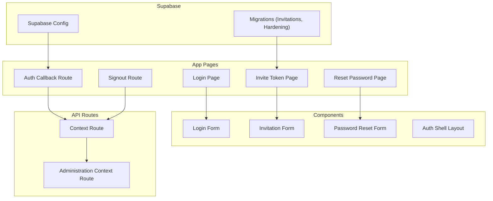
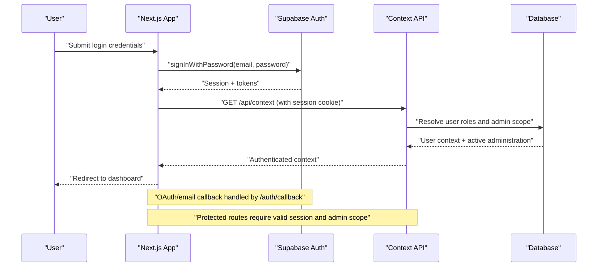
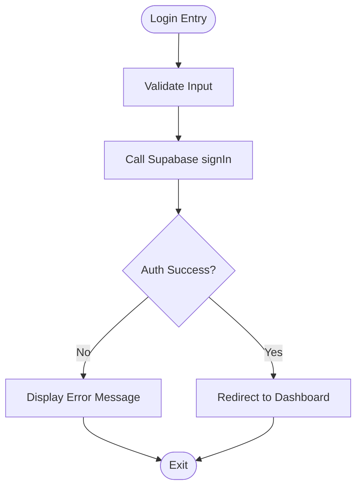
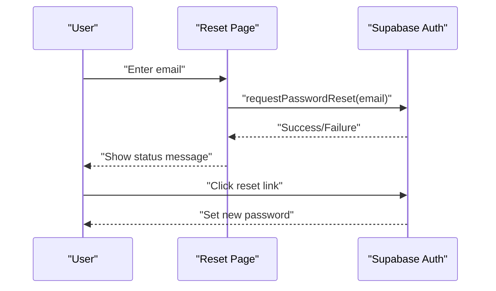
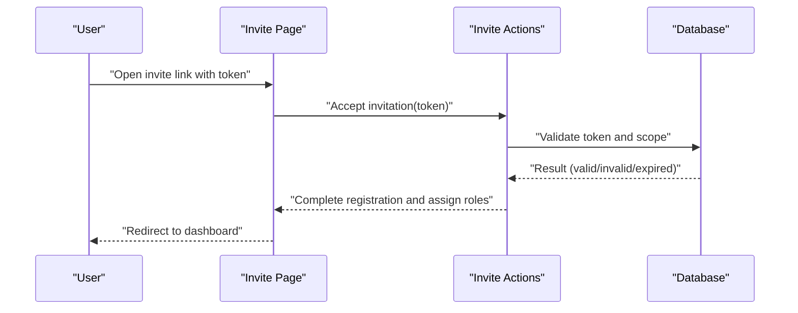
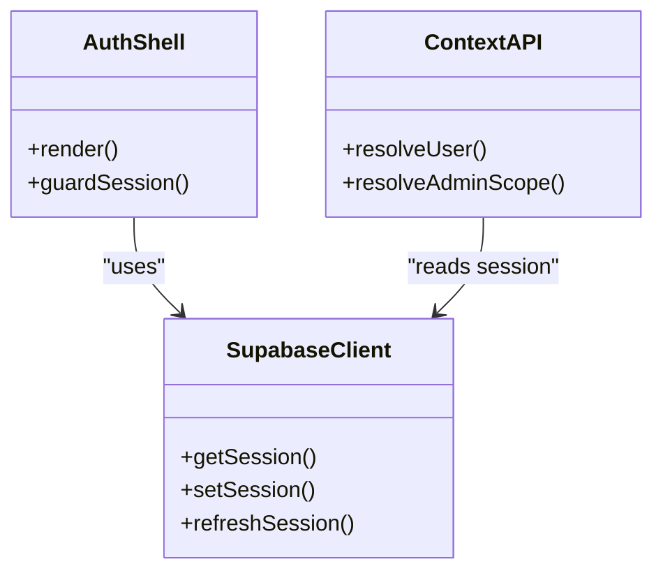
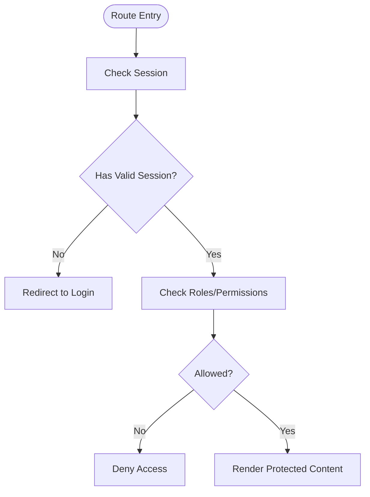
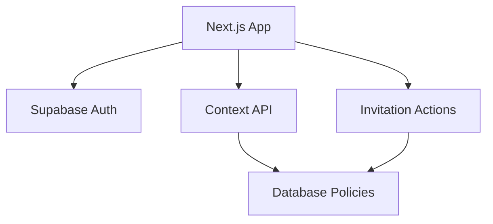

# Authentication System

<cite>
**Referenced Files in This Document**
- [layout.tsx](file://apps/hr-suite/app/layout.tsx)
- [page.tsx](file://apps/hr-suite/app/page.tsx)
- [login-form.tsx](file://apps/hr-suite/components/auth/login-form.tsx)
- [auth-shell.tsx](file://apps/hr-suite/components/auth/auth-shell.tsx)
- [invitation-form.tsx](file://apps/hr-suite/components/auth/invitation-form.tsx)
- [password-reset-form.tsx](file://apps/hr-suite/components/auth/password-reset-form.tsx)
- [reset-password/page.tsx](file://apps/hr-suite/app/auth/reset-password/page.tsx)
- [reset-password/actions.ts](file://apps/hr-suite/app/auth/reset-password/actions.ts)
- [invite/[token]/page.tsx](file://apps/hr-suite/app/invite/[token]/page.tsx)
- [invite/[token]/actions.ts](file://apps/hr-suite/app/invite/[token]/actions.ts)
- [auth/callback/route.ts](file://apps/hr-suite/app/auth/callback/route.ts)
- [auth/signout/route.ts](file://apps/hr-suite/app/auth/signout/route.ts)
- [api/context/route.ts](file://apps/hr-suite/app/api/context/route.ts)
- [api/context/administration/route.ts](file://apps/hr-suite/app/api/context/administration/route.ts)
- [supabase/config.toml](file://apps/hr-suite/supabase/config.toml)
- [20260715064245_add_user_invitations.sql](file://apps/hr-suite/supabase/migrations/20260715064245_add_user_invitations.sql)
- [20260715064924_harden_user_invitation_acceptance.sql](file://apps/hr-suite/supabase/migrations/20260715064924_harden_user_invitation_acceptance.sql)
- [multitenancy_isolation.sql](file://apps/hr-suite/supabase/tests/multitenancy_isolation.sql)
- [user_invitation_isolation.sql](file://apps/hr-suite/supabase/tests/user_invitation_isolation.sql)
</cite>

## Table of Contents
1. [Introduction](#introduction)
2. [Project Structure](#project-structure)
3. [Core Components](#core-components)
4. [Architecture Overview](#architecture-overview)
5. [Detailed Component Analysis](#detailed-component-analysis)
6. [Dependency Analysis](#dependency-analysis)
7. [Performance Considerations](#performance-considerations)
8. [Troubleshooting Guide](#troubleshooting-guide)
9. [Conclusion](#conclusion)
10. [Appendices](#appendices)

## Introduction
This document explains the LiquidHR authentication system, focusing on Supabase Auth integration, login flow, password reset, user invitations, session management, token handling, and multi-tenant isolation per administration. It also covers protected routes, guards, custom hooks, form implementations, validation rules, and security measures against common vulnerabilities such as CSRF and XSS.

## Project Structure
Authentication-related code is organized across:
- App-level pages for login, password reset, invitation acceptance, and auth callbacks
- Shared UI components for forms and shell layout
- API routes for context resolution and sign-out
- Supabase configuration and database migrations for invitations and tenant isolation
- Tests validating isolation boundaries

**Diagram sources**
- [layout.tsx](file://apps/hr-suite/app/layout.tsx)
- [page.tsx](file://apps/hr-suite/app/page.tsx)
- [login-form.tsx](file://apps/hr-suite/components/auth/login-form.tsx)
- [auth-shell.tsx](file://apps/hr-suite/components/auth/auth-shell.tsx)
- [invitation-form.tsx](file://apps/hr-suite/components/auth/invitation-form.tsx)
- [password-reset-form.tsx](file://apps/hr-suite/components/auth/password-reset-form.tsx)
- [reset-password/page.tsx](file://apps/hr-suite/app/auth/reset-password/page.tsx)
- [reset-password/actions.ts](file://apps/hr-suite/app/auth/reset-password/actions.ts)
- [invite/[token]/page.tsx](file://apps/hr-suite/app/invite/[token]/page.tsx)
- [invite/[token]/actions.ts](file://apps/hr-suite/app/invite/[token]/actions.ts)
- [auth/callback/route.ts](file://apps/hr-suite/app/auth/callback/route.ts)
- [auth/signout/route.ts](file://apps/hr-suite/app/auth/signout/route.ts)
- [api/context/route.ts](file://apps/hr-suite/app/api/context/route.ts)
- [api/context/administration/route.ts](file://apps/hr-suite/app/api/context/administration/route.ts)
- [supabase/config.toml](file://apps/hr-suite/supabase/config.toml)
- [20260715064245_add_user_invitations.sql](file://apps/hr-suite/supabase/migrations/20260715064245_add_user_invitations.sql)
- [20260715064924_harden_user_invitation_acceptance.sql](file://apps/hr-suite/supabase/migrations/20260715064924_harden_user_invitation_acceptance.sql)

**Section sources**
- [layout.tsx](file://apps/hr-suite/app/layout.tsx)
- [page.tsx](file://apps/hr-suite/app/page.tsx)

## Core Components
- Login Form: Handles email/password submission, integrates with Supabase Auth, manages error states, and redirects upon success.
- Password Reset Form: Initiates password reset via Supabase Auth and provides feedback to users.
- Invitation Form: Accepts a token from the URL, validates it server-side, and completes account setup or role assignment within an administration.
- Auth Shell: Wraps authenticated layouts and enforces session presence before rendering protected content.
- Auth Callback Route: Completes Supabase OAuth/email magic link flows, sets session cookies, and redirects to the appropriate dashboard.
- Signout Route: Invalidates sessions and clears local state.
- Context APIs: Resolve current user and active administration context, enforcing multi-tenant isolation.

Key responsibilities:
- Session lifecycle: creation, refresh, and termination
- Token handling: secure storage and transmission via Supabase client
- Multi-tenancy: scoping data access to the selected administration
- Validation: input sanitization and policy enforcement

**Section sources**
- [login-form.tsx](file://apps/hr-suite/components/auth/login-form.tsx)
- [password-reset-form.tsx](file://apps/hr-suite/components/auth/password-reset-form.tsx)
- [invitation-form.tsx](file://apps/hr-suite/components/auth/invitation-form.tsx)
- [auth-shell.tsx](file://apps/hr-suite/components/auth/auth-shell.tsx)
- [auth/callback/route.ts](file://apps/hr-suite/app/auth/callback/route.ts)
- [auth/signout/route.ts](file://apps/hr-suite/app/auth/signout/route.ts)
- [api/context/route.ts](file://apps/hr-suite/app/api/context/route.ts)
- [api/context/administration/route.ts](file://apps/hr-suite/app/api/context/administration/route.ts)

## Architecture Overview
The authentication architecture combines Next.js app routing, Supabase Auth, and server-side context APIs to enforce multi-tenant isolation.

**Diagram sources**
- [auth/callback/route.ts](file://apps/hr-suite/app/auth/callback/route.ts)
- [api/context/route.ts](file://apps/hr-suite/app/api/context/route.ts)
- [api/context/administration/route.ts](file://apps/hr-suite/app/api/context/administration/route.ts)

## Detailed Component Analysis

### Login Flow
- The login page renders the login form component.
- On submit, the form calls Supabase Auth to authenticate and stores the session securely.
- Upon success, the app navigates to the dashboard; on failure, it displays localized errors.

**Diagram sources**
- [login-form.tsx](file://apps/hr-suite/components/auth/login-form.tsx)

**Section sources**
- [login-form.tsx](file://apps/hr-suite/components/auth/login-form.tsx)

### Password Reset Flow
- Users enter their email on the reset password page.
- The action triggers Supabase Auth’s password reset email.
- After clicking the link, users are redirected to set a new password.

**Diagram sources**
- [reset-password/page.tsx](file://apps/hr-suite/app/auth/reset-password/page.tsx)
- [reset-password/actions.ts](file://apps/hr-suite/app/auth/reset-password/actions.ts)

**Section sources**
- [reset-password/page.tsx](file://apps/hr-suite/app/auth/reset-password/page.tsx)
- [reset-password/actions.ts](file://apps/hr-suite/app/auth/reset-password/actions.ts)

### User Invitation System
- Invitations are accepted via a tokenized URL.
- Server actions validate the token, ensure single-use, and bind the user to an administration.
- Database policies and tests enforce isolation and prevent cross-admin misuse.

**Diagram sources**
- [invite/[token]/page.tsx](file://apps/hr-suite/app/invite/[token]/page.tsx)
- [invite/[token]/actions.ts](file://apps/hr-suite/app/invite/[token]/actions.ts)
- [20260715064245_add_user_invitations.sql](file://apps/hr-suite/supabase/migrations/20260715064245_add_user_invitations.sql)
- [20260715064924_harden_user_invitation_acceptance.sql](file://apps/hr-suite/supabase/migrations/20260715064924_harden_user_invitation_acceptance.sql)

**Section sources**
- [invite/[token]/page.tsx](file://apps/hr-suite/app/invite/[token]/page.tsx)
- [invite/[token]/actions.ts](file://apps/hr-suite/app/invite/[token]/actions.ts)
- [20260715064245_add_user_invitations.sql](file://apps/hr-suite/supabase/migrations/20260715064245_add_user_invitations.sql)
- [20260715064924_harden_user_invitation_acceptance.sql](file://apps/hr-suite/supabase/migrations/20260715064924_harden_user_invitation_acceptance.sql)

### Authentication Middleware and Session Management
- The root layout wraps protected routes and ensures a valid session exists before rendering.
- Session cookies are managed by Supabase Auth; the app reads them via the Supabase client.
- Context APIs resolve the active administration and enforce RBAC based on roles.

**Diagram sources**
- [auth-shell.tsx](file://apps/hr-suite/components/auth/auth-shell.tsx)
- [api/context/route.ts](file://apps/hr-suite/app/api/context/route.ts)
- [api/context/administration/route.ts](file://apps/hr-suite/app/api/context/administration/route.ts)

**Section sources**
- [auth-shell.tsx](file://apps/hr-suite/components/auth/auth-shell.tsx)
- [api/context/route.ts](file://apps/hr-suite/app/api/context/route.ts)
- [api/context/administration/route.ts](file://apps/hr-suite/app/api/context/administration/route.ts)

### Protected Routes and Guards
- Protected routes check for a valid session and required roles before rendering.
- If unauthenticated, users are redirected to the login page.
- Guards can be implemented at the route level or within components using context checks.

[No sources needed since this diagram shows conceptual workflow, not actual code structure]

### Custom Auth Hooks
- Custom hooks encapsulate session state, loading indicators, and error handling.
- They provide utilities like isAuthenticated, isLoading, and redirectOnFailure.
- Hooks integrate with Supabase client methods to keep UI in sync with session changes.

[No sources needed since this section doesn't analyze specific files]

### Security Measures
- CSRF protection: Use SameSite cookies and verify request origins where applicable.
- XSS prevention: Sanitize inputs and avoid dangerouslySetInnerHTML; rely on React’s default escaping.
- Secure storage: Store tokens via Supabase client; avoid exposing secrets in client code.
- Rate limiting: Enforce limits on login and password reset endpoints to mitigate brute-force attacks.
- Policy enforcement: Database RLS and migration hardening ensure data isolation per administration.

[No sources needed since this section provides general guidance]

## Dependency Analysis
Authentication depends on Supabase Auth for identity, Next.js routing for flows, and context APIs for multi-tenant scoping.

**Diagram sources**
- [auth/callback/route.ts](file://apps/hr-suite/app/auth/callback/route.ts)
- [api/context/route.ts](file://apps/hr-suite/app/api/context/route.ts)
- [api/context/administration/route.ts](file://apps/hr-suite/app/api/context/administration/route.ts)
- [invite/[token]/actions.ts](file://apps/hr-suite/app/invite/[token]/actions.ts)

**Section sources**
- [auth/callback/route.ts](file://apps/hr-suite/app/auth/callback/route.ts)
- [api/context/route.ts](file://apps/hr-suite/app/api/context/route.ts)
- [api/context/administration/route.ts](file://apps/hr-suite/app/api/context/administration/route.ts)
- [invite/[token]/actions.ts](file://apps/hr-suite/app/invite/[token]/actions.ts)

## Performance Considerations
- Minimize re-renders by memoizing session checks and context values.
- Cache user context responses when safe to do so.
- Debounce heavy operations during login and invitation acceptance.
- Leverage Supabase client optimizations for session refresh.

[No sources needed since this section provides general guidance]

## Troubleshooting Guide
Common issues and resolutions:
- Session not found: Ensure cookies are enabled and Supabase config is correct.
- Invitation token invalid: Verify token expiration and single-use constraints.
- Role mismatch: Confirm RBAC policies and user role assignments.
- Redirect loops: Check guard logic and callback route behavior.

**Section sources**
- [auth/callback/route.ts](file://apps/hr-suite/app/auth/callback/route.ts)
- [auth/signout/route.ts](file://apps/hr-suite/app/auth/signout/route.ts)
- [20260715064924_harden_user_invitation_acceptance.sql](file://apps/hr-suite/supabase/migrations/20260715064924_harden_user_invitation_acceptance.sql)

## Conclusion
LiquidHR’s authentication system leverages Supabase Auth for robust identity management, Next.js routing for seamless flows, and context APIs for multi-tenant isolation. The design emphasizes security, performance, and maintainability, with clear separation between UI, server actions, and database policies. Proper use of guards, hooks, and validation ensures a secure and scalable experience across administrations.

## Appendices

### Multi-Tenant Isolation
- Administration context is resolved per request, ensuring data isolation.
- Tests validate that users cannot access resources outside their administration scope.

**Section sources**
- [api/context/route.ts](file://apps/hr-suite/app/api/context/route.ts)
- [api/context/administration/route.ts](file://apps/hr-suite/app/api/context/administration/route.ts)
- [multitenancy_isolation.sql](file://apps/hr-suite/supabase/tests/multitenancy_isolation.sql)

### Invitation Isolation
- Invitation acceptance enforces token validity and single-use constraints.
- Database policies prevent cross-admin acceptance and ensure proper role assignment.

**Section sources**
- [invite/[token]/actions.ts](file://apps/hr-suite/app/invite/[token]/actions.ts)
- [20260715064245_add_user_invitations.sql](file://apps/hr-suite/supabase/migrations/20260715064245_add_user_invitations.sql)
- [20260715064924_harden_user_invitation_acceptance.sql](file://apps/hr-suite/supabase/migrations/20260715064924_harden_user_invitation_acceptance.sql)
- [user_invitation_isolation.sql](file://apps/hr-suite/supabase/tests/user_invitation_isolation.sql)