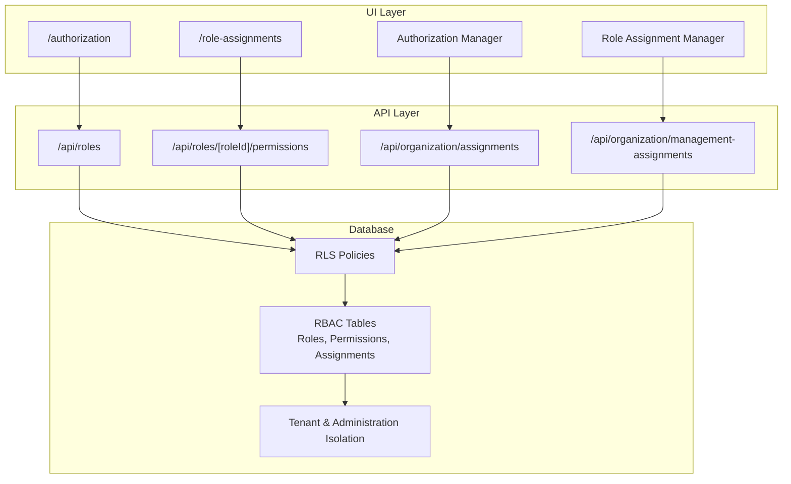
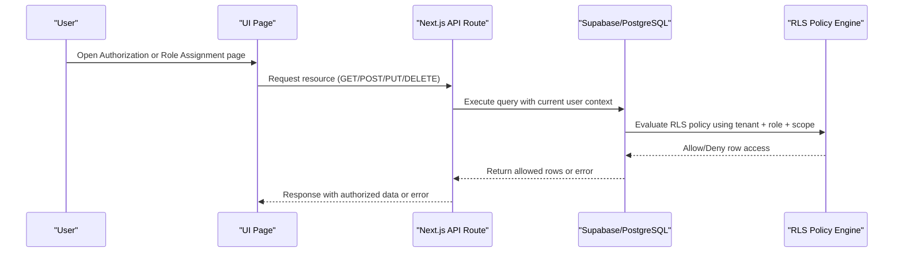
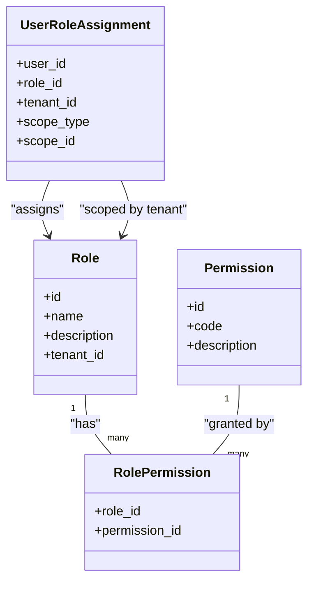
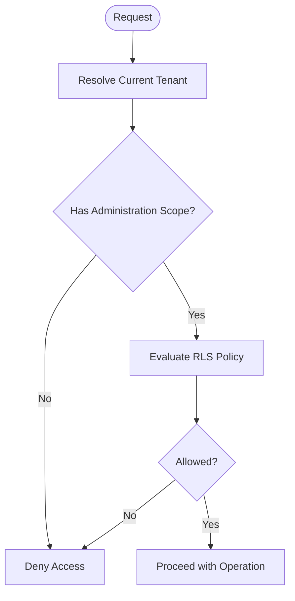
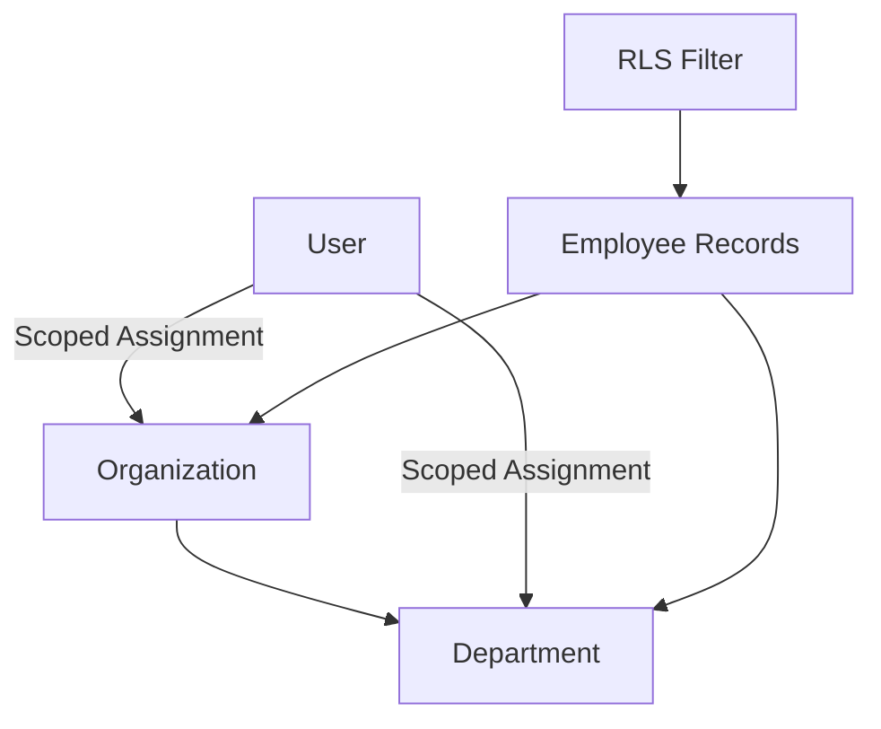
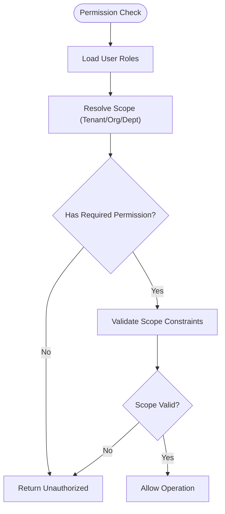
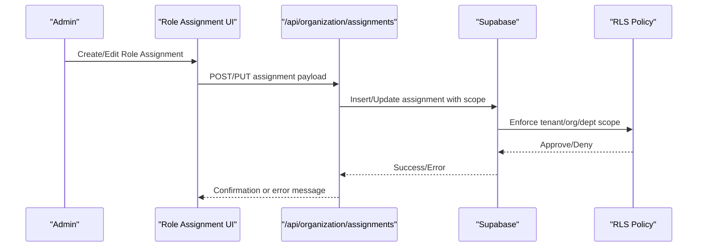
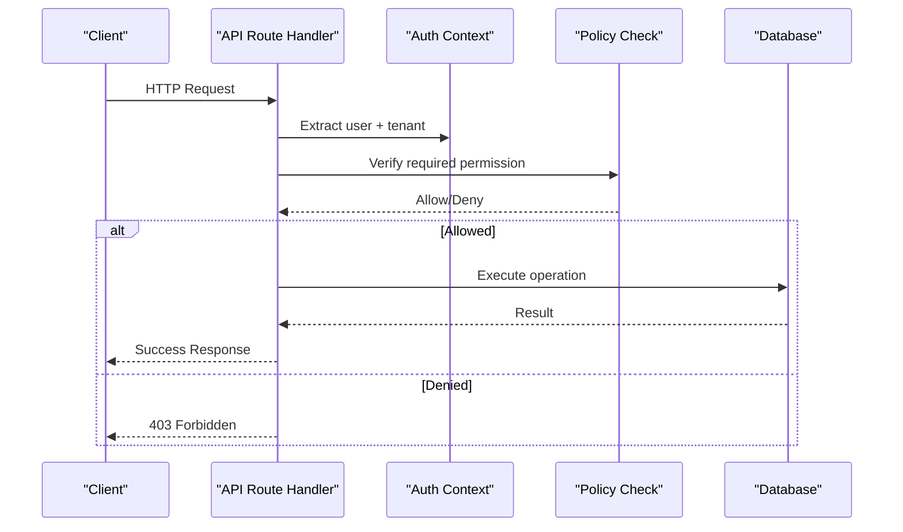
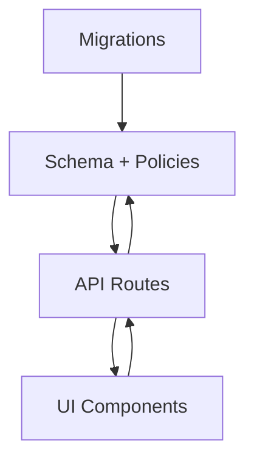

# Authorization Framework

<cite>
**Referenced Files in This Document**
- [20260712124911_add_tenant_rbac_and_organization.sql](file://apps/hr-suite/supabase/migrations/20260712124911_add_tenant_rbac_and_organization.sql)
- [20260712125522_optimize_rbac_indexes_and_policies.sql](file://apps/hr-suite/supabase/migrations/20260712125522_optimize_rbac_indexes_and_policies.sql)
- [20260714170949_harden_organization_authorization.sql](file://apps/hr-suite/supabase/migrations/20260714170949_harden_organization_authorization.sql)
- [20260714180142_enforce_administration_management_scope.sql](file://apps/hr-suite/supabase/migrations/20260714180142_enforce_administration_management_scope.sql)
- [20260715131230_seed_custom_fields_and_tenant_roles.sql](file://apps/hr-suite/supabase/migrations/20260715131230_seed_custom_fields_and_tenant_roles.sql)
- [20260718130000_add_hr_calendar_permission.sql](file://apps/hr-suite/supabase/migrations/20260718130000_add_hr_calendar_permission.sql)
- [20260724112407_add_role_assignment_scope.sql](file://apps/hr-suite/supabase/migrations/20260724112407_add_role_assignment_scope.sql)
- [authorization-manager.tsx](file://apps/hr-suite/components/organization/authorization-manager.tsx)
- [role-assignment-manager.tsx](file://apps/hr-suite/components/organization/role-assignment-manager.tsx)
- [route.ts (roles)](file://apps/hr-suite/app/api/roles/route.ts)
- [route.ts (roles/[roleId]/permissions)](file://apps/hr-suite/app/api/roles/[roleId]/permissions/route.ts)
- [route.ts (organization/assignments)](file://apps/hr-suite/app/api/organization/assignments/route.ts)
- [route.ts (organization/management-assignments)](file://apps/hr-suite/app/api/organization/management-assignments/route.ts)
- [page.tsx (authorization)](file://apps/hr-suite/app/(dashboard)/authorization/page.tsx)
- [page.tsx (role-assignments)](file://apps/hr-suite/app/(dashboard)/role-assignments/page.tsx)
- [multitenancy_isolation.sql](file://apps/hr-suite/supabase/tests/multitenancy_isolation.sql)
- [organization_authorization_management.sql](file://apps/hr-suite/supabase/tests/organization_authorization_management.sql)
</cite>

## Table of Contents
1. Introduction
2. Project Structure
3. Core Components
4. Architecture Overview
5. Detailed Component Analysis
6. Dependency Analysis
7. Performance Considerations
8. Troubleshooting Guide
9. Conclusion

## Introduction
This document explains LiquidHR’s authorization framework, focusing on role-based access control (RBAC), permission hierarchy, tenant isolation, and Row Level Security (RLS). It covers database-level policies, application-level checks, organization-scoped permissions, department-based access control, dynamic permission evaluation, role assignment workflows, permission inheritance, and audit logging for authorization events.

## Project Structure
Authorization spans multiple layers:
- Database layer: RLS policies and RBAC tables defined in migrations.
- API layer: Next.js route handlers that enforce permissions before business logic.
- UI layer: Pages and components for managing roles, permissions, and assignments.

**Diagram sources**
- [20260712124911_add_tenant_rbac_and_organization.sql](file://apps/hr-suite/supabase/migrations/20260712124911_add_tenant_rbac_and_organization.sql)
- [20260712125522_optimize_rbac_indexes_and_policies.sql](file://apps/hr-suite/supabase/migrations/20260712125522_optimize_rbac_indexes_and_policies.sql)
- [20260714170949_harden_organization_authorization.sql](file://apps/hr-suite/supabase/migrations/20260714170949_harden_organization_authorization.sql)
- [20260714180142_enforce_administration_management_scope.sql](file://apps/hr-suite/supabase/migrations/20260714180142_enforce_administration_management_scope.sql)
- [20260718130000_add_hr_calendar_permission.sql](file://apps/hr-suite/supabase/migrations/20260718130000_add_hr_calendar_permission.sql)
- [20260724112407_add_role_assignment_scope.sql](file://apps/hr-suite/supabase/migrations/20260724112407_add_role_assignment_scope.sql)
- [route.ts (roles)](file://apps/hr-suite/app/api/roles/route.ts)
- [route.ts (roles/[roleId]/permissions)](file://apps/hr-suite/app/api/roles/[roleId]/permissions/route.ts)
- [route.ts (organization/assignments)](file://apps/hr-suite/app/api/organization/assignments/route.ts)
- [route.ts (organization/management-assignments)](file://apps/hr-suite/app/api/organization/management-assignments/route.ts)
- [page.tsx (authorization)](file://apps/hr-suite/app/(dashboard)/authorization/page.tsx)
- [page.tsx (role-assignments)](file://apps/hr-suite/app/(dashboard)/role-assignments/page.tsx)

**Section sources**
- [20260712124911_add_tenant_rbac_and_organization.sql](file://apps/hr-suite/supabase/migrations/20260712124911_add_tenant_rbac_and_organization.sql)
- [20260712125522_optimize_rbac_indexes_and_policies.sql](file://apps/hr-suite/supabase/migrations/20260712125522_optimize_rbac_indexes_and_policies.sql)
- [20260714170949_harden_organization_authorization.sql](file://apps/hr-suite/supabase/migrations/20260714170949_harden_organization_authorization.sql)
- [20260714180142_enforce_administration_management_scope.sql](file://apps/hr-suite/supabase/migrations/20260714180142_enforce_administration_management_scope.sql)
- [20260718130000_add_hr_calendar_permission.sql](file://apps/hr-suite/supabase/migrations/20260718130000_add_hr_calendar_permission.sql)
- [20260724112407_add_role_assignment_scope.sql](file://apps/hr-suite/supabase/migrations/20260724112407_add_role_assignment_scope.sql)
- [route.ts (roles)](file://apps/hr-suite/app/api/roles/route.ts)
- [route.ts (roles/[roleId]/permissions)](file://apps/hr-suite/app/api/roles/[roleId]/permissions/route.ts)
- [route.ts (organization/assignments)](file://apps/hr-suite/app/api/organization/assignments/route.ts)
- [route.ts (organization/management-assignments)](file://apps/hr-suite/app/api/organization/management-assignments/route.ts)
- [page.tsx (authorization)](file://apps/hr-suite/app/(dashboard)/authorization/page.tsx)
- [page.tsx (role-assignments)](file://apps/hr-suite/app/(dashboard)/role-assignments/page.tsx)

## Core Components
- RBAC model: Roles, permissions, and role-to-user assignments scoped to tenants and organizations.
- RLS policies: Enforce per-tenant isolation and row-level visibility based on user roles and scopes.
- API authorization: Route handlers validate permissions before executing operations.
- UI management: Pages and components for assigning roles, configuring permissions, and viewing authorization status.

Key responsibilities:
- Database migrations define the schema, indexes, and RLS policies.
- API routes implement explicit permission checks and scope enforcement.
- UI components provide administrative interfaces for role and permission management.

**Section sources**
- [20260712124911_add_tenant_rbac_and_organization.sql](file://apps/hr-suite/supabase/migrations/20260712124911_add_tenant_rbac_and_organization.sql)
- [20260712125522_optimize_rbac_indexes_and_policies.sql](file://apps/hr-suite/supabase/migrations/20260712125522_optimize_rbac_indexes_and_policies.sql)
- [20260714170949_harden_organization_authorization.sql](file://apps/hr-suite/supabase/migrations/20260714170949_harden_organization_authorization.sql)
- [20260714180142_enforce_administration_management_scope.sql](file://apps/hr-suite/supabase/migrations/20260714180142_enforce_administration_management_scope.sql)
- [20260718130000_add_hr_calendar_permission.sql](file://apps/hr-suite/supabase/migrations/20260718130000_add_hr_calendar_permission.sql)
- [20260724112407_add_role_assignment_scope.sql](file://apps/hr-suite/supabase/migrations/20260724112407_add_role_assignment_scope.sql)
- [route.ts (roles)](file://apps/hr-suite/app/api/roles/route.ts)
- [route.ts (roles/[roleId]/permissions)](file://apps/hr-suite/app/api/roles/[roleId]/permissions/route.ts)
- [route.ts (organization/assignments)](file://apps/hr-suite/app/api/organization/assignments/route.ts)
- [route.ts (organization/management-assignments)](file://apps/hr-suite/app/api/organization/management-assignments/route.ts)
- [page.tsx (authorization)](file://apps/hr-suite/app/(dashboard)/authorization/page.tsx)
- [page.tsx (role-assignments)](file://apps/hr-suite/app/(dashboard)/role-assignments/page.tsx)

## Architecture Overview
The authorization architecture enforces security at three layers:
- Database: RLS policies restrict data access by tenant and role scope.
- API: Permission checks guard endpoints and ensure correct scope.
- UI: Administrative tools manage roles, permissions, and assignments with feedback.

**Diagram sources**
- [20260712124911_add_tenant_rbac_and_organization.sql](file://apps/hr-suite/supabase/migrations/20260712124911_add_tenant_rbac_and_organization.sql)
- [20260712125522_optimize_rbac_indexes_and_policies.sql](file://apps/hr-suite/supabase/migrations/20260712125522_optimize_rbac_indexes_and_policies.sql)
- [20260714170949_harden_organization_authorization.sql](file://apps/hr-suite/supabase/migrations/20260714170949_harden_organization_authorization.sql)
- [20260714180142_enforce_administration_management_scope.sql](file://apps/hr-suite/supabase/migrations/20260714180142_enforce_administration_management_scope.sql)
- [20260718130000_add_hr_calendar_permission.sql](file://apps/hr-suite/supabase/migrations/20260718130000_add_hr_calendar_permission.sql)
- [20260724112407_add_role_assignment_scope.sql](file://apps/hr-suite/supabase/migrations/20260724112407_add_role_assignment_scope.sql)
- [route.ts (roles)](file://apps/hr-suite/app/api/roles/route.ts)
- [route.ts (roles/[roleId]/permissions)](file://apps/hr-suite/app/api/roles/[roleId]/permissions/route.ts)
- [route.ts (organization/assignments)](file://apps/hr-suite/app/api/organization/assignments/route.ts)
- [route.ts (organization/management-assignments)](file://apps/hr-suite/app/api/organization/management-assignments/route.ts)

## Detailed Component Analysis

### RBAC Model and Permission Hierarchy
- Roles encapsulate sets of permissions.
- Users are assigned roles within a tenant and optionally scoped to an organization or department.
- Permission hierarchy allows base roles to inherit extended capabilities via additional role assignments.
- Tenant isolation ensures users cannot access data outside their tenant unless explicitly granted.

**Diagram sources**
- [20260712124911_add_tenant_rbac_and_organization.sql](file://apps/hr-suite/supabase/migrations/20260712124911_add_tenant_rbac_and_organization.sql)
- [20260712125522_optimize_rbac_indexes_and_policies.sql](file://apps/hr-suite/supabase/migrations/20260712125522_optimize_rbac_indexes_and_policies.sql)
- [20260724112407_add_role_assignment_scope.sql](file://apps/hr-suite/supabase/migrations/20260724112407_add_role_assignment_scope.sql)

**Section sources**
- [20260712124911_add_tenant_rbac_and_organization.sql](file://apps/hr-suite/supabase/migrations/20260712124911_add_tenant_rbac_and_organization.sql)
- [20260712125522_optimize_rbac_indexes_and_policies.sql](file://apps/hr-suite/supabase/migrations/20260712125522_optimize_rbac_indexes_and_policies.sql)
- [20260724112407_add_role_assignment_scope.sql](file://apps/hr-suite/supabase/migrations/20260724112407_add_role_assignment_scope.sql)

### Tenant Isolation and Administration Scope
- Each tenant is isolated; users can only see data belonging to their tenant.
- Administrations define management boundaries within a tenant, enabling multi-admin scenarios.
- RLS policies enforce tenant and administration scoping on all sensitive tables.

**Diagram sources**
- [20260714180142_enforce_administration_management_scope.sql](file://apps/hr-suite/supabase/migrations/20260714180142_enforce_administration_management_scope.sql)
- [20260714170949_harden_organization_authorization.sql](file://apps/hr-suite/supabase/migrations/20260714170949_harden_organization_authorization.sql)

**Section sources**
- [20260714180142_enforce_administration_management_scope.sql](file://apps/hr-suite/supabase/migrations/20260714180142_enforce_administration_management_scope.sql)
- [20260714170949_harden_organization_authorization.sql](file://apps/hr-suite/supabase/migrations/20260714170949_harden_organization_authorization.sql)

### Organization Structure and Department-Based Access Control
- Organizations and departments structure HR data.
- Role assignments can be scoped to specific organizations or departments.
- RLS policies filter rows based on the user’s organizational scope.

**Diagram sources**
- [20260712124911_add_tenant_rbac_and_organization.sql](file://apps/hr-suite/supabase/migrations/20260712124911_add_tenant_rbac_and_organization.sql)
- [20260724112407_add_role_assignment_scope.sql](file://apps/hr-suite/supabase/migrations/20260724112407_add_role_assignment_scope.sql)

**Section sources**
- [20260712124911_add_tenant_rbac_and_organization.sql](file://apps/hr-suite/supabase/migrations/20260712124911_add_tenant_rbac_and_organization.sql)
- [20260724112407_add_role_assignment_scope.sql](file://apps/hr-suite/supabase/migrations/20260724112407_add_role_assignment_scope.sql)

### Dynamic Permission Evaluation
- Permission checks combine:
  - User’s roles and assigned permissions.
  - Scope constraints (tenant, organization, department).
  - Feature-specific permissions (e.g., HR calendar).
- API routes perform explicit checks before executing mutations.

**Diagram sources**
- [20260718130000_add_hr_calendar_permission.sql](file://apps/hr-suite/supabase/migrations/20260718130000_add_hr_calendar_permission.sql)
- [route.ts (roles)](file://apps/hr-suite/app/api/roles/route.ts)
- [route.ts (roles/[roleId]/permissions)](file://apps/hr-suite/app/api/roles/[roleId]/permissions/route.ts)
- [route.ts (organization/assignments)](file://apps/hr-suite/app/api/organization/assignments/route.ts)
- [route.ts (organization/management-assignments)](file://apps/hr-suite/app/api/organization/management-assignments/route.ts)

**Section sources**
- [20260718130000_add_hr_calendar_permission.sql](file://apps/hr-suite/supabase/migrations/20260718130000_add_hr_calendar_permission.sql)
- [route.ts (roles)](file://apps/hr-suite/app/api/roles/route.ts)
- [route.ts (roles/[roleId]/permissions)](file://apps/hr-suite/app/api/roles/[roleId]/permissions/route.ts)
- [route.ts (organization/assignments)](file://apps/hr-suite/app/api/organization/assignments/route.ts)
- [route.ts (organization/management-assignments)](file://apps/hr-suite/app/api/organization/management-assignments/route.ts)

### Role Assignment Workflow
- Administrators assign roles to users through UI components and API endpoints.
- Assignments include scope metadata (tenant, organization, department).
- The system validates permissions and updates role assignments atomically.

**Diagram sources**
- [route.ts (organization/assignments)](file://apps/hr-suite/app/api/organization/assignments/route.ts)
- [20260724112407_add_role_assignment_scope.sql](file://apps/hr-suite/supabase/migrations/20260724112407_add_role_assignment_scope.sql)

**Section sources**
- [route.ts (organization/assignments)](file://apps/hr-suite/app/api/organization/assignments/route.ts)
- [20260724112407_add_role_assignment_scope.sql](file://apps/hr-suite/supabase/migrations/20260724112407_add_role_assignment_scope.sql)

### Permission Checking Functions and Middleware
- API routes implement explicit permission checks before processing requests.
- Checks consider feature flags (e.g., HR calendar permission) and scope constraints.
- Errors are returned consistently when authorization fails.

**Diagram sources**
- [route.ts (roles)](file://apps/hr-suite/app/api/roles/route.ts)
- [route.ts (roles/[roleId]/permissions)](file://apps/hr-suite/app/api/roles/[roleId]/permissions/route.ts)
- [route.ts (organization/assignments)](file://apps/hr-suite/app/api/organization/assignments/route.ts)
- [route.ts (organization/management-assignments)](file://apps/hr-suite/app/api/organization/management-assignments/route.ts)

**Section sources**
- [route.ts (roles)](file://apps/hr-suite/app/api/roles/route.ts)
- [route.ts (roles/[roleId]/permissions)](file://apps/hr-suite/app/api/roles/[roleId]/permissions/route.ts)
- [route.ts (organization/assignments)](file://apps/hr-suite/app/api/organization/assignments/route.ts)
- [route.ts (organization/management-assignments)](file://apps/hr-suite/app/api/organization/management-assignments/route.ts)

### Audit Logging for Authorization Events
- Authorization-related actions should be logged for compliance and auditing.
- Logs capture user identity, action type, target resource, and outcome.
- Ensure logs are stored securely and accessible only to authorized administrators.

[No sources needed since this section provides general guidance]

## Dependency Analysis
RBAC and RLS dependencies:
- Migrations establish tables, indexes, and policies.
- API routes depend on RBAC tables and RLS policies.
- UI components depend on API endpoints for role and permission management.

**Diagram sources**
- [20260712124911_add_tenant_rbac_and_organization.sql](file://apps/hr-suite/supabase/migrations/20260712124911_add_tenant_rbac_and_organization.sql)
- [20260712125522_optimize_rbac_indexes_and_policies.sql](file://apps/hr-suite/supabase/migrations/20260712125522_optimize_rbac_indexes_and_policies.sql)
- [20260714170949_harden_organization_authorization.sql](file://apps/hr-suite/supabase/migrations/20260714170949_harden_organization_authorization.sql)
- [20260714180142_enforce_administration_management_scope.sql](file://apps/hr-suite/supabase/migrations/20260714180142_enforce_administration_management_scope.sql)
- [20260718130000_add_hr_calendar_permission.sql](file://apps/hr-suite/supabase/migrations/20260718130000_add_hr_calendar_permission.sql)
- [20260724112407_add_role_assignment_scope.sql](file://apps/hr-suite/supabase/migrations/20260724112407_add_role_assignment_scope.sql)
- [route.ts (roles)](file://apps/hr-suite/app/api/roles/route.ts)
- [route.ts (roles/[roleId]/permissions)](file://apps/hr-suite/app/api/roles/[roleId]/permissions/route.ts)
- [route.ts (organization/assignments)](file://apps/hr-suite/app/api/organization/assignments/route.ts)
- [route.ts (organization/management-assignments)](file://apps/hr-suite/app/api/organization/management-assignments/route.ts)

**Section sources**
- [20260712124911_add_tenant_rbac_and_organization.sql](file://apps/hr-suite/supabase/migrations/20260712124911_add_tenant_rbac_and_organization.sql)
- [20260712125522_optimize_rbac_indexes_and_policies.sql](file://apps/hr-suite/supabase/migrations/20260712125522_optimize_rbac_indexes_and_policies.sql)
- [20260714170949_harden_organization_authorization.sql](file://apps/hr-suite/supabase/migrations/20260714170949_harden_organization_authorization.sql)
- [20260714180142_enforce_administration_management_scope.sql](file://apps/hr-suite/supabase/migrations/20260714180142_enforce_administration_management_scope.sql)
- [20260718130000_add_hr_calendar_permission.sql](file://apps/hr-suite/supabase/migrations/20260718130000_add_hr_calendar_permission.sql)
- [20260724112407_add_role_assignment_scope.sql](file://apps/hr-suite/supabase/migrations/20260724112407_add_role_assignment_scope.sql)
- [route.ts (roles)](file://apps/hr-suite/app/api/roles/route.ts)
- [route.ts (roles/[roleId]/permissions)](file://apps/hr-suite/app/api/roles/[roleId]/permissions/route.ts)
- [route.ts (organization/assignments)](file://apps/hr-suite/app/api/organization/assignments/route.ts)
- [route.ts (organization/management-assignments)](file://apps/hr-suite/app/api/organization/management-assignments/route.ts)

## Performance Considerations
- Indexes on RBAC tables and foreign keys improve lookup performance for role assignments and permission checks.
- RLS policies should leverage indexed columns to minimize full table scans.
- Avoid excessive nested queries in permission checks; prefer set-based operations where possible.

[No sources needed since this section provides general guidance]

## Troubleshooting Guide
Common issues and resolutions:
- Tenant isolation failures: Verify current tenant resolution and RLS policies.
- Missing permissions: Confirm role assignments and permission codes.
- Scope violations: Ensure organization/department scoping matches requested resources.
- API errors: Inspect route handler logs and error responses for authorization denials.

Use tests to validate behavior:
- Multitenancy isolation tests confirm tenant boundaries.
- Organization authorization management tests verify assignment flows.

**Section sources**
- [multitenancy_isolation.sql](file://apps/hr-suite/supabase/tests/multitenancy_isolation.sql)
- [organization_authorization_management.sql](file://apps/hr-suite/supabase/tests/organization_authorization_management.sql)

## Conclusion
LiquidHR’s authorization framework combines RBAC, RLS, and scoped role assignments to enforce secure, tenant-isolated access across the application. Database policies provide strong guarantees, while API checks and UI tools offer flexibility and usability. Proper indexing, clear permission codes, and consistent scope handling ensure scalability and maintainability.

[No sources needed since this section summarizes without analyzing specific files]