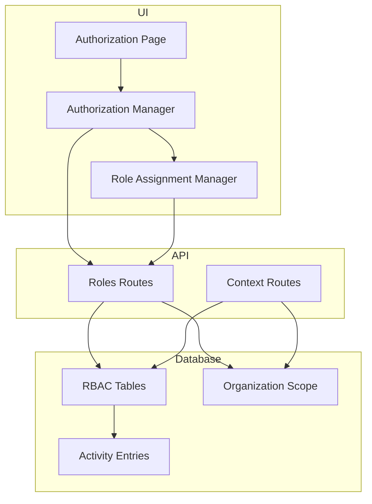
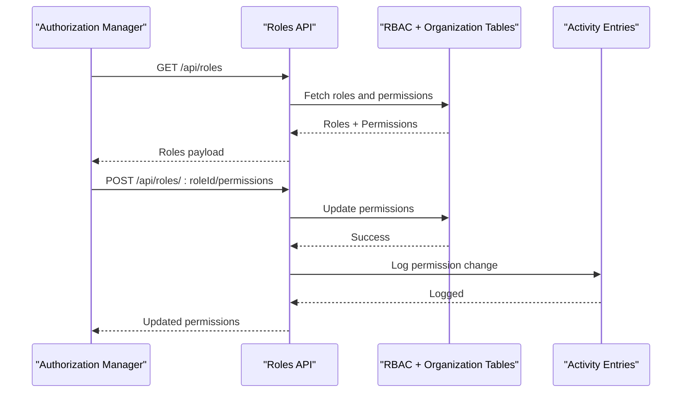
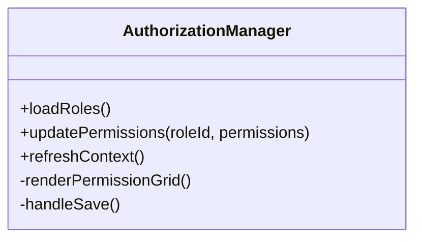
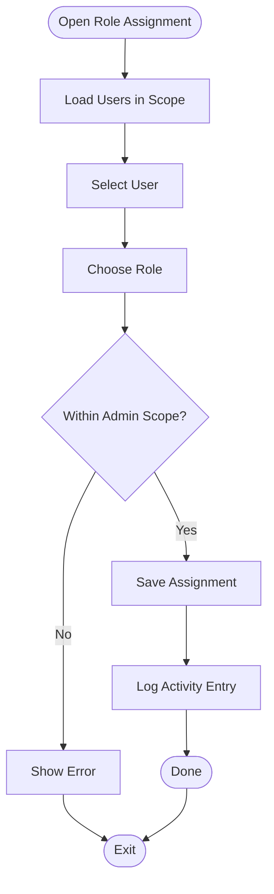
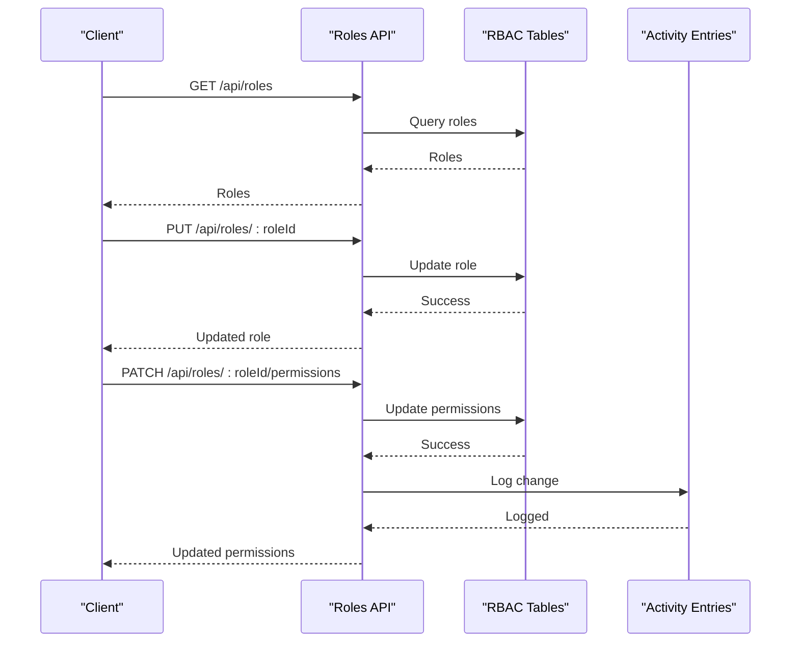
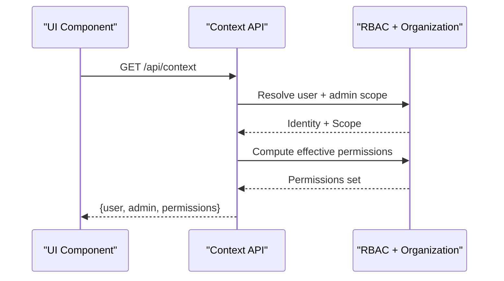
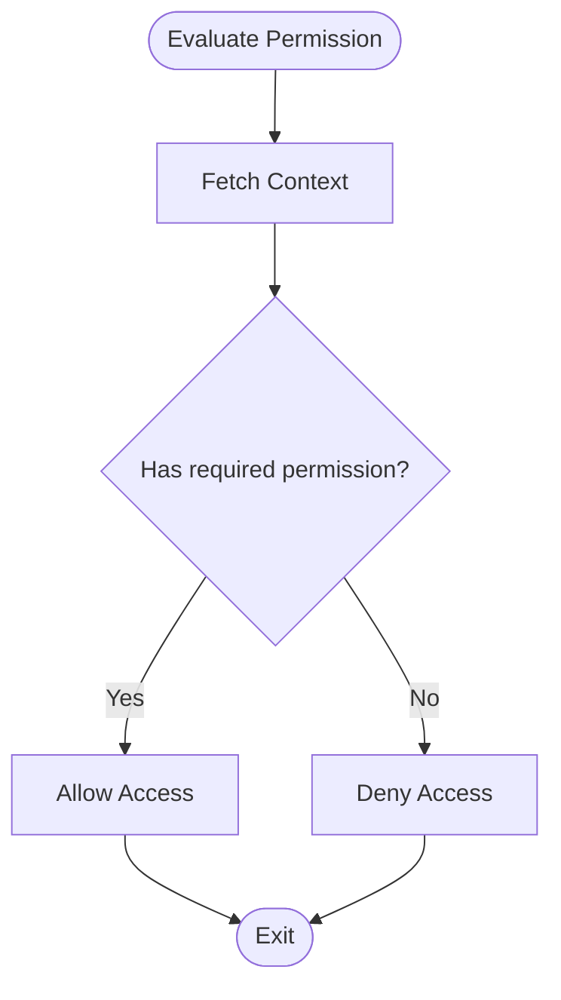
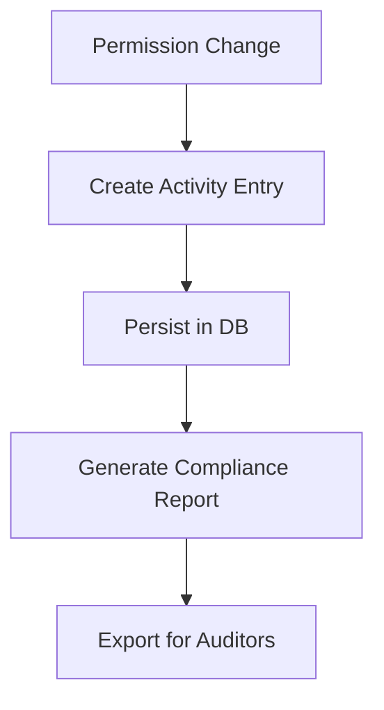
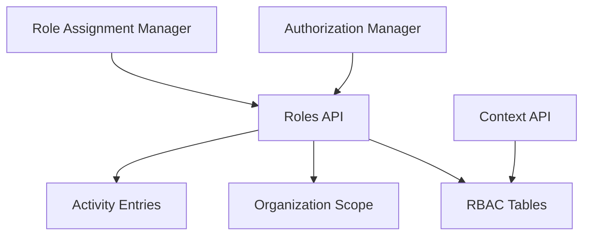

# Permission Management System

<cite>
**Referenced Files in This Document**
- [authorization-manager.tsx](file://apps/hr-suite/components/organization/authorization-manager.tsx)
- [role-assignment-manager.tsx](file://apps/hr-suite/components/organization/role-assignment-manager.tsx)
- [page.tsx](file://apps/hr-suite/app/(dashboard)/authorization/page.tsx)
- [route.ts](file://apps/hr-suite/app/api/roles/route.ts)
- [route.ts](file://apps/hr-suite/app/api/roles/[roleId]/route.ts)
- [route.ts](file://apps/hr-suite/app/api/roles/[roleId]/permissions/route.ts)
- [route.ts](file://apps/hr-suite/app/api/context/route.ts)
- [route.ts](file://apps/hr-suite/app/api/context/administration/route.ts)
- [20260712124911_add_tenant_rbac_and_organization.sql](file://apps/hr-suite/supabase/migrations/20260712124911_add_tenant_rbac_and_organization.sql)
- [20260714170949_harden_organization_authorization.sql](file://apps/hr-suite/supabase/migrations/20260714170949_harden_organization_authorization.sql)
- [20260715123639_add_organization_authorization_management.sql](file://apps/hr-suite/supabase/migrations/20260715123639_add_organization_authorization_management.sql)
- [20260724112407_add_role_assignment_scope.sql](file://apps/hr-suite/supabase/migrations/20260724112407_add_role_assignment_scope.sql)
- [20260724160000_add_employee_activity_entries.sql](file://apps/hr-suite/supabase/migrations/20260724160000_add_employee_activity_entries.sql)
- [20260724172716_harden_employee_activity_entries.sql](file://apps/hr-suite/supabase/migrations/20260724172716_harden_employee_activity_entries.sql)
- [AUTHORISATIE_EN_RECHTEN.md](file://docs/requirements/authorization/AUTORISATIE_EN_RECHTEN.md)
</cite>

## Table of Contents
1. [Introduction](#introduction)
2. [Project Structure](#project-structure)
3. [Core Components](#core-components)
4. [Architecture Overview](#architecture-overview)
5. [Detailed Component Analysis](#detailed-component-analysis)
6. [Dependency Analysis](#dependency-analysis)
7. [Performance Considerations](#performance-considerations)
8. [Troubleshooting Guide](#troubleshooting-guide)
9. [Conclusion](#conclusion)
10. [Appendices](#appendices)

## Introduction
This document explains the permission management system in LiquidHR, focusing on the permission model, dynamic evaluation, runtime authorization checks, and how permissions are enforced across UI components, API routes, and background processes. It also covers the authorization manager component, caching strategies for performance, real-time updates, custom permission definitions, conditional access rules, inheritance across organizational hierarchies, and audit/compliance reporting features.

## Project Structure
The permission system spans UI components, API routes, and database migrations:
- UI components manage role assignments and authorization views.
- API routes expose endpoints for roles and permissions.
- Database migrations define RBAC tables, organization scoping, and activity logging.

**Diagram sources**
- [page.tsx](file://apps/hr-suite/app/(dashboard)/authorization/page.tsx)
- [authorization-manager.tsx](file://apps/hr-suite/components/organization/authorization-manager.tsx)
- [role-assignment-manager.tsx](file://apps/hr-suite/components/organization/role-assignment-manager.tsx)
- [route.ts](file://apps/hr-suite/app/api/roles/route.ts)
- [route.ts](file://apps/hr-suite/app/api/context/route.ts)
- [20260712124911_add_tenant_rbac_and_organization.sql](file://apps/hr-suite/supabase/migrations/20260712124911_add_tenant_rbac_and_organization.sql)
- [20260714170949_harden_organization_authorization.sql](file://apps/hr-suite/supabase/migrations/20260714170949_harden_organization_authorization.sql)
- [20260724160000_add_employee_activity_entries.sql](file://apps/hr-suite/supabase/migrations/20260724160000_add_employee_activity_entries.sql)

**Section sources**
- [page.tsx](file://apps/hr-suite/app/(dashboard)/authorization/page.tsx)
- [authorization-manager.tsx](file://apps/hr-suite/components/organization/authorization-manager.tsx)
- [role-assignment-manager.tsx](file://apps/hr-suite/components/organization/role-assignment-manager.tsx)
- [route.ts](file://apps/hr-suite/app/api/roles/route.ts)
- [route.ts](file://apps/hr-suite/app/api/context/route.ts)
- [20260712124911_add_tenant_rbac_and_organization.sql](file://apps/hr-suite/supabase/migrations/20260712124911_add_tenant_rbac_and_organization.sql)
- [20260714170949_harden_organization_authorization.sql](file://apps/hr-suite/supabase/migrations/20260714170949_harden_organization_authorization.sql)
- [20260724160000_add_employee_activity_entries.sql](file://apps/hr-suite/supabase/migrations/20260724160000_add_employee_activity_entries.sql)

## Core Components
- Authorization Manager: Central UI component to view and manage permissions within an organization context.
- Role Assignment Manager: Manages role-to-user assignments with scope constraints.
- Roles API: Endpoints to list, read, update roles and their permissions.
- Context API: Provides current user context including administration and role-derived permissions.

Key responsibilities:
- Resolve effective permissions by combining role-based permissions with organizational scope.
- Expose a consistent API for clients to check permissions dynamically.
- Persist role assignments and permission changes with audit entries.

**Section sources**
- [authorization-manager.tsx](file://apps/hr-suite/components/organization/authorization-manager.tsx)
- [role-assignment-manager.tsx](file://apps/hr-suite/components/organization/role-assignment-manager.tsx)
- [route.ts](file://apps/hr-suite/app/api/roles/route.ts)
- [route.ts](file://apps/hr-suite/app/api/roles/[roleId]/route.ts)
- [route.ts](file://apps/hr-suite/app/api/roles/[roleId]/permissions/route.ts)
- [route.ts](file://apps/hr-suite/app/api/context/route.ts)
- [20260712124911_add_tenant_rbac_and_organization.sql](file://apps/hr-suite/supabase/migrations/20260712124911_add_tenant_rbac_and_organization.sql)
- [20260714170949_harden_organization_authorization.sql](file://apps/hr-suite/supabase/migrations/20260714170949_harden_organization_authorization.sql)
- [20260715123639_add_organization_authorization_management.sql](file://apps/hr-suite/supabase/migrations/20260715123639_add_organization_authorization_management.sql)
- [20260724112407_add_role_assignment_scope.sql](file://apps/hr-suite/supabase/migrations/20260724112407_add_role_assignment_scope.sql)

## Architecture Overview
The system enforces authorization at multiple layers:
- UI layer: Components query context and render controls based on resolved permissions.
- API layer: Route handlers validate requests using context and enforce policies before data access.
- Database layer: Row-level policies and scopes restrict data visibility and mutations.

**Diagram sources**
- [authorization-manager.tsx](file://apps/hr-suite/components/organization/authorization-manager.tsx)
- [route.ts](file://apps/hr-suite/app/api/roles/route.ts)
- [route.ts](file://apps/hr-suite/app/api/roles/[roleId]/permissions/route.ts)
- [20260712124911_add_tenant_rbac_and_organization.sql](file://apps/hr-suite/supabase/migrations/20260712124911_add_tenant_rbac_and_organization.sql)
- [20260724160000_add_employee_activity_entries.sql](file://apps/hr-suite/supabase/migrations/20260724160000_add_employee_activity_entries.sql)

## Detailed Component Analysis

### Authorization Manager Component
Responsibilities:
- Displays current organization’s roles and permissions.
- Allows editing permissions per role.
- Triggers refresh of context when permissions change.

Runtime behavior:
- Loads roles via API.
- Updates permissions through dedicated endpoint.
- Emits events or triggers re-fetches to keep UI consistent.

**Diagram sources**
- [authorization-manager.tsx](file://apps/hr-suite/components/organization/authorization-manager.tsx)

**Section sources**
- [authorization-manager.tsx](file://apps/hr-suite/components/organization/authorization-manager.tsx)

### Role Assignment Manager Component
Responsibilities:
- Assigns roles to users within a specific administrative scope.
- Enforces scope constraints during assignment.
- Persists assignments and logs changes.

**Diagram sources**
- [role-assignment-manager.tsx](file://apps/hr-suite/components/organization/role-assignment-manager.tsx)
- [20260724112407_add_role_assignment_scope.sql](file://apps/hr-suite/supabase/migrations/20260724112407_add_role_assignment_scope.sql)
- [20260724160000_add_employee_activity_entries.sql](file://apps/hr-suite/supabase/migrations/20260724160000_add_employee_activity_entries.sql)

**Section sources**
- [role-assignment-manager.tsx](file://apps/hr-suite/components/organization/role-assignment-manager.tsx)
- [20260724112407_add_role_assignment_scope.sql](file://apps/hr-suite/supabase/migrations/20260724112407_add_role_assignment_scope.sql)
- [20260724160000_add_employee_activity_entries.sql](file://apps/hr-suite/supabase/migrations/20260724160000_add_employee_activity_entries.sql)

### Roles API Endpoints
Endpoints:
- List roles and basic metadata.
- Read/update a specific role.
- Manage role permissions (add/remove).

Behavior:
- Validates authenticated user context.
- Applies organization scoping.
- Logs permission changes to activity entries.

**Diagram sources**
- [route.ts](file://apps/hr-suite/app/api/roles/route.ts)
- [route.ts](file://apps/hr-suite/app/api/roles/[roleId]/route.ts)
- [route.ts](file://apps/hr-suite/app/api/roles/[roleId]/permissions/route.ts)
- [20260712124911_add_tenant_rbac_and_organization.sql](file://apps/hr-suite/supabase/migrations/20260712124911_add_tenant_rbac_and_organization.sql)
- [20260724160000_add_employee_activity_entries.sql](file://apps/hr-suite/supabase/migrations/20260724160000_add_employee_activity_entries.sql)

**Section sources**
- [route.ts](file://apps/hr-suite/app/api/roles/route.ts)
- [route.ts](file://apps/hr-suite/app/api/roles/[roleId]/route.ts)
- [route.ts](file://apps/hr-suite/app/api/roles/[roleId]/permissions/route.ts)
- [20260712124911_add_tenant_rbac_and_organization.sql](file://apps/hr-suite/supabase/migrations/20260712124911_add_tenant_rbac_and_organization.sql)
- [20260724160000_add_employee_activity_entries.sql](file://apps/hr-suite/supabase/migrations/20260724160000_add_employee_activity_entries.sql)

### Context API
Purpose:
- Returns current user’s context including administration and derived permissions.
- Used by UI components to perform client-side permission checks and rendering decisions.

Flow:
- Resolves user identity and active administration.
- Computes effective permissions from roles and scopes.
- Returns a compact payload for fast client evaluation.

**Diagram sources**
- [route.ts](file://apps/hr-suite/app/api/context/route.ts)
- [route.ts](file://apps/hr-suite/app/api/context/administration/route.ts)
- [20260712124911_add_tenant_rbac_and_organization.sql](file://apps/hr-suite/supabase/migrations/20260712124911_add_tenant_rbac_and_organization.sql)

**Section sources**
- [route.ts](file://apps/hr-suite/app/api/context/route.ts)
- [route.ts](file://apps/hr-suite/app/api/context/administration/route.ts)
- [20260712124911_add_tenant_rbac_and_organization.sql](file://apps/hr-suite/supabase/migrations/20260712124911_add_tenant_rbac_and_organization.sql)

### Permission Model and Dynamic Evaluation
Model highlights:
- Roles define sets of permissions.
- Users are assigned roles with optional administrative scope.
- Effective permissions are computed by merging role permissions within the active scope.

Dynamic evaluation:
- Clients call context API to get a permissions set.
- Components check permissions conditionally to show/hide features.
- API routes enforce server-side checks before processing requests.

**Diagram sources**
- [route.ts](file://apps/hr-suite/app/api/context/route.ts)
- [20260712124911_add_tenant_rbac_and_organization.sql](file://apps/hr-suite/supabase/migrations/20260712124911_add_tenant_rbac_and_organization.sql)

**Section sources**
- [route.ts](file://apps/hr-suite/app/api/context/route.ts)
- [20260712124911_add_tenant_rbac_and_organization.sql](file://apps/hr-suite/supabase/migrations/20260712124911_add_tenant_rbac_and_organization.sql)

### Permission Caching Strategies
Strategies:
- Client-side cache of context payload to avoid repeated calls.
- Cache invalidation on role/permission changes.
- Optional short-lived server-side caches for frequently accessed role metadata.

Recommendations:
- Use in-memory cache keyed by user+administration.
- Invalidate on mutation responses from roles API.
- Debounce rapid UI interactions that trigger permission checks.

[No sources needed since this section provides general guidance]

### Real-Time Permission Updates
Approach:
- On successful role/permission mutations, emit events or trigger refetch.
- UI components subscribe to context updates and re-render accordingly.
- Background jobs should refresh cached contexts if they hold long-lived state.

[No sources needed since this section provides general guidance]

### Custom Permission Definitions
Guidelines:
- Define permissions as domain-specific actions (e.g., “manage_departments”, “approve_leave”).
- Group related permissions under feature namespaces.
- Ensure consistency between UI checks and API enforcement.

[No sources needed since this section provides general guidance]

### Conditional Access Rules
Examples:
- Restrict editing to users with “edit” permission within the same administrative scope.
- Hide sensitive fields unless “reveal_sensitive_data” is granted.
- Gate advanced features behind module flags and role permissions.

[No sources needed since this section provides general guidance]

### Permission Inheritance Across Organizational Hierarchies
Concept:
- Roles can be scoped to specific administrations or departments.
- Effective permissions are aggregated up the hierarchy where applicable.
- Policies ensure least privilege by default; explicit grants override defaults.

[No sources needed since this section provides general guidance]

### How Permissions Are Checked
- UI Components: Call context API once per session or on navigation; use cached result for checks.
- API Routes: Re-evaluate permissions server-side using current request context and scope.
- Background Jobs: Use service accounts or impersonation tokens with explicit permissions; log all operations.

[No sources needed since this section provides general guidance]

### Permission Audit Trail and Compliance Reporting
Features:
- Activity entries capture who changed what, when, and under which scope.
- Immutable logs support compliance audits and incident investigations.
- Reports can aggregate changes over time and filter by user, role, or scope.

**Diagram sources**
- [20260724160000_add_employee_activity_entries.sql](file://apps/hr-suite/supabase/migrations/20260724160000_add_employee_activity_entries.sql)
- [20260724172716_harden_employee_activity_entries.sql](file://apps/hr-suite/supabase/migrations/20260724172716_harden_employee_activity_entries.sql)

**Section sources**
- [20260724160000_add_employee_activity_entries.sql](file://apps/hr-suite/supabase/migrations/20260724160000_add_employee_activity_entries.sql)
- [20260724172716_harden_employee_activity_entries.sql](file://apps/hr-suite/supabase/migrations/20260724172716_harden_employee_activity_entries.sql)

## Dependency Analysis
Dependencies between components and services:
- UI components depend on Roles and Context APIs.
- APIs depend on RBAC and Organization tables.
- Audit trail depends on activity entries table.

**Diagram sources**
- [authorization-manager.tsx](file://apps/hr-suite/components/organization/authorization-manager.tsx)
- [role-assignment-manager.tsx](file://apps/hr-suite/components/organization/role-assignment-manager.tsx)
- [route.ts](file://apps/hr-suite/app/api/roles/route.ts)
- [route.ts](file://apps/hr-suite/app/api/context/route.ts)
- [20260712124911_add_tenant_rbac_and_organization.sql](file://apps/hr-suite/supabase/migrations/20260712124911_add_tenant_rbac_and_organization.sql)
- [20260724160000_add_employee_activity_entries.sql](file://apps/hr-suite/supabase/migrations/20260724160000_add_employee_activity_entries.sql)

**Section sources**
- [authorization-manager.tsx](file://apps/hr-suite/components/organization/authorization-manager.tsx)
- [role-assignment-manager.tsx](file://apps/hr-suite/components/organization/role-assignment-manager.tsx)
- [route.ts](file://apps/hr-suite/app/api/roles/route.ts)
- [route.ts](file://apps/hr-suite/app/api/context/route.ts)
- [20260712124911_add_tenant_rbac_and_organization.sql](file://apps/hr-suite/supabase/migrations/20260712124911_add_tenant_rbac_and_organization.sql)
- [20260724160000_add_employee_activity_entries.sql](file://apps/hr-suite/supabase/migrations/20260724160000_add_employee_activity_entries.sql)

## Performance Considerations
- Minimize context API calls by caching results per user+administration.
- Batch permission checks in UI to reduce re-renders.
- Index RBAC and scope tables for fast lookups.
- Avoid heavy computations in hot paths; precompute effective permissions where possible.

[No sources needed since this section provides general guidance]

## Troubleshooting Guide
Common issues:
- Missing permissions after role changes: ensure context cache is invalidated.
- Scope mismatches: verify active administration and role assignment scope.
- Audit gaps: confirm activity entry creation on permission mutations.

Debugging steps:
- Inspect context payload for expected permissions.
- Check API responses for errors or policy denials.
- Review activity entries for recent changes.

**Section sources**
- [20260724160000_add_employee_activity_entries.sql](file://apps/hr-suite/supabase/migrations/20260724160000_add_employee_activity_entries.sql)
- [20260724172716_harden_employee_activity_entries.sql](file://apps/hr-suite/supabase/migrations/20260724172716_harden_employee_activity_entries.sql)

## Conclusion
LiquidHR’s permission system combines role-based access control with organizational scoping, dynamic evaluation, and robust auditing. The Authorization Manager and Role Assignment Manager provide intuitive UI for managing permissions, while the Roles and Context APIs enforce consistent checks across the application. Proper caching and real-time updates ensure responsive experiences, and audit trails support compliance requirements.

[No sources needed since this section summarizes without analyzing specific files]

## Appendices
- Requirements reference: Authorization and rights overview.

**Section sources**
- [AUTHORISATIE_EN_RECHTEN.md](file://docs/requirements/authorization/AUTORISATIE_EN_RECHTEN.md)