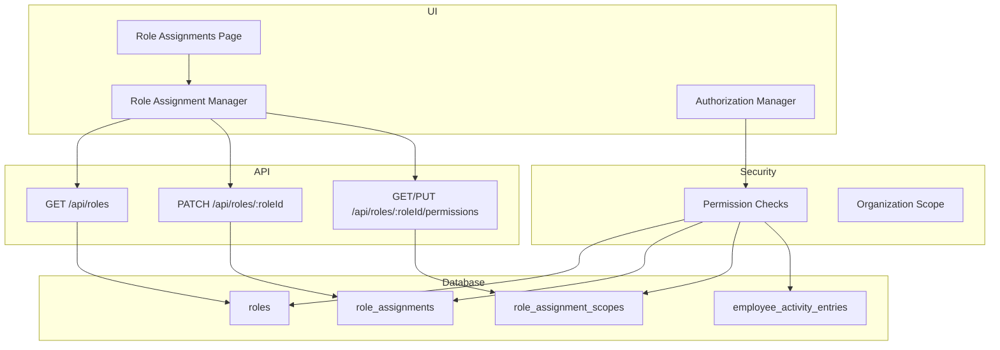
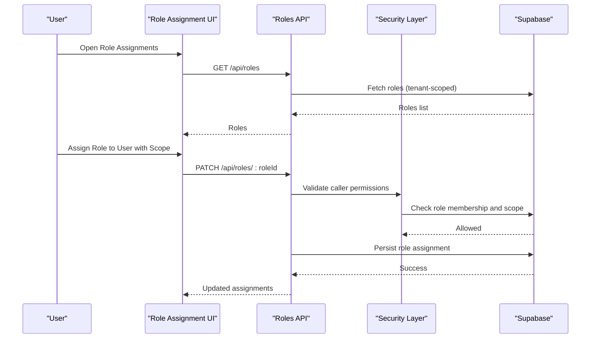
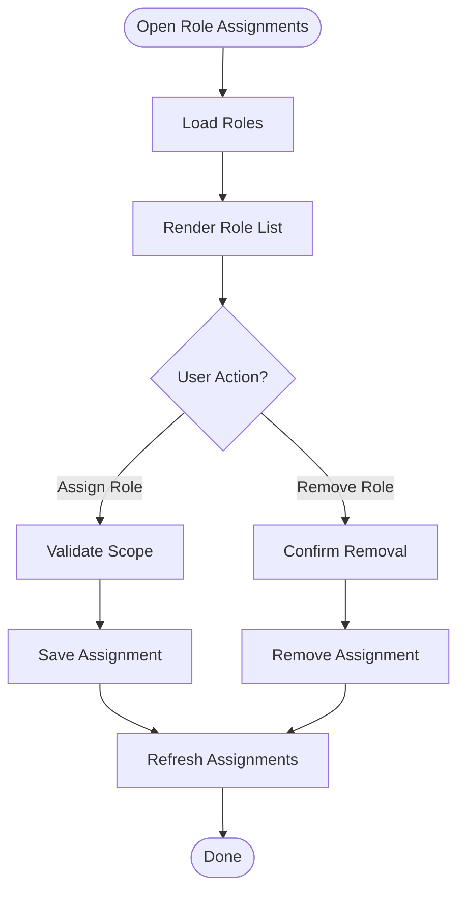
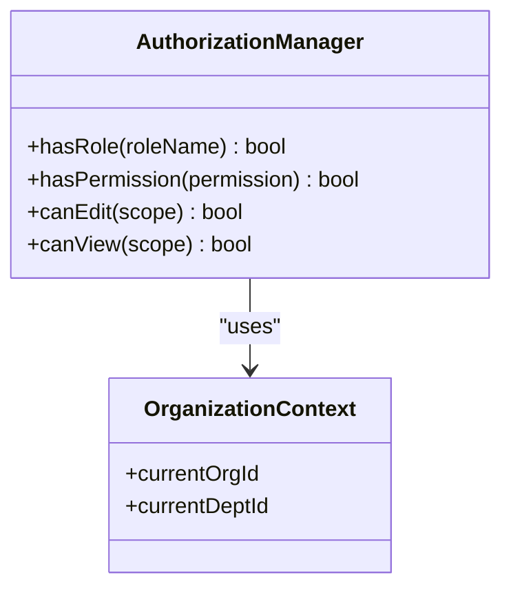
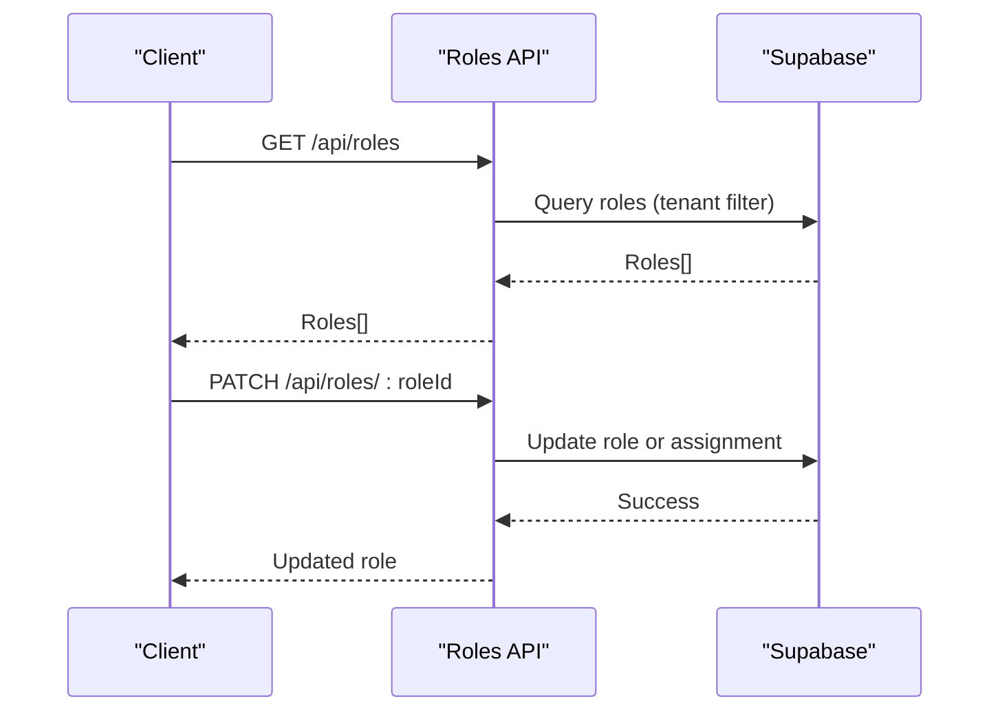
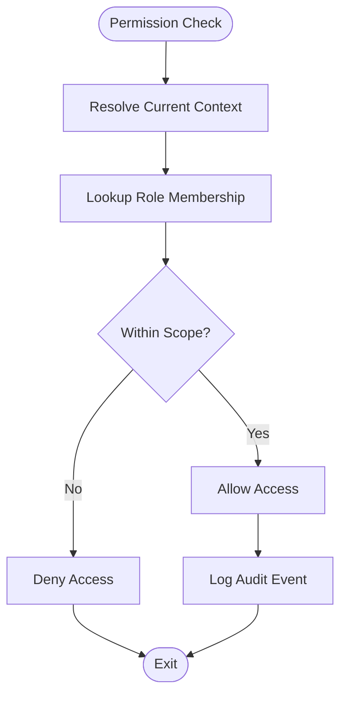
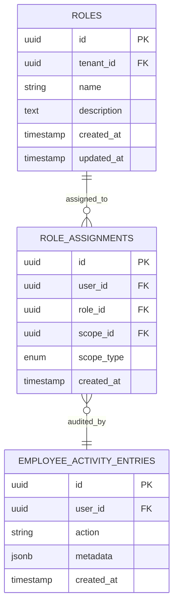
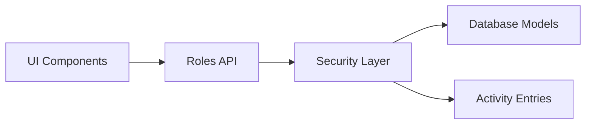

# Role-Based Access Control (RBAC)

<cite>
**Referenced Files in This Document**
- [role-assignment-manager.tsx](file://apps/hr-suite/components/organization/role-assignment-manager.tsx)
- [authorization-manager.tsx](file://apps/hr-suite/components/organization/authorization-manager.tsx)
- [page.tsx](file://apps/hr-suite/app/(dashboard)/role-assignments/page.tsx)
- [route.ts](file://apps/hr-suite/app/api/roles/route.ts)
- [route.ts](file://apps/hr-suite/app/api/roles/[roleId]/route.ts)
- [route.ts](file://apps/hr-suite/app/api/roles/[roleId]/permissions/route.ts)
- [20260712124911_add_tenant_rbac_and_organization.sql](file://apps/hr-suite/supabase/migrations/20260712124911_add_tenant_rbac_and_organization.sql)
- [20260715131230_seed_custom_fields_and_tenant_roles.sql](file://apps/hr-suite/supabase/migrations/20260715131230_seed_custom_fields_and_tenant_roles.sql)
- [20260724112407_add_role_assignment_scope.sql](file://apps/hr-suite/supabase/migrations/20260724112407_add_role_assignment_scope.sql)
- [20260724103939_simplify_roles_and_insights_events.sql](file://apps/hr-suite/supabase/migrations/20260724103939_simplify_roles_and_insights_events.sql)
- [20260724160000_add_employee_activity_entries.sql](file://apps/hr-suite/supabase/migrations/20260724160000_add_employee_activity_entries.sql)
- [20260724172716_harden_employee_activity_entries.sql](file://apps/hr-suite/supabase/migrations/20260724172716_harden_employee_activity_entries.sql)
- [lib/security/index.ts](file://apps/hr-suite/lib/security/index.ts)
- [lib/organization/index.ts](file://apps/hr-suite/lib/organization/index.ts)
- [lib/auth/index.ts](file://apps/hr-suite/lib/auth/index.ts)
</cite>

## Table of Contents
1. [Introduction](#introduction)
2. [Project Structure](#project-structure)
3. [Core Components](#core-components)
4. [Architecture Overview](#architecture-overview)
5. [Detailed Component Analysis](#detailed-component-analysis)
6. [Dependency Analysis](#dependency-analysis)
7. [Performance Considerations](#performance-considerations)
8. [Troubleshooting Guide](#troubleshooting-guide)
9. [Conclusion](#conclusion)
10. [Appendices](#appendices)

## Introduction
This document explains the Role-Based Access Control (RBAC) system implemented in LiquidHR. It covers role hierarchy, permission definitions, and how roles are assigned to users, departments, and organizations. It also documents built-in roles (HR Admin, Manager, Employee), custom role creation, permission inheritance patterns, UI rendering based on roles, API route protection, database-level access control via policies, the role management interface, permission checking functions, and audit logging for role changes.

## Project Structure
The RBAC system spans UI components, API routes, security utilities, and Supabase migrations:
- UI: Role assignment manager and authorization manager components; role assignments page.
- API: Roles endpoints for listing, updating, and managing permissions.
- Security: Permission checking helpers and organization-scoped checks.
- Database: Migrations defining roles, role assignments, scopes, and activity logs.

**Diagram sources**
- [role-assignment-manager.tsx](file://apps/hr-suite/components/organization/role-assignment-manager.tsx)
- [authorization-manager.tsx](file://apps/hr-suite/components/organization/authorization-manager.tsx)
- [page.tsx](file://apps/hr-suite/app/(dashboard)/role-assignments/page.tsx)
- [route.ts](file://apps/hr-suite/app/api/roles/route.ts)
- [route.ts](file://apps/hr-suite/app/api/roles/[roleId]/route.ts)
- [route.ts](file://apps/hr-suite/app/api/roles/[roleId]/permissions/route.ts)
- [lib/security/index.ts](file://apps/hr-suite/lib/security/index.ts)
- [lib/organization/index.ts](file://apps/hr-suite/lib/organization/index.ts)
- [20260712124911_add_tenant_rbac_and_organization.sql](file://apps/hr-suite/supabase/migrations/20260712124911_add_tenant_rbac_and_organization.sql)
- [20260724112407_add_role_assignment_scope.sql](file://apps/hr-suite/supabase/migrations/20260724112407_add_role_assignment_scope.sql)
- [20260724160000_add_employee_activity_entries.sql](file://apps/hr-suite/supabase/migrations/20260724160000_add_employee_activity_entries.sql)

**Section sources**
- [role-assignment-manager.tsx](file://apps/hr-suite/components/organization/role-assignment-manager.tsx)
- [authorization-manager.tsx](file://apps/hr-suite/components/organization/authorization-manager.tsx)
- [page.tsx](file://apps/hr-suite/app/(dashboard)/role-assignments/page.tsx)
- [route.ts](file://apps/hr-suite/app/api/roles/route.ts)
- [route.ts](file://apps/hr-suite/app/api/roles/[roleId]/route.ts)
- [route.ts](file://apps/hr-suite/app/api/roles/[roleId]/permissions/route.ts)
- [lib/security/index.ts](file://apps/hr-suite/lib/security/index.ts)
- [lib/organization/index.ts](file://apps/hr-suite/lib/organization/index.ts)
- [20260712124911_add_tenant_rbac_and_organization.sql](file://apps/hr-suite/supabase/migrations/20260712124911_add_tenant_rbac_and_organization.sql)
- [20260724112407_add_role_assignment_scope.sql](file://apps/hr-suite/supabase/migrations/20260724112407_add_role_assignment_scope.sql)
- [20260724160000_add_employee_activity_entries.sql](file://apps/hr-suite/supabase/migrations/20260724160000_add_employee_activity_entries.sql)

## Core Components
- Role Assignment Manager: Provides a UI to assign roles to users with optional scope constraints (e.g., department or organization).
- Authorization Manager: Centralizes permission checks and renders UI conditionally based on roles and scopes.
- Role APIs: Endpoints to list roles, update role metadata, and manage role permissions.
- Security Utilities: Functions to check if a user has a given role or permission within a specific scope.
- Database Models: Tables for roles, role assignments, and scoped assignments; audit entries for change tracking.

Key responsibilities:
- UI layer: Presents role lists, assignment forms, and permission editors.
- API layer: Validates requests, enforces tenant isolation, and persists changes.
- Security layer: Evaluates role membership and permissions against current context.
- Data layer: Enforces row-level policies and records audit events.

**Section sources**
- [role-assignment-manager.tsx](file://apps/hr-suite/components/organization/role-assignment-manager.tsx)
- [authorization-manager.tsx](file://apps/hr-suite/components/organization/authorization-manager.tsx)
- [route.ts](file://apps/hr-suite/app/api/roles/route.ts)
- [route.ts](file://apps/hr-suite/app/api/roles/[roleId]/route.ts)
- [route.ts](file://apps/hr-suite/app/api/roles/[roleId]/permissions/route.ts)
- [lib/security/index.ts](file://apps/hr-suite/lib/security/index.ts)
- [lib/organization/index.ts](file://apps/hr-suite/lib/organization/index.ts)

## Architecture Overview
RBAC is enforced across three layers:
- UI Rendering: Components use permission checks to show/hide features.
- API Protection: Route handlers validate roles before processing mutations.
- Database Policies: Row-level security ensures data access aligns with roles and scopes.

**Diagram sources**
- [page.tsx](file://apps/hr-suite/app/(dashboard)/role-assignments/page.tsx)
- [route.ts](file://apps/hr-suite/app/api/roles/route.ts)
- [route.ts](file://apps/hr-suite/app/api/roles/[roleId]/route.ts)
- [lib/security/index.ts](file://apps/hr-suite/lib/security/index.ts)
- [20260712124911_add_tenant_rbac_and_organization.sql](file://apps/hr-suite/supabase/migrations/20260712124911_add_tenant_rbac_and_organization.sql)

## Detailed Component Analysis

### Role Assignment Manager
- Purpose: Manage role assignments for users, optionally scoped by department or organization.
- Behavior: Loads available roles, displays current assignments, allows adding/removing roles, and validates scope constraints.
- Integration: Calls roles API endpoints and updates local state; triggers re-fetch after mutations.

**Diagram sources**
- [role-assignment-manager.tsx](file://apps/hr-suite/components/organization/role-assignment-manager.tsx)
- [page.tsx](file://apps/hr-suite/app/(dashboard)/role-assignments/page.tsx)

**Section sources**
- [role-assignment-manager.tsx](file://apps/hr-suite/components/organization/role-assignment-manager.tsx)
- [page.tsx](file://apps/hr-suite/app/(dashboard)/role-assignments/page.tsx)

### Authorization Manager
- Purpose: Centralize permission checks and render UI elements based on roles and scopes.
- Behavior: Exposes helper functions to determine visibility and editability; integrates with organization context to enforce scope.

**Diagram sources**
- [authorization-manager.tsx](file://apps/hr-suite/components/organization/authorization-manager.tsx)
- [lib/organization/index.ts](file://apps/hr-suite/lib/organization/index.ts)

**Section sources**
- [authorization-manager.tsx](file://apps/hr-suite/components/organization/authorization-manager.tsx)
- [lib/organization/index.ts](file://apps/hr-suite/lib/organization/index.ts)

### Roles API Endpoints
- GET /api/roles: Lists roles for the current tenant.
- PATCH /api/roles/:roleId: Updates role metadata or assignments.
- GET/PUT /api/roles/:roleId/permissions: Retrieves or updates permissions for a role.

**Diagram sources**
- [route.ts](file://apps/hr-suite/app/api/roles/route.ts)
- [route.ts](file://apps/hr-suite/app/api/roles/[roleId]/route.ts)
- [route.ts](file://apps/hr-suite/app/api/roles/[roleId]/permissions/route.ts)

**Section sources**
- [route.ts](file://apps/hr-suite/app/api/roles/route.ts)
- [route.ts](file://apps/hr-suite/app/api/roles/[roleId]/route.ts)
- [route.ts](file://apps/hr-suite/app/api/roles/[roleId]/permissions/route.ts)

### Security Layer and Permission Checking
- Functions: Provide role and permission checks against current user context and scope.
- Scope Enforcement: Ensure operations are limited to allowed departments or organizations.
- Audit Logging: Record significant role changes into activity entries.

**Diagram sources**
- [lib/security/index.ts](file://apps/hr-suite/lib/security/index.ts)
- [20260724160000_add_employee_activity_entries.sql](file://apps/hr-suite/supabase/migrations/20260724160000_add_employee_activity_entries.sql)

**Section sources**
- [lib/security/index.ts](file://apps/hr-suite/lib/security/index.ts)
- [20260724160000_add_employee_activity_entries.sql](file://apps/hr-suite/supabase/migrations/20260724160000_add_employee_activity_entries.sql)

### Database Models and Policies
- Roles: Define role names and metadata per tenant.
- Role Assignments: Link users to roles with optional scope identifiers.
- Scopes: Support department or organization scoping for fine-grained access.
- Activity Entries: Capture audit trails for role changes.

**Diagram sources**
- [20260712124911_add_tenant_rbac_and_organization.sql](file://apps/hr-suite/supabase/migrations/20260712124911_add_tenant_rbac_and_organization.sql)
- [20260724112407_add_role_assignment_scope.sql](file://apps/hr-suite/supabase/migrations/20260724112407_add_role_assignment_scope.sql)
- [20260724160000_add_employee_activity_entries.sql](file://apps/hr-suite/supabase/migrations/20260724160000_add_employee_activity_entries.sql)

**Section sources**
- [20260712124911_add_tenant_rbac_and_organization.sql](file://apps/hr-suite/supabase/migrations/20260712124911_add_tenant_rbac_and_organization.sql)
- [20260724112407_add_role_assignment_scope.sql](file://apps/hr-suite/supabase/migrations/20260724112407_add_role_assignment_scope.sql)
- [20260724160000_add_employee_activity_entries.sql](file://apps/hr-suite/supabase/migrations/20260724160000_add_employee_activity_entries.sql)

## Dependency Analysis
RBAC components depend on each other as follows:
- UI components call API routes to manage roles and permissions.
- API routes rely on security utilities to validate permissions and enforce scope.
- Security utilities query database models and evaluate policies.
- Audit logging writes to activity entries upon role changes.

**Diagram sources**
- [role-assignment-manager.tsx](file://apps/hr-suite/components/organization/role-assignment-manager.tsx)
- [authorization-manager.tsx](file://apps/hr-suite/components/organization/authorization-manager.tsx)
- [route.ts](file://apps/hr-suite/app/api/roles/route.ts)
- [lib/security/index.ts](file://apps/hr-suite/lib/security/index.ts)
- [20260724160000_add_employee_activity_entries.sql](file://apps/hr-suite/supabase/migrations/20260724160000_add_employee_activity_entries.sql)

**Section sources**
- [role-assignment-manager.tsx](file://apps/hr-suite/components/organization/role-assignment-manager.tsx)
- [authorization-manager.tsx](file://apps/hr-suite/components/organization/authorization-manager.tsx)
- [route.ts](file://apps/hr-suite/app/api/roles/route.ts)
- [lib/security/index.ts](file://apps/hr-suite/lib/security/index.ts)
- [20260724160000_add_employee_activity_entries.sql](file://apps/hr-suite/supabase/migrations/20260724160000_add_employee_activity_entries.sql)

## Performance Considerations
- Cache roles and permissions at the session level to reduce repeated checks.
- Use indexed queries for role lookups and scope filters.
- Batch permission checks where possible to minimize database calls.
- Avoid heavy UI re-renders by memoizing permission results.

[No sources needed since this section provides general guidance]

## Troubleshooting Guide
Common issues and resolutions:
- Missing role assignment: Verify that the user’s role assignment exists and matches the required scope.
- Scope mismatch: Ensure the operation’s scope aligns with the assignment’s scope type and identifier.
- Policy denials: Review database policies and ensure tenant isolation is correctly applied.
- Audit gaps: Confirm that audit events are logged for all role mutation endpoints.

**Section sources**
- [20260724172716_harden_employee_activity_entries.sql](file://apps/hr-suite/supabase/migrations/20260724172716_harden_employee_activity_entries.sql)
- [lib/security/index.ts](file://apps/hr-suite/lib/security/index.ts)

## Conclusion
LiquidHR’s RBAC system provides a robust framework for managing roles, permissions, and scopes across UI, API, and database layers. Built-in roles support common HR workflows, while custom roles enable tailored access patterns. Scoped assignments ensure precise control over who can act within departments or organizations. Comprehensive audit logging supports compliance and troubleshooting.

[No sources needed since this section summarizes without analyzing specific files]

## Appendices

### Built-in Roles and Permission Inheritance
- HR Admin: Full administrative capabilities across tenants and scopes.
- Manager: Department-scoped management and oversight.
- Employee: Self-service and limited read/write access aligned with personal scope.

Inheritance patterns:
- Higher-level roles inherit lower-level permissions unless explicitly restricted.
- Scoped assignments refine access to specific departments or organizations.

**Section sources**
- [20260715131230_seed_custom_fields_and_tenant_roles.sql](file://apps/hr-suite/supabase/migrations/20260715131230_seed_custom_fields_and_tenant_roles.sql)
- [20260724103939_simplify_roles_and_insights_events.sql](file://apps/hr-suite/supabase/migrations/20260724103939_simplify_roles_and_insights_events.sql)

### Role Management Interface Usage
- Navigate to the Role Assignments page to view and modify role assignments.
- Use the Authorization Manager to conditionally render UI elements based on permissions.
- Call permission checking functions from security utilities to enforce access in custom logic.

**Section sources**
- [page.tsx](file://apps/hr-suite/app/(dashboard)/role-assignments/page.tsx)
- [authorization-manager.tsx](file://apps/hr-suite/components/organization/authorization-manager.tsx)
- [lib/security/index.ts](file://apps/hr-suite/lib/security/index.ts)

### API Route Protection Examples
- Protect sensitive endpoints by validating roles before processing mutations.
- Enforce tenant isolation using context-aware checks.
- Return standardized error responses when access is denied.

**Section sources**
- [route.ts](file://apps/hr-suite/app/api/roles/route.ts)
- [route.ts](file://apps/hr-suite/app/api/roles/[roleId]/route.ts)
- [route.ts](file://apps/hr-suite/app/api/roles/[roleId]/permissions/route.ts)

### Database-Level Access Control
- Implement row-level policies to restrict data access based on roles and scopes.
- Use indexes to optimize role and assignment queries.
- Record audit events for all role-related mutations.

**Section sources**
- [20260712124911_add_tenant_rbac_and_organization.sql](file://apps/hr-suite/supabase/migrations/20260712124911_add_tenant_rbac_and_organization.sql)
- [20260724112407_add_role_assignment_scope.sql](file://apps/hr-suite/supabase/migrations/20260724112407_add_role_assignment_scope.sql)
- [20260724160000_add_employee_activity_entries.sql](file://apps/hr-suite/supabase/migrations/20260724160000_add_employee_activity_entries.sql)