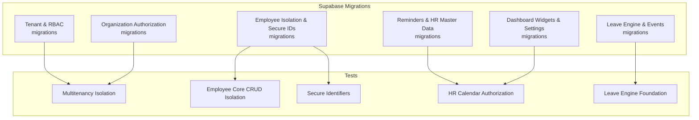
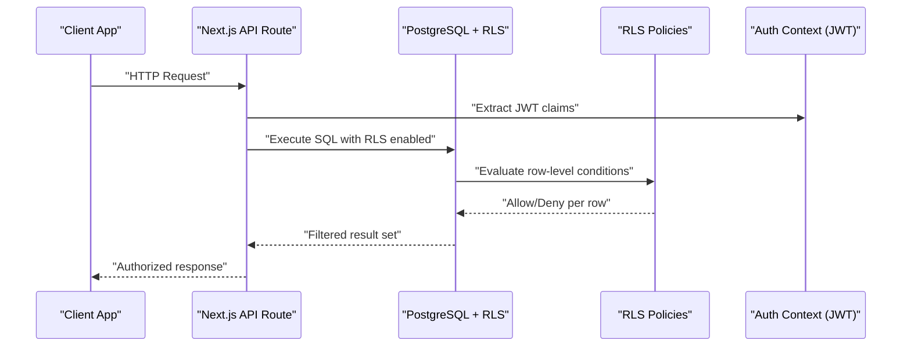
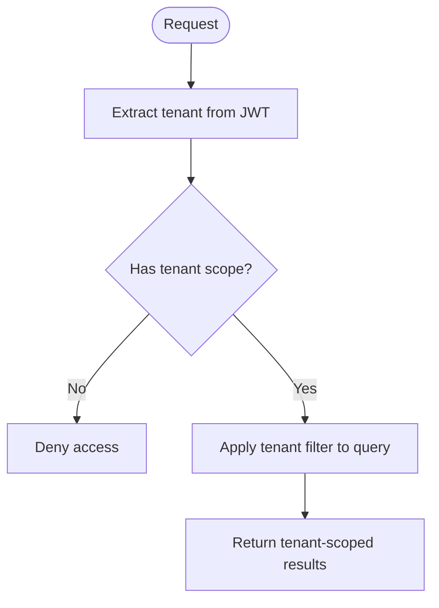
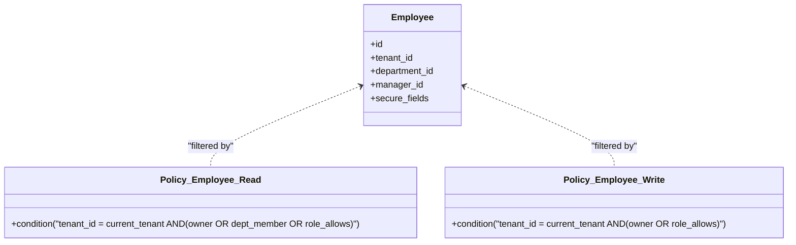
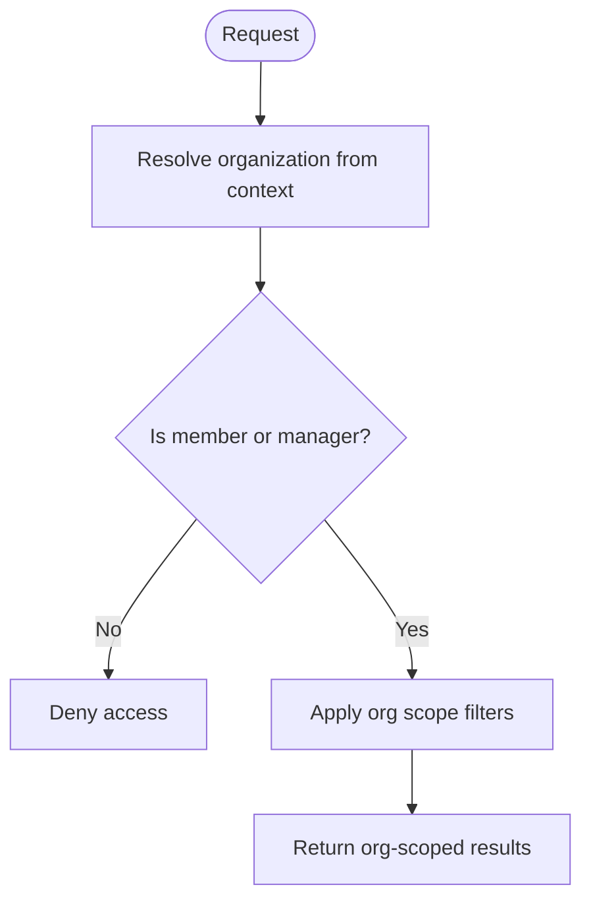
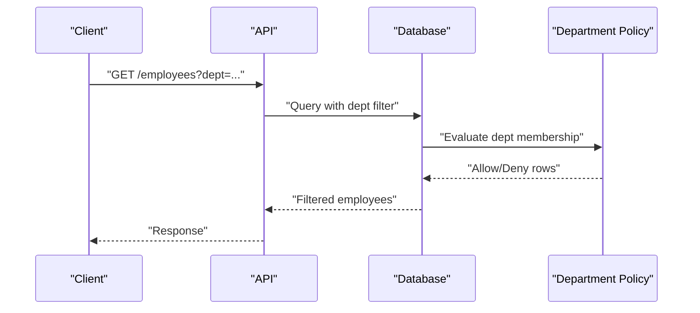
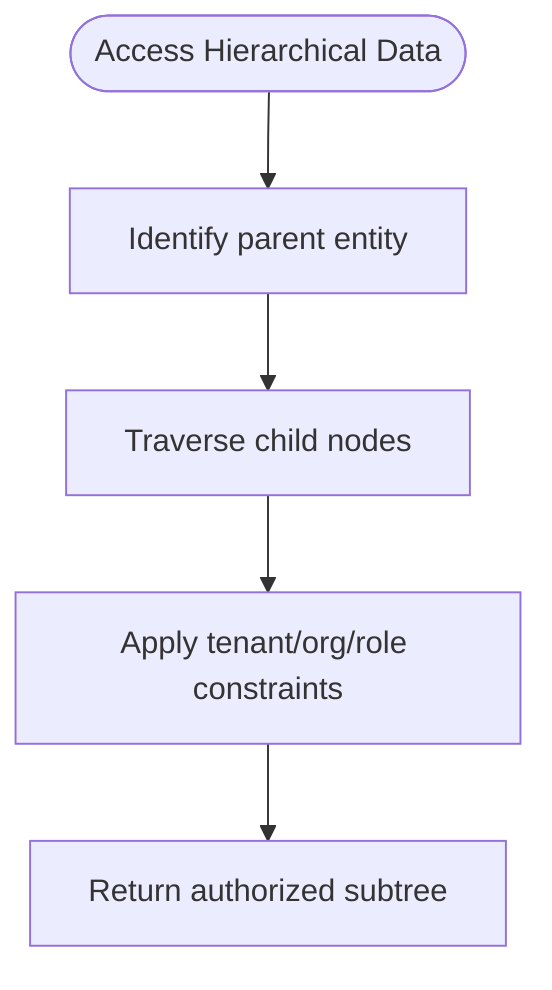
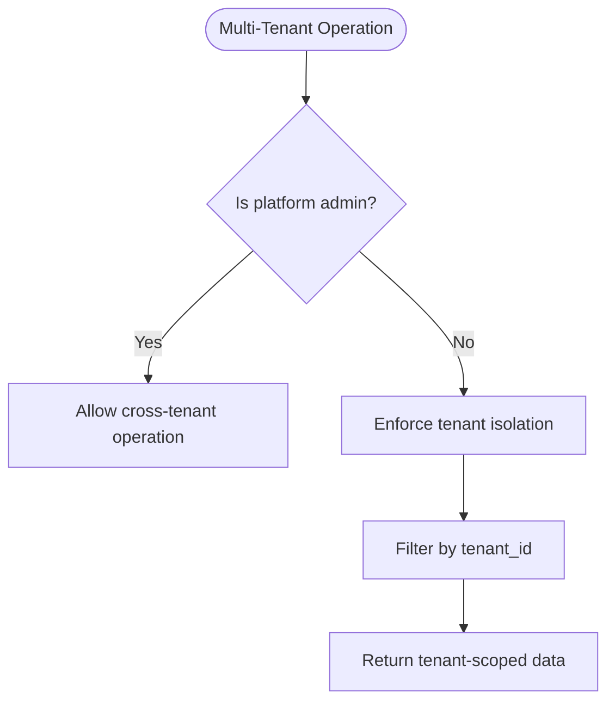
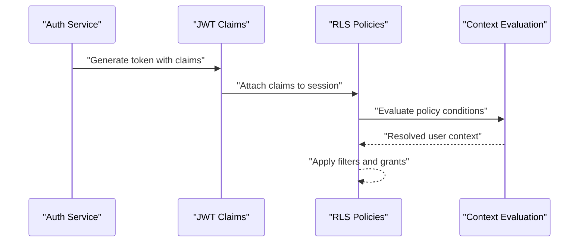
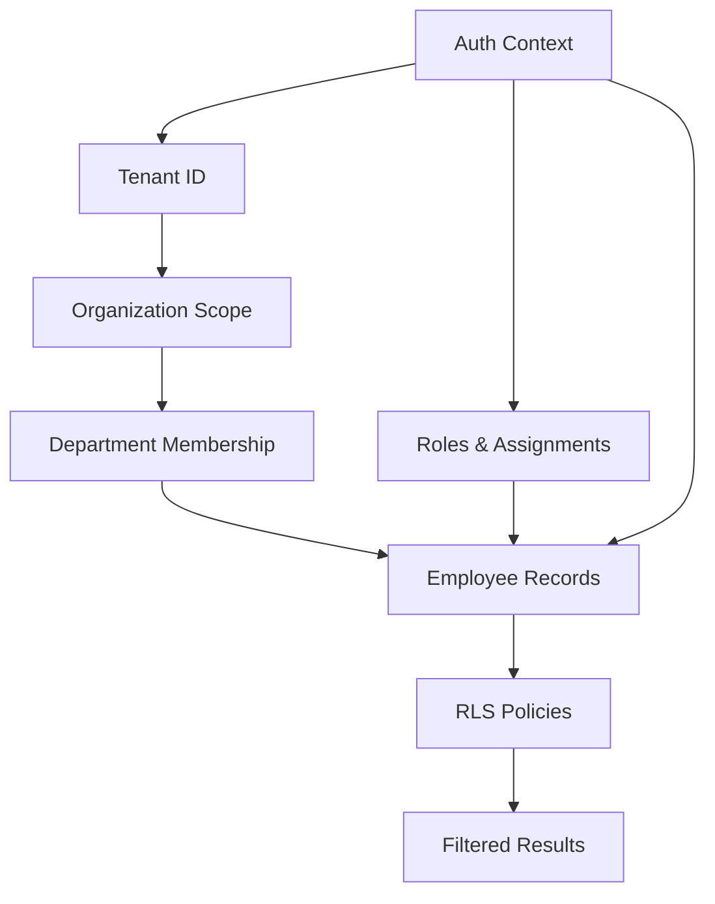

# Row Level Security (RLS) Policies

<cite>
**Referenced Files in This Document**
- [20260712124911_add_tenant_rbac_and_organization.sql](file://apps/hr-suite/supabase/migrations/20260712124911_add_tenant_rbac_and_organization.sql)
- [20260712125420_revoke_public_rls_trigger_execution.sql](file://apps/hr-suite/supabase/migrations/20260712125420_revoke_public_rls_trigger_execution.sql)
- [20260712125522_optimize_rbac_indexes_and_policies.sql](file://apps/hr-suite/supabase/migrations/20260712125522_optimize_rbac_indexes_and_policies.sql)
- [20260714170949_harden_organization_authorization.sql](file://apps/hr-suite/supabase/migrations/20260714170949_harden_organization_authorization.sql)
- [20260714171241_link_employees_from_auth_trigger.sql](file://apps/hr-suite/supabase/migrations/20260714171241_link_employees_from_auth_trigger.sql)
- [20260714174305_add_multitenancy_administrations.sql](file://apps/hr-suite/supabase/migrations/20260714174305_add_multitenancy_administrations.sql)
- [20260714180142_enforce_administration_management_scope.sql](file://apps/hr-suite/supabase/migrations/20260714180142_enforce_administration_management_scope.sql)
- [20260714180309_index_employee_organization_scope_foreign_keys.sql](file://apps/hr-suite/supabase/migrations/20260714180309_index_employee_organization_scope_foreign_keys.sql)
- [20260715124506_isolate_employee_secure_identifiers.sql](file://apps/hr-suite/supabase/migrations/20260715124506_isolate_employee_secure_identifiers.sql)
- [20260715124744_allow_logged_bsn_reveal.sql](file://apps/hr-suite/supabase/migrations/20260715124744_allow_logged_bsn_reveal.sql)
- [20260715130026_index_secure_employee_foreign_keys.sql](file://apps/hr-suite/supabase/migrations/20260715130026_index_secure_employee_foreign_keys.sql)
- [20260715131230_seed_custom_fields_and_tenant_roles.sql](file://apps/hr-suite/supabase/migrations/20260715131230_seed_custom_fields_and_tenant_roles.sql)
- [20260715173629_restore_employee_subresource_grants.sql](file://apps/hr-suite/supabase/migrations/20260715173629_restore_employee_subresource_grants.sql)
- [20260716090000_fix_reminder_recipient_rls_recursion.sql](file://apps/hr-suite/supabase/migrations/20260716090000_fix_reminder_recipient_rls_recursion.sql)
- [20260716092000_fix_reminder_publish_auth_lookup.sql](file://apps/hr-suite/supabase/migrations/20260716092000_fix_reminder_publish_auth_lookup.sql)
- [20260718131000_harden_hr_master_data_document_policies.sql](file://apps/hr-suite/supabase/migrations/20260718131000_harden_hr_master_data_document_policies.sql)
- [20260718132000_split_reminder_target_write_policy.sql](file://apps/hr-suite/supabase/migrations/20260718132000_split_reminder_target_write_policy.sql)
- [20260718171000_relax_dashboard_widget_read_scope.sql](file://apps/hr-suite/supabase/migrations/20260718171000_relax_dashboard_widget_read_scope.sql)
- [20260718172051_grant_dashboard_widget_admin_permissions.sql](file://apps/hr-suite/supabase/migrations/20260718172051_grant_dashboard_widget_admin_permissions.sql)
- [20260718173000_tune_dashboard_widget_policies.sql](file://apps/hr-suite/supabase/migrations/20260718173000_tune_dashboard_widget_policies.sql)
- [20260718190000_add_leave_request_booking_engine.sql](file://apps/hr-suite/supabase/migrations/20260722190000_add_leave_request_booking_engine.sql)
- [20260724112407_add_role_assignment_scope.sql](file://apps/hr-suite/supabase/migrations/20260724112407_add_role_assignment_scope.sql)
- [multitenancy_isolation.sql](file://apps/hr-suite/supabase/tests/multitenancy_isolation.sql)
- [employee_core_crud_isolation.sql](file://apps/hr-suite/supabase/tests/employee_core_crud_isolation.sql)
- [employee_secure_identifiers.sql](file://apps/hr-suite/supabase/tests/employee_secure_identifiers.sql)
- [hr_calendar_authorization.sql](file://apps/hr-suite/supabase/tests/hr_calendar_authorization.sql)
- [leave_engine_foundation.sql](file://apps/hr-suite/supabase/tests/leave_engine_foundation.sql)
</cite>

## Table of Contents
1. [Introduction](#introduction)
2. [Project Structure](#project-structure)
3. [Core Components](#core-components)
4. [Architecture Overview](#architecture-overview)
5. [Detailed Component Analysis](#detailed-component-analysis)
6. [Dependency Analysis](#dependency-analysis)
7. [Performance Considerations](#performance-considerations)
8. [Troubleshooting Guide](#troubleshooting-guide)
9. [Conclusion](#conclusion)
10. [Appendices](#appendices)

## Introduction
This document provides a comprehensive guide to LiquidHR’s database security layer using PostgreSQL Row Level Security (RLS). It explains how tenant isolation, employee data access, and organization-scoped permissions are enforced through policies defined in migrations. It also covers user context evaluation, performance implications, examples of complex multi-tenant scenarios, department-based filtering, hierarchical data access, testing strategies, debugging techniques, and optimization best practices.

## Project Structure
RLS policies are primarily defined within Supabase migrations under the apps/hr-suite/supabase/migrations directory. Supporting tests reside under apps/hr-suite/supabase/tests and validate policy behavior across tenants, employees, departments, and organizational scopes.

**Section sources**
- [20260712124911_add_tenant_rbac_and_organization.sql](file://apps/hr-suite/supabase/migrations/20260712124911_add_tenant_rbac_and_organization.sql)
- [20260714170949_harden_organization_authorization.sql](file://apps/hr-suite/supabase/migrations/20260714170949_harden_organization_authorization.sql)
- [20260715124506_isolate_employee_secure_identifiers.sql](file://apps/hr-suite/supabase/migrations/20260715124506_isolate_employee_secure_identifiers.sql)
- [20260718131000_harden_hr_master_data_document_policies.sql](file://apps/hr-suite/supabase/migrations/20260718131000_harden_hr_master_data_document_policies.sql)
- [20260718171000_relax_dashboard_widget_read_scope.sql](file://apps/hr-suite/supabase/migrations/20260718171000_relax_dashboard_widget_read_scope.sql)
- [20260722190000_add_leave_request_booking_engine.sql](file://apps/hr-suite/supabase/migrations/20260722190000_add_leave_request_booking_engine.sql)
- [multitenancy_isolation.sql](file://apps/hr-suite/supabase/tests/multitenancy_isolation.sql)
- [employee_core_crud_isolation.sql](file://apps/hr-suite/supabase/tests/employee_core_crud_isolation.sql)
- [employee_secure_identifiers.sql](file://apps/hr-suite/supabase/tests/employee_secure_identifiers.sql)
- [hr_calendar_authorization.sql](file://apps/hr-suite/supabase/tests/hr_calendar_authorization.sql)
- [leave_engine_foundation.sql](file://apps/hr-suite/supabase/tests/leave_engine_foundation.sql)

## Core Components
- Tenant isolation: Enforced via tenant identifiers on core tables and policies that filter rows by the authenticated tenant.
- Employee data access: Policies restrict read/write access based on employee identity, ownership, and role-based scope.
- Organization-scoped permissions: Policies leverage organization membership and management assignments to scope access to departments, roles, and resources.
- Secure identifiers: Sensitive fields are isolated and exposed conditionally based on authentication state and permissions.
- Department-based filtering: Access to employee records is filtered by department membership or management hierarchy.
- Hierarchical data access: Policies support parent-child relationships (e.g., org units, reminders, documents) with scoped visibility.

Key migration themes:
- RLS enablement and policy definitions for core entities.
- RBAC integration with tenant and organization contexts.
- Indexing and optimizations to support efficient policy evaluation.
- Hardening of authorization for sensitive operations and data.

**Section sources**
- [20260712124911_add_tenant_rbac_and_organization.sql](file://apps/hr-suite/supabase/migrations/20260712124911_add_tenant_rbac_and_organization.sql)
- [20260712125522_optimize_rbac_indexes_and_policies.sql](file://apps/hr-suite/supabase/migrations/20260712125522_optimize_rbac_indexes_and_policies.sql)
- [20260714170949_harden_organization_authorization.sql](file://apps/hr-suite/supabase/migrations/20260714170949_harden_organization_authorization.sql)
- [20260715124506_isolate_employee_secure_identifiers.sql](file://apps/hr-suite/supabase/migrations/20260715124506_isolate_employee_secure_identifiers.sql)
- [20260714180309_index_employee_organization_scope_foreign_keys.sql](file://apps/hr-suite/supabase/migrations/20260714180309_index_employee_organization_scope_foreign_keys.sql)

## Architecture Overview
The RLS architecture integrates authentication context, tenant scoping, and role-based permissions to enforce fine-grained access control at the database level.

**Diagram sources**
- [20260712124911_add_tenant_rbac_and_organization.sql](file://apps/hr-suite/supabase/migrations/20260712124911_add_tenant_rbac_and_organization.sql)
- [20260714170949_harden_organization_authorization.sql](file://apps/hr-suite/supabase/migrations/20260714170949_harden_organization_authorization.sql)
- [20260715124506_isolate_employee_secure_identifiers.sql](file://apps/hr-suite/supabase/migrations/20260715124506_isolate_employee_secure_identifiers.sql)

## Detailed Component Analysis

### Tenant Isolation Policies
- Purpose: Ensure each tenant’s data remains isolated from other tenants.
- Mechanism: Policies filter rows by tenant identifier derived from auth context; cross-tenant access is denied unless explicitly permitted by admin roles.
- Examples:
  - Multi-tenant administration scope enforcement.
  - Tenant-scoped RBAC and organization boundaries.

**Section sources**
- [20260714174305_add_multitenancy_administrations.sql](file://apps/hr-suite/supabase/migrations/20260714174305_add_multitenancy_administrations.sql)
- [20260714180142_enforce_administration_management_scope.sql](file://apps/hr-suite/supabase/migrations/20260714180142_enforce_administration_management_scope.sql)
- [multitenancy_isolation.sql](file://apps/hr-suite/supabase/tests/multitenancy_isolation.sql)

### Employee Data Access Policies
- Purpose: Restrict access to employee records based on ownership, department membership, and role permissions.
- Mechanism: Policies evaluate employee_id, department_id, and role assignments; sensitive fields may be hidden unless explicitly allowed.
- Examples:
  - CRUD isolation for employees.
  - Conditional reveal of secure identifiers when logged in with appropriate permissions.

**Section sources**
- [20260712124911_add_tenant_rbac_and_organization.sql](file://apps/hr-suite/supabase/migrations/20260712124911_add_tenant_rbac_and_organization.sql)
- [20260715124506_isolate_employee_secure_identifiers.sql](file://apps/hr-suite/supabase/migrations/20260715124506_isolate_employee_secure_identifiers.sql)
- [20260715124744_allow_logged_bsn_reveal.sql](file://apps/hr-suite/supabase/migrations/20260715124744_allow_logged_bsn_reveal.sql)
- [employee_core_crud_isolation.sql](file://apps/hr-suite/supabase/tests/employee_core_crud_isolation.sql)
- [employee_secure_identifiers.sql](file://apps/hr-suite/supabase/tests/employee_secure_identifiers.sql)

### Organization-Scoped Permissions
- Purpose: Scope access to organizational resources such as departments, roles, and master data.
- Mechanism: Policies use organization membership and management assignments to determine visibility and mutation rights.
- Examples:
  - Hardened organization authorization.
  - Role assignment scope enforcement.

**Section sources**
- [20260714170949_harden_organization_authorization.sql](file://apps/hr-suite/supabase/migrations/20260714170949_harden_organization_authorization.sql)
- [20260724112407_add_role_assignment_scope.sql](file://apps/hr-suite/supabase/migrations/20260724112407_add_role_assignment_scope.sql)

### Department-Based Filtering
- Purpose: Limit employee and related resource access to specific departments.
- Mechanism: Policies join employee-department mappings and check membership or managerial privileges.
- Examples:
  - Employee overview queries filtered by department.
  - Subresource grants restored for department-scoped operations.

**Section sources**
- [20260715173629_restore_employee_subresource_grants.sql](file://apps/hr-suite/supabase/migrations/20260715173629_restore_employee_subresource_grants.sql)
- [20260714180309_index_employee_organization_scope_foreign_keys.sql](file://apps/hr-suite/supabase/migrations/20260714180309_index_employee_organization_scope_foreign_keys.sql)

### Hierarchical Data Access
- Purpose: Support parent-child relationships (e.g., reminders, documents, org units) with scoped visibility.
- Mechanism: Policies traverse hierarchies and apply tenant/org/role constraints at each level.
- Examples:
  - Reminder recipient recursion fixes.
  - HR master data document policies hardened.

**Section sources**
- [20260716090000_fix_reminder_recipient_rls_recursion.sql](file://apps/hr-suite/supabase/migrations/20260716090000_fix_reminder_recipient_rls_recursion.sql)
- [20260718131000_harden_hr_master_data_document_policies.sql](file://apps/hr-suite/supabase/migrations/20260718131000_harden_hr_master_data_document_policies.sql)

### Complex Multi-Tenant Scenarios
- Purpose: Handle cross-tenant operations where necessary (e.g., platform admins), while maintaining strict isolation.
- Mechanism: Specialized policies allow elevated access for admin roles; default policies deny cross-tenant reads/writes.
- Examples:
  - Administration management scope enforcement.
  - Tenant role seeding and custom field isolation.

**Section sources**
- [20260714180142_enforce_administration_management_scope.sql](file://apps/hr-suite/supabase/migrations/20260714180142_enforce_administration_management_scope.sql)
- [20260715131230_seed_custom_fields_and_tenant_roles.sql](file://apps/hr-suite/supabase/migrations/20260715131230_seed_custom_fields_and_tenant_roles.sql)

### User Context Evaluation
- Purpose: Derive user identity, tenant, and role information from JWT claims to evaluate policies.
- Mechanism: Policies reference auth context functions/variables to compute effective permissions.
- Examples:
  - Linking employees from auth triggers.
  - Allowing logged-in users to reveal certain identifiers.

**Section sources**
- [20260714171241_link_employees_from_auth_trigger.sql](file://apps/hr-suite/supabase/migrations/20260714171241_link_employees_from_auth_trigger.sql)
- [20260715124744_allow_logged_bsn_reveal.sql](file://apps/hr-suite/supabase/migrations/20260715124744_allow_logged_bsn_reveal.sql)

## Dependency Analysis
RLS policies depend on authentication context, tenant identifiers, organization memberships, and role assignments. Optimizations include indexes on foreign keys and policy-specific columns to reduce evaluation overhead.

**Section sources**
- [20260712125522_optimize_rbac_indexes_and_policies.sql](file://apps/hr-suite/supabase/migrations/20260712125522_optimize_rbac_indexes_and_policies.sql)
- [20260714180309_index_employee_organization_scope_foreign_keys.sql](file://apps/hr-suite/supabase/migrations/20260714180309_index_employee_organization_scope_foreign_keys.sql)
- [20260715130026_index_secure_employee_foreign_keys.sql](file://apps/hr-suite/supabase/migrations/20260715130026_index_secure_employee_foreign_keys.sql)

## Performance Considerations
- Indexing: Ensure foreign keys and frequently filtered columns (tenant_id, department_id, employee_id) are indexed to accelerate policy evaluation.
- Policy Complexity: Keep conditions simple and avoid deep joins; prefer precomputed membership tables where possible.
- Query Patterns: Use explicit filters in application queries to complement RLS and reduce unnecessary row scans.
- Monitoring: Track slow queries and policy denials to identify bottlenecks and misconfigurations.

[No sources needed since this section provides general guidance]

## Troubleshooting Guide
Common issues and debugging techniques:
- Unexpected denials: Verify JWT claims and tenant resolution; ensure policies are enabled and not revoked.
- Cross-tenant leaks: Confirm tenant isolation policies and audit admin overrides.
- Department access failures: Check department membership mappings and manager relationships.
- Secure identifier exposure: Validate conditional reveal rules and logged-in checks.

Testing strategies:
- Run tenant isolation tests to assert cross-tenant denial.
- Execute employee CRUD isolation tests to verify ownership and role-based access.
- Validate secure identifier policies with logged-in vs anonymous contexts.
- Test HR calendar authorization and leave engine permissions.

**Section sources**
- [multitenancy_isolation.sql](file://apps/hr-suite/supabase/tests/multitenancy_isolation.sql)
- [employee_core_crud_isolation.sql](file://apps/hr-suite/supabase/tests/employee_core_crud_isolation.sql)
- [employee_secure_identifiers.sql](file://apps/hr-suite/supabase/tests/employee_secure_identifiers.sql)
- [hr_calendar_authorization.sql](file://apps/hr-suite/supabase/tests/hr_calendar_authorization.sql)
- [leave_engine_foundation.sql](file://apps/hr-suite/supabase/tests/leave_engine_foundation.sql)

## Conclusion
LiquidHR’s RLS policies provide robust tenant isolation, employee data protection, and organization-scoped permissions. By leveraging authentication context, RBAC, and carefully designed policies, the system enforces fine-grained access control efficiently. Continuous testing, monitoring, and optimization ensure security and performance at scale.

[No sources needed since this section summarizes without analyzing specific files]

## Appendices

### Example Policy Conditions
- Tenant isolation: Rows must match the authenticated tenant.
- Employee access: Ownership, department membership, or role-based allowances.
- Organization scope: Membership or management roles within the organization.
- Secure identifiers: Conditional reveal based on login state and permissions.

[No sources needed since this section provides conceptual examples]

### Optimization Best Practices
- Add indexes on tenant_id, department_id, employee_id, and organization-related foreign keys.
- Simplify policy conditions and avoid recursive joins.
- Use application-level filters alongside RLS for better performance.
- Regularly review and prune unused policies or overly broad grants.

[No sources needed since this section provides general guidance]