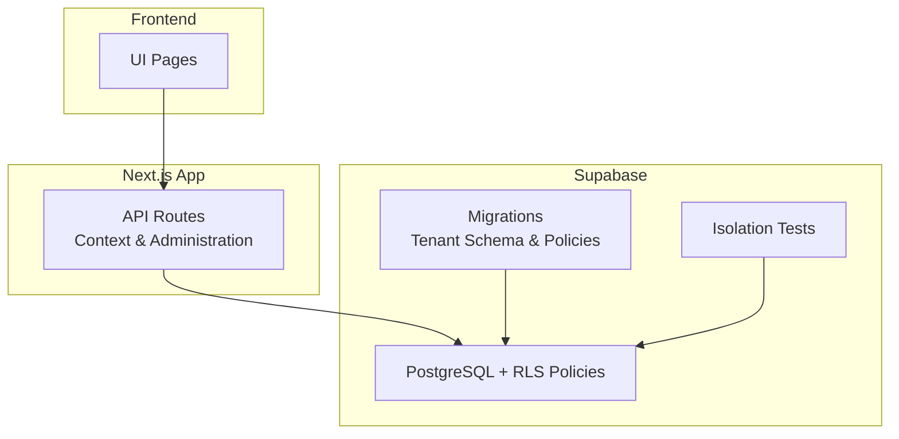
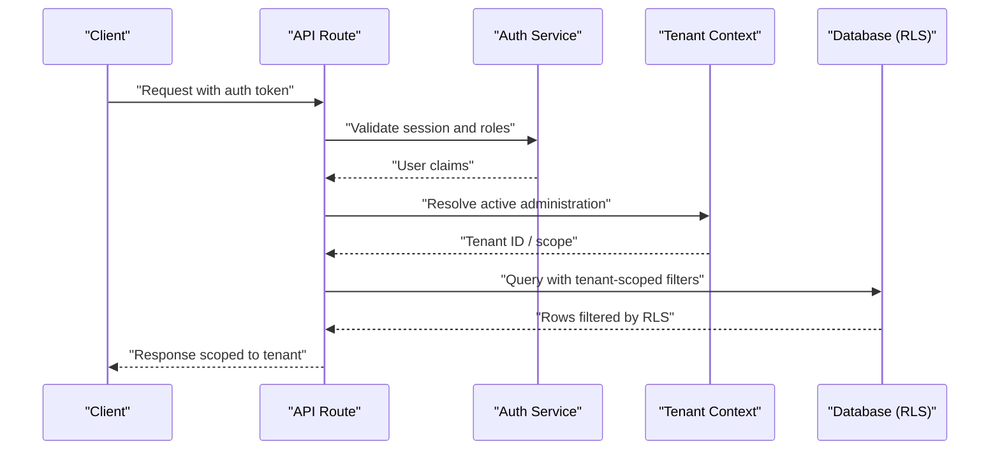
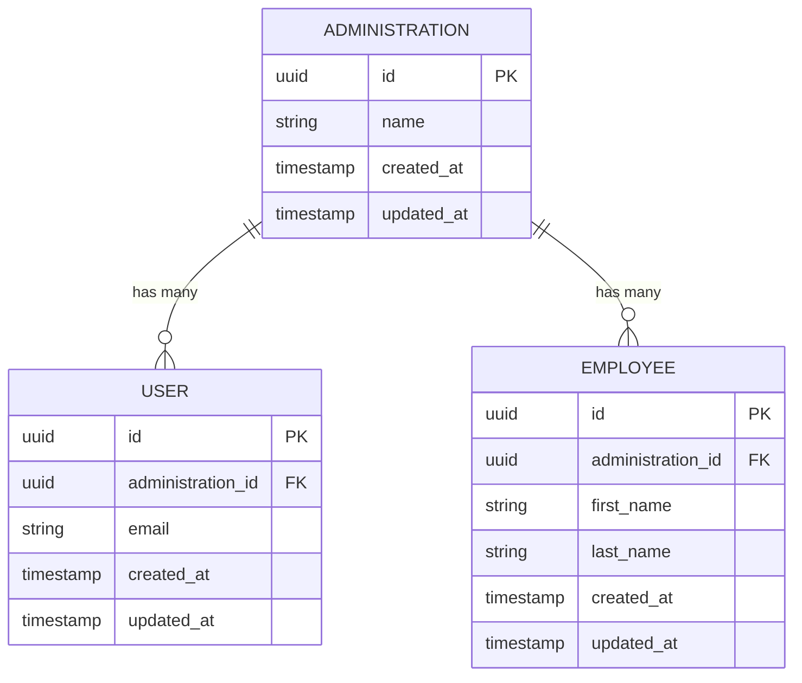
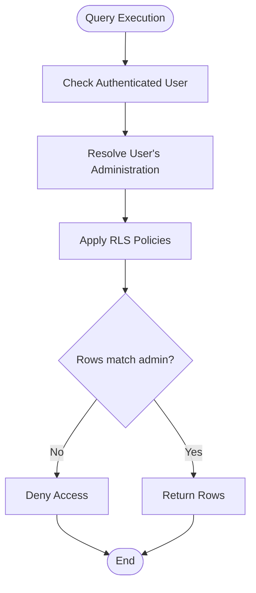
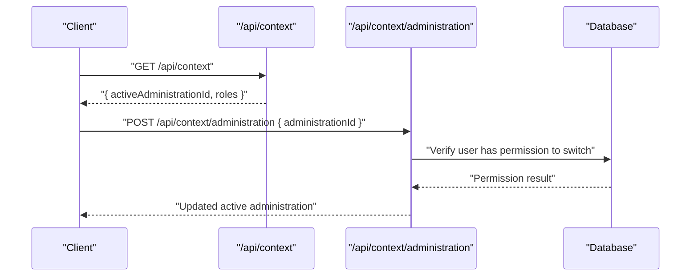
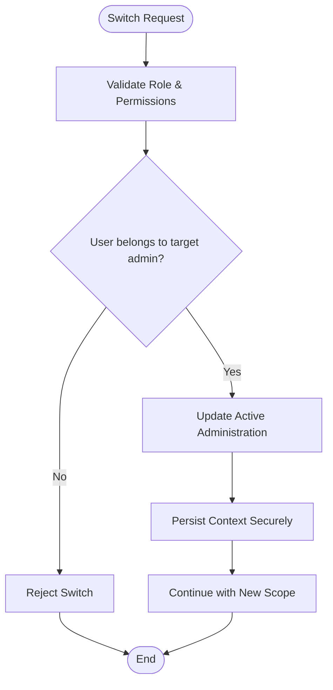
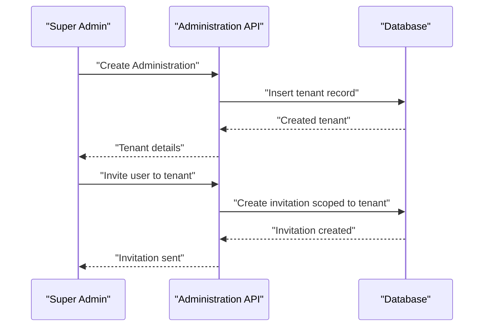
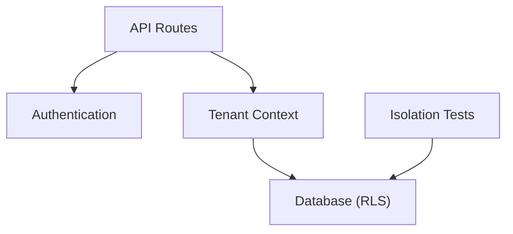

# Tenant Isolation and Multi-tenancy

<cite>
**Referenced Files in This Document**
- [ADR-0001-tenant-en-administratiegrenzen.md](file://docs/decisions/ADR-0001-tenant-en-administratiegrenzen.md)
- [MULTITENANCY_EN_MULTI_ADMINISTRATIE.md](file://docs/requirements/multitenancy/MULTITENANCY_EN_MULTI_ADMINISTRATIE.md)
- [20260714174305_add_multitenancy_administrations.sql](file://apps/hr-suite/supabase/migrations/20260714174305_add_multitenancy_administrations.sql)
- [20260714180142_enforce_administration_management_scope.sql](file://apps/hr-suite/supabase/migrations/20260714180142_enforce_administration_management_scope.sql)
- [route.ts](file://apps/hr-suite/app/api/context/route.ts)
- [administration/route.ts](file://apps/hr-suite/app/api/context/administration/route.ts)
- [multitenancy_isolation.sql](file://apps/hr-suite/supabase/tests/multitenancy_isolation.sql)
</cite>

## Table of Contents
1. [Introduction](#introduction)
2. [Project Structure](#project-structure)
3. [Core Components](#core-components)
4. [Architecture Overview](#architecture-overview)
5. [Detailed Component Analysis](#detailed-component-analysis)
6. [Dependency Analysis](#dependency-analysis)
7. [Performance Considerations](#performance-considerations)
8. [Troubleshooting Guide](#troubleshooting-guide)
9. [Conclusion](#conclusion)
10. [Appendices](#appendices)

## Introduction

This document explains LiquidHR's multi-tenancy architecture and how tenant boundaries are enforced across the application and database layers. It covers:

- Database-level isolation via Row-Level Security (RLS) policies
- Application-level tenant context management and propagation
- Data segregation strategies and shared vs. isolated resources
- Tenant switching mechanisms and cross-tenant access restrictions
- Tenant-aware queries, configuration scoping, and administration workflows
- Onboarding processes and security considerations for multi-tenant deployments

The goal is to provide a clear, actionable guide for developers, DBAs, and administrators to understand and maintain strong tenant isolation in LiquidHR.

## Project Structure

LiquidHR implements multi-tenancy through:

- A dedicated Supabase schema with migrations that introduce tenant entities and RLS policies
- API routes that manage tenant context and administration operations
- Tests validating isolation behavior across tenants

**Diagram sources**
- [route.ts](file://apps/hr-suite/app/api/context/route.ts)
- [administration/route.ts](file://apps/hr-suite/app/api/context/administration/route.ts)
- [20260714174305_add_multitenancy_administrations.sql](file://apps/hr-suite/supabase/migrations/20260714174305_add_multitenancy_administrations.sql)
- [multitenancy_isolation.sql](file://apps/hr-suite/supabase/tests/multitenancy_isolation.sql)

**Section sources**
- [ADR-0001-tenant-en-administratiegrenzen.md](file://docs/decisions/ADR-0001-tenant-en-administratiegrenzen.md)
- [MULTITENANCY_EN_MULTI_ADMINISTRATIE.md](file://docs/requirements/multitenancy/MULTITENANCY_EN_MULTI_ADMINISTRATIE.md)

## Core Components

- Tenant entity and relationships:
  - Administrations represent tenants
  - Users belong to an administration and can be scoped to specific roles and permissions
  - Business data (employees, employments, settings, etc.) is associated with a tenant scope

- Context management:
  - API endpoints expose tenant context retrieval and switching
  - The active administration is propagated to downstream services and database calls

- Database isolation:
  - RLS policies enforce tenant scoping on all sensitive tables
  - Cross-tenant access is denied by default unless explicitly allowed by admin or service roles

- Shared vs. isolated resources:
  - Some catalog and reference data may be shared across tenants
  - Operational and personal data must remain strictly isolated per tenant

**Section sources**
- [20260714174305_add_multitenancy_administrations.sql](file://apps/hr-suite/supabase/migrations/20260714174305_add_multitenancy_administrations.sql)
- [20260714180142_enforce_administration_management_scope.sql](file://apps/hr-suite/supabase/migrations/20260714180142_enforce_administration_management_scope.sql)
- [route.ts](file://apps/hr-suite/app/api/context/route.ts)
- [administration/route.ts](file://apps/hr-suite/app/api/context/administration/route.ts)

## Architecture Overview

At a high level, LiquidHR enforces tenant isolation at multiple layers:

- Request layer: API routes validate user identity and resolve the active tenant context
- Service layer: All business logic operates within the resolved tenant scope
- Database layer: RLS policies ensure that queries cannot leak data across tenants

**Diagram sources**
- [route.ts](file://apps/hr-suite/app/api/context/route.ts)
- [administration/route.ts](file://apps/hr-suite/app/api/context/administration/route.ts)
- [20260714174305_add_multitenancy_administrations.sql](file://apps/hr-suite/supabase/migrations/20260714174305_add_multitenancy_administrations.sql)

## Detailed Component Analysis

### Tenant Entity Model and Relationships

The tenant model centers around administrations and their relationship to users and business data. Key aspects include:

- Administration: Represents a tenant with metadata and configuration
- User-to-administration membership: Users are bound to an administration and can hold roles
- Data scoping: All operational tables include a foreign key or column referencing the administration

**Diagram sources**
- [20260714174305_add_multitenancy_administrations.sql](file://apps/hr-suite/supabase/migrations/20260714174305_add_multitenancy_administrations.sql)

**Section sources**
- [20260714174305_add_multitenancy_administrations.sql](file://apps/hr-suite/supabase/migrations/20260714174305_add_multitenancy_administrations.sql)

### Database-Level Isolation with RLS Policies

Row-Level Security ensures that even if a query omits tenant filters, the database will enforce scoping based on the authenticated user’s administration. Typical policy behaviors include:

- Read policies: Allow rows where the row’s administration matches the user’s current administration
- Write policies: Restrict inserts/updates/deletes to rows within the user’s administration
- Admin bypass: Certain administrative operations may be allowed under strict conditions

**Diagram sources**
- [20260714180142_enforce_administration_management_scope.sql](file://apps/hr-suite/supabase/migrations/20260714180142_enforce_administration_management_scope.sql)

**Section sources**
- [20260714180142_enforce_administration_management_scope.sql](file://apps/hr-suite/supabase/migrations/20260714180142_enforce_administration_management_scope.sql)

### Application-Level Tenant Context Management

Tenant context is established and propagated through API routes:

- Context endpoint: Returns the current user’s active administration and related metadata
- Administration endpoint: Allows switching or setting the active administration when permitted
- Downstream calls: Include tenant identifiers in headers or internal context to ensure consistent scoping

**Diagram sources**
- [route.ts](file://apps/hr-suite/app/api/context/route.ts)
- [administration/route.ts](file://apps/hr-suite/app/api/context/administration/route.ts)

**Section sources**
- [route.ts](file://apps/hr-suite/app/api/context/route.ts)
- [administration/route.ts](file://apps/hr-suite/app/api/context/administration/route.ts)

### Tenant-Aware Queries and Data Segregation

Best practices for tenant-aware queries:

- Always include administration_id in WHERE clauses
- Use database views or functions that encapsulate tenant scoping
- Avoid raw SQL without explicit tenant filters; prefer parameterized queries
- Validate tenant ownership before mutations

Examples of patterns:

- Selecting employees scoped to the current administration
- Updating employment records only within the active tenant
- Aggregating metrics per administration while excluding cross-tenant leakage

**Section sources**
- [multitenancy_isolation.sql](file://apps/hr-suite/supabase/tests/multitenancy_isolation.sql)

### Shared vs. Isolated Resources

- Shared resources:
  - Global catalogs or system-wide configurations that do not contain tenant-specific data
  - Must be read-only for regular tenants and write-restricted to super-admins
- Isolated resources:
  - Employee profiles, employment records, leave balances, documents, preferences
  - Strictly scoped to the tenant and protected by RLS

Guidelines:

- Default to isolation; only share data when necessary and clearly documented
- Separate schemas or naming conventions can help identify shared vs. tenant-scoped tables
- Audit logging should capture cross-tenant access attempts

**Section sources**
- [20260714174305_add_multitenancy_administrations.sql](file://apps/hr-suite/supabase/migrations/20260714174305_add_multitenancy_administrations.sql)

### Tenant Switching Mechanisms

Tenant switching is controlled by:

- Permission checks: Only users with appropriate roles can switch administrations
- Active context update: The active administration is stored securely and applied to subsequent requests
- Scope validation: All operations after switching are validated against the new tenant scope

**Diagram sources**
- [administration/route.ts](file://apps/hr-suite/app/api/context/administration/route.ts)

**Section sources**
- [administration/route.ts](file://apps/hr-suite/app/api/context/administration/route.ts)

### Cross-Tenant Data Access Restrictions

- Default deny: No cross-tenant reads or writes unless explicitly allowed
- Admin exceptions: Super-admins may perform cross-tenant operations under strict audit controls
- Service accounts: Dedicated service roles with minimal privileges and explicit scopes

Recommendations:

- Log all cross-tenant operations
- Enforce least privilege for service accounts
- Regularly review and rotate service account credentials

**Section sources**
- [20260714180142_enforce_administration_management_scope.sql](file://apps/hr-suite/supabase/migrations/20260714180142_enforce_administration_management_scope.sql)

### Tenant Administration Workflows

Typical administration tasks include:

- Creating a new tenant (administration)
- Inviting users to join the tenant
- Assigning roles and permissions
- Configuring tenant-specific settings and modules

Workflow overview:

**Diagram sources**
- [20260714174305_add_multitenancy_administrations.sql](file://apps/hr-suite/supabase/migrations/20260714174305_add_multitenancy_administrations.sql)

**Section sources**
- [20260714174305_add_multitenancy_administrations.sql](file://apps/hr-suite/supabase/migrations/20260714174305_add_multitenancy_administrations.sql)

### Onboarding Processes

Onboarding steps:

- Provision tenant (administration)
- Seed initial master data (roles, departments, job families)
- Invite initial users and assign roles
- Configure tenant-specific settings (modules, holidays, calendars)
- Verify isolation with automated tests

Validation:

- Run isolation tests to confirm no cross-tenant data leakage
- Ensure RLS policies are enabled and effective
- Confirm that shared catalogs are read-only for tenants

**Section sources**
- [multitenancy_isolation.sql](file://apps/hr-suite/supabase/tests/multitenancy_isolation.sql)

### Security Considerations

Key security measures:

- Enable RLS on all sensitive tables
- Enforce authentication and authorization at every API boundary
- Use least privilege for service accounts and background jobs
- Audit and monitor cross-tenant operations
- Encrypt sensitive data at rest and in transit
- Regularly rotate secrets and credentials

**Section sources**
- [20260714180142_enforce_administration_management_scope.sql](file://apps/hr-suite/supabase/migrations/20260714180142_enforce_administration_management_scope.sql)

## Dependency Analysis

Dependencies between components:

- API routes depend on authentication and tenant context resolution
- Database interactions rely on RLS policies for enforcement
- Tests validate isolation and correct scoping

**Diagram sources**
- [route.ts](file://apps/hr-suite/app/api/context/route.ts)
- [administration/route.ts](file://apps/hr-suite/app/api/context/administration/route.ts)
- [multitenancy_isolation.sql](file://apps/hr-suite/supabase/tests/multitenancy_isolation.sql)

**Section sources**
- [route.ts](file://apps/hr-suite/app/api/context/route.ts)
- [administration/route.ts](file://apps/hr-suite/app/api/context/administration/route.ts)
- [multitenancy_isolation.sql](file://apps/hr-suite/supabase/tests/multitenancy_isolation.sql)

## Performance Considerations

- Index tenant-scoped columns (e.g., administration_id) to optimize queries
- Prefer database-side filtering via RLS rather than application-level filtering
- Cache tenant metadata where appropriate to reduce overhead
- Monitor slow queries that may indicate missing indexes or inefficient policies

[No sources needed since this section provides general guidance]

## Troubleshooting Guide

Common issues and resolutions:

- Cross-tenant data leakage:
  - Verify RLS policies are enabled and correctly scoped
  - Ensure all queries include tenant filters
- Tenant switching failures:
  - Check user roles and permissions for target administration
  - Validate context persistence and propagation
- Slow queries:
  - Add indexes on tenant-scoped foreign keys
  - Review execution plans for tenant filters

**Section sources**
- [multitenancy_isolation.sql](file://apps/hr-suite/supabase/tests/multitenancy_isolation.sql)

## Conclusion

LiquidHR’s multi-tenancy architecture combines robust database-level isolation with application-level context management to ensure strong tenant boundaries. By enforcing RLS policies, managing tenant context consistently, and following best practices for shared vs. isolated resources, the system maintains secure and scalable multi-tenant operations. Continuous testing and auditing further strengthen isolation guarantees.

[No sources needed since this section summarizes without analyzing specific files]

## Appendices

- References to design decisions and requirements:
  - [ADR-0001-tenant-en-administratiegrenzen.md](file://docs/decisions/ADR-0001-tenant-en-administratiegrenzen.md)
  - [MULTITENANCY_EN_MULTI_ADMINISTRATIE.md](file://docs/requirements/multitenancy/MULTITENANCY_EN_MULTI_ADMINISTRATIE.md)

[No sources needed since this section lists references without analyzing specific files]