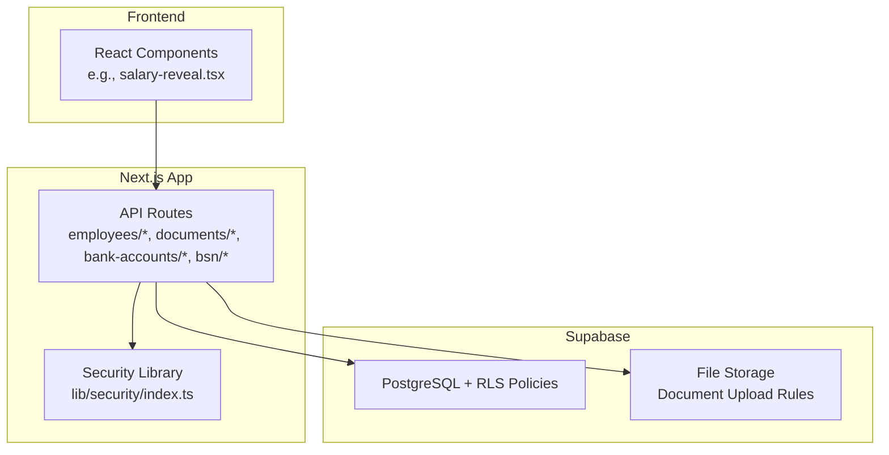
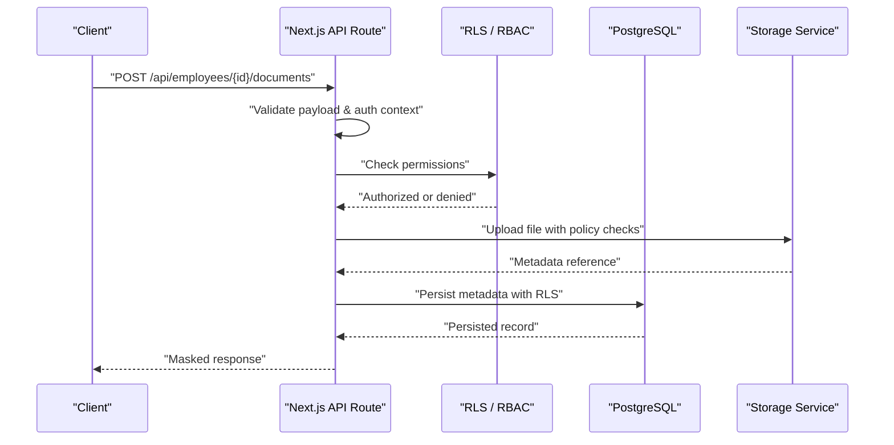
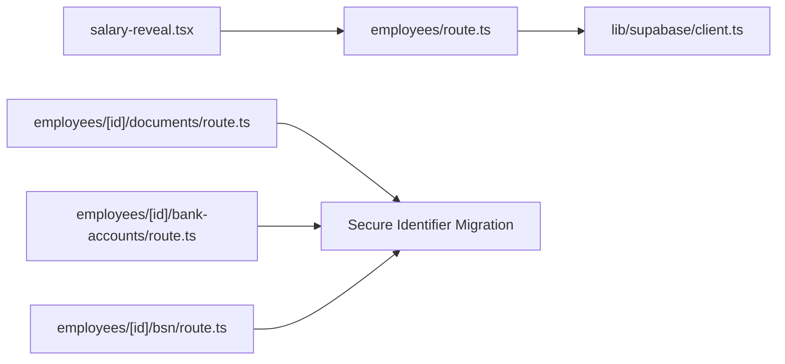

# Data Protection

<cite>
**Referenced Files in This Document**
- [lib/security/index.ts](file://apps/hr-suite/lib/security/index.ts)
- [lib/supabase/client.ts](file://apps/hr-suite/lib/supabase/client.ts)
- [supabase/migrations/20260715124506_isolate_employee_secure_identifiers.sql](file://apps/hr-suite/supabase/migrations/20260715124506_isolate_employee_secure_identifiers.sql)
- [supabase/migrations/20260719101500_refine_employee_document_upload_rules.sql](file://apps/hr-suite/supabase/migrations/20260719101500_refine_employee_document_upload_rules.sql)
- [supabase/tests/employee_secure_identifiers.sql](file://apps/hr-suite/supabase/tests/employee_secure_identifiers.sql)
- [supabase/tests/employee_document_upload_rules.sql](file://apps/hr-suite/supabase/tests/employee_document_upload_rules.sql)
- [app/api/employees/route.ts](file://apps/hr-suite/app/api/employees/route.ts)
- [app/api/employees/[employeeId]/route.ts](file://apps/hr-suite/app/api/employees/[employeeId]/route.ts)
- [app/api/employees/[employeeId]/documents/route.ts](file://apps/hr-suite/app/api/employees/[employeeId]/documents/route.ts)
- [app/api/employees/[employeeId]/bank-accounts/route.ts](file://apps/hr-suite/app/api/employees/[employeeId]/bank-accounts/route.ts)
- [app/api/employees/[employeeId]/bsn/route.ts](file://apps/hr-suite/app/api/employees/[employeeId]/bsn/route.ts)
- [components/employees/salary-reveal.tsx](file://apps/hr-suite/components/employees/salary-reveal.tsx)
- [messages/en/validation.json](file://apps/hr-suite/messages/en/validation.json)
- [supabase/config.toml](file://apps/hr-suite/supabase/config.toml)
</cite>

## Table of Contents
1. [Introduction](#introduction)
2. [Project Structure](#project-structure)
3. [Core Components](#core-components)
4. [Architecture Overview](#architecture-overview)
5. [Detailed Component Analysis](#detailed-component-analysis)
6. [Dependency Analysis](#dependency-analysis)
7. [Performance Considerations](#performance-considerations)
8. [Troubleshooting Guide](#troubleshooting-guide)
9. [Conclusion](#conclusion)
10. [Appendices](#appendices)

## Introduction
This document provides comprehensive data protection guidance for LiquidHR, focusing on encryption strategies, input validation and sanitization, SQL injection prevention, XSS protection, secure API design, request/response filtering, data masking, GDPR compliance, data retention, and secure deletion procedures. It synthesizes the repository’s security-related code, database policies, and configuration to present actionable practices for protecting sensitive HR data such as employee personal information, salary data, and confidential documents.

## Project Structure
LiquidHR is a Next.js application with server-side API routes under apps/hr-suite/app/api, Supabase-managed database migrations and tests under apps/hr-suite/supabase, and shared libraries under apps/hr-suite/lib. Security-critical areas include:
- API routes handling employees, documents, bank accounts, and BSN (Dutch tax ID).
- Database migrations defining RLS policies and isolation of secure identifiers.
- A dedicated security library for utilities.
- UI components that control visibility of sensitive fields like salary.
- Validation messages used across forms.

**Diagram sources**
- [app/api/employees/route.ts](file://apps/hr-suite/app/api/employees/route.ts)
- [app/api/employees/[employeeId]/documents/route.ts](file://apps/hr-suite/app/api/employees/[employeeId]/documents/route.ts)
- [app/api/employees/[employeeId]/bank-accounts/route.ts](file://apps/hr-suite/app/api/employees/[employeeId]/bank-accounts/route.ts)
- [app/api/employees/[employeeId]/bsn/route.ts](file://apps/hr-suite/app/api/employees/[employeeId]/bsn/route.ts)
- [lib/security/index.ts](file://apps/hr-suite/lib/security/index.ts)
- [supabase/migrations/20260715124506_isolate_employee_secure_identifiers.sql](file://apps/hr-suite/supabase/migrations/20260715124506_isolate_employee_secure_identifiers.sql)
- [supabase/migrations/20260719101500_refine_employee_document_upload_rules.sql](file://apps/hr-suite/supabase/migrations/20260719101500_refine_employee_document_upload_rules.sql)

**Section sources**
- [app/api/employees/route.ts](file://apps/hr-suite/app/api/employees/route.ts)
- [app/api/employees/[employeeId]/route.ts](file://apps/hr-suite/app/api/employees/[employeeId]/route.ts)
- [lib/security/index.ts](file://apps/hr-suite/lib/security/index.ts)
- [supabase/migrations/20260715124506_isolate_employee_secure_identifiers.sql](file://apps/hr-suite/supabase/migrations/20260715124506_isolate_employee_secure_identifiers.sql)
- [supabase/migrations/20260719101500_refine_employee_document_upload_rules.sql](file://apps/hr-suite/supabase/migrations/20260719101500_refine_employee_document_upload_rules.sql)

## Core Components
- Secure Identifier Isolation: Database-level separation of highly sensitive employee identifiers via dedicated tables or columns and strict RLS policies.
- Document Upload Controls: File upload rules enforcing allowed types, sizes, and access scopes.
- API Route Security: Centralized validation, authorization checks, and response filtering to prevent leakage of sensitive fields.
- UI Data Masking: Controlled reveal mechanisms for sensitive data such as salary.
- Validation Messages: Centralized i18n strings for consistent error messaging.

Key implementation references:
- Secure identifier isolation migration and tests.
- Document upload policy migration and tests.
- Employee API routes for CRUD and sensitive subresources.
- Salary reveal component controlling visibility.
- Validation message catalog.

**Section sources**
- [supabase/migrations/20260715124506_isolate_employee_secure_identifiers.sql](file://apps/hr-suite/supabase/migrations/20260715124506_isolate_employee_secure_identifiers.sql)
- [supabase/tests/employee_secure_identifiers.sql](file://apps/hr-suite/supabase/tests/employee_secure_identifiers.sql)
- [supabase/migrations/20260719101500_refine_employee_document_upload_rules.sql](file://apps/hr-suite/supabase/migrations/20260719101500_refine_employee_document_upload_rules.sql)
- [supabase/tests/employee_document_upload_rules.sql](file://apps/hr-suite/supabase/tests/employee_document_upload_rules.sql)
- [app/api/employees/route.ts](file://apps/hr-suite/app/api/employees/route.ts)
- [app/api/employees/[employeeId]/route.ts](file://apps/hr-suite/app/api/employees/[employeeId]/route.ts)
- [components/employees/salary-reveal.tsx](file://apps/hr-suite/components/employees/salary-reveal.tsx)
- [messages/en/validation.json](file://apps/hr-suite/messages/en/validation.json)

## Architecture Overview
The data protection architecture enforces defense-in-depth across layers:
- Input Validation at API boundaries ensures only well-formed requests are processed.
- Authorization via Supabase RLS restricts row-level access based on tenant, role, and ownership.
- Sensitive data isolation at the database level prevents accidental exposure.
- Response filtering masks sensitive fields before returning to clients.
- Secure file storage policies limit upload types, sizes, and access paths.
- UI controls enforce least-privilege visibility for sensitive fields.

**Diagram sources**
- [app/api/employees/[employeeId]/documents/route.ts](file://apps/hr-suite/app/api/employees/[employeeId]/documents/route.ts)
- [supabase/migrations/20260719101500_refine_employee_document_upload_rules.sql](file://apps/hr-suite/supabase/migrations/20260719101500_refine_employee_document_upload_rules.sql)

## Detailed Component Analysis

### Encryption Strategy
- At-Rest Encryption: Leverage Supabase/PostgreSQL managed encryption by default; ensure no plaintext secrets are stored in environment variables or code.
- In-Transit Encryption: Enforce HTTPS/TLS for all API endpoints and client connections.
- Field-Level Encryption: For highly sensitive fields (e.g., BSN, bank account details), consider encrypting values at rest using application-managed keys or KMS-backed services, with decryption only within authorized server contexts.
- Key Management: Use secure secret management (e.g., platform secret stores) and rotate keys periodically.

Implementation references:
- Secure identifier isolation migration indicates separation of sensitive data, which can be extended to encrypted storage patterns.
- Supabase configuration for connection settings.

**Section sources**
- [supabase/migrations/20260715124506_isolate_employee_secure_identifiers.sql](file://apps/hr-suite/supabase/migrations/20260715124506_isolate_employee_secure_identifiers.sql)
- [supabase/config.toml](file://apps/hr-suite/supabase/config.toml)

### Input Validation and Sanitization
- Schema Validation: Validate all incoming payloads against strict schemas before processing. Reject malformed or unexpected fields.
- Sanitization: Strip dangerous characters and normalize inputs where appropriate. Avoid executing or storing raw user content without sanitization.
- Consistent Errors: Use centralized validation messages to provide clear feedback.

References:
- Validation messages catalog for consistent error text.
- API route handlers should implement schema validation prior to business logic.

**Section sources**
- [messages/en/validation.json](file://apps/hr-suite/messages/en/validation.json)
- [app/api/employees/route.ts](file://apps/hr-suite/app/api/employees/route.ts)

### SQL Injection Prevention
- Parameterized Queries: Always use parameterized queries or ORM methods provided by Supabase client.
- Policy Enforcement: RLS policies define safe access patterns and reduce risk of ad-hoc query construction.
- Avoid Dynamic SQL: Do not concatenate user input into SQL strings.

References:
- Supabase client usage in API routes.
- RLS policies defined in migrations.

**Section sources**
- [lib/supabase/client.ts](file://apps/hr-suite/lib/supabase/client.ts)
- [supabase/migrations/20260715124506_isolate_employee_secure_identifiers.sql](file://apps/hr-suite/supabase/migrations/20260715124506_isolate_employee_secure_identifiers.sql)

### XSS Protection Measures
- Content Security Policy: Configure CSP headers to restrict script execution and resource loading.
- Output Encoding: Ensure responses encode HTML entities when rendering user-generated content.
- Avoid Inline Scripts: Prefer static assets and avoid injecting untrusted content directly into DOM.

References:
- Next.js app configuration and global styles may influence headers and rendering behavior.

**Section sources**
- [apps/hr-suite/app/layout.tsx](file://apps/hr-suite/app/layout.tsx)
- [apps/hr-suite/app/globals.css](file://apps/hr-suite/app/globals.css)

### Secure API Endpoint Design
- Authentication and Authorization: Verify user identity and roles before processing requests. Enforce tenant isolation.
- Request Filtering: Accept only whitelisted fields; ignore unknown properties.
- Response Filtering: Remove sensitive fields from responses unless explicitly permitted.
- Rate Limiting: Apply rate limits to protect against abuse.

References:
- Employee API routes handle CRUD operations and sensitive subresources.
- Bank accounts and BSN endpoints require strict access controls.

**Section sources**
- [app/api/employees/route.ts](file://apps/hr-suite/app/api/employees/route.ts)
- [app/api/employees/[employeeId]/route.ts](file://apps/hr-suite/app/api/employees/[employeeId]/route.ts)
- [app/api/employees/[employeeId]/bank-accounts/route.ts](file://apps/hr-suite/app/api/employees/[employeeId]/bank-accounts/route.ts)
- [app/api/employees/[employeeId]/bsn/route.ts](file://apps/hr-suite/app/api/employees/[employeeId]/bsn/route.ts)

### Data Masking for Sensitive Fields
- Salary Reveal Control: Implement explicit user actions to reveal sensitive data, ensuring it is masked by default.
- Conditional Rendering: Only render sensitive fields when the current user has permission and has requested visibility.

References:
- Salary reveal component demonstrates controlled visibility.

**Section sources**
- [components/employees/salary-reveal.tsx](file://apps/hr-suite/components/employees/salary-reveal.tsx)

### Secure File Upload Handling
- Allowed Types and Sizes: Restrict file types and maximum size to mitigate malicious uploads.
- Path Isolation: Store files in tenant-scoped directories and validate ownership.
- Access Control: Enforce read/write policies through storage rules.

References:
- Document upload rules migration defines constraints and policies.

**Section sources**
- [supabase/migrations/20260719101500_refine_employee_document_upload_rules.sql](file://apps/hr-suite/supabase/migrations/20260719101500_refine_employee_document_upload_rules.sql)
- [app/api/employees/[employeeId]/documents/route.ts](file://apps/hr-suite/app/api/employees/[employeeId]/documents/route.ts)

### GDPR Compliance Measures
- Lawful Basis and Consent: Record consent and lawful basis for processing personal data.
- Data Minimization: Collect only necessary data; mask or omit unnecessary fields in responses.
- Right to Access and Erasure: Provide APIs to retrieve and delete personal data upon request.
- Data Portability: Support exporting data in standard formats.

References:
- Secure identifier isolation and document upload policies support minimization and controlled access.

**Section sources**
- [supabase/migrations/20260715124506_isolate_employee_secure_identifiers.sql](file://apps/hr-suite/supabase/migrations/20260715124506_isolate_employee_secure_identifiers.sql)
- [supabase/migrations/20260719101500_refine_employee_document_upload_rules.sql](file://apps/hr-suite/supabase/migrations/20260719101500_refine_employee_document_upload_rules.sql)

### Data Retention Policies
- Retention Rules: Define retention periods per data category (e.g., employee records, logs, documents).
- Automated Purging: Schedule jobs to archive or delete expired data securely.
- Audit Trails: Maintain immutable logs of deletions and archival actions.

References:
- Migrations and tests demonstrate structured data models suitable for retention enforcement.

**Section sources**
- [supabase/tests/employee_secure_identifiers.sql](file://apps/hr-suite/supabase/tests/employee_secure_identifiers.sql)
- [supabase/tests/employee_document_upload_rules.sql](file://apps/hr-suite/supabase/tests/employee_document_upload_rules.sql)

### Secure Data Deletion Procedures
- Soft Deletes vs Hard Deletes: Use soft deletes for auditability and hard deletes for compliance when required.
- Cascading Deletions: Ensure dependent records are handled consistently.
- Verification: Confirm successful deletion and log outcomes.

References:
- Employee and document endpoints should implement deletion flows with proper authorization and logging.

**Section sources**
- [app/api/employees/[employeeId]/route.ts](file://apps/hr-suite/app/api/employees/[employeeId]/route.ts)
- [app/api/employees/[employeeId]/documents/route.ts](file://apps/hr-suite/app/api/employees/[employeeId]/documents/route.ts)

## Dependency Analysis
Security dependencies span API routes, database policies, and UI components:
- API routes depend on Supabase client for database interactions and enforce authorization.
- Database policies isolate secure identifiers and govern document access.
- UI components enforce visibility controls for sensitive data.

**Diagram sources**
- [app/api/employees/route.ts](file://apps/hr-suite/app/api/employees/route.ts)
- [app/api/employees/[employeeId]/documents/route.ts](file://apps/hr-suite/app/api/employees/[employeeId]/documents/route.ts)
- [app/api/employees/[employeeId]/bank-accounts/route.ts](file://apps/hr-suite/app/api/employees/[employeeId]/bank-accounts/route.ts)
- [app/api/employees/[employeeId]/bsn/route.ts](file://apps/hr-suite/app/api/employees/[employeeId]/bsn/route.ts)
- [lib/supabase/client.ts](file://apps/hr-suite/lib/supabase/client.ts)
- [supabase/migrations/20260715124506_isolate_employee_secure_identifiers.sql](file://apps/hr-suite/supabase/migrations/20260715124506_isolate_employee_secure_identifiers.sql)

**Section sources**
- [app/api/employees/route.ts](file://apps/hr-suite/app/api/employees/route.ts)
- [lib/supabase/client.ts](file://apps/hr-suite/lib/supabase/client.ts)
- [supabase/migrations/20260715124506_isolate_employee_secure_identifiers.sql](file://apps/hr-suite/supabase/migrations/20260715124506_isolate_employee_secure_identifiers.sql)

## Performance Considerations
- Minimize Sensitive Data Exposure: Return only necessary fields to reduce payload size and risk.
- Efficient Querying: Use indexes and RLS policies to optimize access while maintaining security.
- Caching Strategies: Cache non-sensitive aggregated data; avoid caching sensitive fields unless properly secured.

[No sources needed since this section provides general guidance]

## Troubleshooting Guide
Common issues and resolutions:
- Unauthorized Access: Verify RLS policies and user roles; ensure tenant isolation is enforced.
- Validation Failures: Check schema definitions and error messages; ensure client sends expected fields.
- Upload Rejections: Confirm file type and size restrictions; review storage policies.
- Data Leakage: Inspect response filters; ensure sensitive fields are masked or excluded.

**Section sources**
- [supabase/tests/employee_secure_identifiers.sql](file://apps/hr-suite/supabase/tests/employee_secure_identifiers.sql)
- [supabase/tests/employee_document_upload_rules.sql](file://apps/hr-suite/supabase/tests/employee_document_upload_rules.sql)
- [messages/en/validation.json](file://apps/hr-suite/messages/en/validation.json)

## Conclusion
LiquidHR implements a layered security model combining API validation, RLS-based authorization, secure identifier isolation, controlled file uploads, and UI-driven data masking. Extending these foundations with field-level encryption, robust key management, and automated retention/deletion workflows will further strengthen data protection and GDPR compliance.

[No sources needed since this section summarizes without analyzing specific files]

## Appendices

### Example Data Validation Schemas
- Employee Creation: Validate name, email, date of birth, and employment details; reject unknown fields.
- Document Upload: Validate file type, size, and employee association; enforce tenant scope.
- Bank Account Update: Validate IBAN/SWIFT formats; ensure ownership and authorization.

References:
- Validation messages and API route handlers.

**Section sources**
- [messages/en/validation.json](file://apps/hr-suite/messages/en/validation.json)
- [app/api/employees/route.ts](file://apps/hr-suite/app/api/employees/route.ts)
- [app/api/employees/[employeeId]/documents/route.ts](file://apps/hr-suite/app/api/employees/[employeeId]/documents/route.ts)

### Encryption Implementation Patterns
- Encrypt sensitive fields at application layer before persisting to database.
- Decrypt only within authorized server functions; never expose keys to clients.
- Rotate keys and re-encrypt existing data during maintenance windows.

References:
- Secure identifier isolation migration suggests separation patterns adaptable to encryption.

**Section sources**
- [supabase/migrations/20260715124506_isolate_employee_secure_identifiers.sql](file://apps/hr-suite/supabase/migrations/20260715124506_isolate_employee_secure_identifiers.sql)

### Secure File Upload Handling Checklist
- Whitelist allowed MIME types and extensions.
- Enforce maximum file size limits.
- Validate ownership and tenant context.
- Store files in isolated, scoped directories.
- Log upload events and errors.

**Section sources**
- [supabase/migrations/20260719101500_refine_employee_document_upload_rules.sql](file://apps/hr-suite/supabase/migrations/20260719101500_refine_employee_document_upload_rules.sql)
- [app/api/employees/[employeeId]/documents/route.ts](file://apps/hr-suite/app/api/employees/[employeeId]/documents/route.ts)