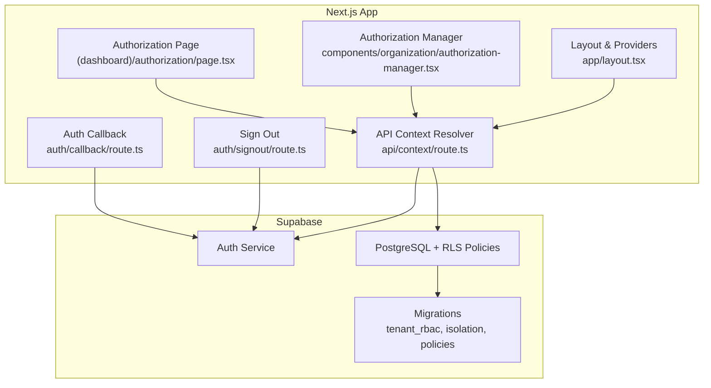
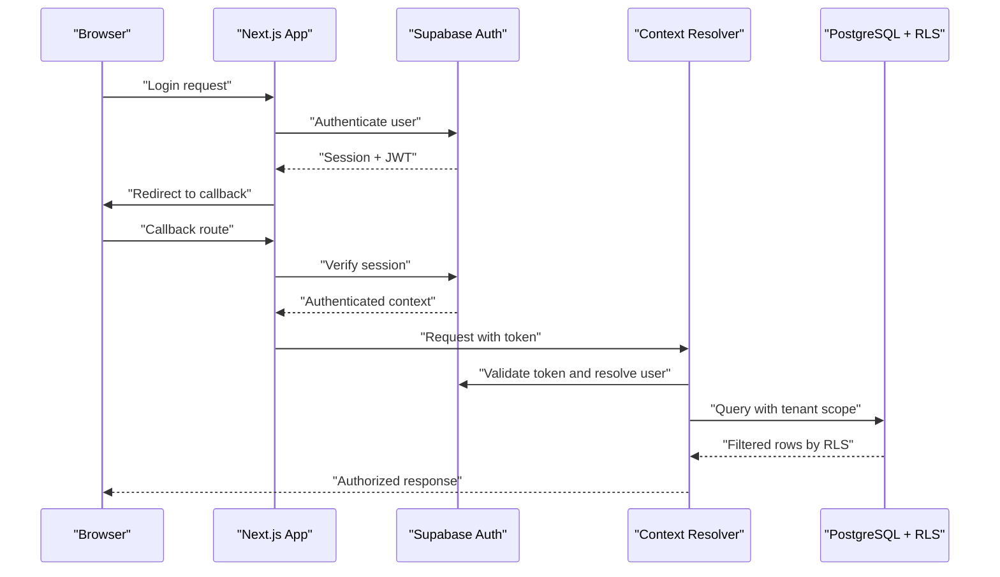
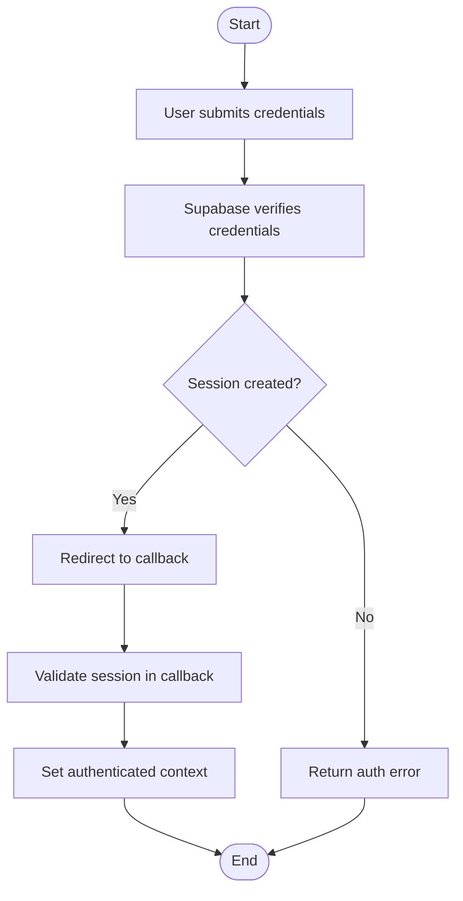
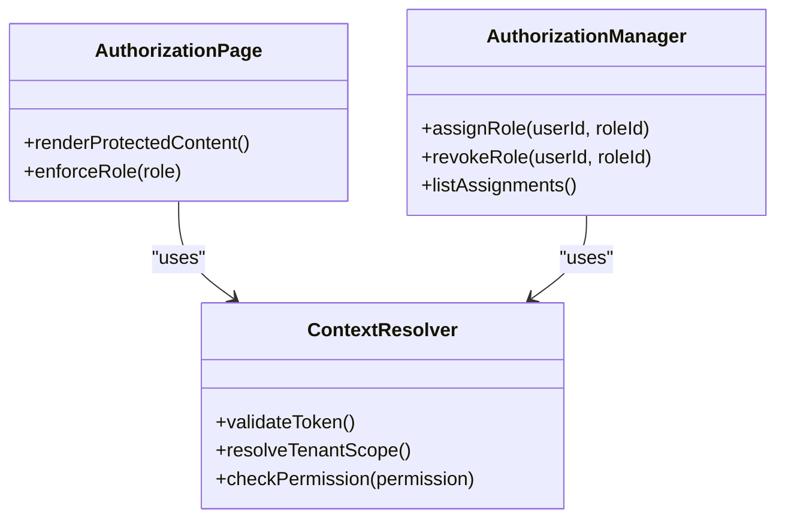
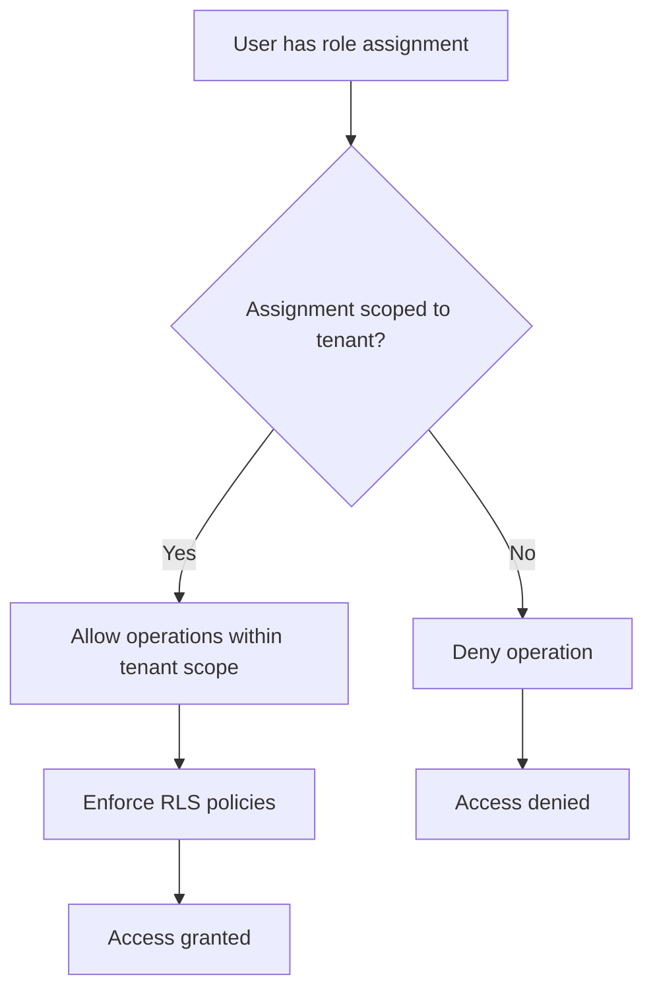
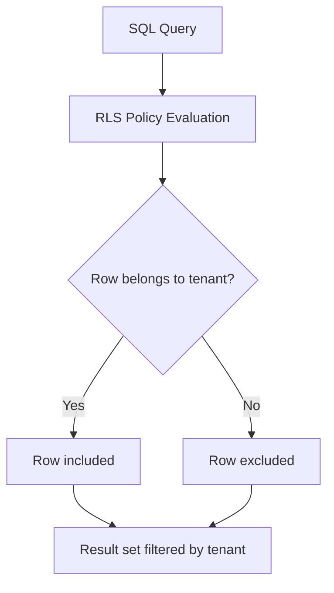
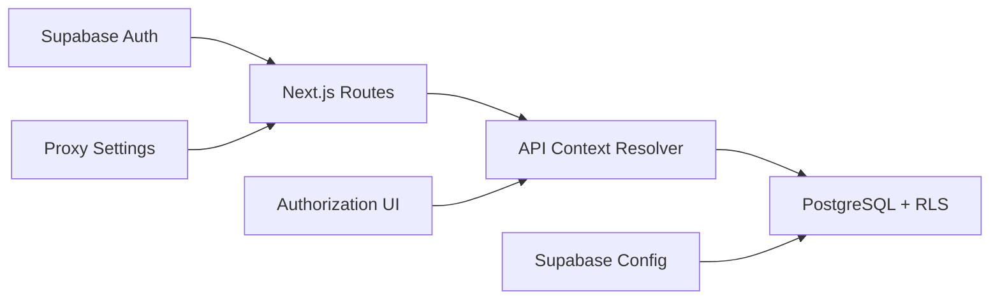

# Security Architecture

<cite>
**Referenced Files in This Document**
- [apps/hr-suite/app/auth/callback/route.ts](file://apps/hr-suite/app/auth/callback/route.ts)
- [apps/hr-suite/app/auth/signout/route.ts](file://apps/hr-suite/app/auth/signout/route.ts)
- [apps/hr-suite/app/api/context/route.ts](file://apps/hr-suite/app/api/context/route.ts)
- [apps/hr-suite/app/(dashboard)/authorization/page.tsx](file://apps/hr-suite/app/(dashboard)/authorization/page.tsx)
- [apps/hr-suite/components/organization/authorization-manager.tsx](file://apps/hr-suite/components/organization/authorization-manager.tsx)
- [apps/hr-suite/lib/security/index.ts](file://apps/hr-suite/lib/security/index.ts)
- [apps/hr-suite/supabase/migrations/20260712124911_add_tenant_rbac_and_organization.sql](file://apps/hr-suite/supabase/migrations/20260712124911_add_tenant_rbac_and_organization.sql)
- [apps/hr-suite/supabase/migrations/20260715124506_isolate_employee_secure_identifiers.sql](file://apps/hr-suite/supabase/migrations/20260715124506_isolate_employee_secure_identifiers.sql)
- [apps/hr-suite/supabase/migrations/20260718131000_harden_hr_master_data_document_policies.sql](file://apps/hr-suite/supabase/migrations/20260718131000_harden_hr_master_data_document_policies.sql)
- [apps/hr-suite/supabase/migrations/20260724160000_add_role_assignment_scope.sql](file://apps/hr-suite/supabase/migrations/20260724160000_add_role_assignment_scope.sql)
- [apps/hr-suite/supabase/config.toml](file://apps/hr-suite/supabase/config.toml)
- [apps/hr-suite/proxy.ts](file://apps/hr-suite/proxy.ts)
- [apps/hr-suite/app/layout.tsx](file://apps/hr-suite/app/layout.tsx)
</cite>

## Table of Contents
1. [Introduction](#introduction)
2. [Project Structure](#project-structure)
3. [Core Components](#core-components)
4. [Architecture Overview](#architecture-overview)
5. [Detailed Component Analysis](#detailed-component-analysis)
6. [Dependency Analysis](#dependency-analysis)
7. [Performance Considerations](#performance-considerations)
8. [Troubleshooting Guide](#troubleshooting-guide)
9. [Conclusion](#conclusion)
10. [Appendices](#appendices)

## Introduction
This document describes the security architecture of LiquidHR, focusing on authentication with Supabase Auth, role-based access control (RBAC), Row Level Security (RLS) for tenant isolation, authorization checks, and data protection measures. It explains how session management, password policies, input validation, SQL injection prevention, and audit logging are implemented or enforced across the application and database layers. It also provides examples of RLS policy patterns, authentication guards, and authorization checks, along with best practices and compliance considerations for HR data handling.

## Project Structure
Security-related implementation spans several areas:
- Authentication endpoints and callbacks
- API context resolution and middleware-like guards
- RBAC and authorization UI components
- Database migrations defining roles, permissions, and RLS policies
- Supabase configuration and Next.js proxy settings for secure transport

**Diagram sources**
- [apps/hr-suite/app/auth/callback/route.ts](file://apps/hr-suite/app/auth/callback/route.ts)
- [apps/hr-suite/app/auth/signout/route.ts](file://apps/hr-suite/app/auth/signout/route.ts)
- [apps/hr-suite/app/api/context/route.ts](file://apps/hr-suite/app/api/context/route.ts)
- [apps/hr-suite/app/(dashboard)/authorization/page.tsx](file://apps/hr-suite/app/(dashboard)/authorization/page.tsx)
- [apps/hr-suite/components/organization/authorization-manager.tsx](file://apps/hr-suite/components/organization/authorization-manager.tsx)
- [apps/hr-suite/supabase/migrations/20260712124911_add_tenant_rbac_and_organization.sql](file://apps/hr-suite/supabase/migrations/20260712124911_add_tenant_rbac_and_organization.sql)
- [apps/hr-suite/supabase/migrations/20260715124506_isolate_employee_secure_identifiers.sql](file://apps/hr-suite/supabase/migrations/20260715124506_isolate_employee_secure_identifiers.sql)
- [apps/hr-suite/supabase/migrations/20260718131000_harden_hr_master_data_document_policies.sql](file://apps/hr-suite/supabase/migrations/20260718131000_harden_hr_master_data_document_policies.sql)
- [apps/hr-suite/supabase/migrations/20260724160000_add_role_assignment_scope.sql](file://apps/hr-suite/supabase/migrations/20260724160000_add_role_assignment_scope.sql)

**Section sources**
- [apps/hr-suite/app/auth/callback/route.ts](file://apps/hr-suite/app/auth/callback/route.ts)
- [apps/hr-suite/app/auth/signout/route.ts](file://apps/hr-suite/app/auth/signout/route.ts)
- [apps/hr-suite/app/api/context/route.ts](file://apps/hr-suite/app/api/context/route.ts)
- [apps/hr-suite/app/(dashboard)/authorization/page.tsx](file://apps/hr-suite/app/(dashboard)/authorization/page.tsx)
- [apps/hr-suite/components/organization/authorization-manager.tsx](file://apps/hr-suite/components/organization/authorization-manager.tsx)
- [apps/hr-suite/supabase/migrations/20260712124911_add_tenant_rbac_and_organization.sql](file://apps/hr-suite/supabase/migrations/20260712124911_add_tenant_rbac_and_organization.sql)
- [apps/hr-suite/supabase/migrations/20260715124506_isolate_employee_secure_identifiers.sql](file://apps/hr-suite/supabase/migrations/20260715124506_isolate_employee_secure_identifiers.sql)
- [apps/hr-suite/supabase/migrations/20260718131000_harden_hr_master_data_document_policies.sql](file://apps/hr-suite/supabase/migrations/20260718131000_harden_hr_master_data_document_policies.sql)
- [apps/hr-suite/supabase/migrations/20260724160000_add_role_assignment_scope.sql](file://apps/hr-suite/supabase/migrations/20260724160000_add_role_assignment_scope.sql)

## Core Components
- Authentication flow via Supabase Auth:
  - Sign-in and sign-out endpoints manage sessions and tokens.
  - Callback route handles provider redirects and establishes authenticated state.
- Authorization framework:
  - Centralized API context resolver validates user identity and resolves tenant scope.
  - UI components enforce permission checks before rendering sensitive controls.
- RBAC and RLS:
  - Roles and assignments are defined in migrations; RLS policies enforce tenant isolation at the database layer.
  - Role assignment scope ensures operations are limited to permitted tenants and resources.
- Data protection:
  - Secure identifiers and sensitive fields are isolated per tenant.
  - Master data and documents have hardened policies to prevent unauthorized access.

**Section sources**
- [apps/hr-suite/app/auth/callback/route.ts](file://apps/hr-suite/app/auth/callback/route.ts)
- [apps/hr-suite/app/auth/signout/route.ts](file://apps/hr-suite/app/auth/signout/route.ts)
- [apps/hr-suite/app/api/context/route.ts](file://apps/hr-suite/app/api/context/route.ts)
- [apps/hr-suite/app/(dashboard)/authorization/page.tsx](file://apps/hr-suite/app/(dashboard)/authorization/page.tsx)
- [apps/hr-suite/components/organization/authorization-manager.tsx](file://apps/hr-suite/components/organization/authorization-manager.tsx)
- [apps/hr-suite/supabase/migrations/20260712124911_add_tenant_rbac_and_organization.sql](file://apps/hr-suite/supabase/migrations/20260712124911_add_tenant_rbac_and_organization.sql)
- [apps/hr-suite/supabase/migrations/20260715124506_isolate_employee_secure_identifiers.sql](file://apps/hr-suite/supabase/migrations/20260715124506_isolate_employee_secure_identifiers.sql)
- [apps/hr-suite/supabase/migrations/20260718131000_harden_hr_master_data_document_policies.sql](file://apps/hr-suite/supabase/migrations/20260718131000_harden_hr_master_data_document_policies.sql)
- [apps/hr-suite/supabase/migrations/20260724160000_add_role_assignment_scope.sql](file://apps/hr-suite/supabase/migrations/20260724160000_add_role_assignment_scope.sql)

## Architecture Overview
The security architecture combines client-side guards, server-side API context validation, and database-level RLS policies to ensure robust tenant isolation and fine-grained access control.

**Diagram sources**
- [apps/hr-suite/app/auth/callback/route.ts](file://apps/hr-suite/app/auth/callback/route.ts)
- [apps/hr-suite/app/api/context/route.ts](file://apps/hr-suite/app/api/context/route.ts)
- [apps/hr-suite/supabase/migrations/20260712124911_add_tenant_rbac_and_organization.sql](file://apps/hr-suite/supabase/migrations/20260712124911_add_tenant_rbac_and_organization.sql)

## Detailed Component Analysis

### Authentication Flow (Supabase Auth)
- The callback route finalizes authentication by verifying the session and establishing an authenticated context for subsequent requests.
- The sign-out route invalidates the session and clears local state to terminate the user’s active session securely.

**Diagram sources**
- [apps/hr-suite/app/auth/callback/route.ts](file://apps/hr-suite/app/auth/callback/route.ts)
- [apps/hr-suite/app/auth/signout/route.ts](file://apps/hr-suite/app/auth/signout/route.ts)

**Section sources**
- [apps/hr-suite/app/auth/callback/route.ts](file://apps/hr-suite/app/auth/callback/route.ts)
- [apps/hr-suite/app/auth/signout/route.ts](file://apps/hr-suite/app/auth/signout/route.ts)

### Authorization Framework and Guards
- The API context resolver centralizes identity verification and tenant scoping, acting as a guard for protected routes.
- The authorization page and manager component enforce UI-level permission checks based on resolved roles and scopes.

**Diagram sources**
- [apps/hr-suite/app/api/context/route.ts](file://apps/hr-suite/app/api/context/route.ts)
- [apps/hr-suite/app/(dashboard)/authorization/page.tsx](file://apps/hr-suite/app/(dashboard)/authorization/page.tsx)
- [apps/hr-suite/components/organization/authorization-manager.tsx](file://apps/hr-suite/components/organization/authorization-manager.tsx)

**Section sources**
- [apps/hr-suite/app/api/context/route.ts](file://apps/hr-suite/app/api/context/route.ts)
- [apps/hr-suite/app/(dashboard)/authorization/page.tsx](file://apps/hr-suite/app/(dashboard)/authorization/page.tsx)
- [apps/hr-suite/components/organization/authorization-manager.tsx](file://apps/hr-suite/components/organization/authorization-manager.tsx)

### RBAC and Role Assignment Scope
- Migrations define roles, assignments, and scope constraints to ensure users can only act within their assigned tenant boundaries.
- Role assignment scope prevents privilege escalation across tenants and enforces least-privilege access.

**Diagram sources**
- [apps/hr-suite/supabase/migrations/20260712124911_add_tenant_rbac_and_organization.sql](file://apps/hr-suite/supabase/migrations/20260712124911_add_tenant_rbac_and_organization.sql)
- [apps/hr-suite/supabase/migrations/20260724160000_add_role_assignment_scope.sql](file://apps/hr-suite/supabase/migrations/20260724160000_add_role_assignment_scope.sql)

**Section sources**
- [apps/hr-suite/supabase/migrations/20260712124911_add_tenant_rbac_and_organization.sql](file://apps/hr-suite/supabase/migrations/20260712124911_add_tenant_rbac_and_organization.sql)
- [apps/hr-suite/supabase/migrations/20260724160000_add_role_assignment_scope.sql](file://apps/hr-suite/supabase/migrations/20260724160000_add_role_assignment_scope.sql)

### Row Level Security (RLS) Policies for Tenant Isolation
- RLS policies enforce tenant isolation directly in PostgreSQL, ensuring that queries return only rows belonging to the authenticated tenant.
- Secure identifier isolation and hardened master data/document policies further restrict access to sensitive HR data.

**Diagram sources**
- [apps/hr-suite/supabase/migrations/20260715124506_isolate_employee_secure_identifiers.sql](file://apps/hr-suite/supabase/migrations/20260715124506_isolate_employee_secure_identifiers.sql)
- [apps/hr-suite/supabase/migrations/20260718131000_harden_hr_master_data_document_policies.sql](file://apps/hr-suite/supabase/migrations/20260718131000_harden_hr_master_data_document_policies.sql)

**Section sources**
- [apps/hr-suite/supabase/migrations/20260715124506_isolate_employee_secure_identifiers.sql](file://apps/hr-suite/supabase/migrations/20260715124506_isolate_employee_secure_identifiers.sql)
- [apps/hr-suite/supabase/migrations/20260718131000_harden_hr_master_data_document_policies.sql](file://apps/hr-suite/supabase/migrations/20260718131000_harden_hr_master_data_document_policies.sql)

### Data Protection Measures
- Encryption in transit: HTTPS is enforced via the Next.js app and Supabase configuration; the proxy file configures secure routing.
- Encryption at rest: Managed by Supabase Postgres; ensure storage encryption is enabled in the platform settings.
- Input validation: Enforced at API boundaries using typed schemas and strict parsing; avoid raw string concatenation.
- SQL injection prevention: Use parameterized queries and rely on RLS policies; never trust client-supplied values for filtering.

**Section sources**
- [apps/hr-suite/supabase/config.toml](file://apps/hr-suite/supabase/config.toml)
- [apps/hr-suite/proxy.ts](file://apps/hr-suite/proxy.ts)
- [apps/hr-suite/app/layout.tsx](file://apps/hr-suite/app/layout.tsx)

### Audit Logging and Security Events
- Implement audit logging for critical actions such as role assignments, policy changes, and sensitive data access.
- Log events include actor identity, timestamp, action type, target resource, and outcome; store logs in a secure, tamper-evident manner.
- Integrate with centralized logging and alerting systems for anomaly detection and incident response.

[No sources needed since this section provides general guidance]

## Dependency Analysis
Security dependencies span authentication services, API context resolvers, and database policies. Ensuring minimal coupling between these layers reduces attack surface and improves maintainability.

**Diagram sources**
- [apps/hr-suite/app/auth/callback/route.ts](file://apps/hr-suite/app/auth/callback/route.ts)
- [apps/hr-suite/app/api/context/route.ts](file://apps/hr-suite/app/api/context/route.ts)
- [apps/hr-suite/supabase/config.toml](file://apps/hr-suite/supabase/config.toml)
- [apps/hr-suite/proxy.ts](file://apps/hr-suite/proxy.ts)

**Section sources**
- [apps/hr-suite/app/auth/callback/route.ts](file://apps/hr-suite/app/auth/callback/route.ts)
- [apps/hr-suite/app/api/context/route.ts](file://apps/hr-suite/app/api/context/route.ts)
- [apps/hr-suite/supabase/config.toml](file://apps/hr-suite/supabase/config.toml)
- [apps/hr-suite/proxy.ts](file://apps/hr-suite/proxy.ts)

## Performance Considerations
- Prefer database-level filtering via RLS to minimize payload size and reduce client-side processing.
- Cache authorization decisions where appropriate, but invalidate caches on role or policy changes.
- Index frequently queried tenant-scoped columns to optimize RLS policy evaluation.
- Avoid heavy synchronous operations in authentication callbacks to keep login flows responsive.

[No sources needed since this section provides general guidance]

## Troubleshooting Guide
Common issues and mitigations:
- Authentication failures:
  - Verify callback URLs and environment variables for Supabase Auth.
  - Ensure session cookies and tokens are correctly propagated through the proxy.
- Authorization denials:
  - Confirm role assignments and scope constraints match the requested tenant.
  - Review RLS policies for overly restrictive conditions.
- Data isolation breaches:
  - Audit RLS policies and ensure tenant IDs are consistently used in filters.
  - Validate that API context resolver injects correct tenant context into queries.

**Section sources**
- [apps/hr-suite/app/auth/callback/route.ts](file://apps/hr-suite/app/auth/callback/route.ts)
- [apps/hr-suite/app/api/context/route.ts](file://apps/hr-suite/app/api/context/route.ts)
- [apps/hr-suite/supabase/migrations/20260712124911_add_tenant_rbac_and_organization.sql](file://apps/hr-suite/supabase/migrations/20260712124911_add_tenant_rbac_and_organization.sql)

## Conclusion
LiquidHR’s security architecture integrates Supabase Auth, RBAC, and RLS to provide strong tenant isolation and fine-grained access control. By enforcing authorization at both the API and database layers, and by adopting secure defaults for encryption, input validation, and SQL injection prevention, the system protects sensitive HR data effectively. Continuous auditing, monitoring, and adherence to compliance requirements ensure ongoing security and trustworthiness.

[No sources needed since this section summarizes without analyzing specific files]

## Appendices

### Security Best Practices
- Enforce least privilege: assign minimal roles and scopes required for each task.
- Validate all inputs server-side; reject malformed or unexpected data early.
- Use parameterized queries and ORM features to prevent SQL injection.
- Rotate secrets regularly and restrict access to configuration files.
- Monitor and alert on suspicious activities and failed authentication attempts.

[No sources needed since this section provides general guidance]

### Compliance Considerations for HR Data
- Adhere to GDPR and local privacy regulations for employee data handling.
- Implement data retention and deletion policies aligned with legal requirements.
- Provide mechanisms for data subject rights (access, correction, erasure).
- Maintain audit trails for sensitive operations and ensure log integrity.

[No sources needed since this section provides general guidance]