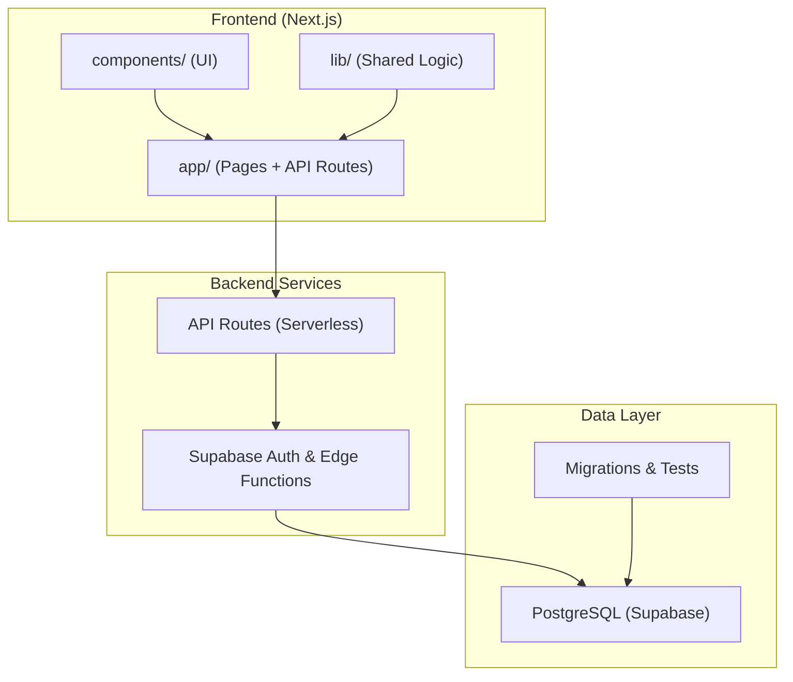
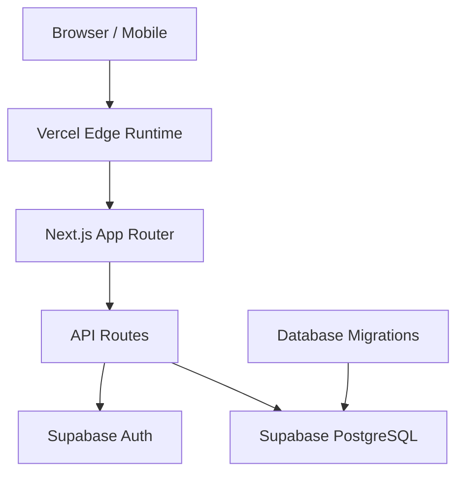
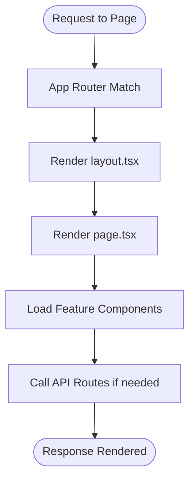
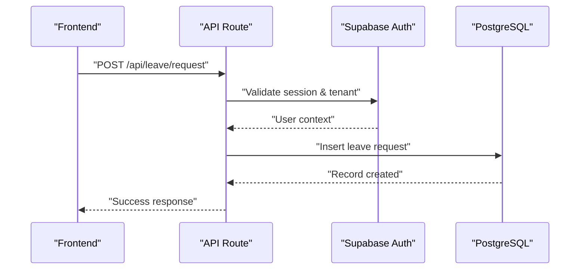
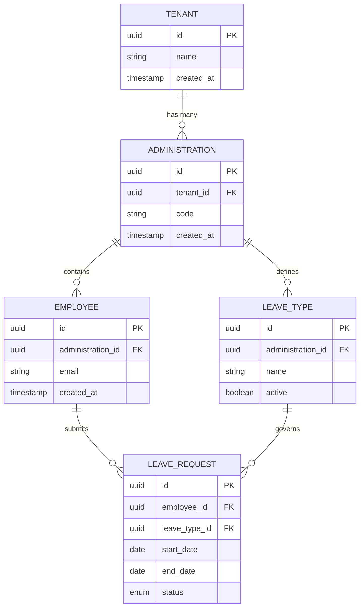
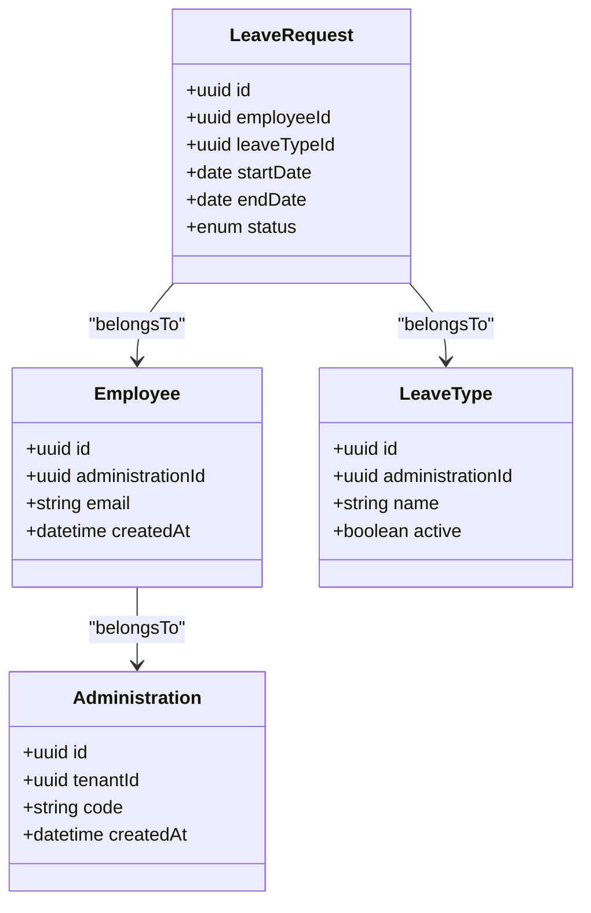
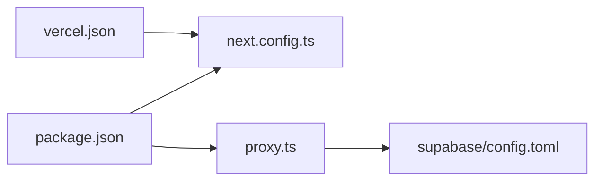

# System Architecture

<cite>
**Referenced Files in This Document**
- [package.json](file://apps/hr-suite/package.json)
- [next.config.ts](file://apps/hr-suite/next.config.ts)
- [vercel.json](file://vercel.json)
- [proxy.ts](file://apps/hr-suite/proxy.ts)
- [layout.tsx](file://apps/hr-suite/app/layout.tsx)
- [page.tsx](file://apps/hr-suite/app/page.tsx)
- [route.ts](file://apps/hr-suite/app/api/context/route.ts)
- [route.ts](file://apps/hr-suite/app/api/employees/route.ts)
- [route.ts](file://apps/hr-suite/app/api/leave/request/route.ts)
- [config.toml](file://apps/hr-suite/supabase/config.toml)
- [20260712124911_add_tenant_rbac_and_organization.sql](file://apps/hr-suite/supabase/migrations/20260712124911_add_tenant_rbac_and_organization.sql)
- [20260714174305_add_multitenancy_administrations.sql](file://apps/hr-suite/supabase/migrations/20260714174305_add_multitenancy_administrations.sql)
- [20260722142551_add_leave_engine_foundation.sql](file://apps/hr-suite/supabase/migrations/20260722142551_add_leave_engine_foundation.sql)
- [types.ts](file://packages/db/types.ts)
</cite>

## Table of Contents
1. [Introduction](#introduction)
2. [Project Structure](#project-structure)
3. [Core Components](#core-components)
4. [Architecture Overview](#architecture-overview)
5. [Detailed Component Analysis](#detailed-component-analysis)
6. [Dependency Analysis](#dependency-analysis)
7. [Performance Considerations](#performance-considerations)
8. [Troubleshooting Guide](#troubleshooting-guide)
9. [Conclusion](#conclusion)

## Introduction
This document describes the system architecture for LiquidHR, a multitenant HR suite built with Next.js 14+ on Vercel and powered by Supabase (PostgreSQL). It explains how frontend components interact with API routes, how business logic is organized, and how data flows to and from the database. It also covers deployment topology, infrastructure boundaries, technology stack decisions, scalability considerations, performance strategies, and monitoring approaches.

## Project Structure
LiquidHR is organized as a Next.js application under apps/hr-suite with:
- app/: Next.js App Router pages and API routes
- components/: Feature-based UI components
- lib/: Shared libraries and utilities
- supabase/: Database migrations, tests, and configuration
- packages/db/: Shared database types used across the project

Key configuration files include package.json (dependencies and scripts), next.config.ts (Next.js settings), vercel.json (Vercel deployment config), and proxy.ts (local development proxying).

**Diagram sources**
- [package.json](file://apps/hr-suite/package.json)
- [next.config.ts](file://apps/hr-suite/next.config.ts)
- [vercel.json](file://vercel.json)
- [proxy.ts](file://apps/hr-suite/proxy.ts)
- [config.toml](file://apps/hr-suite/supabase/config.toml)

**Section sources**
- [package.json](file://apps/hr-suite/package.json)
- [next.config.ts](file://apps/hr-suite/next.config.ts)
- [vercel.json](file://vercel.json)
- [proxy.ts](file://apps/hr-suite/proxy.ts)

## Core Components
- Frontend Application: Next.js App Router provides server-side rendering and routing. Pages render UI and fetch data via API routes or client-side calls.
- API Routes: REST endpoints under app/api handle authentication, authorization, tenant scoping, and business operations.
- Business Logic: Encapsulated in lib modules and invoked by API routes and components.
- Database Layer: PostgreSQL schema defined through migrations; Row-Level Security (RLS) enforces multitenancy and RBAC.
- Multitenancy: Administrations and organization tables scope data per tenant; policies ensure isolation.

**Section sources**
- [layout.tsx](file://apps/hr-suite/app/layout.tsx)
- [page.tsx](file://apps/hr-suite/app/page.tsx)
- [route.ts](file://apps/hr-suite/app/api/context/route.ts)
- [route.ts](file://apps/hr-suite/app/api/employees/route.ts)
- [20260712124911_add_tenant_rbac_and_organization.sql](file://apps/hr-suite/supabase/migrations/20260712124911_add_tenant_rbac_and_organization.sql)
- [20260714174305_add_multitenancy_administrations.sql](file://apps/hr-suite/supabase/migrations/20260714174305_add_multitenancy_administrations.sql)

## Architecture Overview
The system follows a layered architecture:
- Presentation Layer: React components and Next.js pages render the UI.
- API Layer: Serverless API routes process requests, enforce auth and tenant context, and orchestrate business logic.
- Data Layer: Supabase Postgres stores all domain data with RLS policies enforcing security and isolation.

**Diagram sources**
- [vercel.json](file://vercel.json)
- [next.config.ts](file://apps/hr-suite/next.config.ts)
- [route.ts](file://apps/hr-suite/app/api/context/route.ts)
- [config.toml](file://apps/hr-suite/supabase/config.toml)

## Detailed Component Analysis

### Frontend Application (Next.js App Router)
- Layout and Root: The root layout sets up global providers and styles. Pages define routes and compose feature components.
- Routing: File-based routing maps directories to URLs. Loading states are handled via dedicated loading files.
- Internationalization: Messages are organized per locale and loaded by features.

**Diagram sources**
- [layout.tsx](file://apps/hr-suite/app/layout.tsx)
- [page.tsx](file://apps/hr-suite/app/page.tsx)

**Section sources**
- [layout.tsx](file://apps/hr-suite/app/layout.tsx)
- [page.tsx](file://apps/hr-suite/app/page.tsx)

### API Routes and Context
- Context Route: Establishes tenant context, user session, and permissions for subsequent requests.
- Employees Route: Handles employee CRUD operations scoped to the current tenant and role.
- Leave Request Route: Orchestrates leave request creation, validation, and ledger updates.

**Diagram sources**
- [route.ts](file://apps/hr-suite/app/api/context/route.ts)
- [route.ts](file://apps/hr-suite/app/api/employees/route.ts)
- [route.ts](file://apps/hr-suite/app/api/leave/request/route.ts)

**Section sources**
- [route.ts](file://apps/hr-suite/app/api/context/route.ts)
- [route.ts](file://apps/hr-suite/app/api/employees/route.ts)
- [route.ts](file://apps/hr-suite/app/api/leave/request/route.ts)

### Database Schema and Multitenancy
- Tenant and RBAC: Migrations introduce tenants, roles, and organization scoping. Policies enforce row-level access based on tenant membership and roles.
- Administrations: Separate administration entities isolate data per customer or legal entity.
- Leave Engine: Dedicated schema supports leave types, accrual rules, and transaction ledgers.

**Diagram sources**
- [20260712124911_add_tenant_rbac_and_organization.sql](file://apps/hr-suite/supabase/migrations/20260712124911_add_tenant_rbac_and_organization.sql)
- [20260714174305_add_multitenancy_administrations.sql](file://apps/hr-suite/supabase/migrations/20260714174305_add_multitenancy_administrations.sql)
- [20260722142551_add_leave_engine_foundation.sql](file://apps/hr-suite/supabase/migrations/20260722142551_add_leave_engine_foundation.sql)

**Section sources**
- [20260712124911_add_tenant_rbac_and_organization.sql](file://apps/hr-suite/supabase/migrations/20260712124911_add_tenant_rbac_and_organization.sql)
- [20260714174305_add_multitenancy_administrations.sql](file://apps/hr-suite/supabase/migrations/20260714174305_add_multitenancy_administrations.sql)
- [20260722142551_add_leave_engine_foundation.sql](file://apps/hr-suite/supabase/migrations/20260722142551_add_leave_engine_foundation.sql)

### Shared Types and Contracts
- Database Types: Centralized TypeScript definitions for database models ensure type safety between frontend, API, and backend.

**Diagram sources**
- [types.ts](file://packages/db/types.ts)

**Section sources**
- [types.ts](file://packages/db/types.ts)

## Dependency Analysis
Dependencies are managed via npm and configured for Next.js and Supabase integration. Local development uses a proxy to route API calls to Supabase services.

**Diagram sources**
- [package.json](file://apps/hr-suite/package.json)
- [next.config.ts](file://apps/hr-suite/next.config.ts)
- [vercel.json](file://vercel.json)
- [proxy.ts](file://apps/hr-suite/proxy.ts)
- [config.toml](file://apps/hr-suite/supabase/config.toml)

**Section sources**
- [package.json](file://apps/hr-suite/package.json)
- [next.config.ts](file://apps/hr-suite/next.config.ts)
- [vercel.json](file://vercel.json)
- [proxy.ts](file://apps/hr-suite/proxy.ts)
- [config.toml](file://apps/hr-suite/supabase/config.toml)

## Performance Considerations
- Rendering Strategy: Use server-side rendering for initial load and client-side hydration for interactivity.
- Data Fetching: Prefer API routes for server-side data access to leverage caching and reduce payload size.
- Database Optimization: Leverage indexes and RLS policies to minimize query overhead and ensure secure scoping.
- Caching: Utilize Next.js caching headers and Supabase edge functions where appropriate.
- Bundle Size: Tree-shake unused dependencies and split routes to improve load times.

[No sources needed since this section provides general guidance]

## Troubleshooting Guide
- Authentication Issues: Verify Supabase Auth configuration and session handling in API routes.
- Authorization Errors: Check RLS policies and tenant scoping in migrations and policies.
- API Failures: Inspect error responses from API routes and validate input payloads.
- Database Connectivity: Ensure environment variables and proxy settings point to the correct Supabase instance.

**Section sources**
- [route.ts](file://apps/hr-suite/app/api/context/route.ts)
- [20260712124911_add_tenant_rbac_and_organization.sql](file://apps/hr-suite/supabase/migrations/20260712124911_add_tenant_rbac_and_organization.sql)

## Conclusion
LiquidHR’s architecture combines Next.js for a responsive frontend, Supabase for secure backend services, and PostgreSQL for robust data storage. Multitenancy is enforced through clear scoping and policies, ensuring data isolation and security. The modular structure supports scalability and maintainability, while performance optimizations and monitoring practices help deliver a reliable HR platform.