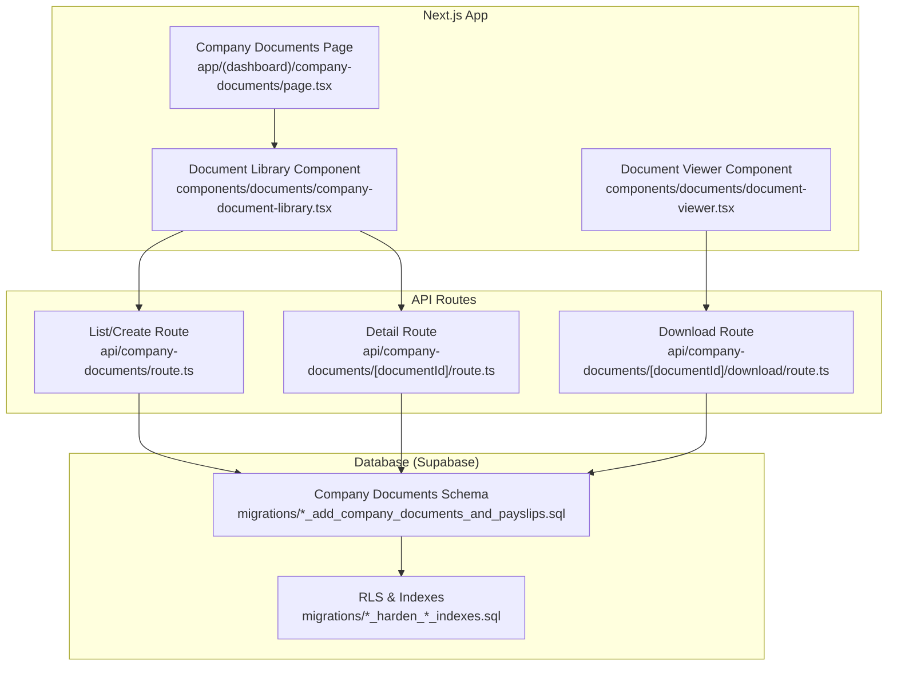
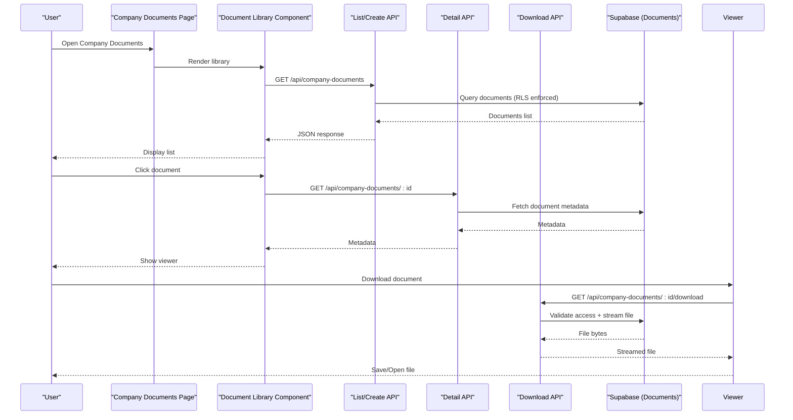
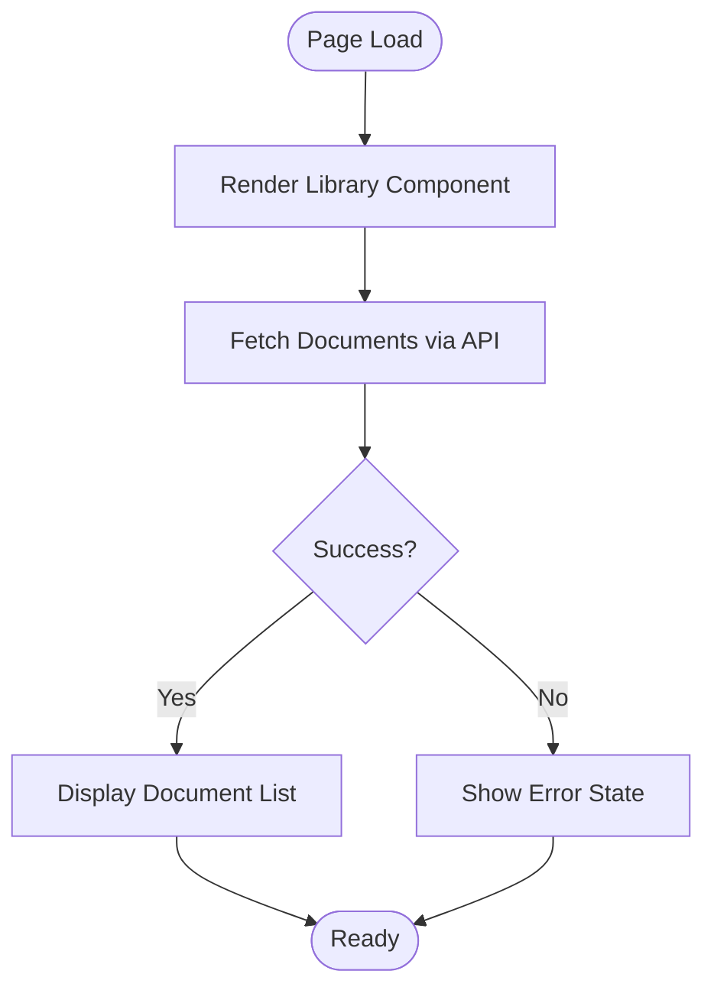
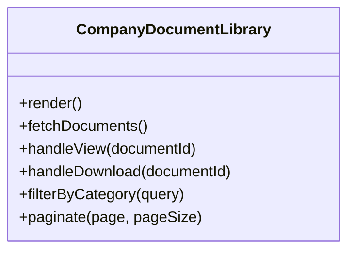
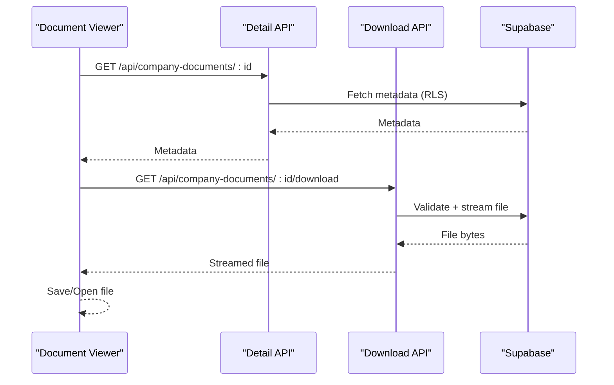
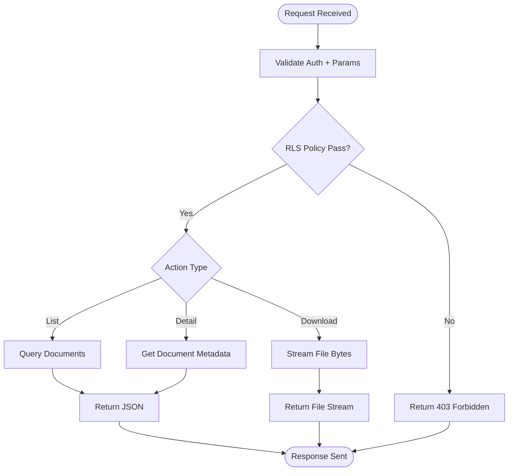
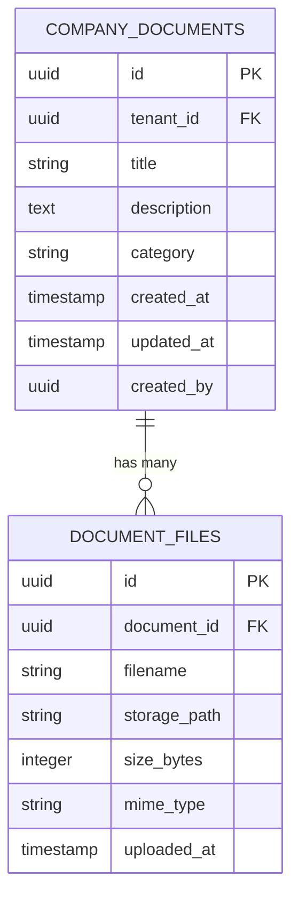
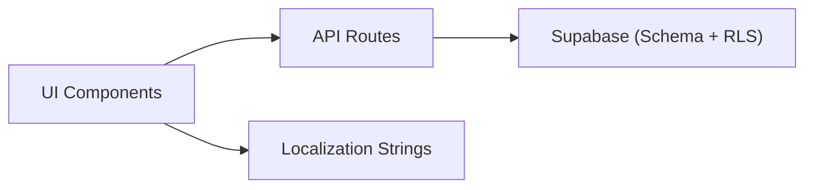

# Company Document Management

<cite>
**Referenced Files in This Document**
- [page.tsx](file://apps/hr-suite/app/(dashboard)/company-documents/page.tsx)
- [route.ts](file://apps/hr-suite/app/api/company-documents/route.ts)
- [route.ts](file://apps/hr-suite/app/api/company-documents/[documentId]/route.ts)
- [route.ts](file://apps/hr-suite/app/api/company-documents/[documentId]/download/route.ts)
- [company-document-library.tsx](file://apps/hr-suite/components/documents/company-document-library.tsx)
- [document-viewer.tsx](file://apps/hr-suite/components/documents/document-viewer.tsx)
- [documents.json](file://apps/hr-suite/messages/en/documents.json)
- [20260726110000_add_company_documents_and_payslips.sql](file://apps/hr-suite/supabase/migrations/20260726110000_add_company_documents_and_payslips.sql)
- [20260726114000_harden_company_documents_payslips_indexes.sql](file://apps/hr-suite/supabase/migrations/20260726114000_harden_company_documents_payslips_indexes.sql)
- [20260727161805_harden_company_document_administration_scope.sql](file://apps/hr-suite/supabase/migrations/20260727161805_harden_company_document_administration_scope.sql)
</cite>

## Table of Contents
1. [Introduction](#introduction)
2. [Project Structure](#project-structure)
3. [Core Components](#core-components)
4. [Architecture Overview](#architecture-overview)
5. [Detailed Component Analysis](#detailed-component-analysis)
6. [Dependency Analysis](#dependency-analysis)
7. [Performance Considerations](#performance-considerations)
8. [Troubleshooting Guide](#troubleshooting-guide)
9. [Conclusion](#conclusion)

## Introduction
This document explains the Company Document Management feature within LiquidHR. It covers how company-wide documents are modeled, stored, accessed, and presented to users through a Next.js application backed by Supabase. The documentation is structured for both technical and non-technical readers, with progressive detail, diagrams, and actionable guidance.

## Project Structure
The Company Document Management feature spans UI pages, API routes, reusable components, localization messages, and database migrations:

- UI page: apps/hr-suite/app/(dashboard)/company-documents/page.tsx
- API routes:
  - apps/hr-suite/app/api/company-documents/route.ts
  - apps/hr-suite/app/api/company-documents/[documentId]/route.ts
  - apps/hr-suite/app/api/company-documents/[documentId]/download/route.ts
- UI components:
  - apps/hr-suite/components/documents/company-document-library.tsx
  - apps/hr-suite/components/documents/document-viewer.tsx
- Localization:
  - apps/hr-suite/messages/en/documents.json
- Database schema and policies (Supabase):
  - apps/hr-suite/supabase/migrations/20260726110000_add_company_documents_and_payslips.sql
  - apps/hr-suite/supabase/migrations/20260726114000_harden_company_documents_payslips_indexes.sql
  - apps/hr-suite/supabase/migrations/20260727161805_harden_company_document_administration_scope.sql

**Diagram sources**
- [page.tsx](file://apps/hr-suite/app/(dashboard)/company-documents/page.tsx)
- [company-document-library.tsx](file://apps/hr-suite/components/documents/company-document-library.tsx)
- [document-viewer.tsx](file://apps/hr-suite/components/documents/document-viewer.tsx)
- [route.ts](file://apps/hr-suite/app/api/company-documents/route.ts)
- [route.ts](file://apps/hr-suite/app/api/company-documents/[documentId]/route.ts)
- [route.ts](file://apps/hr-suite/app/api/company-documents/[documentId]/download/route.ts)
- [20260726110000_add_company_documents_and_payslips.sql](file://apps/hr-suite/supabase/migrations/20260726110000_add_company_documents_and_payslips.sql)
- [20260726114000_harden_company_documents_payslips_indexes.sql](file://apps/hr-suite/supabase/migrations/20260726114000_harden_company_documents_payslips_indexes.sql)

**Section sources**
- [page.tsx](file://apps/hr-suite/app/(dashboard)/company-documents/page.tsx)
- [route.ts](file://apps/hr-suite/app/api/company-documents/route.ts)
- [route.ts](file://apps/hr-suite/app/api/company-documents/[documentId]/route.ts)
- [route.ts](file://apps/hr-suite/app/api/company-documents/[documentId]/download/route.ts)
- [company-document-library.tsx](file://apps/hr-suite/components/documents/company-document-library.tsx)
- [document-viewer.tsx](file://apps/hr-suite/components/documents/document-viewer.tsx)
- [documents.json](file://apps/hr-suite/messages/en/documents.json)
- [20260726110000_add_company_documents_and_payslips.sql](file://apps/hr-suite/supabase/migrations/20260726110000_add_company_documents_and_payslips.sql)
- [20260726114000_harden_company_documents_payslips_indexes.sql](file://apps/hr-suite/supabase/migrations/20260726114000_harden_company_documents_payslips_indexes.sql)
- [20260727161805_harden_company_document_administration_scope.sql](file://apps/hr-suite/supabase/migrations/20260727161805_harden_company_document_administration_scope.sql)

## Core Components
- Company Documents Page: Entry point for browsing and managing company documents. It renders the library and delegates data operations to API routes.
- Document Library Component: Displays a paginated list of company documents with filtering and actions such as viewing or downloading.
- Document Viewer Component: Renders document metadata and provides access to download or preview functionality via API endpoints.
- API Routes:
  - List/Create route handles listing available documents and creating new entries.
  - Detail route retrieves a specific document’s metadata.
  - Download route streams the file content securely based on authorization checks.
- Localization: English labels and messages for the documents module.
- Database Migrations: Define tables, indexes, and Row Level Security (RLS) policies that enforce tenant isolation and role-based access.

**Section sources**
- [page.tsx](file://apps/hr-suite/app/(dashboard)/company-documents/page.tsx)
- [company-document-library.tsx](file://apps/hr-suite/components/documents/company-document-library.tsx)
- [document-viewer.tsx](file://apps/hr-suite/components/documents/document-viewer.tsx)
- [route.ts](file://apps/hr-suite/app/api/company-documents/route.ts)
- [route.ts](file://apps/hr-suite/app/api/company-documents/[documentId]/route.ts)
- [route.ts](file://apps/hr-suite/app/api/company-documents/[documentId]/download/route.ts)
- [documents.json](file://apps/hr-suite/messages/en/documents.json)
- [20260726110000_add_company_documents_and_payslips.sql](file://apps/hr-suite/supabase/migrations/20260726110000_add_company_documents_and_payslips.sql)
- [20260726114000_harden_company_documents_payslips_indexes.sql](file://apps/hr-suite/supabase/migrations/20260726114000_harden_company_documents_payslips_indexes.sql)
- [20260727161805_harden_company_document_administration_scope.sql](file://apps/hr-suite/supabase/migrations/20260727161805_harden_company_document_administration_scope.sql)

## Architecture Overview
The feature follows a standard Next.js App Router pattern with server-side API routes and client-side components. Data flows from the UI to API routes, which validate requests and interact with Supabase. RLS policies ensure secure multi-tenant access.

**Diagram sources**
- [page.tsx](file://apps/hr-suite/app/(dashboard)/company-documents/page.tsx)
- [company-document-library.tsx](file://apps/hr-suite/components/documents/company-document-library.tsx)
- [document-viewer.tsx](file://apps/hr-suite/components/documents/document-viewer.tsx)
- [route.ts](file://apps/hr-suite/app/api/company-documents/route.ts)
- [route.ts](file://apps/hr-suite/app/api/company-documents/[documentId]/route.ts)
- [route.ts](file://apps/hr-suite/app/api/company-documents/[documentId]/download/route.ts)
- [20260726110000_add_company_documents_and_payslips.sql](file://apps/hr-suite/supabase/migrations/20260726110000_add_company_documents_and_payslips.sql)

## Detailed Component Analysis

### Company Documents Page
- Purpose: Serves as the entry point for the Company Documents feature.
- Responsibilities:
  - Renders the Document Library component.
  - Handles initial data fetching and error states.
  - Integrates with i18n for localized labels.

**Diagram sources**
- [page.tsx](file://apps/hr-suite/app/(dashboard)/company-documents/page.tsx)

**Section sources**
- [page.tsx](file://apps/hr-suite/app/(dashboard)/company-documents/page.tsx)

### Document Library Component
- Purpose: Presents a searchable, filterable, and paginated list of company documents.
- Key behaviors:
  - Calls the list/create API endpoint to retrieve documents.
  - Provides actions to open details or initiate downloads.
  - Uses localized strings for labels and messages.

**Diagram sources**
- [company-document-library.tsx](file://apps/hr-suite/components/documents/company-document-library.tsx)

**Section sources**
- [company-document-library.tsx](file://apps/hr-suite/components/documents/company-document-library.tsx)
- [documents.json](file://apps/hr-suite/messages/en/documents.json)

### Document Viewer Component
- Purpose: Displays document metadata and facilitates secure downloads.
- Key behaviors:
  - Retrieves document details via the detail API.
  - Streams the file through the download API.
  - Presents user-friendly messages and loading states.

**Diagram sources**
- [document-viewer.tsx](file://apps/hr-suite/components/documents/document-viewer.tsx)
- [route.ts](file://apps/hr-suite/app/api/company-documents/[documentId]/route.ts)
- [route.ts](file://apps/hr-suite/app/api/company-documents/[documentId]/download/route.ts)

**Section sources**
- [document-viewer.tsx](file://apps/hr-suite/components/documents/document-viewer.tsx)
- [route.ts](file://apps/hr-suite/app/api/company-documents/[documentId]/route.ts)
- [route.ts](file://apps/hr-suite/app/api/company-documents/[documentId]/download/route.ts)

### API Routes
- List/Create Route:
  - Validates request parameters.
  - Queries documents with tenant scoping and RLS enforcement.
  - Supports creation of new document entries.
- Detail Route:
  - Returns metadata for a specific document.
  - Enforces read permissions via RLS.
- Download Route:
  - Validates access rights.
  - Streams the file content securely.

**Diagram sources**
- [route.ts](file://apps/hr-suite/app/api/company-documents/route.ts)
- [route.ts](file://apps/hr-suite/app/api/company-documents/[documentId]/route.ts)
- [route.ts](file://apps/hr-suite/app/api/company-documents/[documentId]/download/route.ts)

**Section sources**
- [route.ts](file://apps/hr-suite/app/api/company-documents/route.ts)
- [route.ts](file://apps/hr-suite/app/api/company-documents/[documentId]/route.ts)
- [route.ts](file://apps/hr-suite/app/api/company-documents/[documentId]/download/route.ts)

### Database Schema and Policies
- Tables:
  - Company documents table stores metadata and references to stored files.
  - Related tables support categorization and audit fields.
- Indexes:
  - Optimized queries for common filters and lookups.
- RLS Policies:
  - Enforce tenant isolation and role-based access.
  - Restrict write operations to authorized administrators.

**Diagram sources**
- [20260726110000_add_company_documents_and_payslips.sql](file://apps/hr-suite/supabase/migrations/20260726110000_add_company_documents_and_payslips.sql)
- [20260726114000_harden_company_documents_payslips_indexes.sql](file://apps/hr-suite/supabase/migrations/20260726114000_harden_company_documents_payslips_indexes.sql)
- [20260727161805_harden_company_document_administration_scope.sql](file://apps/hr-suite/supabase/migrations/20260727161805_harden_company_document_administration_scope.sql)

**Section sources**
- [20260726110000_add_company_documents_and_payslips.sql](file://apps/hr-suite/supabase/migrations/20260726110000_add_company_documents_and_payslips.sql)
- [20260726114000_harden_company_documents_payslips_indexes.sql](file://apps/hr-suite/supabase/migrations/20260726114000_harden_company_documents_payslips_indexes.sql)
- [20260727161805_harden_company_document_administration_scope.sql](file://apps/hr-suite/supabase/migrations/20260727161805_harden_company_document_administration_scope.sql)

## Dependency Analysis
- UI layer depends on API routes for all data operations.
- API routes depend on Supabase client libraries and environment configuration.
- Database layer enforces security via RLS policies; API routes must respect these constraints.
- Localization strings are consumed by UI components for consistent messaging.

**Diagram sources**
- [company-document-library.tsx](file://apps/hr-suite/components/documents/company-document-library.tsx)
- [document-viewer.tsx](file://apps/hr-suite/components/documents/document-viewer.tsx)
- [route.ts](file://apps/hr-suite/app/api/company-documents/route.ts)
- [route.ts](file://apps/hr-suite/app/api/company-documents/[documentId]/route.ts)
- [route.ts](file://apps/hr-suite/app/api/company-documents/[documentId]/download/route.ts)
- [documents.json](file://apps/hr-suite/messages/en/documents.json)

**Section sources**
- [company-document-library.tsx](file://apps/hr-suite/components/documents/company-document-library.tsx)
- [document-viewer.tsx](file://apps/hr-suite/components/documents/document-viewer.tsx)
- [route.ts](file://apps/hr-suite/app/api/company-documents/route.ts)
- [route.ts](file://apps/hr-suite/app/api/company-documents/[documentId]/route.ts)
- [route.ts](file://apps/hr-suite/app/api/company-documents/[documentId]/download/route.ts)
- [documents.json](file://apps/hr-suite/messages/en/documents.json)

## Performance Considerations
- Pagination: Ensure list endpoints return paginated results to reduce payload sizes.
- Indexing: Use appropriate indexes on frequently filtered columns (e.g., category, tenant_id).
- Streaming: Stream large files instead of buffering entire responses.
- Caching: Consider caching static metadata where appropriate while keeping sensitive data fresh.
- Client-Side Optimization: Debounce search inputs and avoid unnecessary re-renders.

[No sources needed since this section provides general guidance]

## Troubleshooting Guide
Common issues and resolutions:
- Access Denied Errors:
  - Verify user roles and RLS policies for the target tenant.
  - Confirm that the document exists and is not archived or deleted.
- Download Failures:
  - Check file existence and storage path validity.
  - Ensure correct MIME type and file permissions.
- Slow List Responses:
  - Review query filters and add missing indexes.
  - Reduce returned fields to only necessary metadata.
- Localization Mismatches:
  - Ensure message keys exist in the localization files.
  - Validate key names across components and messages.

**Section sources**
- [route.ts](file://apps/hr-suite/app/api/company-documents/route.ts)
- [route.ts](file://apps/hr-suite/app/api/company-documents/[documentId]/route.ts)
- [route.ts](file://apps/hr-suite/app/api/company-documents/[documentId]/download/route.ts)
- [documents.json](file://apps/hr-suite/messages/en/documents.json)

## Conclusion
Company Document Management in LiquidHR provides a secure, scalable, and user-friendly way to manage organizational documents. The architecture leverages Next.js API routes and Supabase RLS to enforce robust access control and performance. By following the guidelines and troubleshooting steps outlined here, teams can maintain high reliability and usability for document workflows.

[No sources needed since this section summarizes without analyzing specific files]