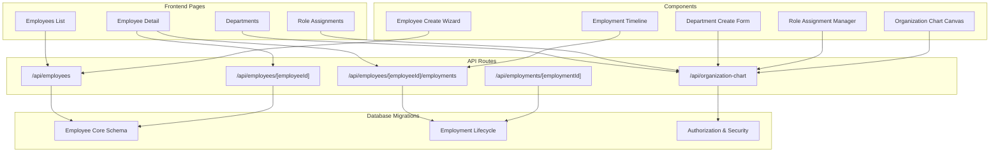
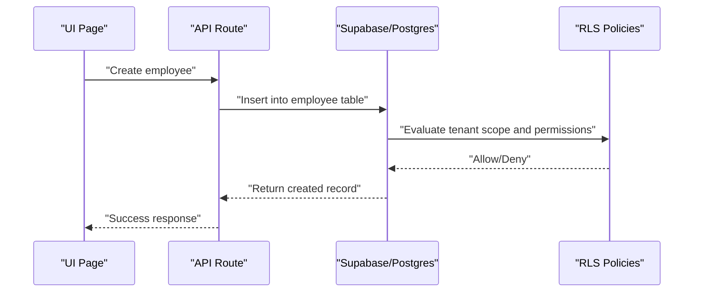
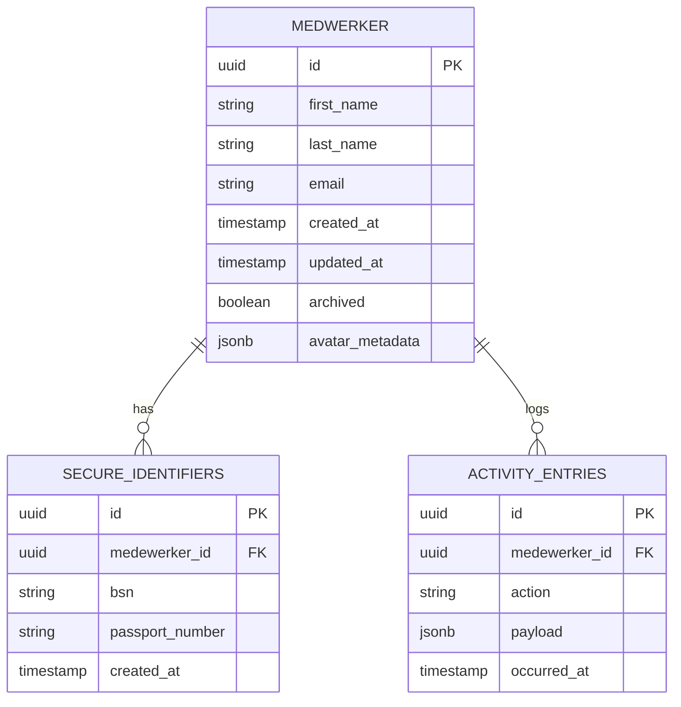
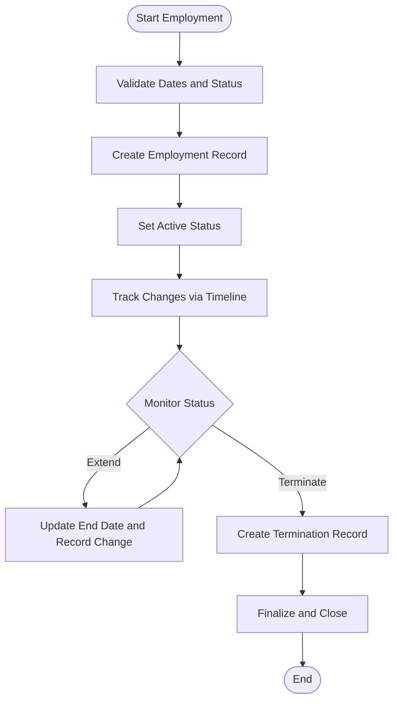
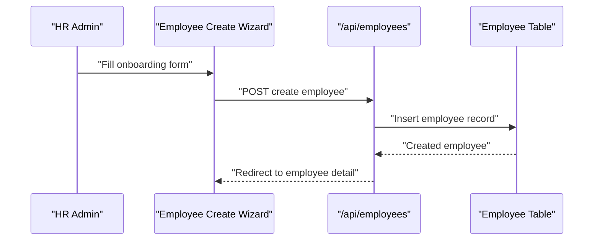
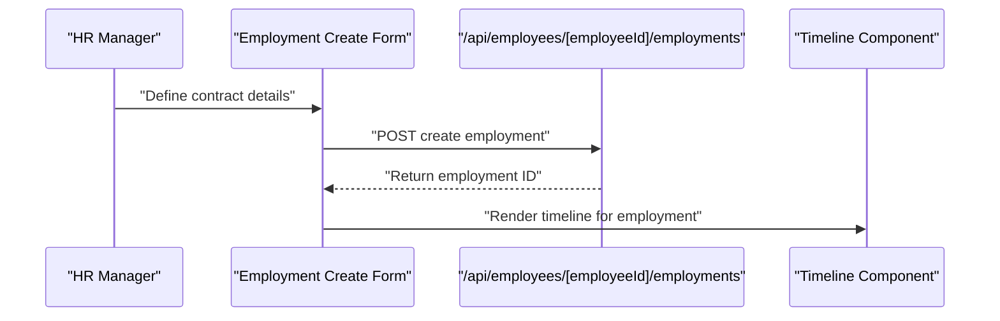
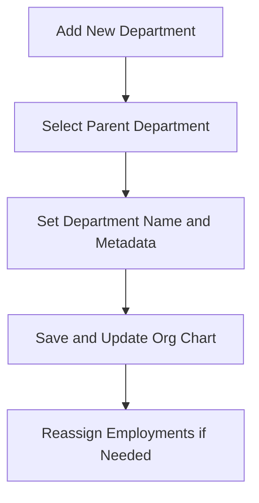
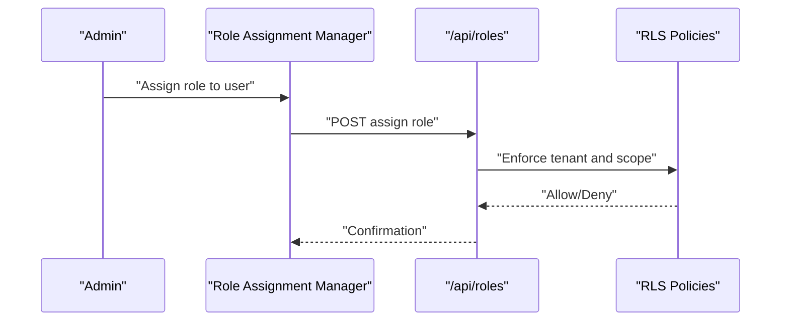
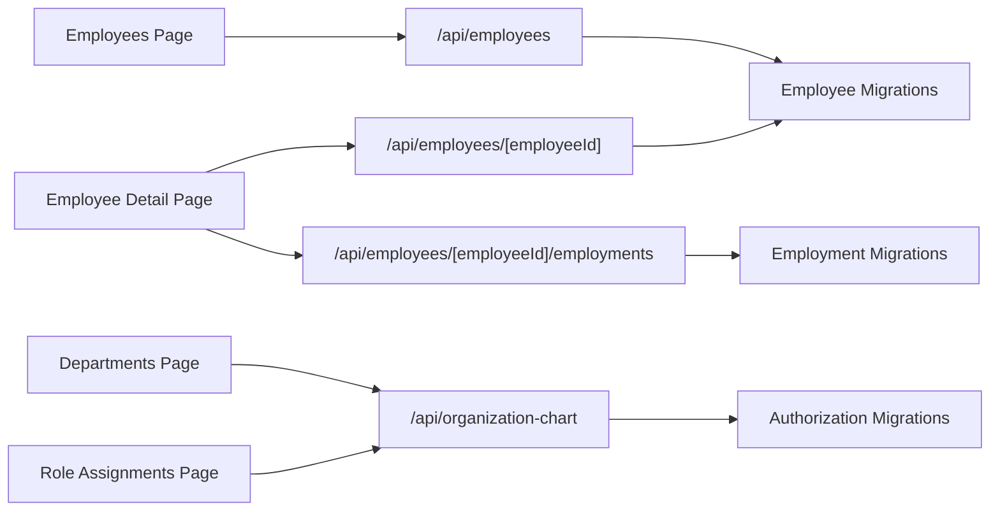

# Core HR Module

<cite>
**Referenced Files in This Document**
- [20260712124858_init_employee_core_hr.sql](file://apps/hr-suite/supabase/migrations/20260712124858_init_employee_core_hr.sql)
- [20260715071156_add_employment_core.sql](file://apps/hr-suite/supabase/migrations/20260715071156_add_employment_core.sql)
- [20260715071422_add_employment_timelines.sql](file://apps/hr-suite/supabase/migrations/20260715071422_add_employment_timelines.sql)
- [20260715071717_add_employment_terminations.sql](file://apps/hr-suite/supabase/migrations/20260715071717_add_employment_terminations.sql)
- [20260715072010_harden_employment_security.sql](file://apps/hr-suite/supabase/migrations/20260715072010_harden_employment_security.sql)
- [20260715120810_complete_employee_core.sql](file://apps/hr-suite/supabase/migrations/20260715120810_complete_employee_core.sql)
- [20260715121304_optimize_employee_core_indexes.sql](file://apps/hr-suite/supabase/migrations/20260715121304_optimize_employee_core_indexes.sql)
- [20260715124506_isolate_employee_secure_identifiers.sql](file://apps/hr-suite/supabase/migrations/20260715124506_isolate_employee_secure_identifiers.sql)
- [20260715130026_index_secure_employee_foreign_keys.sql](file://apps/hr-suite/supabase/migrations/20260715130026_index_secure_employee_foreign_keys.sql)
- [20260715141843_add_employment_change_management.sql](file://apps/hr-suite/supabase/migrations/20260715141843_add_employment_change_management.sql)
- [20260715145432_optimize_employment_change_management.sql](file://apps/hr-suite/supabase/migrations/20260715145432_optimize_employment_change_management.sql)
- [20260718150000_add_employee_archive_and_avatar_state.sql](file://apps/hr-suite/supabase/migrations/20260718150000_add_employee_archive_and_avatar_state.sql)
- [20260724160000_add_employee_activity_entries.sql](file://apps/hr-suite/supabase/migrations/20260724160000_add_employee_activity_entries.sql)
- [20260724172716_harden_employee_activity_entries.sql](file://apps/hr-suite/supabase/migrations/20260724172716_harden_employee_activity_entries.sql)
- [route.ts (employees)](file://apps/hr-suite/app/api/employees/route.ts)
- [route.ts (employee detail)](file://apps/hr-suite/app/api/employees/[employeeId]/route.ts)
- [route.ts (employments)](file://apps/hr-suite/app/api/employees/[employeeId]/employments/route.ts)
- [route.ts (employment detail)](file://apps/hr-suite/app/api/employments/[employmentId]/route.ts)
- [route.ts (organization chart)](file://apps/hr-suite/app/api/organization-chart/route.ts)
- [page.tsx (employees list)](file://apps/hr-suite/app/(dashboard)/employees/page.tsx)
- [page.tsx (employee detail)](file://apps/hr-suite/app/(dashboard)/employees/[employeeId]/page.tsx)
- [page.tsx (departments)](file://apps/hr-suite/app/(dashboard)/departments/page.tsx)
- [page.tsx (role assignments)](file://apps/hr-suite/app/(dashboard)/role-assignments/page.tsx)
- [authorization-manager.tsx](file://apps/hr-suite/components/organization/authorization-manager.tsx)
- [department-create-form.tsx](file://apps/hr-suite/components/organization/department-create-form.tsx)
- [role-assignment-manager.tsx](file://apps/hr-suite/components/organization/role-assignment-manager.tsx)
- [employee-create-wizard.tsx](file://apps/hr-suite/components/employees/employee-create-wizard.tsx)
- [employment-create-form.tsx](file://apps/hr-suite/components/employment/employment-create-form.tsx)
- [termination-form.tsx](file://apps/hr-suite/components/employment/termination-form.tsx)
- [employment-timeline.tsx](file://apps/hr-suite/components/employment/employment-timeline.tsx)
- [organization-chart-canvas.tsx](file://apps/hr-suite/components/organization-chart/organization-chart-canvas.tsx)
- [organization-chart-explorer.tsx](file://apps/hr-suite/components/organization-chart/organization-chart-explorer.tsx)
- [MEDEWERKER.md](file://docs/requirements/core-hr/MEDEWERKER.md)
- [CONTRACT_EN_DIENSTVERBAND.md](file://docs/requirements/employment/CONTRACT_EN_DIENSTVERBAND.md)
- [AFDELINGEN_EN_ROLLEN.md](file://docs/requirements/organization/AFDELINGEN_EN_ROLLEN.md)
</cite>

## Table of Contents
1. [Introduction](#introduction)
2. [Project Structure](#project-structure)
3. [Core Components](#core-components)
4. [Architecture Overview](#architecture-overview)
5. [Detailed Component Analysis](#detailed-component-analysis)
6. [Dependency Analysis](#dependency-analysis)
7. [Performance Considerations](#performance-considerations)
8. [Troubleshooting Guide](#troubleshooting-guide)
9. [Conclusion](#conclusion)
10. [Appendices](#appendices)

## Introduction
This document explains the Core HR Module that underpins LiquidHR’s employee and organizational management. It covers the data model for employees (medewerker), employment lifecycle (dienstverband), and organization structure (organisatie). It also documents CRUD operations, contract management, department hierarchy, role assignments, and the authorization framework. The content is designed for both beginners learning HR workflows and developers extending the system.

Key concepts:
- Medewerker (employee): a person record with personal details, secure identifiers, and relationships to employments and other entities.
- Dienstverband (employment): a time-bounded assignment linking a medewerker to an organization, job, department, and work patterns; includes change history and termination.
- Organisatie (organization): the tenant-scoped container for departments, roles, and placements.

## Project Structure
The Core HR Module spans UI pages, API routes, shared components, and database migrations. The frontend organizes features by domain (employees, employments, organization), while the backend exposes REST-like endpoints under /api. Database schema evolution is managed via Supabase migrations.



**Diagram sources**
- [route.ts (employees)](file://apps/hr-suite/app/api/employees/route.ts)
- [route.ts (employee detail)](file://apps/hr-suite/app/api/employees/[employeeId]/route.ts)
- [route.ts (employments)](file://apps/hr-suite/app/api/employees/[employeeId]/employments/route.ts)
- [route.ts (employment detail)](file://apps/hr-suite/app/api/employments/[employmentId]/route.ts)
- [route.ts (organization chart)](file://apps/hr-suite/app/api/organization-chart/route.ts)
- [page.tsx (employees list)](file://apps/hr-suite/app/(dashboard)/employees/page.tsx)
- [page.tsx (employee detail)](file://apps/hr-suite/app/(dashboard)/employees/[employeeId]/page.tsx)
- [page.tsx (departments)](file://apps/hr-suite/app/(dashboard)/departments/page.tsx)
- [page.tsx (role assignments)](file://apps/hr-suite/app/(dashboard)/role-assignments/page.tsx)
- [employee-create-wizard.tsx](file://apps/hr-suite/components/employees/employee-create-wizard.tsx)
- [department-create-form.tsx](file://apps/hr-suite/components/organization/department-create-form.tsx)
- [role-assignment-manager.tsx](file://apps/hr-suite/components/organization/role-assignment-manager.tsx)
- [employment-timeline.tsx](file://apps/hr-suite/components/employment/employment-timeline.tsx)
- [organization-chart-canvas.tsx](file://apps/hr-suite/components/organization-chart/organization-chart-canvas.tsx)
- [20260712124858_init_employee_core_hr.sql](file://apps/hr-suite/supabase/migrations/20260712124858_init_employee_core_hr.sql)
- [20260715071156_add_employment_core.sql](file://apps/hr-suite/supabase/migrations/20260715071156_add_employment_core.sql)
- [20260715071422_add_employment_timelines.sql](file://apps/hr-suite/supabase/migrations/20260715071422_add_employment_timelines.sql)
- [20260715071717_add_employment_terminations.sql](file://apps/hr-suite/supabase/migrations/20260715071717_add_employment_terminations.sql)
- [20260715072010_harden_employment_security.sql](file://apps/hr-suite/supabase/migrations/20260715072010_harden_employment_security.sql)

**Section sources**
- [page.tsx (employees list)](file://apps/hr-suite/app/(dashboard)/employees/page.tsx)
- [page.tsx (employee detail)](file://apps/hr-suite/app/(dashboard)/employees/[employeeId]/page.tsx)
- [page.tsx (departments)](file://apps/hr-suite/app/(dashboard)/departments/page.tsx)
- [page.tsx (role assignments)](file://apps/hr-suite/app/(dashboard)/role-assignments/page.tsx)
- [route.ts (employees)](file://apps/hr-suite/app/api/employees/route.ts)
- [route.ts (employee detail)](file://apps/hr-suite/app/api/employees/[employeeId]/route.ts)
- [route.ts (employments)](file://apps/hr-suite/app/api/employees/[employeeId]/employments/route.ts)
- [route.ts (employment detail)](file://apps/hr-suite/app/api/employments/[employmentId]/route.ts)
- [route.ts (organization chart)](file://apps/hr-suite/app/api/organization-chart/route.ts)

## Core Components
- Employee data model: stores core identity, contact info, secure identifiers, archive state, and avatar metadata. Indexed for performance and isolation of sensitive fields.
- Employment lifecycle: models start/end dates, status transitions, changes over time, and termination records. Includes timeline entries and security hardening.
- Organization structure: supports departments, hierarchical placement, and role-based access control. Provides APIs for chart rendering and management.
- Authorization framework: enforces tenant scoping, RBAC, and RLS policies across employee and employment resources.

Practical examples:
- Onboarding a new medewerker: create employee, assign first dienstverband, set department and role, then publish to org chart.
- Department restructuring: update parent-child relationships, reassign employments, and audit changes via timelines.
- Role-based access control: assign roles to users scoped to specific organizations or departments.

**Section sources**
- [20260712124858_init_employee_core_hr.sql](file://apps/hr-suite/supabase/migrations/20260712124858_init_employee_core_hr.sql)
- [20260715071156_add_employment_core.sql](file://apps/hr-suite/supabase/migrations/20260715071156_add_employment_core.sql)
- [20260715071422_add_employment_timelines.sql](file://apps/hr-suite/supabase/migrations/20260715071422_add_employment_timelines.sql)
- [20260715071717_add_employment_terminations.sql](file://apps/hr-suite/supabase/migrations/20260715071717_add_employment_terminations.sql)
- [20260715072010_harden_employment_security.sql](file://apps/hr-suite/supabase/migrations/20260715072010_harden_employment_security.sql)
- [20260715120810_complete_employee_core.sql](file://apps/hr-suite/supabase/migrations/20260715120810_complete_employee_core.sql)
- [20260715121304_optimize_employee_core_indexes.sql](file://apps/hr-suite/supabase/migrations/20260715121304_optimize_employee_core_indexes.sql)
- [20260715124506_isolate_employee_secure_identifiers.sql](file://apps/hr-suite/supabase/migrations/20260715124506_isolate_employee_secure_identifiers.sql)
- [20260715130026_index_secure_employee_foreign_keys.sql](file://apps/hr-suite/supabase/migrations/20260715130026_index_secure_employee_foreign_keys.sql)
- [20260715141843_add_employment_change_management.sql](file://apps/hr-suite/supabase/migrations/20260715141843_add_employment_change_management.sql)
- [20260715145432_optimize_employment_change_management.sql](file://apps/hr-suite/supabase/migrations/20260715145432_optimize_employment_change_management.sql)
- [20260718150000_add_employee_archive_and_avatar_state.sql](file://apps/hr-suite/supabase/migrations/20260718150000_add_employee_archive_and_avatar_state.sql)
- [20260724160000_add_employee_activity_entries.sql](file://apps/hr-suite/supabase/migrations/20260724160000_add_employee_activity_entries.sql)
- [20260724172716_harden_employee_activity_entries.sql](file://apps/hr-suite/supabase/migrations/20260724172716_harden_employee_activity_entries.sql)

## Architecture Overview
The Core HR Module follows a layered architecture:
- Presentation layer: Next.js pages and reusable components for HR workflows.
- API layer: Route handlers for CRUD and specialized operations (e.g., organization chart, timelines).
- Data layer: Supabase-managed Postgres schema with RLS policies and indexes.



**Diagram sources**
- [route.ts (employees)](file://apps/hr-suite/app/api/employees/route.ts)
- [20260712124858_init_employee_core_hr.sql](file://apps/hr-suite/supabase/migrations/20260712124858_init_employee_core_hr.sql)
- [20260715072010_harden_employment_security.sql](file://apps/hr-suite/supabase/migrations/20260715072010_harden_employment_security.sql)

## Detailed Component Analysis

### Employee Data Model
The employee model captures core identity, contact information, secure identifiers, and archival state. Indexes optimize lookups and foreign key constraints ensure referential integrity. Secure identifiers are isolated to reduce exposure risk.



**Diagram sources**
- [20260712124858_init_employee_core_hr.sql](file://apps/hr-suite/supabase/migrations/20260712124858_init_employee_core_hr.sql)
- [20260715124506_isolate_employee_secure_identifiers.sql](file://apps/hr-suite/supabase/migrations/20260715124506_isolate_employee_secure_identifiers.sql)
- [20260718150000_add_employee_archive_and_avatar_state.sql](file://apps/hr-suite/supabase/migrations/20260718150000_add_employee_archive_and_avatar_state.sql)
- [20260724160000_add_employee_activity_entries.sql](file://apps/hr-suite/supabase/migrations/20260724160000_add_employee_activity_entries.sql)

**Section sources**
- [20260712124858_init_employee_core_hr.sql](file://apps/hr-suite/supabase/migrations/20260712124858_init_employee_core_hr.sql)
- [20260715124506_isolate_employee_secure_identifiers.sql](file://apps/hr-suite/supabase/migrations/20260715124506_isolate_employee_secure_identifiers.sql)
- [20260718150000_add_employee_archive_and_avatar_state.sql](file://apps/hr-suite/supabase/migrations/20260718150000_add_employee_archive_and_avatar_state.sql)
- [20260724160000_add_employee_activity_entries.sql](file://apps/hr-suite/supabase/migrations/20260724160000_add_employee_activity_entries.sql)
- [20260724172716_harden_employee_activity_entries.sql](file://apps/hr-suite/supabase/migrations/20260724172716_harden_employee_activity_entries.sql)

### Employment Lifecycle Management
Employments represent time-bound assignments with robust change tracking and termination handling. Timelines capture incremental changes, and termination records formalize exits.



**Diagram sources**
- [20260715071156_add_employment_core.sql](file://apps/hr-suite/supabase/migrations/20260715071156_add_employment_core.sql)
- [20260715071422_add_employment_timelines.sql](file://apps/hr-suite/supabase/migrations/20260715071422_add_employment_timelines.sql)
- [20260715071717_add_employment_terminations.sql](file://apps/hr-suite/supabase/migrations/20260715071717_add_employment_terminations.sql)
- [20260715141843_add_employment_change_management.sql](file://apps/hr-suite/supabase/migrations/20260715141843_add_employment_change_management.sql)

**Section sources**
- [20260715071156_add_employment_core.sql](file://apps/hr-suite/supabase/migrations/20260715071156_add_employment_core.sql)
- [20260715071422_add_employment_timelines.sql](file://apps/hr-suite/supabase/migrations/20260715071422_add_employment_timelines.sql)
- [20260715071717_add_employment_terminations.sql](file://apps/hr-suite/supabase/migrations/20260715071717_add_employment_terminations.sql)
- [20260715141843_add_employment_change_management.sql](file://apps/hr-suite/supabase/migrations/20260715141843_add_employment_change_management.sql)
- [20260715145432_optimize_employment_change_management.sql](file://apps/hr-suite/supabase/migrations/20260715145432_optimize_employment_change_management.sql)

### Organizational Structure Handling
Organizations manage departments and role assignments. The organization chart API provides hierarchical data for visualization and management.

```mermaid
classDiagram
class Organization {
+uuid id
+string name
+uuid tenant_id
}
class Department {
+uuid id
+uuid organization_id FK
+uuid parent_department_id FK
+string name
+timestamp created_at
}
class RoleAssignment {
+uuid id
+uuid user_id FK
+uuid organization_id FK
+uuid role_id FK
+timestamp assigned_at
}
Organization ||--o{ Department : "contains"
Organization ||--o{ RoleAssignment : "scopes"
```

**Diagram sources**
- [route.ts (organization chart)](file://apps/hr-suite/app/api/organization-chart/route.ts)
- [20260712124911_add_tenant_rbac_and_organization.sql](file://apps/hr-suite/supabase/migrations/20260712124911_add_tenant_rbac_and_organization.sql)

**Section sources**
- [route.ts (organization chart)](file://apps/hr-suite/app/api/organization-chart/route.ts)
- [20260712124911_add_tenant_rbac_and_organization.sql](file://apps/hr-suite/supabase/migrations/20260712124911_add_tenant_rbac_and_organization.sql)

### Employee CRUD Operations
CRUD operations are exposed through API routes and driven by UI components. The employee creation wizard guides users through onboarding steps.



**Diagram sources**
- [employee-create-wizard.tsx](file://apps/hr-suite/components/employees/employee-create-wizard.tsx)
- [route.ts (employees)](file://apps/hr-suite/app/api/employees/route.ts)

**Section sources**
- [employee-create-wizard.tsx](file://apps/hr-suite/components/employees/employee-create-wizard.tsx)
- [route.ts (employees)](file://apps/hr-suite/app/api/employees/route.ts)

### Employment Contract Management
Contract management includes creating employments, updating terms, and terminating contracts. The timeline component visualizes changes over time.



**Diagram sources**
- [employment-create-form.tsx](file://apps/hr-suite/components/employment/employment-create-form.tsx)
- [route.ts (employments)](file://apps/hr-suite/app/api/employees/[employeeId]/employments/route.ts)
- [employment-timeline.tsx](file://apps/hr-suite/components/employment/employment-timeline.tsx)

**Section sources**
- [employment-create-form.tsx](file://apps/hr-suite/components/employment/employment-create-form.tsx)
- [route.ts (employments)](file://apps/hr-suite/app/api/employees/[employeeId]/employments/route.ts)
- [employment-timeline.tsx](file://apps/hr-suite/components/employment/employment-timeline.tsx)

### Department Hierarchy
Department management supports hierarchical structures and reassignments. The department create form facilitates adding new units.



**Diagram sources**
- [department-create-form.tsx](file://apps/hr-suite/components/organization/department-create-form.tsx)
- [route.ts (organization chart)](file://apps/hr-suite/app/api/organization-chart/route.ts)

**Section sources**
- [department-create-form.tsx](file://apps/hr-suite/components/organization/department-create-form.tsx)
- [route.ts (organization chart)](file://apps/hr-suite/app/api/organization-chart/route.ts)

### Role Assignments and Authorization Framework
Role assignments link users to roles within organizational scopes. The authorization manager provides a UI for managing permissions.



**Diagram sources**
- [role-assignment-manager.tsx](file://apps/hr-suite/components/organization/role-assignment-manager.tsx)
- [authorization-manager.tsx](file://apps/hr-suite/components/organization/authorization-manager.tsx)

**Section sources**
- [role-assignment-manager.tsx](file://apps/hr-suite/components/organization/role-assignment-manager.tsx)
- [authorization-manager.tsx](file://apps/hr-suite/components/organization/authorization-manager.tsx)

## Dependency Analysis
The Core HR Module depends on:
- Frontend pages and components for user interactions.
- API routes for business logic and data persistence.
- Database migrations for schema evolution and security policies.



**Diagram sources**
- [page.tsx (employees list)](file://apps/hr-suite/app/(dashboard)/employees/page.tsx)
- [page.tsx (employee detail)](file://apps/hr-suite/app/(dashboard)/employees/[employeeId]/page.tsx)
- [page.tsx (departments)](file://apps/hr-suite/app/(dashboard)/departments/page.tsx)
- [page.tsx (role assignments)](file://apps/hr-suite/app/(dashboard)/role-assignments/page.tsx)
- [route.ts (employees)](file://apps/hr-suite/app/api/employees/route.ts)
- [route.ts (employee detail)](file://apps/hr-suite/app/api/employees/[employeeId]/route.ts)
- [route.ts (employments)](file://apps/hr-suite/app/api/employees/[employeeId]/employments/route.ts)
- [route.ts (organization chart)](file://apps/hr-suite/app/api/organization-chart/route.ts)
- [20260712124858_init_employee_core_hr.sql](file://apps/hr-suite/supabase/migrations/20260712124858_init_employee_core_hr.sql)
- [20260715071156_add_employment_core.sql](file://apps/hr-suite/supabase/migrations/20260715071156_add_employment_core.sql)
- [20260712124911_add_tenant_rbac_and_organization.sql](file://apps/hr-suite/supabase/migrations/20260712124911_add_tenant_rbac_and_organization.sql)

**Section sources**
- [page.tsx (employees list)](file://apps/hr-suite/app/(dashboard)/employees/page.tsx)
- [page.tsx (employee detail)](file://apps/hr-suite/app/(dashboard)/employees/[employeeId]/page.tsx)
- [page.tsx (departments)](file://apps/hr-suite/app/(dashboard)/departments/page.tsx)
- [page.tsx (role assignments)](file://apps/hr-suite/app/(dashboard)/role-assignments/page.tsx)
- [route.ts (employees)](file://apps/hr-suite/app/api/employees/route.ts)
- [route.ts (employee detail)](file://apps/hr-suite/app/api/employees/[employeeId]/route.ts)
- [route.ts (employments)](file://apps/hr-suite/app/api/employees/[employeeId]/employments/route.ts)
- [route.ts (organization chart)](file://apps/hr-suite/app/api/organization-chart/route.ts)
- [20260712124858_init_employee_core_hr.sql](file://apps/hr-suite/supabase/migrations/20260712124858_init_employee_core_hr.sql)
- [20260715071156_add_employment_core.sql](file://apps/hr-suite/supabase/migrations/20260715071156_add_employment_core.sql)
- [20260712124911_add_tenant_rbac_and_organization.sql](file://apps/hr-suite/supabase/migrations/20260712124911_add_tenant_rbac_and_organization.sql)

## Performance Considerations
- Indexing: Ensure foreign keys and frequently queried columns are indexed to speed up lookups.
- Query optimization: Use selective queries and avoid N+1 patterns when fetching employee and employment data.
- Caching: Consider caching static organization chart data where appropriate.
- Security overhead: RLS policies add checks; design them efficiently to minimize latency.

[No sources needed since this section provides general guidance]

## Troubleshooting Guide
Common issues and resolutions:
- Permission denied errors: Verify tenant scoping and RLS policies for the current user.
- Missing employment timeline entries: Check change management triggers and ensure updates are recorded.
- Slow employee searches: Review indexes on search fields and consider full-text indexing if needed.

**Section sources**
- [20260715072010_harden_employment_security.sql](file://apps/hr-suite/supabase/migrations/20260715072010_harden_employment_security.sql)
- [20260715141843_add_employment_change_management.sql](file://apps/hr-suite/supabase/migrations/20260715141843_add_employment_change_management.sql)
- [20260715121304_optimize_employee_core_indexes.sql](file://apps/hr-suite/supabase/migrations/20260715121304_optimize_employee_core_indexes.sql)

## Conclusion
The Core HR Module provides a robust foundation for managing employees, employments, and organizational structures in LiquidHR. With clear data models, comprehensive lifecycle management, and strong authorization controls, it supports both everyday HR tasks and complex organizational changes. Developers can extend functionality using the provided APIs and components while maintaining security and performance.

[No sources needed since this section summarizes without analyzing specific files]

## Appendices
- Terminology reference:
  - Medewerker: Employee
  - Dienstverband: Employment
  - Organisatie: Organization
- Related documentation:
  - [MEDEWERKER.md](file://docs/requirements/core-hr/MEDEWERKER.md)
  - [CONTRACT_EN_DIENSTVERBAND.md](file://docs/requirements/employment/CONTRACT_EN_DIENSTVERBAND.md)
  - [AFDELINGEN_EN_ROLLEN.md](file://docs/requirements/organization/AFDELINGEN_EN_ROLLEN.md)

**Section sources**
- [MEDEWERKER.md](file://docs/requirements/core-hr/MEDEWERKER.md)
- [CONTRACT_EN_DIENSTVERBAND.md](file://docs/requirements/employment/CONTRACT_EN_DIENSTVERBAND.md)
- [AFDELINGEN_EN_ROLLEN.md](file://docs/requirements/organization/AFDELINGEN_EN_ROLLEN.md)