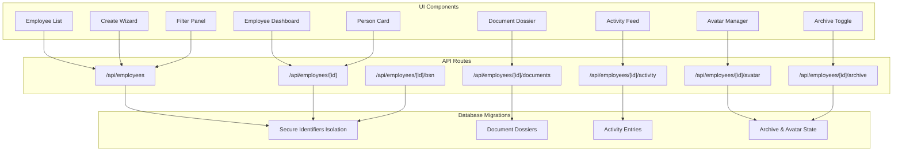
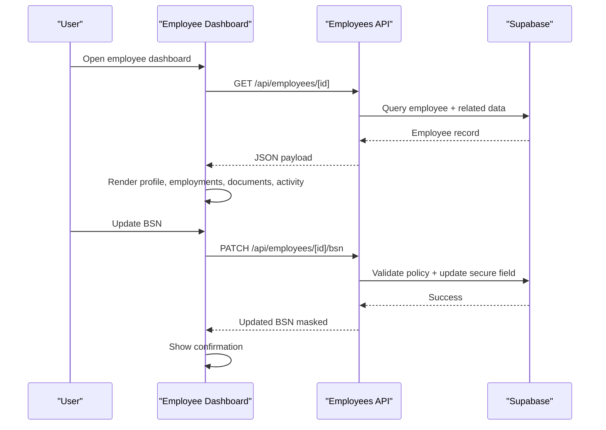
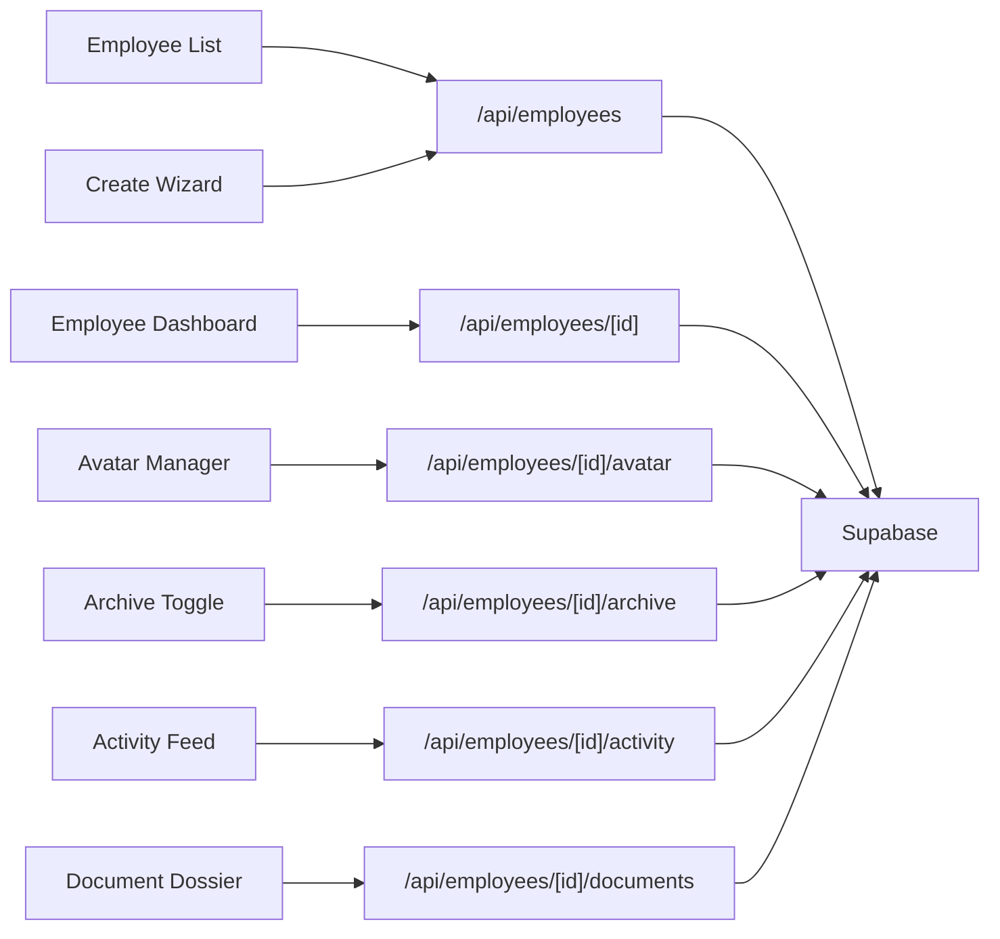

# Employee Management

<cite>
**Referenced Files in This Document**
- [employee-list.tsx](file://apps/hr-suite/components/employees/employee-list.tsx)
- [employee-create-wizard.tsx](file://apps/hr-suite/components/employees/employee-create-wizard.tsx)
- [employee-dashboard.tsx](file://apps/hr-suite/components/employees/employee-dashboard.tsx)
- [employee-avatar-manager.tsx](file://apps/hr-suite/components/employees/employee-avatar-manager.tsx)
- [employee-archive-toggle.tsx](file://apps/hr-suite/components/employees/employee-archive-toggle.tsx)
- [employee-filter-panel.tsx](file://apps/hr-suite/components/employees/employee-filter-panel.tsx)
- [employee-person-card.tsx](file://apps/hr-suite/components/employees/employee-person-card.tsx)
- [employee-activity-feed.tsx](file://apps/hr-suite/components/employees/employee-activity-feed.tsx)
- [employee-document-dossier.tsx](file://apps/hr-suite/components/documents/employee-document-dossier.tsx)
- [route.ts (employees)](file://apps/hr-suite/app/api/employees/route.ts)
- [route.ts (employees/[employeeId])](file://apps/hr-suite/app/api/employees/[employeeId]/route.ts)
- [route.ts (bsn)](file://apps/hr-suite/app/api/employees/[employeeId]/bsn/route.ts)
- [route.ts (avatar)](file://apps/hr-suite/app/api/employees/[employeeId]/avatar/route.ts)
- [route.ts (documents)](file://apps/hr-suite/app/api/employees/[employeeId]/documents/route.ts)
- [route.ts (archive)](file://apps/hr-suite/app/api/employees/[employeeId]/archive/route.ts)
- [route.ts (activity)](file://apps/hr-suite/app/api/employees/[employeeId]/activity/route.ts)
- [20260715124506_isolate_employee_secure_identifiers.sql](file://apps/hr-suite/supabase/migrations/20260715124506_isolate_employee_secure_identifiers.sql)
- [20260718150000_add_employee_archive_and_avatar_state.sql](file://apps/hr-suite/supabase/migrations/20260718150000_add_employee_archive_and_avatar_state.sql)
- [20260718110000_add_employee_document_dossiers.sql](file://apps/hr-suite/supabase/migrations/20260718110000_add_employee_document_dossiers.sql)
- [20260724160000_add_employee_activity_entries.sql](file://apps/hr-suite/supabase/migrations/20260724160000_add_employee_activity_entries.sql)
- [MEDEWERKER.md](file://docs/requirements/core-hr/MEDEWERKER.md)
- [MEDEWERKER_ARCHIEF_FOTO_EN_TABS.md](file://docs/requirements/core-hr/MEDEWERKER_ARCHIEF_FOTO_EN_TABS.md)
- [DOCUMENTEN_EN_AI_COMPLIANCE.md](file://docs/requirements/documents/DOCUMENTEN_EN_AI_COMPLIANCE.md)
</cite>

## Table of Contents
1. Introduction
2. Project Structure
3. Core Components
4. Architecture Overview
5. Detailed Component Analysis
6. Dependency Analysis
7. Performance Considerations
8. Troubleshooting Guide
9. Conclusion

## Introduction
This document explains the Employee Management system within LiquidHR, covering the employee data model, CRUD operations, onboarding wizard, individual employee dashboard, documents, activity tracking, archival, avatar management, search and filtering, and integrations with other HR modules. It also outlines security considerations for sensitive identifiers such as BSN (Dutch social security number) and compliance requirements for document handling.

## Project Structure
The Employee Management feature spans UI components, API routes, and database migrations:
- UI components implement the employee list, create wizard, dashboard, avatar manager, archive toggle, filter panel, person card, and activity feed.
- API routes expose endpoints for employees, secure identifiers (BSN), avatars, documents, activity, and archive operations.
- Database migrations define secure identifier isolation, document dossiers, activity entries, and archive/avatar state.

**Diagram sources**
- [employee-list.tsx](file://apps/hr-suite/components/employees/employee-list.tsx)
- [employee-create-wizard.tsx](file://apps/hr-suite/components/employees/employee-create-wizard.tsx)
- [employee-dashboard.tsx](file://apps/hr-suite/components/employees/employee-dashboard.tsx)
- [employee-avatar-manager.tsx](file://apps/hr-suite/components/employees/employee-avatar-manager.tsx)
- [employee-archive-toggle.tsx](file://apps/hr-suite/components/employees/employee-archive-toggle.tsx)
- [employee-filter-panel.tsx](file://apps/hr-suite/components/employees/employee-filter-panel.tsx)
- [employee-person-card.tsx](file://apps/hr-suite/components/employees/employee-person-card.tsx)
- [employee-activity-feed.tsx](file://apps/hr-suite/components/employees/employee-activity-feed.tsx)
- [employee-document-dossier.tsx](file://apps/hr-suite/components/documents/employee-document-dossier.tsx)
- [route.ts (employees)](file://apps/hr-suite/app/api/employees/route.ts)
- [route.ts (employees/[employeeId])](file://apps/hr-suite/app/api/employees/[employeeId]/route.ts)
- [route.ts (bsn)](file://apps/hr-suite/app/api/employees/[employeeId]/bsn/route.ts)
- [route.ts (avatar)](file://apps/hr-suite/app/api/employees/[employeeId]/avatar/route.ts)
- [route.ts (documents)](file://apps/hr-suite/app/api/employees/[employeeId]/documents/route.ts)
- [route.ts (archive)](file://apps/hr-suite/app/api/employees/[employeeId]/archive/route.ts)
- [route.ts (activity)](file://apps/hr-suite/app/api/employees/[employeeId]/activity/route.ts)
- [20260715124506_isolate_employee_secure_identifiers.sql](file://apps/hr-suite/supabase/migrations/20260715124506_isolate_employee_secure_identifiers.sql)
- [20260718110000_add_employee_document_dossiers.sql](file://apps/hr-suite/supabase/migrations/20260718110000_add_employee_document_dossiers.sql)
- [20260724160000_add_employee_activity_entries.sql](file://apps/hr-suite/supabase/migrations/20260724160000_add_employee_activity_entries.sql)
- [20260718150000_add_employee_archive_and_avatar_state.sql](file://apps/hr-suite/supabase/migrations/20260718150000_add_employee_archive_and_avatar_state.sql)

**Section sources**
- [MEDEWERKER.md](file://docs/requirements/core-hr/MEDEWERKER.md)
- [MEDEWERKER_ARCHIEF_FOTO_EN_TABS.md](file://docs/requirements/core-hr/MEDEWERKER_ARCHIEF_FOTO_EN_TABS.md)
- [DOCUMENTEN_EN_AI_COMPLIANCE.md](file://docs/requirements/documents/DOCUMENTEN_EN_AI_COMPLIANCE.md)

## Core Components
- Employee List: Displays searchable, filterable employees with quick actions to open dashboards or initiate updates.
- Create Wizard: Guides users through new employee onboarding, capturing personal details, contact info, and secure identifiers like BSN.
- Employee Dashboard: Central hub for an employee’s profile, employments, documents, activity, and settings.
- Avatar Manager: Uploads and manages employee avatars with validation and storage integration.
- Archive Toggle: Archives or restores inactive employees while preserving audit trails.
- Filter Panel: Supports multi-criteria filtering (e.g., department, status).
- Person Card: Compact view of key employee attributes for quick reference.
- Activity Feed: Shows chronological audit events for an employee record.
- Document Dossier: Manages employee files with categories, versions, and access controls.

**Section sources**
- [employee-list.tsx](file://apps/hr-suite/components/employees/employee-list.tsx)
- [employee-create-wizard.tsx](file://apps/hr-suite/components/employees/employee-create-wizard.tsx)
- [employee-dashboard.tsx](file://apps/hr-suite/components/employees/employee-dashboard.tsx)
- [employee-avatar-manager.tsx](file://apps/hr-suite/components/employees/employee-avatar-manager.tsx)
- [employee-archive-toggle.tsx](file://apps/hr-suite/components/employees/employee-archive-toggle.tsx)
- [employee-filter-panel.tsx](file://apps/hr-suite/components/employees/employee-filter-panel.tsx)
- [employee-person-card.tsx](file://apps/hr-suite/components/employees/employee-person-card.tsx)
- [employee-activity-feed.tsx](file://apps/hr-suite/components/employees/employee-activity-feed.tsx)
- [employee-document-dossier.tsx](file://apps/hr-suite/components/documents/employee-document-dossier.tsx)

## Architecture Overview
The Employee Management system follows a layered architecture:
- Presentation layer: React components render lists, wizards, dashboards, and panels.
- API layer: Next.js route handlers enforce authorization, validate inputs, and orchestrate business logic.
- Data layer: Supabase migrations define tables, policies, and indexes; RLS ensures tenant isolation and role-based access.

**Diagram sources**
- [employee-dashboard.tsx](file://apps/hr-suite/components/employees/employee-dashboard.tsx)
- [route.ts (employees/[employeeId])](file://apps/hr-suite/app/api/employees/[employeeId]/route.ts)
- [route.ts (bsn)](file://apps/hr-suite/app/api/employees/[employeeId]/bsn/route.ts)
- [20260715124506_isolate_employee_secure_identifiers.sql](file://apps/hr-suite/supabase/migrations/20260715124506_isolate_employee_secure_identifiers.sql)

## Detailed Component Analysis

### Employee Data Model
Core attributes include personal information, contact details, and secure identifiers such as BSN. The model supports:
- Personal details: name, date of birth, nationality, etc.
- Contact details: email, phone, address fields.
- Secure identifiers: BSN stored in isolated tables with strict RLS policies.
- Employment linkage: relationships to employment records and organizational units.
- Custom fields: extensible key-value pairs for tenant-specific attributes.

Security highlights:
- BSN is isolated from general employee records and only accessible via dedicated endpoints with explicit permissions.
- Tenant scoping ensures data isolation across administrations.

**Section sources**
- [20260715124506_isolate_employee_secure_identifiers.sql](file://apps/hr-suite/supabase/migrations/20260715124506_isolate_employee_secure_identifiers.sql)
- [MEDEWERKER.md](file://docs/requirements/core-hr/MEDEWERKER.md)

### CRUD Operations and Employee List Interface
- Read: Fetches paginated employee lists with filters and sorting.
- Create: Uses the create wizard to collect validated input and persist records.
- Update: Edits profile fields via dashboard forms with real-time validation.
- Delete/Archive: Archives employees instead of hard deletes, maintaining historical integrity.

Search and filtering:
- Full-text search across name, email, and identifiers.
- Filters by department, job role, employment status, and custom fields.

**Section sources**
- [employee-list.tsx](file://apps/hr-suite/components/employees/employee-list.tsx)
- [employee-filter-panel.tsx](file://apps/hr-suite/components/employees/employee-filter-panel.tsx)
- [route.ts (employees)](file://apps/hr-suite/app/api/employees/route.ts)

### Create Wizard Workflow
The onboarding wizard guides users through:
- Step 1: Personal information and contact details.
- Step 2: Secure identifiers (BSN) with validation and masking.
- Step 3: Employment setup and organizational assignment.
- Step 4: Review and submit with audit logging.

Validation includes format checks for emails, phones, and BSN checksum rules where applicable.

**Section sources**
- [employee-create-wizard.tsx](file://apps/hr-suite/components/employees/employee-create-wizard.tsx)
- [route.ts (employees)](file://apps/hr-suite/app/api/employees/route.ts)

### Individual Employee Dashboard
The dashboard consolidates:
- Profile overview with editable sections.
- Employment timeline and history.
- Documents dossier with upload and versioning.
- Activity feed showing all changes and access events.
- Quick actions for updates, archival, and avatar management.

**Section sources**
- [employee-dashboard.tsx](file://apps/hr-suite/components/employees/employee-dashboard.tsx)
- [employee-person-card.tsx](file://apps/hr-suite/components/employees/employee-person-card.tsx)

### Document Management System
Features:
- Categorization and tagging of employee files.
- Version control and change tracking.
- Access control based on roles and tenant scope.
- Compliance-aware handling per policy guidelines.

Upload flow:
- Client-side validation (type, size).
- Server-side policy enforcement and storage integration.
- Audit entry creation upon successful upload.

**Section sources**
- [employee-document-dossier.tsx](file://apps/hr-suite/components/documents/employee-document-dossier.tsx)
- [route.ts (documents)](file://apps/hr-suite/app/api/employees/[employeeId]/documents/route.ts)
- [20260718110000_add_employee_document_dossiers.sql](file://apps/hr-suite/supabase/migrations/20260718110000_add_employee_document_dossiers.sql)
- [DOCUMENTEN_EN_AI_COMPLIANCE.md](file://docs/requirements/documents/DOCUMENTEN_EN_AI_COMPLIANCE.md)

### Activity Tracking and Audit Trails
- Records every significant action: profile updates, document uploads, BSN changes, archival.
- Includes timestamps, actor identity, and change summaries.
- Supports filtering and export for compliance reporting.

**Section sources**
- [employee-activity-feed.tsx](file://apps/hr-suite/components/employees/employee-activity-feed.tsx)
- [route.ts (activity)](file://apps/hr-suite/app/api/employees/[employeeId]/activity/route.ts)
- [20260724160000_add_employee_activity_entries.sql](file://apps/hr-suite/supabase/migrations/20260724160000_add_employee_activity_entries.sql)

### Archive Functionality
- Soft-deletes employees by marking them archived.
- Preserves historical data and audit trails.
- Allows restoration if needed.
- Integrates with list views to toggle visibility of archived records.

**Section sources**
- [employee-archive-toggle.tsx](file://apps/hr-suite/components/employees/employee-archive-toggle.tsx)
- [route.ts (archive)](file://apps/hr-suite/app/api/employees/[employeeId]/archive/route.ts)
- [20260718150000_add_employee_archive_and_avatar_state.sql](file://apps/hr-suite/supabase/migrations/20260718150000_add_employee_archive_and_avatar_state.sql)

### Employee Avatar Management
- Upload supported image formats with size limits.
- Generates thumbnails and stores securely.
- Updates profile display immediately after success.
- Enforces tenant-scoped storage paths.

**Section sources**
- [employee-avatar-manager.tsx](file://apps/hr-suite/components/employees/employee-avatar-manager.tsx)
- [route.ts (avatar)](file://apps/hr-suite/app/api/employees/[employeeId]/avatar/route.ts)
- [20260718150000_add_employee_archive_and_avatar_state.sql](file://apps/hr-suite/supabase/migrations/20260718150000_add_employee_archive_and_avatar_state.sql)

### Search and Filtering Capabilities
- Text search across multiple fields.
- Advanced filters for department, job role, employment status, and custom fields.
- Pagination and sorting for large datasets.

**Section sources**
- [employee-list.tsx](file://apps/hr-suite/components/employees/employee-list.tsx)
- [employee-filter-panel.tsx](file://apps/hr-suite/components/employees/employee-filter-panel.tsx)
- [route.ts (employees)](file://apps/hr-suite/app/api/employees/route.ts)

### Integration with Other HR Modules
- Employment module: links employees to contracts, timelines, and terminations.
- Leave module: uses employee IDs for leave balances and requests.
- Organization chart: displays reporting lines and placements.
- Settings and master data: departments, jobs, salary scales influence employee profiles.

**Section sources**
- [employee-dashboard.tsx](file://apps/hr-suite/components/employees/employee-dashboard.tsx)
- [MEDEWERKER.md](file://docs/requirements/core-hr/MEDEWERKER.md)

## Dependency Analysis
Key dependencies and interactions:
- UI components depend on API routes for data operations.
- API routes enforce RBAC and tenant scoping before delegating to database queries.
- Migrations ensure schema consistency and policy enforcement.

**Diagram sources**
- [employee-list.tsx](file://apps/hr-suite/components/employees/employee-list.tsx)
- [employee-create-wizard.tsx](file://apps/hr-suite/components/employees/employee-create-wizard.tsx)
- [employee-dashboard.tsx](file://apps/hr-suite/components/employees/employee-dashboard.tsx)
- [employee-avatar-manager.tsx](file://apps/hr-suite/components/employees/employee-avatar-manager.tsx)
- [employee-archive-toggle.tsx](file://apps/hr-suite/components/employees/employee-archive-toggle.tsx)
- [employee-activity-feed.tsx](file://apps/hr-suite/components/employees/employee-activity-feed.tsx)
- [employee-document-dossier.tsx](file://apps/hr-suite/components/documents/employee-document-dossier.tsx)
- [route.ts (employees)](file://apps/hr-suite/app/api/employees/route.ts)
- [route.ts (employees/[employeeId])](file://apps/hr-suite/app/api/employees/[employeeId]/route.ts)
- [route.ts (avatar)](file://apps/hr-suite/app/api/employees/[employeeId]/avatar/route.ts)
- [route.ts (archive)](file://apps/hr-suite/app/api/employees/[employeeId]/archive/route.ts)
- [route.ts (activity)](file://apps/hr-suite/app/api/employees/[employeeId]/activity/route.ts)
- [route.ts (documents)](file://apps/hr-suite/app/api/employees/[employeeId]/documents/route.ts)

**Section sources**
- [route.ts (employees)](file://apps/hr-suite/app/api/employees/route.ts)
- [route.ts (employees/[employeeId])](file://apps/hr-suite/app/api/employees/[employeeId]/route.ts)

## Performance Considerations
- Use pagination and server-side filtering for large employee datasets.
- Cache frequently accessed profile data at the API layer when appropriate.
- Optimize database queries with proper indexes on foreign keys and search fields.
- Avoid heavy client-side processing; delegate sorting/filtering to the backend.

[No sources needed since this section provides general guidance]

## Troubleshooting Guide
Common issues and resolutions:
- Unauthorized access to BSN: Ensure user has explicit permission and tenant scope matches.
- Avatar upload failures: Check file type, size limits, and storage path permissions.
- Missing activity entries: Verify that mutations trigger audit logging and that the activity endpoint is called correctly.
- Archive not reflecting in list: Confirm soft-delete flag and list query includes archived filter option.

**Section sources**
- [route.ts (bsn)](file://apps/hr-suite/app/api/employees/[employeeId]/bsn/route.ts)
- [route.ts (avatar)](file://apps/hr-suite/app/api/employees/[employeeId]/avatar/route.ts)
- [route.ts (activity)](file://apps/hr-suite/app/api/employees/[employeeId]/activity/route.ts)
- [route.ts (archive)](file://apps/hr-suite/app/api/employees/[employeeId]/archive/route.ts)

## Conclusion
The Employee Management system provides a robust, secure, and compliant foundation for managing employee lifecycles in LiquidHR. It combines intuitive UI workflows with strong security measures for sensitive data, comprehensive audit trails, and flexible integrations across HR modules. By following the documented patterns and best practices, teams can extend and maintain the system effectively while ensuring data privacy and regulatory compliance.

[No sources needed since this section summarizes without analyzing specific files]