# Employment Lifecycle

<cite>
**Referenced Files in This Document**
- [employment-create-form.tsx](file://apps/hr-suite/components/employment/employment-create-form.tsx)
- [employment-timeline.tsx](file://apps/hr-suite/components/employment/employment-timeline.tsx)
- [employment-contract-timeline.tsx](file://apps/hr-suite/components/employment/employment-contract-timeline.tsx)
- [organization-timeline-manager.tsx](file://apps/hr-suite/components/employment/organization-timeline-manager.tsx)
- [termination-form.tsx](file://apps/hr-suite/components/employment/termination-form.tsx)
- [work-pattern-panel.tsx](file://apps/hr-suite/components/employment/work-pattern-panel.tsx)
- [employment-mutation-panel.tsx](file://apps/hr-suite/components/employment/employment-mutation-panel.tsx)
- [confirmation-dialog.tsx](file://apps/hr-suite/components/employment/confirmation-dialog.tsx)
- [selectable-timeline-list.tsx](file://apps/hr-suite/components/employment/selectable-timeline-list.tsx)
- [route.ts (employees employment)](file://apps/hr-suite/app/api/employees/[employeeId]/employments/route.ts)
- [route.ts (employment changes)](file://apps/hr-suite/app/api/employments/[employmentId]/changes/route.ts)
- [route.ts (employment termination)](file://apps/hr-suite/app/api/employments/[employmentId]/termination/route.ts)
- [route.ts (employment timeline)](file://apps/hr-suite/app/api/employments/[employmentId]/timeline/[timeline]/route.ts)
- [route.ts (employment work patterns)](file://apps/hr-suite/app/api/employments/[employmentId]/work-patterns/route.ts)
- [20260715071156_add_employment_core.sql](file://apps/hr-suite/supabase/migrations/20260715071156_add_employment_core.sql)
- [20260715071422_add_employment_timelines.sql](file://apps/hr-suite/supabase/migrations/20260715071422_add_employment_timelines.sql)
- [20260715071717_add_employment_terminations.sql](file://apps/hr-suite/supabase/migrations/20260715071717_add_employment_terminations.sql)
- [20260715141843_add_employment_change_management.sql](file://apps/hr-suite/supabase/migrations/20260715141843_add_employment_change_management.sql)
- [20260718100000_add_job_catalog_salary_revisions.sql](file://apps/hr-suite/supabase/migrations/20260718100000_add_job_catalog_salary_revisions.sql)
- [20260718121308_add_settings_modules_work_patterns_holidays.sql](file://apps/hr-suite/supabase/migrations/20260718121308_add_settings_modules_work_patterns_holidays.sql)
- [20260729084046_restructure_employment_contracts.sql](file://apps/hr-suite/supabase/migrations/20260729084046_restructure_employment_contracts.sql)
- [20260729084634_publish_restructured_employment.sql](file://apps/hr-suite/supabase/migrations/20260729084634_publish_restructured_employment.sql)
- [20260729085605_manage_employment_contract_chain.sql](file://apps/hr-suite/supabase/migrations/20260729085605_manage_employment_contract_chain.sql)
- [20260729091013_manage_employment_organization_timeline.sql](file://apps/hr-suite/supabase/migrations/20260729091013_manage_employment_organization_timeline.sql)
- [20260729091441_adapt_employment_timeline_payloads.sql](file://apps/hr-suite/supabase/migrations/20260729091441_adapt_employment_timeline_payloads.sql)
- [20260729092342_optimize_employment_contract_configuration.sql](file://apps/hr-suite/supabase/migrations/20260729092342_optimize_employment_contract_configuration.sql)
- [employment.json (i18n)](file://apps/hr-suite/messages/en/employment.json)
</cite>

## Update Summary
**Changes Made**
- Updated database schema to support new employment contract architecture with proper chain management
- Enhanced timeline management with organization timeline support and improved contract chain visualization
- Added new components for contract chain management and organization timeline coordination
- Restructured employment contract system with optimized configuration and enhanced audit capabilities
- Updated API routes to support new contract chain operations and organization timeline management

## Table of Contents
1. Introduction
2. Project Structure
3. Core Components
4. Architecture Overview
5. Detailed Component Analysis
6. Dependency Analysis
7. Performance Considerations
8. Troubleshooting Guide
9. Conclusion

## Introduction
This document explains the Employment Lifecycle management system within LiquidHR, covering the complete employment relationship from contract creation to termination. The system has been restructured to support a new employment contract architecture with proper chain management and organization timeline support. It details the enhanced data model for employment records, the improved creation workflow via guided forms, advanced timeline visualization for tracking contract chains and organizational changes, and streamlined termination processes. The system now includes sophisticated work pattern configuration, comprehensive change tracking with enhanced audit trails, and robust confirmation dialogs for critical actions. Integration with employee master data ensures consistency across HR systems while maintaining compliance requirements through detailed documentation and approval workflows.

## Project Structure
The employment lifecycle spans UI components, API routes, and database migrations with enhanced contract chain management:
- UI components handle user interactions for creating employments, viewing contract timelines, configuring work patterns, managing terminations, and coordinating organization timelines.
- API routes expose endpoints for employment CRUD, contract chain operations, timeline retrieval, termination processing, and work pattern management.
- Database migrations define core employment entities, enhanced timelines, contract chains, organization timelines, terminations, change management, salary revisions, and work pattern settings.

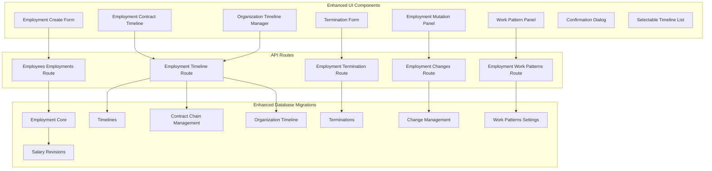

**Diagram sources**
- [employment-create-form.tsx](file://apps/hr-suite/components/employment/employment-create-form.tsx)
- [employment-contract-timeline.tsx](file://apps/hr-suite/components/employment/employment-contract-timeline.tsx)
- [organization-timeline-manager.tsx](file://apps/hr-suite/components/employment/organization-timeline-manager.tsx)
- [work-pattern-panel.tsx](file://apps/hr-suite/components/employment/work-pattern-panel.tsx)
- [termination-form.tsx](file://apps/hr-suite/components/employment/termination-form.tsx)
- [employment-mutation-panel.tsx](file://apps/hr-suite/components/employment/employment-mutation-panel.tsx)
- [confirmation-dialog.tsx](file://apps/hr-suite/components/employment/confirmation-dialog.tsx)
- [selectable-timeline-list.tsx](file://apps/hr-suite/components/employment/selectable-timeline-list.tsx)
- [route.ts (employees employment)](file://apps/hr-suite/app/api/employees/[employeeId]/employments/route.ts)
- [route.ts (employment changes)](file://apps/hr-suite/app/api/employments/[employmentId]/changes/route.ts)
- [route.ts (employment timeline)](file://apps/hr-suite/app/api/employments/[employmentId]/timeline/[timeline]/route.ts)
- [route.ts (employment termination)](file://apps/hr-suite/app/api/employments/[employmentId]/termination/route.ts)
- [route.ts (employment work patterns)](file://apps/hr-suite/app/api/employments/[employmentId]/work-patterns/route.ts)
- [20260715071156_add_employment_core.sql](file://apps/hr-suite/supabase/migrations/20260715071156_add_employment_core.sql)
- [20260715071422_add_employment_timelines.sql](file://apps/hr-suite/supabase/migrations/20260715071422_add_employment_timelines.sql)
- [20260729085605_manage_employment_contract_chain.sql](file://apps/hr-suite/supabase/migrations/20260729085605_manage_employment_contract_chain.sql)
- [20260729091013_manage_employment_organization_timeline.sql](file://apps/hr-suite/supabase/migrations/20260729091013_manage_employment_organization_timeline.sql)

**Section sources**
- [employment-create-form.tsx](file://apps/hr-suite/components/employment/employment-create-form.tsx)
- [employment-contract-timeline.tsx](file://apps/hr-suite/components/employment/employment-contract-timeline.tsx)
- [organization-timeline-manager.tsx](file://apps/hr-suite/components/employment/organization-timeline-manager.tsx)
- [work-pattern-panel.tsx](file://apps/hr-suite/components/employment/work-pattern-panel.tsx)
- [termination-form.tsx](file://apps/hr-suite/components/employment/termination-form.tsx)
- [employment-mutation-panel.tsx](file://apps/hr-suite/components/employment/employment-mutation-panel.tsx)
- [confirmation-dialog.tsx](file://apps/hr-suite/components/employment/confirmation-dialog.tsx)
- [selectable-timeline-list.tsx](file://apps/hr-suite/components/employment/selectable-timeline-list.tsx)
- [route.ts (employees employment)](file://apps/hr-suite/app/api/employees/[employeeId]/employments/route.ts)
- [route.ts (employment changes)](file://apps/hr-suite/app/api/employments/[employmentId]/changes/route.ts)
- [route.ts (employment timeline)](file://apps/hr-suite/app/api/employments/[employmentId]/timeline/[timeline]/route.ts)
- [route.ts (employment termination)](file://apps/hr-suite/app/api/employments/[employmentId]/termination/route.ts)
- [route.ts (employment work patterns)](file://apps/hr-suite/app/api/employments/[employmentId]/work-patterns/route.ts)
- [20260715071156_add_employment_core.sql](file://apps/hr-suite/supabase/migrations/20260715071156_add_employment_core.sql)
- [20260715071422_add_employment_timelines.sql](file://apps/hr-suite/supabase/migrations/20260715071422_add_employment_timelines.sql)
- [20260729085605_manage_employment_contract_chain.sql](file://apps/hr-suite/supabase/migrations/20260729085605_manage_employment_contract_chain.sql)
- [20260729091013_manage_employment_organization_timeline.sql](file://apps/hr-suite/supabase/migrations/20260729091013_manage_employment_organization_timeline.sql)

## Core Components
- Employment Create Form: Guides HR users through contract creation, linking to an employee master record, setting start/end dates, work patterns, job role, and salary information with enhanced validation.
- Employment Contract Timeline: Visualizes historical events and contract chain relationships across the employment lifecycle, including contract renewals, modifications, and terminations.
- Organization Timeline Manager: Coordinates employment timeline events with organizational changes and maintains temporal consistency across the organization structure.
- Termination Form: Captures termination details such as end date, reason, and final settlement notes; triggers termination workflow with enhanced audit capabilities.
- Work Pattern Panel: Configures schedules, working hours, and time arrangements aligned with organizational settings and contract terms.
- Employment Mutation Panel: Manages changes to employment records, capturing diffs and comprehensive audit trails with contract chain awareness.
- Confirmation Dialog: Ensures critical actions (e.g., termination, major contract changes) require explicit user confirmation with contextual information.
- Selectable Timeline List: Provides interactive timeline navigation and selection capabilities for complex employment histories.

These components integrate with enhanced API routes that enforce validation, authorization, and persistence, while leveraging updated database schemas for robust data integrity, contract chain management, and compliance.

**Section sources**
- [employment-create-form.tsx](file://apps/hr-suite/components/employment/employment-create-form.tsx)
- [employment-contract-timeline.tsx](file://apps/hr-suite/components/employment/employment-contract-timeline.tsx)
- [organization-timeline-manager.tsx](file://apps/hr-suite/components/employment/organization-timeline-manager.tsx)
- [termination-form.tsx](file://apps/hr-suite/components/employment/termination-form.tsx)
- [work-pattern-panel.tsx](file://apps/hr-suite/components/employment/work-pattern-panel.tsx)
- [employment-mutation-panel.tsx](file://apps/hr-suite/components/employment/employment-mutation-panel.tsx)
- [confirmation-dialog.tsx](file://apps/hr-suite/components/employment/confirmation-dialog.tsx)
- [selectable-timeline-list.tsx](file://apps/hr-suite/components/employment/selectable-timeline-list.tsx)

## Architecture Overview
The enhanced employment lifecycle architecture connects UI components to API routes and database layers with improved contract chain management:
- UI components collect input and render visualizations with enhanced timeline coordination.
- API routes validate requests, enforce policies, manage contract chains, and persist data with temporal consistency.
- Database migrations define core entities, contract chains, organization timelines, and relationships ensuring referential integrity and comprehensive auditability.

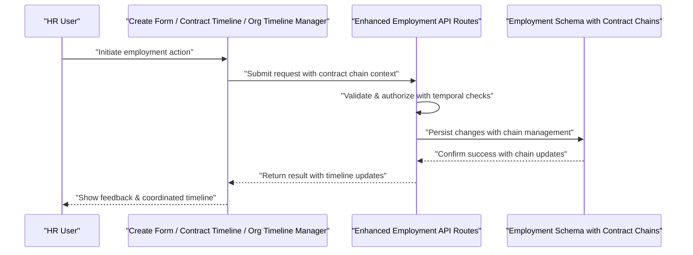

**Diagram sources**
- [employment-create-form.tsx](file://apps/hr-suite/components/employment/employment-create-form.tsx)
- [employment-contract-timeline.tsx](file://apps/hr-suite/components/employment/employment-contract-timeline.tsx)
- [organization-timeline-manager.tsx](file://apps/hr-suite/components/employment/organization-timeline-manager.tsx)
- [route.ts (employees employment)](file://apps/hr-suite/app/api/employees/[employeeId]/employments/route.ts)
- [route.ts (employment changes)](file://apps/hr-suite/app/api/employments/[employmentId]/changes/route.ts)
- [route.ts (employment timeline)](file://apps/hr-suite/app/api/employments/[employmentId]/timeline/[timeline]/route.ts)
- [route.ts (employment termination)](file://apps/hr-suite/app/api/employments/[employmentId]/termination/route.ts)
- [20260715071156_add_employment_core.sql](file://apps/hr-suite/supabase/migrations/20260715071156_add_employment_core.sql)
- [20260715071422_add_employment_timelines.sql](file://apps/hr-suite/supabase/migrations/20260715071422_add_employment_timelines.sql)
- [20260729085605_manage_employment_contract_chain.sql](file://apps/hr-suite/supabase/migrations/20260729085605_manage_employment_contract_chain.sql)
- [20260729091013_manage_employment_organization_timeline.sql](file://apps/hr-suite/supabase/migrations/20260729091013_manage_employment_organization_timeline.sql)

## Detailed Component Analysis

### Enhanced Employment Data Model
Core employment entities now include contract chain management and organization timeline coordination:
- Employment record: links to employee, job role, department, start/end dates, status, salary references, and contract chain identifiers.
- Contract chain entries: maintain relationships between related contracts, renewals, and modifications with temporal validity.
- Organization timeline entries: coordinate employment events with organizational changes and structural updates.
- Timeline entries: capture chronological events and changes for audit and visibility with enhanced payload structures.
- Termination records: store termination reasons, effective dates, and related notes with chain awareness.
- Work patterns: define schedules, working hours, and time arrangements tied to organizational settings and contract terms.
- Salary revisions: track compensation changes over time with contract chain integration.

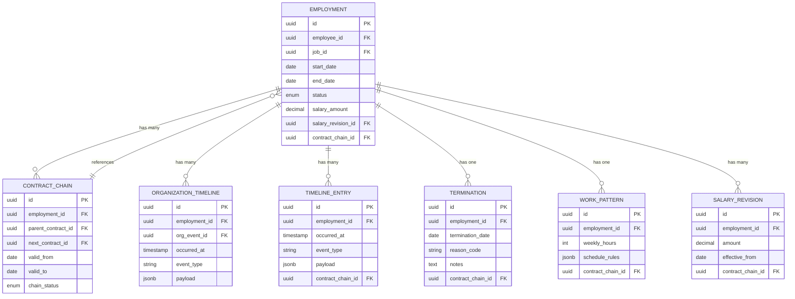

**Updated** Enhanced data model now supports contract chain management and organization timeline coordination for comprehensive employment lifecycle tracking.

**Diagram sources**
- [20260715071156_add_employment_core.sql](file://apps/hr-suite/supabase/migrations/20260715071156_add_employment_core.sql)
- [20260715071422_add_employment_timelines.sql](file://apps/hr-suite/supabase/migrations/20260715071422_add_employment_timelines.sql)
- [20260729085605_manage_employment_contract_chain.sql](file://apps/hr-suite/supabase/migrations/20260729085605_manage_employment_contract_chain.sql)
- [20260729091013_manage_employment_organization_timeline.sql](file://apps/hr-suite/supabase/migrations/20260729091013_manage_employment_organization_timeline.sql)
- [20260715071717_add_employment_terminations.sql](file://apps/hr-suite/supabase/migrations/20260715071717_add_employment_terminations.sql)
- [20260718100000_add_job_catalog_salary_revisions.sql](file://apps/hr-suite/supabase/migrations/20260718100000_add_job_catalog_salary_revisions.sql)
- [20260718121308_add_settings_modules_work_patterns_holidays.sql](file://apps/hr-suite/supabase/migrations/20260718121308_add_settings_modules_work_patterns_holidays.sql)

**Section sources**
- [20260715071156_add_employment_core.sql](file://apps/hr-suite/supabase/migrations/20260715071156_add_employment_core.sql)
- [20260715071422_add_employment_timelines.sql](file://apps/hr-suite/supabase/migrations/20260715071422_add_employment_timelines.sql)
- [20260729085605_manage_employment_contract_chain.sql](file://apps/hr-suite/supabase/migrations/20260729085605_manage_employment_contract_chain.sql)
- [20260729091013_manage_employment_organization_timeline.sql](file://apps/hr-suite/supabase/migrations/20260729091013_manage_employment_organization_timeline.sql)
- [20260715071717_add_employment_terminations.sql](file://apps/hr-suite/supabase/migrations/20260715071717_add_employment_terminations.sql)
- [20260718100000_add_job_catalog_salary_revisions.sql](file://apps/hr-suite/supabase/migrations/20260718100000_add_job_catalog_salary_revisions.sql)
- [20260718121308_add_settings_modules_work_patterns_holidays.sql](file://apps/hr-suite/supabase/migrations/20260718121308_add_settings_modules_work_patterns_holidays.sql)

### Enhanced Employment Creation Workflow
The create form guides users through enhanced contract creation with chain awareness:
- Selecting or linking an employee master record with validation against existing contracts.
- Defining contract start date and optional end date with temporal conflict detection.
- Choosing job role and department with policy validation.
- Setting work patterns and salary details with contract chain integration.
- Submitting the form to create the employment record, initial timeline entry, and contract chain setup.

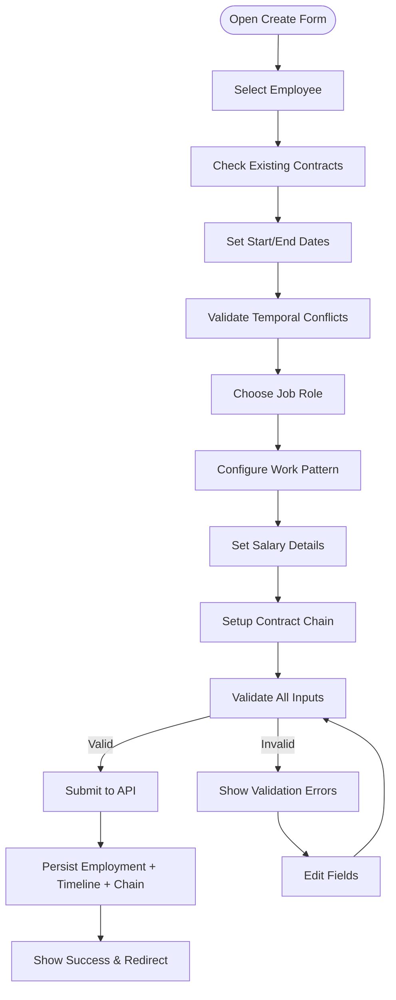

**Updated** Enhanced workflow now includes contract chain setup and temporal conflict validation for comprehensive employment lifecycle management.

**Diagram sources**
- [employment-create-form.tsx](file://apps/hr-suite/components/employment/employment-create-form.tsx)
- [route.ts (employees employment)](file://apps/hr-suite/app/api/employees/[employeeId]/employments/route.ts)
- [20260715071156_add_employment_core.sql](file://apps/hr-suite/supabase/migrations/20260715071156_add_employment_core.sql)
- [20260715071422_add_employment_timelines.sql](file://apps/hr-suite/supabase/migrations/20260715071422_add_employment_timelines.sql)
- [20260729085605_manage_employment_contract_chain.sql](file://apps/hr-suite/supabase/migrations/20260729085605_manage_employment_contract_chain.sql)

**Section sources**
- [employment-create-form.tsx](file://apps/hr-suite/components/employment/employment-create-form.tsx)
- [route.ts (employees employment)](file://apps/hr-suite/app/api/employees/[employeeId]/employments/route.ts)

### Enhanced Timeline Visualization
The enhanced timeline component displays chronological events for employment with contract chain and organization timeline coordination:
- Contract start and updates with chain relationship visualization.
- Work pattern changes with temporal validity tracking.
- Salary revisions with contract chain integration.
- Termination events with chain closure handling.
- Organization timeline events affecting employment status.

Users can navigate through different timeline views, select specific contract chains, and drill into events for detailed information.

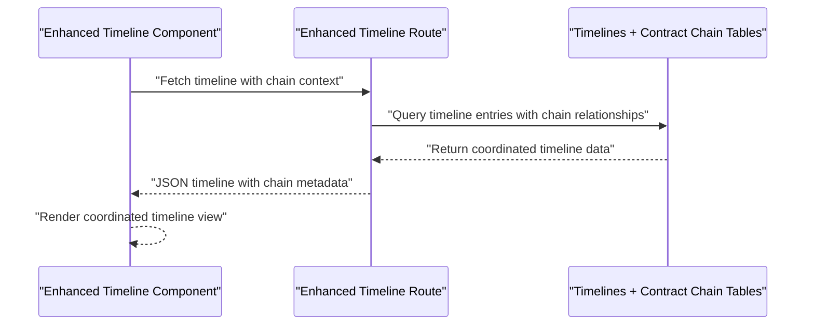

**Updated** Enhanced timeline now provides coordinated visualization of employment events, contract chains, and organization timeline changes.

**Diagram sources**
- [employment-contract-timeline.tsx](file://apps/hr-suite/components/employment/employment-contract-timeline.tsx)
- [organization-timeline-manager.tsx](file://apps/hr-suite/components/employment/organization-timeline-manager.tsx)
- [selectable-timeline-list.tsx](file://apps/hr-suite/components/employment/selectable-timeline-list.tsx)
- [route.ts (employment timeline)](file://apps/hr-suite/app/api/employments/[employmentId]/timeline/[timeline]/route.ts)
- [20260715071422_add_employment_timelines.sql](file://apps/hr-suite/supabase/migrations/20260715071422_add_employment_timelines.sql)
- [20260729085605_manage_employment_contract_chain.sql](file://apps/hr-suite/supabase/migrations/20260729085605_manage_employment_contract_chain.sql)
- [20260729091013_manage_employment_organization_timeline.sql](file://apps/hr-suite/supabase/migrations/20260729091013_manage_employment_organization_timeline.sql)

**Section sources**
- [employment-contract-timeline.tsx](file://apps/hr-suite/components/employment/employment-contract-timeline.tsx)
- [organization-timeline-manager.tsx](file://apps/hr-suite/components/employment/organization-timeline-manager.tsx)
- [selectable-timeline-list.tsx](file://apps/hr-suite/components/employment/selectable-timeline-list.tsx)
- [route.ts (employment timeline)](file://apps/hr-suite/app/api/employments/[employmentId]/timeline/[timeline]/route.ts)

### Enhanced Termination Process Management
The termination form captures comprehensive termination details with chain awareness:
- Termination date and reason code with temporal validation.
- Optional notes for compliance and final settlements with chain impact assessment.
- Confirmation dialog with chain closure implications and affected records.
- Automatic contract chain closure and organization timeline updates.

Upon submission, the system persists termination details, closes contract chains, creates termination timeline entries, and updates organization timeline coordination.

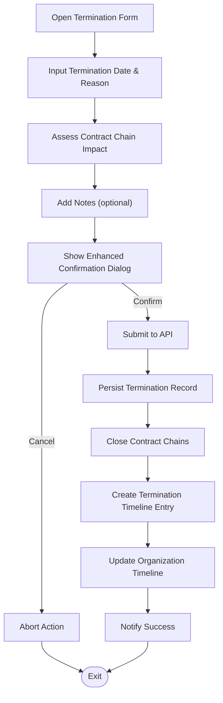

**Updated** Enhanced termination process now includes contract chain closure and organization timeline coordination for comprehensive employment lifecycle management.

**Diagram sources**
- [termination-form.tsx](file://apps/hr-suite/components/employment/termination-form.tsx)
- [confirmation-dialog.tsx](file://apps/hr-suite/components/employment/confirmation-dialog.tsx)
- [route.ts (employment termination)](file://apps/hr-suite/app/api/employments/[employmentId]/termination/route.ts)
- [20260715071717_add_employment_terminations.sql](file://apps/hr-suite/supabase/migrations/20260715071717_add_employment_terminations.sql)
- [20260729085605_manage_employment_contract_chain.sql](file://apps/hr-suite/supabase/migrations/20260729085605_manage_employment_contract_chain.sql)
- [20260729091013_manage_employment_organization_timeline.sql](file://apps/hr-suite/supabase/migrations/20260729091013_manage_employment_organization_timeline.sql)

**Section sources**
- [termination-form.tsx](file://apps/hr-suite/components/employment/termination-form.tsx)
- [confirmation-dialog.tsx](file://apps/hr-suite/components/employment/confirmation-dialog.tsx)
- [route.ts (employment termination)](file://apps/hr-suite/app/api/employments/[employmentId]/termination/route.ts)

### Enhanced Work Pattern Configuration System
The work pattern panel allows comprehensive configuration with contract chain awareness:
- Weekly hours and schedule rules with temporal validity tracking.
- Alignment with organizational settings, holidays, and contract terms.
- Linking to employment records with contract chain integration for accurate time tracking.
- Validation against contract constraints and organizational policies.

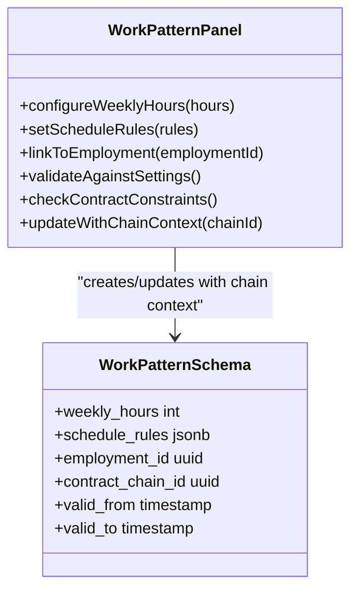

**Updated** Enhanced work pattern system now includes contract chain integration and temporal validity tracking for comprehensive employment lifecycle management.

**Diagram sources**
- [work-pattern-panel.tsx](file://apps/hr-suite/components/employment/work-pattern-panel.tsx)
- [route.ts (employment work patterns)](file://apps/hr-suite/app/api/employments/[employmentId]/work-patterns/route.ts)
- [20260718121308_add_settings_modules_work_patterns_holidays.sql](file://apps/hr-suite/supabase/migrations/20260718121308_add_settings_modules_work_patterns_holidays.sql)
- [20260729085605_manage_employment_contract_chain.sql](file://apps/hr-suite/supabase/migrations/20260729085605_manage_employment_contract_chain.sql)

**Section sources**
- [work-pattern-panel.tsx](file://apps/hr-suite/components/employment/work-pattern-panel.tsx)
- [route.ts (employment work patterns)](file://apps/hr-suite/app/api/employments/[employmentId]/work-patterns/route.ts)

### Enhanced Employment Mutations and Change Tracking
The mutation panel manages comprehensive changes to employment records with chain awareness:
- Captures diffs between old and new values with contract chain context.
- Persists change entries with timestamps, actor information, and chain relationships.
- Integrates with enhanced timeline for comprehensive audit trails with chain coordination.
- Validates changes against contract constraints and organizational policies.

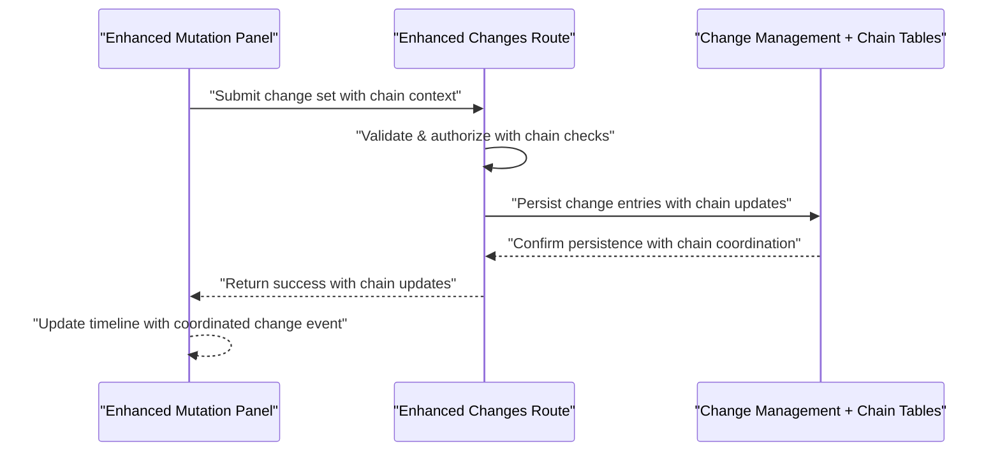

**Updated** Enhanced mutation system now includes contract chain awareness and comprehensive change tracking for complete employment lifecycle management.

**Diagram sources**
- [employment-mutation-panel.tsx](file://apps/hr-suite/components/employment/employment-mutation-panel.tsx)
- [route.ts (employment changes)](file://apps/hr-suite/app/api/employments/[employmentId]/changes/route.ts)
- [20260715141843_add_employment_change_management.sql](file://apps/hr-suite/supabase/migrations/20260715141843_add_employment_change_management.sql)
- [20260729085605_manage_employment_contract_chain.sql](file://apps/hr-suite/supabase/migrations/20260729085605_manage_employment_contract_chain.sql)

**Section sources**
- [employment-mutation-panel.tsx](file://apps/hr-suite/components/employment/employment-mutation-panel.tsx)
- [route.ts (employment changes)](file://apps/hr-suite/app/api/employments/[employmentId]/changes/route.ts)

### Enhanced Confirmation Dialogs for Critical Actions
Critical actions like termination or major employment changes trigger enhanced confirmation dialogs with chain impact assessment:
- Contextual information about contract chain implications.
- Display of affected records and timeline coordination impacts.
- Explicit user intent verification with comprehensive risk assessment.
- Audit trail generation for all critical actions.

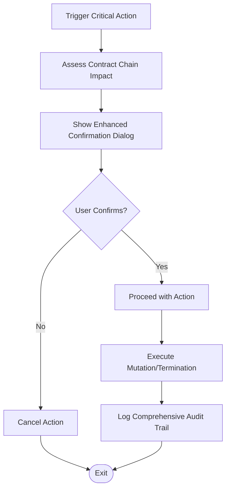

**Updated** Enhanced confirmation system now includes contract chain impact assessment and comprehensive audit trail generation for critical employment actions.

**Diagram sources**
- [confirmation-dialog.tsx](file://apps/hr-suite/components/employment/confirmation-dialog.tsx)
- [20260729085605_manage_employment_contract_chain.sql](file://apps/hr-suite/supabase/migrations/20260729085605_manage_employment_contract_chain.sql)

**Section sources**
- [confirmation-dialog.tsx](file://apps/hr-suite/components/employment/confirmation-dialog.tsx)

### Enhanced Integration with Employee Master Data
Employment records link to employee master data through foreign keys with enhanced validation:
- Create form requires selecting an existing employee or creating a new one with contract conflict detection.
- Validation ensures consistency across HR systems and prevents duplicate employment relationships.
- Chain-aware integration maintains temporal consistency between employee records and employment contracts.

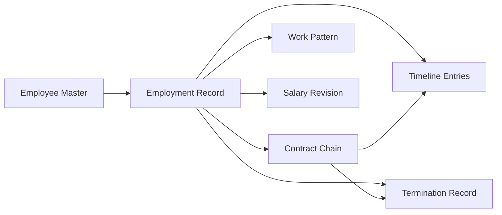

**Updated** Enhanced integration now includes contract chain awareness and temporal consistency validation for comprehensive employment lifecycle management.

**Diagram sources**
- [employment-create-form.tsx](file://apps/hr-suite/components/employment/employment-create-form.tsx)
- [20260715071156_add_employment_core.sql](file://apps/hr-suite/supabase/migrations/20260715071156_add_employment_core.sql)
- [20260729085605_manage_employment_contract_chain.sql](file://apps/hr-suite/supabase/migrations/20260729085605_manage_employment_contract_chain.sql)

**Section sources**
- [employment-create-form.tsx](file://apps/hr-suite/components/employment/employment-create-form.tsx)
- [20260715071156_add_employment_core.sql](file://apps/hr-suite/supabase/migrations/20260715071156_add_employment_core.sql)

### Enhanced Practical Scenarios
- New Hire Onboarding: Use the create form to link a new employee, set start date, assign job role, configure work patterns, set initial salary, and establish contract chain foundation.
- Contract Renewals: Update employment end date and create a new contract term with revised terms; enhanced timeline captures renewal events with chain relationships.
- Position Changes: Modify job role and salary via mutation panel with chain awareness; changes are tracked comprehensively and reflected in coordinated timeline.
- Employee Terminations: Use termination form to record end date, reason, and notes with chain closure; enhanced confirmation dialog prevents accidental terminations with impact assessment.
- Organizational Changes: Coordinate employment timeline events with organizational restructuring through organization timeline manager.

### Enhanced Business Rules and Compliance
- Validation rules enforce required fields, date constraints, temporal conflicts, and policy alignment with contract chain awareness.
- Approval workflows may be integrated via change sets requiring authorization before persistence with chain impact assessment.
- Compliance requirements are supported through detailed audit trails, coordinated timeline entries, termination documentation, and contract chain management.
- Temporal consistency validation ensures no overlapping contracts and proper chain sequencing.

## Dependency Analysis
Components depend on enhanced API routes which interact with updated database schemas including contract chain and organization timeline management. Dependencies are structured to maintain separation of concerns and facilitate testing and maintenance.

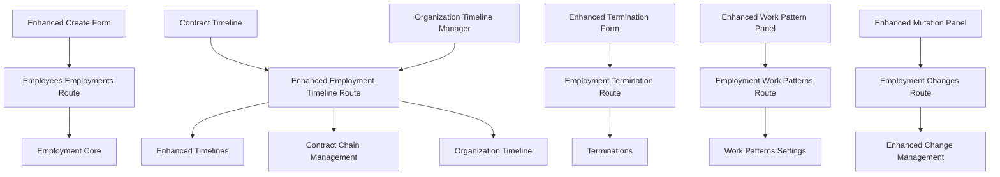

**Updated** Enhanced dependency structure now includes contract chain and organization timeline management components for comprehensive employment lifecycle coordination.

**Diagram sources**
- [employment-create-form.tsx](file://apps/hr-suite/components/employment/employment-create-form.tsx)
- [employment-contract-timeline.tsx](file://apps/hr-suite/components/employment/employment-contract-timeline.tsx)
- [organization-timeline-manager.tsx](file://apps/hr-suite/components/employment/organization-timeline-manager.tsx)
- [termination-form.tsx](file://apps/hr-suite/components/employment/termination-form.tsx)
- [work-pattern-panel.tsx](file://apps/hr-suite/components/employment/work-pattern-panel.tsx)
- [employment-mutation-panel.tsx](file://apps/hr-suite/components/employment/employment-mutation-panel.tsx)
- [route.ts (employees employment)](file://apps/hr-suite/app/api/employees/[employeeId]/employments/route.ts)
- [route.ts (employment timeline)](file://apps/hr-suite/app/api/employments/[employmentId]/timeline/[timeline]/route.ts)
- [route.ts (employment termination)](file://apps/hr-suite/app/api/employments/[employmentId]/termination/route.ts)
- [route.ts (employment work patterns)](file://apps/hr-suite/app/api/employments/[employmentId]/work-patterns/route.ts)
- [route.ts (employment changes)](file://apps/hr-suite/app/api/employments/[employmentId]/changes/route.ts)
- [20260715071156_add_employment_core.sql](file://apps/hr-suite/supabase/migrations/20260715071156_add_employment_core.sql)
- [20260715071422_add_employment_timelines.sql](file://apps/hr-suite/supabase/migrations/20260715071422_add_employment_timelines.sql)
- [20260729085605_manage_employment_contract_chain.sql](file://apps/hr-suite/supabase/migrations/20260729085605_manage_employment_contract_chain.sql)
- [20260729091013_manage_employment_organization_timeline.sql](file://apps/hr-suite/supabase/migrations/20260729091013_manage_employment_organization_timeline.sql)
- [20260715071717_add_employment_terminations.sql](file://apps/hr-suite/supabase/migrations/20260715071717_add_employment_terminations.sql)
- [20260715141843_add_employment_change_management.sql](file://apps/hr-suite/supabase/migrations/20260715141843_add_employment_change_management.sql)
- [20260718121308_add_settings_modules_work_patterns_holidays.sql](file://apps/hr-suite/supabase/migrations/20260718121308_add_settings_modules_work_patterns_holidays.sql)

**Section sources**
- [employment-create-form.tsx](file://apps/hr-suite/components/employment/employment-create-form.tsx)
- [employment-contract-timeline.tsx](file://apps/hr-suite/components/employment/employment-contract-timeline.tsx)
- [organization-timeline-manager.tsx](file://apps/hr-suite/components/employment/organization-timeline-manager.tsx)
- [termination-form.tsx](file://apps/hr-suite/components/employment/termination-form.tsx)
- [work-pattern-panel.tsx](file://apps/hr-suite/components/employment/work-pattern-panel.tsx)
- [employment-mutation-panel.tsx](file://apps/hr-suite/components/employment/employment-mutation-panel.tsx)
- [route.ts (employees employment)](file://apps/hr-suite/app/api/employees/[employeeId]/employments/route.ts)
- [route.ts (employment timeline)](file://apps/hr-suite/app/api/employments/[employmentId]/timeline/[timeline]/route.ts)
- [route.ts (employment termination)](file://apps/hr-suite/app/api/employments/[employmentId]/termination/route.ts)
- [route.ts (employment work patterns)](file://apps/hr-suite/app/api/employments/[employmentId]/work-patterns/route.ts)
- [route.ts (employment changes)](file://apps/hr-suite/app/api/employments/[employmentId]/changes/route.ts)
- [20260715071156_add_employment_core.sql](file://apps/hr-suite/supabase/migrations/20260715071156_add_employment_core.sql)
- [20260715071422_add_employment_timelines.sql](file://apps/hr-suite/supabase/migrations/20260715071422_add_employment_timelines.sql)
- [20260729085605_manage_employment_contract_chain.sql](file://apps/hr-suite/supabase/migrations/20260729085605_manage_employment_contract_chain.sql)
- [20260729091013_manage_employment_organization_timeline.sql](file://apps/hr-suite/supabase/migrations/20260729091013_manage_employment_organization_timeline.sql)
- [20260715071717_add_employment_terminations.sql](file://apps/hr-suite/supabase/migrations/20260715071717_add_employment_terminations.sql)
- [20260715141843_add_employment_change_management.sql](file://apps/hr-suite/supabase/migrations/20260715141843_add_employment_change_management.sql)
- [20260718121308_add_settings_modules_work_patterns_holidays.sql](file://apps/hr-suite/supabase/migrations/20260718121308_add_settings_modules_work_patterns_holidays.sql)

## Performance Considerations
- Minimize network calls by batching requests where possible with enhanced chain coordination.
- Use efficient queries with appropriate indexes on frequently accessed fields (e.g., employment_id, occurred_at, contract_chain_id).
- Implement pagination for timeline and change logs to improve rendering performance with chain filtering.
- Cache static configuration data like work patterns and holiday settings at the client level when appropriate.
- Optimize contract chain queries with proper indexing on chain relationships and temporal validity.
- Utilize organization timeline caching for improved performance during organizational changes.

## Troubleshooting Guide
Common issues and resolutions:
- Validation errors during employment creation: Ensure all required fields are filled, dates are valid, and check for contract chain conflicts.
- Timeline not updating: Verify API responses, check for missing timeline entries, and ensure chain coordination is functioning.
- Termination not persisting: Confirm user has permission, completion of confirmation dialog, and verify chain closure operations.
- Work pattern conflicts: Check alignment with organizational settings, holiday calendars, and contract constraints.
- Contract chain issues: Verify chain relationships, temporal validity, and proper chain sequencing.
- Organization timeline coordination problems: Check organizational event synchronization and timeline consistency.

**Updated** Enhanced troubleshooting guide now includes contract chain and organization timeline coordination issues.

**Section sources**
- [employment-create-form.tsx](file://apps/hr-suite/components/employment/employment-create-form.tsx)
- [employment-contract-timeline.tsx](file://apps/hr-suite/components/employment/employment-contract-timeline.tsx)
- [organization-timeline-manager.tsx](file://apps/hr-suite/components/employment/organization-timeline-manager.tsx)
- [termination-form.tsx](file://apps/hr-suite/components/employment/termination-form.tsx)
- [work-pattern-panel.tsx](file://apps/hr-suite/components/employment/work-pattern-panel.tsx)
- [employment-mutation-panel.tsx](file://apps/hr-suite/components/employment/employment-mutation-panel.tsx)

## Conclusion
The enhanced Employment Lifecycle management system in LiquidHR provides a comprehensive solution for managing the entire employment relationship with sophisticated contract chain management and organization timeline coordination. Through well-structured UI components, robust API routes, and an updated database schema with chain support, it supports creation, modification, timeline tracking, and termination of employment records with enhanced audit capabilities. The system enforces business rules, maintains comprehensive audit trails, coordinates with organizational changes, and integrates seamlessly with employee master data, ensuring compliance and operational efficiency throughout the complete employment lifecycle.