# Employment Lifecycle

<cite>
**Referenced Files in This Document**
- [employment-create-form.tsx](file://apps/hr-suite/components/employment/employment-create-form.tsx)
- [employment-timeline.tsx](file://apps/hr-suite/components/employment/employment-timeline.tsx)
- [termination-form.tsx](file://apps/hr-suite/components/employment/termination-form.tsx)
- [work-pattern-panel.tsx](file://apps/hr-suite/components/employment/work-pattern-panel.tsx)
- [employment-mutation-panel.tsx](file://apps/hr-suite/components/employment/employment-mutation-panel.tsx)
- [confirmation-dialog.tsx](file://apps/hr-suite/components/employment/confirmation-dialog.tsx)
- [route.ts (employees employment)](file://apps/hr-suite/app/api/employees/[employeeId]/employments/route.ts)
- [route.ts (employment changes)](file://apps/hr-suite/app/api/employments/[employmentId]/changes/route.ts)
- [route.ts (employment termination)](file://apps/hr-suite/app/api/employments/[employmentId]/termination/route.ts)
- [route.ts (employment timeline)](file://apps/hr-suite/app/api/employments/[employmentId]/timeline/[timeline]/route.ts)
- [route.ts (employment work patterns)](file://apps/hr-suite/app/api/employments/[employmentId]/work-patterns/route.ts)
- [20260715071156_add_employment_core.sql](file://apps/hr-suite/supabase/migrations/20260715071156_add_employment_core.sql)
- [20260715071422_add_employment_timelines.sql](file://apps/hr-suite/supabase/migrations/20260715071422_add_employment_timelines.sql)
- [20260715071717_add_employment_terminations.sql](file://apps/hr-suite/supabase/migrations/20260715071717_add_employment_terminations.sql)
- [20260715141843_add_employment_change_management.sql](file://apps/hr-suite/supabase/migrations/20260715141843_add_employment_change_management.sql)
- [20260718100000_add_job_catalog_salary_revisions.sql](file://apps/hr-suite/supabase/migrations/20260718100000_add_job_catalog_salary_revisions.sql)
- [20260718121308_add_settings_modules_work_patterns_holidays.sql](file://apps/hr-suite/supabase/migrations/20260718121308_add_settings_modules_work_patterns_holidays.sql)
- [employment.json (i18n)](file://apps/hr-suite/messages/en/employment.json)
</cite>

## Table of Contents
1. Introduction
2. Project Structure
3. Core Components
4. Architecture Overview
5. Detailed Component Analysis
6. Dependency Analysis
7. Performance Considerations
8. Troubleshooting Guide
9. Conclusion

## Introduction
This document explains the Employment Lifecycle management system within LiquidHR, covering the full employment relationship from contract creation to termination. It details the data model for employment records, the creation workflow via a guided form, timeline visualization for tracking history, and the termination process. It also documents the work pattern configuration system for schedules and time arrangements, implementation details for mutations and change tracking, confirmation dialogs for critical actions, and integration with employee master data. Practical scenarios such as new hire onboarding, contract renewals, position changes, and terminations are included, along with business rules for validation, approval workflows, and compliance requirements for employment documentation.

## Project Structure
The employment lifecycle spans UI components, API routes, and database migrations:
- UI components handle user interactions for creating employments, viewing timelines, configuring work patterns, managing terminations, and confirming critical actions.
- API routes expose endpoints for employment CRUD, change tracking, timeline retrieval, termination processing, and work pattern management.
- Database migrations define core employment entities, timelines, terminations, change management, salary revisions, and work pattern settings.

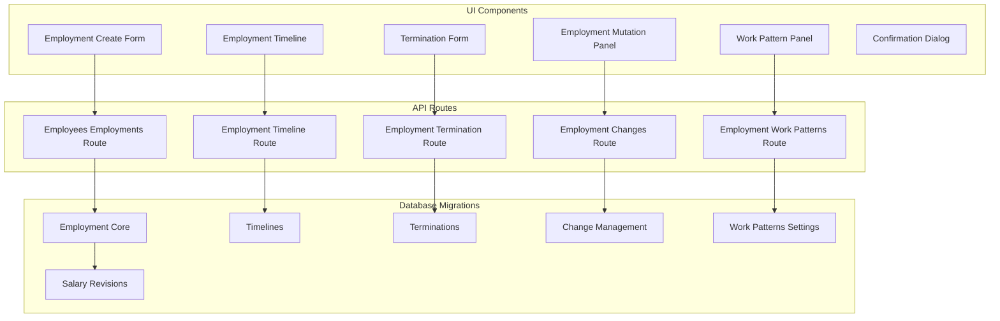

**Diagram sources**
- [employment-create-form.tsx](file://apps/hr-suite/components/employment/employment-create-form.tsx)
- [employment-timeline.tsx](file://apps/hr-suite/components/employment/employment-timeline.tsx)
- [work-pattern-panel.tsx](file://apps/hr-suite/components/employment/work-pattern-panel.tsx)
- [termination-form.tsx](file://apps/hr-suite/components/employment/termination-form.tsx)
- [employment-mutation-panel.tsx](file://apps/hr-suite/components/employment/employment-mutation-panel.tsx)
- [confirmation-dialog.tsx](file://apps/hr-suite/components/employment/confirmation-dialog.tsx)
- [route.ts (employees employment)](file://apps/hr-suite/app/api/employees/[employeeId]/employments/route.ts)
- [route.ts (employment changes)](file://apps/hr-suite/app/api/employments/[employmentId]/changes/route.ts)
- [route.ts (employment timeline)](file://apps/hr-suite/app/api/employments/[employmentId]/timeline/[timeline]/route.ts)
- [route.ts (employment termination)](file://apps/hr-suite/app/api/employments/[employmentId]/termination/route.ts)
- [route.ts (employment work patterns)](file://apps/hr-suite/app/api/employments/[employmentId]/work-patterns/route.ts)
- [20260715071156_add_employment_core.sql](file://apps/hr-suite/supabase/migrations/20260715071156_add_employment_core.sql)
- [20260715071422_add_employment_timelines.sql](file://apps/hr-suite/supabase/migrations/20260715071422_add_employment_timelines.sql)
- [20260715071717_add_employment_terminations.sql](file://apps/hr-suite/supabase/migrations/20260715071717_add_employment_terminations.sql)
- [20260715141843_add_employment_change_management.sql](file://apps/hr-suite/supabase/migrations/20260715141843_add_employment_change_management.sql)
- [20260718100000_add_job_catalog_salary_revisions.sql](file://apps/hr-suite/supabase/migrations/20260718100000_add_job_catalog_salary_revisions.sql)
- [20260718121308_add_settings_modules_work_patterns_holidays.sql](file://apps/hr-suite/supabase/migrations/20260718121308_add_settings_modules_work_patterns_holidays.sql)

**Section sources**
- [employment-create-form.tsx](file://apps/hr-suite/components/employment/employment-create-form.tsx)
- [employment-timeline.tsx](file://apps/hr-suite/components/employment/employment-timeline.tsx)
- [termination-form.tsx](file://apps/hr-suite/components/employment/termination-form.tsx)
- [work-pattern-panel.tsx](file://apps/hr-suite/components/employment/work-pattern-panel.tsx)
- [employment-mutation-panel.tsx](file://apps/hr-suite/components/employment/employment-mutation-panel.tsx)
- [confirmation-dialog.tsx](file://apps/hr-suite/components/employment/confirmation-dialog.tsx)
- [route.ts (employees employment)](file://apps/hr-suite/app/api/employees/[employeeId]/employments/route.ts)
- [route.ts (employment changes)](file://apps/hr-suite/app/api/employments/[employmentId]/changes/route.ts)
- [route.ts (employment timeline)](file://apps/hr-suite/app/api/employments/[employmentId]/timeline/[timeline]/route.ts)
- [route.ts (employment termination)](file://apps/hr-suite/app/api/employments/[employmentId]/termination/route.ts)
- [route.ts (employment work patterns)](file://apps/hr-suite/app/api/employments/[employmentId]/work-patterns/route.ts)
- [20260715071156_add_employment_core.sql](file://apps/hr-suite/supabase/migrations/20260715071156_add_employment_core.sql)
- [20260715071422_add_employment_timelines.sql](file://apps/hr-suite/supabase/migrations/20260715071422_add_employment_timelines.sql)
- [20260715071717_add_employment_terminations.sql](file://apps/hr-suite/supabase/migrations/20260715071717_add_employment_terminations.sql)
- [20260715141843_add_employment_change_management.sql](file://apps/hr-suite/supabase/migrations/20260715141843_add_employment_change_management.sql)
- [20260718100000_add_job_catalog_salary_revisions.sql](file://apps/hr-suite/supabase/migrations/20260718100000_add_job_catalog_salary_revisions.sql)
- [20260718121308_add_settings_modules_work_patterns_holidays.sql](file://apps/hr-suite/supabase/migrations/20260718121308_add_settings_modules_work_patterns_holidays.sql)

## Core Components
- Employment Create Form: Guides HR users through contract creation, linking to an employee master record, setting start/end dates, work patterns, job role, and salary information.
- Employment Timeline: Visualizes historical events and changes across the employment lifecycle, including start, modifications, and termination.
- Termination Form: Captures termination details such as end date, reason, and final settlement notes; triggers termination workflow.
- Work Pattern Panel: Configures schedules, working hours, and time arrangements aligned with organizational settings.
- Employment Mutation Panel: Manages changes to employment records, capturing diffs and audit trails.
- Confirmation Dialog: Ensures critical actions (e.g., termination, major changes) require explicit user confirmation.

These components integrate with API routes that enforce validation, authorization, and persistence, while leveraging database schemas for robust data integrity and compliance.

**Section sources**
- [employment-create-form.tsx](file://apps/hr-suite/components/employment/employment-create-form.tsx)
- [employment-timeline.tsx](file://apps/hr-suite/components/employment/employment-timeline.tsx)
- [termination-form.tsx](file://apps/hr-suite/components/employment/termination-form.tsx)
- [work-pattern-panel.tsx](file://apps/hr-suite/components/employment/work-pattern-panel.tsx)
- [employment-mutation-panel.tsx](file://apps/hr-suite/components/employment/employment-mutation-panel.tsx)
- [confirmation-dialog.tsx](file://apps/hr-suite/components/employment/confirmation-dialog.tsx)

## Architecture Overview
The employment lifecycle architecture connects UI components to API routes and database layers:
- UI components collect input and render visualizations.
- API routes validate requests, enforce policies, and persist data.
- Database migrations define core entities and relationships ensuring referential integrity and auditability.

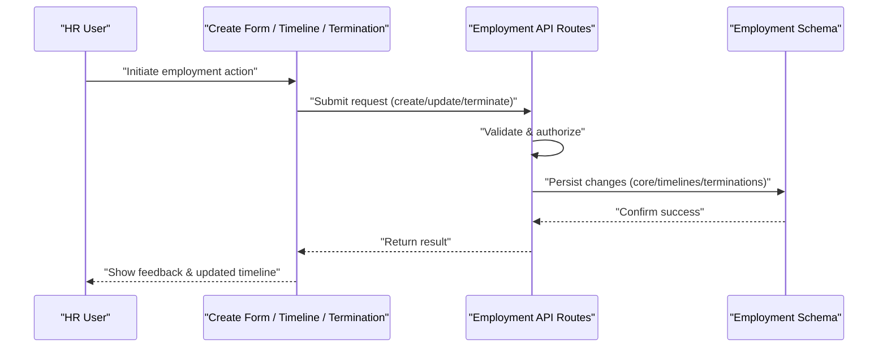

**Diagram sources**
- [employment-create-form.tsx](file://apps/hr-suite/components/employment/employment-create-form.tsx)
- [employment-timeline.tsx](file://apps/hr-suite/components/employment/employment-timeline.tsx)
- [termination-form.tsx](file://apps/hr-suite/components/employment/termination-form.tsx)
- [route.ts (employees employment)](file://apps/hr-suite/app/api/employees/[employeeId]/employments/route.ts)
- [route.ts (employment changes)](file://apps/hr-suite/app/api/employments/[employmentId]/changes/route.ts)
- [route.ts (employment termination)](file://apps/hr-suite/app/api/employments/[employmentId]/termination/route.ts)
- [20260715071156_add_employment_core.sql](file://apps/hr-suite/supabase/migrations/20260715071156_add_employment_core.sql)
- [20260715071422_add_employment_timelines.sql](file://apps/hr-suite/supabase/migrations/20260715071422_add_employment_timelines.sql)
- [20260715071717_add_employment_terminations.sql](file://apps/hr-suite/supabase/migrations/20260715071717_add_employment_terminations.sql)

## Detailed Component Analysis

### Employment Data Model
Core employment entities include:
- Employment record: links to employee, job role, department, start/end dates, status, and salary references.
- Timeline entries: capture chronological events and changes for audit and visibility.
- Termination records: store termination reasons, effective dates, and related notes.
- Work patterns: define schedules, working hours, and time arrangements tied to organizational settings.
- Salary revisions: track compensation changes over time.

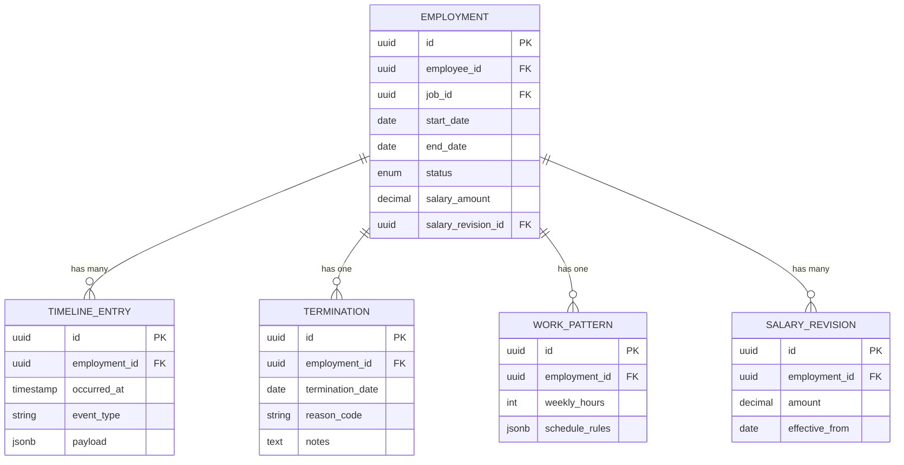

**Diagram sources**
- [20260715071156_add_employment_core.sql](file://apps/hr-suite/supabase/migrations/20260715071156_add_employment_core.sql)
- [20260715071422_add_employment_timelines.sql](file://apps/hr-suite/supabase/migrations/20260715071422_add_employment_timelines.sql)
- [20260715071717_add_employment_terminations.sql](file://apps/hr-suite/supabase/migrations/20260715071717_add_employment_terminations.sql)
- [20260718100000_add_job_catalog_salary_revisions.sql](file://apps/hr-suite/supabase/migrations/20260718100000_add_job_catalog_salary_revisions.sql)
- [20260718121308_add_settings_modules_work_patterns_holidays.sql](file://apps/hr-suite/supabase/migrations/20260718121308_add_settings_modules_work_patterns_holidays.sql)

**Section sources**
- [20260715071156_add_employment_core.sql](file://apps/hr-suite/supabase/migrations/20260715071156_add_employment_core.sql)
- [20260715071422_add_employment_timelines.sql](file://apps/hr-suite/supabase/migrations/20260715071422_add_employment_timelines.sql)
- [20260715071717_add_employment_terminations.sql](file://apps/hr-suite/supabase/migrations/20260715071717_add_employment_terminations.sql)
- [20260718100000_add_job_catalog_salary_revisions.sql](file://apps/hr-suite/supabase/migrations/20260718100000_add_job_catalog_salary_revisions.sql)
- [20260718121308_add_settings_modules_work_patterns_holidays.sql](file://apps/hr-suite/supabase/migrations/20260718121308_add_settings_modules_work_patterns_holidays.sql)

### Employment Creation Workflow
The create form guides users through:
- Selecting or linking an employee master record.
- Defining contract start date and optional end date.
- Choosing job role and department.
- Setting work patterns and salary details.
- Submitting the form to create the employment record and initial timeline entry.

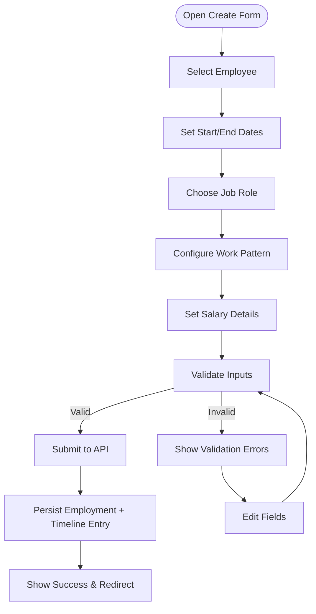

**Diagram sources**
- [employment-create-form.tsx](file://apps/hr-suite/components/employment/employment-create-form.tsx)
- [route.ts (employees employment)](file://apps/hr-suite/app/api/employees/[employeeId]/employments/route.ts)
- [20260715071156_add_employment_core.sql](file://apps/hr-suite/supabase/migrations/20260715071156_add_employment_core.sql)
- [20260715071422_add_employment_timelines.sql](file://apps/hr-suite/supabase/migrations/20260715071422_add_employment_timelines.sql)

**Section sources**
- [employment-create-form.tsx](file://apps/hr-suite/components/employment/employment-create-form.tsx)
- [route.ts (employees employment)](file://apps/hr-suite/app/api/employees/[employeeId]/employments/route.ts)

### Timeline Visualization
The timeline component displays chronological events for an employment, including:
- Contract start and updates.
- Work pattern changes.
- Salary revisions.
- Termination events.

Users can navigate through different timeline views and drill into specific events for details.

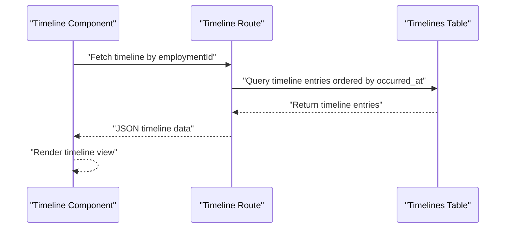

**Diagram sources**
- [employment-timeline.tsx](file://apps/hr-suite/components/employment/employment-timeline.tsx)
- [route.ts (employment timeline)](file://apps/hr-suite/app/api/employments/[employmentId]/timeline/[timeline]/route.ts)
- [20260715071422_add_employment_timelines.sql](file://apps/hr-suite/supabase/migrations/20260715071422_add_employment_timelines.sql)

**Section sources**
- [employment-timeline.tsx](file://apps/hr-suite/components/employment/employment-timeline.tsx)
- [route.ts (employment timeline)](file://apps/hr-suite/app/api/employments/[employmentId]/timeline/[timeline]/route.ts)

### Termination Process Management
The termination form captures:
- Termination date and reason code.
- Optional notes for compliance and final settlements.
- Confirmation dialog to ensure intentional termination.

Upon submission, the system persists termination details and creates a termination timeline entry.

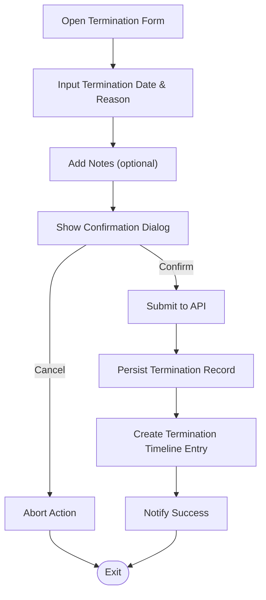

**Diagram sources**
- [termination-form.tsx](file://apps/hr-suite/components/employment/termination-form.tsx)
- [confirmation-dialog.tsx](file://apps/hr-suite/components/employment/confirmation-dialog.tsx)
- [route.ts (employment termination)](file://apps/hr-suite/app/api/employments/[employmentId]/termination/route.ts)
- [20260715071717_add_employment_terminations.sql](file://apps/hr-suite/supabase/migrations/20260715071717_add_employment_terminations.sql)

**Section sources**
- [termination-form.tsx](file://apps/hr-suite/components/employment/termination-form.tsx)
- [confirmation-dialog.tsx](file://apps/hr-suite/components/employment/confirmation-dialog.tsx)
- [route.ts (employment termination)](file://apps/hr-suite/app/api/employments/[employmentId]/termination/route.ts)

### Work Pattern Configuration System
The work pattern panel allows configuring:
- Weekly hours and schedule rules.
- Alignment with organizational settings and holidays.
- Linking to employment records for accurate time tracking.

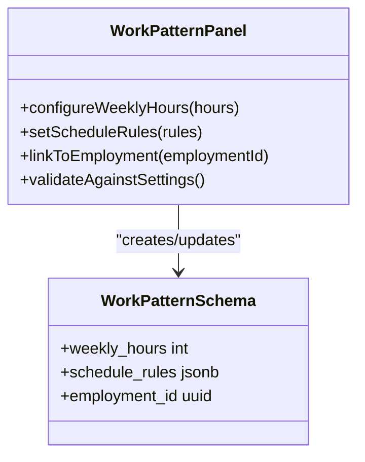

**Diagram sources**
- [work-pattern-panel.tsx](file://apps/hr-suite/components/employment/work-pattern-panel.tsx)
- [route.ts (employment work patterns)](file://apps/hr-suite/app/api/employments/[employmentId]/work-patterns/route.ts)
- [20260718121308_add_settings_modules_work_patterns_holidays.sql](file://apps/hr-suite/supabase/migrations/20260718121308_add_settings_modules_work_patterns_holidays.sql)

**Section sources**
- [work-pattern-panel.tsx](file://apps/hr-suite/components/employment/work-pattern-panel.tsx)
- [route.ts (employment work patterns)](file://apps/hr-suite/app/api/employments/[employmentId]/work-patterns/route.ts)

### Employment Mutations and Change Tracking
The mutation panel manages changes to employment records:
- Captures diffs between old and new values.
- Persists change entries with timestamps and actor information.
- Integrates with timeline for comprehensive audit trails.

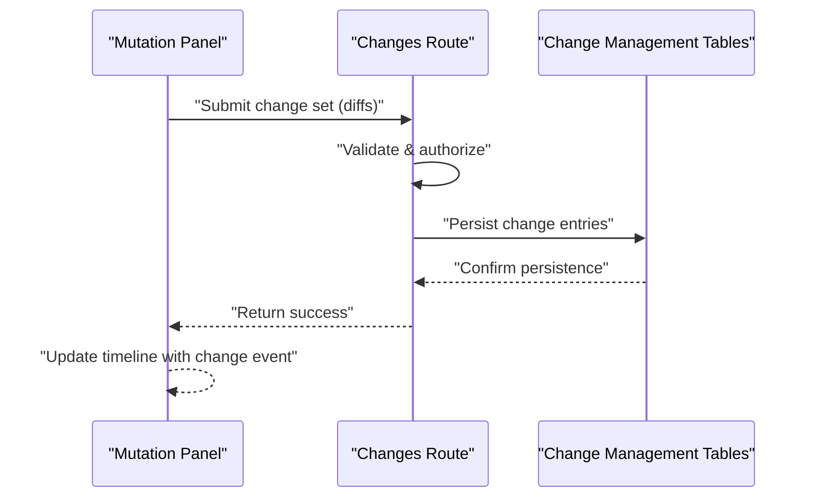

**Diagram sources**
- [employment-mutation-panel.tsx](file://apps/hr-suite/components/employment/employment-mutation-panel.tsx)
- [route.ts (employment changes)](file://apps/hr-suite/app/api/employments/[employmentId]/changes/route.ts)
- [20260715141843_add_employment_change_management.sql](file://apps/hr-suite/supabase/migrations/20260715141843_add_employment_change_management.sql)

**Section sources**
- [employment-mutation-panel.tsx](file://apps/hr-suite/components/employment/employment-mutation-panel.tsx)
- [route.ts (employment changes)](file://apps/hr-suite/app/api/employments/[employmentId]/changes/route.ts)

### Confirmation Dialogs for Critical Actions
Critical actions like termination or major employment changes trigger confirmation dialogs to prevent accidental operations. The dialog ensures explicit user intent before proceeding.

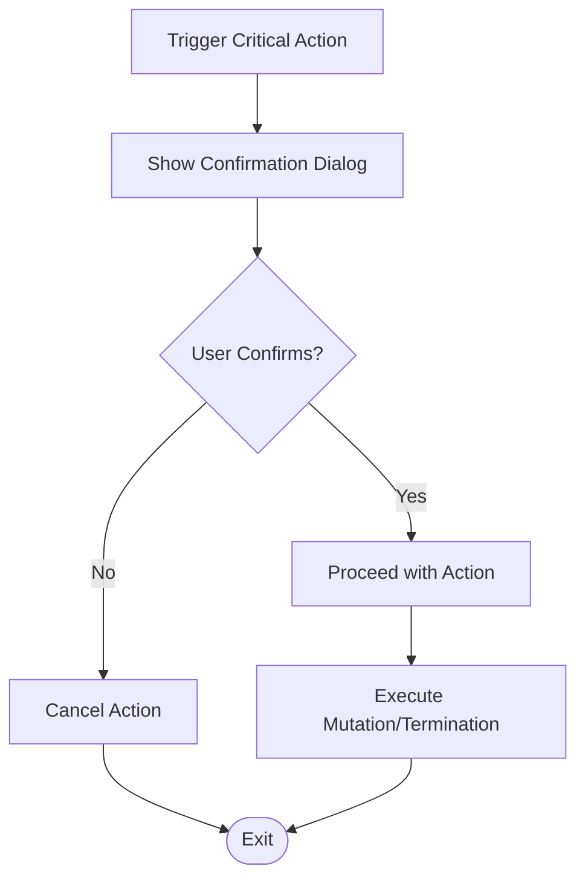

**Diagram sources**
- [confirmation-dialog.tsx](file://apps/hr-suite/components/employment/confirmation-dialog.tsx)

**Section sources**
- [confirmation-dialog.tsx](file://apps/hr-suite/components/employment/confirmation-dialog.tsx)

### Integration with Employee Master Data
Employment records link to employee master data through foreign keys. The create form requires selecting an existing employee or creating a new one, ensuring consistency across HR systems.

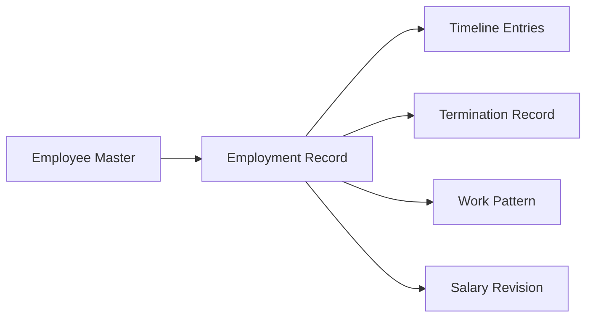

**Diagram sources**
- [employment-create-form.tsx](file://apps/hr-suite/components/employment/employment-create-form.tsx)
- [20260715071156_add_employment_core.sql](file://apps/hr-suite/supabase/migrations/20260715071156_add_employment_core.sql)

**Section sources**
- [employment-create-form.tsx](file://apps/hr-suite/components/employment/employment-create-form.tsx)
- [20260715071156_add_employment_core.sql](file://apps/hr-suite/supabase/migrations/20260715071156_add_employment_core.sql)

### Practical Scenarios
- New Hire Onboarding: Use the create form to link a new employee, set start date, assign job role, configure work patterns, and set initial salary.
- Contract Renewals: Update employment end date and create a new term with revised terms; timeline captures renewal events.
- Position Changes: Modify job role and salary via mutation panel; changes are tracked and reflected in timeline.
- Employee Terminations: Use termination form to record end date, reason, and notes; confirmation dialog prevents accidental terminations.

[No sources needed since this section provides general guidance]

### Business Rules and Compliance
- Validation rules enforce required fields, date constraints, and policy alignment.
- Approval workflows may be integrated via change sets requiring authorization before persistence.
- Compliance requirements are supported through detailed audit trails, timeline entries, and termination documentation.

[No sources needed since this section provides general guidance]

## Dependency Analysis
Components depend on API routes which interact with database schemas. Dependencies are structured to maintain separation of concerns and facilitate testing and maintenance.

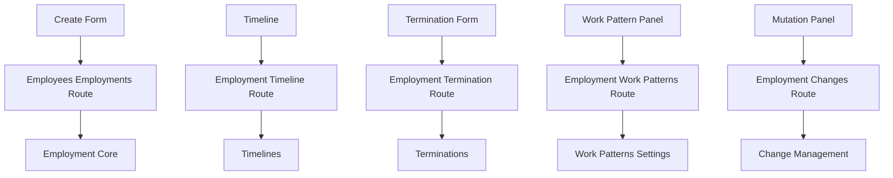

**Diagram sources**
- [employment-create-form.tsx](file://apps/hr-suite/components/employment/employment-create-form.tsx)
- [employment-timeline.tsx](file://apps/hr-suite/components/employment/employment-timeline.tsx)
- [termination-form.tsx](file://apps/hr-suite/components/employment/termination-form.tsx)
- [work-pattern-panel.tsx](file://apps/hr-suite/components/employment/work-pattern-panel.tsx)
- [employment-mutation-panel.tsx](file://apps/hr-suite/components/employment/employment-mutation-panel.tsx)
- [route.ts (employees employment)](file://apps/hr-suite/app/api/employees/[employeeId]/employments/route.ts)
- [route.ts (employment timeline)](file://apps/hr-suite/app/api/employments/[employmentId]/timeline/[timeline]/route.ts)
- [route.ts (employment termination)](file://apps/hr-suite/app/api/employments/[employmentId]/termination/route.ts)
- [route.ts (employment work patterns)](file://apps/hr-suite/app/api/employments/[employmentId]/work-patterns/route.ts)
- [route.ts (employment changes)](file://apps/hr-suite/app/api/employments/[employmentId]/changes/route.ts)
- [20260715071156_add_employment_core.sql](file://apps/hr-suite/supabase/migrations/20260715071156_add_employment_core.sql)
- [20260715071422_add_employment_timelines.sql](file://apps/hr-suite/supabase/migrations/20260715071422_add_employment_timelines.sql)
- [20260715071717_add_employment_terminations.sql](file://apps/hr-suite/supabase/migrations/20260715071717_add_employment_terminations.sql)
- [20260715141843_add_employment_change_management.sql](file://apps/hr-suite/supabase/migrations/20260715141843_add_employment_change_management.sql)
- [20260718121308_add_settings_modules_work_patterns_holidays.sql](file://apps/hr-suite/supabase/migrations/20260718121308_add_settings_modules_work_patterns_holidays.sql)

**Section sources**
- [employment-create-form.tsx](file://apps/hr-suite/components/employment/employment-create-form.tsx)
- [employment-timeline.tsx](file://apps/hr-suite/components/employment/employment-timeline.tsx)
- [termination-form.tsx](file://apps/hr-suite/components/employment/termination-form.tsx)
- [work-pattern-panel.tsx](file://apps/hr-suite/components/employment/work-pattern-panel.tsx)
- [employment-mutation-panel.tsx](file://apps/hr-suite/components/employment/employment-mutation-panel.tsx)
- [route.ts (employees employment)](file://apps/hr-suite/app/api/employees/[employeeId]/employments/route.ts)
- [route.ts (employment timeline)](file://apps/hr-suite/app/api/employments/[employmentId]/timeline/[timeline]/route.ts)
- [route.ts (employment termination)](file://apps/hr-suite/app/api/employments/[employmentId]/termination/route.ts)
- [route.ts (employment work patterns)](file://apps/hr-suite/app/api/employments/[employmentId]/work-patterns/route.ts)
- [route.ts (employment changes)](file://apps/hr-suite/app/api/employments/[employmentId]/changes/route.ts)
- [20260715071156_add_employment_core.sql](file://apps/hr-suite/supabase/migrations/20260715071156_add_employment_core.sql)
- [20260715071422_add_employment_timelines.sql](file://apps/hr-suite/supabase/migrations/20260715071422_add_employment_timelines.sql)
- [20260715071717_add_employment_terminations.sql](file://apps/hr-suite/supabase/migrations/20260715071717_add_employment_terminations.sql)
- [20260715141843_add_employment_change_management.sql](file://apps/hr-suite/supabase/migrations/20260715141843_add_employment_change_management.sql)
- [20260718121308_add_settings_modules_work_patterns_holidays.sql](file://apps/hr-suite/supabase/migrations/20260718121308_add_settings_modules_work_patterns_holidays.sql)

## Performance Considerations
- Minimize network calls by batching requests where possible.
- Use efficient queries with appropriate indexes on frequently accessed fields (e.g., employment_id, occurred_at).
- Implement pagination for timeline and change logs to improve rendering performance.
- Cache static configuration data like work patterns and holiday settings at the client level when appropriate.

[No sources needed since this section provides general guidance]

## Troubleshooting Guide
Common issues and resolutions:
- Validation errors during employment creation: Ensure all required fields are filled and dates are valid.
- Timeline not updating: Verify API responses and check for missing timeline entries.
- Termination not persisting: Confirm user has permission and that confirmation dialog was completed.
- Work pattern conflicts: Check alignment with organizational settings and holiday calendars.

**Section sources**
- [employment-create-form.tsx](file://apps/hr-suite/components/employment/employment-create-form.tsx)
- [employment-timeline.tsx](file://apps/hr-suite/components/employment/employment-timeline.tsx)
- [termination-form.tsx](file://apps/hr-suite/components/employment/termination-form.tsx)
- [work-pattern-panel.tsx](file://apps/hr-suite/components/employment/work-pattern-panel.tsx)

## Conclusion
The Employment Lifecycle management system in LiquidHR provides a comprehensive solution for managing the entire employment relationship. Through well-structured UI components, robust API routes, and a solid database schema, it supports creation, modification, timeline tracking, and termination of employment records. The system enforces business rules, maintains audit trails, and integrates seamlessly with employee master data, ensuring compliance and operational efficiency.

[No sources needed since this section summarizes without analyzing specific files]