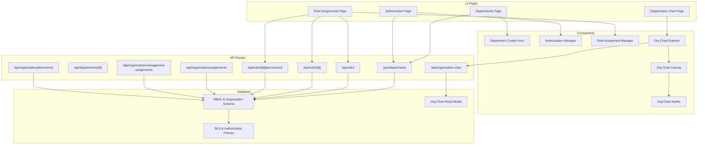
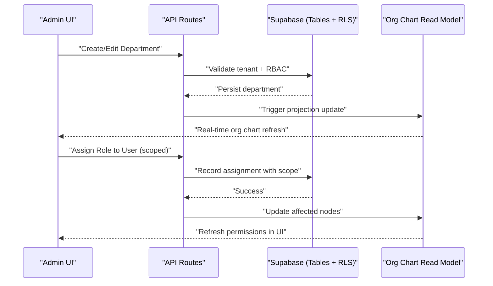
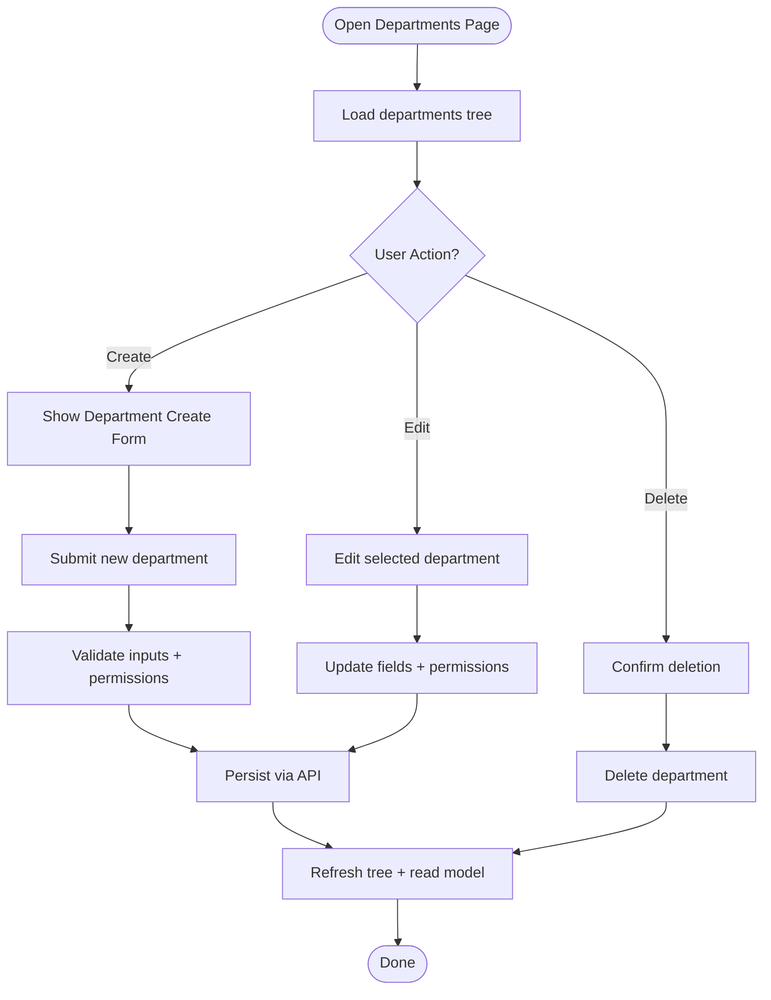
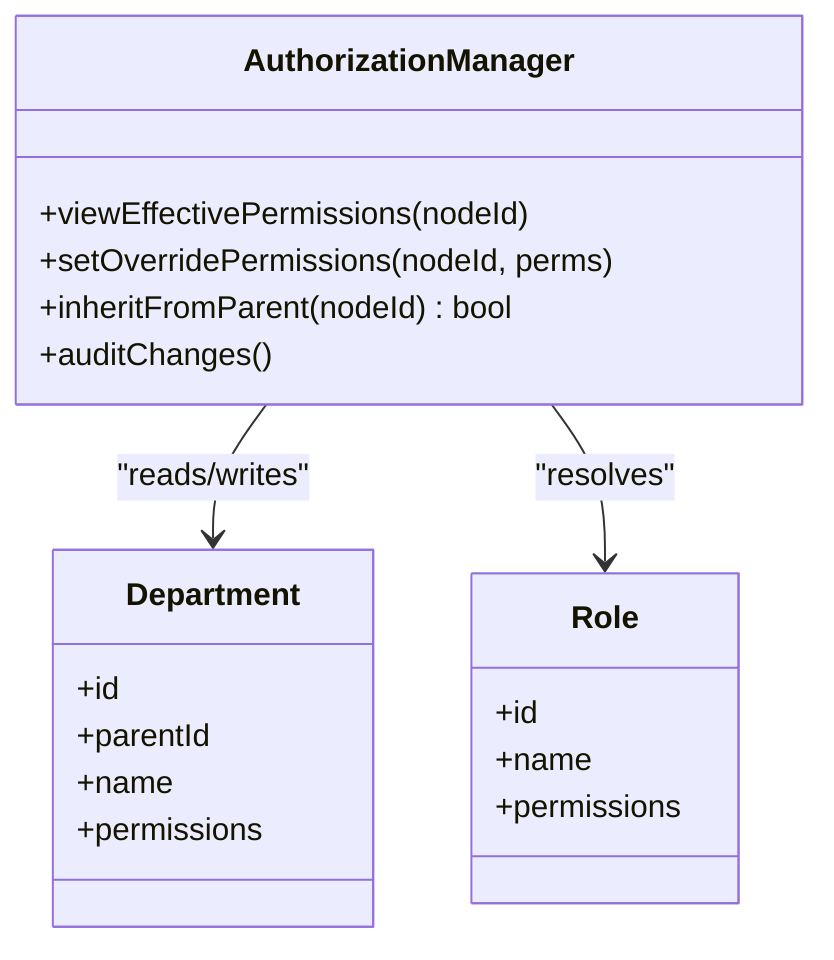
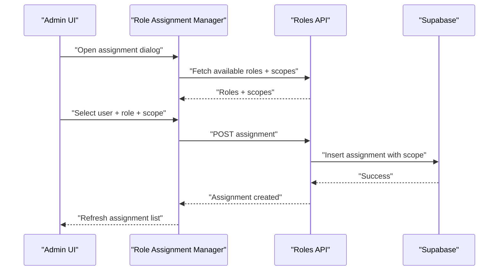
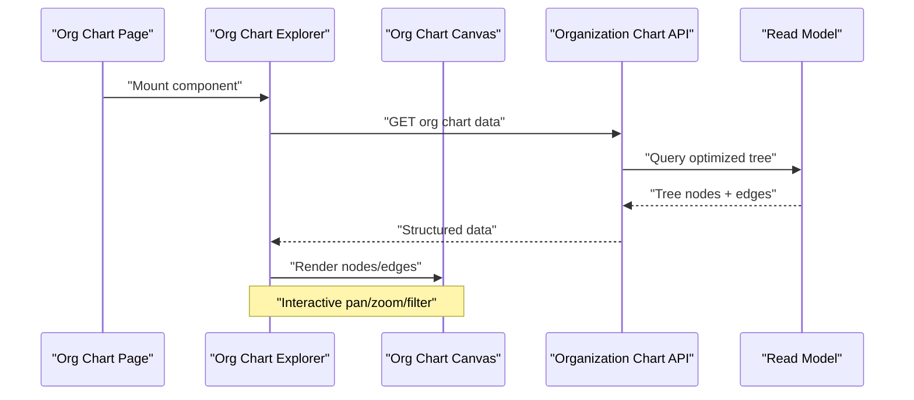
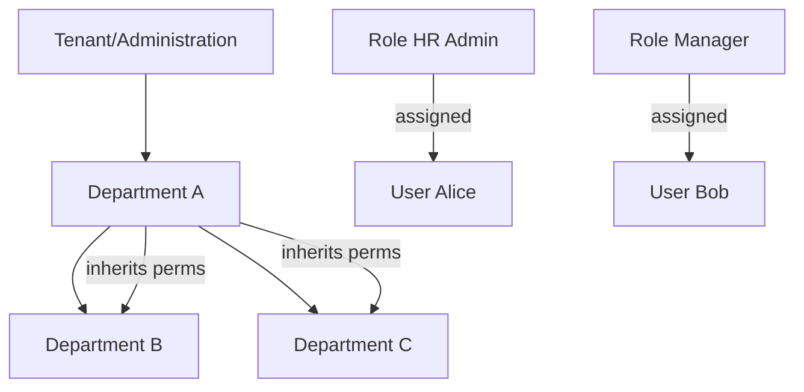
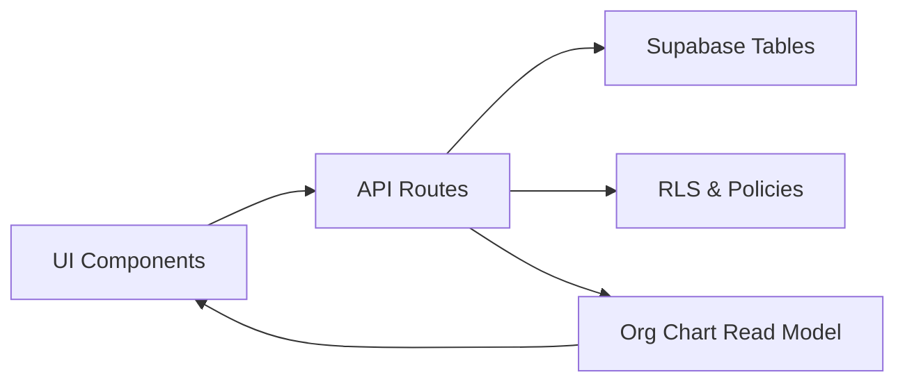

# Organization Structure

<cite>
**Referenced Files in This Document**
- [page.tsx](file://apps/hr-suite/app/(dashboard)/departments/page.tsx)
- [route.ts](file://apps/hr-suite/app/api/departments/route.ts)
- [route.ts](file://apps/hr-suite/app/api/departments/[departmentId]/route.ts)
- [authorization-manager.tsx](file://apps/hr-suite/components/organization/authorization-manager.tsx)
- [role-assignment-manager.tsx](file://apps/hr-suite/components/organization/role-assignment-manager.tsx)
- [department-create-form.tsx](file://apps/hr-suite/components/organization/department-create-form.tsx)
- [organization-chart-explorer.tsx](file://apps/hr-suite/components/organization-chart/organization-chart-explorer.tsx)
- [organization-chart-canvas.tsx](file://apps/hr-suite/components/organization-chart/organization-chart-canvas.tsx)
- [organization-chart-nodes.tsx](file://apps/hr-suite/components/organization-chart/organization-chart-nodes.tsx)
- [route.ts](file://apps/hr-suite/app/api/organization-chart/route.ts)
- [route.test.ts](file://apps/hr-suite/app/api/organization-chart/route.test.ts)
- [assignments/route.ts](file://apps/hr-suite/app/api/organization/assignments/route.ts)
- [management-assignments/route.ts](file://apps/hr-suite/app/api/organization/management-assignments/route.ts)
- [placements/route.ts](file://apps/hr-suite/app/api/organization/placements/route.ts)
- [route.ts](file://apps/hr-suite/app/api/roles/route.ts)
- [route.ts](file://apps/hr-suite/app/api/roles/[roleId]/route.ts)
- [permissions/route.ts](file://apps/hr-suite/app/api/roles/[roleId]/permissions/route.ts)
- [20260712124911_add_tenant_rbac_and_organization.sql](file://apps/hr-suite/supabase/migrations/20260712124911_add_tenant_rbac_and_organization.sql)
- [20260715123639_add_organization_authorization_management.sql](file://apps/hr-suite/supabase/migrations/20260715123639_add_organization_authorization_management.sql)
- [20260716110000_add_organization_chart_read_model.sql](file://apps/hr-suite/supabase/migrations/20260716110000_add_organization_chart_read_model.sql)
- [AFDELINGEN_EN_ROLLEN.md](file://docs/requirements/organization/AFDELINGEN_EN_ROLLEN.md)
- [ORGANOGRAM.md](file://docs/requirements/organization/ORGANOGRAM.md)
</cite>

## Table of Contents
1. [Introduction](#introduction)
2. [Project Structure](#project-structure)
3. [Core Components](#core-components)
4. [Architecture Overview](#architecture-overview)
5. [Detailed Component Analysis](#detailed-component-analysis)
6. [Dependency Analysis](#dependency-analysis)
7. [Performance Considerations](#performance-considerations)
8. [Troubleshooting Guide](#troubleshooting-guide)
9. [Conclusion](#conclusion)
10. [Appendices](#appendices)

## Introduction
This document explains the Organization Structure management system in LiquidHR, focusing on how departments are modeled and managed, how roles and permissions are assigned across organizational levels, and how the organization chart visualizes reporting relationships. It covers RBAC implementation, authorization policies, multitenancy isolation, department permission inheritance, and real-time synchronization of organizational changes. Practical examples guide administrators through setting up structures, assigning roles, managing hierarchies, and using the interactive org chart explorer. Security considerations and performance optimizations for large organizations are also included.

## Project Structure
The organization structure feature spans UI pages, API routes, reusable components, and database migrations:
- UI pages for departments, role assignments, authorization management, and organization chart
- API routes for CRUD operations on departments, roles, permissions, and organization chart read model
- Reusable components for authorization manager, role assignment manager, department creation form, and org chart visualization
- Database schema and policies that enforce tenant isolation, RBAC, and department hierarchy

**Diagram sources**
- [page.tsx](file://apps/hr-suite/app/(dashboard)/departments/page.tsx)
- [route.ts](file://apps/hr-suite/app/api/departments/route.ts)
- [route.ts](file://apps/hr-suite/app/api/departments/[departmentId]/route.ts)
- [authorization-manager.tsx](file://apps/hr-suite/components/organization/authorization-manager.tsx)
- [role-assignment-manager.tsx](file://apps/hr-suite/components/organization/role-assignment-manager.tsx)
- [department-create-form.tsx](file://apps/hr-suite/components/organization/department-create-form.tsx)
- [organization-chart-explorer.tsx](file://apps/hr-suite/components/organization-chart/organization-chart-explorer.tsx)
- [organization-chart-canvas.tsx](file://apps/hr-suite/components/organization-chart/organization-chart-canvas.tsx)
- [organization-chart-nodes.tsx](file://apps/hr-suite/components/organization-chart/organization-chart-nodes.tsx)
- [route.ts](file://apps/hr-suite/app/api/organization-chart/route.ts)
- [assignments/route.ts](file://apps/hr-suite/app/api/organization/assignments/route.ts)
- [management-assignments/route.ts](file://apps/hr-suite/app/api/organization/management-assignments/route.ts)
- [placements/route.ts](file://apps/hr-suite/app/api/organization/placements/route.ts)
- [route.ts](file://apps/hr-suite/app/api/roles/route.ts)
- [route.ts](file://apps/hr-suite/app/api/roles/[roleId]/route.ts)
- [permissions/route.ts](file://apps/hr-suite/app/api/roles/[roleId]/permissions/route.ts)
- [20260712124911_add_tenant_rbac_and_organization.sql](file://apps/hr-suite/supabase/migrations/20260712124911_add_tenant_rbac_and_organization.sql)
- [20260715123639_add_organization_authorization_management.sql](file://apps/hr-suite/supabase/migrations/20260715123639_add_organization_authorization_management.sql)
- [20260716110000_add_organization_chart_read_model.sql](file://apps/hr-suite/supabase/migrations/20260716110000_add_organization_chart_read_model.sql)

**Section sources**
- [page.tsx](file://apps/hr-suite/app/(dashboard)/departments/page.tsx)
- [route.ts](file://apps/hr-suite/app/api/departments/route.ts)
- [route.ts](file://apps/hr-suite/app/api/departments/[departmentId]/route.ts)
- [authorization-manager.tsx](file://apps/hr-suite/components/organization/authorization-manager.tsx)
- [role-assignment-manager.tsx](file://apps/hr-suite/components/organization/role-assignment-manager.tsx)
- [department-create-form.tsx](file://apps/hr-suite/components/organization/department-create-form.tsx)
- [organization-chart-explorer.tsx](file://apps/hr-suite/components/organization-chart/organization-chart-explorer.tsx)
- [organization-chart-canvas.tsx](file://apps/hr-suite/components/organization-chart/organization-chart-canvas.tsx)
- [organization-chart-nodes.tsx](file://apps/hr-suite/components/organization-chart/organization-chart-nodes.tsx)
- [route.ts](file://apps/hr-suite/app/api/organization-chart/route.ts)
- [assignments/route.ts](file://apps/hr-suite/app/api/organization/assignments/route.ts)
- [management-assignments/route.ts](file://apps/hr-suite/app/api/organization/management-assignments/route.ts)
- [placements/route.ts](file://apps/hr-suite/app/api/organization/placements/route.ts)
- [route.ts](file://apps/hr-suite/app/api/roles/route.ts)
- [route.ts](file://apps/hr-suite/app/api/roles/[roleId]/route.ts)
- [permissions/route.ts](file://apps/hr-suite/app/api/roles/[roleId]/permissions/route.ts)
- [20260712124911_add_tenant_rbac_and_organization.sql](file://apps/hr-suite/supabase/migrations/20260712124911_add_tenant_rbac_and_organization.sql)
- [20260715123639_add_organization_authorization_management.sql](file://apps/hr-suite/supabase/migrations/20260715123639_add_organization_authorization_management.sql)
- [20260716110000_add_organization_chart_read_model.sql](file://apps/hr-suite/supabase/migrations/20260716110000_add_organization_chart_read_model.sql)

## Core Components
- Department data model and hierarchy: Departments are stored with parent-child relationships to represent organizational hierarchy. The schema supports hierarchical queries and enforces tenant isolation via RLS policies.
- Role-based access control (RBAC): Roles define sets of permissions. Users are mapped to roles with optional scope constraints (e.g., by department or administration). Permissions can be inherited from parent departments where applicable.
- Authorization policies: Fine-grained policies govern who can view or modify departments, roles, and assignments. Policies leverage tenant context and user role resolution at query time.
- Department creation and management interface: A dedicated page and form allow admins to create and edit departments, set parents, and configure initial permissions.
- Role assignment workflows: Administrators assign roles to users within specific scopes (e.g., a department), enabling scoped authorization.
- Organization chart visualization: An interactive explorer renders the hierarchy, supports zooming and filtering, and reflects real-time updates when the underlying data changes.

Key implementation highlights:
- Multitenancy: All organization data is scoped to an administration/tenant context; cross-tenant access is blocked by RLS and policy checks.
- Inheritance: Department-level permissions can propagate down the hierarchy unless explicitly overridden.
- Real-time sync: Changes to departments, roles, and assignments trigger projections into a read model optimized for org chart rendering.

**Section sources**
- [20260712124911_add_tenant_rbac_and_organization.sql](file://apps/hr-suite/supabase/migrations/20260712124911_add_tenant_rbac_and_organization.sql)
- [20260715123639_add_organization_authorization_management.sql](file://apps/hr-suite/supabase/migrations/20260715123639_add_organization_authorization_management.sql)
- [20260716110000_add_organization_chart_read_model.sql](file://apps/hr-suite/supabase/migrations/20260716110000_add_organization_chart_read_model.sql)
- [AFDELINGEN_EN_ROLLEN.md](file://docs/requirements/organization/AFDELINGEN_EN_ROLLEN.md)
- [ORGANOGRAM.md](file://docs/requirements/organization/ORGANOGRAM.md)

## Architecture Overview
The system follows a layered architecture:
- Presentation layer: Next.js pages and React components render UIs for departments, roles, and org chart.
- API layer: Route handlers orchestrate validation, authorization checks, and data operations.
- Data layer: Supabase tables store core entities; Row-Level Security (RLS) and policies enforce tenant isolation and RBAC.
- Read model: A projection table optimizes org chart queries and supports real-time updates.

**Diagram sources**
- [route.ts](file://apps/hr-suite/app/api/departments/route.ts)
- [route.ts](file://apps/hr-suite/app/api/departments/[departmentId]/route.ts)
- [route.ts](file://apps/hr-suite/app/api/organization-chart/route.ts)
- [20260716110000_add_organization_chart_read_model.sql](file://apps/hr-suite/supabase/migrations/20260716110000_add_organization_chart_read_model.sql)

**Section sources**
- [route.ts](file://apps/hr-suite/app/api/departments/route.ts)
- [route.ts](file://apps/hr-suite/app/api/departments/[departmentId]/route.ts)
- [route.ts](file://apps/hr-suite/app/api/organization-chart/route.ts)
- [20260716110000_add_organization_chart_read_model.sql](file://apps/hr-suite/supabase/migrations/20260716110000_add_organization_chart_read_model.sql)

## Detailed Component Analysis

### Department Management
- Purpose: Create, update, delete, and list departments with hierarchical relationships.
- UI: Departments page integrates a create/edit form and a list/tree view.
- API: Endpoints handle CRUD operations, validate tenant context, and enforce RBAC.
- Data: Hierarchical storage with parent_id references; policies ensure only authorized tenants/users can mutate.

**Diagram sources**
- [page.tsx](file://apps/hr-suite/app/(dashboard)/departments/page.tsx)
- [department-create-form.tsx](file://apps/hr-suite/components/organization/department-create-form.tsx)
- [route.ts](file://apps/hr-suite/app/api/departments/route.ts)
- [route.ts](file://apps/hr-suite/app/api/departments/[departmentId]/route.ts)

**Section sources**
- [page.tsx](file://apps/hr-suite/app/(dashboard)/departments/page.tsx)
- [department-create-form.tsx](file://apps/hr-suite/components/organization/department-create-form.tsx)
- [route.ts](file://apps/hr-suite/app/api/departments/route.ts)
- [route.ts](file://apps/hr-suite/app/api/departments/[departmentId]/route.ts)

### Authorization Manager
- Purpose: Configure permissions at different organizational levels (tenant, department, role).
- Features: View effective permissions per node, override inherited permissions, and audit changes.
- Integration: Works with RBAC policies and department hierarchy to compute effective access.

**Diagram sources**
- [authorization-manager.tsx](file://apps/hr-suite/components/organization/authorization-manager.tsx)
- [20260715123639_add_organization_authorization_management.sql](file://apps/hr-suite/supabase/migrations/20260715123639_add_organization_authorization_management.sql)

**Section sources**
- [authorization-manager.tsx](file://apps/hr-suite/components/organization/authorization-manager.tsx)
- [20260715123639_add_organization_authorization_management.sql](file://apps/hr-suite/supabase/migrations/20260715123639_add_organization_authorization_management.sql)

### Role Assignment Manager
- Purpose: Map users to roles with optional scope (e.g., department or administration).
- Workflow: Select user, choose role(s), apply scope, persist assignment, and refresh UI.
- Validation: Ensures the current user has sufficient privileges to assign roles within the target scope.

**Diagram sources**
- [role-assignment-manager.tsx](file://apps/hr-suite/components/organization/role-assignment-manager.tsx)
- [route.ts](file://apps/hr-suite/app/api/roles/route.ts)
- [route.ts](file://apps/hr-suite/app/api/roles/[roleId]/route.ts)
- [permissions/route.ts](file://apps/hr-suite/app/api/roles/[roleId]/permissions/route.ts)

**Section sources**
- [role-assignment-manager.tsx](file://apps/hr-suite/components/organization/role-assignment-manager.tsx)
- [route.ts](file://apps/hr-suite/app/api/roles/route.ts)
- [route.ts](file://apps/hr-suite/app/api/roles/[roleId]/route.ts)
- [permissions/route.ts](file://apps/hr-suite/app/api/roles/[roleId]/permissions/route.ts)

### Organization Chart Explorer
- Purpose: Visualize hierarchical reporting relationships interactively.
- Features: Zoom/pan, filter by department, highlight paths, and reflect real-time updates.
- Data source: Reads from a dedicated read model optimized for tree traversal and efficient rendering.

**Diagram sources**
- [organization-chart-explorer.tsx](file://apps/hr-suite/components/organization-chart/organization-chart-explorer.tsx)
- [organization-chart-canvas.tsx](file://apps/hr-suite/components/organization-chart/organization-chart-canvas.tsx)
- [organization-chart-nodes.tsx](file://apps/hr-suite/components/organization-chart/organization-chart-nodes.tsx)
- [route.ts](file://apps/hr-suite/app/api/organization-chart/route.ts)
- [20260716110000_add_organization_chart_read_model.sql](file://apps/hr-suite/supabase/migrations/20260716110000_add_organization_chart_read_model.sql)

**Section sources**
- [organization-chart-explorer.tsx](file://apps/hr-suite/components/organization-chart/organization-chart-explorer.tsx)
- [organization-chart-canvas.tsx](file://apps/hr-suite/components/organization-chart/organization-chart-canvas.tsx)
- [organization-chart-nodes.tsx](file://apps/hr-suite/components/organization-chart/organization-chart-nodes.tsx)
- [route.ts](file://apps/hr-suite/app/api/organization-chart/route.ts)
- [20260716110000_add_organization_chart_read_model.sql](file://apps/hr-suite/supabase/migrations/20260716110000_add_organization_chart_read_model.sql)

### Conceptual Overview
The organization structure comprises:
- Departments forming a tree with parent-child links
- Roles defining permission sets
- Assignments linking users to roles within scopes
- Policies enforcing tenant isolation and RBAC at query time
- A read model optimizing org chart queries and supporting real-time updates

[No sources needed since this diagram shows conceptual workflow, not actual code structure]

## Dependency Analysis
- UI components depend on API routes for data operations and state synchronization.
- API routes depend on database schema and policies for enforcement.
- Read model depends on write operations to stay consistent for org chart rendering.
- RBAC and tenant isolation are enforced centrally via policies and role resolution logic.

**Diagram sources**
- [route.ts](file://apps/hr-suite/app/api/departments/route.ts)
- [route.ts](file://apps/hr-suite/app/api/organization-chart/route.ts)
- [20260712124911_add_tenant_rbac_and_organization.sql](file://apps/hr-suite/supabase/migrations/20260712124911_add_tenant_rbac_and_organization.sql)
- [20260716110000_add_organization_chart_read_model.sql](file://apps/hr-suite/supabase/migrations/20260716110000_add_organization_chart_read_model.sql)

**Section sources**
- [route.ts](file://apps/hr-suite/app/api/departments/route.ts)
- [route.ts](file://apps/hr-suite/app/api/organization-chart/route.ts)
- [20260712124911_add_tenant_rbac_and_organization.sql](file://apps/hr-suite/supabase/migrations/20260712124911_add_tenant_rbac_and_organization.sql)
- [20260716110000_add_organization_chart_read_model.sql](file://apps/hr-suite/supabase/migrations/20260716110000_add_organization_chart_read_model.sql)

## Performance Considerations
- Use the org chart read model for efficient tree queries instead of recursive joins on large datasets.
- Cache frequently accessed department trees and role catalogs at the API layer where appropriate.
- Paginate and lazy-load org chart nodes to reduce initial payload size.
- Index foreign keys and common query patterns in the schema to speed up lookups.
- Minimize real-time subscriptions to relevant scopes to avoid unnecessary churn.

[No sources needed since this section provides general guidance]

## Troubleshooting Guide
Common issues and resolutions:
- Permission denied errors: Verify tenant context, user roles, and scope constraints; check RLS policies and role assignments.
- Missing org chart nodes: Ensure read model is updated after mutations; verify triggers/projections are running.
- Inconsistent permissions: Audit effective permissions per department and role; confirm inheritance overrides are applied correctly.
- Slow org chart load: Inspect read model query plans; add indexes; consider pagination or virtualized rendering.

**Section sources**
- [route.test.ts](file://apps/hr-suite/app/api/organization-chart/route.test.ts)
- [20260715123639_add_organization_authorization_management.sql](file://apps/hr-suite/supabase/migrations/20260715123639_add_organization_authorization_management.sql)
- [20260716110000_add_organization_chart_read_model.sql](file://apps/hr-suite/supabase/migrations/20260716110000_add_organization_chart_read_model.sql)

## Conclusion
The Organization Structure system in LiquidHR provides a robust foundation for managing departments, roles, and permissions across tenants. With clear separation between UI, API, and data layers, strong RBAC enforcement, and an optimized read model for visualization, it supports complex organizational hierarchies and scalable performance. Administrators can confidently build and maintain structures while ensuring security and usability.

[No sources needed since this section summarizes without analyzing specific files]

## Appendices

### Practical Examples
- Setting up organizational structures:
  - Create top-level departments, then add child departments under them.
  - Configure department-specific permissions if overriding inheritance is required.
- Assigning roles and permissions:
  - Assign HR Admin role to managers with department scope.
  - Use role assignment manager to map users to roles and scopes.
- Managing department hierarchies:
  - Drag-and-drop or select parent departments to restructure.
  - Validate that moves do not violate circular dependencies.
- Visualizing reporting relationships:
  - Open the organization chart explorer, filter by department, and explore paths.

[No sources needed since this section provides general guidance]

### Security Considerations
- Enforce tenant isolation via RLS policies on all organization-related tables.
- Validate user roles and scopes server-side before any mutation.
- Audit permission changes and role assignments for compliance.
- Avoid exposing sensitive identifiers in UI responses; use minimal payloads.

[No sources needed since this section provides general guidance]