# Workforce Management Interface

<cite>
**Referenced Files in This Document**
- [page.tsx](file://apps/hr-suite/app/(dashboard)/workforce/page.tsx)
- [layout.tsx](file://apps/hr-suite/app/(dashboard)/layout.tsx)
- [sidebar.tsx](file://apps/hr-suite/components/layout/sidebar.tsx)
- [employees-page.tsx](file://apps/hr-suite/app/(dashboard)/employees/page.tsx)
- [employee-list.tsx](file://apps/hr-suite/components/employees/employee-list.tsx)
- [employee-dashboard.tsx](file://apps/hr-suite/components/employees/employee-dashboard.tsx)
- [employment-create-form.tsx](file://apps/hr-suite/components/employment/employment-create-form.tsx)
- [employment-timeline.tsx](file://apps/hr-suite/components/employment/employment-timeline.tsx)
- [hr-calendar-page.tsx](file://apps/hr-suite/app/(dashboard)/hr-calendar/page.tsx)
- [hr-month-calendar.tsx](file://apps/hr-suite/components/hr-calendar/hr-month-calendar.tsx)
- [absence-settings-form.tsx](file://apps/hr-suite/components/settings/absence-settings-form.tsx)
- [leave-catalog-page.tsx](file://apps/hr-suite/components/leave/leave-catalog-page.tsx)
- [organization-chart-canvas.tsx](file://apps/hr-suite/components/organization-chart/organization-chart-canvas.tsx)
- [organization-chart-explorer.tsx](file://apps/hr-suite/components/organization-chart/organization-chart-explorer.tsx)
- [master-data-page.tsx](file://apps/hr-suite/app/(dashboard)/master-data/page.tsx)
- [job-catalog-manager.tsx](file://apps/hr-suite/components/master-data/job-catalog-manager.tsx)
- [salary-scale-manager.tsx](file://apps/hr-suite/components/master-data/salary-scale-manager.tsx)
- [end-reason-manager.tsx](file://apps/hr-suite/components/master-data/end-reason-manager.tsx)
- [departments-page.tsx](file://apps/hr-suite/app/(dashboard)/departments/page.tsx)
- [department-create-form.tsx](file://apps/hr-suite/components/organization/department-create-form.tsx)
- [role-assignment-manager.tsx](file://apps/hr-suite/components/organization/role-assignment-manager.tsx)
- [authorization-manager.tsx](file://apps/hr-suite/components/organization/authorization-manager.tsx)
- [insights-workspace.tsx](file://apps/hr-suite/components/insights/insights-workspace.tsx)
- [absence-report.tsx](file://apps/hr-suite/components/insights/absence-report.tsx)
- [frequent-absence-report.tsx](file://apps/hr-suite/components/insights/frequent-absence-report.tsx)
- [upcoming-events-report.tsx](file://apps/hr-suite/components/insights/upcoming-events-report.tsx)
- [reminders-page.tsx](file://apps/hr-suite/app/(dashboard)/reminders/page.tsx)
- [reminder-center.tsx](file://apps/hr-suite/components/reminders/reminder-center.tsx)
- [time-hub.tsx](file://apps/hr-suite/components/reminders/time-hub.tsx)
- [personal-settings-form.tsx](file://apps/hr-suite/components/settings/personal-settings-form.tsx)
- [module-settings-form.tsx](file://apps/hr-suite/components/settings/module-settings-form.tsx)
- [menu-order-form.tsx](file://apps/hr-suite/components/settings/menu-order-form.tsx)
- [company-branding-panel.tsx](file://apps/hr-suite/components/settings/company-branding-panel.tsx)
- [holidays-settings.tsx](file://apps/hr-suite/components/settings/holidays-settings.tsx)
- [employment-contract-settings.tsx](file://apps/hr-suite/components/settings/employment-contract-settings.tsx)
- [star-performer-manager.tsx](file://apps/hr-suite/components/settings/star-performer-manager.tsx)
- [star-performer-tag-manager.tsx](file://apps/hr-suite/components/settings/star-performer-tag-manager.tsx)
- [package.json](file://apps/hr-suite/package.json)
- [next.config.ts](file://apps/hr-suite/next.config.ts)
- [tsconfig.json](file://apps/hr-suite/tsconfig.json)
</cite>

## Table of Contents
1. [Introduction](#introduction)
2. [Project Structure](#project-structure)
3. [Core Components](#core-components)
4. [Architecture Overview](#architecture-overview)
5. [Detailed Component Analysis](#detailed-component-analysis)
6. [Dependency Analysis](#dependency-analysis)
7. [Performance Considerations](#performance-considerations)
8. [Troubleshooting Guide](#troubleshooting-guide)
9. [Conclusion](#conclusion)

## Introduction
This document describes the Workforce Management Interface within LiquidHR’s HR Suite application. It explains how the workforce module is organized, how pages and components interact, and how key workflows such as employee management, employment lifecycle, leave and absence configuration, organizational structure, insights, reminders, and settings are implemented. The goal is to provide both a high-level architectural view and detailed component-level insights for developers and product stakeholders.

## Project Structure
The workforce interface is built with Next.js App Router under apps/hr-suite. Pages define routes, while reusable UI logic lives in components. Shared libraries and Supabase migrations support data access and schema evolution. Key directories:
- app/(dashboard): Route groups for authenticated dashboard features including workforce-related pages (employees, departments, master data, organization chart, hr calendar, insights, reminders, settings).
- components: Feature-based UI components grouped by domain (employees, employment, hr-calendar, insights, organization, master-data, settings, etc.).
- lib: Domain-specific utilities and client-side logic.
- supabase/migrations: Database schema changes and policies.

```mermaid
graph TB
subgraph "App Routes"
A["Workforce Page<br/>app/(dashboard)/workforce/page.tsx"]
B["Employees Page<br/>app/(dashboard)/employees/page.tsx"]
C["Departments Page<br/>app/(dashboard)/departments/page.tsx"]
D["Master Data Page<br/>app/(dashboard)/master-data/page.tsx"]
E["Organization Chart Page<br/>app/(dashboard)/organization-chart/page.tsx"]
F["HR Calendar Page<br/>app/(dashboard)/hr-calendar/page.tsx"]
G["Insights Page<br/>app/(dashboard)/insights/page.tsx"]
H["Reminders Page<br/>app/(dashboard)/reminders/page.tsx"]
I["Settings Pages<br/>app/(dashboard)/settings/*"]
end
subgraph "Components"
J["Employee List<br/>components/employees/employee-list.tsx"]
K["Employee Dashboard<br/>components/employees/employee-dashboard.tsx"]
L["Employment Create Form<br/>components/employment/employment-create-form.tsx"]
M["Employment Timeline<br/>components/employment/employment-timeline.tsx"]
N["HR Month Calendar<br/>components/hr-calendar/hr-month-calendar.tsx"]
O["Absence Settings<br/>components/settings/absence-settings-form.tsx"]
P["Leave Catalog<br/>components/leave/leave-catalog-page.tsx"]
Q["Org Chart Canvas<br/>components/organization-chart/organization-chart-canvas.tsx"]
R["Org Chart Explorer<br/>components/organization-chart/organization-chart-explorer.tsx"]
S["Job Catalog Manager<br/>components/master-data/job-catalog-manager.tsx"]
T["Salary Scale Manager<br/>components/master-data/salary-scale-manager.tsx"]
U["End Reason Manager<br/>components/master-data/end-reason-manager.tsx"]
V["Department Create Form<br/>components/organization/department-create-form.tsx"]
W["Role Assignment Manager<br/>components/organization/role-assignment-manager.tsx"]
X["Authorization Manager<br/>components/organization/authorization-manager.tsx"]
Y["Insights Workspace<br/>components/insights/insights-workspace.tsx"]
Z["Absence Report<br/>components/insights/absence-report.tsx"]
AA["Frequent Absence Report<br/>components/insights/frequent-absence-report.tsx"]
BB["Upcoming Events Report<br/>components/insights/upcoming-events-report.tsx"]
CC["Reminder Center<br/>components/reminders/reminder-center.tsx"]
DD["Time Hub<br/>components/reminders/time-hub.tsx"]
EE["Personal Settings<br/>components/settings/personal-settings-form.tsx"]
FF["Module Settings<br/>components/settings/module-settings-form.tsx"]
GG["Menu Order Form<br/>components/settings/menu-order-form.tsx"]
HH["Company Branding Panel<br/>components/settings/company-branding-panel.tsx"]
II["Holidays Settings<br/>components/settings/holidays-settings.tsx"]
JJ["Employment Contract Settings<br/>components/settings/employment-contract-settings.tsx"]
KK["Star Performer Manager<br/>components/settings/star-performer-manager.tsx"]
LL["Star Performer Tag Manager<br/>components/settings/star-performer-tag-manager.tsx"]
end
A --> B
A --> C
A --> D
A --> E
A --> F
A --> G
A --> H
A --> I
B --> J
B --> K
B --> L
B --> M
F --> N
D --> S
D --> T
D --> U
C --> V
I --> O
I --> P
I --> EE
I --> FF
I --> GG
I --> HH
I --> II
I --> JJ
I --> KK
I --> LL
E --> Q
E --> R
G --> Y
G --> Z
G --> AA
G --> BB
H --> CC
H --> DD
```

**Diagram sources**
- [page.tsx](file://apps/hr-suite/app/(dashboard)/workforce/page.tsx)
- [employees-page.tsx](file://apps/hr-suite/app/(dashboard)/employees/page.tsx)
- [departments-page.tsx](file://apps/hr-suite/app/(dashboard)/departments/page.tsx)
- [master-data-page.tsx](file://apps/hr-suite/app/(dashboard)/master-data/page.tsx)
- [hr-calendar-page.tsx](file://apps/hr-suite/app/(dashboard)/hr-calendar/page.tsx)
- [employee-list.tsx](file://apps/hr-suite/components/employees/employee-list.tsx)
- [employee-dashboard.tsx](file://apps/hr-suite/components/employees/employee-dashboard.tsx)
- [employment-create-form.tsx](file://apps/hr-suite/components/employment/employment-create-form.tsx)
- [employment-timeline.tsx](file://apps/hr-suite/components/employment/employment-timeline.tsx)
- [hr-month-calendar.tsx](file://apps/hr-suite/components/hr-calendar/hr-month-calendar.tsx)
- [absence-settings-form.tsx](file://apps/hr-suite/components/settings/absence-settings-form.tsx)
- [leave-catalog-page.tsx](file://apps/hr-suite/components/leave/leave-catalog-page.tsx)
- [organization-chart-canvas.tsx](file://apps/hr-suite/components/organization-chart/organization-chart-canvas.tsx)
- [organization-chart-explorer.tsx](file://apps/hr-suite/components/organization-chart/organization-chart-explorer.tsx)
- [job-catalog-manager.tsx](file://apps/hr-suite/components/master-data/job-catalog-manager.tsx)
- [salary-scale-manager.tsx](file://apps/hr-suite/components/master-data/salary-scale-manager.tsx)
- [end-reason-manager.tsx](file://apps/hr-suite/components/master-data/end-reason-manager.tsx)
- [department-create-form.tsx](file://apps/hr-suite/components/organization/department-create-form.tsx)
- [role-assignment-manager.tsx](file://apps/hr-suite/components/organization/role-assignment-manager.tsx)
- [authorization-manager.tsx](file://apps/hr-suite/components/organization/authorization-manager.tsx)
- [insights-workspace.tsx](file://apps/hr-suite/components/insights/insights-workspace.tsx)
- [absence-report.tsx](file://apps/hr-suite/components/insights/absence-report.tsx)
- [frequent-absence-report.tsx](file://apps/hr-suite/components/insights/frequent-absence-report.tsx)
- [upcoming-events-report.tsx](file://apps/hr-suite/components/insights/upcoming-events-report.tsx)
- [reminder-center.tsx](file://apps/hr-suite/components/reminders/reminder-center.tsx)
- [time-hub.tsx](file://apps/hr-suite/components/reminders/time-hub.tsx)
- [personal-settings-form.tsx](file://apps/hr-suite/components/settings/personal-settings-form.tsx)
- [module-settings-form.tsx](file://apps/hr-suite/components/settings/module-settings-form.tsx)
- [menu-order-form.tsx](file://apps/hr-suite/components/settings/menu-order-form.tsx)
- [company-branding-panel.tsx](file://apps/hr-suite/components/settings/company-branding-panel.tsx)
- [holidays-settings.tsx](file://apps/hr-suite/components/settings/holidays-settings.tsx)
- [employment-contract-settings.tsx](file://apps/hr-suite/components/settings/employment-contract-settings.tsx)
- [star-performer-manager.tsx](file://apps/hr-suite/components/settings/star-performer-manager.tsx)
- [star-performer-tag-manager.tsx](file://apps/hr-suite/components/settings/star-performer-tag-manager.tsx)

**Section sources**
- [layout.tsx](file://apps/hr-suite/app/(dashboard)/layout.tsx)
- [sidebar.tsx](file://apps/hr-suite/components/layout/sidebar.tsx)
- [package.json](file://apps/hr-suite/package.json)
- [next.config.ts](file://apps/hr-suite/next.config.ts)
- [tsconfig.json](file://apps/hr-suite/tsconfig.json)

## Core Components
- Employee Management: Lists employees, provides dashboards, and supports creation and timeline views.
- Employment Lifecycle: Forms to create employments and timelines to visualize changes over time.
- Leave and Absence: Configuration forms for absence rules and leave catalogs.
- Organization Structure: Department management, role assignments, and authorization controls.
- Master Data: Job catalog, salary scales, and end reasons management.
- Insights: Reports on absence patterns and upcoming events.
- Reminders: Centralized reminder center and time hub integration.
- Settings: Personal preferences, module toggles, menu ordering, branding, holidays, contracts, and star performer configurations.

**Section sources**
- [employee-list.tsx](file://apps/hr-suite/components/employees/employee-list.tsx)
- [employee-dashboard.tsx](file://apps/hr-suite/components/employees/employee-dashboard.tsx)
- [employment-create-form.tsx](file://apps/hr-suite/components/employment/employment-create-form.tsx)
- [employment-timeline.tsx](file://apps/hr-suite/components/employment/employment-timeline.tsx)
- [absence-settings-form.tsx](file://apps/hr-suite/components/settings/absence-settings-form.tsx)
- [leave-catalog-page.tsx](file://apps/hr-suite/components/leave/leave-catalog-page.tsx)
- [department-create-form.tsx](file://apps/hr-suite/components/organization/department-create-form.tsx)
- [role-assignment-manager.tsx](file://apps/hr-suite/components/organization/role-assignment-manager.tsx)
- [authorization-manager.tsx](file://apps/hr-suite/components/organization/authorization-manager.tsx)
- [job-catalog-manager.tsx](file://apps/hr-suite/components/master-data/job-catalog-manager.tsx)
- [salary-scale-manager.tsx](file://apps/hr-suite/components/master-data/salary-scale-manager.tsx)
- [end-reason-manager.tsx](file://apps/hr-suite/components/master-data/end-reason-manager.tsx)
- [insights-workspace.tsx](file://apps/hr-suite/components/insights/insights-workspace.tsx)
- [absence-report.tsx](file://apps/hr-suite/components/insights/absence-report.tsx)
- [frequent-absence-report.tsx](file://apps/hr-suite/components/insights/frequent-absence-report.tsx)
- [upcoming-events-report.tsx](file://apps/hr-suite/components/insights/upcoming-events-report.tsx)
- [reminder-center.tsx](file://apps/hr-suite/components/reminders/reminder-center.tsx)
- [time-hub.tsx](file://apps/hr-suite/components/reminders/time-hub.tsx)
- [personal-settings-form.tsx](file://apps/hr-suite/components/settings/personal-settings-form.tsx)
- [module-settings-form.tsx](file://apps/hr-suite/components/settings/module-settings-form.tsx)
- [menu-order-form.tsx](file://apps/hr-suite/components/settings/menu-order-form.tsx)
- [company-branding-panel.tsx](file://apps/hr-suite/components/settings/company-branding-panel.tsx)
- [holidays-settings.tsx](file://apps/hr-suite/components/settings/holidays-settings.tsx)
- [employment-contract-settings.tsx](file://apps/hr-suite/components/settings/employment-contract-settings.tsx)
- [star-performer-manager.tsx](file://apps/hr-suite/components/settings/star-performer-manager.tsx)
- [star-performer-tag-manager.tsx](file://apps/hr-suite/components/settings/star-performer-tag-manager.tsx)

## Architecture Overview
The workforce interface follows a feature-based architecture using Next.js App Router. Each feature has its own page route and corresponding components. Shared layout and sidebar provide navigation and context. Data operations are handled via API routes and Supabase clients, with migrations defining the schema and policies.

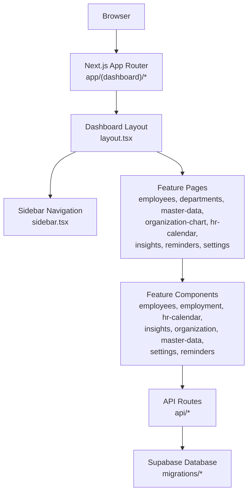

**Diagram sources**
- [layout.tsx](file://apps/hr-suite/app/(dashboard)/layout.tsx)
- [sidebar.tsx](file://apps/hr-suite/components/layout/sidebar.tsx)
- [page.tsx](file://apps/hr-suite/app/(dashboard)/workforce/page.tsx)

## Detailed Component Analysis

### Employee Management
- Employees Page: Entry point for listing and managing employees.
- Employee List: Displays employees with filters and actions.
- Employee Dashboard: Provides per-employee overview and quick actions.
- Employment Create Form: Captures employment details and initiates lifecycle.
- Employment Timeline: Visualizes employment history and changes.

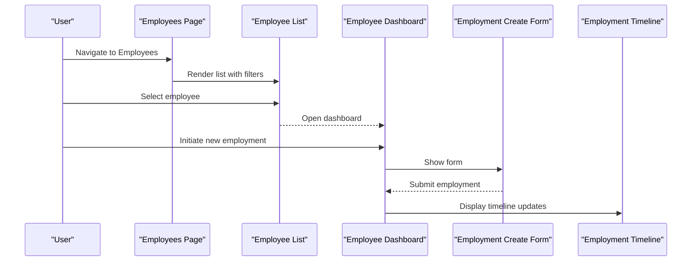

**Diagram sources**
- [employees-page.tsx](file://apps/hr-suite/app/(dashboard)/employees/page.tsx)
- [employee-list.tsx](file://apps/hr-suite/components/employees/employee-list.tsx)
- [employee-dashboard.tsx](file://apps/hr-suite/components/employees/employee-dashboard.tsx)
- [employment-create-form.tsx](file://apps/hr-suite/components/employment/employment-create-form.tsx)
- [employment-timeline.tsx](file://apps/hr-suite/components/employment/employment-timeline.tsx)

**Section sources**
- [employees-page.tsx](file://apps/hr-suite/app/(dashboard)/employees/page.tsx)
- [employee-list.tsx](file://apps/hr-suite/components/employees/employee-list.tsx)
- [employee-dashboard.tsx](file://apps/hr-suite/components/employees/employee-dashboard.tsx)
- [employment-create-form.tsx](file://apps/hr-suite/components/employment/employment-create-form.tsx)
- [employment-timeline.tsx](file://apps/hr-suite/components/employment/employment-timeline.tsx)

### Leave and Absence Configuration
- Absence Settings Form: Configures absence rules and policies.
- Leave Catalog Page: Manages leave types and accrual rules.

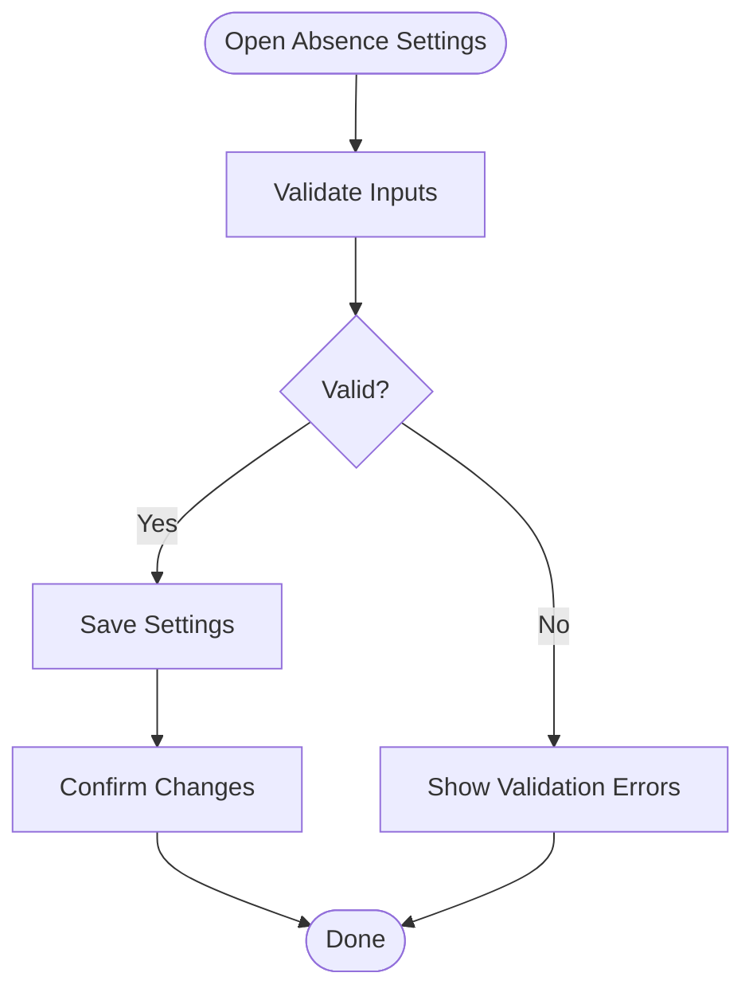

**Diagram sources**
- [absence-settings-form.tsx](file://apps/hr-suite/components/settings/absence-settings-form.tsx)
- [leave-catalog-page.tsx](file://apps/hr-suite/components/leave/leave-catalog-page.tsx)

**Section sources**
- [absence-settings-form.tsx](file://apps/hr-suite/components/settings/absence-settings-form.tsx)
- [leave-catalog-page.tsx](file://apps/hr-suite/components/leave/leave-catalog-page.tsx)

### Organization Structure
- Departments Page: Manage departments and create new ones.
- Role Assignment Manager: Assign roles to users or departments.
- Authorization Manager: Configure permissions and scopes.

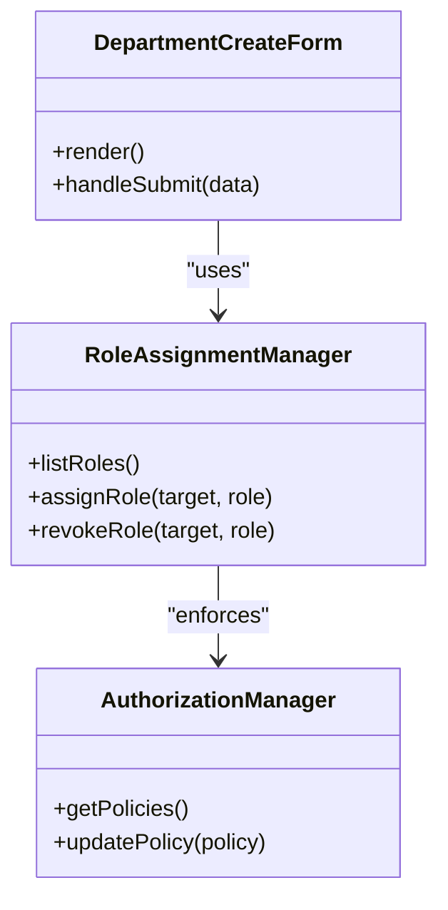

**Diagram sources**
- [department-create-form.tsx](file://apps/hr-suite/components/organization/department-create-form.tsx)
- [role-assignment-manager.tsx](file://apps/hr-suite/components/organization/role-assignment-manager.tsx)
- [authorization-manager.tsx](file://apps/hr-suite/components/organization/authorization-manager.tsx)

**Section sources**
- [departments-page.tsx](file://apps/hr-suite/app/(dashboard)/departments/page.tsx)
- [department-create-form.tsx](file://apps/hr-suite/components/organization/department-create-form.tsx)
- [role-assignment-manager.tsx](file://apps/hr-suite/components/organization/role-assignment-manager.tsx)
- [authorization-manager.tsx](file://apps/hr-suite/components/organization/authorization-manager.tsx)

### Master Data Management
- Job Catalog Manager: Define and manage job roles and descriptions.
- Salary Scale Manager: Configure salary bands and progression.
- End Reason Manager: Maintain termination and end reasons.

```mermaid
graph LR
JobCatalog["Job Catalog Manager"]
SalaryScale["Salary Scale Manager"]
EndReason["End Reason Manager"]
JobCatalog --> SalaryScale : "references"
EndReason --> JobCatalog : "links"
```

**Diagram sources**
- [job-catalog-manager.tsx](file://apps/hr-suite/components/master-data/job-catalog-manager.tsx)
- [salary-scale-manager.tsx](file://apps/hr-suite/components/master-data/salary-scale-manager.tsx)
- [end-reason-manager.tsx](file://apps/hr-suite/components/master-data/end-reason-manager.tsx)

**Section sources**
- [master-data-page.tsx](file://apps/hr-suite/app/(dashboard)/master-data/page.tsx)
- [job-catalog-manager.tsx](file://apps/hr-suite/components/master-data/job-catalog-manager.tsx)
- [salary-scale-manager.tsx](file://apps/hr-suite/components/master-data/salary-scale-manager.tsx)
- [end-reason-manager.tsx](file://apps/hr-suite/components/master-data/end-reason-manager.tsx)

### Organization Chart
- Org Chart Canvas: Interactive visualization of organizational hierarchy.
- Org Chart Explorer: Navigation and filtering within the org chart.

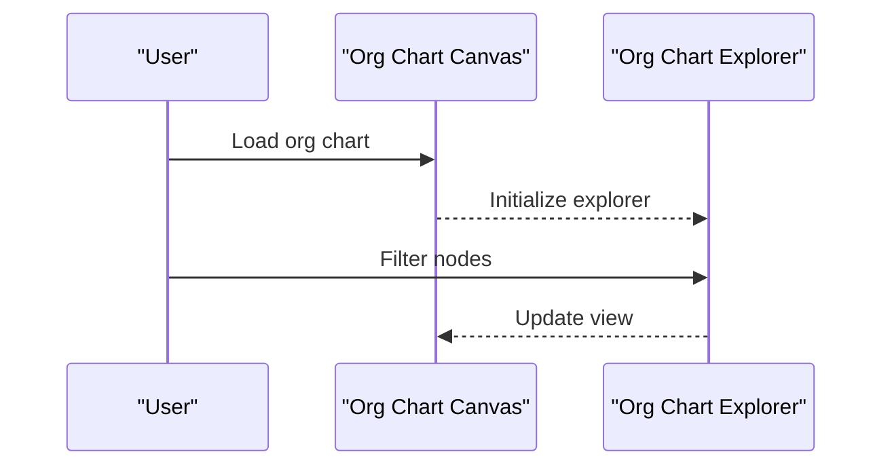

**Diagram sources**
- [organization-chart-canvas.tsx](file://apps/hr-suite/components/organization-chart/organization-chart-canvas.tsx)
- [organization-chart-explorer.tsx](file://apps/hr-suite/components/organization-chart/organization-chart-explorer.tsx)

**Section sources**
- [organization-chart-canvas.tsx](file://apps/hr-suite/components/organization-chart/organization-chart-canvas.tsx)
- [organization-chart-explorer.tsx](file://apps/hr-suite/components/organization-chart/organization-chart-explorer.tsx)

### HR Calendar
- HR Calendar Page: Main entry for calendar features.
- HR Month Calendar: Monthly view with leave and absence events.

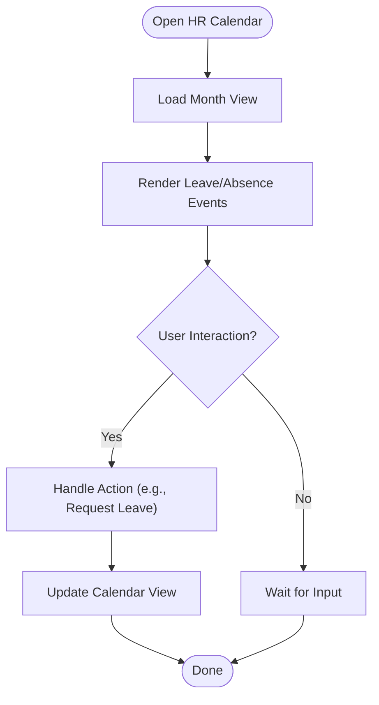

**Diagram sources**
- [hr-calendar-page.tsx](file://apps/hr-suite/app/(dashboard)/hr-calendar/page.tsx)
- [hr-month-calendar.tsx](file://apps/hr-suite/components/hr-calendar/hr-month-calendar.tsx)

**Section sources**
- [hr-calendar-page.tsx](file://apps/hr-suite/app/(dashboard)/hr-calendar/page.tsx)
- [hr-month-calendar.tsx](file://apps/hr-suite/components/hr-calendar/hr-month-calendar.tsx)

### Insights and Reports
- Insights Workspace: Aggregates reports and widgets.
- Absence Report: Analyzes absence trends.
- Frequent Absence Report: Identifies frequent absentees.
- Upcoming Events Report: Shows upcoming anniversaries and events.

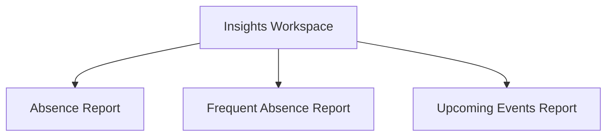

**Diagram sources**
- [insights-workspace.tsx](file://apps/hr-suite/components/insights/insights-workspace.tsx)
- [absence-report.tsx](file://apps/hr-suite/components/insights/absence-report.tsx)
- [frequent-absence-report.tsx](file://apps/hr-suite/components/insights/frequent-absence-report.tsx)
- [upcoming-events-report.tsx](file://apps/hr-suite/components/insights/upcoming-events-report.tsx)

**Section sources**
- [insights-workspace.tsx](file://apps/hr-suite/components/insights/insights-workspace.tsx)
- [absence-report.tsx](file://apps/hr-suite/components/insights/absence-report.tsx)
- [frequent-absence-report.tsx](file://apps/hr-suite/components/insights/frequent-absence-report.tsx)
- [upcoming-events-report.tsx](file://apps/hr-suite/components/insights/upcoming-events-report.tsx)

### Reminders and Time Hub
- Reminder Center: Central hub for managing reminders.
- Time Hub: Integrates clock-in/out and time tracking.

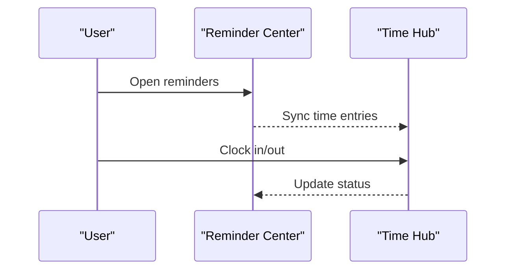

**Diagram sources**
- [reminder-center.tsx](file://apps/hr-suite/components/reminders/reminder-center.tsx)
- [time-hub.tsx](file://apps/hr-suite/components/reminders/time-hub.tsx)

**Section sources**
- [reminders-page.tsx](file://apps/hr-suite/app/(dashboard)/reminders/page.tsx)
- [reminder-center.tsx](file://apps/hr-suite/components/reminders/reminder-center.tsx)
- [time-hub.tsx](file://apps/hr-suite/components/reminders/time-hub.tsx)

### Settings and Preferences
- Personal Settings: User preferences and profile options.
- Module Settings: Toggle modules and configure features.
- Menu Order Form: Customize navigation order.
- Company Branding Panel: Set branding elements.
- Holidays Settings: Manage holiday calendars.
- Employment Contract Settings: Configure contract templates and rules.
- Star Performer Manager: Manage star performer criteria.
- Star Performer Tag Manager: Organize tags for recognition.

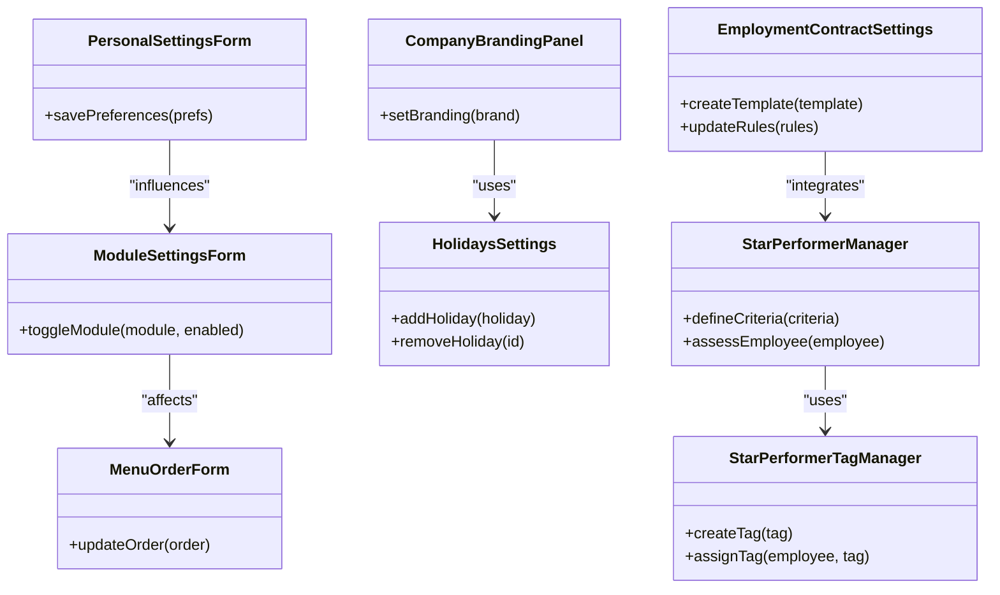

**Diagram sources**
- [personal-settings-form.tsx](file://apps/hr-suite/components/settings/personal-settings-form.tsx)
- [module-settings-form.tsx](file://apps/hr-suite/components/settings/module-settings-form.tsx)
- [menu-order-form.tsx](file://apps/hr-suite/components/settings/menu-order-form.tsx)
- [company-branding-panel.tsx](file://apps/hr-suite/components/settings/company-branding-panel.tsx)
- [holidays-settings.tsx](file://apps/hr-suite/components/settings/holidays-settings.tsx)
- [employment-contract-settings.tsx](file://apps/hr-suite/components/settings/employment-contract-settings.tsx)
- [star-performer-manager.tsx](file://apps/hr-suite/components/settings/star-performer-manager.tsx)
- [star-performer-tag-manager.tsx](file://apps/hr-suite/components/settings/star-performer-tag-manager.tsx)

**Section sources**
- [personal-settings-form.tsx](file://apps/hr-suite/components/settings/personal-settings-form.tsx)
- [module-settings-form.tsx](file://apps/hr-suite/components/settings/module-settings-form.tsx)
- [menu-order-form.tsx](file://apps/hr-suite/components/settings/menu-order-form.tsx)
- [company-branding-panel.tsx](file://apps/hr-suite/components/settings/company-branding-panel.tsx)
- [holidays-settings.tsx](file://apps/hr-suite/components/settings/holidays-settings.tsx)
- [employment-contract-settings.tsx](file://apps/hr-suite/components/settings/employment-contract-settings.tsx)
- [star-performer-manager.tsx](file://apps/hr-suite/components/settings/star-performer-manager.tsx)
- [star-performer-tag-manager.tsx](file://apps/hr-suite/components/settings/star-performer-tag-manager.tsx)

## Dependency Analysis
The workforce interface depends on Next.js routing, component composition, and Supabase for data persistence. Pages import components, which may call API routes or direct database clients. Migrations ensure schema consistency.

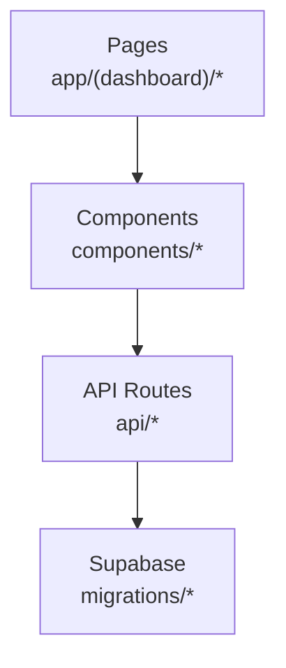

**Diagram sources**
- [page.tsx](file://apps/hr-suite/app/(dashboard)/workforce/page.tsx)
- [package.json](file://apps/hr-suite/package.json)
- [next.config.ts](file://apps/hr-suite/next.config.ts)
- [tsconfig.json](file://apps/hr-suite/tsconfig.json)

**Section sources**
- [package.json](file://apps/hr-suite/package.json)
- [next.config.ts](file://apps/hr-suite/next.config.ts)
- [tsconfig.json](file://apps/hr-suite/tsconfig.json)

## Performance Considerations
- Lazy Loading: Use dynamic imports for heavy components like org charts and calendars.
- Data Fetching: Prefer server-side rendering or streaming where possible to reduce initial load.
- Caching: Implement client-side caching for frequently accessed master data.
- Indexing: Ensure database indexes align with query patterns in migrations.
- Bundle Size: Monitor and optimize bundle size by removing unused dependencies.

[No sources needed since this section provides general guidance]

## Troubleshooting Guide
- Authentication Issues: Verify user sessions and RBAC policies in authorization manager.
- Data Sync Problems: Check API route responses and Supabase client configurations.
- Form Validation Errors: Review validation schemas in forms and error messages.
- Calendar Rendering: Inspect event data structures and date parsing.
- Insight Reports: Validate data aggregation queries and report parameters.

**Section sources**
- [authorization-manager.tsx](file://apps/hr-suite/components/organization/authorization-manager.tsx)
- [absence-settings-form.tsx](file://apps/hr-suite/components/settings/absence-settings-form.tsx)
- [hr-month-calendar.tsx](file://apps/hr-suite/components/hr-calendar/hr-month-calendar.tsx)
- [insights-workspace.tsx](file://apps/hr-suite/components/insights/insights-workspace.tsx)

## Conclusion
The Workforce Management Interface in LiquidHR provides a comprehensive suite of tools for managing employees, employment lifecycles, leave and absence, organizational structure, master data, insights, reminders, and settings. Its feature-based architecture ensures modularity and scalability, while Supabase integration guarantees robust data management. By following the outlined components and workflows, teams can effectively extend and maintain the system.

[No sources needed since this section summarizes without analyzing specific files]